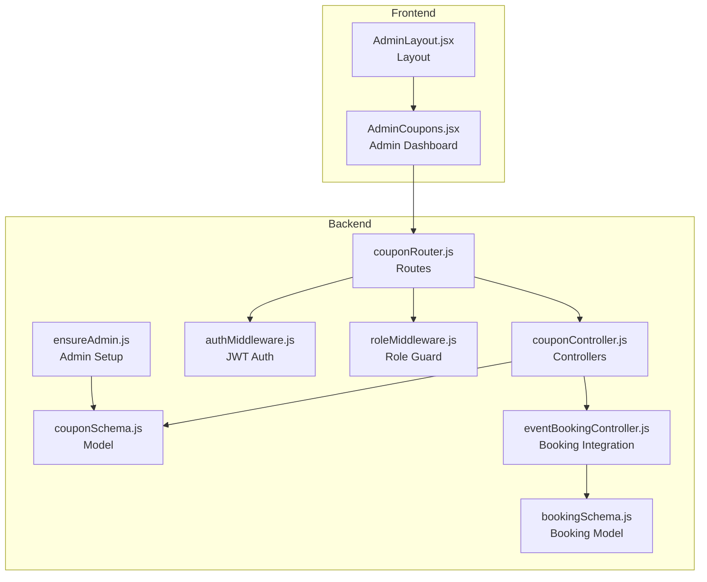
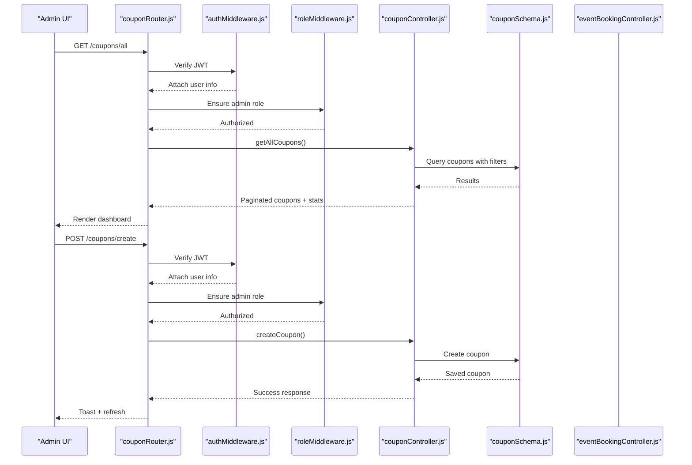
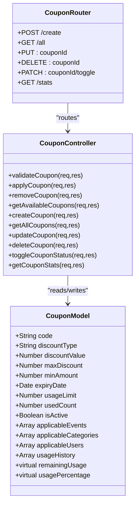
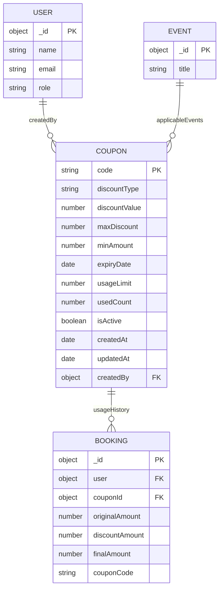
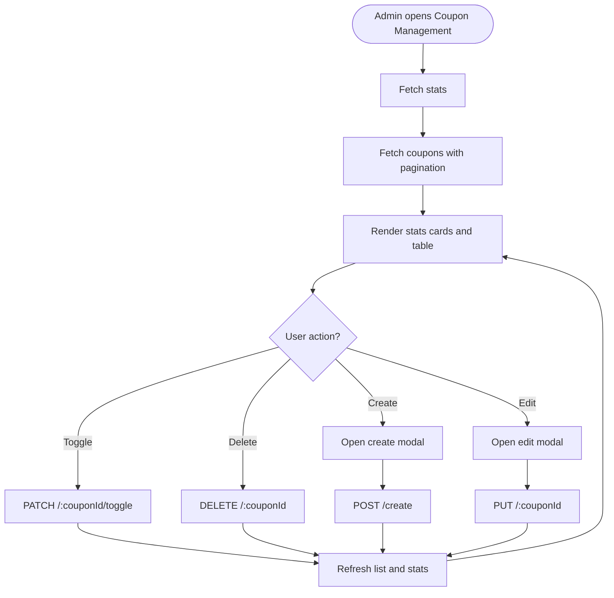
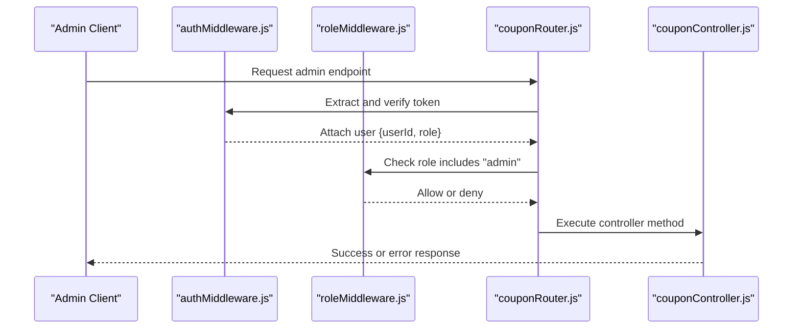
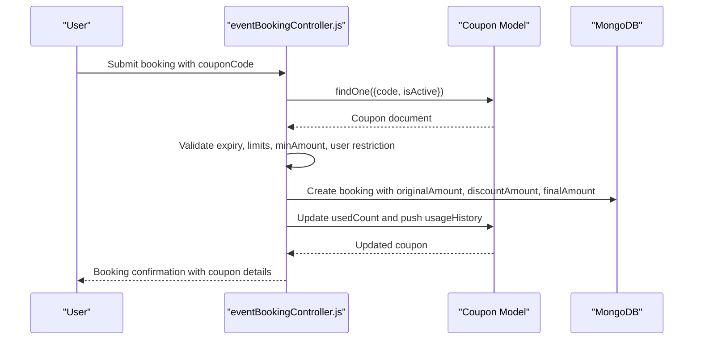
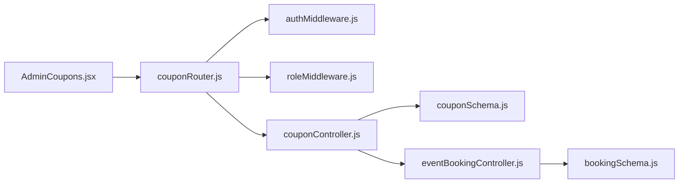

# Coupon Administration Dashboard

<cite>
**Referenced Files in This Document**
- [couponController.js](file://backend/controller/couponController.js)
- [couponSchema.js](file://backend/models/couponSchema.js)
- [couponRouter.js](file://backend/router/couponRouter.js)
- [AdminCoupons.jsx](file://frontend/src/pages/dashboards/AdminCoupons.jsx)
- [AdminLayout.jsx](file://frontend/src/components/admin/AdminLayout.jsx)
- [roleMiddleware.js](file://backend/middleware/roleMiddleware.js)
- [authMiddleware.js](file://backend/middleware/authMiddleware.js)
- [ensureAdmin.js](file://backend/util/ensureAdmin.js)
- [eventBookingController.js](file://backend/controller/eventBookingController.js)
- [bookingSchema.js](file://backend/models/bookingSchema.js)
- [COUPON_SYSTEM_IMPLEMENTATION_SUMMARY.md](file://COUPON_SYSTEM_IMPLEMENTATION_SUMMARY.md)
- [COUPON_SYSTEM_VERIFICATION_AND_FIXES.md](file://COUPON_SYSTEM_VERIFICATION_AND_FIXES.md)
</cite>

## Table of Contents
1. [Introduction](#introduction)
2. [Project Structure](#project-structure)
3. [Core Components](#core-components)
4. [Architecture Overview](#architecture-overview)
5. [Detailed Component Analysis](#detailed-component-analysis)
6. [Dependency Analysis](#dependency-analysis)
7. [Performance Considerations](#performance-considerations)
8. [Troubleshooting Guide](#troubleshooting-guide)
9. [Conclusion](#conclusion)
10. [Appendices](#appendices)

## Introduction
This document provides comprehensive documentation for the coupon administration dashboard functionality. It covers admin-only features including coupon creation, bulk operations, listing with filtering and pagination, status management, and usage statistics visualization. It also explains the admin interface components for coupon CRUD operations, bulk actions, search and filtering capabilities, and analytics presentation. The document details the coupon lifecycle from creation to deactivation, usage tracking, and performance metrics, along with administrative security measures, audit trails, and compliance considerations. Finally, it offers guidelines for effective coupon campaign management and troubleshooting common administrative issues.

## Project Structure
The coupon administration dashboard spans backend and frontend components:
- Backend: Express routes, controllers, models, middleware, and utilities
- Frontend: Admin layout, coupon management page, and reusable components
- Integration: Coupon usage is embedded in the booking workflow for both ticketed and full-service events

**Diagram sources**
- [couponRouter.js:1-37](file://backend/router/couponRouter.js#L1-L37)
- [couponController.js:1-757](file://backend/controller/couponController.js#L1-L757)
- [couponSchema.js:1-123](file://backend/models/couponSchema.js#L1-L123)
- [authMiddleware.js:1-17](file://backend/middleware/authMiddleware.js#L1-L17)
- [roleMiddleware.js:1-9](file://backend/middleware/roleMiddleware.js#L1-L9)
- [ensureAdmin.js:1-35](file://backend/util/ensureAdmin.js#L1-L35)
- [eventBookingController.js:1-599](file://backend/controller/eventBookingController.js#L1-L599)
- [bookingSchema.js:1-53](file://backend/models/bookingSchema.js#L1-L53)
- [AdminLayout.jsx:1-29](file://frontend/src/components/admin/AdminLayout.jsx#L1-L29)
- [AdminCoupons.jsx:1-690](file://frontend/src/pages/dashboards/AdminCoupons.jsx#L1-L690)

**Section sources**
- [couponRouter.js:1-37](file://backend/router/couponRouter.js#L1-L37)
- [AdminCoupons.jsx:1-690](file://frontend/src/pages/dashboards/AdminCoupons.jsx#L1-L690)
- [AdminLayout.jsx:1-29](file://frontend/src/components/admin/AdminLayout.jsx#L1-L29)

## Core Components
- Backend coupon management API with admin-only endpoints for create, read, update, delete, toggle status, and statistics
- Coupon model with fields for discount types, limits, usage tracking, and restrictions
- Frontend admin dashboard for viewing coupons, managing them, and visualizing usage statistics
- Security middleware enforcing JWT authentication and admin role checks
- Integration with booking workflow to apply coupons during event booking

Key capabilities:
- Admin-only coupon CRUD and status management
- Filtering and pagination for coupon listing
- Usage statistics aggregation and display
- Real-time coupon validation and discount calculation
- Audit trail via usage history and created-by tracking

**Section sources**
- [couponController.js:388-757](file://backend/controller/couponController.js#L388-L757)
- [couponSchema.js:1-123](file://backend/models/couponSchema.js#L1-L123)
- [AdminCoupons.jsx:1-690](file://frontend/src/pages/dashboards/AdminCoupons.jsx#L1-L690)
- [roleMiddleware.js:1-9](file://backend/middleware/roleMiddleware.js#L1-L9)
- [authMiddleware.js:1-17](file://backend/middleware/authMiddleware.js#L1-L17)

## Architecture Overview
The coupon administration dashboard follows a layered architecture:
- Presentation layer: Admin dashboard UI
- Application layer: Route handlers and controllers
- Domain layer: Coupon business logic and validation
- Persistence layer: MongoDB models and indexes
- Security layer: Authentication and role-based access control

**Diagram sources**
- [couponRouter.js:27-33](file://backend/router/couponRouter.js#L27-L33)
- [authMiddleware.js:1-17](file://backend/middleware/authMiddleware.js#L1-L17)
- [roleMiddleware.js:1-9](file://backend/middleware/roleMiddleware.js#L1-L9)
- [couponController.js:507-656](file://backend/controller/couponController.js#L507-L656)
- [couponSchema.js:1-123](file://backend/models/couponSchema.js#L1-L123)
- [AdminCoupons.jsx:40-74](file://frontend/src/pages/dashboards/AdminCoupons.jsx#L40-L74)

## Detailed Component Analysis

### Backend Coupon Management API
The backend provides comprehensive admin-only endpoints:
- Create coupon: validates discount type/value, expiry date, and uniqueness
- List coupons: supports pagination, status filtering, and text search
- Update coupon: enforces immutability of coupon codes for used coupons
- Delete coupon: prevents deletion of used coupons
- Toggle status: activates/deactivates coupons
- Get statistics: aggregates totals, active/expired counts, usage, and discount amounts

**Diagram sources**
- [couponController.js:1-757](file://backend/controller/couponController.js#L1-L757)
- [couponSchema.js:1-123](file://backend/models/couponSchema.js#L1-L123)
- [couponRouter.js:1-37](file://backend/router/couponRouter.js#L1-L37)

**Section sources**
- [couponController.js:388-757](file://backend/controller/couponController.js#L388-L757)
- [couponSchema.js:1-123](file://backend/models/couponSchema.js#L1-L123)
- [couponRouter.js:27-33](file://backend/router/couponRouter.js#L27-L33)

### Coupon Model and Data Flow
The coupon model defines fields for discount configuration, usage limits, activity status, and usage history. It includes virtual fields for remaining usage and usage percentage, and indexes for efficient querying. Usage history tracks user, booking, timestamp, and discount amount for auditability.

**Diagram sources**
- [couponSchema.js:1-123](file://backend/models/couponSchema.js#L1-L123)
- [bookingSchema.js:1-53](file://backend/models/bookingSchema.js#L1-L53)

**Section sources**
- [couponSchema.js:1-123](file://backend/models/couponSchema.js#L1-L123)
- [bookingSchema.js:1-53](file://backend/models/bookingSchema.js#L1-L53)

### Frontend Admin Dashboard
The admin dashboard provides:
- Statistics cards: total coupons, active coupons, total usage, total discount
- Coupon listing table: code, discount type/value, usage progress, expiry, status badges, action buttons
- Create/edit modals with validation and constraints (e.g., immutable code for used coupons)
- Action buttons: edit, activate/deactivate, delete unused coupons
- Real-time API integration for fetching coupons and stats, and performing CRUD operations

**Diagram sources**
- [AdminCoupons.jsx:40-153](file://frontend/src/pages/dashboards/AdminCoupons.jsx#L40-L153)
- [AdminCoupons.jsx:394-685](file://frontend/src/pages/dashboards/AdminCoupons.jsx#L394-L685)

**Section sources**
- [AdminCoupons.jsx:1-690](file://frontend/src/pages/dashboards/AdminCoupons.jsx#L1-L690)
- [AdminLayout.jsx:1-29](file://frontend/src/components/admin/AdminLayout.jsx#L1-L29)

### Security and Access Control
Administrative security is enforced through:
- JWT authentication middleware verifying tokens in Authorization headers
- Role-based access control ensuring only users with admin role can access admin endpoints
- Admin user provisioning utility to create or reset admin credentials

**Diagram sources**
- [authMiddleware.js:1-17](file://backend/middleware/authMiddleware.js#L1-L17)
- [roleMiddleware.js:1-9](file://backend/middleware/roleMiddleware.js#L1-L9)
- [couponRouter.js:27-33](file://backend/router/couponRouter.js#L27-L33)

**Section sources**
- [authMiddleware.js:1-17](file://backend/middleware/authMiddleware.js#L1-L17)
- [roleMiddleware.js:1-9](file://backend/middleware/roleMiddleware.js#L1-L9)
- [ensureAdmin.js:1-35](file://backend/util/ensureAdmin.js#L1-L35)

### Coupon Lifecycle and Usage Tracking
Coupon lifecycle integrates with the booking workflow:
- Creation: Admin sets discount type/value, limits, expiry, and optional restrictions
- Validation: During booking, coupon is validated against expiry, usage limits, minimum amount, user restrictions, and event/category applicability
- Application: Discount is calculated and applied to the booking; coupon usage is incremented and recorded in usage history
- Status management: Admin can activate/deactivate coupons; expired coupons are automatically considered inactive
- Reporting: Statistics show total coupons, active/expired counts, total usage, and total discount given

**Diagram sources**
- [eventBookingController.js:148-283](file://backend/controller/eventBookingController.js#L148-L283)
- [eventBookingController.js:393-543](file://backend/controller/eventBookingController.js#L393-L543)
- [couponSchema.js:76-91](file://backend/models/couponSchema.js#L76-L91)

**Section sources**
- [eventBookingController.js:148-283](file://backend/controller/eventBookingController.js#L148-L283)
- [eventBookingController.js:393-543](file://backend/controller/eventBookingController.js#L393-L543)
- [couponSchema.js:76-91](file://backend/models/couponSchema.js#L76-L91)

### Administrative Security Measures, Audit Trails, and Compliance
- Admin-only endpoints: All coupon management routes are protected by role middleware
- Audit trail: Usage history captures user, booking, timestamp, and discount amount for each application
- Created-by tracking: Each coupon records the admin who created it
- Compliance considerations:
  - Unique coupon codes enforced at database level
  - Usage limits prevent overspending
  - Expiry dates ensure time-bound promotions
  - Restrictions on events/categories/users enable targeted campaigns
  - Immutable code for used coupons prevents manipulation

**Section sources**
- [couponRouter.js:27-33](file://backend/router/couponRouter.js#L27-L33)
- [couponSchema.js:58-91](file://backend/models/couponSchema.js#L58-L91)
- [couponController.js:584-590](file://backend/controller/couponController.js#L584-L590)

### Guidelines for Effective Coupon Campaign Management
- Plan campaigns with clear objectives: define discount types, caps, minimum spend, and duration
- Use restrictions strategically: target specific events, categories, or user segments
- Monitor usage: track total usage and discount amounts to assess campaign effectiveness
- Maintain control: keep coupons active only during promotional periods; deactivate expired or underperforming ones
- Communicate clearly: provide descriptions and terms to users; ensure front-end displays pricing breakdown

**Section sources**
- [COUPON_SYSTEM_IMPLEMENTATION_SUMMARY.md:75-99](file://COUPON_SYSTEM_IMPLEMENTATION_SUMMARY.md#L75-L99)
- [AdminCoupons.jsx:225-266](file://frontend/src/pages/dashboards/AdminCoupons.jsx#L225-L266)

## Dependency Analysis
The coupon administration dashboard exhibits strong separation of concerns:
- Routes depend on middleware for authentication and authorization
- Controllers depend on models for data access and business logic
- Frontend depends on backend APIs for data and actions
- Booking controllers integrate coupon logic to enforce validation and update usage

**Diagram sources**
- [AdminCoupons.jsx:1-690](file://frontend/src/pages/dashboards/AdminCoupons.jsx#L1-L690)
- [couponRouter.js:1-37](file://backend/router/couponRouter.js#L1-L37)
- [couponController.js:1-757](file://backend/controller/couponController.js#L1-L757)
- [couponSchema.js:1-123](file://backend/models/couponSchema.js#L1-L123)
- [eventBookingController.js:1-599](file://backend/controller/eventBookingController.js#L1-L599)
- [bookingSchema.js:1-53](file://backend/models/bookingSchema.js#L1-L53)

**Section sources**
- [couponRouter.js:1-37](file://backend/router/couponRouter.js#L1-L37)
- [couponController.js:1-757](file://backend/controller/couponController.js#L1-L757)
- [AdminCoupons.jsx:1-690](file://frontend/src/pages/dashboards/AdminCoupons.jsx#L1-L690)

## Performance Considerations
- Database indexing: Compound indexes on isActive and expiryDate, and single-field indexes on code and createdBy improve query performance for listing and filtering
- Aggregation pipeline: Statistics computation uses aggregation to minimize round trips and reduce payload sizes
- Pagination: Backend enforces pagination limits and computes total pages for efficient rendering
- Frontend caching: Local state updates after successful API calls avoid unnecessary re-fetches

Recommendations:
- Monitor slow queries using database profiling
- Consider adding text search indexes for improved search performance
- Batch operations for bulk coupon creation or status updates (future enhancement)

**Section sources**
- [couponSchema.js:110-114](file://backend/models/couponSchema.js#L110-L114)
- [couponController.js:694-757](file://backend/controller/couponController.js#L694-L757)
- [couponController.js:507-565](file://backend/controller/couponController.js#L507-L565)

## Troubleshooting Guide
Common issues and resolutions:
- Unauthorized access: Ensure Authorization header contains a valid Bearer token; verify JWT_SECRET environment variable
- Forbidden access: Confirm user role is admin; check ensureAdmin utility for admin creation/reset
- Coupon not found: Verify coupon ID exists and belongs to the current admin
- Cannot update code of used coupon: Used coupons cannot have their code changed; adjust usageLimit or create a new coupon
- Cannot delete used coupon: Delete is blocked for coupons with usedCount > 0
- Validation errors: Check discount type/value ranges, expiry date future-dated, and usageLimit ≥ usedCount
- API routing issues: Confirm coupon router is mounted at the expected base path

Verification checklist:
- Backend API responses for coupon endpoints
- Frontend console for JavaScript errors
- Coupon router loading in the main application
- Simple test coupon creation and application

**Section sources**
- [authMiddleware.js:1-17](file://backend/middleware/authMiddleware.js#L1-L17)
- [roleMiddleware.js:1-9](file://backend/middleware/roleMiddleware.js#L1-L9)
- [ensureAdmin.js:1-35](file://backend/util/ensureAdmin.js#L1-L35)
- [couponController.js:584-590](file://backend/controller/couponController.js#L584-L590)
- [couponController.js:632-638](file://backend/controller/couponController.js#L632-L638)
- [COUPON_SYSTEM_VERIFICATION_AND_FIXES.md:171-215](file://COUPON_SYSTEM_VERIFICATION_AND_FIXES.md#L171-L215)

## Conclusion
The coupon administration dashboard provides a robust, secure, and user-friendly solution for managing promotional discounts. Admins can create, monitor, and control coupons with comprehensive validation, usage tracking, and statistics. The system integrates seamlessly with the booking workflow, ensuring accurate discount application and auditability. With proper security measures, clear guidelines, and troubleshooting procedures, administrators can effectively run targeted coupon campaigns while maintaining compliance and operational excellence.

## Appendices

### API Endpoints Summary
- User endpoints: validate, apply, remove, available coupons
- Admin endpoints: create, list (with pagination and filters), update, delete, toggle status, statistics

**Section sources**
- [couponRouter.js:21-33](file://backend/router/couponRouter.js#L21-L33)
- [COUPON_SYSTEM_IMPLEMENTATION_SUMMARY.md:126-139](file://COUPON_SYSTEM_IMPLEMENTATION_SUMMARY.md#L126-L139)