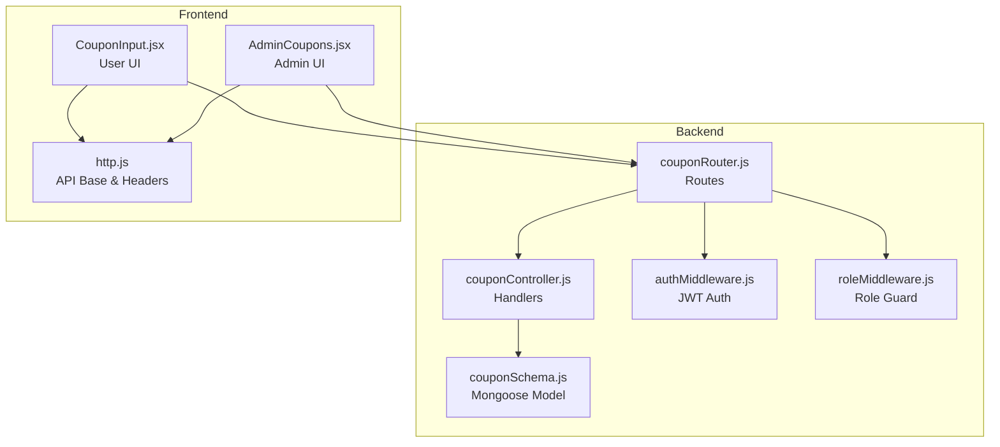
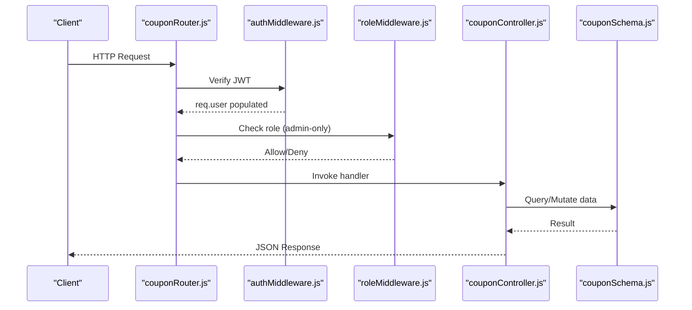
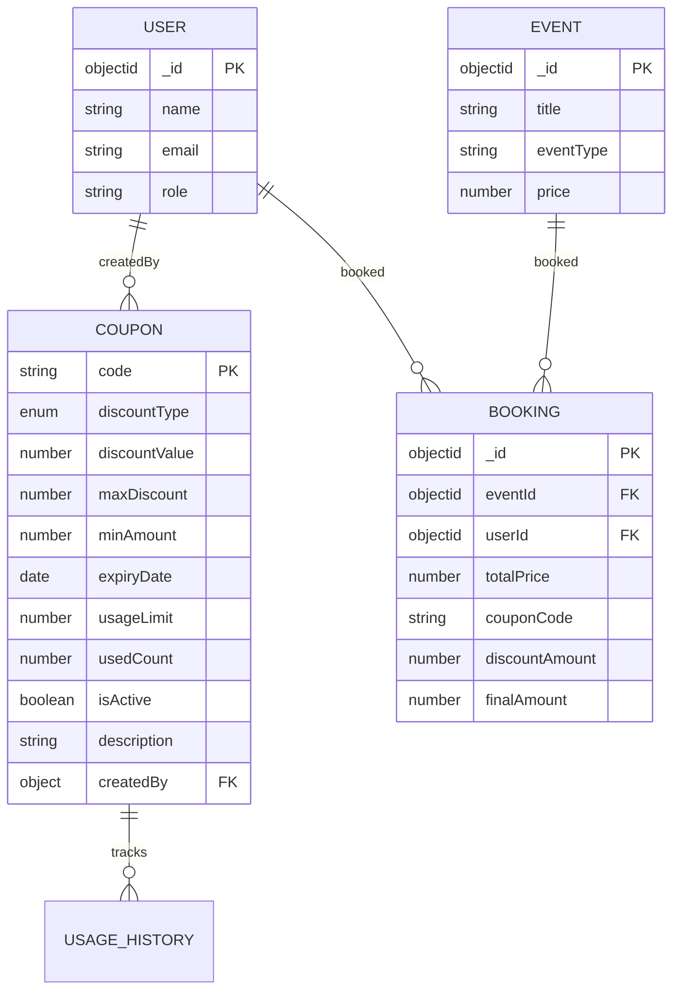
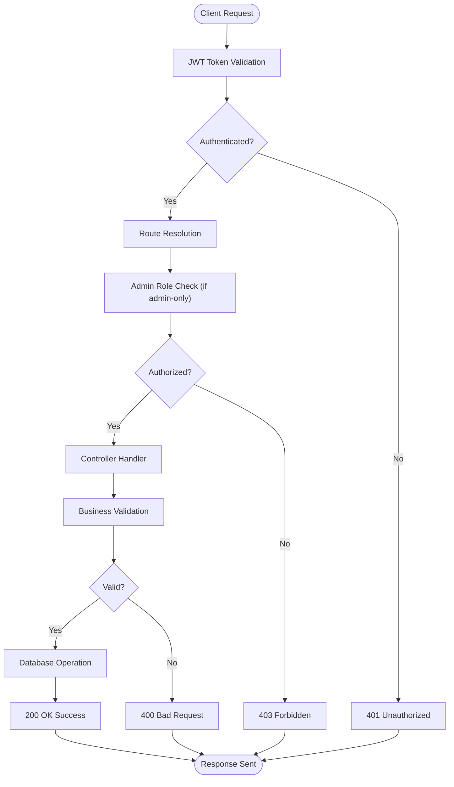
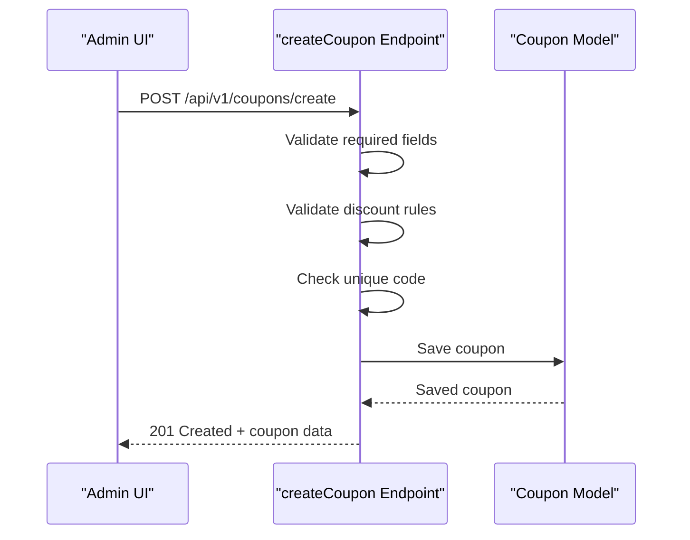
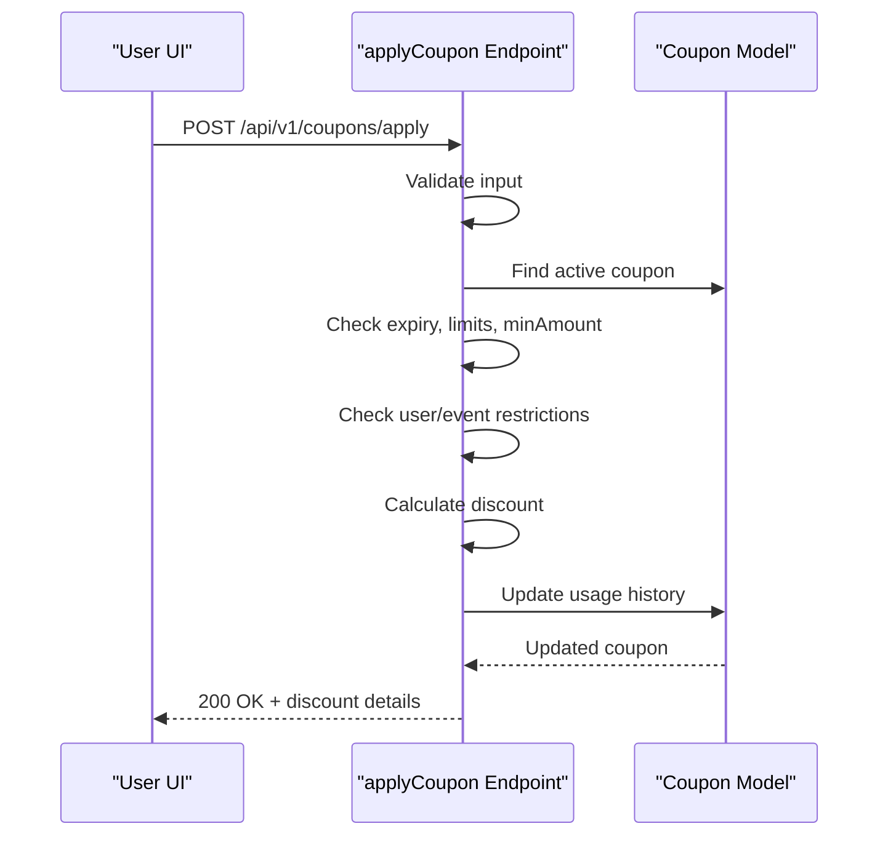
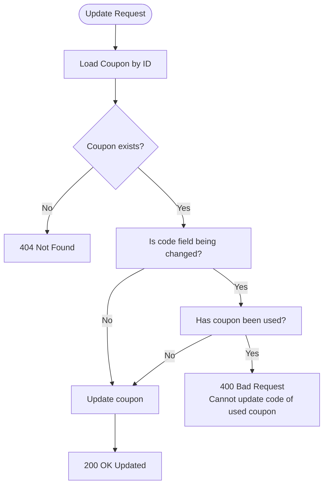
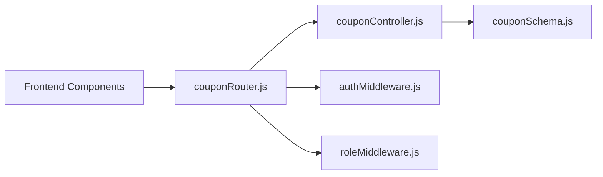

# Coupon Management APIs

<cite>
**Referenced Files in This Document**
- [couponRouter.js](file://backend/router/couponRouter.js)
- [couponController.js](file://backend/controller/couponController.js)
- [couponSchema.js](file://backend/models/couponSchema.js)
- [authMiddleware.js](file://backend/middleware/authMiddleware.js)
- [roleMiddleware.js](file://backend/middleware/roleMiddleware.js)
- [CouponInput.jsx](file://frontend/src/components/CouponInput.jsx)
- [AdminCoupons.jsx](file://frontend/src/pages/dashboards/AdminCoupons.jsx)
- [http.js](file://frontend/src/lib/http.js)
- [test-coupon-api.js](file://backend/test-coupon-api.js)
- [test-full-coupon-workflow.js](file://backend/test-full-coupon-workflow.js)
</cite>

## Table of Contents
1. [Introduction](#introduction)
2. [Project Structure](#project-structure)
3. [Core Components](#core-components)
4. [Architecture Overview](#architecture-overview)
5. [Detailed Component Analysis](#detailed-component-analysis)
6. [Dependency Analysis](#dependency-analysis)
7. [Performance Considerations](#performance-considerations)
8. [Troubleshooting Guide](#troubleshooting-guide)
9. [Conclusion](#conclusion)
10. [Appendices](#appendices)

## Introduction
This document provides comprehensive API documentation for the coupon management system. It covers all RESTful endpoints for validating, applying, removing, and managing coupons, along with detailed request/response schemas, authentication and authorization requirements, validation rules, error handling, and integration patterns with frontend components.

## Project Structure
The coupon system is implemented as a backend module with dedicated router, controller, model, and middleware components. Frontend integration is handled through React components that consume the coupon endpoints.

**Diagram sources**
- [couponRouter.js:1-37](file://backend/router/couponRouter.js#L1-L37)
- [couponController.js:1-757](file://backend/controller/couponController.js#L1-L757)
- [couponSchema.js:1-123](file://backend/models/couponSchema.js#L1-L123)
- [authMiddleware.js:1-17](file://backend/middleware/authMiddleware.js#L1-L17)
- [roleMiddleware.js:1-9](file://backend/middleware/roleMiddleware.js#L1-L9)
- [CouponInput.jsx:1-166](file://frontend/src/components/CouponInput.jsx#L1-L166)
- [AdminCoupons.jsx:1-690](file://frontend/src/pages/dashboards/AdminCoupons.jsx#L1-L690)
- [http.js:1-5](file://frontend/src/lib/http.js#L1-L5)

**Section sources**
- [couponRouter.js:1-37](file://backend/router/couponRouter.js#L1-L37)
- [couponController.js:1-757](file://backend/controller/couponController.js#L1-L757)
- [couponSchema.js:1-123](file://backend/models/couponSchema.js#L1-L123)
- [authMiddleware.js:1-17](file://backend/middleware/authMiddleware.js#L1-L17)
- [roleMiddleware.js:1-9](file://backend/middleware/roleMiddleware.js#L1-L9)
- [CouponInput.jsx:1-166](file://frontend/src/components/CouponInput.jsx#L1-L166)
- [AdminCoupons.jsx:1-690](file://frontend/src/pages/dashboards/AdminCoupons.jsx#L1-L690)
- [http.js:1-5](file://frontend/src/lib/http.js#L1-L5)

## Core Components
- Router: Defines all coupon endpoints and applies authentication and role middleware.
- Controller: Implements business logic for coupon operations including validation, application, removal, listing, creation, updates, deletion, status toggling, and statistics.
- Model: Defines the coupon schema with fields for code, discount type/value, limits, restrictions, and usage history.
- Middleware: Provides JWT-based authentication and admin-role enforcement.

Key capabilities:
- User-facing: validateCoupon, applyCoupon, removeCoupon, getAvailableCoupons
- Admin-only: createCoupon, getAllCoupons, updateCoupon, deleteCoupon, toggleCouponStatus, getCouponStats

**Section sources**
- [couponRouter.js:1-37](file://backend/router/couponRouter.js#L1-L37)
- [couponController.js:1-757](file://backend/controller/couponController.js#L1-L757)
- [couponSchema.js:1-123](file://backend/models/couponSchema.js#L1-L123)
- [authMiddleware.js:1-17](file://backend/middleware/authMiddleware.js#L1-L17)
- [roleMiddleware.js:1-9](file://backend/middleware/roleMiddleware.js#L1-L9)

## Architecture Overview
The coupon API follows a layered architecture:
- HTTP Layer: Express routes define endpoints and bind to controller handlers.
- Authentication Layer: JWT token verification ensures user identity.
- Authorization Layer: Role-based access control restricts admin-only endpoints.
- Business Logic Layer: Controllers enforce coupon validation rules and calculations.
- Data Access Layer: Mongoose model persists and retrieves coupon data.

**Diagram sources**
- [couponRouter.js:1-37](file://backend/router/couponRouter.js#L1-L37)
- [authMiddleware.js:1-17](file://backend/middleware/authMiddleware.js#L1-L17)
- [roleMiddleware.js:1-9](file://backend/middleware/roleMiddleware.js#L1-L9)
- [couponController.js:1-757](file://backend/controller/couponController.js#L1-L757)
- [couponSchema.js:1-123](file://backend/models/couponSchema.js#L1-L123)

## Detailed Component Analysis

### Endpoint Catalog

#### validateCoupon
- Method: POST
- URL: /api/v1/coupons/validate
- Authentication: Required (JWT)
- Authorization: User-accessible
- Purpose: Validates a coupon code without applying it.

Request body:
- couponCode: string (required)
- amount: number (required)
- eventId: string (optional)

Validation rules:
- couponCode and amount required
- amount must be positive
- coupon must exist, be active, not expired, usage count under limit
- minAmount must be met
- user cannot reuse the same coupon
- event/user restrictions checked if configured

Success response includes coupon metadata and validation status.

**Section sources**
- [couponRouter.js:22-22](file://backend/router/couponRouter.js#L22-L22)
- [couponController.js:6-131](file://backend/controller/couponController.js#L6-L131)

#### applyCoupon
- Method: POST
- URL: /api/v1/coupons/apply
- Authentication: Required (JWT)
- Authorization: User-accessible
- Purpose: Applies a coupon and calculates discount.

Request body:
- code: string (required)
- totalAmount: number (required)
- eventId: string (optional)

Validation and calculation:
- Same preconditions as validateCoupon
- Calculates discount based on discountType (percentage/flat)
- Caps percentage discount by maxDiscount if configured
- Ensures discount does not exceed totalAmount for flat type
- Rounds discount to 2 decimals

Success response includes originalAmount, discountAmount, finalAmount, savings, and coupon details.

**Section sources**
- [couponRouter.js:23-23](file://backend/router/couponRouter.js#L23-L23)
- [couponController.js:134-285](file://backend/controller/couponController.js#L134-L285)

#### removeCoupon
- Method: POST
- URL: /api/v1/coupons/remove
- Authentication: Required (JWT)
- Authorization: User-accessible
- Purpose: Removes an applied coupon and restores original pricing.

Request body:
- totalAmount: number (required)

Success response resets discountAmount, finalAmount, and savings to zero.

**Section sources**
- [couponRouter.js:24-24](file://backend/router/couponRouter.js#L24-L24)
- [couponController.js:287-308](file://backend/controller/couponController.js#L287-L308)

#### getAvailableCoupons
- Method: GET
- URL: /api/v1/coupons/available
- Authentication: Required (JWT)
- Authorization: User-accessible
- Query parameters:
  - eventId: string (optional)
  - totalAmount: number (optional)

Filters:
- Active and not expired coupons
- Usage count below usageLimit
- Min amount threshold if provided
- Event/user restrictions respected
- Excludes coupons already used by the requesting user

Success response includes filtered coupons and total count.

**Section sources**
- [couponRouter.js:25-25](file://backend/router/couponRouter.js#L25-L25)
- [couponController.js:311-386](file://backend/controller/couponController.js#L311-L386)

#### createCoupon (Admin)
- Method: POST
- URL: /api/v1/coupons/create
- Authentication: Required (JWT)
- Authorization: Admin-only
- Request body includes:
  - code: string (required, unique, uppercase)
  - discountType: enum ["percentage","flat"] (required)
  - discountValue: number (required)
  - maxDiscount: number (optional, percentage type)
  - minAmount: number (default 0)
  - expiryDate: date (required, future)
  - usageLimit: number (required, min 1)
  - description: string (optional)
  - applicableEvents: array of event IDs (optional)
  - applicableCategories: array of category strings (optional)
  - applicableUsers: array of user IDs (optional)

Validation:
- Unique code constraint enforced
- Discount value constraints by type
- Future expiry date required
- Usage limit must be at least 1

Success response returns created coupon.

**Section sources**
- [couponRouter.js:28-28](file://backend/router/couponRouter.js#L28-L28)
- [couponController.js:388-505](file://backend/controller/couponController.js#L388-L505)
- [couponSchema.js:5-91](file://backend/models/couponSchema.js#L5-L91)

#### getAllCoupons (Admin)
- Method: GET
- URL: /api/v1/coupons/all
- Authentication: Required (JWT)
- Authorization: Admin-only
- Query parameters:
  - page: number (default 1)
  - limit: number (default 10)
  - status: enum ["active","inactive","expired"] (optional)
  - search: string (optional)

Filtering:
- Status-based filters (active/inactive/expired)
- Text search across code and description
- Pagination support

Success response includes coupons array and pagination metadata.

**Section sources**
- [couponRouter.js:29-29](file://backend/router/couponRouter.js#L29-L29)
- [couponController.js:507-565](file://backend/controller/couponController.js#L507-L565)

#### updateCoupon (Admin)
- Method: PUT
- URL: /api/v1/coupons/:couponId
- Authentication: Required (JWT)
- Authorization: Admin-only
- Path parameter:
  - couponId: string (required)
- Request body: Partial coupon fields (same as create)

Restrictions:
- Cannot modify code if coupon has been used (usedCount > 0)

Success response returns updated coupon.

**Section sources**
- [couponRouter.js:30-30](file://backend/router/couponRouter.js#L30-L30)
- [couponController.js:567-614](file://backend/controller/couponController.js#L567-L614)

#### deleteCoupon (Admin)
- Method: DELETE
- URL: /api/v1/coupons/:couponId
- Authentication: Required (JWT)
- Authorization: Admin-only
- Path parameter:
  - couponId: string (required)

Restrictions:
- Cannot delete a coupon that has been used (usedCount > 0)

Success response confirms deletion.

**Section sources**
- [couponRouter.js:31-31](file://backend/router/couponRouter.js#L31-L31)
- [couponController.js:616-656](file://backend/controller/couponController.js#L616-L656)

#### toggleCouponStatus (Admin)
- Method: PATCH
- URL: /api/v1/coupons/:couponId/toggle
- Authentication: Required (JWT)
- Authorization: Admin-only
- Path parameter:
  - couponId: string (required)

Behavior:
- Toggles isActive flag
- Persists and returns updated coupon

Success response confirms activation/deactivation.

**Section sources**
- [couponRouter.js:32-32](file://backend/router/couponRouter.js#L32-L32)
- [couponController.js:658-692](file://backend/controller/couponController.js#L658-L692)

#### getCouponStats (Admin)
- Method: GET
- URL: /api/v1/coupons/stats
- Authentication: Required (JWT)
- Authorization: Admin-only

Aggregation:
- Total coupons
- Active coupons (active and not expired)
- Expired coupons (expiryDate <= now)
- Total usage count
- Total discount given across usage history

Success response includes aggregated stats.

**Section sources**
- [couponRouter.js:33-33](file://backend/router/couponRouter.js#L33-L33)
- [couponController.js:694-757](file://backend/controller/couponController.js#L694-L757)

### Data Models

**Diagram sources**
- [couponSchema.js:1-123](file://backend/models/couponSchema.js#L1-L123)

### Validation and Error Handling

Common validation rules enforced by controllers:
- Required fields present
- Amounts positive and within bounds
- Coupon active, not expired, usage under limit
- Minimum order amount satisfied
- User-specific and event-specific restrictions
- Unique coupon code during creation
- Admin-only restrictions for sensitive operations

Error responses consistently include:
- HTTP status codes (400, 401, 403, 404, 500)
- JSON with success: false and message fields
- Some endpoints include error details in development mode

**Section sources**
- [couponController.js:16-131](file://backend/controller/couponController.js#L16-L131)
- [couponController.js:388-505](file://backend/controller/couponController.js#L388-L505)
- [couponController.js:567-656](file://backend/controller/couponController.js#L567-L656)

### Frontend Integration Patterns

#### User Experience Components
- CouponInput.jsx: Handles coupon application/removal UI, integrates with backend endpoints, and communicates with parent components via callbacks.
- AdminCoupons.jsx: Admin dashboard for coupon management, statistics display, and CRUD operations.

Integration specifics:
- Uses API_BASE constant and authHeaders(token) for authenticated requests
- Applies loading states and user feedback via toast notifications
- Manages form state and validation for admin operations

**Section sources**
- [CouponInput.jsx:19-82](file://frontend/src/components/CouponInput.jsx#L19-L82)
- [AdminCoupons.jsx:45-153](file://frontend/src/pages/dashboards/AdminCoupons.jsx#L45-L153)
- [http.js:1-5](file://frontend/src/lib/http.js#L1-L5)

## Architecture Overview

**Diagram sources**
- [authMiddleware.js:3-16](file://backend/middleware/authMiddleware.js#L3-L16)
- [roleMiddleware.js:1-9](file://backend/middleware/roleMiddleware.js#L1-L9)
- [couponController.js:16-131](file://backend/controller/couponController.js#L16-L131)

## Detailed Component Analysis

### Coupon Creation Workflow

**Diagram sources**
- [couponController.js:388-505](file://backend/controller/couponController.js#L388-L505)
- [couponSchema.js:5-91](file://backend/models/couponSchema.js#L5-L91)

### Coupon Application Flow

**Diagram sources**
- [couponController.js:134-285](file://backend/controller/couponController.js#L134-L285)
- [couponSchema.js:77-91](file://backend/models/couponSchema.js#L77-L91)

### Coupon Update Restrictions

**Diagram sources**
- [couponController.js:567-614](file://backend/controller/couponController.js#L567-L614)

## Dependency Analysis

**Diagram sources**
- [couponRouter.js:1-37](file://backend/router/couponRouter.js#L1-L37)
- [couponController.js:1-757](file://backend/controller/couponController.js#L1-L757)
- [couponSchema.js:1-123](file://backend/models/couponSchema.js#L1-L123)
- [authMiddleware.js:1-17](file://backend/middleware/authMiddleware.js#L1-L17)
- [roleMiddleware.js:1-9](file://backend/middleware/roleMiddleware.js#L1-L9)

**Section sources**
- [couponRouter.js:1-37](file://backend/router/couponRouter.js#L1-L37)
- [couponController.js:1-757](file://backend/controller/couponController.js#L1-L757)
- [couponSchema.js:1-123](file://backend/models/couponSchema.js#L1-L123)
- [authMiddleware.js:1-17](file://backend/middleware/authMiddleware.js#L1-L17)
- [roleMiddleware.js:1-9](file://backend/middleware/roleMiddleware.js#L1-L9)

## Performance Considerations
- Indexes on couponSchema improve query performance for code, status/expiry, and creator lookups.
- Aggregation pipeline in getCouponStats efficiently computes statistics server-side.
- Pagination in getAllCoupons prevents large result sets.
- Frontend components debounce user actions and show loading states to reduce unnecessary requests.

## Troubleshooting Guide
Common issues and resolutions:
- 401 Unauthorized: Ensure Authorization header includes a valid Bearer token.
- 403 Forbidden: Confirm user role is admin for admin-only endpoints.
- 400 Bad Request: Validate request payload against endpoint-specific requirements.
- 404 Not Found: Verify resource IDs and coupon codes exist.
- 500 Internal Server Error: Check server logs for detailed error messages.

Testing utilities:
- Backend test scripts demonstrate end-to-end coupon workflows and API usage patterns.

**Section sources**
- [test-coupon-api.js:14-70](file://backend/test-coupon-api.js#L14-L70)
- [test-full-coupon-workflow.js:12-128](file://backend/test-full-coupon-workflow.js#L12-L128)

## Conclusion
The coupon management API provides a robust, secure, and user-friendly system for coupon validation, application, and administration. It enforces strong validation rules, supports flexible discount types, and integrates seamlessly with frontend components for both user and admin experiences.

## Appendices

### API Reference Summary

- validateCoupon
  - Method: POST
  - URL: /api/v1/coupons/validate
  - Auth: Required
  - Admin-only: No
  - Success: 200 with coupon details
  - Errors: 400, 401, 404

- applyCoupon
  - Method: POST
  - URL: /api/v1/coupons/apply
  - Auth: Required
  - Admin-only: No
  - Success: 200 with discount calculation
  - Errors: 400, 401, 404

- removeCoupon
  - Method: POST
  - URL: /api/v1/coupons/remove
  - Auth: Required
  - Admin-only: No
  - Success: 200 with restored amounts
  - Errors: 500

- getAvailableCoupons
  - Method: GET
  - URL: /api/v1/coupons/available
  - Auth: Required
  - Admin-only: No
  - Success: 200 with filtered coupons
  - Errors: 500

- createCoupon (Admin)
  - Method: POST
  - URL: /api/v1/coupons/create
  - Auth: Required
  - Admin-only: Yes
  - Success: 201 with created coupon
  - Errors: 400, 401, 500

- getAllCoupons (Admin)
  - Method: GET
  - URL: /api/v1/coupons/all
  - Auth: Required
  - Admin-only: Yes
  - Success: 200 with coupons and pagination
  - Errors: 500

- updateCoupon (Admin)
  - Method: PUT
  - URL: /api/v1/coupons/:couponId
  - Auth: Required
  - Admin-only: Yes
  - Success: 200 with updated coupon
  - Errors: 400, 404, 500

- deleteCoupon (Admin)
  - Method: DELETE
  - URL: /api/v1/coupons/:couponId
  - Auth: Required
  - Admin-only: Yes
  - Success: 200
  - Errors: 400, 404, 500

- toggleCouponStatus (Admin)
  - Method: PATCH
  - URL: /api/v1/coupons/:couponId/toggle
  - Auth: Required
  - Admin-only: Yes
  - Success: 200 with updated status
  - Errors: 500

- getCouponStats (Admin)
  - Method: GET
  - URL: /api/v1/coupons/stats
  - Auth: Required
  - Admin-only: Yes
  - Success: 200 with aggregated stats
  - Errors: 500

### Practical Usage Examples

- User applies a coupon:
  - POST /api/v1/coupons/apply with { code, totalAmount, eventId }
  - Receives { originalAmount, discountAmount, finalAmount, savings, coupon }

- Admin creates a coupon:
  - POST /api/v1/coupons/create with coupon fields
  - Receives 201 with created coupon

- Admin manages coupons:
  - GET /api/v1/coupons/all?page=1&limit=10
  - PUT /api/v1/coupons/:couponId with partial fields
  - DELETE /api/v1/coupons/:couponId
  - PATCH /api/v1/coupons/:couponId/toggle
  - GET /api/v1/coupons/stats

**Section sources**
- [CouponInput.jsx:28-47](file://frontend/src/components/CouponInput.jsx#L28-L47)
- [AdminCoupons.jsx:76-95](file://frontend/src/pages/dashboards/AdminCoupons.jsx#L76-L95)
- [test-coupon-api.js:42-58](file://backend/test-coupon-api.js#L42-L58)
- [test-full-coupon-workflow.js:61-75](file://backend/test-full-coupon-workflow.js#L61-L75)