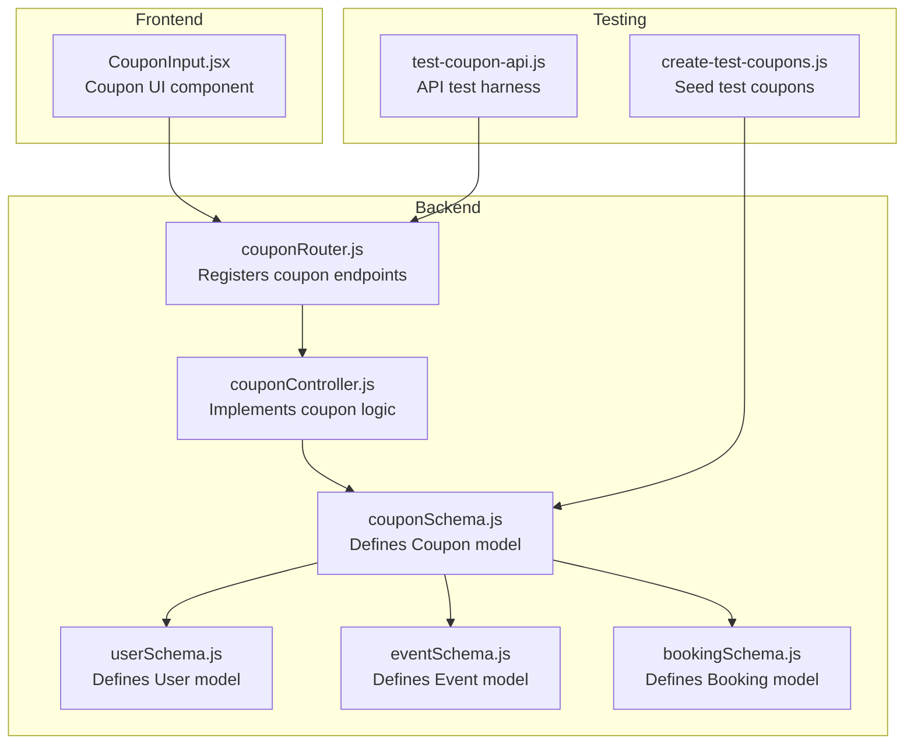
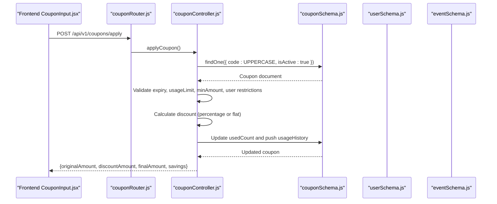
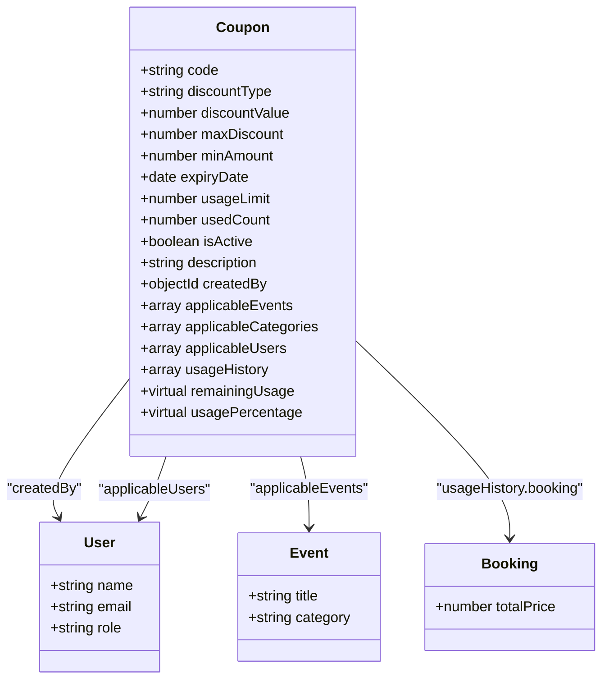
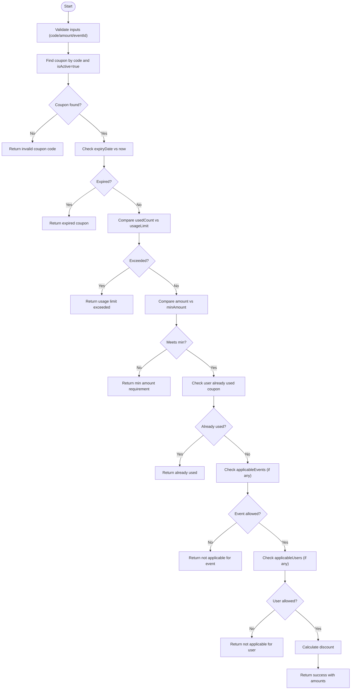
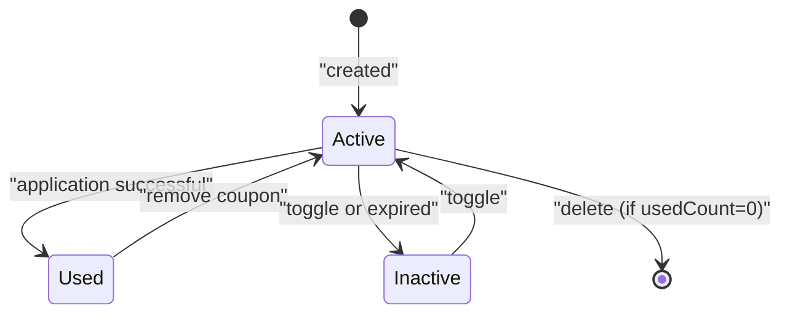
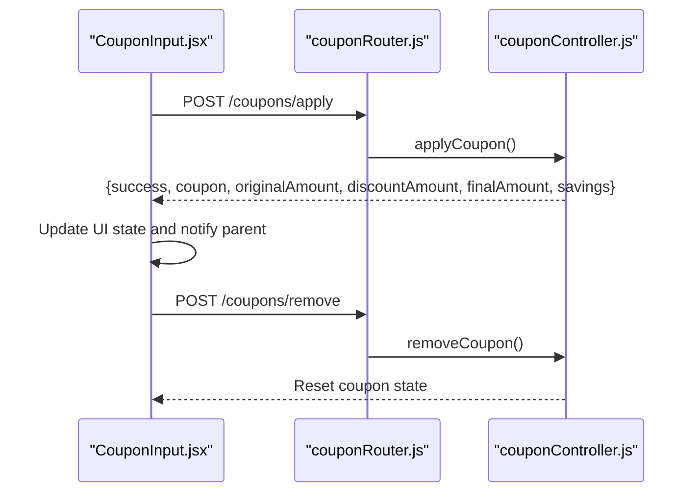
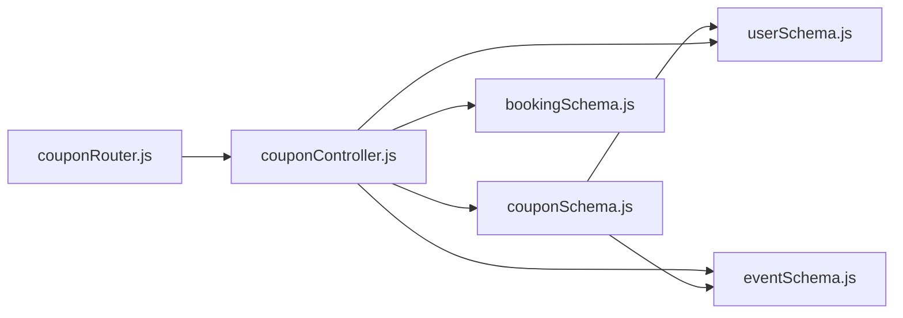

# Coupon Schema Design

<cite>
**Referenced Files in This Document**
- [couponSchema.js](file://backend/models/couponSchema.js)
- [couponController.js](file://backend/controller/couponController.js)
- [couponRouter.js](file://backend/router/couponRouter.js)
- [userSchema.js](file://backend/models/userSchema.js)
- [eventSchema.js](file://backend/models/eventSchema.js)
- [bookingSchema.js](file://backend/models/bookingSchema.js)
- [CouponInput.jsx](file://frontend/src/components/CouponInput.jsx)
- [create-test-coupons.js](file://backend/create-test-coupons.js)
- [test-coupon-api.js](file://backend/test-coupon-api.js)
</cite>

## Table of Contents
1. [Introduction](#introduction)
2. [Project Structure](#project-structure)
3. [Core Components](#core-components)
4. [Architecture Overview](#architecture-overview)
5. [Detailed Component Analysis](#detailed-component-analysis)
6. [Dependency Analysis](#dependency-analysis)
7. [Performance Considerations](#performance-considerations)
8. [Troubleshooting Guide](#troubleshooting-guide)
9. [Conclusion](#conclusion)
10. [Appendices](#appendices)

## Introduction
This document provides comprehensive data model documentation for the coupon schema used in the MERN stack event project. It details the coupon entity structure, field validation rules, data types, constraints, and relationships with the User and Event models. It also explains the usage history array structure for tracking individual user applications, coupon lifecycle management, indexing strategies for performance optimization, and data migration considerations. Practical examples and common use cases are included to guide implementation and testing.

## Project Structure
The coupon system spans backend models, controllers, routers, and frontend components:
- Backend models define the coupon, user, event, and booking schemas.
- Controllers implement coupon validation, application, listing, creation, updates, deletion, status toggling, and statistics retrieval.
- Router exposes REST endpoints for user and admin coupon operations.
- Frontend component integrates coupon application into the booking/payment flow.
- Test scripts and scripts support development and verification.

**Diagram sources**
- [couponSchema.js:1-123](file://backend/models/couponSchema.js#L1-L123)
- [couponController.js:1-757](file://backend/controller/couponController.js#L1-L757)
- [couponRouter.js:1-37](file://backend/router/couponRouter.js#L1-L37)
- [userSchema.js:1-55](file://backend/models/userSchema.js#L1-L55)
- [eventSchema.js:1-23](file://backend/models/eventSchema.js#L1-L23)
- [bookingSchema.js:1-53](file://backend/models/bookingSchema.js#L1-L53)
- [CouponInput.jsx:1-166](file://frontend/src/components/CouponInput.jsx#L1-L166)
- [create-test-coupons.js:1-87](file://backend/create-test-coupons.js#L1-L87)
- [test-coupon-api.js:1-70](file://backend/test-coupon-api.js#L1-L70)

**Section sources**
- [couponSchema.js:1-123](file://backend/models/couponSchema.js#L1-L123)
- [couponController.js:1-757](file://backend/controller/couponController.js#L1-L757)
- [couponRouter.js:1-37](file://backend/router/couponRouter.js#L1-L37)
- [userSchema.js:1-55](file://backend/models/userSchema.js#L1-L55)
- [eventSchema.js:1-23](file://backend/models/eventSchema.js#L1-L23)
- [bookingSchema.js:1-53](file://backend/models/bookingSchema.js#L1-L53)
- [CouponInput.jsx:1-166](file://frontend/src/components/CouponInput.jsx#L1-L166)
- [create-test-coupons.js:1-87](file://backend/create-test-coupons.js#L1-L87)
- [test-coupon-api.js:1-70](file://backend/test-coupon-api.js#L1-L70)

## Core Components
This section documents the coupon entity and its relationships with other models.

- Coupon model fields and constraints:
  - code: String, required, unique, uppercase, trimmed, length 3–20
  - discountType: Enum ["percentage", "flat"], required
  - discountValue: Number, required, min 0
  - maxDiscount: Number, min 0, default null (only meaningful for percentage)
  - minAmount: Number, required, min 0, default 0
  - expiryDate: Date, required
  - usageLimit: Number, required, min 1, default 1
  - usedCount: Number, min 0, default 0
  - isActive: Boolean, default true
  - description: String, max length 200
  - createdBy: ObjectId referencing User, required
  - applicableEvents: Array of Event ObjectIds (optional)
  - applicableCategories: Array of Strings (optional)
  - applicableUsers: Array of User ObjectIds (optional)
  - usageHistory: Array of objects tracking individual applications (see below)

- usageHistory item structure:
  - user: ObjectId referencing User
  - booking: ObjectId referencing Booking
  - usedAt: Date, defaults to current time
  - discountAmount: Number

- Relationships:
  - Coupon belongs to User via createdBy
  - Coupon optionally restricts applicability to Events and Users
  - usageHistory references Booking for audit trail

- Virtual fields:
  - remainingUsage: usageLimit - usedCount
  - usagePercentage: (usedCount / usageLimit) * 100

- Indexes:
  - code: 1
  - isActive: 1, expiryDate: 1
  - createdBy: 1

- Middleware:
  - Pre-save: ensures code is uppercase

**Section sources**
- [couponSchema.js:3-98](file://backend/models/couponSchema.js#L3-L98)
- [couponSchema.js:100-123](file://backend/models/couponSchema.js#L100-L123)

## Architecture Overview
The coupon system follows a layered architecture:
- Frontend component sends coupon application requests to backend endpoints.
- Router delegates to controller functions.
- Controller validates inputs, checks coupon eligibility, calculates discounts, and updates usage metrics.
- Model enforces schema constraints and indexes.

**Diagram sources**
- [CouponInput.jsx:19-82](file://frontend/src/components/CouponInput.jsx#L19-L82)
- [couponRouter.js:22-25](file://backend/router/couponRouter.js#L22-L25)
- [couponController.js:134-285](file://backend/controller/couponController.js#L134-L285)
- [couponSchema.js:3-98](file://backend/models/couponSchema.js#L3-L98)

## Detailed Component Analysis

### Coupon Model Class Diagram

**Diagram sources**
- [couponSchema.js:3-98](file://backend/models/couponSchema.js#L3-L98)
- [userSchema.js:4-52](file://backend/models/userSchema.js#L4-L52)
- [eventSchema.js:3-20](file://backend/models/eventSchema.js#L3-L20)
- [bookingSchema.js:3-50](file://backend/models/bookingSchema.js#L3-L50)

**Section sources**
- [couponSchema.js:3-98](file://backend/models/couponSchema.js#L3-L98)
- [userSchema.js:4-52](file://backend/models/userSchema.js#L4-L52)
- [eventSchema.js:3-20](file://backend/models/eventSchema.js#L3-L20)
- [bookingSchema.js:3-50](file://backend/models/bookingSchema.js#L3-L50)

### Coupon Validation and Application Flow
The controller implements two primary flows: validation and application.

**Diagram sources**
- [couponController.js:6-131](file://backend/controller/couponController.js#L6-L131)
- [couponController.js:134-285](file://backend/controller/couponController.js#L134-L285)

**Section sources**
- [couponController.js:6-131](file://backend/controller/couponController.js#L6-L131)
- [couponController.js:134-285](file://backend/controller/couponController.js#L134-L285)

### Coupon Lifecycle Management
- Creation:
  - Admin creates coupons with required fields and optional restrictions.
  - Validation ensures discount type/value ranges and future expiry date.
- Activation/Deactivation:
  - Admin toggles isActive flag.
- Usage Tracking:
  - usedCount increments upon successful application.
  - usageHistory records user, booking, timestamp, and discountAmount.
- Expiration:
  - Coupons become inactive automatically when expiryDate <= now.
- Deletion:
  - Coupons with zero usage can be deleted; otherwise blocked.

**Diagram sources**
- [couponController.js:567-656](file://backend/controller/couponController.js#L567-L656)
- [couponController.js:658-692](file://backend/controller/couponController.js#L658-L692)
- [couponSchema.js:39-49](file://backend/models/couponSchema.js#L39-L49)

**Section sources**
- [couponController.js:388-505](file://backend/controller/couponController.js#L388-L505)
- [couponController.js:567-656](file://backend/controller/couponController.js#L567-L656)
- [couponController.js:658-692](file://backend/controller/couponController.js#L658-L692)
- [couponSchema.js:39-49](file://backend/models/couponSchema.js#L39-L49)

### Frontend Integration
The frontend component handles user input, applies coupons, and displays savings.

**Diagram sources**
- [CouponInput.jsx:19-82](file://frontend/src/components/CouponInput.jsx#L19-L82)
- [couponRouter.js:22-25](file://backend/router/couponRouter.js#L22-L25)
- [couponController.js:134-308](file://backend/controller/couponController.js#L134-L308)

**Section sources**
- [CouponInput.jsx:1-166](file://frontend/src/components/CouponInput.jsx#L1-L166)
- [couponRouter.js:1-37](file://backend/router/couponRouter.js#L1-L37)
- [couponController.js:134-308](file://backend/controller/couponController.js#L134-L308)

## Dependency Analysis
- Internal dependencies:
  - couponController depends on couponSchema, bookingSchema, and eventSchema for validation and usage tracking.
  - couponSchema references User and Event for foreign keys and virtuals.
- External dependencies:
  - Express router for endpoint routing.
  - Mongoose for schema definition and indexing.

**Diagram sources**
- [couponRouter.js:1-37](file://backend/router/couponRouter.js#L1-L37)
- [couponController.js:1-7](file://backend/controller/couponController.js#L1-L7)
- [couponSchema.js:1-123](file://backend/models/couponSchema.js#L1-L123)
- [bookingSchema.js:1-53](file://backend/models/bookingSchema.js#L1-L53)
- [eventSchema.js:1-23](file://backend/models/eventSchema.js#L1-L23)
- [userSchema.js:1-55](file://backend/models/userSchema.js#L1-L55)

**Section sources**
- [couponRouter.js:1-37](file://backend/router/couponRouter.js#L1-L37)
- [couponController.js:1-7](file://backend/controller/couponController.js#L1-L7)
- [couponSchema.js:1-123](file://backend/models/couponSchema.js#L1-L123)
- [bookingSchema.js:1-53](file://backend/models/bookingSchema.js#L1-L53)
- [eventSchema.js:1-23](file://backend/models/eventSchema.js#L1-L23)
- [userSchema.js:1-55](file://backend/models/userSchema.js#L1-L55)

## Performance Considerations
- Indexes:
  - code: 1 — accelerates lookups by coupon code.
  - isActive: 1, expiryDate: 1 — supports fast filtering of active/expired coupons.
  - createdBy: 1 — speeds up admin queries by creator.
- Query patterns:
  - Use compound indexes for frequent filters (e.g., status and expiry).
  - Avoid selecting unnecessary fields; leverage projection in controller queries.
- Aggregation:
  - Stats computation uses aggregation to avoid loading large arrays into memory.
- Virtual fields:
  - remainingUsage and usagePercentage computed on-the-fly to reduce storage overhead.

**Section sources**
- [couponSchema.js:110-123](file://backend/models/couponSchema.js#L110-L123)
- [couponController.js:694-757](file://backend/controller/couponController.js#L694-L757)

## Troubleshooting Guide
- Common validation errors:
  - Invalid coupon code or amount — controller returns 400 with descriptive messages.
  - Expired coupon — controller rejects application with expiration message.
  - Usage limit exceeded — controller blocks further applications.
  - Minimum order amount not met — controller requires higher spend.
  - User already used coupon — prevents duplicate usage per user.
  - Event/user restrictions — controller checks applicable lists.
- Error handling:
  - Controllers wrap logic in try/catch and return structured error responses.
  - Pre-save middleware ensures code normalization to uppercase.
- Debugging tips:
  - Enable logging in controller functions to trace validation steps.
  - Use test scripts to seed coupons and verify flows.

**Section sources**
- [couponController.js:6-131](file://backend/controller/couponController.js#L6-L131)
- [couponController.js:134-285](file://backend/controller/couponController.js#L134-L285)
- [couponController.js:311-386](file://backend/controller/couponController.js#L311-L386)
- [couponController.js:507-565](file://backend/controller/couponController.js#L507-L565)
- [couponController.js:658-692](file://backend/controller/couponController.js#L658-L692)
- [couponController.js:694-757](file://backend/controller/couponController.js#L694-L757)
- [couponSchema.js:115-121](file://backend/models/couponSchema.js#L115-L121)

## Conclusion
The coupon schema is designed with strong validation, clear constraints, and robust relationships to Users and Events. The controller enforces comprehensive eligibility checks and tracks usage efficiently. Indexes and virtual fields optimize performance and usability. The frontend integration enables seamless coupon application during checkout. Together, these components form a scalable and maintainable coupon system suitable for production use.

## Appendices

### Field Reference and Constraints
- code: String, required, unique, uppercase, trimmed, length 3–20
- discountType: Enum ["percentage", "flat"], required
- discountValue: Number, required, min 0
- maxDiscount: Number, min 0, default null (only for percentage)
- minAmount: Number, required, min 0, default 0
- expiryDate: Date, required
- usageLimit: Number, required, min 1, default 1
- usedCount: Number, min 0, default 0
- isActive: Boolean, default true
- description: String, max length 200
- createdBy: ObjectId(User), required
- applicableEvents: Array(ObjectId(Event))
- applicableCategories: Array(String)
- applicableUsers: Array(ObjectId(User))
- usageHistory: Array({ user(ObjectId(User)), booking(ObjectId(Booking)), usedAt(Date), discountAmount(Number) })

**Section sources**
- [couponSchema.js:3-98](file://backend/models/couponSchema.js#L3-L98)

### Example Valid Configurations
- Percentage discount:
  - code: "SAVE10"
  - discountType: "percentage"
  - discountValue: 10
  - maxDiscount: 500
  - minAmount: 100
  - expiryDate: 30 days in the future
  - usageLimit: 100
- Flat discount:
  - code: "FLAT50"
  - discountType: "flat"
  - discountValue: 50
  - minAmount: 200
  - expiryDate: 15 days in the future
  - usageLimit: 200

These examples are derived from the test script and demonstrate typical configurations.

**Section sources**
- [create-test-coupons.js:28-64](file://backend/create-test-coupons.js#L28-L64)

### Common Use Cases
- Offer percentage discounts with caps for high-value orders.
- Provide flat discounts for first-time users or specific categories.
- Restrict coupons to selected events or user segments.
- Enforce minimum spend thresholds to drive larger purchases.
- Track discount distribution and redemption rates via usageHistory and stats.

**Section sources**
- [couponController.js:134-285](file://backend/controller/couponController.js#L134-L285)
- [couponController.js:694-757](file://backend/controller/couponController.js#L694-L757)
- [CouponInput.jsx:19-82](file://frontend/src/components/CouponInput.jsx#L19-L82)

### Data Migration Considerations
- Normalize coupon codes to uppercase during import to align with pre-save middleware.
- Backfill usageHistory for legacy coupons by scanning booking records and applying historical discounts.
- Add indexes incrementally and monitor query performance before production rollout.
- Validate discount ranges and expiry dates during migration to prevent invalid states.

**Section sources**
- [couponSchema.js:115-123](file://backend/models/couponSchema.js#L115-L123)
- [couponController.js:388-505](file://backend/controller/couponController.js#L388-L505)