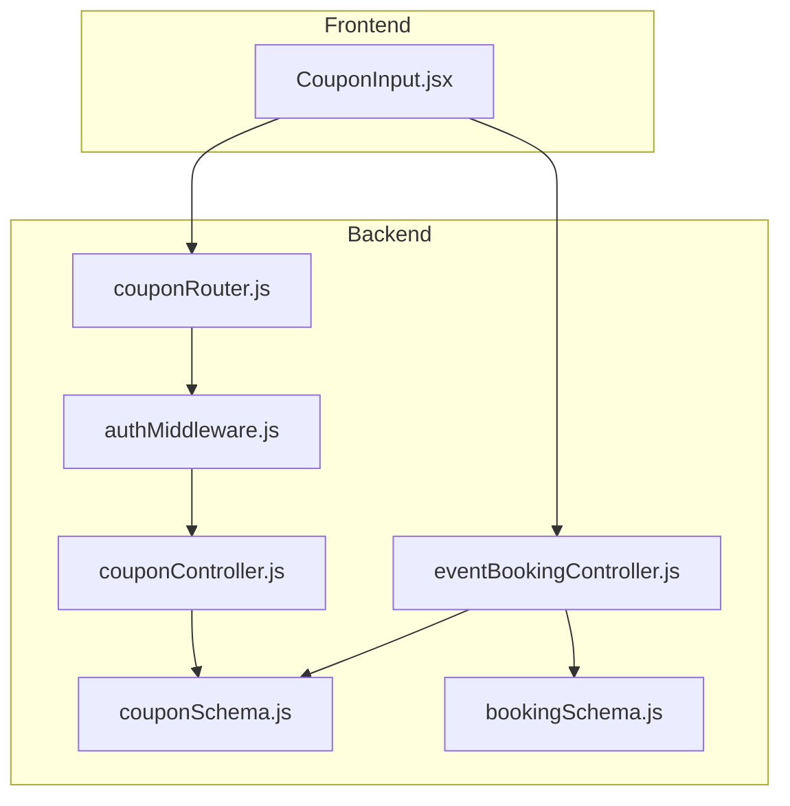
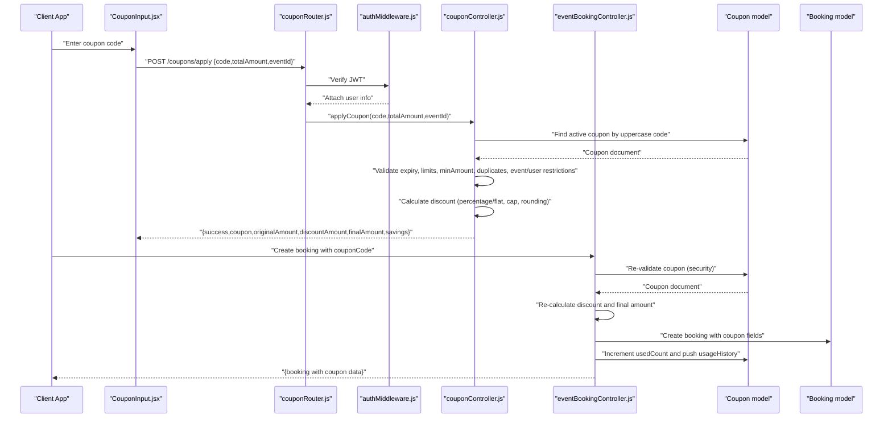
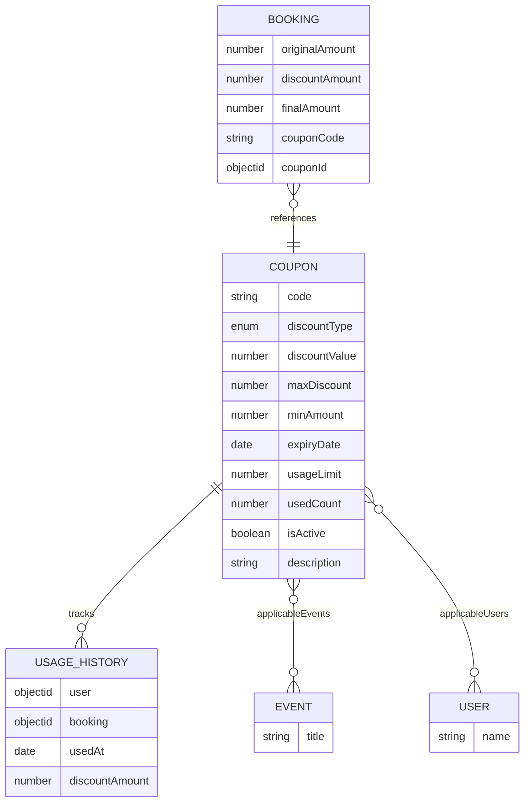
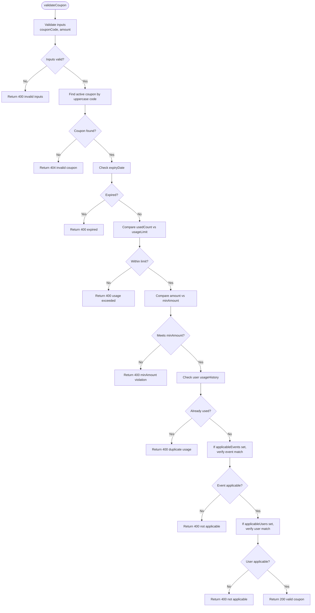
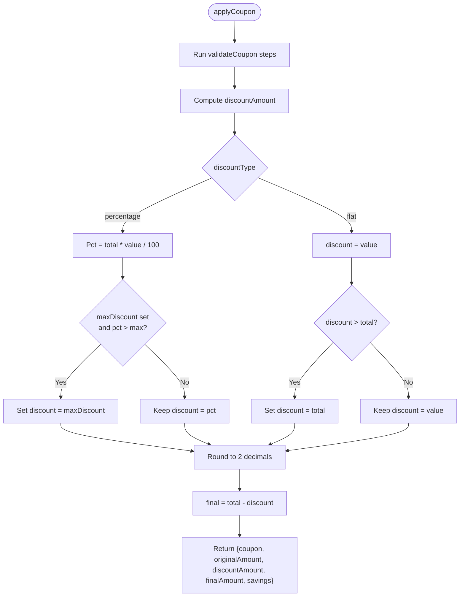
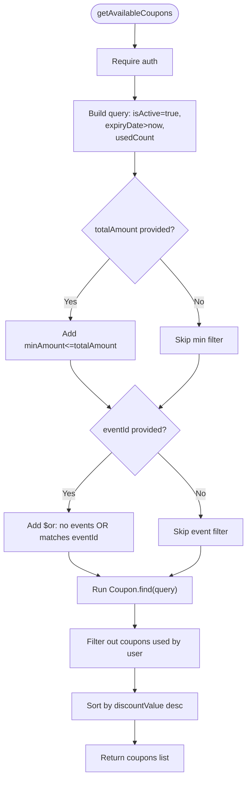
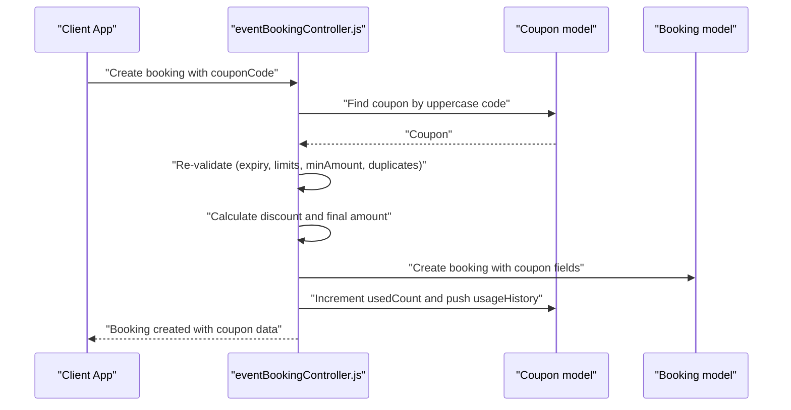
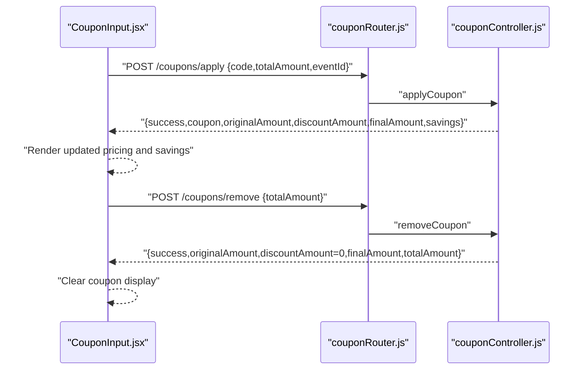
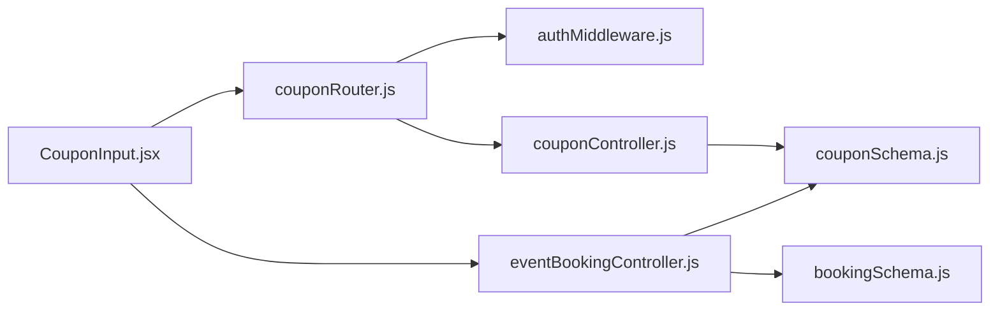

# Coupon Validation and Application Logic

<cite>
**Referenced Files in This Document**
- [couponSchema.js](file://backend/models/couponSchema.js)
- [couponController.js](file://backend/controller/couponController.js)
- [couponRouter.js](file://backend/router/couponRouter.js)
- [eventBookingController.js](file://backend/controller/eventBookingController.js)
- [bookingSchema.js](file://backend/models/bookingSchema.js)
- [CouponInput.jsx](file://frontend/src/components/CouponInput.jsx)
- [authMiddleware.js](file://backend/middleware/authMiddleware.js)
- [COUPON_SYSTEM_IMPLEMENTATION_STATUS.md](file://COUPON_SYSTEM_IMPLEMENTATION_STATUS.md)
- [COUPON_SYSTEM_VERIFICATION_AND_FIXES.md](file://COUPON_SYSTEM_VERIFICATION_AND_FIXES.md)
- [test-coupon-api.js](file://backend/test-coupon-api.js)
- [debug-coupons.js](file://backend/debug-coupons.js)
</cite>

## Table of Contents
1. [Introduction](#introduction)
2. [Project Structure](#project-structure)
3. [Core Components](#core-components)
4. [Architecture Overview](#architecture-overview)
5. [Detailed Component Analysis](#detailed-component-analysis)
6. [Dependency Analysis](#dependency-analysis)
7. [Performance Considerations](#performance-considerations)
8. [Troubleshooting Guide](#troubleshooting-guide)
9. [Conclusion](#conclusion)

## Introduction
This document explains the coupon validation and application logic implemented in the MERN stack event booking project. It covers the end-to-end workflow from coupon validation and discount calculation to usage tracking and integration with the booking system. The implementation ensures robust validation (input validation, coupon existence, expiration, usage limits, minimum order amounts, event applicability, and user restrictions), secure discount computation (percentage and flat discounts with caps and rounding), and persistent usage history with duplicate prevention. It also documents error handling, validation failure scenarios, and security considerations to prevent coupon abuse.

## Project Structure
The coupon system spans backend models, controllers, routers, middleware, and frontend components:
- Backend models define coupon and booking schemas with fields for discount logic and usage tracking.
- Controllers implement coupon validation, application, removal, and administrative operations.
- Router exposes endpoints for user and admin coupon operations.
- Middleware enforces authentication for protected routes.
- Frontend components integrate coupon input and display during booking.

**Diagram sources**
- [couponRouter.js:1-37](file://backend/router/couponRouter.js#L1-L37)
- [couponController.js:1-757](file://backend/controller/couponController.js#L1-L757)
- [eventBookingController.js:1-1607](file://backend/controller/eventBookingController.js#L1-L1607)
- [couponSchema.js:1-123](file://backend/models/couponSchema.js#L1-L123)
- [bookingSchema.js:1-53](file://backend/models/bookingSchema.js#L1-L53)
- [authMiddleware.js:1-17](file://backend/middleware/authMiddleware.js#L1-L17)
- [CouponInput.jsx:1-166](file://frontend/src/components/CouponInput.jsx#L1-L166)

**Section sources**
- [couponRouter.js:1-37](file://backend/router/couponRouter.js#L1-L37)
- [couponController.js:1-757](file://backend/controller/couponController.js#L1-L757)
- [eventBookingController.js:1-1607](file://backend/controller/eventBookingController.js#L1-L1607)
- [couponSchema.js:1-123](file://backend/models/couponSchema.js#L1-L123)
- [bookingSchema.js:1-53](file://backend/models/bookingSchema.js#L1-L53)
- [authMiddleware.js:1-17](file://backend/middleware/authMiddleware.js#L1-L17)
- [CouponInput.jsx:1-166](file://frontend/src/components/CouponInput.jsx#L1-L166)

## Core Components
- Coupon model: Defines coupon fields, indexes, and virtuals for remaining usage and usage percentage. Includes usage history array for tracking per-user usage and discount amounts.
- Coupon controller: Implements validateCoupon, applyCoupon, removeCoupon, getAvailableCoupons, and administrative operations with comprehensive validation and error handling.
- Event booking controller: Integrates coupon validation and discount calculation during booking creation, updates coupon usage, and persists coupon data in the booking record.
- Frontend CouponInput: Provides real-time coupon application/removal UI, communicates with backend endpoints, and displays updated pricing.

Key validation and calculation logic:
- Input validation: Ensures required fields and positive amounts.
- Coupon existence and activity: Finds active coupons by uppercase code.
- Expiration: Compares coupon expiry date with current time.
- Usage limits: Enforces usedCount vs usageLimit.
- Minimum amount: Requires total amount to meet or exceed minAmount.
- Duplicate usage: Prevents a user from applying the same coupon multiple times.
- Event applicability: Restricts coupons to specific events if configured.
- User restrictions: Restricts coupons to specific users if configured.
- Discount calculation: Percentage discount with optional maxDiscount cap; flat discount capped at total amount; rounding to two decimals.
- Usage history: Records user, booking, timestamp, and discountAmount upon successful application.

**Section sources**
- [couponSchema.js:1-123](file://backend/models/couponSchema.js#L1-L123)
- [couponController.js:5-131](file://backend/controller/couponController.js#L5-L131)
- [couponController.js:133-285](file://backend/controller/couponController.js#L133-L285)
- [couponController.js:310-386](file://backend/controller/couponController.js#L310-L386)
- [eventBookingController.js:148-543](file://backend/controller/eventBookingController.js#L148-L543)
- [CouponInput.jsx:19-82](file://frontend/src/components/CouponInput.jsx#L19-L82)

## Architecture Overview
The coupon workflow integrates frontend UI, backend endpoints, and booking processing with strict validation and usage tracking.

**Diagram sources**
- [couponRouter.js:21-33](file://backend/router/couponRouter.js#L21-L33)
- [authMiddleware.js:3-16](file://backend/middleware/authMiddleware.js#L3-L16)
- [couponController.js:133-285](file://backend/controller/couponController.js#L133-L285)
- [eventBookingController.js:148-543](file://backend/controller/eventBookingController.js#L148-L543)
- [couponSchema.js:76-91](file://backend/models/couponSchema.js#L76-L91)
- [bookingSchema.js:45-47](file://backend/models/bookingSchema.js#L45-L47)
- [CouponInput.jsx:28-47](file://frontend/src/components/CouponInput.jsx#L28-L47)

## Detailed Component Analysis

### Coupon Model and Schema
The coupon model defines:
- Identity: code (unique, uppercase), discountType (percentage or flat), discountValue, maxDiscount (optional for percentage), minAmount, expiryDate, usageLimit, usedCount, isActive, description.
- Applicability: applicableEvents (Event refs), applicableCategories (strings), applicableUsers (User refs).
- Usage tracking: usageHistory array storing user, booking, usedAt, and discountAmount.
- Indexes: code, (isActive, expiryDate), createdBy for efficient queries.
- Pre-save middleware: normalizes code to uppercase.

**Diagram sources**
- [couponSchema.js:3-98](file://backend/models/couponSchema.js#L3-L98)
- [bookingSchema.js:3-48](file://backend/models/bookingSchema.js#L3-L48)

**Section sources**
- [couponSchema.js:1-123](file://backend/models/couponSchema.js#L1-L123)
- [bookingSchema.js:1-53](file://backend/models/bookingSchema.js#L1-L53)

### Coupon Validation Endpoint
The validateCoupon endpoint performs:
- Input validation: requires couponCode and amount; amount must be positive.
- Coupon lookup: finds active coupon by uppercase code.
- Expiration check: rejects expired coupons.
- Usage limit check: rejects if usedCount equals or exceeds usageLimit.
- Minimum amount check: rejects if amount is less than minAmount.
- Duplicate usage check: prevents a user from applying the same coupon again.
- Event applicability check: if coupon specifies applicableEvents, verifies event match.
- User restriction check: if coupon specifies applicableUsers, verifies user match.
- Returns coupon metadata for frontend display.

**Diagram sources**
- [couponController.js:5-131](file://backend/controller/couponController.js#L5-L131)

**Section sources**
- [couponController.js:5-131](file://backend/controller/couponController.js#L5-L131)

### Coupon Application Endpoint
The applyCoupon endpoint mirrors validation logic and then:
- Computes discountAmount based on discountType:
  - Percentage: (totalAmount * discountValue) / 100; cap by maxDiscount if present.
  - Flat: discountValue; cap by totalAmount.
- Rounds discountAmount to two decimals.
- Calculates finalAmount = totalAmount - discountAmount.
- Returns structured response with coupon, originalAmount, discountAmount, finalAmount, savings.

**Diagram sources**
- [couponController.js:133-285](file://backend/controller/couponController.js#L133-L285)

**Section sources**
- [couponController.js:133-285](file://backend/controller/couponController.js#L133-L285)

### Coupon Availability and Filtering
The getAvailableCoupons endpoint:
- Requires user authentication.
- Queries active, non-expired coupons with usedCount < usageLimit.
- Optionally filters by totalAmount (minAmount ≤ provided amount).
- Optionally filters by eventId (no restrictions or matching event).
- Filters out coupons already used by the requesting user.
- Sorts by discountValue descending.

**Diagram sources**
- [couponController.js:310-386](file://backend/controller/couponController.js#L310-L386)

**Section sources**
- [couponController.js:310-386](file://backend/controller/couponController.js#L310-L386)

### Booking Integration and Usage Tracking
During booking creation:
- The system re-validates the coupon (security-first approach).
- Applies the same discount calculation logic.
- Creates the booking with coupon fields (originalAmount, discountAmount, finalAmount, couponCode, couponId).
- Updates the coupon’s usedCount and pushes a usageHistory entry with user, booking, timestamp, and discountAmount.

**Diagram sources**
- [eventBookingController.js:148-543](file://backend/controller/eventBookingController.js#L148-L543)
- [couponSchema.js:76-91](file://backend/models/couponSchema.js#L76-L91)
- [bookingSchema.js:45-47](file://backend/models/bookingSchema.js#L45-L47)

**Section sources**
- [eventBookingController.js:148-543](file://backend/controller/eventBookingController.js#L148-L543)
- [bookingSchema.js:45-47](file://backend/models/bookingSchema.js#L45-L47)

### Frontend Coupon Integration
The CouponInput component:
- Accepts totalAmount, eventId, and token.
- Calls applyCoupon endpoint and displays success/error feedback.
- On success, passes couponResult to parent via onCouponApplied.
- Supports removing coupon via removeCoupon endpoint and notifies parent via onCouponRemoved.
- Displays original amount, discount, final amount, and savings.

**Diagram sources**
- [CouponInput.jsx:19-82](file://frontend/src/components/CouponInput.jsx#L19-L82)
- [couponRouter.js:21-25](file://backend/router/couponRouter.js#L21-L25)
- [couponController.js:287-308](file://backend/controller/couponController.js#L287-L308)

**Section sources**
- [CouponInput.jsx:19-82](file://frontend/src/components/CouponInput.jsx#L19-L82)
- [couponController.js:287-308](file://backend/controller/couponController.js#L287-L308)

## Dependency Analysis
- Router depends on auth middleware and exports coupon endpoints.
- Coupon controller depends on Coupon and Booking models.
- Event booking controller depends on Coupon and Booking models and orchestrates coupon application during booking.
- Frontend CouponInput depends on HTTP client and auth headers to call coupon endpoints.

**Diagram sources**
- [couponRouter.js:1-37](file://backend/router/couponRouter.js#L1-L37)
- [authMiddleware.js:1-17](file://backend/middleware/authMiddleware.js#L1-L17)
- [couponController.js:1-757](file://backend/controller/couponController.js#L1-L757)
- [eventBookingController.js:1-1607](file://backend/controller/eventBookingController.js#L1-L1607)
- [couponSchema.js:1-123](file://backend/models/couponSchema.js#L1-L123)
- [bookingSchema.js:1-53](file://backend/models/bookingSchema.js#L1-L53)
- [CouponInput.jsx:1-166](file://frontend/src/components/CouponInput.jsx#L1-L166)

**Section sources**
- [couponRouter.js:1-37](file://backend/router/couponRouter.js#L1-L37)
- [authMiddleware.js:1-17](file://backend/middleware/authMiddleware.js#L1-L17)
- [couponController.js:1-757](file://backend/controller/couponController.js#L1-L757)
- [eventBookingController.js:1-1607](file://backend/controller/eventBookingController.js#L1-L1607)
- [couponSchema.js:1-123](file://backend/models/couponSchema.js#L1-L123)
- [bookingSchema.js:1-53](file://backend/models/bookingSchema.js#L1-L53)
- [CouponInput.jsx:1-166](file://frontend/src/components/CouponInput.jsx#L1-L166)

## Performance Considerations
- Database indexes: code, (isActive, expiryDate), and createdBy improve query performance for coupon retrieval and availability filtering.
- Aggregation: Coupon statistics use aggregation to compute totals efficiently.
- Rounding: Discount calculations use Math.round to avoid floating-point precision issues.
- Query optimization: getAvailableCoupons uses targeted selectors and sorts to minimize payload and improve rendering.

[No sources needed since this section provides general guidance]

## Troubleshooting Guide
Common validation failure scenarios and error responses:
- Invalid inputs: Missing couponCode or amount, or non-positive amount.
- Invalid coupon code: Coupon not found or inactive.
- Expired coupon: Expiry date before current time.
- Usage limit exceeded: usedCount equals or exceeds usageLimit.
- Minimum amount not met: Provided amount below coupon minAmount.
- Duplicate usage: User already applied this coupon.
- Event not applicable: Coupon restricts to specific events; current event does not match.
- User not applicable: Coupon restricts to specific users; current user does not match.
- Internal errors: 500 responses with error messages.

Security considerations:
- Authentication: All coupon endpoints require a valid JWT; unauthorized requests receive 401.
- Re-validation: Booking creation re-validates coupon to prevent manipulation.
- Code normalization: Coupon codes are stored uppercase to avoid case-based duplicates.
- Admin-only operations: Create, update, delete, toggle, and stats require admin role.

**Section sources**
- [couponController.js:16-130](file://backend/controller/couponController.js#L16-L130)
- [couponController.js:144-284](file://backend/controller/couponController.js#L144-L284)
- [eventBookingController.js:157-204](file://backend/controller/eventBookingController.js#L157-L204)
- [authMiddleware.js:3-16](file://backend/middleware/authMiddleware.js#L3-L16)
- [couponSchema.js:115-121](file://backend/models/couponSchema.js#L115-L121)

## Conclusion
The coupon system is comprehensively implemented with robust validation, secure discount calculation, and integrated usage tracking. It supports percentage and flat discounts with caps and rounding, enforces expiration, usage limits, minimum amounts, event applicability, and user restrictions. The frontend provides seamless coupon application and display, while the backend ensures data integrity and security through re-validation and admin controls. The system is production-ready with clear error handling and performance-conscious design.