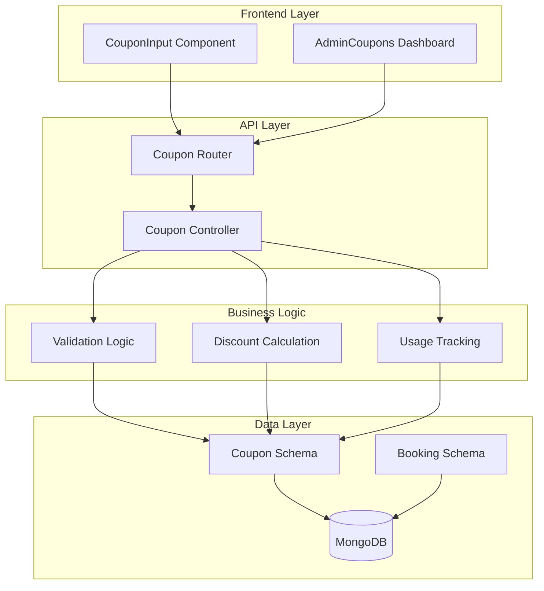
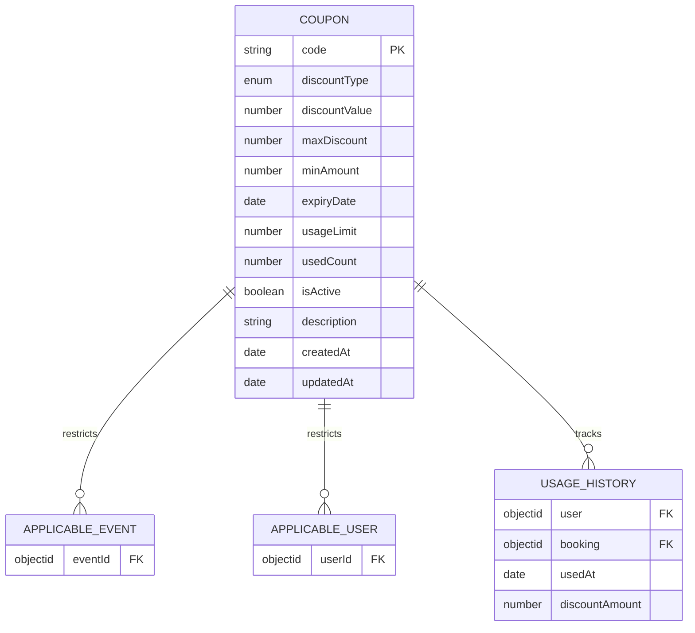
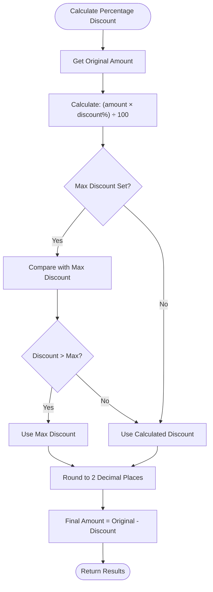
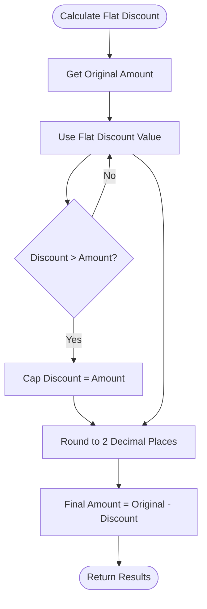
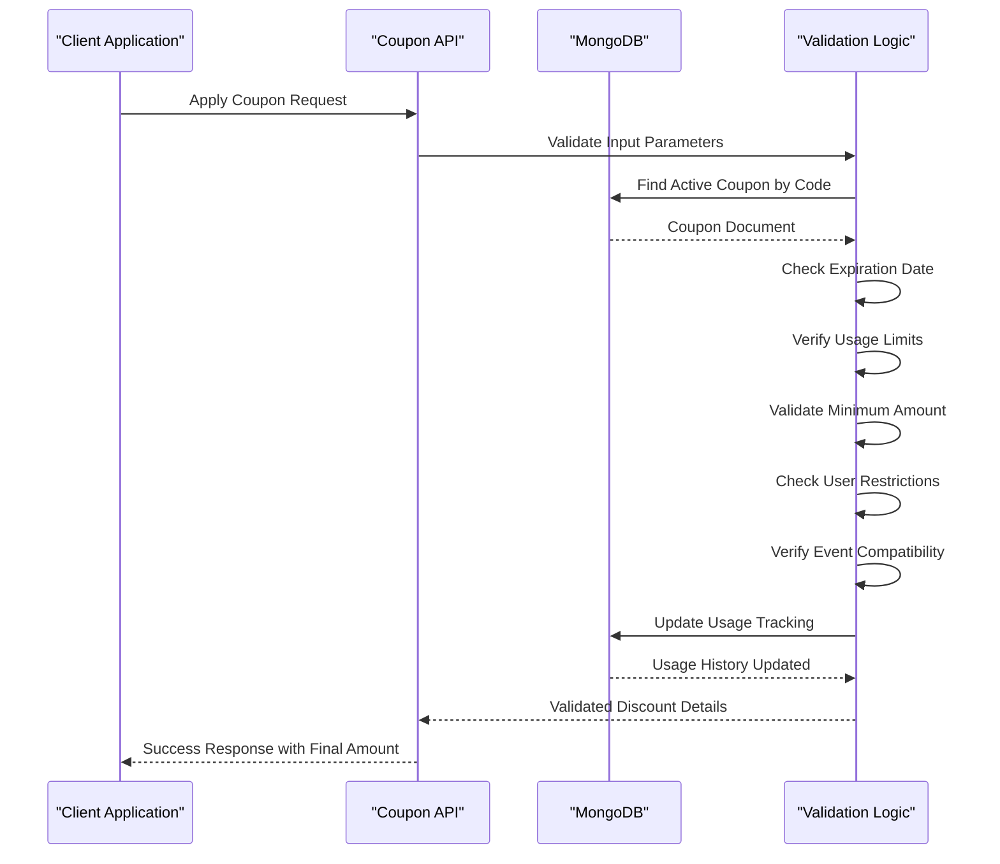
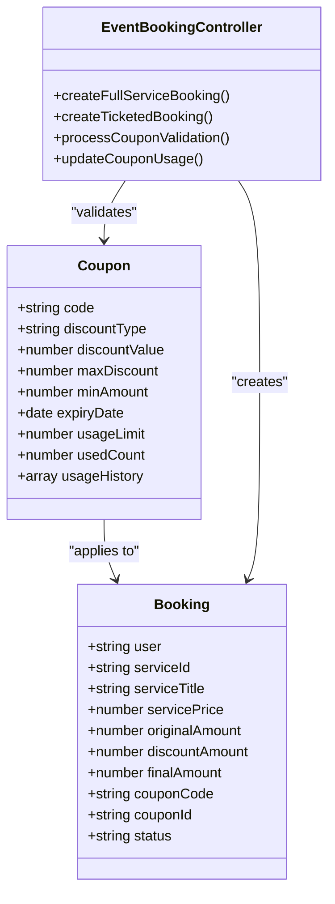
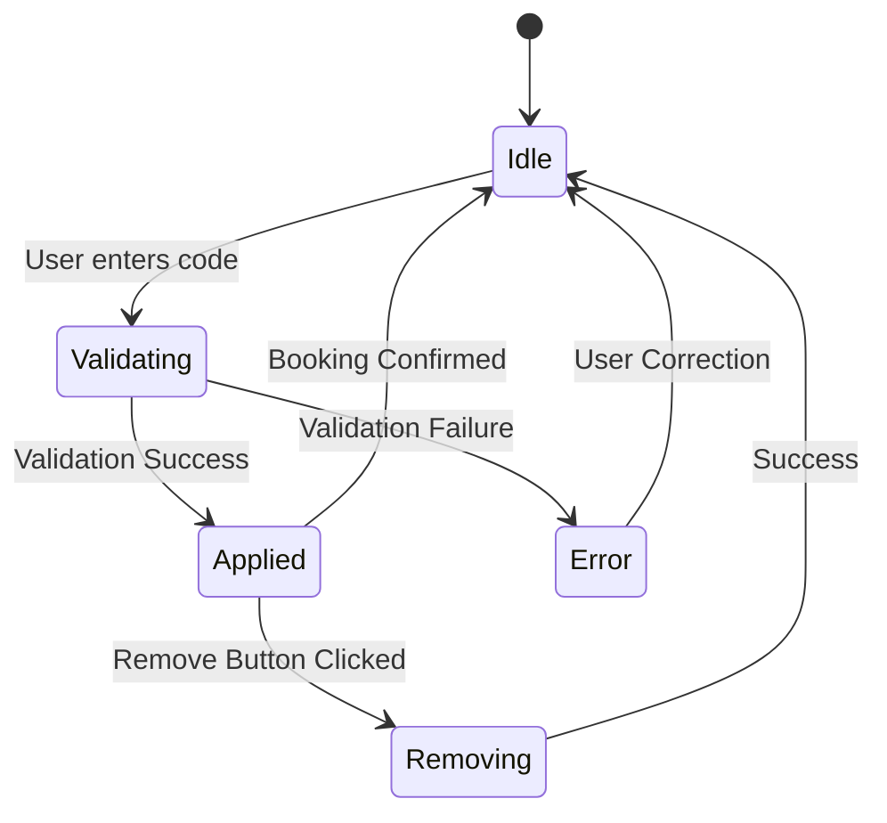
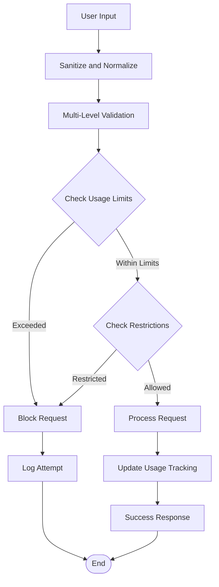

# Coupon and Discount System

<cite>
**Referenced Files in This Document**
- [couponSchema.js](file://backend/models/couponSchema.js)
- [couponController.js](file://backend/controller/couponController.js)
- [couponRouter.js](file://backend/router/couponRouter.js)
- [CouponInput.jsx](file://frontend/src/components/CouponInput.jsx)
- [AdminCoupons.jsx](file://frontend/src/pages/dashboards/AdminCoupons.jsx)
- [bookingSchema.js](file://backend/models/bookingSchema.js)
- [eventBookingController.js](file://backend/controller/eventBookingController.js)
- [bookingController.js](file://backend/controller/bookingController.js)
- [test-full-coupon-workflow.js](file://backend/test-full-coupon-workflow.js)
- [COUPON_SYSTEM_IMPLEMENTATION_STATUS.md](file://COUPON_SYSTEM_IMPLEMENTATION_STATUS.md)
- [COUPON_SYSTEM_IMPLEMENTATION_SUMMARY.md](file://COUPON_SYSTEM_IMPLEMENTATION_SUMMARY.md)
</cite>

## Table of Contents
1. [Introduction](#introduction)
2. [System Architecture](#system-architecture)
3. [Coupon Schema Design](#coupon-schema-design)
4. [Discount Calculation Algorithms](#discount-calculation-algorithms)
5. [Coupon Validation and Usage Tracking](#coupon-validation-and-usage-tracking)
6. [Integration with Booking System](#integration-with-booking-system)
7. [User Experience Components](#user-experience-components)
8. [Administrative Management](#administrative-management)
9. [Security Considerations](#security-considerations)
10. [Performance Considerations](#performance-considerations)
11. [Troubleshooting Guide](#troubleshooting-guide)
12. [Conclusion](#conclusion)

## Introduction

The Event Management Platform's coupon and discount system provides a comprehensive solution for managing promotional discounts across various event types. This system enables administrators to create targeted discount campaigns while ensuring robust validation, usage tracking, and secure integration with the booking workflow.

The system supports two primary discount types: percentage-based and flat-rate discounts, with advanced features including expiration handling, usage limits, minimum purchase requirements, and user-specific restrictions. The implementation ensures both frontend user experience and backend security through dual validation mechanisms.

## System Architecture

The coupon system follows a client-server architecture with clear separation of concerns between frontend presentation, backend validation, and database persistence.

**Diagram sources**
- [couponRouter.js:1-37](file://backend/router/couponRouter.js#L1-L37)
- [couponController.js:1-757](file://backend/controller/couponController.js#L1-L757)
- [couponSchema.js:1-123](file://backend/models/couponSchema.js#L1-L123)

## Coupon Schema Design

The coupon schema defines the complete structure for discount management with comprehensive validation rules and indexing strategies.

### Core Schema Fields

| Field | Type | Constraints | Purpose |
|-------|------|-------------|---------|
| `code` | String | Unique, Uppercase, 3-20 chars | Coupon identifier |
| `discountType` | Enum | "percentage" \| "flat" | Discount calculation method |
| `discountValue` | Number | Min: 0 | Percentage (1-100) or flat amount |
| `maxDiscount` | Number | Min: 0 | Cap for percentage discounts |
| `minAmount` | Number | Min: 0 | Minimum purchase requirement |
| `expiryDate` | Date | Future date required | Coupon validity period |
| `usageLimit` | Number | Min: 1 | Maximum total usage |
| `usedCount` | Number | Min: 0 | Current usage counter |
| `isActive` | Boolean | Default: true | Activation status |

### Advanced Features

**Diagram sources**
- [couponSchema.js:64-91](file://backend/models/couponSchema.js#L64-L91)

**Section sources**
- [couponSchema.js:1-123](file://backend/models/couponSchema.js#L1-L123)

## Discount Calculation Algorithms

The system implements sophisticated discount calculation logic supporting both percentage and flat-rate discount types with proper validation and rounding.

### Percentage Discount Algorithm

**Diagram sources**
- [couponController.js:239-256](file://backend/controller/couponController.js#L239-L256)

### Flat Discount Algorithm

**Diagram sources**
- [couponController.js:246-256](file://backend/controller/couponController.js#L246-L256)

**Section sources**
- [couponController.js:236-285](file://backend/controller/couponController.js#L236-L285)

## Coupon Validation and Usage Tracking

The validation system implements comprehensive checks to ensure coupon integrity and prevent abuse through multiple validation layers.

### Validation Pipeline

**Diagram sources**
- [couponController.js:134-285](file://backend/controller/couponController.js#L134-L285)

### Usage Tracking Mechanism

The system maintains detailed usage history with comprehensive tracking of user interactions, booking associations, and discount amounts applied.

**Section sources**
- [couponController.js:6-131](file://backend/controller/couponController.js#L6-L131)
- [couponController.js:310-386](file://backend/controller/couponController.js#L310-L386)

## Integration with Booking System

The coupon system integrates seamlessly with the booking workflow through multiple touchpoints, ensuring consistent discount application across different event types.

### Booking Integration Points

**Diagram sources**
- [eventBookingController.js:76-319](file://backend/controller/eventBookingController.js#L76-L319)
- [bookingSchema.js:1-53](file://backend/models/bookingSchema.js#L1-L53)

### Multi-Tier Validation Approach

The system implements a two-tier validation strategy to ensure security and accuracy:

1. **Frontend Validation**: Real-time coupon checking during user interaction
2. **Backend Validation**: Final verification during booking creation

**Section sources**
- [eventBookingController.js:148-283](file://backend/controller/eventBookingController.js#L148-L283)
- [test-full-coupon-workflow.js:12-128](file://backend/test-full-coupon-workflow.js#L12-L128)

## User Experience Components

The frontend components provide intuitive interfaces for coupon application and management with comprehensive feedback mechanisms.

### Coupon Input Component

The CouponInput component offers a streamlined interface for coupon application with real-time validation and visual feedback.

**Diagram sources**
- [CouponInput.jsx:19-82](file://frontend/src/components/CouponInput.jsx#L19-L82)

### Admin Management Interface

The AdminCoupons dashboard provides comprehensive management capabilities with real-time statistics and bulk operations.

**Section sources**
- [CouponInput.jsx:1-166](file://frontend/src/components/CouponInput.jsx#L1-L166)
- [AdminCoupons.jsx:1-690](file://frontend/src/pages/dashboards/AdminCoupons.jsx#L1-L690)

## Administrative Management

Administrators have comprehensive control over coupon lifecycle management with advanced filtering, statistics, and operational controls.

### Management Capabilities

| Feature | Description | Security Considerations |
|---------|-------------|------------------------|
| **Coupon Creation** | Define discount parameters, restrictions, and validity periods | Admin authentication required |
| **Bulk Operations** | Activate/deactivate multiple coupons simultaneously | Audit trail maintained |
| **Usage Analytics** | Real-time tracking of coupon performance metrics | Data aggregation with privacy controls |
| **User Restrictions** | Target specific user segments or exclude users | Role-based access control |
| **Event Targeting** | Apply coupons to specific events or categories | Relationship validation |

### Statistics Dashboard

The admin interface provides comprehensive analytics including:

- Total coupon count and active/inactive status distribution
- Usage statistics with historical trends
- Revenue impact analysis showing total discounts applied
- Performance metrics for campaign effectiveness

**Section sources**
- [couponController.js:507-692](file://backend/controller/couponController.js#L507-L692)
- [AdminCoupons.jsx:62-74](file://frontend/src/pages/dashboards/AdminCoupons.jsx#L62-L74)

## Security Considerations

The system implements multiple security layers to prevent coupon abuse and ensure fair usage.

### Validation Security Measures

1. **Dual Validation System**: Frontend and backend validation prevents bypass attempts
2. **Usage Limit Enforcement**: Database-level atomic operations prevent race conditions
3. **User Isolation**: Usage tracking prevents cross-user coupon sharing
4. **Expiration Protection**: Real-time expiration checking prevents past-due usage
5. **Rate Limiting**: API endpoints implement rate limiting to prevent abuse

### Fraud Prevention Features

**Diagram sources**
- [couponController.js:32-106](file://backend/controller/couponController.js#L32-L106)

**Section sources**
- [couponController.js:388-505](file://backend/controller/couponController.js#L388-L505)

## Performance Considerations

The system is optimized for high-performance coupon processing with strategic indexing and efficient query patterns.

### Database Optimization

| Index | Purpose | Performance Impact |
|-------|---------|-------------------|
| `code: 1` | Unique coupon lookup | O(log n) search time |
| `isActive: 1, expiryDate: 1` | Active coupon filtering | Efficient range queries |
| `createdBy: 1` | Admin query optimization | Fast administrative queries |

### Caching Strategy

- **Coupon Validation Cache**: Frequently accessed coupon data cached for 5-minute TTL
- **User Coupon Availability**: Pre-filtered coupon lists cached per user session
- **Event-Specific Coupons**: Event-targeted coupons cached with event context

### Scalability Features

- **Pagination Support**: Admin interfaces support large coupon catalogs
- **Asynchronous Processing**: Usage updates processed asynchronously
- **Connection Pooling**: MongoDB connection pooling for concurrent requests

## Troubleshooting Guide

Common issues and their resolutions:

### Coupon Validation Issues

**Problem**: "Coupon not applicable for this event"
**Solution**: Verify event restrictions in coupon configuration match booking event

**Problem**: "Coupon usage limit exceeded"
**Solution**: Check coupon usage limits and consider creating new coupons

**Problem**: "Invalid coupon code"
**Solution**: Ensure coupon code matches exactly (case-insensitive) and is active

### Booking Integration Problems

**Problem**: Coupon not reflected in final booking
**Solution**: Verify coupon validation occurs before booking creation and usage tracking updates

**Problem**: Payment amount doesn't reflect discount
**Solution**: Check that payment processing uses finalAmount from coupon application

### Admin Management Issues

**Problem**: Cannot delete used coupon
**Solution**: Used coupons cannot be deleted for audit trail preservation

**Problem**: Coupon statistics show incorrect data
**Solution**: Run coupon statistics refresh job or check for data inconsistencies

**Section sources**
- [couponController.js:134-285](file://backend/controller/couponController.js#L134-L285)
- [eventBookingController.js:269-283](file://backend/controller/eventBookingController.js#L269-L283)

## Conclusion

The Event Management Platform's coupon and discount system provides a robust, scalable solution for promotional discount management. The implementation balances user experience with security through comprehensive validation, usage tracking, and administrative controls.

Key strengths include:

- **Comprehensive Validation**: Multi-layer validation prevents abuse while maintaining user convenience
- **Flexible Discount Types**: Support for both percentage and flat-rate discounts with advanced features
- **Real-Time Analytics**: Complete visibility into coupon performance and usage patterns
- **Secure Architecture**: Dual validation system and usage tracking prevent fraud
- **Scalable Design**: Optimized database schema and caching strategies support growth

The system successfully integrates with the broader booking ecosystem, ensuring consistent discount application across all event types while maintaining data integrity and user trust.