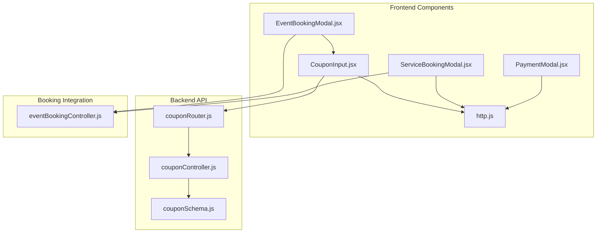
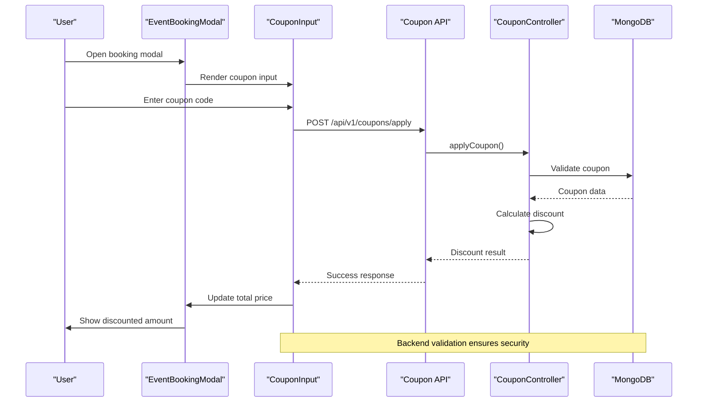
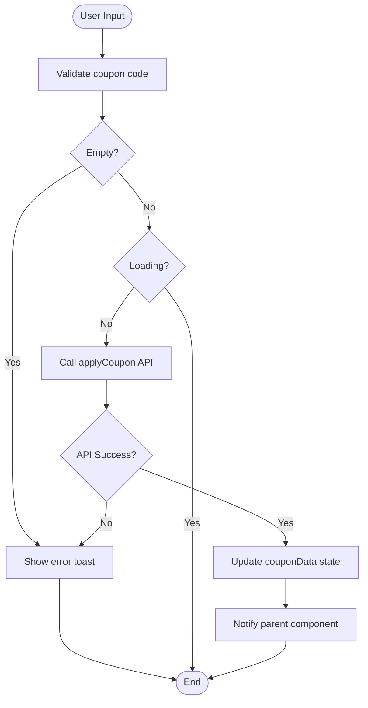
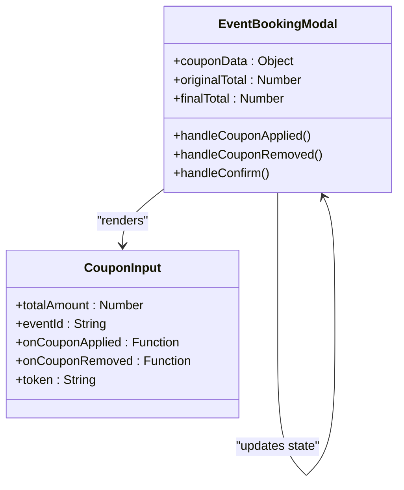
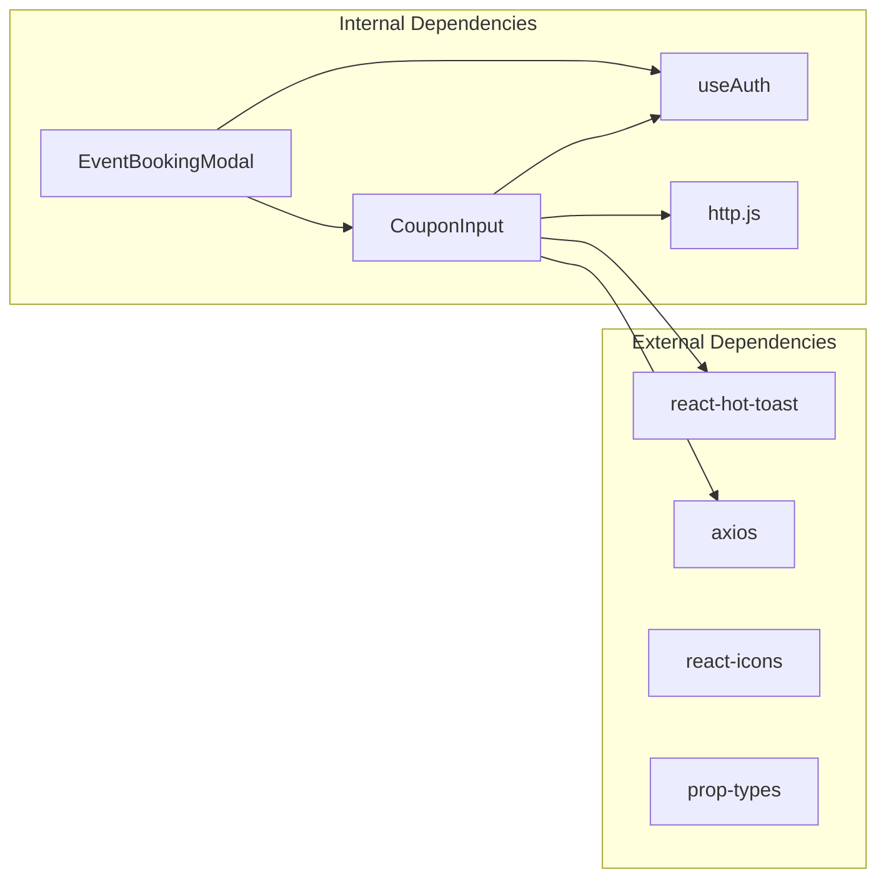

# Frontend Coupon Integration Components

<cite>
**Referenced Files in This Document**
- [CouponInput.jsx](file://frontend/src/components/CouponInput.jsx)
- [EventBookingModal.jsx](file://frontend/src/components/EventBookingModal.jsx)
- [ServiceBookingModal.jsx](file://frontend/src/components/ServiceBookingModal.jsx)
- [PaymentModal.jsx](file://frontend/src/components/PaymentModal.jsx)
- [http.js](file://frontend/src/lib/http.js)
- [couponController.js](file://backend/controller/couponController.js)
- [couponSchema.js](file://backend/models/couponSchema.js)
- [couponRouter.js](file://backend/router/couponRouter.js)
- [eventBookingController.js](file://backend/controller/eventBookingController.js)
</cite>

## Table of Contents
1. [Introduction](#introduction)
2. [Project Structure](#project-structure)
3. [Core Components](#core-components)
4. [Architecture Overview](#architecture-overview)
5. [Detailed Component Analysis](#detailed-component-analysis)
6. [Dependency Analysis](#dependency-analysis)
7. [Performance Considerations](#performance-considerations)
8. [Troubleshooting Guide](#troubleshooting-guide)
9. [Conclusion](#conclusion)

## Introduction
This document provides comprehensive documentation for the frontend coupon integration components and user interface patterns. It covers the CouponInput component implementation, coupon application workflow in the booking process, integration patterns with booking forms and payment modals, and accessibility and responsive design considerations. The coupon system is fully implemented with backend validation, real-time discount calculation, and seamless integration across the application.

## Project Structure
The coupon integration spans both frontend and backend components with clear separation of concerns:

**Diagram sources**
- [CouponInput.jsx:1-166](file://frontend/src/components/CouponInput.jsx#L1-L166)
- [EventBookingModal.jsx:1-276](file://frontend/src/components/EventBookingModal.jsx#L1-L276)
- [couponRouter.js:1-37](file://backend/router/couponRouter.js#L1-L37)
- [couponController.js:1-757](file://backend/controller/couponController.js#L1-L757)

**Section sources**
- [CouponInput.jsx:1-166](file://frontend/src/components/CouponInput.jsx#L1-L166)
- [EventBookingModal.jsx:1-276](file://frontend/src/components/EventBookingModal.jsx#L1-L276)
- [couponRouter.js:1-37](file://backend/router/couponRouter.js#L1-L37)

## Core Components
The coupon integration consists of several key components working together to provide a seamless user experience:

### CouponInput Component
The primary coupon input component handles user interactions, form validation, and API communication. It manages state for coupon code input, loading states, and applied coupon data.

### EventBookingModal Integration
The booking modal integrates the coupon system directly into the booking workflow, providing real-time price updates and seamless coupon application during the booking process.

### ServiceBookingModal Integration
Similar to the event booking modal, but designed for service-based bookings with different form fields and validation requirements.

### PaymentModal Integration
The payment modal displays the final discounted amount and processes payments using the calculated coupon-applied totals.

**Section sources**
- [CouponInput.jsx:7-16](file://frontend/src/components/CouponInput.jsx#L7-L16)
- [EventBookingModal.jsx:6-10](file://frontend/src/components/EventBookingModal.jsx#L6-L10)
- [ServiceBookingModal.jsx:9-29](file://frontend/src/components/ServiceBookingModal.jsx#L9-L29)

## Architecture Overview
The coupon system follows a client-server architecture with frontend components communicating with backend APIs for validation and processing:

**Diagram sources**
- [EventBookingModal.jsx:224-233](file://frontend/src/components/EventBookingModal.jsx#L224-L233)
- [CouponInput.jsx:19-54](file://frontend/src/components/CouponInput.jsx#L19-L54)
- [couponController.js:134-285](file://backend/controller/couponController.js#L134-L285)

## Detailed Component Analysis

### CouponInput Component Implementation

#### Props and State Management
The CouponInput component manages several key pieces of state and accepts specific props for integration:

**Props:**
- `totalAmount`: Current booking total for discount calculation
- `eventId`: Event identifier for coupon validation
- `onCouponApplied`: Callback for successful coupon application
- `onCouponRemoved`: Callback for coupon removal
- `token`: Authentication token for API requests
- `appliedCoupon`: Initial coupon state (optional)

**State Variables:**
- `couponCode`: Tracks user input
- `loading`: Manages API request states
- `couponData`: Stores applied coupon information

#### Form Handling and Validation
The component implements comprehensive form handling with real-time validation:

**Diagram sources**
- [CouponInput.jsx:19-54](file://frontend/src/components/CouponInput.jsx#L19-L54)

#### Real-time Discount Calculation
The component integrates with the backend to provide real-time discount calculations:

**Backend Discount Logic:**
- Percentage discounts: `(totalAmount * discountValue) / 100`
- Flat discounts: `min(discountValue, totalAmount)`
- Maximum discount caps for percentage coupons
- Automatic rounding to 2 decimal places

#### User Feedback Mechanisms
The component provides comprehensive user feedback through multiple channels:

**Visual Feedback:**
- Loading spinner during API requests
- Success/error toasts for user notifications
- Color-coded states (blue for input, green for applied)
- Disabled states during processing

**Accessibility Features:**
- Proper button states and focus management
- Screen reader friendly labels
- Keyboard navigation support (Enter key handling)
- Clear visual indicators for interactive elements

#### Integration with Booking Forms
The CouponInput component seamlessly integrates with booking forms through callback mechanisms:

**Parent Component Integration:**
- `onCouponApplied`: Receives discount calculation results
- `onCouponRemoved`: Handles coupon removal notifications
- State synchronization with booking totals

**Section sources**
- [CouponInput.jsx:7-166](file://frontend/src/components/CouponInput.jsx#L7-L166)

### EventBookingModal Integration

#### Coupon Application Workflow
The EventBookingModal integrates the coupon system into the booking workflow:

**Workflow Steps:**
1. Render CouponInput component when booking total > 0
2. Capture coupon application callbacks
3. Update final total calculation
4. Pass coupon data to booking confirmation

**State Management:**
- `couponData`: Stores applied coupon information
- `finalTotal`: Dynamic total considering coupon discounts
- Real-time price updates based on coupon application

#### Component Integration Pattern
The modal follows a unidirectional data flow pattern:

**Diagram sources**
- [EventBookingModal.jsx:6-38](file://frontend/src/components/EventBookingModal.jsx#L6-L38)

**Section sources**
- [EventBookingModal.jsx:224-245](file://frontend/src/components/EventBookingModal.jsx#L224-L245)

### ServiceBookingModal Integration

#### Different Form Requirements
The ServiceBookingModal adapts the coupon integration for service-based bookings:

**Key Differences:**
- Different form fields (service date, guest count)
- Separate coupon validation flow
- Distinct booking payload construction

**State Synchronization:**
- `appliedCoupon`: Stores coupon information
- `availableCoupons`: Lists user-available coupons
- `discountAmount`: Real-time discount calculation

#### Coupon Validation Flow
The service booking modal implements a two-stage validation process:

1. **Fetch Available Coupons**: `GET /api/v1/coupons/available`
2. **Validate Coupon**: `POST /api/v1/coupons/validate`
3. **Apply Coupon**: `POST /api/v1/coupons/apply`

**Section sources**
- [ServiceBookingModal.jsx:1-165](file://frontend/src/components/ServiceBookingModal.jsx#L1-L165)

### PaymentModal Integration

#### Final Amount Processing
The PaymentModal displays and processes the final discounted amount:

**Display Logic:**
- Shows original total with strikethrough
- Displays final discounted amount
- Shows coupon savings information

**Payment Processing:**
- Uses `finalAmount` from booking data
- Processes payment with reduced amount
- Provides secure payment interface

**Section sources**
- [PaymentModal.jsx:84-107](file://frontend/src/components/PaymentModal.jsx#L84-L107)

## Dependency Analysis

### Frontend Dependencies
The coupon system components depend on several frontend libraries and utilities:

**Diagram sources**
- [CouponInput.jsx:1-6](file://frontend/src/components/CouponInput.jsx#L1-L6)
- [EventBookingModal.jsx:1-7](file://frontend/src/components/EventBookingModal.jsx#L1-L7)

### Backend API Dependencies
The backend coupon system relies on comprehensive validation and data management:

**Model Dependencies:**
- Coupon model with validation rules
- Booking model integration
- User and event relationships

**Controller Dependencies:**
- Authentication middleware
- Role-based access control
- Comprehensive error handling

**Section sources**
- [couponController.js:1-757](file://backend/controller/couponController.js#L1-L757)
- [couponSchema.js:1-123](file://backend/models/couponSchema.js#L1-L123)

## Performance Considerations

### Frontend Performance
The coupon system is optimized for performance through several mechanisms:

**State Management Optimization:**
- Minimal re-renders through efficient state updates
- Memoized calculations for total amounts
- Debounced API calls where appropriate

**API Request Optimization:**
- Loading states prevent duplicate requests
- Error boundaries prevent cascading failures
- Efficient toast notifications minimize DOM manipulation

### Backend Performance
The backend coupon system implements several performance optimizations:

**Database Indexing:**
- Composite indexes for coupon queries
- Efficient query patterns for availability checks
- Optimized aggregation for statistics

**Caching Strategies:**
- In-memory caching for frequently accessed coupons
- Efficient query filtering based on user context
- Batch operations for bulk coupon operations

## Troubleshooting Guide

### Common Issues and Solutions

#### Coupon Application Failures
**Symptoms:** Coupon application fails with error messages
**Causes:**
- Invalid coupon code
- Expired coupon
- Usage limit exceeded
- Minimum amount not met

**Solutions:**
- Verify coupon code format and validity
- Check coupon expiration date
- Ensure usage limits are available
- Confirm minimum order requirements

#### API Communication Issues
**Symptoms:** Network errors or timeout during coupon operations
**Causes:**
- Incorrect API base URL
- Missing authentication tokens
- Network connectivity issues

**Solutions:**
- Verify API_BASE configuration
- Check token validity and refresh
- Implement retry logic for transient failures

#### State Synchronization Problems
**Symptoms:** Price updates not reflecting coupon application
**Causes:**
- Callback not properly implemented
- State not updated in parent component
- Asynchronous state update timing issues

**Solutions:**
- Ensure proper callback implementation
- Verify state propagation to parent components
- Use useEffect for state synchronization

**Section sources**
- [CouponInput.jsx:48-82](file://frontend/src/components/CouponInput.jsx#L48-L82)
- [couponController.js:134-285](file://backend/controller/couponController.js#L134-L285)

## Conclusion
The frontend coupon integration system provides a comprehensive, user-friendly solution for coupon application within the booking workflow. The implementation includes robust validation, real-time feedback, seamless integration with booking forms, and secure backend processing. The system is designed with accessibility and responsive design in mind, providing consistent user experiences across different devices and interaction patterns.

Key strengths of the implementation include:
- Seamless integration with existing booking workflows
- Real-time discount calculation and feedback
- Comprehensive error handling and user notifications
- Secure backend validation and processing
- Accessible user interface patterns
- Responsive design considerations

The system is production-ready and provides a solid foundation for coupon-based promotions within the event management platform.