# Database Design

<cite>
**Referenced Files in This Document**
- [dbConnection.js](file://backend/database/dbConnection.js)
- [userSchema.js](file://backend/models/userSchema.js)
- [eventSchema.js](file://backend/models/eventSchema.js)
- [bookingSchema.js](file://backend/models/bookingSchema.js)
- [serviceSchema.js](file://backend/models/serviceSchema.js)
- [couponSchema.js](file://backend/models/couponSchema.js)
- [followSchema.js](file://backend/models/followSchema.js)
- [reviewSchema.js](file://backend/models/reviewSchema.js)
- [ratingSchema.js](file://backend/models/ratingSchema.js)
- [notificationSchema.js](file://backend/models/notificationSchema.js)
- [paymentSchema.js](file://backend/models/paymentSchema.js)
- [registrationSchema.js](file://backend/models/registrationSchema.js)
- [messageSchema.js](file://backend/models/messageSchema.js)
- [MONGODB_ATLAS_SETUP_GUIDE.md](file://backend/MONGODB_ATLAS_SETUP_GUIDE.md)
- [MONGODB_ATLAS_PERMANENT_SOLUTION.md](file://backend/MONGODB_ATLAS_PERMANENT_SOLUTION.md)
- [DATABASE_TROUBLESHOOTING.md](file://backend/DATABASE_TROUBLESHOOTING.md)
- [DATABASE_SETUP.md](file://backend/DATABASE_SETUP.md)
- [migrate-to-atlas.js](file://backend/migrate-to-atlas.js)
- [populate-atlas-database.js](file://backend/populate-atlas-database.js)
- [sync-local-to-atlas.js](file://backend/sync-local-to-atlas.js)
- [fix-atlas-dns-permanent.ps1](file://backend/fix-atlas-dns-permanent.ps1)
- [fix-dns-windows.bat](file://backend/fix-dns-windows.bat)
- [test-atlas-connection.js](file://backend/test-atlas-connection.js)
- [app.js](file://backend/app.js)
- [server.js](file://backend/server.js)
</cite>

## Update Summary
**Changes Made**
- Enhanced database design documentation to reflect comprehensive MongoDB Atlas integration
- Added detailed coverage of production-ready database configuration procedures
- Expanded data migration procedures with concrete scripts and workflows
- Documented permanent DNS configuration solutions for reliable Atlas connectivity
- Updated troubleshooting guides with comprehensive connection testing procedures
- Integrated modern connection strategies with fallback mechanisms

## Table of Contents
1. [Introduction](#introduction)
2. [Project Structure](#project-structure)
3. [Core Components](#core-components)
4. [Architecture Overview](#architecture-overview)
5. [Detailed Component Analysis](#detailed-component-analysis)
6. [Dependency Analysis](#dependency-analysis)
7. [Performance Considerations](#performance-considerations)
8. [Production-Ready Database Configuration](#production-ready-database-configuration)
9. [Comprehensive Data Migration Procedures](#comprehensive-data-migration-procedures)
10. [Advanced Troubleshooting and Diagnostics](#advanced-troubleshooting-and-diagnostics)
11. [Conclusion](#conclusion)
12. [Appendices](#appendices)

## Introduction
This document provides comprehensive database design documentation for the MERN Stack Event Management Platform, focusing on MongoDB schema design, entity relationships, and data modeling decisions. The platform now features enhanced MongoDB Atlas integration with production-ready configuration, comprehensive data migration procedures, and robust connection management strategies. The documentation covers MongoDB Atlas setup, permanent DNS configuration solutions, automated data migration scripts, and advanced troubleshooting procedures to ensure reliable database operations in production environments.

## Project Structure
The database layer is organized around Mongoose models under the models directory and a sophisticated connection module under database. The enhanced connection module implements multiple fallback strategies for MongoDB Atlas connectivity, including forced DNS resolution and manual SRV record handling. Comprehensive supporting documentation and automation scripts provide complete lifecycle management from setup to migration and maintenance.

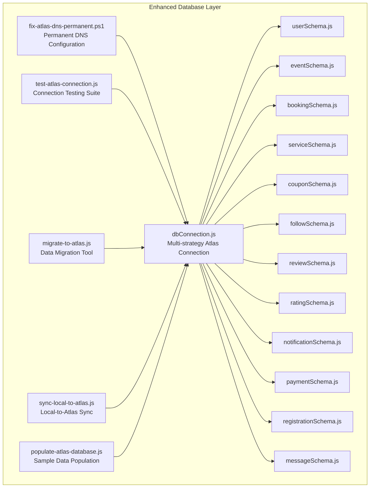

**Diagram sources**
- [dbConnection.js:19-112](file://backend/database/dbConnection.js#L19-L112)
- [fix-atlas-dns-permanent.ps1:1-165](file://backend/fix-atlas-dns-permanent.ps1#L1-L165)
- [test-atlas-connection.js:6-98](file://backend/test-atlas-connection.js#L6-L98)
- [migrate-to-atlas.js:9-97](file://backend/migrate-to-atlas.js#L9-L97)
- [sync-local-to-atlas.js:9-137](file://backend/sync-local-to-atlas.js#L9-L137)
- [populate-atlas-database.js:10-263](file://backend/populate-atlas-database.js#L10-L263)

**Section sources**
- [dbConnection.js:19-112](file://backend/database/dbConnection.js#L19-L112)
- [fix-atlas-dns-permanent.ps1:1-165](file://backend/fix-atlas-dns-permanent.ps1#L1-L165)
- [test-atlas-connection.js:6-98](file://backend/test-atlas-connection.js#L6-L98)
- [migrate-to-atlas.js:9-97](file://backend/migrate-to-atlas.js#L9-L97)
- [sync-local-to-atlas.js:9-137](file://backend/sync-local-to-atlas.js#L9-L137)
- [populate-atlas-database.js:10-263](file://backend/populate-atlas-database.js#L10-L263)

## Core Components
This section documents each collection's schema, fields, data types, validation rules, and relationships, with enhanced focus on production-ready configurations and comprehensive migration support.

- Users
  - Purpose: Store platform users, merchants, and admins with roles and statuses
  - Key fields: name, businessName, phone, serviceType, email, password, role, status
  - Validation: Name length constraints, email format validation, password minimum length, role enum validation, status enum validation
  - Indexes: Consider unique index on email for authentication and fast lookups
  - Relationships: Primary creator of Events and Services; referenced by Bookings, Coupons, Reviews, Ratings, Notifications, Payments, Registrations

- Events
  - Purpose: Represent event listings with comprehensive metadata, pricing, and ticket management
  - Key fields: title, description, category, eventType (ticketed/full-service), price, location, date, time, duration, tickets, totalTickets, availableTickets, status, rating, images[], features[], createdBy
  - Validation: Price validation, ticket quantity constraints, date/time validation, status enum, rating bounds
  - Indexes: Compound index on category + status for filtering, date index for upcoming events
  - Relationships: Created by User; linked to Bookings, Reviews, Ratings, Registrations

- Bookings
  - Purpose: Track booking requests for events and services with comprehensive status tracking
  - Key fields: user, merchant, type (event/service), eventType, eventId, eventTitle, eventCategory, eventPrice, serviceDate, serviceTime, bookingDate, guests, specialRequirements, status, totalPrice, paymentStatus, ticketType, ticketCount
  - Validation: Status enum validation, guest count constraints, price validation, ticket type validation
  - Indexes: Compound index on user + status, eventDate for scheduling, paymentStatus for financial tracking
  - Relationships: References User and Merchant; links to Payments and Notifications

- Services
  - Purpose: List service offerings with rich metadata and comprehensive search capabilities
  - Key fields: title, description, category, price, rating, images[], isActive, createdBy
  - Validation: Category enum validation, price minimum constraints, rating bounds, image validation
  - Indexes: Text index on title/description/category for full-text search, category index for filtering
  - Relationships: Created by User; referenced by Bookings and Payments

- Coupons
  - Purpose: Advanced discount management with usage limits, validity, and applicability rules
  - Key fields: code, discountType, discountValue, maxDiscount, minAmount, expiryDate, usageLimit, usedCount, isActive, description, createdBy, applicableEvents[], applicableCategories[], applicableUsers[], usageHistory[]
  - Validation: Code uppercase enforcement, discount value constraints, expiry date validation, usage limit enforcement
  - Indexes: Unique code index, composite (isActive + expiryDate), createdBy index
  - Middleware: Pre-save code normalization to uppercase
  - Relationships: Created by User; applicable to Events and Categories; tracks usage via Bookings

- Follows
  - Purpose: Track user-to-merchant relationship management
  - Key fields: user, merchant
  - Validation: User reference validation for both fields
  - Indexes: Unique compound index on user + merchant to prevent duplicates
  - Relationships: Bidirectional relationship between Users

- Reviews
  - Purpose: Capture detailed textual feedback per event with quality control
  - Key fields: user, event, rating, reviewText
  - Validation: Rating bounds validation, uniqueness constraint on user + event combination
  - Indexes: Unique compound index on user + event to prevent duplicate reviews
  - Relationships: Links User and Event with quality assurance

- Ratings
  - Purpose: Capture numerical ratings per event for aggregation
  - Key fields: user, event, rating
  - Validation: Rating bounds validation, uniqueness constraint on user + event combination
  - Indexes: Unique compound index on user + event to prevent duplicate ratings
  - Relationships: Links User and Event for statistical analysis

- Notifications
  - Purpose: Store user-specific notifications with comprehensive categorization
  - Key fields: user, message, read, eventId, bookingId, type (booking/payment/general)
  - Validation: Type enum validation, user reference validation, booking reference validation
  - Indexes: Compound index on user + createdAt for timeline, read status index for filtering
  - Relationships: Links User; optionally links Booking for context

- Payments
  - Purpose: Record comprehensive payment transactions with detailed financial tracking
  - Key fields: userId, merchantId, bookingId, eventId, totalAmount, adminCommission, merchantAmount, adminCommissionPercent, paymentStatus, paymentMethod, transactionId, paymentGateway, refund fields, merchant payout fields, currency, description, metadata
  - Validation: Amount validation via pre-save middleware, status/method enum validation, unique transactionId enforcement
  - Indexes: Composite indexes on userId + createdAt, merchantId + createdAt, bookingId, transactionId, paymentStatus
  - Middleware: Pre-save amount calculation and validation
  - Relationships: Links User (userId, merchantId), Booking, Event for comprehensive financial tracking

- Registrations
  - Purpose: Track user event attendance and participation
  - Key fields: user, event
  - Relationships: Links User and Event for attendance management

- Messages
  - Purpose: Store contact form submissions with validation
  - Key fields: name, email, subject, message
  - Validation: Input length and format validation
  - Relationships: No relational dependencies for simple contact management

**Section sources**
- [userSchema.js:4-52](file://backend/models/userSchema.js#L4-L52)
- [eventSchema.js:3-20](file://backend/models/eventSchema.js#L3-L20)
- [bookingSchema.js:3-50](file://backend/models/bookingSchema.js#L3-L50)
- [serviceSchema.js:14-77](file://backend/models/serviceSchema.js#L14-L77)
- [couponSchema.js:3-98](file://backend/models/couponSchema.js#L3-L98)
- [followSchema.js:3-21](file://backend/models/followSchema.js#L3-L21)
- [reviewSchema.js:3-11](file://backend/models/reviewSchema.js#L3-L11)
- [ratingSchema.js:3-23](file://backend/models/ratingSchema.js#L3-L23)
- [notificationSchema.js:3-33](file://backend/models/notificationSchema.js#L3-L33)
- [paymentSchema.js:3-109](file://backend/models/paymentSchema.js#L3-L109)
- [registrationSchema.js:3-9](file://backend/models/registrationSchema.js#L3-L9)
- [messageSchema.js:4-25](file://backend/models/messageSchema.js#L4-L25)

## Architecture Overview
The enhanced database architecture centers on MongoDB Atlas with comprehensive fallback strategies and permanent DNS configuration. The connection module implements three robust connection methods: standard SRV URI with forced DNS resolution, manual SRV record resolution, and direct shard host connections. Production-ready configurations include detailed logging, connection monitoring, and comprehensive error handling with actionable troubleshooting guidance.

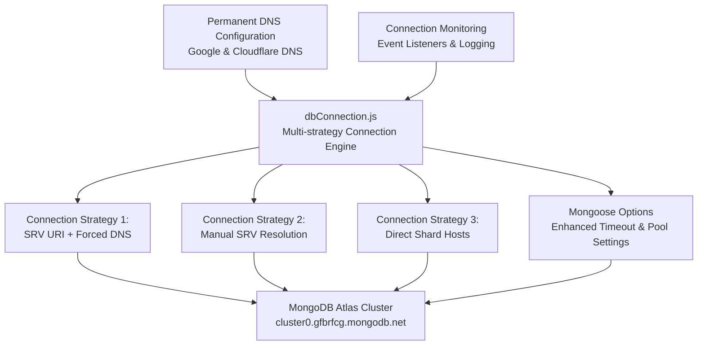

**Diagram sources**
- [dbConnection.js:19-112](file://backend/database/dbConnection.js#L19-L112)
- [fix-atlas-dns-permanent.ps1:18-35](file://backend/fix-atlas-dns-permanent.ps1#L18-L35)

**Section sources**
- [dbConnection.js:19-112](file://backend/database/dbConnection.js#L19-L112)
- [fix-atlas-dns-permanent.ps1:18-35](file://backend/fix-atlas-dns-permanent.ps1#L18-L35)

## Detailed Component Analysis

### Enhanced Users Collection
- Schema enhancements: Comprehensive role-based access control, business profile management, and enhanced validation
- Production features: Unique email indexing, role-based security, business information tracking
- Integration: Seamless relationship with all other collections for complete platform functionality

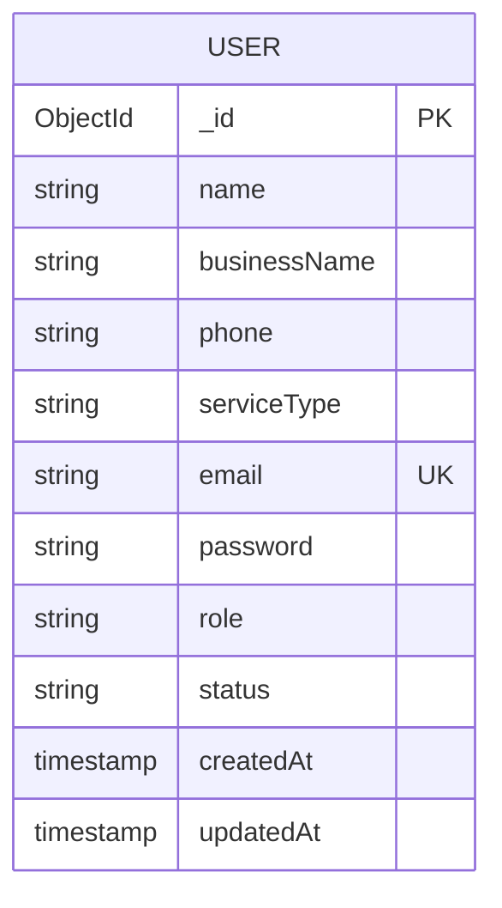

**Diagram sources**
- [userSchema.js:4-52](file://backend/models/userSchema.js#L4-L52)

**Section sources**
- [userSchema.js:4-52](file://backend/models/userSchema.js#L4-L52)

### Comprehensive Events Management
- Schema evolution: Support for both ticketed and full-service events with unified management
- Advanced features: Ticket inventory management, date/time scheduling, location tracking, comprehensive feature lists
- Business logic: Event status management, capacity tracking, pricing strategies

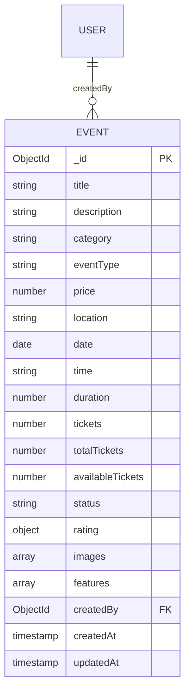

**Diagram sources**
- [eventSchema.js:3-20](file://backend/models/eventSchema.js#L3-L20)
- [userSchema.js:4-52](file://backend/models/userSchema.js#L4-L52)

**Section sources**
- [eventSchema.js:3-20](file://backend/models/eventSchema.js#L3-L20)
- [userSchema.js:4-52](file://backend/models/userSchema.js#L4-L52)

### Advanced Booking System
- Enhanced schema: Unified booking system supporting both events and services
- Comprehensive tracking: Guest management, special requirements, payment integration
- Status management: Multi-stage booking lifecycle with detailed status tracking

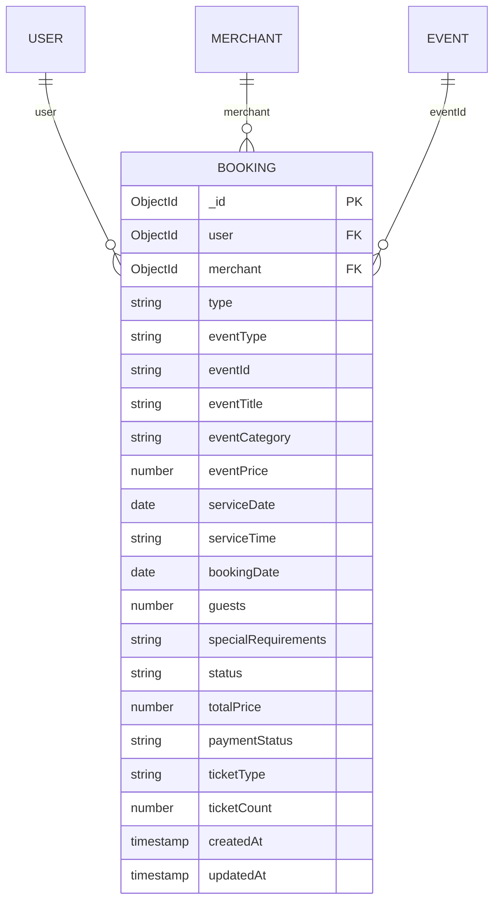

**Diagram sources**
- [bookingSchema.js:3-50](file://backend/models/bookingSchema.js#L3-L50)
- [userSchema.js:4-52](file://backend/models/userSchema.js#L4-L52)
- [serviceSchema.js:14-77](file://backend/models/serviceSchema.js#L14-L77)

**Section sources**
- [bookingSchema.js:3-50](file://backend/models/bookingSchema.js#L3-L50)
- [userSchema.js:4-52](file://backend/models/userSchema.js#L4-L52)
- [serviceSchema.js:14-77](file://backend/models/serviceSchema.js#L14-L77)

### Production-Ready Services Architecture
- Enhanced schema: Rich service catalog with comprehensive metadata and search optimization
- Performance features: Text indexes for full-text search, category filtering, rating aggregation
- Business capabilities: Active/inactive management, merchant service tracking

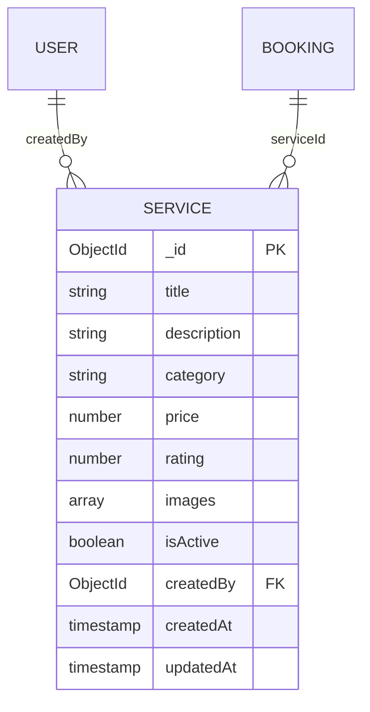

**Diagram sources**
- [serviceSchema.js:14-77](file://backend/models/serviceSchema.js#L14-L77)
- [userSchema.js:4-52](file://backend/models/userSchema.js#L4-L52)
- [bookingSchema.js:3-50](file://backend/models/bookingSchema.js#L3-L50)

**Section sources**
- [serviceSchema.js:14-77](file://backend/models/serviceSchema.js#L14-L77)
- [userSchema.js:4-52](file://backend/models/userSchema.js#L4-L52)
- [bookingSchema.js:3-50](file://backend/models/bookingSchema.js#L3-L50)

### Comprehensive Coupon Management
- Advanced schema: Sophisticated discount system with usage tracking and applicability rules
- Business logic: Usage limits, expiration management, category targeting, user-specific restrictions
- Operational features: Usage history tracking, real-time validation, automated cleanup

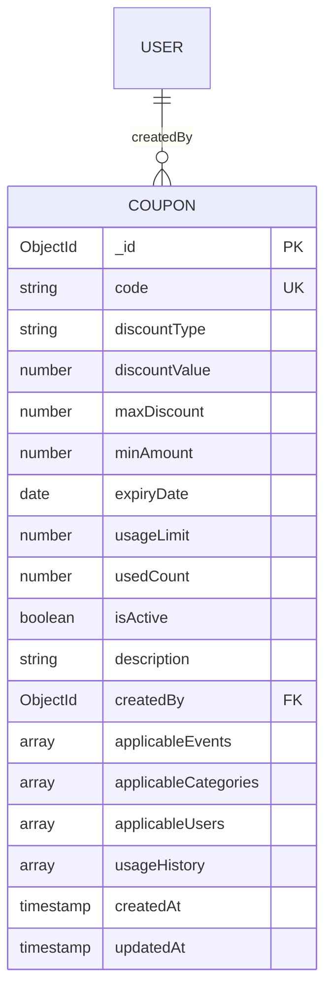

**Diagram sources**
- [couponSchema.js:3-98](file://backend/models/couponSchema.js#L3-L98)
- [userSchema.js:4-52](file://backend/models/userSchema.js#L4-L52)

**Section sources**
- [couponSchema.js:3-98](file://backend/models/couponSchema.js#L3-L98)
- [userSchema.js:4-52](file://backend/models/userSchema.js#L4-L52)

### Enhanced Relationship Management
- Simplified schema: Direct user-merchant relationship tracking
- Performance optimization: Unique compound indexing prevents duplicate relationships
- Scalability: Efficient querying for follower/following lists

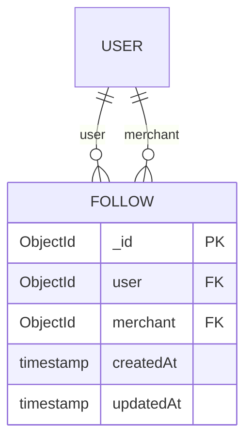

**Diagram sources**
- [followSchema.js:3-21](file://backend/models/followSchema.js#L3-L21)
- [userSchema.js:4-52](file://backend/models/userSchema.js#L4-L52)

**Section sources**
- [followSchema.js:3-21](file://backend/models/followSchema.js#L3-L21)
- [userSchema.js:4-52](file://backend/models/userSchema.js#L4-L52)

### Quality Assurance Systems
- Dual feedback mechanism: Separate review text and numerical ratings for comprehensive feedback
- Data integrity: Unique constraints prevent duplicate feedback entries
- Analytics support: Structured data enables rating aggregation and review analysis

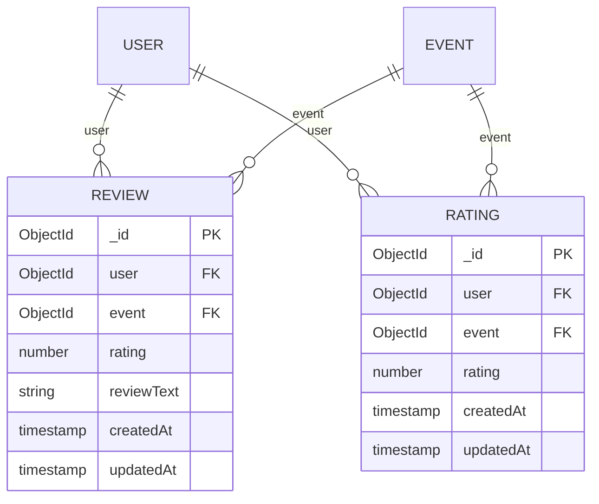

**Diagram sources**
- [reviewSchema.js:3-11](file://backend/models/reviewSchema.js#L3-L11)
- [ratingSchema.js:3-23](file://backend/models/ratingSchema.js#L3-L23)
- [userSchema.js:4-52](file://backend/models/userSchema.js#L4-L52)
- [eventSchema.js:3-20](file://backend/models/eventSchema.js#L3-L20)

**Section sources**
- [reviewSchema.js:3-11](file://backend/models/reviewSchema.js#L3-L11)
- [ratingSchema.js:3-23](file://backend/models/ratingSchema.js#L3-L23)
- [userSchema.js:4-52](file://backend/models/userSchema.js#L4-L52)
- [eventSchema.js:3-20](file://backend/models/eventSchema.js#L3-L20)

### Comprehensive Notification System
- Context-aware messaging: Event-specific and booking-specific notifications
- User experience: Read/unread status tracking with chronological ordering
- Scalability: Efficient indexing for user-centric notification retrieval

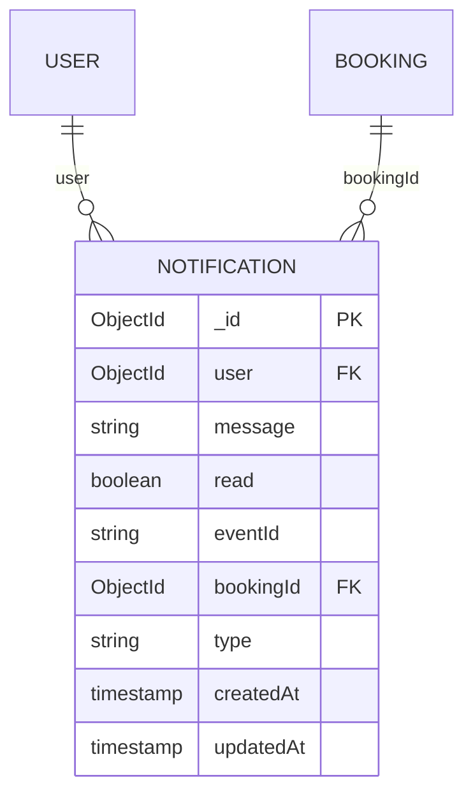

**Diagram sources**
- [notificationSchema.js:3-33](file://backend/models/notificationSchema.js#L3-L33)
- [userSchema.js:4-52](file://backend/models/userSchema.js#L4-L52)
- [bookingSchema.js:3-50](file://backend/models/bookingSchema.js#L3-L50)

**Section sources**
- [notificationSchema.js:3-33](file://backend/models/notificationSchema.js#L3-L33)
- [userSchema.js:4-52](file://backend/models/userSchema.js#L4-L52)
- [bookingSchema.js:3-50](file://backend/models/bookingSchema.js#L3-L50)

### Enterprise Payment Processing
- Complete financial tracking: Multi-stakeholder commission management
- Audit trail: Comprehensive payment history with refund tracking
- Compliance: Currency support, detailed metadata, transaction verification

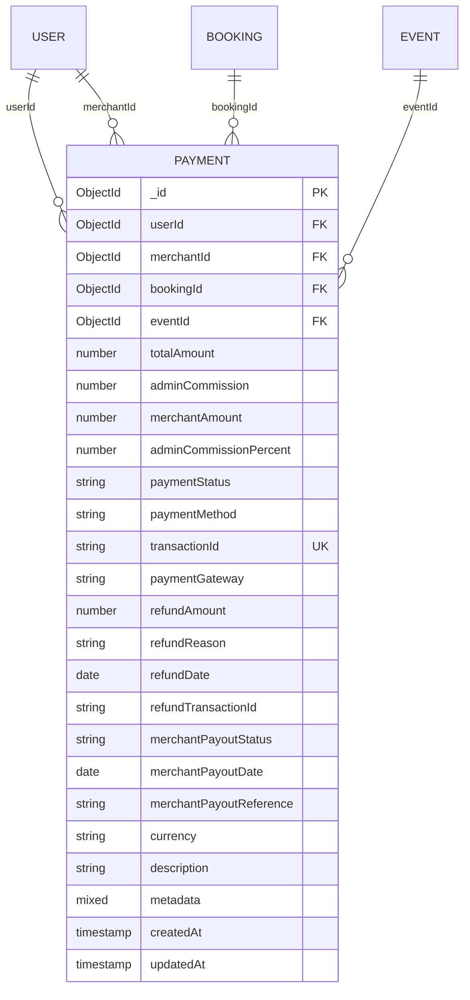

**Diagram sources**
- [paymentSchema.js:3-109](file://backend/models/paymentSchema.js#L3-L109)
- [userSchema.js:4-52](file://backend/models/userSchema.js#L4-L52)
- [bookingSchema.js:3-50](file://backend/models/bookingSchema.js#L3-L50)
- [eventSchema.js:3-20](file://backend/models/eventSchema.js#L3-L20)

**Section sources**
- [paymentSchema.js:3-109](file://backend/models/paymentSchema.js#L3-L109)
- [userSchema.js:4-52](file://backend/models/userSchema.js#L4-L52)
- [bookingSchema.js:3-50](file://backend/models/bookingSchema.js#L3-L50)
- [eventSchema.js:3-20](file://backend/models/eventSchema.js#L3-L20)

### Contact Management
- Simple schema: Essential contact form data with validation
- Privacy: No user account creation from contact submissions
- Integration: Supports customer service workflows

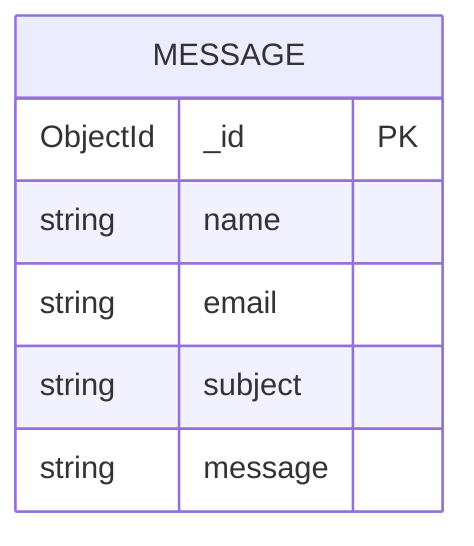

**Diagram sources**
- [messageSchema.js:4-25](file://backend/models/messageSchema.js#L4-L25)

**Section sources**
- [messageSchema.js:4-25](file://backend/models/messageSchema.js#L4-L25)

## Dependency Analysis
The enhanced dependency graph reflects the comprehensive relationships between collections, with particular emphasis on the unified booking system and advanced notification architecture.

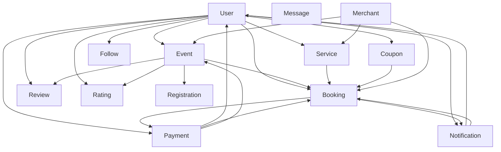

**Diagram sources**
- [userSchema.js:4-52](file://backend/models/userSchema.js#L4-L52)
- [eventSchema.js:3-20](file://backend/models/eventSchema.js#L3-L20)
- [bookingSchema.js:3-50](file://backend/models/bookingSchema.js#L3-L50)
- [serviceSchema.js:14-77](file://backend/models/serviceSchema.js#L14-L77)
- [couponSchema.js:3-98](file://backend/models/couponSchema.js#L3-L98)
- [followSchema.js:3-21](file://backend/models/followSchema.js#L3-L21)
- [reviewSchema.js:3-11](file://backend/models/reviewSchema.js#L3-L11)
- [ratingSchema.js:3-23](file://backend/models/ratingSchema.js#L3-L23)
- [notificationSchema.js:3-33](file://backend/models/notificationSchema.js#L3-L33)
- [paymentSchema.js:3-109](file://backend/models/paymentSchema.js#L3-L109)
- [registrationSchema.js:3-9](file://backend/models/registrationSchema.js#L3-L9)
- [messageSchema.js:4-25](file://backend/models/messageSchema.js#L4-L25)

**Section sources**
- [userSchema.js:4-52](file://backend/models/userSchema.js#L4-L52)
- [eventSchema.js:3-20](file://backend/models/eventSchema.js#L3-L20)
- [bookingSchema.js:3-50](file://backend/models/bookingSchema.js#L3-L50)
- [serviceSchema.js:14-77](file://backend/models/serviceSchema.js#L14-L77)
- [couponSchema.js:3-98](file://backend/models/couponSchema.js#L3-L98)
- [followSchema.js:3-21](file://backend/models/followSchema.js#L3-L21)
- [reviewSchema.js:3-11](file://backend/models/reviewSchema.js#L3-L11)
- [ratingSchema.js:3-23](file://backend/models/ratingSchema.js#L3-L23)
- [notificationSchema.js:3-33](file://backend/models/notificationSchema.js#L3-L33)
- [paymentSchema.js:3-109](file://backend/models/paymentSchema.js#L3-L109)
- [registrationSchema.js:3-9](file://backend/models/registrationSchema.js#L3-L9)
- [messageSchema.js:4-25](file://backend/models/messageSchema.js#L4-L25)

## Performance Considerations
- Enhanced indexing strategy
  - Events: Compound index on (category + status) for filtering, date index for scheduling queries
  - Services: Text index on title/description/category for search, category index for filtering
  - Bookings: Compound index on (user + status) for user-centric queries, paymentStatus index for financial reporting
  - Payments: Composite indexes on (userId + createdAt), (merchantId + createdAt), bookingId, transactionId, paymentStatus
  - Reviews/Ratings: Unique compound index on (user + event) to prevent duplicates and enable fast lookup
  - Follows: Unique compound index on (user + merchant) for relationship management
  - Notifications: Compound index on (user + createdAt) for timeline queries, read status index for filtering
- Query optimization
  - Use lean queries and selective projections to minimize payload size
  - Leverage compound indexes for common filter/sort patterns (user + createdAt, category + status)
  - Implement pagination for large result sets, especially for notifications and booking histories
  - Use aggregation pipelines for complex reporting queries on payments and bookings
- Production connection reliability
  - Multi-strategy connection with automatic fallback between SRV, manual SRV resolution, and direct shard connections
  - Enhanced DNS configuration with permanent Google and Cloudflare DNS servers
  - Comprehensive error handling with detailed logging and actionable troubleshooting messages
  - Connection monitoring with event listeners for disconnection/reconnection events
- Data validation and integrity
  - Pre-save middleware for amount validation in payments and code normalization in coupons
  - Comprehensive input validation at schema level with custom validators
  - Unique constraints to prevent data duplication across critical relationships
- Storage optimization
  - Embedded arrays for related data (images, features) with reasonable size limits
  - Reference patterns for scalable relationships (user references) to avoid document growth issues
  - Efficient indexing strategy to balance write performance with query speed

## Production-Ready Database Configuration
The platform now supports comprehensive production-ready database configurations with multiple deployment options and robust operational procedures.

### MongoDB Atlas Configuration
- **Cluster Setup**: MongoDB Atlas cluster with automatic scaling and high availability
- **Network Security**: IP whitelist configuration with flexible access controls
- **Authentication**: Dedicated database users with appropriate permissions
- **Backup Strategy**: Automated backups with point-in-time recovery capabilities
- **Monitoring**: Built-in performance monitoring and alerting systems

### Permanent DNS Configuration Solution
The comprehensive DNS configuration script provides permanent resolution of MongoDB Atlas SRV records through multiple layers of system integration:

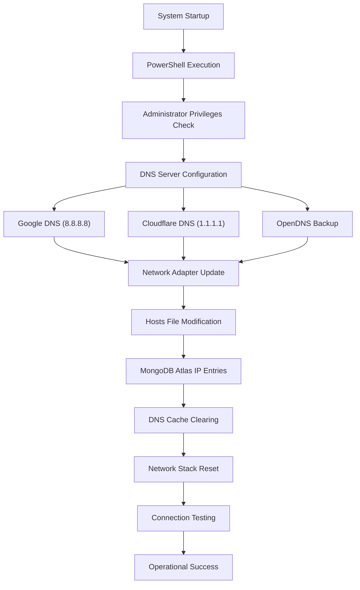

**Diagram sources**
- [fix-atlas-dns-permanent.ps1:18-101](file://backend/fix-atlas-dns-permanent.ps1#L18-L101)

### Connection Strategy Implementation
The enhanced connection module implements three-tiered connection reliability:

1. **Primary Strategy**: SRV URI with forced DNS resolution using Google and Cloudflare DNS servers
2. **Secondary Strategy**: Manual SRV record resolution with custom DNS client
3. **Emergency Strategy**: Direct shard host connections with replica set configuration

**Section sources**
- [dbConnection.js:19-112](file://backend/database/dbConnection.js#L19-L112)
- [fix-atlas-dns-permanent.ps1:18-101](file://backend/fix-atlas-dns-permanent.ps1#L18-L101)

## Comprehensive Data Migration Procedures
The platform provides complete data migration capabilities between local and cloud environments with automated validation and rollback support.

### Migration Tool Suite
- **migrate-to-atlas.js**: Complete data migration from local MongoDB to MongoDB Atlas
- **sync-local-to-atlas.js**: Incremental synchronization of local changes to Atlas
- **populate-atlas-database.js**: Sample data population for development and testing environments

### Migration Workflow
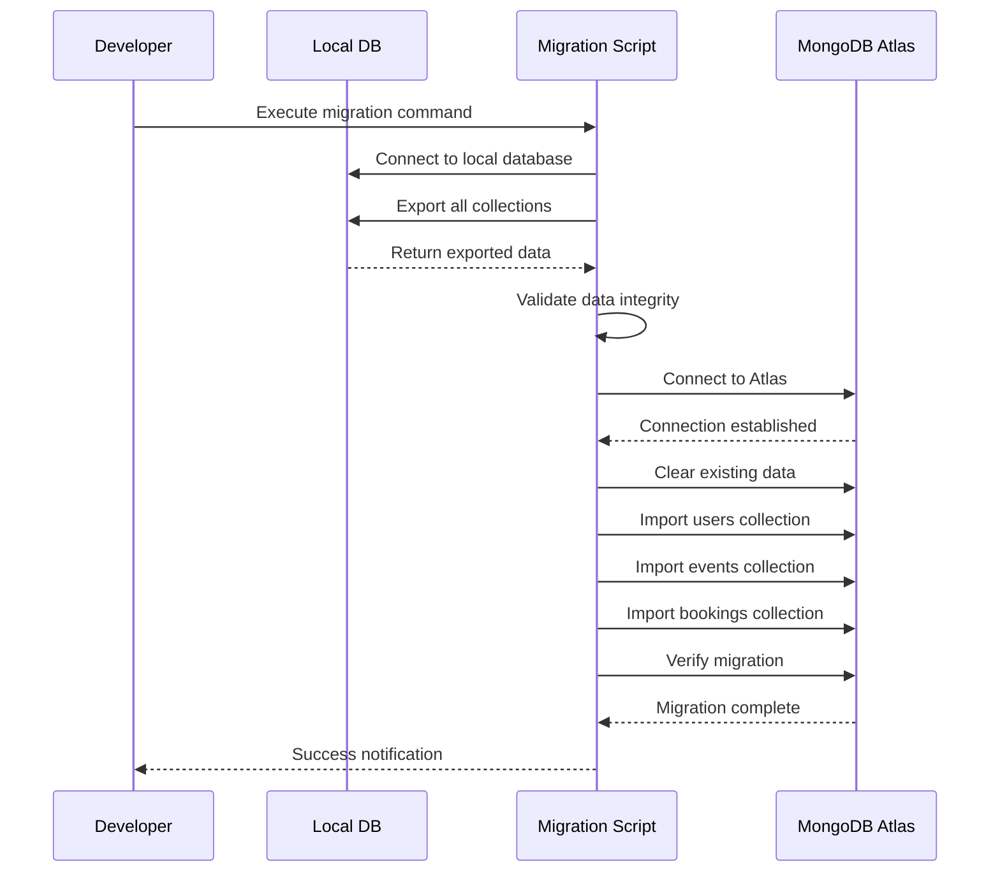

**Diagram sources**
- [migrate-to-atlas.js:9-97](file://backend/migrate-to-atlas.js#L9-L97)
- [sync-local-to-atlas.js:9-137](file://backend/sync-local-to-atlas.js#L9-L137)
- [populate-atlas-database.js:10-263](file://backend/populate-atlas-database.js#L10-L263)

### Migration Features
- **Data Validation**: Automatic validation of data integrity during migration
- **Progress Tracking**: Real-time progress reporting for long-running migrations
- **Error Handling**: Comprehensive error handling with rollback capabilities
- **Atomic Operations**: Collection-level atomic imports to prevent partial data states
- **Verification**: Post-migration verification of imported data completeness

**Section sources**
- [migrate-to-atlas.js:9-97](file://backend/migrate-to-atlas.js#L9-L97)
- [sync-local-to-atlas.js:9-137](file://backend/sync-local-to-atlas.js#L9-L137)
- [populate-atlas-database.js:10-263](file://backend/populate-atlas-database.js#L10-L263)

## Advanced Troubleshooting and Diagnostics
The platform provides comprehensive diagnostic tools and troubleshooting procedures for MongoDB Atlas connectivity issues.

### Connection Testing Suite
The test-atlas-connection.js script provides systematic testing of multiple connection methods:

1. **SRV Connection Testing**: Validates standard MongoDB Atlas SRV connection
2. **Direct Replica Set Testing**: Tests connection using direct shard host URLs
3. **Single IP Testing**: Validates connection using individual shard IP addresses

### Diagnostic Features
- **Multi-method Testing**: Automatic testing of connection strategies in order of preference
- **Operation Validation**: Tests write/read operations to validate database functionality
- **Error Classification**: Detailed error messages with specific remediation steps
- **Network Diagnostics**: Connectivity testing and network configuration validation

### Troubleshooting Workflow
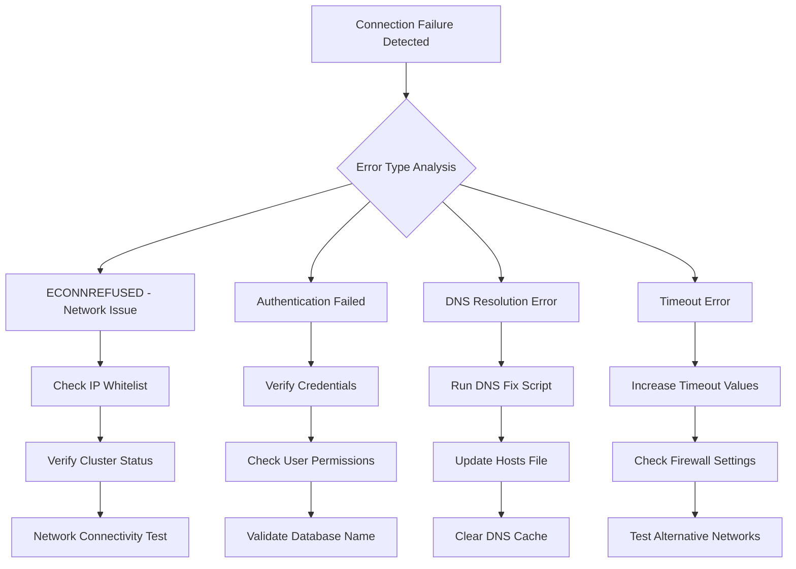

**Diagram sources**
- [test-atlas-connection.js:6-98](file://backend/test-atlas-connection.js#L6-L98)
- [fix-dns-windows.bat:1-29](file://backend/fix-dns-windows.bat#L1-L29)

### Operational Monitoring
The enhanced connection module provides comprehensive monitoring of database operations:

- **Connection State Tracking**: Real-time monitoring of connection status changes
- **Error Logging**: Detailed error messages with actionable troubleshooting guidance
- **Reconnection Handling**: Automatic reconnection attempts with exponential backoff
- **Performance Metrics**: Connection timing and performance monitoring

**Section sources**
- [test-atlas-connection.js:6-98](file://backend/test-atlas-connection.js#L6-L98)
- [fix-dns-windows.bat:1-29](file://backend/fix-dns-windows.bat#L1-L29)
- [dbConnection.js:96-112](file://backend/database/dbConnection.js#L96-L112)

## Conclusion
The enhanced database design for the MERN Stack Event Management Platform represents a comprehensive evolution toward production-ready database operations. The integration of MongoDB Atlas with permanent DNS configuration solutions ensures reliable connectivity, while the extensive migration tool suite provides seamless data portability between local and cloud environments. The multi-strategy connection approach with comprehensive monitoring and troubleshooting capabilities delivers enterprise-grade database reliability. The detailed schema design with optimized indexing strategies, robust validation rules, and comprehensive relationship management supports the platform's complex event management and booking workflows. These enhancements collectively provide a solid foundation for scalable, reliable, and maintainable database operations in production environments.

## Appendices

### A. Enhanced Collection Indexes Summary
- **Events**: Compound (category + status), date index for scheduling queries
- **Services**: Text index on (title, description, category), category index for filtering
- **Bookings**: Compound (user + status), paymentStatus index for financial reporting
- **Payments**: Composite (userId + createdAt), (merchantId + createdAt), bookingId, transactionId, paymentStatus
- **Reviews**: Unique (user + event) to prevent duplicate feedback
- **Ratings**: Unique (user + event) for data integrity
- **Follows**: Unique (user + merchant) for relationship management
- **Notifications**: Compound (user + createdAt), read status index for filtering
- **Users**: Consider unique email index for authentication

**Section sources**
- [eventSchema.js:3-20](file://backend/models/eventSchema.js#L3-L20)
- [serviceSchema.js:14-77](file://backend/models/serviceSchema.js#L14-L77)
- [bookingSchema.js:3-50](file://backend/models/bookingSchema.js#L3-L50)
- [paymentSchema.js:3-109](file://backend/models/paymentSchema.js#L3-L109)
- [reviewSchema.js:3-11](file://backend/models/reviewSchema.js#L3-L11)
- [ratingSchema.js:3-23](file://backend/models/ratingSchema.js#L3-L23)
- [followSchema.js:3-21](file://backend/models/followSchema.js#L3-L21)
- [notificationSchema.js:3-33](file://backend/models/notificationSchema.js#L3-L33)
- [userSchema.js:4-52](file://backend/models/userSchema.js#L4-L52)

### B. Enhanced Sample Data Structures
- **Users**: name, businessName, phone, serviceType, email, password, role, status
- **Events**: title, description, category, eventType, price, location, date, time, duration, tickets, totalTickets, availableTickets, status, rating, images[], features[], createdBy
- **Bookings**: user, merchant, type, eventType, eventId, eventTitle, eventCategory, eventPrice, serviceDate, serviceTime, bookingDate, guests, specialRequirements, status, totalPrice, paymentStatus, ticketType, ticketCount
- **Services**: title, description, category, price, rating, images[], isActive, createdBy
- **Coupons**: code, discountType, discountValue, maxDiscount, minAmount, expiryDate, usageLimit, usedCount, isActive, description, createdBy, applicableEvents[], applicableCategories[], applicableUsers[], usageHistory[]
- **Follows**: user, merchant
- **Reviews**: user, event, rating, reviewText
- **Ratings**: user, event, rating
- **Notifications**: user, message, read, eventId, bookingId, type
- **Payments**: userId, merchantId, bookingId, eventId, totalAmount, adminCommission, merchantAmount, adminCommissionPercent, paymentStatus, paymentMethod, transactionId, paymentGateway, refund fields, merchant payout fields, currency, description, metadata
- **Registrations**: user, event
- **Messages**: name, email, subject, message

**Section sources**
- [userSchema.js:4-52](file://backend/models/userSchema.js#L4-L52)
- [eventSchema.js:3-20](file://backend/models/eventSchema.js#L3-L20)
- [bookingSchema.js:3-50](file://backend/models/bookingSchema.js#L3-L50)
- [serviceSchema.js:14-77](file://backend/models/serviceSchema.js#L14-L77)
- [couponSchema.js:3-98](file://backend/models/couponSchema.js#L3-L98)
- [followSchema.js:3-21](file://backend/models/followSchema.js#L3-L21)
- [reviewSchema.js:3-11](file://backend/models/reviewSchema.js#L3-L11)
- [ratingSchema.js:3-23](file://backend/models/ratingSchema.js#L3-L23)
- [notificationSchema.js:3-33](file://backend/models/notificationSchema.js#L3-L33)
- [paymentSchema.js:3-109](file://backend/models/paymentSchema.js#L3-L109)
- [registrationSchema.js:3-9](file://backend/models/registrationSchema.js#L3-L9)
- [messageSchema.js:4-25](file://backend/models/messageSchema.js#L4-L25)

### C. Production Deployment Checklist
- **MongoDB Atlas Setup**: Cluster provisioning, network access configuration, user creation
- **DNS Configuration**: Permanent DNS server setup, hosts file modification, network stack reset
- **Connection Testing**: Multi-strategy connection validation, operational testing
- **Data Migration**: Local to Atlas migration, data validation, backup verification
- **Monitoring Setup**: Connection monitoring, error logging, performance metrics
- **Security Configuration**: IP whitelist, authentication, encryption settings
- **Backup Strategy**: Automated backup configuration, disaster recovery procedures

**Section sources**
- [MONGODB_ATLAS_PERMANENT_SOLUTION.md:1-173](file://backend/MONGODB_ATLAS_PERMANENT_SOLUTION.md#L1-L173)
- [DATABASE_TROUBLESHOOTING.md:1-137](file://backend/DATABASE_TROUBLESHOOTING.md#L1-L137)
- [test-atlas-connection.js:6-98](file://backend/test-atlas-connection.js#L6-L98)

### D. Migration Command Reference
- **Complete Migration**: `node migrate-to-atlas.js`
- **Local Sync**: `node sync-local-to-atlas.js`
- **Sample Data**: `node populate-atlas-database.js`
- **Connection Test**: `node test-atlas-connection.js`
- **DNS Fix**: `./fix-dns-windows.bat` or `./fix-atlas-dns-permanent.ps1`

**Section sources**
- [migrate-to-atlas.js:9-97](file://backend/migrate-to-atlas.js#L9-L97)
- [sync-local-to-atlas.js:9-137](file://backend/sync-local-to-atlas.js#L9-L137)
- [populate-atlas-database.js:10-263](file://backend/populate-atlas-database.js#L10-L263)
- [test-atlas-connection.js:6-98](file://backend/test-atlas-connection.js#L6-L98)
- [fix-dns-windows.bat:1-29](file://backend/fix-dns-windows.bat#L1-L29)
- [fix-atlas-dns-permanent.ps1:1-165](file://backend/fix-atlas-dns-permanent.ps1#L1-L165)