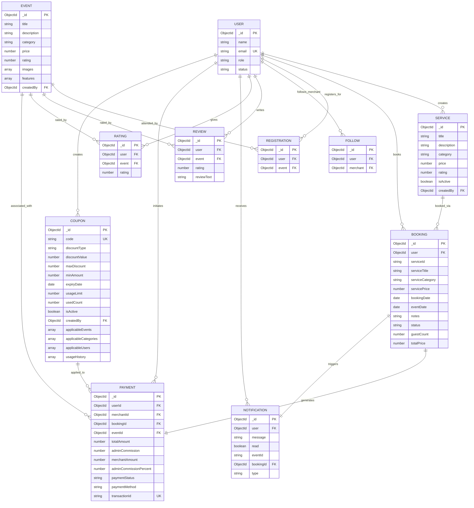
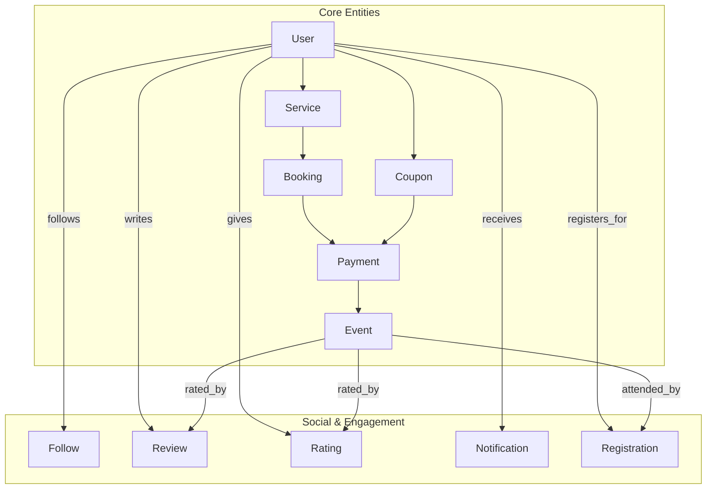
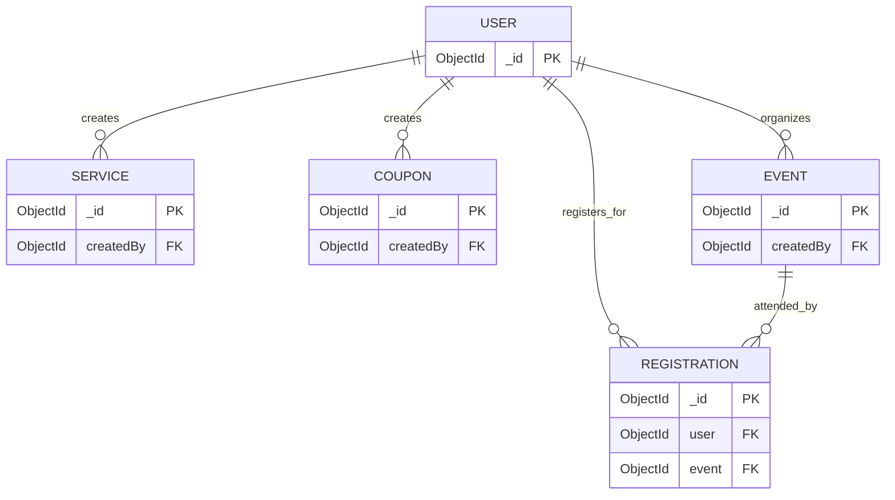
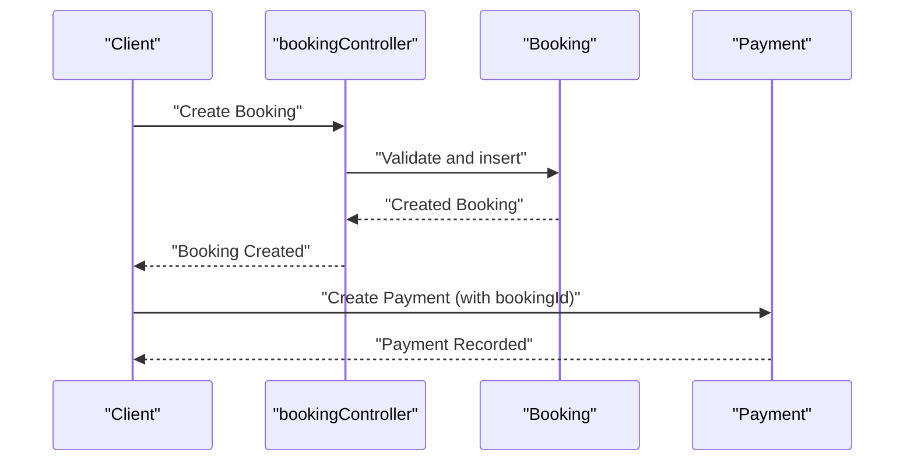
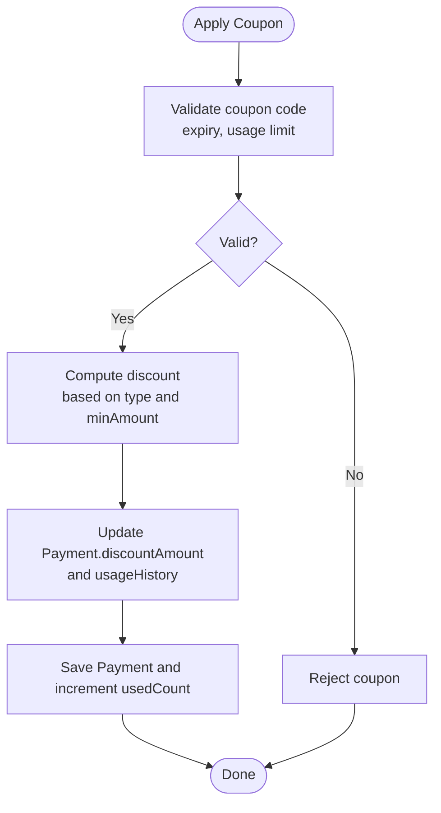
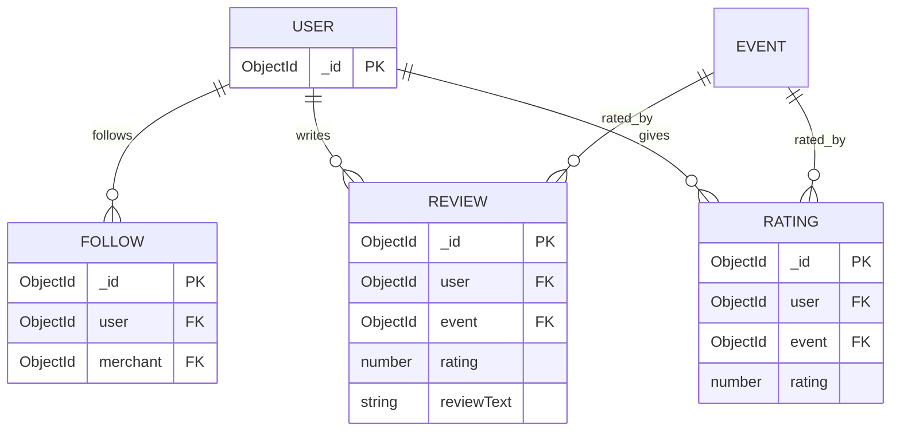
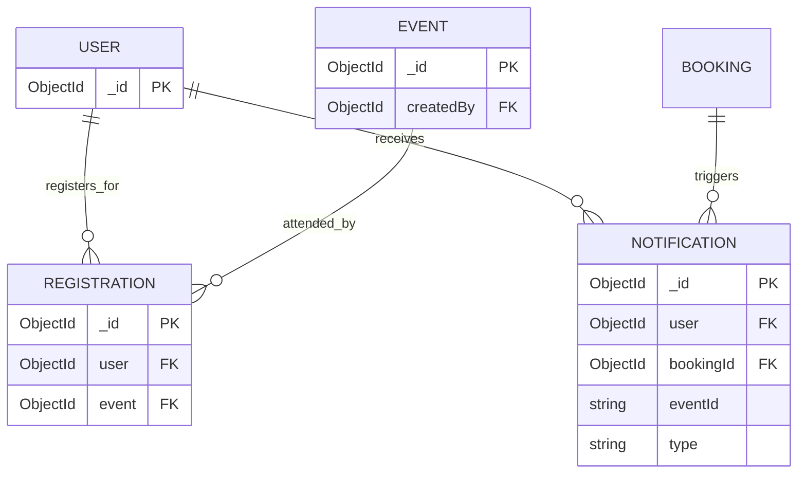
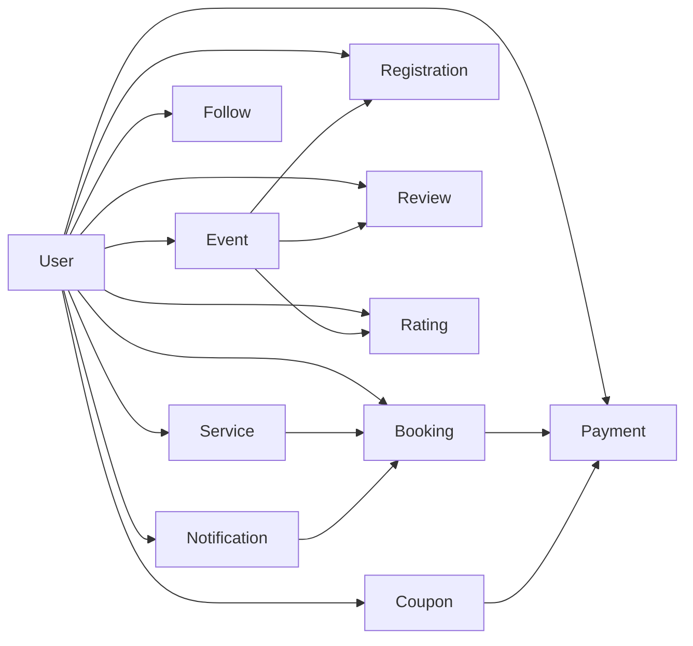

# Entity Relationships and Data Modeling

<cite>
**Referenced Files in This Document**
- [userSchema.js](file://backend/models/userSchema.js)
- [eventSchema.js](file://backend/models/eventSchema.js)
- [bookingSchema.js](file://backend/models/bookingSchema.js)
- [serviceSchema.js](file://backend/models/serviceSchema.js)
- [followSchema.js](file://backend/models/followSchema.js)
- [reviewSchema.js](file://backend/models/reviewSchema.js)
- [ratingSchema.js](file://backend/models/ratingSchema.js)
- [notificationSchema.js](file://backend/models/notificationSchema.js)
- [paymentSchema.js](file://backend/models/paymentSchema.js)
- [registrationSchema.js](file://backend/models/registrationSchema.js)
- [couponSchema.js](file://backend/models/couponSchema.js)
- [eventController.js](file://backend/controller/eventController.js)
- [bookingController.js](file://backend/controller/bookingController.js)
- [serviceController.js](file://backend/controller/serviceController.js)
</cite>

## Table of Contents
1. [Introduction](#introduction)
2. [Project Structure](#project-structure)
3. [Core Components](#core-components)
4. [Architecture Overview](#architecture-overview)
5. [Detailed Component Analysis](#detailed-component-analysis)
6. [Dependency Analysis](#dependency-analysis)
7. [Performance Considerations](#performance-considerations)
8. [Troubleshooting Guide](#troubleshooting-guide)
9. [Conclusion](#conclusion)
10. [Appendices](#appendices)

## Introduction
This document provides comprehensive entity relationship and data modeling documentation for the MERN Stack Event Management Platform. It explains how MongoDB collections relate to each other via references and embedded documents, details foreign key relationships, one-to-many and many-to-many associations among users, events, bookings, services, and social features, and discusses denormalization versus normalization trade-offs. It also covers indexing strategies, referential integrity constraints, and aggregation pipelines for complex queries and data retrieval patterns.

## Project Structure
The backend models define the schema for each collection. Controllers orchestrate CRUD operations and demonstrate query patterns. The following diagram shows the primary entities and their relationships at the code level.

**Diagram sources**
- [userSchema.js:1-55](file://backend/models/userSchema.js#L1-L55)
- [serviceSchema.js:1-83](file://backend/models/serviceSchema.js#L1-L83)
- [bookingSchema.js:1-53](file://backend/models/bookingSchema.js#L1-L53)
- [eventSchema.js:1-23](file://backend/models/eventSchema.js#L1-L23)
- [registrationSchema.js:1-12](file://backend/models/registrationSchema.js#L1-L12)
- [followSchema.js:1-22](file://backend/models/followSchema.js#L1-L22)
- [reviewSchema.js:1-17](file://backend/models/reviewSchema.js#L1-L17)
- [ratingSchema.js:1-28](file://backend/models/ratingSchema.js#L1-L28)
- [notificationSchema.js:1-36](file://backend/models/notificationSchema.js#L1-L36)
- [paymentSchema.js:1-142](file://backend/models/paymentSchema.js#L1-L142)
- [couponSchema.js:1-123](file://backend/models/couponSchema.js#L1-L123)

**Section sources**
- [userSchema.js:1-55](file://backend/models/userSchema.js#L1-L55)
- [serviceSchema.js:1-83](file://backend/models/serviceSchema.js#L1-L83)
- [bookingSchema.js:1-53](file://backend/models/bookingSchema.js#L1-L53)
- [eventSchema.js:1-23](file://backend/models/eventSchema.js#L1-L23)
- [registrationSchema.js:1-12](file://backend/models/registrationSchema.js#L1-L12)
- [followSchema.js:1-22](file://backend/models/followSchema.js#L1-L22)
- [reviewSchema.js:1-17](file://backend/models/reviewSchema.js#L1-L17)
- [ratingSchema.js:1-28](file://backend/models/ratingSchema.js#L1-L28)
- [notificationSchema.js:1-36](file://backend/models/notificationSchema.js#L1-L36)
- [paymentSchema.js:1-142](file://backend/models/paymentSchema.js#L1-L142)
- [couponSchema.js:1-123](file://backend/models/couponSchema.js#L1-L123)

## Core Components
This section outlines the principal entities and their roles in the platform.

- User
  - Stores identity, role, and account status.
  - References: created Service, created Coupon, follows Users (via Follow), writes Reviews/Ratings, initiates Payments, registers for Events.
- Service
  - Describes offerings with category, pricing, ratings, and images.
  - References: createdBy User.
- Booking
  - Captures user bookings for services, including pricing, guests, and status.
  - References: user User.
  - Denormalized fields: serviceId, serviceTitle, serviceCategory, servicePrice for operational convenience.
- Event
  - Represents event details with images and features.
  - References: createdBy User.
- Registration
  - Tracks user participation in events (many-to-many via join).
  - References: user User, event Event.
- Follow
  - Tracks user-to-merchant follow relationships (unique constraint).
  - References: user User, merchant User.
- Review and Rating
  - Per-event reviews and numeric ratings.
  - References: user User, event Event.
  - Unique composite indexes prevent duplicate per-user-per-event entries.
- Notification
  - User-centric notifications with optional booking and event linkage.
  - References: user User, booking Booking.
- Payment
  - Records transaction details, splits, and payouts.
  - References: userId User, merchantId User, bookingId Booking, eventId Event.
  - Includes pre-save validation for amount consistency and virtual fields for computed percentages.
- Coupon
  - Manages promotional codes with usage limits, applicability, and usage history.
  - References: createdBy User.
  - Embedded arrays for applicable items and usage tracking.

**Section sources**
- [userSchema.js:1-55](file://backend/models/userSchema.js#L1-L55)
- [serviceSchema.js:1-83](file://backend/models/serviceSchema.js#L1-L83)
- [bookingSchema.js:1-53](file://backend/models/bookingSchema.js#L1-L53)
- [eventSchema.js:1-23](file://backend/models/eventSchema.js#L1-L23)
- [registrationSchema.js:1-12](file://backend/models/registrationSchema.js#L1-L12)
- [followSchema.js:1-22](file://backend/models/followSchema.js#L1-L22)
- [reviewSchema.js:1-17](file://backend/models/reviewSchema.js#L1-L17)
- [ratingSchema.js:1-28](file://backend/models/ratingSchema.js#L1-L28)
- [notificationSchema.js:1-36](file://backend/models/notificationSchema.js#L1-L36)
- [paymentSchema.js:1-142](file://backend/models/paymentSchema.js#L1-L142)
- [couponSchema.js:1-123](file://backend/models/couponSchema.js#L1-L123)

## Architecture Overview
The system employs a hybrid data model:
- Referenced relationships for strong referential integrity and normalized storage (e.g., User to Event, User to Booking).
- Denormalized fields within Booking for quick rendering and reduced joins during checkout and listing flows.
- Embedded arrays for usage history and media metadata to simplify reads and reduce round-trips.

**Diagram sources**
- [userSchema.js:1-55](file://backend/models/userSchema.js#L1-L55)
- [serviceSchema.js:1-83](file://backend/models/serviceSchema.js#L1-L83)
- [bookingSchema.js:1-53](file://backend/models/bookingSchema.js#L1-L53)
- [eventSchema.js:1-23](file://backend/models/eventSchema.js#L1-L23)
- [registrationSchema.js:1-12](file://backend/models/registrationSchema.js#L1-L12)
- [followSchema.js:1-22](file://backend/models/followSchema.js#L1-L22)
- [reviewSchema.js:1-17](file://backend/models/reviewSchema.js#L1-L17)
- [ratingSchema.js:1-28](file://backend/models/ratingSchema.js#L1-L28)
- [notificationSchema.js:1-36](file://backend/models/notificationSchema.js#L1-L36)
- [paymentSchema.js:1-142](file://backend/models/paymentSchema.js#L1-L142)
- [couponSchema.js:1-123](file://backend/models/couponSchema.js#L1-L123)

## Detailed Component Analysis

### User-Related Relationships
- One-to-many: User creates multiple Services and Coupons.
- Many-to-many via join: User participates in multiple Events via Registrations; Event has many Registrations.
- Social graph: User follows multiple Merchants (Users); Merchant is a subtype of User.

**Diagram sources**
- [userSchema.js:1-55](file://backend/models/userSchema.js#L1-L55)
- [serviceSchema.js:1-83](file://backend/models/serviceSchema.js#L1-L83)
- [couponSchema.js:1-123](file://backend/models/couponSchema.js#L1-L123)
- [registrationSchema.js:1-12](file://backend/models/registrationSchema.js#L1-L12)
- [eventSchema.js:1-23](file://backend/models/eventSchema.js#L1-L23)

**Section sources**
- [userSchema.js:1-55](file://backend/models/userSchema.js#L1-L55)
- [serviceSchema.js:1-83](file://backend/models/serviceSchema.js#L1-L83)
- [couponSchema.js:1-123](file://backend/models/couponSchema.js#L1-L123)
- [registrationSchema.js:1-12](file://backend/models/registrationSchema.js#L1-L12)
- [eventSchema.js:1-23](file://backend/models/eventSchema.js#L1-L23)

### Booking and Payment Flow
- Booking captures user intent and denormalizes service metadata for UI convenience.
- Payment links a booking to a user and merchant, stores splits, and enforces amount validation.

**Diagram sources**
- [bookingController.js:1-200](file://backend/controller/bookingController.js#L1-L200)
- [bookingSchema.js:1-53](file://backend/models/bookingSchema.js#L1-L53)
- [paymentSchema.js:1-142](file://backend/models/paymentSchema.js#L1-L142)

**Section sources**
- [bookingController.js:1-200](file://backend/controller/bookingController.js#L1-L200)
- [bookingSchema.js:1-53](file://backend/models/bookingSchema.js#L1-L53)
- [paymentSchema.js:1-142](file://backend/models/paymentSchema.js#L1-L142)

### Coupon Application and Usage Tracking
- Coupons are referenced by Payments to compute discounts.
- Usage history embeds user and booking references for auditability.

**Diagram sources**
- [couponSchema.js:1-123](file://backend/models/couponSchema.js#L1-L123)
- [paymentSchema.js:1-142](file://backend/models/paymentSchema.js#L1-L142)

**Section sources**
- [couponSchema.js:1-123](file://backend/models/couponSchema.js#L1-L123)
- [paymentSchema.js:1-142](file://backend/models/paymentSchema.js#L1-L142)

### Social Features: Follow, Review, Rating
- Follow ensures uniqueness of user-to-merchant relationships.
- Review and Rating enforce uniqueness per user-event pair.

**Diagram sources**
- [followSchema.js:1-22](file://backend/models/followSchema.js#L1-L22)
- [reviewSchema.js:1-17](file://backend/models/reviewSchema.js#L1-L17)
- [ratingSchema.js:1-28](file://backend/models/ratingSchema.js#L1-L28)

**Section sources**
- [followSchema.js:1-22](file://backend/models/followSchema.js#L1-L22)
- [reviewSchema.js:1-17](file://backend/models/reviewSchema.js#L1-L17)
- [ratingSchema.js:1-28](file://backend/models/ratingSchema.js#L1-L28)

### Event Participation and Notifications
- Registrations link users to events.
- Notifications can be scoped to users and optionally to bookings or events.

**Diagram sources**
- [registrationSchema.js:1-12](file://backend/models/registrationSchema.js#L1-L12)
- [notificationSchema.js:1-36](file://backend/models/notificationSchema.js#L1-L36)
- [eventController.js:1-35](file://backend/controller/eventController.js#L1-L35)

**Section sources**
- [registrationSchema.js:1-12](file://backend/models/registrationSchema.js#L1-L12)
- [notificationSchema.js:1-36](file://backend/models/notificationSchema.js#L1-L36)
- [eventController.js:1-35](file://backend/controller/eventController.js#L1-L35)

## Dependency Analysis
- Referential integrity is enforced via ObjectId references and unique compound indexes where applicable.
- Denormalization appears primarily in Booking (service metadata) to optimize read-heavy UI flows.
- Aggregation pipelines are not present in the examined models; however, controllers demonstrate filtering and sorting patterns that could be translated into aggregation stages.

**Diagram sources**
- [userSchema.js:1-55](file://backend/models/userSchema.js#L1-L55)
- [serviceSchema.js:1-83](file://backend/models/serviceSchema.js#L1-L83)
- [bookingSchema.js:1-53](file://backend/models/bookingSchema.js#L1-L53)
- [eventSchema.js:1-23](file://backend/models/eventSchema.js#L1-L23)
- [registrationSchema.js:1-12](file://backend/models/registrationSchema.js#L1-L12)
- [followSchema.js:1-22](file://backend/models/followSchema.js#L1-L22)
- [reviewSchema.js:1-17](file://backend/models/reviewSchema.js#L1-L17)
- [ratingSchema.js:1-28](file://backend/models/ratingSchema.js#L1-L28)
- [notificationSchema.js:1-36](file://backend/models/notificationSchema.js#L1-L36)
- [paymentSchema.js:1-142](file://backend/models/paymentSchema.js#L1-L142)
- [couponSchema.js:1-123](file://backend/models/couponSchema.js#L1-L123)

**Section sources**
- [userSchema.js:1-55](file://backend/models/userSchema.js#L1-L55)
- [serviceSchema.js:1-83](file://backend/models/serviceSchema.js#L1-L83)
- [bookingSchema.js:1-53](file://backend/models/bookingSchema.js#L1-L53)
- [eventSchema.js:1-23](file://backend/models/eventSchema.js#L1-L23)
- [registrationSchema.js:1-12](file://backend/models/registrationSchema.js#L1-L12)
- [followSchema.js:1-22](file://backend/models/followSchema.js#L1-L22)
- [reviewSchema.js:1-17](file://backend/models/reviewSchema.js#L1-L17)
- [ratingSchema.js:1-28](file://backend/models/ratingSchema.js#L1-L28)
- [notificationSchema.js:1-36](file://backend/models/notificationSchema.js#L1-L36)
- [paymentSchema.js:1-142](file://backend/models/paymentSchema.js#L1-L142)
- [couponSchema.js:1-123](file://backend/models/couponSchema.js#L1-L123)

## Performance Considerations
- Indexing
  - Compound unique indexes on (user, merchant) for Follow and (user, event) for Review/Rating ensure fast lookups and prevent duplicates.
  - Text index on Service title/description/category supports search.
  - Specific indexes on Payment fields (userId, merchantId, bookingId, transactionId, paymentStatus) improve analytics and reconciliation queries.
- Denormalization
  - Embedding service metadata in Booking reduces join overhead for listing and checkout screens.
- Query patterns
  - Controllers show filtering by status, pagination via sort order, and selective population for admin views.
- Aggregation pipelines
  - Not currently implemented in models; however, recommended for:
    - Revenue analytics by merchant and time.
    - Top-rated services/events.
    - Coupon usage statistics.
    - User engagement metrics (registrations, bookings, payments).

[No sources needed since this section provides general guidance]

## Troubleshooting Guide
- Amount validation in Payment
  - A pre-save hook validates that adminCommission plus merchantAmount equals totalAmount within a small tolerance to handle rounding.
- Unique constraints
  - Follow and Review/Rating schemas enforce unique combinations to avoid duplicate actions.
- Controller safeguards
  - Booking creation prevents duplicate active bookings for the same service per user.
  - Event registration checks existence and duplicates before insertion.

**Section sources**
- [paymentSchema.js:129-140](file://backend/models/paymentSchema.js#L129-L140)
- [followSchema.js:19-20](file://backend/models/followSchema.js#L19-L20)
- [reviewSchema.js:13-14](file://backend/models/reviewSchema.js#L13-L14)
- [ratingSchema.js:25-26](file://backend/models/ratingSchema.js#L25-L26)
- [bookingController.js:26-38](file://backend/controller/bookingController.js#L26-L38)
- [eventController.js:13-25](file://backend/controller/eventController.js#L13-L25)

## Conclusion
The platform’s schema balances normalization and denormalization to serve distinct performance needs:
- Strong referential integrity via ObjectId references for Users, Events, and Payments.
- Denormalized fields in Booking to streamline UI rendering and reduce query complexity.
- Embedded arrays for coupons and notifications to support auditability and fast reads.
Recommended enhancements include adding aggregation pipelines for analytics and ensuring cascading operations (e.g., soft-deleting related documents) are handled consistently across controllers and middleware.

[No sources needed since this section summarizes without analyzing specific files]

## Appendices

### Relationship Cardinalities and Constraints
- User to Service: one-to-many (createdBy).
- User to Booking: one-to-many (user).
- User to Event (via Registration): many-to-many (join via Registration).
- User to Follow: one-to-many (user), unique (merchant) enforced by compound index.
- User to Review/Rating: one-to-many (user), unique per event enforced by compound index.
- Event to Review/Rating: one-to-many (event), unique per user enforced by compound index.
- Booking to Payment: one-to-one (bookingId).
- Coupon to Payment: many-to-many via usageHistory.

**Section sources**
- [serviceSchema.js:70-74](file://backend/models/serviceSchema.js#L70-L74)
- [bookingSchema.js:5-9](file://backend/models/bookingSchema.js#L5-L9)
- [registrationSchema.js:4-7](file://backend/models/registrationSchema.js#L4-L7)
- [followSchema.js:19-20](file://backend/models/followSchema.js#L19-L20)
- [reviewSchema.js:13-14](file://backend/models/reviewSchema.js#L13-L14)
- [ratingSchema.js:25-26](file://backend/models/ratingSchema.js#L25-L26)
- [paymentSchema.js:15-23](file://backend/models/paymentSchema.js#L15-L23)
- [couponSchema.js:77-91](file://backend/models/couponSchema.js#L77-L91)

### Suggested Aggregation Pipelines
- Top-rated services:
  - Match active services, group by category, compute average rating, sort descending.
- Merchant revenue:
  - Join Payment with Booking/User, filter by merchantId, sum merchantAmount, group by time window.
- Coupon usage:
  - Unwind usageHistory, group by couponId, compute counts and discount totals.
- Event attendance:
  - Join Registration with Event, group by event, count participants.

[No sources needed since this section proposes conceptual pipelines]