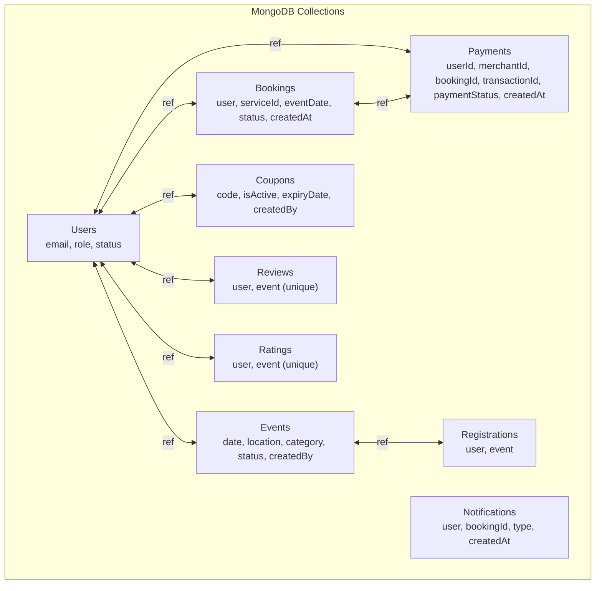
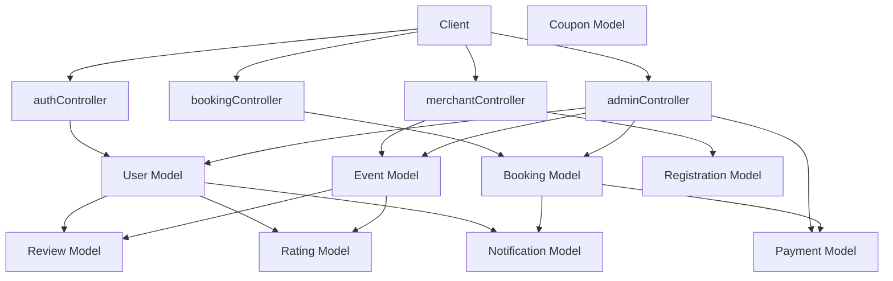
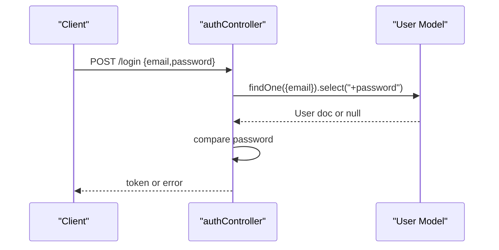
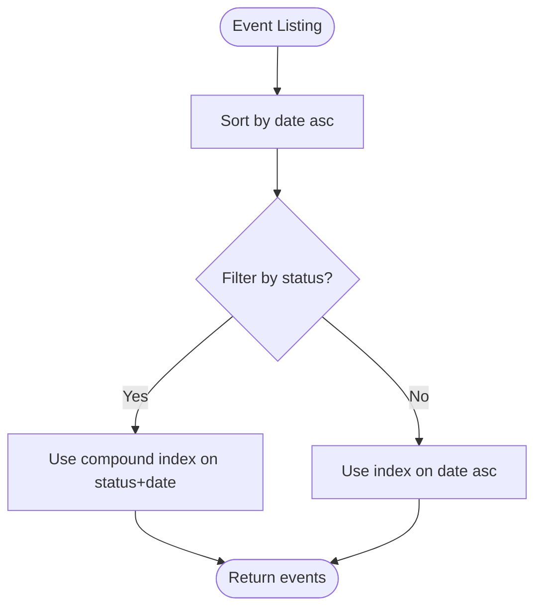
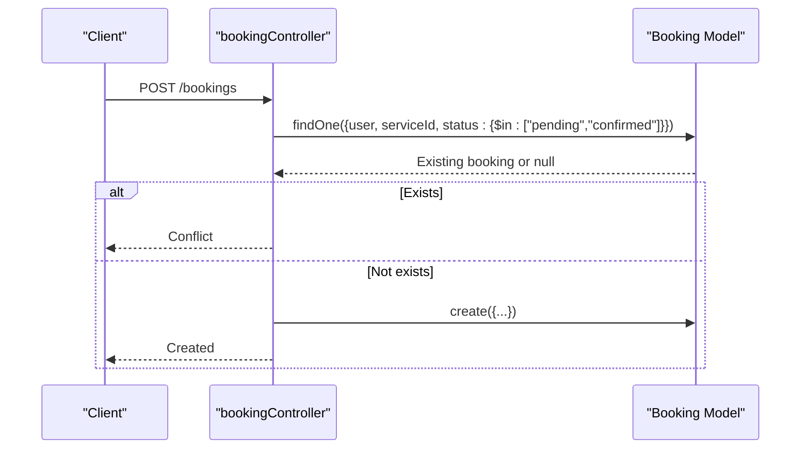
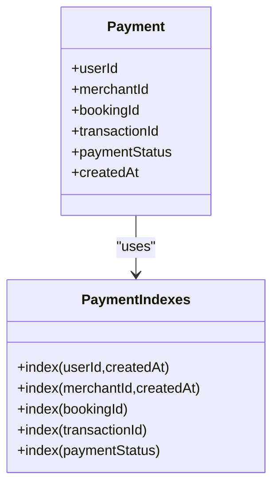
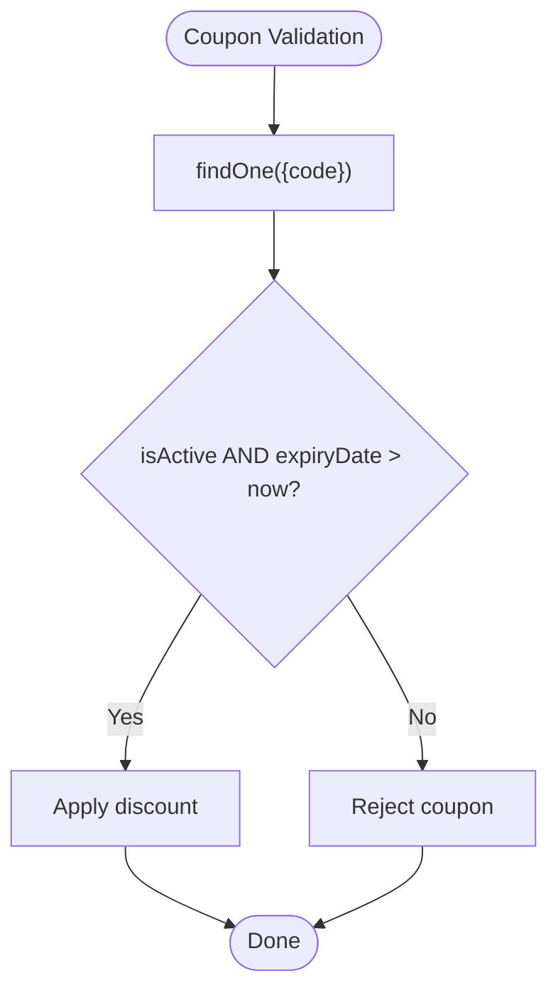
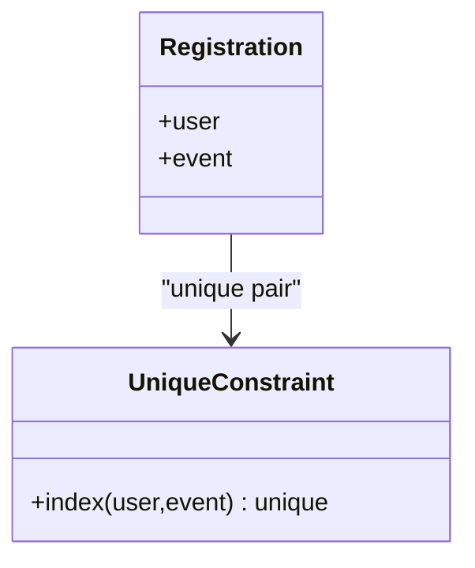
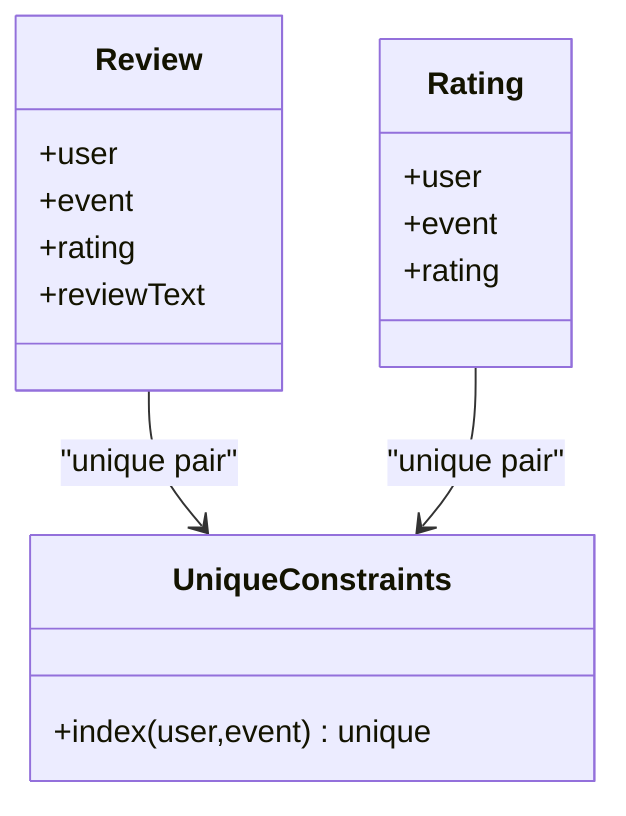
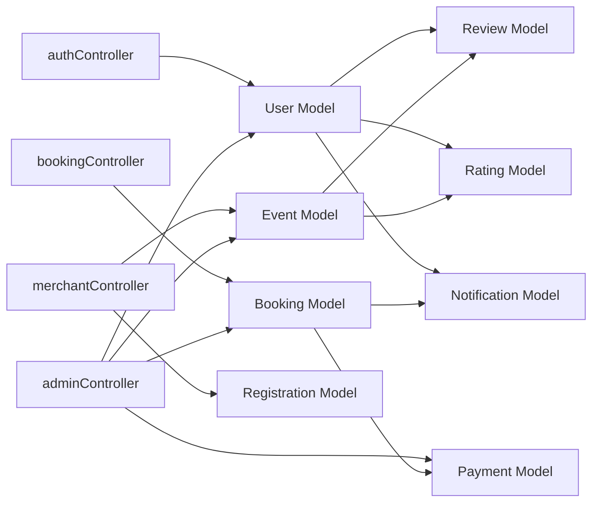

# Indexing Strategies and Performance Optimization

<cite>
**Referenced Files in This Document**
- [dbConnection.js](file://backend/database/dbConnection.js)
- [userSchema.js](file://backend/models/userSchema.js)
- [eventSchema.js](file://backend/models/eventSchema.js)
- [bookingSchema.js](file://backend/models/bookingSchema.js)
- [couponSchema.js](file://backend/models/couponSchema.js)
- [paymentSchema.js](file://backend/models/paymentSchema.js)
- [registrationSchema.js](file://backend/models/registrationSchema.js)
- [notificationSchema.js](file://backend/models/notificationSchema.js)
- [reviewSchema.js](file://backend/models/reviewSchema.js)
- [ratingSchema.js](file://backend/models/ratingSchema.js)
- [authController.js](file://backend/controller/authController.js)
- [bookingController.js](file://backend/controller/bookingController.js)
- [merchantController.js](file://backend/controller/merchantController.js)
- [adminController.js](file://backend/controller/adminController.js)
</cite>

## Table of Contents
1. [Introduction](#introduction)
2. [Project Structure](#project-structure)
3. [Core Components](#core-components)
4. [Architecture Overview](#architecture-overview)
5. [Detailed Component Analysis](#detailed-component-analysis)
6. [Dependency Analysis](#dependency-analysis)
7. [Performance Considerations](#performance-considerations)
8. [Troubleshooting Guide](#troubleshooting-guide)
9. [Conclusion](#conclusion)
10. [Appendices](#appendices)

## Introduction
This document provides comprehensive indexing strategies and performance optimization guidance tailored to the MongoDB collections in the MERN stack event project. It focuses on:
- Index creation strategies for frequently queried fields (email, event dates, booking status, user roles)
- Compound indexes for common query patterns
- Text indexes for search functionality
- Geospatial indexes for location-based queries
- Performance monitoring, query optimization, and database tuning
- Index maintenance procedures, performance impact analysis, and best practices for large-scale deployments
- Connection optimization and caching strategies

## Project Structure
The backend uses Mongoose ODM to define schemas and controllers to implement query patterns. The primary collections and their representative fields are:
- Users: email, role, status
- Events: date, location, category, status, createdBy
- Bookings: user, serviceId, eventDate, status, createdAt
- Payments: userId, merchantId, bookingId, transactionId, paymentStatus, createdAt
- Coupons: code, isActive, expiryDate, createdBy
- Registrations: user, event
- Reviews/Ratings: user, event (unique composite index)
- Notifications: user, bookingId, type, createdAt

**Diagram sources**
- [userSchema.js:26-44](file://backend/models/userSchema.js#L26-L44)
- [eventSchema.js:11-39](file://backend/models/eventSchema.js#L11-L39)
- [bookingSchema.js:5-48](file://backend/models/bookingSchema.js#L5-L48)
- [paymentSchema.js:5-104](file://backend/models/paymentSchema.js#L5-L104)
- [couponSchema.js:5-62](file://backend/models/couponSchema.js#L5-L62)
- [registrationSchema.js:4-7](file://backend/models/registrationSchema.js#L4-L7)
- [reviewSchema.js:5-8](file://backend/models/reviewSchema.js#L5-L8)
- [ratingSchema.js:5-14](file://backend/models/ratingSchema.js#L5-L14)
- [notificationSchema.js:5-31](file://backend/models/notificationSchema.js#L5-L31)

**Section sources**
- [userSchema.js:1-55](file://backend/models/userSchema.js#L1-L55)
- [eventSchema.js:1-44](file://backend/models/eventSchema.js#L1-L44)
- [bookingSchema.js:1-53](file://backend/models/bookingSchema.js#L1-L53)
- [paymentSchema.js:1-142](file://backend/models/paymentSchema.js#L1-L142)
- [couponSchema.js:1-123](file://backend/models/couponSchema.js#L1-L123)
- [registrationSchema.js:1-12](file://backend/models/registrationSchema.js#L1-L12)
- [reviewSchema.js:1-17](file://backend/models/reviewSchema.js#L1-L17)
- [ratingSchema.js:1-28](file://backend/models/ratingSchema.js#L1-L28)
- [notificationSchema.js:1-36](file://backend/models/notificationSchema.js#L1-L36)

## Core Components
- Users: Unique email index, role/status filters, timestamps
- Events: Date sorting, location storage, category filtering, status, creator relationship
- Bookings: User-scoped queries, status filters, eventDate range, createdAt sorting
- Payments: Multi-dimensional indexes for user/merchant analytics, transaction lookup, status filtering
- Coupons: Code lookup, validity checks, creator scoping
- Registrations: Many-to-many bridge with unique constraint per user-event pair
- Reviews/Ratings: Unique composite index to prevent duplicates
- Notifications: User-centric delivery with type and time-based sorting

Key implementation references:
- User email uniqueness and role/status enums
- Event date and location fields
- Booking user/service/date/status fields
- Payment multi-field indexes and status
- Coupon code, validity, and creator indexes
- Registration unique composite index
- Review/Rating unique composite index
- Notification user/type/booking fields

**Section sources**
- [userSchema.js:26-49](file://backend/models/userSchema.js#L26-L49)
- [eventSchema.js:11-39](file://backend/models/eventSchema.js#L11-L39)
- [bookingSchema.js:5-48](file://backend/models/bookingSchema.js#L5-L48)
- [paymentSchema.js:122-127](file://backend/models/paymentSchema.js#L122-L127)
- [couponSchema.js:110-114](file://backend/models/couponSchema.js#L110-L114)
- [registrationSchema.js:13-13](file://backend/models/registrationSchema.js#L13-L13)
- [reviewSchema.js:14-14](file://backend/models/reviewSchema.js#L14-L14)
- [ratingSchema.js:26-26](file://backend/models/ratingSchema.js#L26-L26)

## Architecture Overview
The application follows a layered architecture:
- Controllers handle HTTP requests and delegate to models
- Models define schemas and indexes
- Database connection uses robust retry and DNS strategies

**Diagram sources**
- [authController.js:11-120](file://backend/controller/authController.js#L11-L120)
- [bookingController.js:4-233](file://backend/controller/bookingController.js#L4-L233)
- [merchantController.js:5-176](file://backend/controller/merchantController.js#L5-L176)
- [adminController.js:9-194](file://backend/controller/adminController.js#L9-L194)
- [userSchema.js:4-54](file://backend/models/userSchema.js#L4-L54)
- [eventSchema.js:3-43](file://backend/models/eventSchema.js#L3-L43)
- [bookingSchema.js:3-52](file://backend/models/bookingSchema.js#L3-L52)
- [paymentSchema.js:3-110](file://backend/models/paymentSchema.js#L3-L110)
- [couponSchema.js:3-98](file://backend/models/couponSchema.js#L3-L98)
- [registrationSchema.js:3-11](file://backend/models/registrationSchema.js#L3-L11)
- [reviewSchema.js:3-11](file://backend/models/reviewSchema.js#L3-L11)
- [ratingSchema.js:3-23](file://backend/models/ratingSchema.js#L3-L23)
- [notificationSchema.js:3-33](file://backend/models/notificationSchema.js#L3-L33)

## Detailed Component Analysis

### Authentication and User Indexing
- Purpose: Fast email-based login and user retrieval
- Current indexes: None explicitly defined in the schema
- Recommended:
  - Single-field index on email for login and duplicate detection
  - Compound index on role and status for role-based filtering
- Query patterns:
  - Login: findOne({ email }) with select("+password")
  - Duplicate check: findOne({ email })
  - Admin listing: User.find({ role: "merchant" })

**Diagram sources**
- [authController.js:54-107](file://backend/controller/authController.js#L54-L107)
- [userSchema.js:26-32](file://backend/models/userSchema.js#L26-L32)

**Section sources**
- [authController.js:27-27](file://backend/controller/authController.js#L27-L27)
- [authController.js:66-66](file://backend/controller/authController.js#L66-L66)
- [userSchema.js:26-32](file://backend/models/userSchema.js#L26-L32)

### Event Management and Date-Based Queries
- Purpose: Efficient event discovery and scheduling
- Current fields: date, location, category, status, createdBy
- Recommended:
  - Compound index on date ascending for chronological listing
  - Compound index on status and date for active/upcoming filtering
  - Text index on title/description for search
  - Geospatial index on location if coordinates are stored (see Notes)
- Query patterns:
  - List events sorted by date ascending
  - Merchant list own events by createdBy
  - Admin population of createdBy for reporting

**Diagram sources**
- [eventSchema.js:11-15](file://backend/models/eventSchema.js#L11-L15)
- [merchantController.js:139-141](file://backend/controller/merchantController.js#L139-L141)
- [adminController.js:91-92](file://backend/controller/adminController.js#L91-L92)

**Section sources**
- [eventSchema.js:11-29](file://backend/models/eventSchema.js#L11-L29)
- [merchantController.js:139-141](file://backend/controller/merchantController.js#L139-L141)
- [adminController.js:91-92](file://backend/controller/adminController.js#L91-L92)

### Booking System and Status Filtering
- Purpose: Manage bookings per user and status transitions
- Current fields: user, serviceId, eventDate, status, createdAt
- Recommended:
  - Compound index on user+status for active booking checks
  - Compound index on user+createdAt for user booking history
  - Compound index on status+eventDate for reporting and reminders
- Query patterns:
  - Prevent duplicate active bookings per user/service
  - Fetch user bookings sorted by creation time
  - Admin listing with population and sorting
  - Status updates for confirmed/cancelled/completed

**Diagram sources**
- [bookingController.js:27-38](file://backend/controller/bookingController.js#L27-L38)
- [bookingController.js:77-78](file://backend/controller/bookingController.js#L77-L78)
- [bookingController.js:176-178](file://backend/controller/bookingController.js#L176-L178)

**Section sources**
- [bookingController.js:27-38](file://backend/controller/bookingController.js#L27-L38)
- [bookingController.js:77-78](file://backend/controller/bookingController.js#L77-L78)
- [bookingController.js:176-178](file://backend/controller/bookingController.js#L176-L178)

### Payment Analytics and Lookup
- Purpose: Fast financial reporting and transaction lookup
- Current indexes: userId+createdAt desc, merchantId+createdAt desc, bookingId, transactionId, paymentStatus
- Recommended:
  - Keep existing indexes for user/merchant analytics
  - Consider compound index on paymentStatus+createdAt for time-bound reporting
- Query patterns:
  - Admin reports: count by status, revenue aggregation
  - Transaction lookup by unique transactionId
  - Populate merchant/user for UI

**Diagram sources**
- [paymentSchema.js:122-127](file://backend/models/paymentSchema.js#L122-L127)

**Section sources**
- [paymentSchema.js:122-127](file://backend/models/paymentSchema.js#L122-L127)
- [adminController.js:146-153](file://backend/controller/adminController.js#L146-L153)

### Coupon Validation and Expiry
- Purpose: Efficient coupon lookup and validity checks
- Current indexes: code, isActive+expiryDate, createdBy
- Recommended:
  - Keep existing indexes
  - Consider compound index on code+isActive+expiryDate for strict validation
- Query patterns:
  - Lookup coupon by code
  - Check active/expiry constraints
  - Creator scoping for admin views

**Diagram sources**
- [couponSchema.js:110-114](file://backend/models/couponSchema.js#L110-L114)

**Section sources**
- [couponSchema.js:110-114](file://backend/models/couponSchema.js#L110-L114)

### Registration and Unique Constraints
- Purpose: Enforce one registration per user per event
- Current: Unique composite index on user+event
- Recommended: Maintain unique constraint; consider adding createdAt for audit trails
- Query patterns:
  - Prevent duplicate registration
  - List user registrations with populated event details

**Diagram sources**
- [registrationSchema.js:13-13](file://backend/models/registrationSchema.js#L13-L13)

**Section sources**
- [registrationSchema.js:13-13](file://backend/models/registrationSchema.js#L13-L13)
- [eventController.js:18-18](file://backend/controller/eventController.js#L18-L18)
- [eventController.js:29-29](file://backend/controller/eventController.js#L29-L29)

### Reviews and Ratings
- Purpose: Prevent duplicate reviews/ratings per user-event
- Current: Unique composite index on user+event
- Recommended: Keep unique constraint to maintain data integrity
- Query patterns:
  - Insert review/rating with unique constraint
  - Aggregate ratings for event display

**Diagram sources**
- [reviewSchema.js:14-14](file://backend/models/reviewSchema.js#L14-L14)
- [ratingSchema.js:26-26](file://backend/models/ratingSchema.js#L26-L26)

**Section sources**
- [reviewSchema.js:14-14](file://backend/models/reviewSchema.js#L14-L14)
- [ratingSchema.js:26-26](file://backend/models/ratingSchema.js#L26-L26)

### Notifications
- Purpose: Deliver timely alerts to users
- Fields: user, bookingId, type, read, createdAt
- Recommended:
  - Compound index on user+read+createdAt for unread notifications
  - Compound index on user+type+createdAt for categorized alerts
- Query patterns:
  - Fetch user notifications sorted by time
  - Mark as read after viewing

**Section sources**
- [notificationSchema.js:5-31](file://backend/models/notificationSchema.js#L5-L31)

## Dependency Analysis
- Controllers depend on models for data access
- Models define indexes that optimize controller queries
- Admin controller aggregates counts and revenues using payment schema aggregations
- Merchant controller relies on event and registration schemas for participant lists

**Diagram sources**
- [authController.js:3-3](file://backend/controller/authController.js#L3-L3)
- [bookingController.js:1-1](file://backend/controller/bookingController.js#L1-L1)
- [merchantController.js:1-2](file://backend/controller/merchantController.js#L1-L2)
- [adminController.js:1-6](file://backend/controller/adminController.js#L1-L6)
- [userSchema.js:4-54](file://backend/models/userSchema.js#L4-L54)
- [eventSchema.js:3-43](file://backend/models/eventSchema.js#L3-L43)
- [bookingSchema.js:3-52](file://backend/models/bookingSchema.js#L3-L52)
- [paymentSchema.js:3-110](file://backend/models/paymentSchema.js#L3-L110)
- [reviewSchema.js:3-11](file://backend/models/reviewSchema.js#L3-L11)
- [ratingSchema.js:3-23](file://backend/models/ratingSchema.js#L3-L23)
- [notificationSchema.js:3-33](file://backend/models/notificationSchema.js#L3-L33)

**Section sources**
- [adminController.js:133-143](file://backend/controller/adminController.js#L133-L143)

## Performance Considerations

### Index Creation Strategies
- Frequently queried fields:
  - Users: email (unique), role, status
  - Events: date, status, category, location
  - Bookings: user, serviceId, eventDate, status, createdAt
  - Payments: userId, merchantId, bookingId, transactionId, paymentStatus, createdAt
  - Coupons: code, isActive, expiryDate, createdBy
  - Registrations: user, event (unique)
  - Reviews/Ratings: user, event (unique)
  - Notifications: user, bookingId, type, read, createdAt
- Compound indexes for common query patterns:
  - user+status for active booking checks
  - user+createdAt for user history
  - status+eventDate for upcoming events
  - paymentStatus+createdAt for reporting
  - code+isActive+expiryDate for strict coupon validation
  - user+read+createdAt for unread notifications
- Text indexes for search:
  - Title and description fields in Events for text search
- Geospatial indexes for location-based queries:
  - If storing GeoJSON coordinates, create 2dsphere index on location field

### Performance Monitoring and Query Optimization
- Use explain() to analyze query plans and ensure index usage
- Monitor slow queries and add missing indexes iteratively
- Prefer covered queries by projecting only indexed fields when possible
- Use aggregation pipeline stages (match, sort, project) in optimal order

### Database Tuning Strategies
- Connection pooling: Adjust pool sizes and timeouts based on workload
- Retry policies: Leverage built-in retry mechanisms for transient failures
- Sharding: Consider sharding on high-cardinality fields (e.g., userId, email)
- Read replicas: Offload read-heavy reports to secondary nodes

### Index Maintenance Procedures
- Regularly audit unused indexes and drop them to reduce write overhead
- Rebuild corrupted or fragmented indexes during maintenance windows
- Monitor index size growth and adjust as data distribution changes

### Performance Impact Analysis
- Indexes improve read performance but increase write latency and storage
- Analyze write amplification and balance read vs. write workloads
- Use A/B testing for index changes in production-like environments

### Best Practices for Large-Scale Deployments
- Use compound indexes aligned with query filters and sort keys
- Avoid wildcard indexes; prefer targeted indexes
- Use TTL collections for ephemeral data (notifications, logs)
- Implement pagination for large result sets

### Connection Optimization and Caching Strategies
- Connection pooling and retry logic are already configured in the database connection module
- Apply application-level caching for read-heavy endpoints (e.g., static event listings)
- Use Redis/Memcached for session storage and short-lived computed metrics

**Section sources**
- [dbConnection.js:19-94](file://backend/database/dbConnection.js#L19-L94)

## Troubleshooting Guide
- Connection failures:
  - Verify DNS resolution and Atlas network access
  - Check retry attempts and delays
  - Confirm credentials and cluster availability
- Slow queries:
  - Use explain() to confirm index usage
  - Add missing compound indexes for frequent filters/sorts
- Duplicate constraint violations:
  - Ensure unique indexes exist for user+event pairs
  - Validate pre-save middleware for data integrity
- Reporting anomalies:
  - Confirm aggregation pipeline stages and indexes on date fields

**Section sources**
- [dbConnection.js:88-93](file://backend/database/dbConnection.js#L88-L93)
- [bookingController.js:18-38](file://backend/controller/bookingController.js#L18-L38)
- [reviewSchema.js:14-14](file://backend/models/reviewSchema.js#L14-L14)
- [ratingSchema.js:26-26](file://backend/models/ratingSchema.js#L26-L26)

## Conclusion
Effective indexing in MongoDB requires aligning indexes with real-world query patterns. For this project:
- Start with unique and frequently filtered fields (email, status, date)
- Build compound indexes for common filter+sort combinations
- Add text indexes for search and geospatial indexes for location-based features
- Continuously monitor performance, maintain indexes, and tune connections for scale

## Appendices

### Index Reference Matrix
- Users: email (unique), role, status
- Events: date, status, category, location, createdBy
- Bookings: user, serviceId, eventDate, status, createdAt
- Payments: userId, merchantId, bookingId, transactionId, paymentStatus, createdAt
- Coupons: code, isActive, expiryDate, createdBy
- Registrations: user, event (unique)
- Reviews/Ratings: user, event (unique)
- Notifications: user, bookingId, type, read, createdAt

**Section sources**
- [userSchema.js:26-49](file://backend/models/userSchema.js#L26-L49)
- [eventSchema.js:11-39](file://backend/models/eventSchema.js#L11-L39)
- [bookingSchema.js:5-48](file://backend/models/bookingSchema.js#L5-L48)
- [paymentSchema.js:122-127](file://backend/models/paymentSchema.js#L122-L127)
- [couponSchema.js:110-114](file://backend/models/couponSchema.js#L110-L114)
- [registrationSchema.js:13-13](file://backend/models/registrationSchema.js#L13-L13)
- [reviewSchema.js:14-14](file://backend/models/reviewSchema.js#L14-L14)
- [ratingSchema.js:26-26](file://backend/models/ratingSchema.js#L26-L26)
- [notificationSchema.js:5-31](file://backend/models/notificationSchema.js#L5-L31)