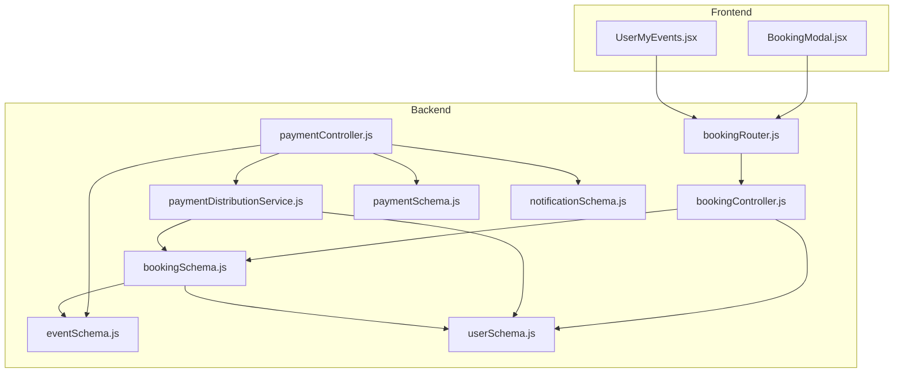
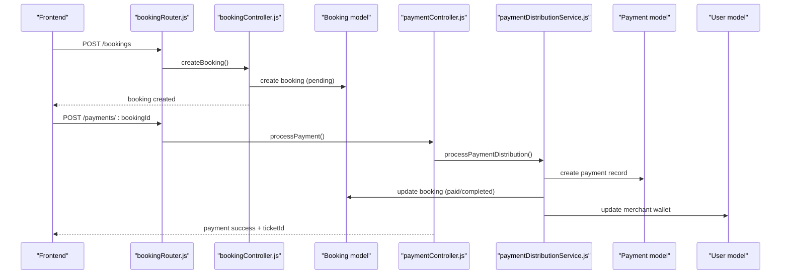
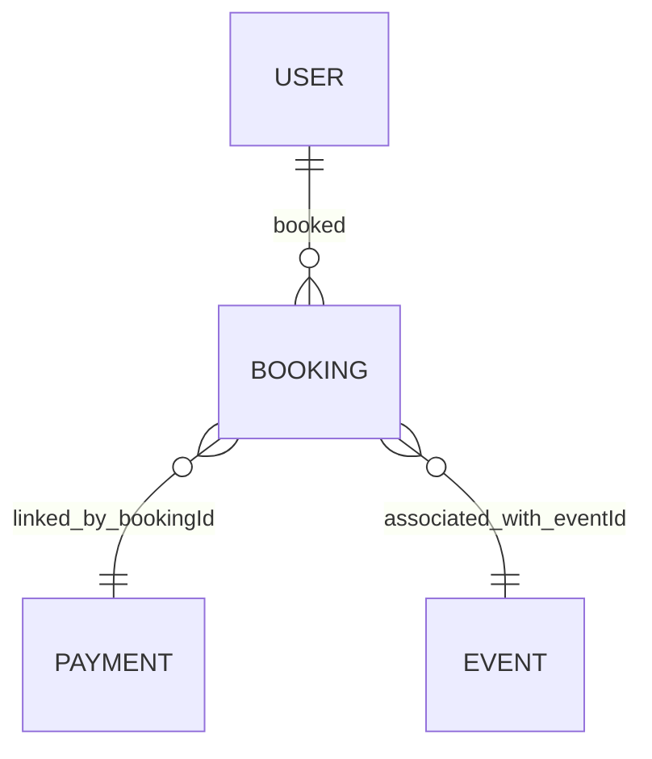
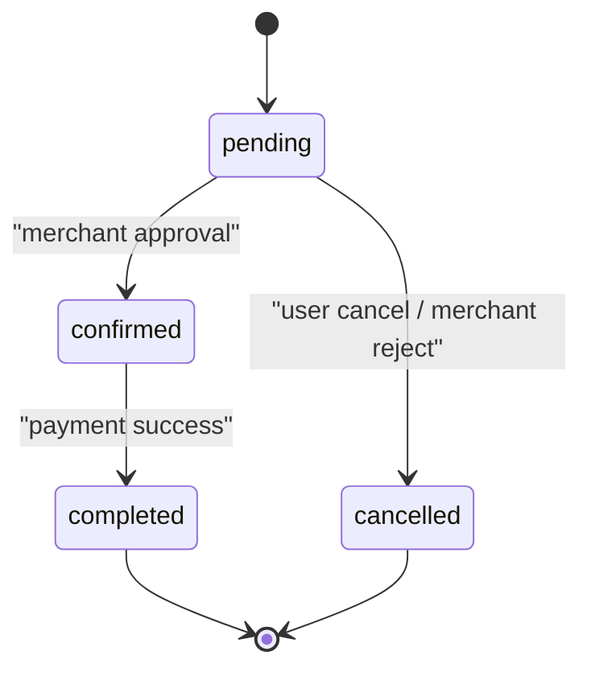
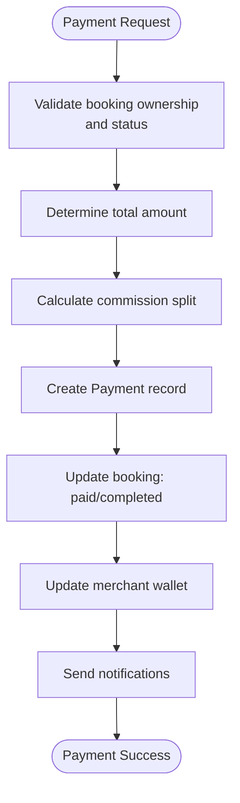
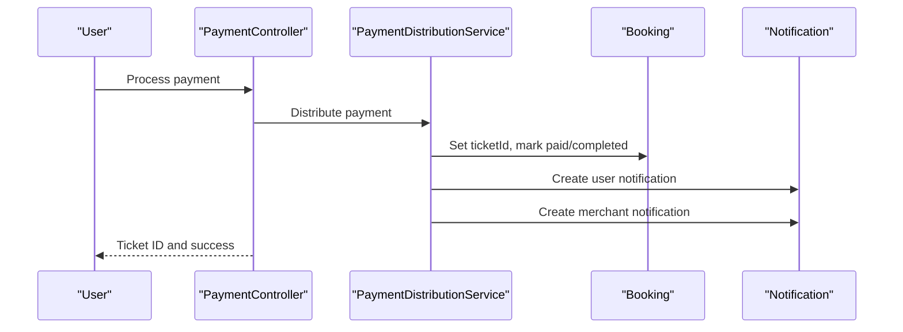
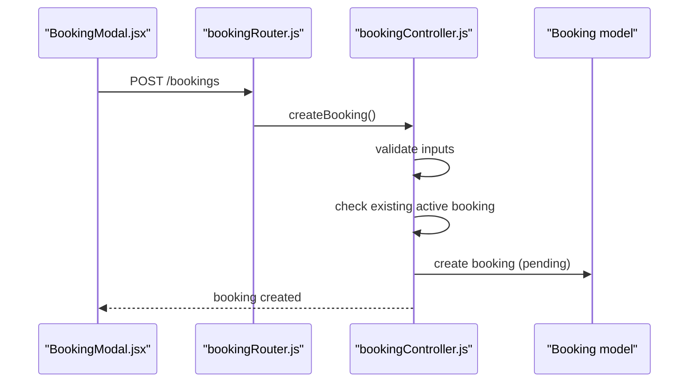
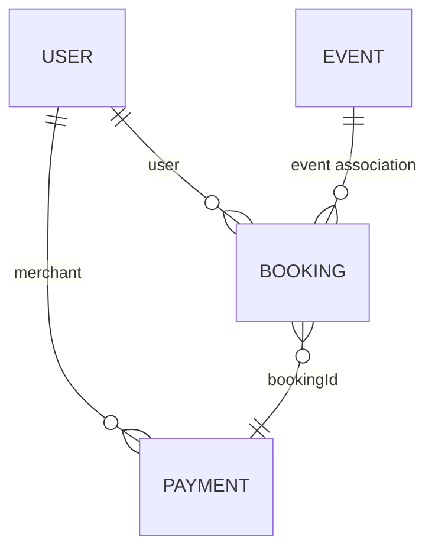
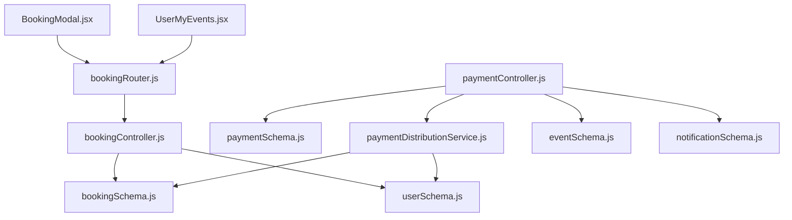

# Booking Schema

<cite>
**Referenced Files in This Document**
- [bookingSchema.js](file://backend/models/bookingSchema.js)
- [bookingController.js](file://backend/controller/bookingController.js)
- [bookingRouter.js](file://backend/router/bookingRouter.js)
- [eventSchema.js](file://backend/models/eventSchema.js)
- [userSchema.js](file://backend/models/userSchema.js)
- [paymentSchema.js](file://backend/models/paymentSchema.js)
- [paymentController.js](file://backend/controller/paymentController.js)
- [paymentDistributionService.js](file://backend/services/paymentDistributionService.js)
- [notificationSchema.js](file://backend/models/notificationSchema.js)
- [BookingModal.jsx](file://frontend/src/components/BookingModal.jsx)
- [UserMyEvents.jsx](file://frontend/src/pages/dashboards/UserMyEvents.jsx)
- [BOOKING_WORKFLOW_IMPLEMENTATION.md](file://BOOKING_WORKFLOW_IMPLEMENTATION.md)
- [DIRECT_BOOKING_FLOW_IMPLEMENTATION.md](file://DIRECT_BOOKING_FLOW_IMPLEMENTATION.md)
- [QUICK_REFERENCE_GUIDE.md](file://QUICK_REFERENCE_GUIDE.md)
</cite>

## Table of Contents
1. [Introduction](#introduction)
2. [Project Structure](#project-structure)
3. [Core Components](#core-components)
4. [Architecture Overview](#architecture-overview)
5. [Detailed Component Analysis](#detailed-component-analysis)
6. [Dependency Analysis](#dependency-analysis)
7. [Performance Considerations](#performance-considerations)
8. [Troubleshooting Guide](#troubleshooting-guide)
9. [Conclusion](#conclusion)
10. [Appendices](#appendices)

## Introduction
This document provides comprehensive documentation for the Booking schema and associated systems. It covers the booking lifecycle, status management, transaction tracking, and integration with users, events, and payments. It also explains booking fields, status workflows, ticket management for ticketed events, service booking processes, field relationships, payment integration fields, validation rules, and common query patterns for booking management and reporting.

## Project Structure
The booking system spans backend models, controllers, routers, services, and frontend components. The backend defines the Booking model and integrates with Payment and Event models. Controllers expose endpoints for creating, viewing, updating, and managing bookings. Services handle payment distribution and refunds. Frontend components enable users to submit service bookings and view their booking history.

**Diagram sources**
- [bookingRouter.js:1-26](file://backend/router/bookingRouter.js#L1-L26)
- [bookingController.js:1-233](file://backend/controller/bookingController.js#L1-L233)
- [bookingSchema.js:1-53](file://backend/models/bookingSchema.js#L1-L53)
- [eventSchema.js:1-51](file://backend/models/eventSchema.js#L1-L51)
- [userSchema.js:1-55](file://backend/models/userSchema.js#L1-L55)
- [paymentSchema.js:1-142](file://backend/models/paymentSchema.js#L1-L142)
- [paymentController.js:1-577](file://backend/controller/paymentController.js#L1-L577)
- [paymentDistributionService.js:1-340](file://backend/services/paymentDistributionService.js#L1-L340)
- [notificationSchema.js:1-36](file://backend/models/notificationSchema.js#L1-L36)
- [BookingModal.jsx:1-200](file://frontend/src/components/BookingModal.jsx#L1-L200)
- [UserMyEvents.jsx:1-200](file://frontend/src/pages/dashboards/UserMyEvents.jsx#L1-L200)

**Section sources**
- [bookingRouter.js:1-26](file://backend/router/bookingRouter.js#L1-L26)
- [bookingController.js:1-233](file://backend/controller/bookingController.js#L1-L233)
- [bookingSchema.js:1-53](file://backend/models/bookingSchema.js#L1-L53)
- [eventSchema.js:1-51](file://backend/models/eventSchema.js#L1-L51)
- [userSchema.js:1-55](file://backend/models/userSchema.js#L1-L55)
- [paymentSchema.js:1-142](file://backend/models/paymentSchema.js#L1-L142)
- [paymentController.js:1-577](file://backend/controller/paymentController.js#L1-L577)
- [paymentDistributionService.js:1-340](file://backend/services/paymentDistributionService.js#L1-L340)
- [notificationSchema.js:1-36](file://backend/models/notificationSchema.js#L1-L36)
- [BookingModal.jsx:1-200](file://frontend/src/components/BookingModal.jsx#L1-L200)
- [UserMyEvents.jsx:1-200](file://frontend/src/pages/dashboards/UserMyEvents.jsx#L1-L200)

## Core Components
- Booking Model: Defines booking fields, references to users and events, booking type, status, pricing, and timestamps.
- Event Model: Supports both full-service and ticketed event types, including ticket inventory and types.
- User Model: Provides user roles and profile information used in booking relationships.
- Payment Model: Tracks payment amounts, commission splits, payment status, methods, transaction IDs, and payout metadata.
- Payment Distribution Service: Calculates commissions, creates payment records, updates booking and user wallets, and handles refunds.
- Booking Controller: Implements CRUD and status management endpoints with validation and authorization checks.
- Payment Controller: Integrates payment processing, refund handling, and reporting endpoints.
- Frontend Components: Enable users to create service bookings and view booking statuses.

Key booking fields include:
- user: ObjectId referencing User
- serviceId, serviceTitle, serviceCategory, servicePrice
- bookingDate, eventDate
- notes, status (enum: pending, confirmed, cancelled, completed)
- guestCount, totalPrice
- Timestamps: createdAt, updatedAt

**Section sources**
- [bookingSchema.js:1-53](file://backend/models/bookingSchema.js#L1-L53)
- [eventSchema.js:1-51](file://backend/models/eventSchema.js#L1-L51)
- [userSchema.js:1-55](file://backend/models/userSchema.js#L1-L55)
- [paymentSchema.js:1-142](file://backend/models/paymentSchema.js#L1-L142)
- [paymentDistributionService.js:1-340](file://backend/services/paymentDistributionService.js#L1-L340)
- [bookingController.js:1-233](file://backend/controller/bookingController.js#L1-L233)
- [paymentController.js:1-577](file://backend/controller/paymentController.js#L1-L577)

## Architecture Overview
The booking lifecycle integrates user actions, event types, payment processing, and status transitions. For service bookings:
- Users submit a booking via the frontend modal.
- Backend validates and creates a booking with status pending.
- For ticketed events, payment is processed immediately with automatic completion.
- For full-service events, merchant approval is required before payment.

**Diagram sources**
- [bookingRouter.js:1-26](file://backend/router/bookingRouter.js#L1-L26)
- [bookingController.js:1-233](file://backend/controller/bookingController.js#L1-L233)
- [bookingSchema.js:1-53](file://backend/models/bookingSchema.js#L1-L53)
- [paymentController.js:1-577](file://backend/controller/paymentController.js#L1-L577)
- [paymentDistributionService.js:1-340](file://backend/services/paymentDistributionService.js#L1-L340)
- [paymentSchema.js:1-142](file://backend/models/paymentSchema.js#L1-L142)
- [userSchema.js:1-55](file://backend/models/userSchema.js#L1-L55)

## Detailed Component Analysis

### Booking Schema and Relationships
The Booking model encapsulates service-based bookings with strong references to users and denormalized service details. It supports:
- User relationship: user references User
- Service details: serviceId, serviceTitle, serviceCategory, servicePrice
- Booking metadata: bookingDate, eventDate, notes, guestCount, totalPrice
- Status lifecycle: pending, confirmed, cancelled, completed
- Timestamps for auditability

**Diagram sources**
- [bookingSchema.js:1-53](file://backend/models/bookingSchema.js#L1-L53)
- [userSchema.js:1-55](file://backend/models/userSchema.js#L1-L55)
- [paymentSchema.js:1-142](file://backend/models/paymentSchema.js#L1-L142)
- [eventSchema.js:1-51](file://backend/models/eventSchema.js#L1-L51)

**Section sources**
- [bookingSchema.js:1-53](file://backend/models/bookingSchema.js#L1-L53)
- [userSchema.js:1-55](file://backend/models/userSchema.js#L1-L55)
- [eventSchema.js:1-51](file://backend/models/eventSchema.js#L1-L51)
- [paymentSchema.js:1-142](file://backend/models/paymentSchema.js#L1-L142)

### Booking Lifecycle and Status Management
Status transitions are enforced by validation and controller logic:
- pending: initial state after booking creation
- confirmed: after merchant approval (for full-service) or immediate for ticketed events
- cancelled: by user cancellation or merchant rejection
- completed: after payment success and automatic completion

**Diagram sources**
- [bookingController.js:1-233](file://backend/controller/bookingController.js#L1-L233)
- [paymentDistributionService.js:1-340](file://backend/services/paymentDistributionService.js#L1-L340)

**Section sources**
- [bookingController.js:1-233](file://backend/controller/bookingController.js#L1-L233)
- [paymentDistributionService.js:1-340](file://backend/services/paymentDistributionService.js#L1-L340)
- [BOOKING_WORKFLOW_IMPLEMENTATION.md:170-224](file://BOOKING_WORKFLOW_IMPLEMENTATION.md#L170-L224)

### Payment Integration and Transaction Tracking
Payment processing involves:
- Validating booking ownership and status
- Calculating commission split (admin vs merchant)
- Creating Payment records with unique transaction IDs
- Updating booking payment status and completion
- Updating merchant wallet and admin commission tracking

**Diagram sources**
- [paymentController.js:1-577](file://backend/controller/paymentController.js#L1-L577)
- [paymentDistributionService.js:1-340](file://backend/services/paymentDistributionService.js#L1-L340)
- [paymentSchema.js:1-142](file://backend/models/paymentSchema.js#L1-L142)

**Section sources**
- [paymentController.js:1-577](file://backend/controller/paymentController.js#L1-L577)
- [paymentDistributionService.js:1-340](file://backend/services/paymentDistributionService.js#L1-L340)
- [paymentSchema.js:1-142](file://backend/models/paymentSchema.js#L1-L142)

### Ticket Management for Ticketed Events
Ticketed events bypass merchant approval and proceed directly to payment and completion. On successful payment:
- A unique ticketId is generated and attached to the booking
- Notifications are sent to user and merchant

**Diagram sources**
- [paymentController.js:1-577](file://backend/controller/paymentController.js#L1-L577)
- [paymentDistributionService.js:1-340](file://backend/services/paymentDistributionService.js#L1-L340)
- [notificationSchema.js:1-36](file://backend/models/notificationSchema.js#L1-L36)

**Section sources**
- [paymentController.js:1-577](file://backend/controller/paymentController.js#L1-L577)
- [paymentDistributionService.js:1-340](file://backend/services/paymentDistributionService.js#L1-L340)
- [notificationSchema.js:1-36](file://backend/models/notificationSchema.js#L1-L36)

### Service Booking Processes
Service bookings are created via the frontend BookingModal, which posts service details and user selections to the backend. The backend enforces:
- Required service details
- Active booking uniqueness per user/service
- Guest count multiplication for total price
- Creation of pending booking

**Diagram sources**
- [BookingModal.jsx:1-200](file://frontend/src/components/BookingModal.jsx#L1-L200)
- [bookingRouter.js:1-26](file://backend/router/bookingRouter.js#L1-L26)
- [bookingController.js:1-233](file://backend/controller/bookingController.js#L1-L233)
- [bookingSchema.js:1-53](file://backend/models/bookingSchema.js#L1-L53)

**Section sources**
- [BookingModal.jsx:1-200](file://frontend/src/components/BookingModal.jsx#L1-L200)
- [bookingController.js:1-233](file://backend/controller/bookingController.js#L1-L233)
- [bookingSchema.js:1-53](file://backend/models/bookingSchema.js#L1-L53)

### Field Relationships with Users and Events
- Booking.user references User
- Payment.bookingId references Booking
- Payment.eventId optionally references Event
- Payment.merchantId references User (merchant)
- Booking.service* fields mirror service details for historical consistency

**Diagram sources**
- [bookingSchema.js:1-53](file://backend/models/bookingSchema.js#L1-L53)
- [userSchema.js:1-55](file://backend/models/userSchema.js#L1-L55)
- [paymentSchema.js:1-142](file://backend/models/paymentSchema.js#L1-L142)
- [eventSchema.js:1-51](file://backend/models/eventSchema.js#L1-L51)

**Section sources**
- [bookingSchema.js:1-53](file://backend/models/bookingSchema.js#L1-L53)
- [userSchema.js:1-55](file://backend/models/userSchema.js#L1-L55)
- [paymentSchema.js:1-142](file://backend/models/paymentSchema.js#L1-L142)
- [eventSchema.js:1-51](file://backend/models/eventSchema.js#L1-L51)

### Booking Validation Rules
- Required fields for service bookings: serviceId, serviceTitle, serviceCategory, servicePrice
- Unique active booking constraint: user cannot have pending/confirmed booking for the same service
- Guest count defaults to 1 and multiplies price for total
- Status enum enforcement: pending, confirmed, cancelled, completed
- Payment processing requires booking to be in approved/paid state

**Section sources**
- [bookingController.js:1-233](file://backend/controller/bookingController.js#L1-L233)
- [bookingSchema.js:1-53](file://backend/models/bookingSchema.js#L1-L53)
- [paymentController.js:1-577](file://backend/controller/paymentController.js#L1-L577)

### Examples of Booking Documents
Representative booking documents illustrate typical structures:
- Service booking with pending status, user reference, and calculated total price
- Ticketed event booking with confirmed status, payment success, and generated ticketId
- Full-service booking awaiting merchant approval or payment depending on workflow stage

Note: Actual document examples are not included here to avoid exposing sensitive data.

**Section sources**
- [bookingSchema.js:1-53](file://backend/models/bookingSchema.js#L1-L53)
- [paymentDistributionService.js:1-340](file://backend/services/paymentDistributionService.js#L1-L340)

### Common Query Patterns for Booking Management and Reporting
- Fetch user’s bookings: filter by user and sort by creation date
- Admin view: populate user details, sort by newest
- Status filtering: query by status or combined status/payment filters
- Payment statistics: aggregate successful/refunded totals and monthly trends
- Merchant earnings: group by merchant, compute totals and recent transactions

These patterns leverage Mongoose queries and aggregation pipelines for efficient reporting.

**Section sources**
- [bookingController.js:1-233](file://backend/controller/bookingController.js#L1-L233)
- [paymentController.js:1-577](file://backend/controller/paymentController.js#L1-L577)

## Dependency Analysis
The booking system exhibits clear separation of concerns:
- Controllers depend on models and services
- Services depend on models for persistence and calculations
- Frontend components depend on backend endpoints
- Models define relationships and constraints

**Diagram sources**
- [bookingController.js:1-233](file://backend/controller/bookingController.js#L1-L233)
- [bookingSchema.js:1-53](file://backend/models/bookingSchema.js#L1-L53)
- [userSchema.js:1-55](file://backend/models/userSchema.js#L1-L55)
- [paymentController.js:1-577](file://backend/controller/paymentController.js#L1-L577)
- [paymentDistributionService.js:1-340](file://backend/services/paymentDistributionService.js#L1-L340)
- [paymentSchema.js:1-142](file://backend/models/paymentSchema.js#L1-L142)
- [eventSchema.js:1-51](file://backend/models/eventSchema.js#L1-L51)
- [notificationSchema.js:1-36](file://backend/models/notificationSchema.js#L1-L36)
- [BookingModal.jsx:1-200](file://frontend/src/components/BookingModal.jsx#L1-L200)
- [UserMyEvents.jsx:1-200](file://frontend/src/pages/dashboards/UserMyEvents.jsx#L1-L200)
- [bookingRouter.js:1-26](file://backend/router/bookingRouter.js#L1-L26)

**Section sources**
- [bookingController.js:1-233](file://backend/controller/bookingController.js#L1-L233)
- [paymentController.js:1-577](file://backend/controller/paymentController.js#L1-L577)
- [paymentDistributionService.js:1-340](file://backend/services/paymentDistributionService.js#L1-L340)
- [bookingSchema.js:1-53](file://backend/models/bookingSchema.js#L1-L53)
- [userSchema.js:1-55](file://backend/models/userSchema.js#L1-L55)
- [paymentSchema.js:1-142](file://backend/models/paymentSchema.js#L1-L142)
- [eventSchema.js:1-51](file://backend/models/eventSchema.js#L1-L51)
- [notificationSchema.js:1-36](file://backend/models/notificationSchema.js#L1-L36)
- [BookingModal.jsx:1-200](file://frontend/src/components/BookingModal.jsx#L1-L200)
- [UserMyEvents.jsx:1-200](file://frontend/src/pages/dashboards/UserMyEvents.jsx#L1-L200)
- [bookingRouter.js:1-26](file://backend/router/bookingRouter.js#L1-L26)

## Performance Considerations
- Indexing: Payment schema includes indexes on userId, merchantId, bookingId, transactionId, and paymentStatus to optimize queries.
- Aggregation: Payment statistics and merchant earnings use aggregation pipelines for efficient reporting.
- Population: Controllers populate related documents (user, merchant, event) judiciously to avoid N+1 problems.
- Validation: Pre-save middleware ensures amount integrity to prevent costly corrections later.

[No sources needed since this section provides general guidance]

## Troubleshooting Guide
Common issues and resolutions:
- Duplicate active booking: Prevented by uniqueness check on user/service with pending/confirmed status.
- Unauthorized payment: Payment endpoint verifies booking ownership and status.
- Invalid status transitions: Controller enforces allowed transitions and prevents reversal.
- Payment already processed: Payment distribution service checks for existing successful payment.
- Refund eligibility: Refund processing requires paid booking and prevents duplicate refunds.

**Section sources**
- [bookingController.js:1-233](file://backend/controller/bookingController.js#L1-L233)
- [paymentController.js:1-577](file://backend/controller/paymentController.js#L1-L577)
- [paymentDistributionService.js:1-340](file://backend/services/paymentDistributionService.js#L1-L340)

## Conclusion
The Booking schema and integrated systems provide a robust foundation for managing service and event bookings. Clear status workflows, payment integration with commission tracking, and comprehensive reporting capabilities support both user and administrative needs. The modular architecture enables maintainability and future enhancements such as advanced notifications, PDF ticket generation, and bulk operations.

[No sources needed since this section summarizes without analyzing specific files]

## Appendices

### Booking Status Workflows
- Full-service events: pending → confirmed → paid → completed
- Ticketed events: confirmed → paid → completed
- Cancellation: pending → cancelled (user cancel or merchant reject)

**Section sources**
- [BOOKING_WORKFLOW_IMPLEMENTATION.md:170-224](file://BOOKING_WORKFLOW_IMPLEMENTATION.md#L170-L224)
- [DIRECT_BOOKING_FLOW_IMPLEMENTATION.md:208-241](file://DIRECT_BOOKING_FLOW_IMPLEMENTATION.md#L208-L241)
- [QUICK_REFERENCE_GUIDE.md:1-65](file://QUICK_REFERENCE_GUIDE.md#L1-L65)