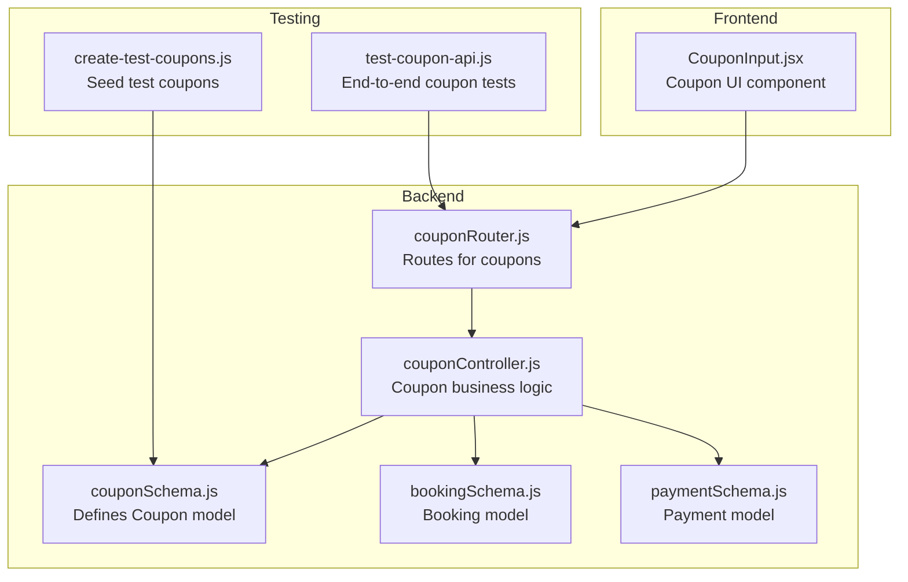
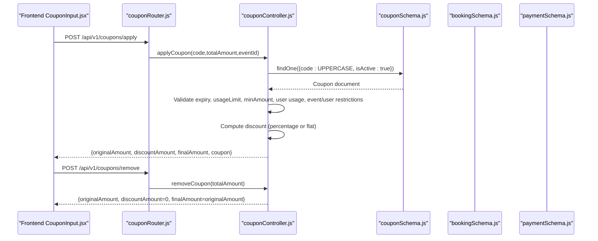
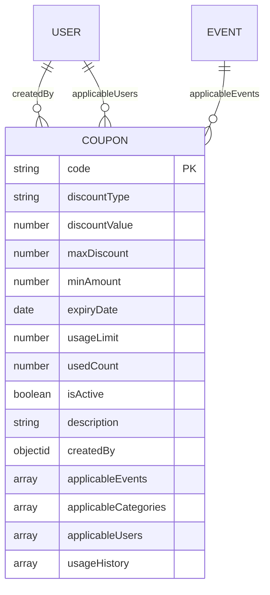
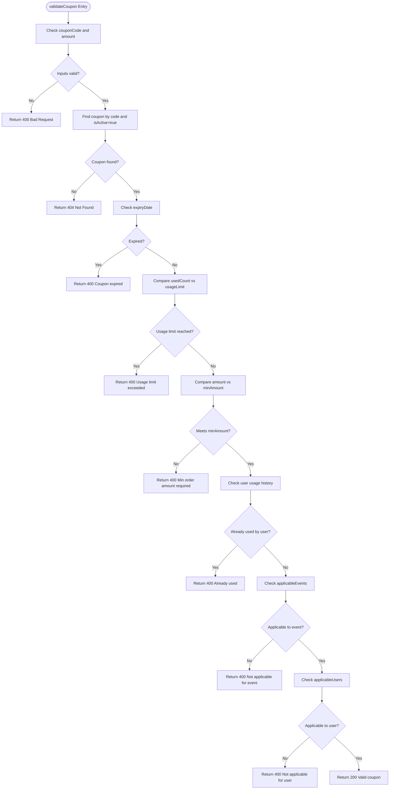
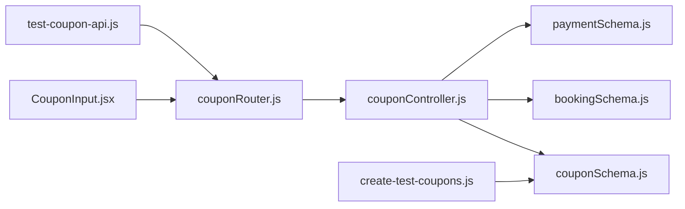

# Coupon Schema

<cite>
**Referenced Files in This Document**
- [couponSchema.js](file://backend/models/couponSchema.js)
- [couponController.js](file://backend/controller/couponController.js)
- [couponRouter.js](file://backend/router/couponRouter.js)
- [bookingSchema.js](file://backend/models/bookingSchema.js)
- [paymentSchema.js](file://backend/models/paymentSchema.js)
- [CouponInput.jsx](file://frontend/src/components/CouponInput.jsx)
- [test-coupon-api.js](file://backend/test-coupon-api.js)
- [create-test-coupons.js](file://backend/create-test-coupons.js)
</cite>

## Table of Contents
1. [Introduction](#introduction)
2. [Project Structure](#project-structure)
3. [Core Components](#core-components)
4. [Architecture Overview](#architecture-overview)
5. [Detailed Component Analysis](#detailed-component-analysis)
6. [Dependency Analysis](#dependency-analysis)
7. [Performance Considerations](#performance-considerations)
8. [Troubleshooting Guide](#troubleshooting-guide)
9. [Conclusion](#conclusion)
10. [Appendices](#appendices)

## Introduction
This document provides comprehensive documentation for the Coupon schema and related coupon management functionality. It covers coupon fields, validation logic, usage tracking, and integration points with booking and payment systems. It also includes field constraints, validation rules, coupon application workflows, examples of coupon documents, and query patterns for coupon validation and usage tracking.

## Project Structure
The coupon system spans backend models, controllers, routers, and frontend components, along with supporting test scripts.

**Diagram sources**
- [couponSchema.js:1-123](file://backend/models/couponSchema.js#L1-L123)
- [couponController.js:1-757](file://backend/controller/couponController.js#L1-L757)
- [couponRouter.js:1-37](file://backend/router/couponRouter.js#L1-L37)
- [bookingSchema.js:1-62](file://backend/models/bookingSchema.js#L1-L62)
- [paymentSchema.js:1-142](file://backend/models/paymentSchema.js#L1-L142)
- [CouponInput.jsx:1-166](file://frontend/src/components/CouponInput.jsx#L1-L166)
- [create-test-coupons.js:1-87](file://backend/create-test-coupons.js#L1-L87)
- [test-coupon-api.js:1-70](file://backend/test-coupon-api.js#L1-L70)

**Section sources**
- [couponSchema.js:1-123](file://backend/models/couponSchema.js#L1-L123)
- [couponController.js:1-757](file://backend/controller/couponController.js#L1-L757)
- [couponRouter.js:1-37](file://backend/router/couponRouter.js#L1-L37)
- [bookingSchema.js:1-62](file://backend/models/bookingSchema.js#L1-L62)
- [paymentSchema.js:1-142](file://backend/models/paymentSchema.js#L1-L142)
- [CouponInput.jsx:1-166](file://frontend/src/components/CouponInput.jsx#L1-L166)
- [create-test-coupons.js:1-87](file://backend/create-test-coupons.js#L1-L87)
- [test-coupon-api.js:1-70](file://backend/test-coupon-api.js#L1-L70)

## Core Components
- Coupon model: Defines coupon fields, indexes, virtuals, and pre-save middleware.
- Coupon controller: Implements coupon validation, application, availability retrieval, creation, updates, deletion, toggling status, and statistics.
- Coupon router: Exposes endpoints for user and admin coupon operations.
- Frontend component: Integrates coupon input and displays results.
- Supporting models: Booking and Payment models provide integration points for coupon usage in booking and payment flows.

Key responsibilities:
- Enforce coupon constraints and validation rules.
- Track usage per coupon and per user.
- Support event-specific and user-restricted coupons.
- Provide admin analytics and lifecycle management.

**Section sources**
- [couponSchema.js:1-123](file://backend/models/couponSchema.js#L1-L123)
- [couponController.js:1-757](file://backend/controller/couponController.js#L1-L757)
- [couponRouter.js:1-37](file://backend/router/couponRouter.js#L1-L37)
- [CouponInput.jsx:1-166](file://frontend/src/components/CouponInput.jsx#L1-L166)

## Architecture Overview
The coupon system follows a layered architecture:
- Model layer defines the schema and indexes.
- Controller layer encapsulates business logic and validation.
- Router layer exposes REST endpoints with authentication and role-based access.
- Frontend integrates via HTTP requests to apply/remove coupons and display results.
- Integration points with Booking and Payment models support coupon usage in booking and payment workflows.

**Diagram sources**
- [CouponInput.jsx:19-82](file://frontend/src/components/CouponInput.jsx#L19-L82)
- [couponRouter.js:22-25](file://backend/router/couponRouter.js#L22-L25)
- [couponController.js:134-285](file://backend/controller/couponController.js#L134-L285)
- [couponSchema.js:31-50](file://backend/models/couponSchema.js#L31-L50)

## Detailed Component Analysis

### Coupon Schema
The Coupon model defines the structure and constraints for coupons, including:
- code: Unique, uppercase, trimmed, length bounds.
- discountType: Enumerated ("percentage" or "flat").
- discountValue: Numeric value with minimum bound.
- maxDiscount: Optional cap for percentage discounts.
- minAmount: Minimum order value for applicability.
- expiryDate: Required expiration date.
- usageLimit: Maximum number of redemptions.
- usedCount: Tracks current usage.
- isActive: Enables/disables coupons.
- description: Optional campaign description.
- createdBy: Reference to the admin who created the coupon.
- applicableEvents: Optional restriction to specific events.
- applicableCategories: Optional category-based restrictions.
- applicableUsers: Optional restriction to specific users.
- usageHistory: Array of usage records with user, booking, timestamp, and discountAmount.

Indexes:
- code: 1
- isActive, expiryDate: compound
- createdBy: 1

Virtuals:
- remainingUsage: usageLimit - usedCount
- usagePercentage: (usedCount / usageLimit) * 100

Pre-save middleware:
- Ensures code is uppercase before saving.

**Diagram sources**
- [couponSchema.js:3-98](file://backend/models/couponSchema.js#L3-L98)

**Section sources**
- [couponSchema.js:1-123](file://backend/models/couponSchema.js#L1-L123)

### Coupon Controller Logic
The controller implements:
- validateCoupon: Validates coupon without applying it, enforcing input checks, expiry, usage limits, minimum amount, user usage history, and restrictions.
- applyCoupon: Applies coupon, computes discount (percentage capped by maxDiscount or flat), rounds to two decimals, and returns original/final/savings amounts.
- removeCoupon: Removes applied coupon and resets discount to zero.
- getAvailableCoupons: Returns coupons available to a user, filtered by active/expired status, usage limits, minAmount, event applicability, and user usage history.
- Admin operations: createCoupon, getAllCoupons, updateCoupon, deleteCoupon, toggleCouponStatus, getCouponStats.

Validation rules enforced:
- Input presence and amount positivity.
- Active and non-expired coupons.
- Usage count vs. usageLimit.
- Minimum order amount.
- Per-user usage prevention.
- Event/user/category restrictions.
- Discount type and value validation (percentage 1–100, flat > 0).
- Expiry date in the future.
- Non-updatable code if coupon has been used.

**Diagram sources**
- [couponController.js:5-131](file://backend/controller/couponController.js#L5-L131)

**Section sources**
- [couponController.js:1-757](file://backend/controller/couponController.js#L1-L757)

### Coupon Router
The router exposes:
- User endpoints: POST /validate, POST /apply, POST /remove, GET /available.
- Admin endpoints: POST /create, GET /all, PUT /:couponId, DELETE /:couponId, PATCH /:couponId/toggle, GET /stats.

All routes require authentication; admin routes additionally require admin role.

**Section sources**
- [couponRouter.js:1-37](file://backend/router/couponRouter.js#L1-L37)

### Frontend Integration
The CouponInput component:
- Sends POST /api/v1/coupons/apply with code, totalAmount, and optional eventId.
- Displays success/error messages and updates UI with discount details.
- Supports removing coupons via POST /api/v1/coupons/remove.

**Section sources**
- [CouponInput.jsx:1-166](file://frontend/src/components/CouponInput.jsx#L1-L166)

### Integration with Booking and Payment
- Coupon validation/application occurs before payment initiation.
- Payment processing uses the final amount computed after coupon application.
- The system does not persist coupon usage directly on Booking/Payment documents; usage is tracked in Coupon.usageHistory.

Note: The payment controller aggregates and distributes funds but does not compute coupon discounts; coupon discount computation is handled by the coupon controller.

**Section sources**
- [couponController.js:134-285](file://backend/controller/couponController.js#L134-L285)
- [paymentSchema.js:1-142](file://backend/models/paymentSchema.js#L1-L142)

## Dependency Analysis
- couponController depends on:
  - Coupon model for persistence and queries.
  - Booking model indirectly via event applicability checks.
  - Event model indirectly via event applicability checks.
- couponRouter depends on couponController.
- CouponInput depends on couponRouter endpoints.
- Tests depend on couponRouter and Coupon model.

**Diagram sources**
- [CouponInput.jsx:1-166](file://frontend/src/components/CouponInput.jsx#L1-L166)
- [couponRouter.js:1-37](file://backend/router/couponRouter.js#L1-L37)
- [couponController.js:1-757](file://backend/controller/couponController.js#L1-L757)
- [couponSchema.js:1-123](file://backend/models/couponSchema.js#L1-L123)
- [bookingSchema.js:1-62](file://backend/models/bookingSchema.js#L1-L62)
- [paymentSchema.js:1-142](file://backend/models/paymentSchema.js#L1-L142)
- [create-test-coupons.js:1-87](file://backend/create-test-coupons.js#L1-L87)
- [test-coupon-api.js:1-70](file://backend/test-coupon-api.js#L1-L70)

**Section sources**
- [couponController.js:1-757](file://backend/controller/couponController.js#L1-L757)
- [couponRouter.js:1-37](file://backend/router/couponRouter.js#L1-L37)
- [CouponInput.jsx:1-166](file://frontend/src/components/CouponInput.jsx#L1-L166)
- [create-test-coupons.js:1-87](file://backend/create-test-coupons.js#L1-L87)
- [test-coupon-api.js:1-70](file://backend/test-coupon-api.js#L1-L70)

## Performance Considerations
- Indexes:
  - code: 1 supports fast lookup by coupon code.
  - isActive, expiryDate: compound index optimizes active/expiry filtering.
  - createdBy: 1 supports admin queries.
- Aggregation:
  - getCouponStats uses aggregation to compute totals efficiently.
- Virtuals:
  - remainingUsage and usagePercentage avoid recalculations client-side.
- Recommendations:
  - Consider adding indexes for frequent filters like minAmount and usageHistory.user.
  - Batch operations for bulk coupon creation/update where appropriate.
  - Monitor query plans for complex filters in getAvailableCoupons.

[No sources needed since this section provides general guidance]

## Troubleshooting Guide
Common issues and resolutions:
- Invalid coupon code or not found:
  - Ensure code is uppercase and exists with isActive=true.
- Coupon expired:
  - Verify expiryDate is in the future.
- Usage limit exceeded:
  - Check usageLimit and usedCount; consider increasing limit or creating new coupons.
- Minimum order amount not met:
  - Ensure totalAmount meets coupon.minAmount.
- Already used by user:
  - Prevent reapplication per user; show appropriate messaging.
- Not applicable for event/user:
  - Confirm applicableEvents/applicableUsers match the booking context.
- Admin operations blocked:
  - Ensure admin role and proper authentication.

**Section sources**
- [couponController.js:31-131](file://backend/controller/couponController.js#L31-L131)
- [couponController.js:159-285](file://backend/controller/couponController.js#L159-L285)

## Conclusion
The Coupon schema and controller implement a robust system for managing promotional campaigns with strong validation, usage tracking, and admin controls. The design supports flexible discount types, usage caps, and targeted restrictions while maintaining performance through strategic indexing and aggregation. Integration with booking and payment systems enables seamless coupon application prior to payment processing.

[No sources needed since this section summarizes without analyzing specific files]

## Appendices

### Field Constraints and Validation Rules
- code: required, unique, uppercase, trimmed, length 3–20.
- discountType: required, enum ["percentage","flat"].
- discountValue: required, numeric, min 0.
- maxDiscount: numeric, min 0, default null (only meaningful for percentage).
- minAmount: required, numeric, min 0, default 0.
- expiryDate: required, date.
- usageLimit: required, integer, min 1, default 1.
- usedCount: numeric, min 0, default 0.
- isActive: boolean, default true.
- applicableEvents: array of Event ids (optional).
- applicableCategories: array of strings (optional).
- applicableUsers: array of User ids (optional).
- usageHistory: array of {user, booking, usedAt, discountAmount}.

**Section sources**
- [couponSchema.js:4-91](file://backend/models/couponSchema.js#L4-L91)

### Example Coupon Documents
Example structures for testing and reference:
- Percentage coupon with cap:
  - code: "SAVE10"
  - discountType: "percentage"
  - discountValue: 10
  - maxDiscount: 500
  - minAmount: 100
  - expiryDate: 30 days in the future
  - usageLimit: 100
  - isActive: true
- Flat discount coupon:
  - code: "FLAT50"
  - discountType: "flat"
  - discountValue: 50
  - minAmount: 200
  - expiryDate: 15 days in the future
  - usageLimit: 200
  - isActive: true

**Section sources**
- [create-test-coupons.js:28-64](file://backend/create-test-coupons.js#L28-L64)

### Query Patterns for Validation and Usage Tracking
- Validate coupon:
  - Find by code (uppercase) and isActive=true.
  - Check expiryDate, usageLimit, minAmount, user usage history, and restrictions.
- Apply coupon:
  - Same as validate plus compute discount (percentage capped or flat).
- Get available coupons:
  - Filter by isActive=true, expiryDate > now, usedCount < usageLimit.
  - Optionally filter by minAmount, event applicability, and exclude coupons already used by the user.
- Admin stats:
  - Aggregate counts of totalCoupons, activeCoupons, expiredCoupons, totalUsage, and totalDiscountGiven.

**Section sources**
- [couponController.js:31-131](file://backend/controller/couponController.js#L31-L131)
- [couponController.js:159-285](file://backend/controller/couponController.js#L159-L285)
- [couponController.js:310-386](file://backend/controller/couponController.js#L310-L386)
- [couponController.js:694-757](file://backend/controller/couponController.js#L694-L757)