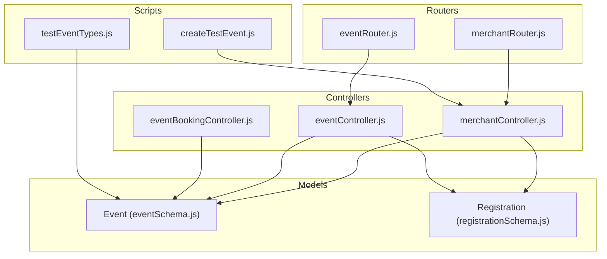
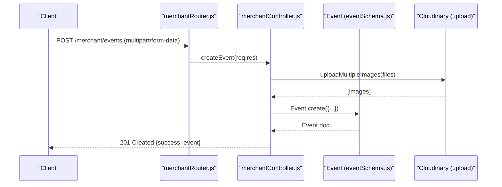
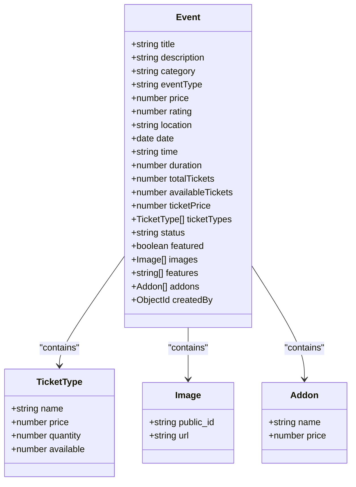
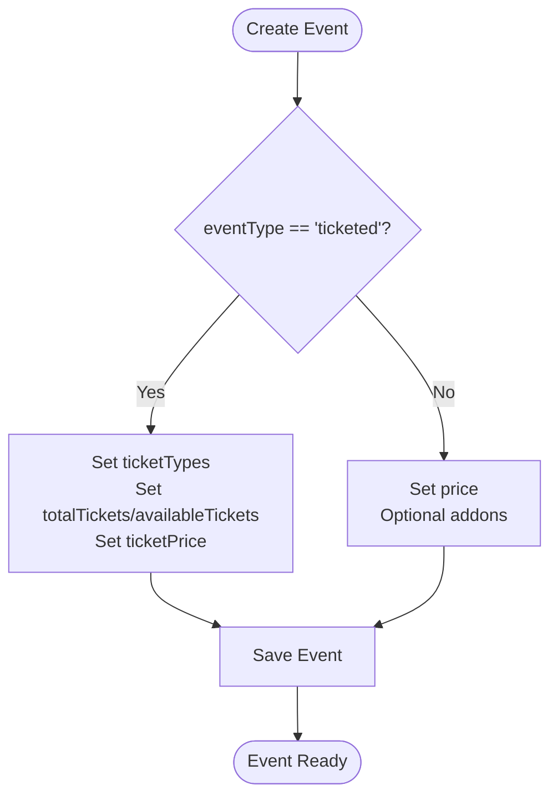
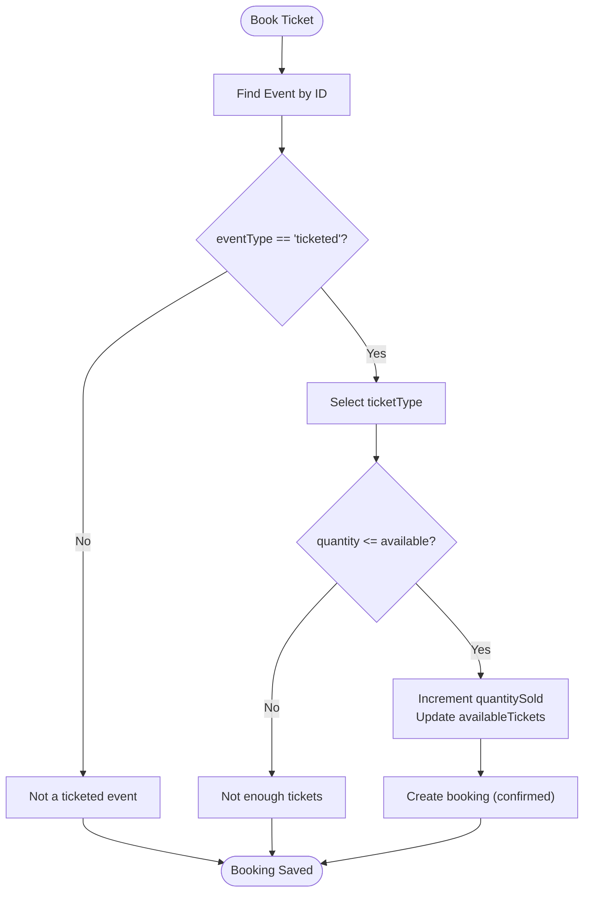
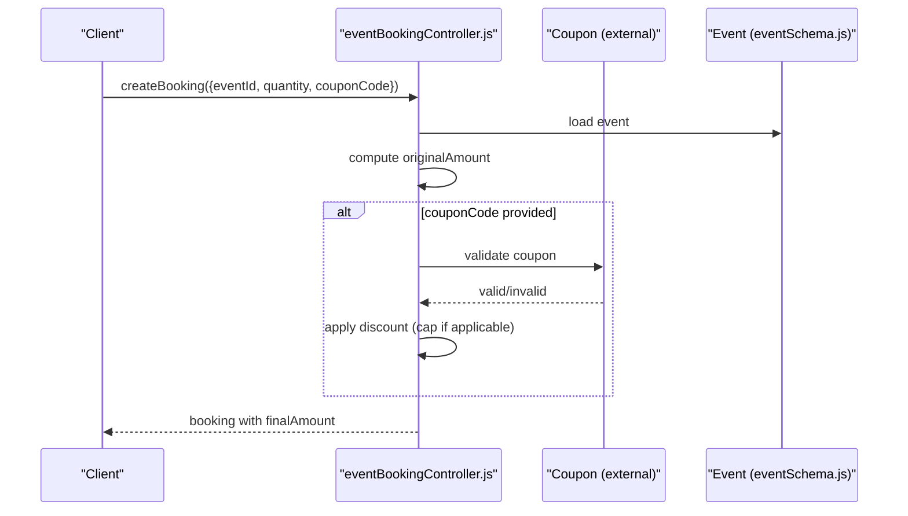
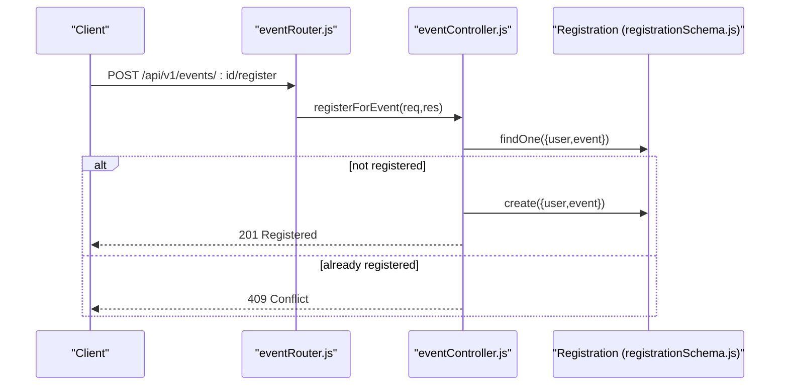
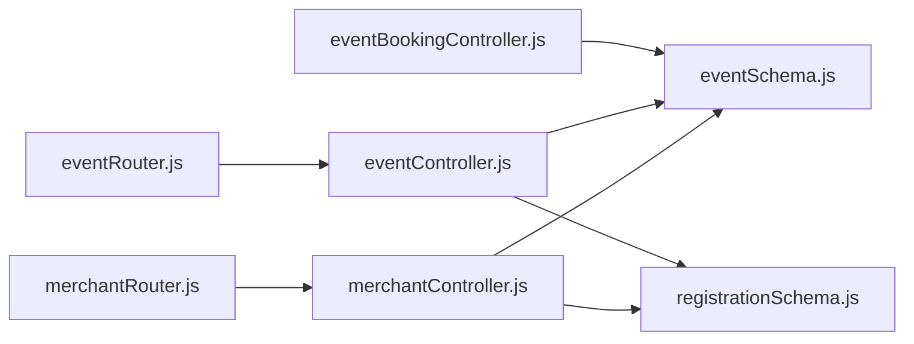

# Event Schema

<cite>
**Referenced Files in This Document**
- [eventSchema.js](file://backend/models/eventSchema.js)
- [merchantController.js](file://backend/controller/merchantController.js)
- [eventController.js](file://backend/controller/eventController.js)
- [eventRouter.js](file://backend/router/eventRouter.js)
- [merchantRouter.js](file://backend/router/merchantRouter.js)
- [eventBookingController.js](file://backend/controller/eventBookingController.js)
- [registrationSchema.js](file://backend/models/registrationSchema.js)
- [testEventTypes.js](file://backend/scripts/testEventTypes.js)
- [createTestEvent.js](file://backend/scripts/createTestEvent.js)
- [removeDummyEvents.js](file://backend/scripts/removeDummyEvents.js)
</cite>

## Table of Contents
1. [Introduction](#introduction)
2. [Project Structure](#project-structure)
3. [Core Components](#core-components)
4. [Architecture Overview](#architecture-overview)
5. [Detailed Component Analysis](#detailed-component-analysis)
6. [Dependency Analysis](#dependency-analysis)
7. [Performance Considerations](#performance-considerations)
8. [Troubleshooting Guide](#troubleshooting-guide)
9. [Conclusion](#conclusion)
10. [Appendices](#appendices)

## Introduction
This document describes the Event schema design and its lifecycle in the application. It covers event creation, management, and discovery, including field definitions, validation rules, date/time handling, location formats, capacity constraints, and the distinction between event types (ticketed vs full-service). It also outlines availability management, pricing structures, and query patterns for event discovery and filtering.

## Project Structure
The Event domain spans models, controllers, routers, and supporting scripts:
- Model: Event schema with fields for title, description, category, type, pricing, capacity, scheduling, and media.
- Controllers: Merchant operations (create/update/list/get/delete) and user event registration.
- Routers: Expose endpoints for merchant and user flows.
- Scripts: Demonstrate event creation and event type differences.

**Diagram sources**
- [eventSchema.js:1-51](file://backend/models/eventSchema.js#L1-L51)
- [merchantController.js:1-209](file://backend/controller/merchantController.js#L1-L209)
- [eventController.js:1-35](file://backend/controller/eventController.js#L1-L35)
- [eventBookingController.js:1-800](file://backend/controller/eventBookingController.js#L1-L800)
- [registrationSchema.js:1-12](file://backend/models/registrationSchema.js#L1-L12)
- [merchantRouter.js:1-17](file://backend/router/merchantRouter.js#L1-L17)
- [eventRouter.js:1-13](file://backend/router/eventRouter.js#L1-L13)
- [testEventTypes.js:1-115](file://backend/scripts/testEventTypes.js#L1-L115)
- [createTestEvent.js:1-83](file://backend/scripts/createTestEvent.js#L1-L83)

**Section sources**
- [eventSchema.js:1-51](file://backend/models/eventSchema.js#L1-L51)
- [merchantController.js:1-209](file://backend/controller/merchantController.js#L1-L209)
- [eventController.js:1-35](file://backend/controller/eventController.js#L1-L35)
- [eventRouter.js:1-13](file://backend/router/eventRouter.js#L1-L13)
- [merchantRouter.js:1-17](file://backend/router/merchantRouter.js#L1-L17)
- [testEventTypes.js:1-115](file://backend/scripts/testEventTypes.js#L1-L115)
- [createTestEvent.js:1-83](file://backend/scripts/createTestEvent.js#L1-L83)

## Core Components
- Event model: Defines all event fields, including type discriminator, pricing, scheduling, capacity, ticket types, addons, and metadata.
- Merchant controller: Handles event creation, updates, listing, retrieval, deletion, and participant listing.
- Event controller: Provides event listing, user registration, and user’s registrations.
- Event booking controller: Routes booking creation to type-specific handlers, manages availability, pricing, coupons, and notifications.
- Registration model: Tracks user registration for events.

Key schema highlights:
- Fields: title, description, category, eventType (enum), price, rating, location, date, time, duration, totalTickets, availableTickets, ticketPrice, ticketTypes array, status, featured, images array, features array, addons array, createdBy.
- Validation: Enum constraints for eventType and status, numeric bounds for rating, defaults for optional fields.
- Type-specific fields: ticketTypes and addons for ticketed/full-service respectively.

**Section sources**
- [eventSchema.js:3-48](file://backend/models/eventSchema.js#L3-L48)
- [merchantController.js:5-98](file://backend/controller/merchantController.js#L5-L98)
- [eventController.js:4-34](file://backend/controller/eventController.js#L4-L34)
- [eventBookingController.js:7-73](file://backend/controller/eventBookingController.js#L7-L73)
- [registrationSchema.js:3-9](file://backend/models/registrationSchema.js#L3-L9)

## Architecture Overview
End-to-end flow for event creation and user registration:

**Diagram sources**
- [merchantRouter.js:9](file://backend/router/merchantRouter.js#L9)
- [merchantController.js:5-98](file://backend/controller/merchantController.js#L5-L98)
- [eventSchema.js:3-48](file://backend/models/eventSchema.js#L3-L48)

## Detailed Component Analysis

### Event Schema Design
The Event schema defines the canonical structure for events, including:
- Identity and metadata: title, category, status, featured flag, timestamps.
- Pricing and capacity: price, rating, totalTickets, availableTickets, ticketPrice.
- Scheduling: date (Date), time (String), duration (hours).
- Location: location (String).
- Media: images array with public_id and url.
- Features and addons: features (array of strings), addons (array of {name, price}).
- Ticket types: ticketTypes array with name, price, quantity, available.
- Type discriminator: eventType enum ("full-service", "ticketed").
- Creator: createdBy ObjectId referencing User.

Validation and constraints:
- eventType enum restricts values to predefined types.
- rating constrained to [0, 5].
- ticketTypes entries require name, price>=0, quantity>=0, available>=0.
- images entries require public_id and url.
- addons entries require name and price>=0.
- Defaults set for optional fields to ensure consistent shape.

**Diagram sources**
- [eventSchema.js:3-48](file://backend/models/eventSchema.js#L3-L48)

**Section sources**
- [eventSchema.js:3-48](file://backend/models/eventSchema.js#L3-L48)

### Event Types: Ticketed vs Full-Service
- Ticketed events:
  - Use ticketTypes array with name, price, quantity, available.
  - Maintain totalTickets and availableTickets totals derived from ticketTypes.
  - Pricing per ticket type; lowest ticket price may be used as base price.
- Full-service events:
  - Use single price and optional addons array.
  - No ticket inventory; availability managed via registration or booking approvals.

**Diagram sources**
- [merchantController.js:43-60](file://backend/controller/merchantController.js#L43-L60)
- [eventSchema.js:16-28](file://backend/models/eventSchema.js#L16-L28)

**Section sources**
- [merchantController.js:43-60](file://backend/controller/merchantController.js#L43-L60)
- [eventSchema.js:16-28](file://backend/models/eventSchema.js#L16-L28)
- [testEventTypes.js:22-86](file://backend/scripts/testEventTypes.js#L22-L86)

### Availability Management and Capacity Constraints
- Ticketed events:
  - Ticket availability computed as quantityTotal - quantitySold per ticket type.
  - On booking, quantitySold increments and availableTickets updates across all types.
  - Quantity requested must be <= available quantity for the selected ticket type.
- Full-service events:
  - No ticket inventory; availability handled via approvals and participant limits.

**Diagram sources**
- [eventBookingController.js:322-589](file://backend/controller/eventBookingController.js#L322-L589)
- [eventSchema.js:16-28](file://backend/models/eventSchema.js#L16-L28)

**Section sources**
- [eventBookingController.js:377-391](file://backend/controller/eventBookingController.js#L377-L391)
- [eventBookingController.js:480-489](file://backend/controller/eventBookingController.js#L480-L489)
- [eventSchema.js:16-28](file://backend/models/eventSchema.js#L16-L28)

### Pricing Structures and Coupons
- Base price:
  - Full-service: single event.price.
  - Ticketed: derived from ticketTypes (lowest price used as base).
- Discounts:
  - Coupon validation checks expiry, usage limits, min order, and per-user usage.
  - Supports percentage or flat discount with max discount cap.
- Final amount calculation:
  - Rounded to two decimals for currency precision.

**Diagram sources**
- [eventBookingController.js:393-474](file://backend/controller/eventBookingController.js#L393-L474)
- [eventBookingController.js:400-421](file://backend/controller/eventBookingController.js#L400-L421)

**Section sources**
- [eventBookingController.js:393-474](file://backend/controller/eventBookingController.js#L393-L474)
- [eventBookingController.js:400-421](file://backend/controller/eventBookingController.js#L400-L421)

### Date/Time Handling and Location Formats
- Date/time:
  - date stored as Date; time stored as String.
  - Duration in hours; serviceDate used for full-service bookings.
- Location:
  - Stored as String; merchant sets venue address.
- Timezone:
  - No explicit timezone handling; consumers should normalize to local or UTC as needed.

**Section sources**
- [eventSchema.js:11-15](file://backend/models/eventSchema.js#L11-L15)
- [eventBookingController.js:246](file://backend/controller/eventBookingController.js#L246)

### Field Validation Rules
- Required fields:
  - title (required).
  - ticketTypes[].name, ticketTypes[].price, ticketTypes[].quantity, ticketTypes[].available.
  - images[].public_id, images[].url.
  - addons[].name, addons[].price.
- Numeric constraints:
  - rating min/max 0–5.
  - ticketTypes[].price, addons[].price >= 0.
  - ticketTypes[].quantity, ticketTypes[].available >= 0.
- Enum constraints:
  - eventType: "full-service", "ticketed".
  - status: "active", "inactive", "completed".

**Section sources**
- [eventSchema.js:5-28](file://backend/models/eventSchema.js#L5-L28)

### Event Creation and Management
- Merchant operations:
  - Create: parses features/addons/ticketTypes, uploads images, computes totals, enforces validations.
  - Update: supports partial updates, image replacement, and feature normalization.
  - List/Get/Delete: filter by createdBy, enforce ownership.
  - Participants: list registrations for owned events.
- User registration:
  - Users can register for events; duplicate registration prevented.

**Diagram sources**
- [eventRouter.js:9](file://backend/router/eventRouter.js#L9)
- [eventController.js:13-25](file://backend/controller/eventController.js#L13-L25)
- [registrationSchema.js:3-9](file://backend/models/registrationSchema.js#L3-L9)

**Section sources**
- [merchantController.js:5-98](file://backend/controller/merchantController.js#L5-L98)
- [merchantController.js:100-187](file://backend/controller/merchantController.js#L100-L187)
- [eventController.js:4-34](file://backend/controller/eventController.js#L4-L34)
- [eventRouter.js:8-10](file://backend/router/eventRouter.js#L8-L10)

### Event Discovery and Filtering Patterns
- List all events ordered by date ascending.
- Filter by createdBy for merchant-owned events.
- Retrieve event details and ticket types for availability queries.

Representative patterns:
- List events: GET /api/v1/events
- List merchant events: GET /api/v1/merchant/events
- Get event details: GET /api/v1/merchant/events/:id
- Get event ticket types: GET /api/v1/events/:eventId/ticket-types
- User registration: POST /api/v1/events/:id/register
- User registrations: GET /api/v1/events/me

**Section sources**
- [eventController.js:4-11](file://backend/controller/eventController.js#L4-L11)
- [merchantController.js:149-158](file://backend/controller/merchantController.js#L149-L158)
- [eventBookingController.js:591-633](file://backend/controller/eventBookingController.js#L591-L633)
- [eventRouter.js:8-10](file://backend/router/eventRouter.js#L8-L10)

### Examples of Event Documents
- Full-service event:
  - eventType: "full-service"
  - price: number
  - features: array of strings
  - addons: array of {name, price}
- Ticketed event:
  - eventType: "ticketed"
  - ticketTypes: array of {name, price, quantity, available}
  - totalTickets/availableTickets: derived totals

See example creation in scripts for representative shapes.

**Section sources**
- [testEventTypes.js:22-86](file://backend/scripts/testEventTypes.js#L22-L86)
- [createTestEvent.js:18-28](file://backend/scripts/createTestEvent.js#L18-L28)

## Dependency Analysis
- Controllers depend on models for persistence and on external services for image uploads.
- Routers bind endpoints to controllers.
- Event booking controller depends on Event and Coupon models for pricing and availability.
- Registration model links users to events.

**Diagram sources**
- [eventRouter.js:1-13](file://backend/router/eventRouter.js#L1-L13)
- [merchantRouter.js:1-17](file://backend/router/merchantRouter.js#L1-L17)
- [eventController.js:1-35](file://backend/controller/eventController.js#L1-L35)
- [merchantController.js:1-209](file://backend/controller/merchantController.js#L1-L209)
- [eventBookingController.js:1-800](file://backend/controller/eventBookingController.js#L1-L800)
- [eventSchema.js:1-51](file://backend/models/eventSchema.js#L1-L51)
- [registrationSchema.js:1-12](file://backend/models/registrationSchema.js#L1-L12)

**Section sources**
- [eventRouter.js:1-13](file://backend/router/eventRouter.js#L1-L13)
- [merchantRouter.js:1-17](file://backend/router/merchantRouter.js#L1-L17)
- [eventController.js:1-35](file://backend/controller/eventController.js#L1-L35)
- [merchantController.js:1-209](file://backend/controller/merchantController.js#L1-L209)
- [eventBookingController.js:1-800](file://backend/controller/eventBookingController.js#L1-L800)
- [eventSchema.js:1-51](file://backend/models/eventSchema.js#L1-L51)
- [registrationSchema.js:1-12](file://backend/models/registrationSchema.js#L1-L12)

## Performance Considerations
- Indexing recommendations:
  - createdAt timestamp for chronological queries.
  - createdBy for merchant-scoped queries.
  - eventType/status for filtering.
  - date for range queries.
- Image storage:
  - Offload media to Cloudinary; avoid storing large binary blobs in MongoDB.
- Query patterns:
  - Prefer filtered queries (by createdBy, status, date range) to reduce result sets.
  - Batch operations for updates (e.g., updating ticket quantities) to minimize round trips.

## Troubleshooting Guide
- Event not found:
  - Ensure correct ObjectId and ownership checks in merchant endpoints.
- Duplicate registration:
  - Registration uniqueness enforced per user-event pair.
- Ticket availability:
  - Verify ticketType selection and available quantity before booking.
- Coupon validation:
  - Check expiry, usage limits, min order, and per-user usage constraints.
- Cleanup:
  - Use provided script to remove dummy events and related data.

**Section sources**
- [merchantController.js:100-107](file://backend/controller/merchantController.js#L100-L107)
- [eventController.js:18-19](file://backend/controller/eventController.js#L18-L19)
- [eventBookingController.js:377-391](file://backend/controller/eventBookingController.js#L377-L391)
- [eventBookingController.js:400-421](file://backend/controller/eventBookingController.js#L400-L421)
- [removeDummyEvents.js:8-47](file://backend/scripts/removeDummyEvents.js#L8-L47)

## Conclusion
The Event schema provides a robust foundation for both ticketed and full-service events. Clear separation of concerns across routers, controllers, and models enables scalable event management. Adhering to validation rules, managing availability rigorously, and leveraging coupons ensures reliable pricing and user experiences.

## Appendices

### Appendix A: Endpoint Reference
- Merchant
  - POST /api/v1/merchant/events (multipart/form-data)
  - PUT /api/v1/merchant/events/:id (multipart/form-data)
  - GET /api/v1/merchant/events
  - GET /api/v1/merchant/events/:id
  - GET /api/v1/merchant/events/:id/participants
  - DELETE /api/v1/merchant/events/:id
- User
  - GET /api/v1/events
  - POST /api/v1/events/:id/register
  - GET /api/v1/events/me

**Section sources**
- [merchantRouter.js:9-14](file://backend/router/merchantRouter.js#L9-L14)
- [eventRouter.js:8-10](file://backend/router/eventRouter.js#L8-L10)