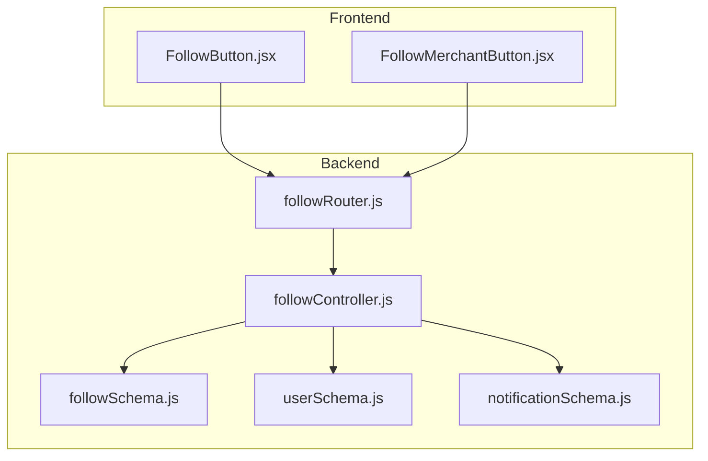
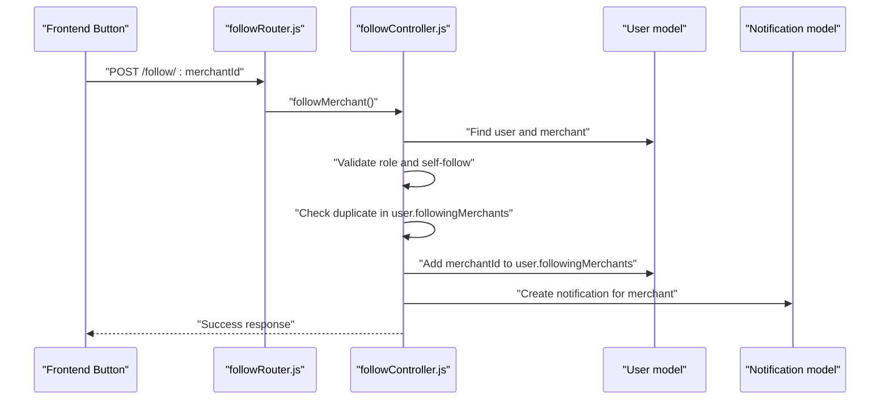
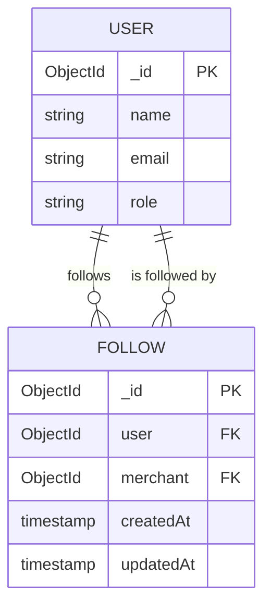
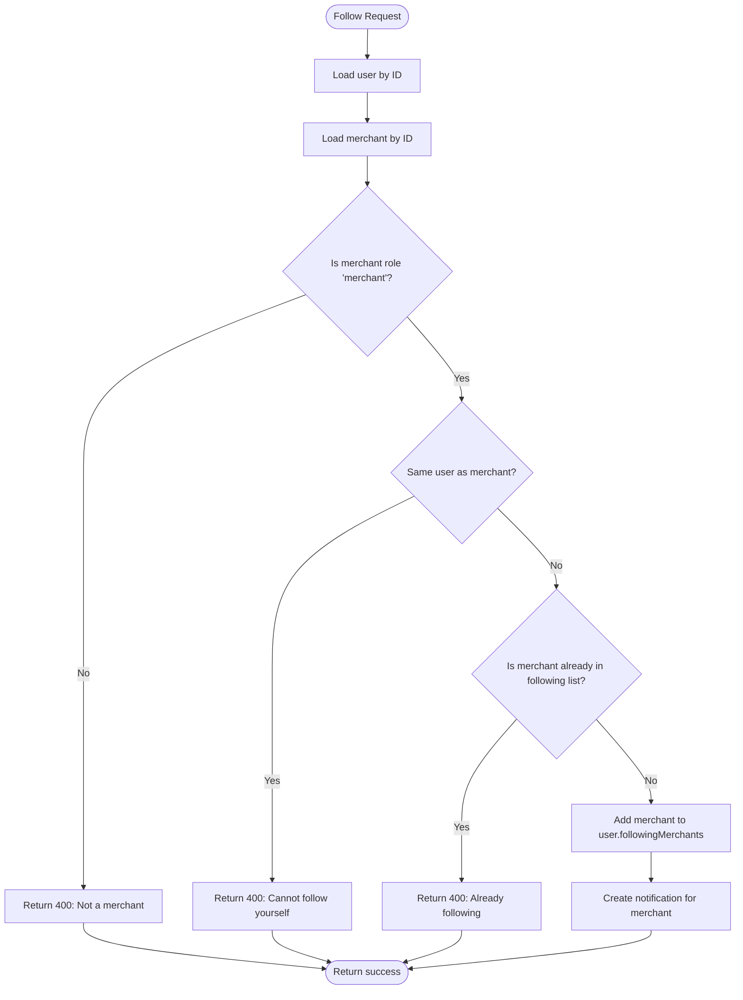
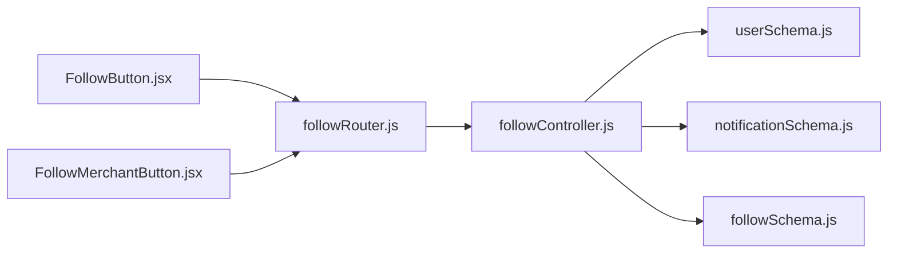

# Follow Schema

<cite>
**Referenced Files in This Document**
- [followSchema.js](file://backend/models/followSchema.js)
- [followController.js](file://backend/controller/followController.js)
- [followRouter.js](file://backend/router/followRouter.js)
- [userSchema.js](file://backend/models/userSchema.js)
- [notificationSchema.js](file://backend/models/notificationSchema.js)
- [FollowButton.jsx](file://frontend/src/components/FollowButton.jsx)
- [FollowMerchantButton.jsx](file://frontend/src/components/FollowMerchantButton.jsx)
</cite>

## Table of Contents
1. [Introduction](#introduction)
2. [Project Structure](#project-structure)
3. [Core Components](#core-components)
4. [Architecture Overview](#architecture-overview)
5. [Detailed Component Analysis](#detailed-component-analysis)
6. [Dependency Analysis](#dependency-analysis)
7. [Performance Considerations](#performance-considerations)
8. [Troubleshooting Guide](#troubleshooting-guide)
9. [Conclusion](#conclusion)
10. [Appendices](#appendices)

## Introduction
This document explains the Follow schema and its implementation for merchant following functionality in the MERN stack event management project. It covers the follow relationship model, user-to-merchant following, validation rules, duplicate prevention, follow/unfollow operations, social interaction patterns, notification triggers, and query patterns for retrieving followers and following lists. It also includes examples of follow documents and social graph traversal patterns.

## Project Structure
The follow feature spans backend models, controller, router, and frontend components:
- Backend
  - Model: Follow schema defines the relationship and enforces uniqueness
  - Controller: Implements follow/unfollow, status checks, and queries
  - Router: Exposes REST endpoints for follow actions
  - Supporting models: User and Notification schemas
- Frontend
  - Components: Buttons to follow/unfollow merchants and reflect status

**Diagram sources**
- [followSchema.js:1-22](file://backend/models/followSchema.js#L1-L22)
- [followController.js:1-234](file://backend/controller/followController.js#L1-L234)
- [followRouter.js:1-26](file://backend/router/followRouter.js#L1-L26)
- [userSchema.js:1-55](file://backend/models/userSchema.js#L1-L55)
- [notificationSchema.js:1-36](file://backend/models/notificationSchema.js#L1-L36)
- [FollowButton.jsx:1-121](file://frontend/src/components/FollowButton.jsx#L1-L121)
- [FollowMerchantButton.jsx:1-117](file://frontend/src/components/FollowMerchantButton.jsx#L1-L117)

**Section sources**
- [followSchema.js:1-22](file://backend/models/followSchema.js#L1-L22)
- [followController.js:1-234](file://backend/controller/followController.js#L1-L234)
- [followRouter.js:1-26](file://backend/router/followRouter.js#L1-L26)
- [userSchema.js:1-55](file://backend/models/userSchema.js#L1-L55)
- [notificationSchema.js:1-36](file://backend/models/notificationSchema.js#L1-L36)
- [FollowButton.jsx:1-121](file://frontend/src/components/FollowButton.jsx#L1-L121)
- [FollowMerchantButton.jsx:1-117](file://frontend/src/components/FollowMerchantButton.jsx#L1-L117)

## Core Components
- Follow schema
  - Fields: user (ObjectId referencing User), merchant (ObjectId referencing User), timestamps
  - Unique constraint: Ensures a user can follow a merchant only once
- User schema
  - Role-based access: Users can follow; merchants cannot follow themselves
  - Following list: User maintains a list of followed merchant IDs
- Notification schema
  - Triggered when a user follows a merchant
  - Fields: user (recipient), message, read flag, optional booking-related fields, type
- Controller endpoints
  - Follow merchant, unfollow merchant, check follow status, get following merchants, get merchant followers
- Router endpoints
  - POST /follow/:merchantId, DELETE /unfollow/:merchantId, GET /status/:merchantId, GET /following, GET /followers

**Section sources**
- [followSchema.js:3-22](file://backend/models/followSchema.js#L3-L22)
- [userSchema.js:39-52](file://backend/models/userSchema.js#L39-L52)
- [notificationSchema.js:3-36](file://backend/models/notificationSchema.js#L3-L36)
- [followController.js:4-234](file://backend/controller/followController.js#L4-L234)
- [followRouter.js:13-24](file://backend/router/followRouter.js#L13-L24)

## Architecture Overview
The follow feature integrates frontend UI components with backend routes, controllers, and models. The flow includes:
- Frontend buttons call REST endpoints to follow/unfollow
- Controller validates roles, prevents self-follow, checks duplicates, updates user’s following list, and creates notifications
- Queries support retrieving following lists and followers

**Diagram sources**
- [followRouter.js:14](file://backend/router/followRouter.js#L14)
- [followController.js:5-86](file://backend/controller/followController.js#L5-L86)
- [userSchema.js:39-52](file://backend/models/userSchema.js#L39-L52)
- [notificationSchema.js:3-36](file://backend/models/notificationSchema.js#L3-L36)

## Detailed Component Analysis

### Follow Schema
- Purpose: Store user-to-merchant follow relationships
- Fields:
  - user: ObjectId referencing User
  - merchant: ObjectId referencing User
  - timestamps: createdAt, updatedAt
- Constraints:
  - Unique compound index on { user, merchant } to prevent duplicates

**Diagram sources**
- [followSchema.js:3-22](file://backend/models/followSchema.js#L3-L22)
- [userSchema.js:4-52](file://backend/models/userSchema.js#L4-L52)

**Section sources**
- [followSchema.js:3-22](file://backend/models/followSchema.js#L3-L22)

### Controller Operations
- Follow merchant
  - Validates merchant existence and role
  - Prevents self-follow
  - Checks duplicate in user.followingMerchants
  - Updates user.followingMerchants
  - Creates notification for merchant
- Unfollow merchant
  - Validates user exists
  - Confirms current follow status
  - Removes merchant from user.followingMerchants
- Check follow status
  - Returns whether user follows merchant
- Get following merchants
  - Populates user’s followingMerchants with selected fields
- Get merchant followers
  - Queries users whose followingMerchants includes merchantId

**Diagram sources**
- [followController.js:5-86](file://backend/controller/followController.js#L5-L86)

**Section sources**
- [followController.js:4-137](file://backend/controller/followController.js#L4-L137)

### Router Endpoints
- POST /follow/:merchantId
- DELETE /unfollow/:merchantId
- GET /status/:merchantId
- GET /following
- GET /followers

**Section sources**
- [followRouter.js:13-24](file://backend/router/followRouter.js#L13-L24)

### Frontend Components
- FollowButton.jsx
  - Checks follow status via GET /follow/status/:merchantId
  - Follows via POST /follow/:merchantId
  - Displays loading states and toast feedback
- FollowMerchantButton.jsx
  - Conditional rendering for user role
  - Uses toggle logic to follow/unfollow
  - Handles POST/DELETE based on current status

**Section sources**
- [FollowButton.jsx:1-121](file://frontend/src/components/FollowButton.jsx#L1-L121)
- [FollowMerchantButton.jsx:1-117](file://frontend/src/components/FollowMerchantButton.jsx#L1-L117)

## Dependency Analysis
- followController depends on:
  - User model for user and merchant validation and updates
  - Notification model for creating follow notifications
- followRouter depends on:
  - followController handlers
  - auth middleware for protected routes
- Frontend components depend on:
  - followRouter endpoints for follow/unfollow operations

**Diagram sources**
- [followRouter.js:1-26](file://backend/router/followRouter.js#L1-L26)
- [followController.js:1-234](file://backend/controller/followController.js#L1-L234)
- [userSchema.js:1-55](file://backend/models/userSchema.js#L1-L55)
- [notificationSchema.js:1-36](file://backend/models/notificationSchema.js#L1-L36)
- [followSchema.js:1-22](file://backend/models/followSchema.js#L1-L22)
- [FollowButton.jsx:1-121](file://frontend/src/components/FollowButton.jsx#L1-L121)
- [FollowMerchantButton.jsx:1-117](file://frontend/src/components/FollowMerchantButton.jsx#L1-L117)

**Section sources**
- [followRouter.js:1-26](file://backend/router/followRouter.js#L1-L26)
- [followController.js:1-234](file://backend/controller/followController.js#L1-L234)

## Performance Considerations
- Indexing
  - Compound unique index on { user, merchant } prevents duplicates and supports efficient lookups
- Population
  - Populate only required fields when fetching following lists to reduce payload size
- Query patterns
  - Use targeted selectors (select only needed fields) to minimize data transfer
- Notification creation
  - Keep notification creation lightweight; avoid heavy operations in hot paths

[No sources needed since this section provides general guidance]

## Troubleshooting Guide
- Common errors and causes
  - Merchant not found: Ensure merchantId is valid and exists
  - User not found: Ensure user ID from auth middleware is valid
  - Not a merchant: Verify merchant role is "merchant"
  - Self-follow attempted: Prevent user from following themselves
  - Already following: Check user.followingMerchants for duplicate entries
  - Unfollow when not following: Confirm current follow status before removal
- Logging and diagnostics
  - Controller logs include operation type, user ID, and merchant ID
  - Frontend toast messages provide immediate feedback on success or failure
- Recovery steps
  - Re-fetch follow status after operations
  - Validate user role and merchant role before attempting follow/unfollow
  - Ensure unique index constraints are respected to avoid duplicate entries

**Section sources**
- [followController.js:14-86](file://backend/controller/followController.js#L14-L86)
- [followController.js:88-137](file://backend/controller/followController.js#L88-L137)
- [followController.js:139-172](file://backend/controller/followController.js#L139-L172)
- [followController.js:174-206](file://backend/controller/followController.js#L174-L206)
- [followController.js:208-234](file://backend/controller/followController.js#L208-L234)

## Conclusion
The Follow schema implements a robust user-to-merchant following system with validation, duplicate prevention, and notification triggers. The controller enforces business rules, while the router exposes clean REST endpoints. Frontend components provide intuitive follow/unfollow interactions. Query patterns efficiently retrieve following lists and followers, enabling scalable social graph traversal.

[No sources needed since this section summarizes without analyzing specific files]

## Appendices

### Relationship Validation Rules and Duplicate Prevention
- Merchant validation: Ensure merchant exists and role equals "merchant"
- Self-follow prevention: Disallow user from following themselves
- Duplicate prevention: Unique compound index on { user, merchant } enforced at the database level
- In-memory duplicate check: Controller verifies presence in user.followingMerchants before adding

**Section sources**
- [followSchema.js:19-20](file://backend/models/followSchema.js#L19-L20)
- [followController.js:14-36](file://backend/controller/followController.js#L14-L36)
- [followController.js:47-54](file://backend/controller/followController.js#L47-L54)

### Query Patterns for Retrieving Followers and Following Lists
- Get following merchants
  - Populate user.followingMerchants with name, email, businessName, serviceType
- Get merchant followers
  - Query users where followingMerchants includes merchantId and select name, email

**Section sources**
- [followController.js:182-197](file://backend/controller/followController.js#L182-L197)
- [followController.js:216-225](file://backend/controller/followController.js#L216-L225)

### Examples of Follow Documents and Social Graph Traversal
- Example follow document
  - Fields: user, merchant, timestamps
  - Unique constraint ensures one follow per user-merchant pair
- Social graph traversal
  - Following list: user.followingMerchants
  - Followers: users where followingMerchants includes merchantId

**Section sources**
- [followSchema.js:3-17](file://backend/models/followSchema.js#L3-L17)
- [followController.js:182-197](file://backend/controller/followController.js#L182-L197)
- [followController.js:216-225](file://backend/controller/followController.js#L216-L225)