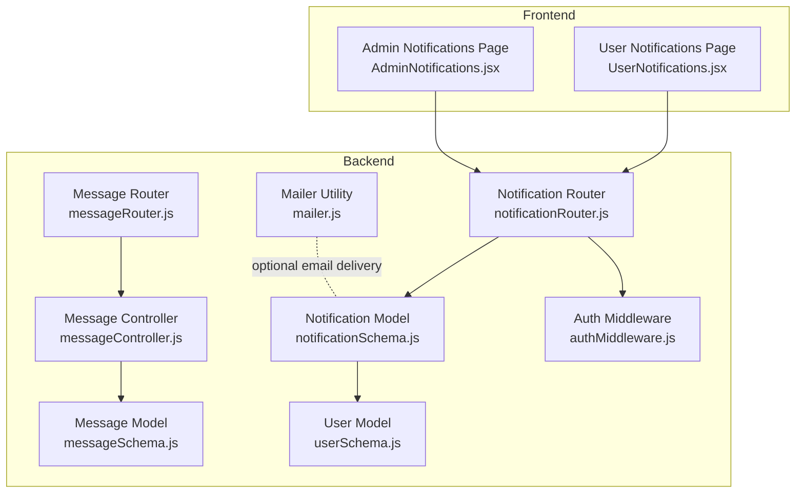
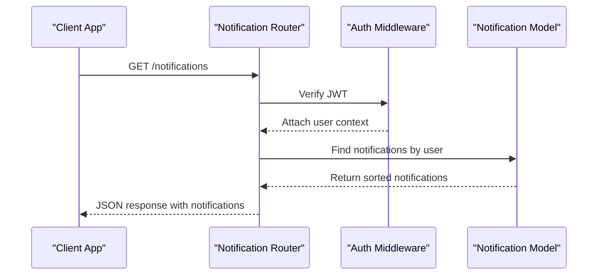
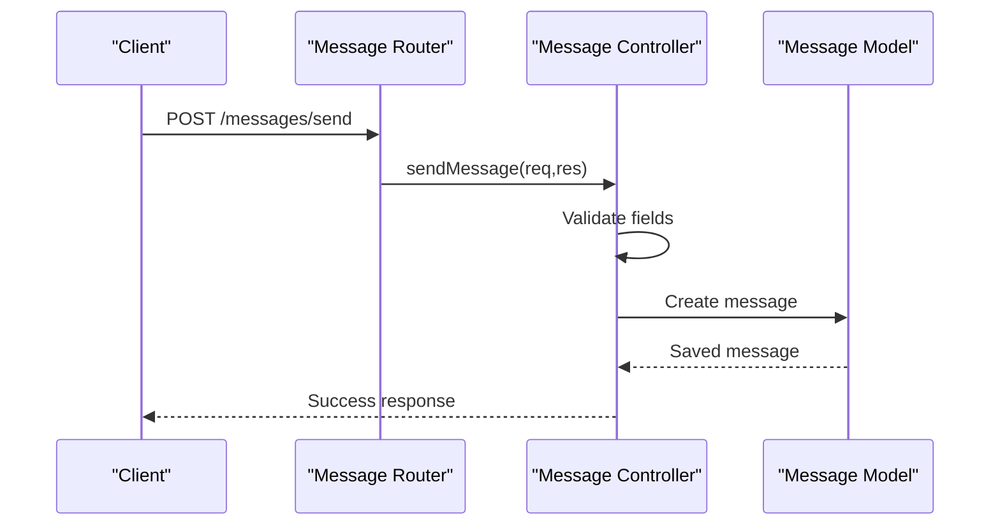
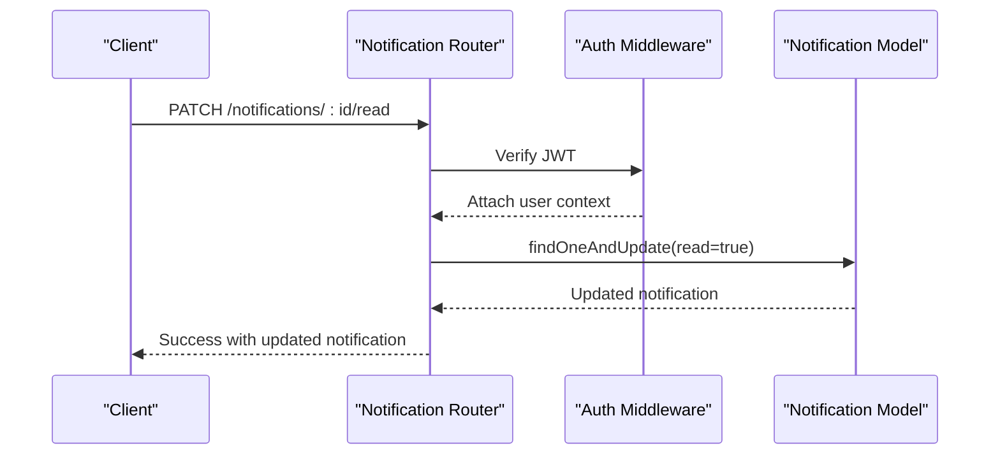
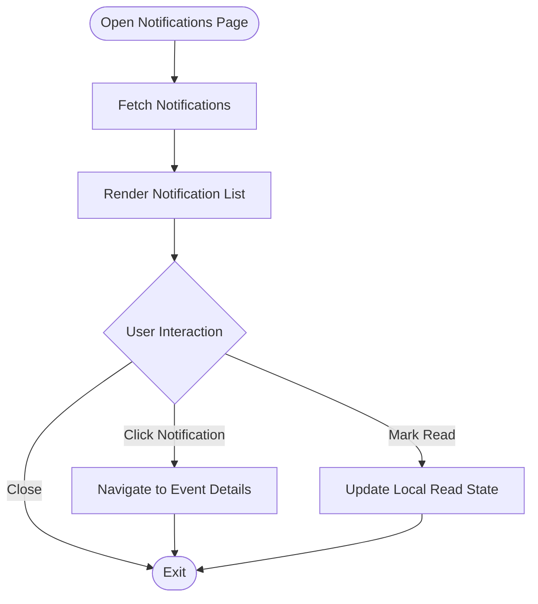
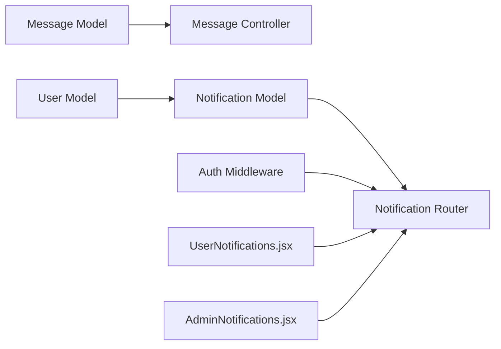

# Message and Notification Schema

<cite>
**Referenced Files in This Document**
- [messageSchema.js](file://backend/models/messageSchema.js)
- [notificationSchema.js](file://backend/models/notificationSchema.js)
- [messageController.js](file://backend/controller/messageController.js)
- [notificationRouter.js](file://backend/router/notificationRouter.js)
- [messageRouter.js](file://backend/router/messageRouter.js)
- [authMiddleware.js](file://backend/middleware/authMiddleware.js)
- [userSchema.js](file://backend/models/userSchema.js)
- [mailer.js](file://backend/util/mailer.js)
- [UserNotifications.jsx](file://frontend/src/pages/dashboards/UserNotifications.jsx)
- [AdminNotifications.jsx](file://frontend/src/pages/dashboards/AdminNotifications.jsx)
- [create-sample-notifications.js](file://backend/create-sample-notifications.js)
</cite>

## Table of Contents
1. [Introduction](#introduction)
2. [Project Structure](#project-structure)
3. [Core Components](#core-components)
4. [Architecture Overview](#architecture-overview)
5. [Detailed Component Analysis](#detailed-component-analysis)
6. [Dependency Analysis](#dependency-analysis)
7. [Performance Considerations](#performance-considerations)
8. [Troubleshooting Guide](#troubleshooting-guide)
9. [Conclusion](#conclusion)
10. [Appendices](#appendices)

## Introduction
This document provides comprehensive documentation for the Message and Notification schema that powers communication and alert systems within the platform. It explains the data models, field definitions, relationships, and operational flows for messages and notifications. It also covers threading concepts, notification triggers, user preferences, delivery mechanisms, and practical query patterns for managing communications and alerts.

## Project Structure
The messaging and notification system spans backend models, controllers, routers, middleware, and frontend components:

- Backend models define the data structures for messages and notifications.
- Controllers handle business logic for sending messages and managing notifications.
- Routers expose REST endpoints for client consumption.
- Middleware enforces authentication for protected routes.
- Frontend dashboards render notifications and provide user interactions.

**Diagram sources**
- [messageSchema.js:1-28](file://backend/models/messageSchema.js#L1-L28)
- [notificationSchema.js:1-36](file://backend/models/notificationSchema.js#L1-L36)
- [messageController.js:1-44](file://backend/controller/messageController.js#L1-L44)
- [notificationRouter.js:1-45](file://backend/router/notificationRouter.js#L1-L45)
- [messageRouter.js:1-9](file://backend/router/messageRouter.js#L1-L9)
- [authMiddleware.js:1-17](file://backend/middleware/authMiddleware.js#L1-L17)
- [userSchema.js:1-55](file://backend/models/userSchema.js#L1-L55)
- [mailer.js:1-42](file://backend/util/mailer.js#L1-L42)
- [UserNotifications.jsx:1-155](file://frontend/src/pages/dashboards/UserNotifications.jsx#L1-L155)
- [AdminNotifications.jsx:1-217](file://frontend/src/pages/dashboards/AdminNotifications.jsx#L1-L217)

**Section sources**
- [messageSchema.js:1-28](file://backend/models/messageSchema.js#L1-L28)
- [notificationSchema.js:1-36](file://backend/models/notificationSchema.js#L1-L36)
- [messageController.js:1-44](file://backend/controller/messageController.js#L1-L44)
- [notificationRouter.js:1-45](file://backend/router/notificationRouter.js#L1-L45)
- [messageRouter.js:1-9](file://backend/router/messageRouter.js#L1-L9)
- [authMiddleware.js:1-17](file://backend/middleware/authMiddleware.js#L1-L17)
- [userSchema.js:1-55](file://backend/models/userSchema.js#L1-L55)
- [mailer.js:1-42](file://backend/util/mailer.js#L1-L42)
- [UserNotifications.jsx:1-155](file://frontend/src/pages/dashboards/UserNotifications.jsx#L1-L155)
- [AdminNotifications.jsx:1-217](file://frontend/src/pages/dashboards/AdminNotifications.jsx#L1-L217)

## Core Components
This section defines the core schemas and their fields, including validation rules and relationships.

### Message Schema
- Purpose: Captures contact form submissions with validated fields.
- Fields:
  - name: String, required, minimum length 3.
  - email: String, required, validated as email.
  - subject: String, required, minimum length 5.
  - message: String, required, minimum length 10.
- Validation: Enforced via Mongoose validators and runtime checks.

**Section sources**
- [messageSchema.js:4-25](file://backend/models/messageSchema.js#L4-L25)

### Notification Schema
- Purpose: Stores user-specific alerts and system notifications.
- Fields:
  - user: ObjectId referencing User, required.
  - message: String, required.
  - read: Boolean, default false.
  - eventId: String (optional, for event-related notifications).
  - bookingId: ObjectId referencing Booking (optional).
  - type: Enum ["booking", "payment", "general"], default "general".
- Timestamps: createdAt and updatedAt automatically managed.

**Section sources**
- [notificationSchema.js:3-33](file://backend/models/notificationSchema.js#L3-L33)

### User Schema (Reference)
- Purpose: Provides user identity for notification targeting.
- Key fields include role and status, supporting role-based access and filtering.

**Section sources**
- [userSchema.js:4-52](file://backend/models/userSchema.js#L4-L52)

## Architecture Overview
The system follows a layered architecture:
- Frontend dashboards request notifications and manage read/unread states.
- Backend routes enforce authentication and delegate to controllers/models.
- Models persist data and maintain referential integrity.
- Optional email delivery is supported via a mail utility.

**Diagram sources**
- [notificationRouter.js:7-17](file://backend/router/notificationRouter.js#L7-L17)
- [authMiddleware.js:3-16](file://backend/middleware/authMiddleware.js#L3-L16)
- [notificationSchema.js:5-9](file://backend/models/notificationSchema.js#L5-L9)

## Detailed Component Analysis

### Message Component
- Responsibilities:
  - Validate incoming message fields.
  - Persist messages to the database.
  - Return structured success/error responses.
- Threading: Not applicable for generic messages; messages are standalone records.

**Diagram sources**
- [messageRouter.js](file://backend/router/messageRouter.js#L6)
- [messageController.js:3-16](file://backend/controller/messageController.js#L3-L16)
- [messageSchema.js:4-25](file://backend/models/messageSchema.js#L4-L25)

**Section sources**
- [messageController.js:3-43](file://backend/controller/messageController.js#L3-L43)
- [messageRouter.js:1-9](file://backend/router/messageRouter.js#L1-L9)
- [messageSchema.js:1-28](file://backend/models/messageSchema.js#L1-L28)

### Notification Component
- Responsibilities:
  - Retrieve notifications for the authenticated user.
  - Mark individual notifications as read.
  - Delete notifications.
- Threading: Notifications are per-user records; no thread nesting is implemented.
- Triggers: Notifications are created externally (e.g., via scripts) and stored for retrieval.
- Delivery: Notifications are consumed via API; optional email delivery exists but is separate from the notification model.

**Diagram sources**
- [notificationRouter.js:19-32](file://backend/router/notificationRouter.js#L19-L32)
- [authMiddleware.js:3-16](file://backend/middleware/authMiddleware.js#L3-L16)
- [notificationSchema.js:14-17](file://backend/models/notificationSchema.js#L14-L17)

**Section sources**
- [notificationRouter.js:1-45](file://backend/router/notificationRouter.js#L1-L45)
- [authMiddleware.js:1-17](file://backend/middleware/authMiddleware.js#L1-L17)
- [notificationSchema.js:1-36](file://backend/models/notificationSchema.js#L1-L36)

### Frontend Notification Pages
- User Notifications:
  - Fetches and displays upcoming event notifications.
  - Supports marking notifications as read locally and navigation to event details.
- Admin Notifications:
  - Renders system notifications with type badges and metadata.
  - Summarizes counts by notification type.

**Diagram sources**
- [UserNotifications.jsx:17-85](file://frontend/src/pages/dashboards/UserNotifications.jsx#L17-L85)
- [AdminNotifications.jsx:18-35](file://frontend/src/pages/dashboards/AdminNotifications.jsx#L18-L35)

**Section sources**
- [UserNotifications.jsx:1-155](file://frontend/src/pages/dashboards/UserNotifications.jsx#L1-L155)
- [AdminNotifications.jsx:1-217](file://frontend/src/pages/dashboards/AdminNotifications.jsx#L1-L217)

## Dependency Analysis
- Models:
  - Notification references User (ObjectId) and optionally Booking.
  - Message is independent and does not reference other models.
- Controllers:
  - Message controller depends on Message model.
  - Notification router depends on Notification model and auth middleware.
- Routers:
  - Both routers depend on Express and export route handlers.
- Frontend:
  - Dashboards consume backend endpoints and update UI state.

**Diagram sources**
- [messageSchema.js](file://backend/models/messageSchema.js#L27)
- [notificationSchema.js:5-9](file://backend/models/notificationSchema.js#L5-L9)
- [userSchema.js:4-52](file://backend/models/userSchema.js#L4-L52)
- [messageController.js](file://backend/controller/messageController.js#L1)
- [notificationRouter.js:1-45](file://backend/router/notificationRouter.js#L1-L45)
- [authMiddleware.js:1-17](file://backend/middleware/authMiddleware.js#L1-L17)
- [UserNotifications.jsx:1-155](file://frontend/src/pages/dashboards/UserNotifications.jsx#L1-L155)
- [AdminNotifications.jsx:1-217](file://frontend/src/pages/dashboards/AdminNotifications.jsx#L1-L217)

**Section sources**
- [messageSchema.js:1-28](file://backend/models/messageSchema.js#L1-L28)
- [notificationSchema.js:1-36](file://backend/models/notificationSchema.js#L1-L36)
- [userSchema.js:1-55](file://backend/models/userSchema.js#L1-L55)
- [messageController.js:1-44](file://backend/controller/messageController.js#L1-L44)
- [notificationRouter.js:1-45](file://backend/router/notificationRouter.js#L1-L45)
- [authMiddleware.js:1-17](file://backend/middleware/authMiddleware.js#L1-L17)
- [UserNotifications.jsx:1-155](file://frontend/src/pages/dashboards/UserNotifications.jsx#L1-L155)
- [AdminNotifications.jsx:1-217](file://frontend/src/pages/dashboards/AdminNotifications.jsx#L1-L217)

## Performance Considerations
- Indexing:
  - Consider adding indexes on Notification.user and Notification.createdAt for efficient sorting and filtering.
- Pagination:
  - The notification endpoint limits results; extend pagination for large datasets.
- Population:
  - Avoid unnecessary population of user details in notification lists; fetch only required fields.
- Email Delivery:
  - Email transport initialization occurs on-demand; cache transporter if frequent sends are expected.

[No sources needed since this section provides general guidance]

## Troubleshooting Guide
- Authentication Failures:
  - Ensure Authorization header includes a valid Bearer token; otherwise routes return unauthorized.
- Validation Errors (Messages):
  - Missing or invalid fields produce detailed validation messages; verify client payload matches schema requirements.
- Notification Access:
  - Routes filter notifications by the authenticated user; confirm token belongs to the intended user.
- Email Delivery:
  - If SMTP environment variables are missing, emails fall back to console logging; configure environment variables for real delivery.

**Section sources**
- [authMiddleware.js:7-15](file://backend/middleware/authMiddleware.js#L7-L15)
- [messageController.js:18-42](file://backend/controller/messageController.js#L18-L42)
- [notificationRouter.js:8-16](file://backend/router/notificationRouter.js#L8-L16)

## Conclusion
The Message and Notification schemas provide a clean foundation for communication and alert management. Messages capture validated contact submissions, while notifications deliver user-targeted alerts with read/unread tracking and flexible categorization. The system integrates authentication, straightforward CRUD operations, and frontend dashboards for seamless user experiences. Extending indexing, pagination, and robust notification triggers would further enhance scalability and reliability.

[No sources needed since this section summarizes without analyzing specific files]

## Appendices

### Message Document Example
- Fields: name, email, subject, message
- Typical use: Contact form submissions
- Validation ensures minimum lengths and email format

**Section sources**
- [messageSchema.js:4-25](file://backend/models/messageSchema.js#L4-L25)

### Notification Document Example
- Fields: user, message, read, eventId, bookingId, type, timestamps
- Typical use: Booking confirmations, payment receipts, general announcements
- Type enum supports categorized alerting

**Section sources**
- [notificationSchema.js:3-33](file://backend/models/notificationSchema.js#L3-L33)

### Query Patterns for Communication and Alert Management
- Retrieve user notifications (sorted by recency, limited):
  - Filter: { user: userId }
  - Sort: { createdAt: -1 }
  - Limit: 20
- Mark a notification as read:
  - findOneAndUpdate: { read: true }
- Delete a notification:
  - findOneAndDelete: by ID and user ownership
- Create sample notifications:
  - Seed script demonstrates creating notifications with different types and associations

**Section sources**
- [notificationRouter.js:8-16](file://backend/router/notificationRouter.js#L8-L16)
- [notificationRouter.js:19-32](file://backend/router/notificationRouter.js#L19-L32)
- [notificationRouter.js:34-42](file://backend/router/notificationRouter.js#L34-L42)
- [create-sample-notifications.js:22-49](file://backend/create-sample-notifications.js#L22-L49)

### Delivery Mechanisms
- API-driven consumption:
  - Frontend pages fetch notifications via authenticated endpoints.
- Optional email delivery:
  - Mail utility supports SMTP transport or console fallback.

**Section sources**
- [UserNotifications.jsx:21-35](file://frontend/src/pages/dashboards/UserNotifications.jsx#L21-L35)
- [AdminNotifications.jsx:18-35](file://frontend/src/pages/dashboards/AdminNotifications.jsx#L18-L35)
- [mailer.js:5-41](file://backend/util/mailer.js#L5-L41)