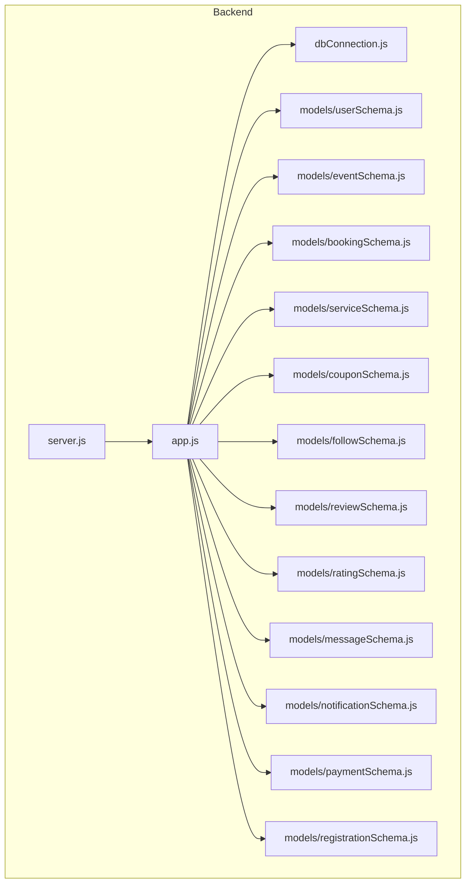
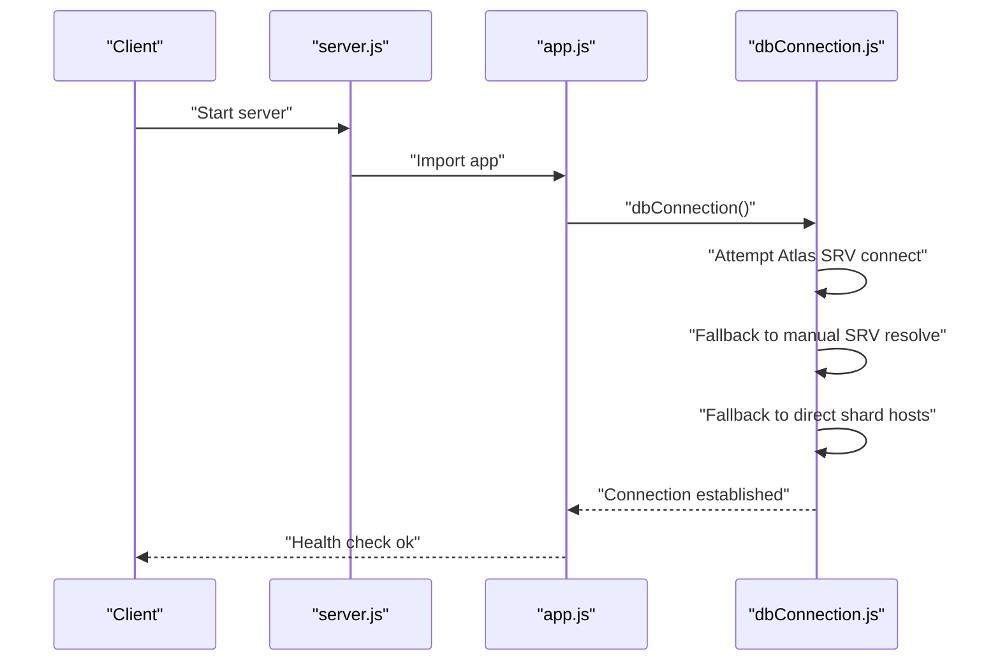
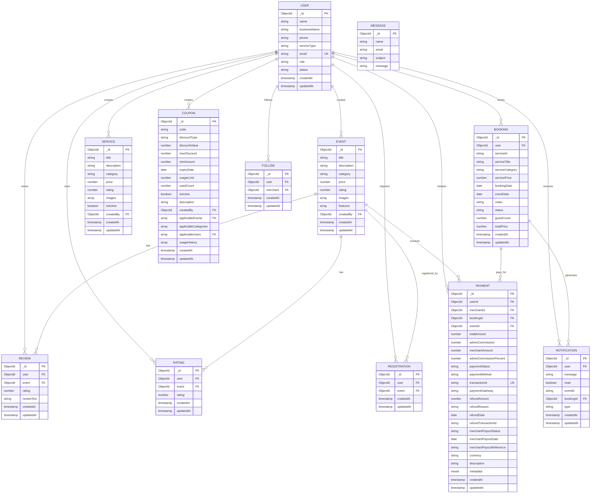
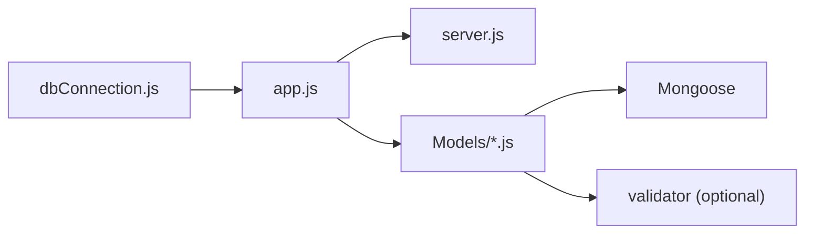

# MongoDB Schema Design

<cite>
**Referenced Files in This Document**
- [userSchema.js](file://backend/models/userSchema.js)
- [eventSchema.js](file://backend/models/eventSchema.js)
- [bookingSchema.js](file://backend/models/bookingSchema.js)
- [serviceSchema.js](file://backend/models/serviceSchema.js)
- [couponSchema.js](file://backend/models/couponSchema.js)
- [followSchema.js](file://backend/models/followSchema.js)
- [reviewSchema.js](file://backend/models/reviewSchema.js)
- [ratingSchema.js](file://backend/models/ratingSchema.js)
- [messageSchema.js](file://backend/models/messageSchema.js)
- [notificationSchema.js](file://backend/models/notificationSchema.js)
- [paymentSchema.js](file://backend/models/paymentSchema.js)
- [registrationSchema.js](file://backend/models/registrationSchema.js)
- [dbConnection.js](file://backend/database/dbConnection.js)
- [app.js](file://backend/app.js)
- [server.js](file://backend/server.js)
</cite>

## Table of Contents
1. [Introduction](#introduction)
2. [Project Structure](#project-structure)
3. [Core Components](#core-components)
4. [Architecture Overview](#architecture-overview)
5. [Detailed Component Analysis](#detailed-component-analysis)
6. [Dependency Analysis](#dependency-analysis)
7. [Performance Considerations](#performance-considerations)
8. [Troubleshooting Guide](#troubleshooting-guide)
9. [Conclusion](#conclusion)
10. [Appendices](#appendices)

## Introduction
This document presents a comprehensive MongoDB schema design for the MERN Stack Event Management Platform. It defines all collection schemas, field semantics, validation rules, required/default values, indexing strategies, and query optimization patterns. It also explains design decisions, entity relationships, and integrity constraints derived from the backend models and database connection configuration.

## Project Structure
The backend models define the MongoDB collections and their relationships. The application initializes the database connection and registers routers for API endpoints.

**Diagram sources**
- [app.js:1-91](file://backend/app.js#L1-L91)
- [server.js:1-6](file://backend/server.js#L1-L6)
- [dbConnection.js:1-112](file://backend/database/dbConnection.js#L1-L112)
- [userSchema.js:1-55](file://backend/models/userSchema.js#L1-L55)
- [eventSchema.js:1-23](file://backend/models/eventSchema.js#L1-L23)
- [bookingSchema.js:1-53](file://backend/models/bookingSchema.js#L1-L53)
- [serviceSchema.js:1-83](file://backend/models/serviceSchema.js#L1-L83)
- [couponSchema.js:1-123](file://backend/models/couponSchema.js#L1-L123)
- [followSchema.js:1-22](file://backend/models/followSchema.js#L1-L22)
- [reviewSchema.js:1-17](file://backend/models/reviewSchema.js#L1-L17)
- [ratingSchema.js:1-28](file://backend/models/ratingSchema.js#L1-L28)
- [messageSchema.js:1-28](file://backend/models/messageSchema.js#L1-L28)
- [notificationSchema.js:1-36](file://backend/models/notificationSchema.js#L1-L36)
- [paymentSchema.js:1-142](file://backend/models/paymentSchema.js#L1-L142)
- [registrationSchema.js:1-12](file://backend/models/registrationSchema.js#L1-L12)

**Section sources**
- [app.js:1-91](file://backend/app.js#L1-L91)
- [server.js:1-6](file://backend/server.js#L1-L6)
- [dbConnection.js:1-112](file://backend/database/dbConnection.js#L1-L112)

## Core Components
This section summarizes each collection’s purpose, primary fields, and constraints.

- Users
  - Purpose: Store platform users, merchants, and admins with roles and status.
  - Key fields: name, businessName, phone, serviceType, email, password, role, status.
  - Validation: Email uniqueness and format; password length; role enum; status enum.
  - Defaults: role=user, status=active; optional strings default to empty.
  - Timestamps enabled.

- Events
  - Purpose: Represent event listings created by users (merchants).
  - Key fields: title, description, category, price, rating, images[], features[], createdBy.
  - Validation: Rating bounds; images array items required; category defaults empty.
  - References: createdBy links to User.
  - Timestamps enabled.

- Bookings
  - Purpose: Track booking requests for services with status and pricing.
  - Key fields: user, serviceId, serviceTitle, serviceCategory, servicePrice, bookingDate, eventDate, notes, status, guestCount, totalPrice.
  - Validation: Status enum; guestCount default 1; dates optional except bookingDate.
  - References: user links to User.
  - Timestamps enabled.

- Services
  - Purpose: List service offerings with rich metadata and search support.
  - Key fields: title, description, category, price, rating, images[], isActive, createdBy.
  - Validation: Title/description length limits; category enum; price non-negative; rating bounds; images count 1–4.
  - References: createdBy links to User.
  - Index: Text index on title, description, category for search.
  - Timestamps enabled.

- Coupons
  - Purpose: Discount codes with usage tracking and applicability rules.
  - Key fields: code, discountType, discountValue, maxDiscount, minAmount, expiryDate, usageLimit, usedCount, isActive, description, createdBy, applicableEvents[], applicableCategories[], applicableUsers[], usageHistory[].
  - Validation: Uppercase code; discountType enum; value min 0; expiryDate required; usageLimit min 1; usageHistory entries include user, booking, usedAt, discountAmount.
  - References: createdBy, applicableEvents, applicableUsers link to User/Event.
  - Indexes: code, (isActive, expiryDate), createdBy; pre-save middleware enforces uppercase code.
  - Virtuals: remainingUsage, usagePercentage.
  - Timestamps enabled.

- Follows
  - Purpose: Track user-to-merchant follow relationships.
  - Key fields: user, merchant.
  - References: user and merchant link to User.
  - Unique compound index on (user, merchant).
  - Timestamps enabled.

- Reviews
  - Purpose: User-generated textual reviews per event.
  - Key fields: user, event, rating, reviewText.
  - Validation: rating bounds; reviewText optional.
  - References: user, event link to User, Event.
  - Unique compound index on (user, event).
  - Timestamps enabled.

- Ratings
  - Purpose: Numeric-only ratings per event.
  - Key fields: user, event, rating.
  - Validation: rating bounds.
  - References: user, event link to User, Event.
  - Unique compound index on (user, event).
  - Timestamps enabled.

- Messages
  - Purpose: Contact form submissions.
  - Key fields: name, email, subject, message.
  - Validation: Length and format checks; email validity.
  - No references.
  - No timestamps.

- Notifications
  - Purpose: User-centric notifications with optional booking linkage.
  - Key fields: user, message, read, eventId, bookingId, type.
  - Validation: type enum; read default false.
  - References: user links to User; bookingId links to Booking.
  - Timestamps enabled.

- Payments
  - Purpose: Payment lifecycle tracking with commission and payout metadata.
  - Key fields: userId, merchantId, bookingId, eventId, totalAmount, adminCommission, merchantAmount, adminCommissionPercent, paymentStatus, paymentMethod, transactionId, paymentGateway, refundAmount, refundReason, refundDate, refundTransactionId, merchantPayoutStatus, merchantPayoutDate, merchantPayoutReference, currency, description, metadata.
  - Validation: Amount totals validated; enums for status and method; percent bounds; unique transactionId; amount min 0.
  - References: userId, merchantId link to User; bookingId links to Booking; eventId links to Event.
  - Indexes: (userId, createdAt desc), (merchantId, createdAt desc), bookingId, transactionId, paymentStatus; pre-save validates amount equality.
  - Virtuals: calculatedCommissionPercent, merchantPercent.
  - Timestamps enabled.

- Registrations
  - Purpose: Track user registrations for events.
  - Key fields: user, event.
  - References: user links to User; event links to Event.
  - Timestamps enabled.

**Section sources**
- [userSchema.js:1-55](file://backend/models/userSchema.js#L1-L55)
- [eventSchema.js:1-23](file://backend/models/eventSchema.js#L1-L23)
- [bookingSchema.js:1-53](file://backend/models/bookingSchema.js#L1-L53)
- [serviceSchema.js:1-83](file://backend/models/serviceSchema.js#L1-L83)
- [couponSchema.js:1-123](file://backend/models/couponSchema.js#L1-L123)
- [followSchema.js:1-22](file://backend/models/followSchema.js#L1-L22)
- [reviewSchema.js:1-17](file://backend/models/reviewSchema.js#L1-L17)
- [ratingSchema.js:1-28](file://backend/models/ratingSchema.js#L1-L28)
- [messageSchema.js:1-28](file://backend/models/messageSchema.js#L1-L28)
- [notificationSchema.js:1-36](file://backend/models/notificationSchema.js#L1-L36)
- [paymentSchema.js:1-142](file://backend/models/paymentSchema.js#L1-L142)
- [registrationSchema.js:1-12](file://backend/models/registrationSchema.js#L1-L12)

## Architecture Overview
The application connects to MongoDB Atlas with robust DNS resolution and multiple fallback strategies. The Express app mounts routers for all domain features and initializes the admin user after a successful DB connection.

**Diagram sources**
- [server.js:1-6](file://backend/server.js#L1-L6)
- [app.js:64-85](file://backend/app.js#L64-L85)
- [dbConnection.js:19-94](file://backend/database/dbConnection.js#L19-L94)

**Section sources**
- [server.js:1-6](file://backend/server.js#L1-L6)
- [app.js:64-85](file://backend/app.js#L64-L85)
- [dbConnection.js:19-94](file://backend/database/dbConnection.js#L19-L94)

## Detailed Component Analysis

### Entity Relationship Model

**Diagram sources**
- [userSchema.js:1-55](file://backend/models/userSchema.js#L1-L55)
- [eventSchema.js:1-23](file://backend/models/eventSchema.js#L1-L23)
- [bookingSchema.js:1-53](file://backend/models/bookingSchema.js#L1-L53)
- [serviceSchema.js:1-83](file://backend/models/serviceSchema.js#L1-L83)
- [couponSchema.js:1-123](file://backend/models/couponSchema.js#L1-L123)
- [followSchema.js:1-22](file://backend/models/followSchema.js#L1-L22)
- [reviewSchema.js:1-17](file://backend/models/reviewSchema.js#L1-L17)
- [ratingSchema.js:1-28](file://backend/models/ratingSchema.js#L1-L28)
- [messageSchema.js:1-28](file://backend/models/messageSchema.js#L1-L28)
- [notificationSchema.js:1-36](file://backend/models/notificationSchema.js#L1-L36)
- [paymentSchema.js:1-142](file://backend/models/paymentSchema.js#L1-L142)
- [registrationSchema.js:1-12](file://backend/models/registrationSchema.js#L1-L12)

### Indexing and Query Optimization
- Services
  - Text index on title, description, category to enable text search.
- Coupons
  - Compound index on (isActive, expiryDate) to filter active/expired efficiently.
  - Index on code for lookup by coupon code.
  - Index on createdBy for admin analytics.
- Payments
  - Compound indexes on (userId, createdAt desc) and (merchantId, createdAt desc) for recent activity.
  - Index on bookingId to join payment with booking.
  - Index on transactionId for unique payment verification.
  - Index on paymentStatus for reporting filters.
- Follows
  - Unique compound index on (user, merchant) to prevent duplicate follow relationships.
- Reviews/Ratings
  - Unique compound index on (user, event) to enforce single review/rating per user-event pair.

**Section sources**
- [serviceSchema.js:79-80](file://backend/models/serviceSchema.js#L79-L80)
- [couponSchema.js:110-113](file://backend/models/couponSchema.js#L110-L113)
- [paymentSchema.js:122-127](file://backend/models/paymentSchema.js#L122-L127)
- [followSchema.js:19-20](file://backend/models/followSchema.js#L19-L20)
- [reviewSchema.js:13-14](file://backend/models/reviewSchema.js#L13-L14)
- [ratingSchema.js:25-26](file://backend/models/ratingSchema.js#L25-L26)

### Sample Documents
Below are representative sample documents for each collection, derived from schema definitions.

- User
  - Fields: name, businessName, phone, serviceType, email, role, status, timestamps.
  - Example path: [userSchema.js:6-49](file://backend/models/userSchema.js#L6-L49)

- Event
  - Fields: title, description, category, price, rating, images[], features[], createdBy, timestamps.
  - Example path: [eventSchema.js:5-18](file://backend/models/eventSchema.js#L5-L18)

- Booking
  - Fields: user, serviceId, serviceTitle, serviceCategory, servicePrice, bookingDate, eventDate, notes, status, guestCount, totalPrice, timestamps.
  - Example path: [bookingSchema.js:5-48](file://backend/models/bookingSchema.js#L5-L48)

- Service
  - Fields: title, description, category, price, rating, images[], isActive, createdBy, timestamps.
  - Example path: [serviceSchema.js:16-75](file://backend/models/serviceSchema.js#L16-L75)

- Coupon
  - Fields: code, discountType, discountValue, maxDiscount, minAmount, expiryDate, usageLimit, usedCount, isActive, description, createdBy, applicableEvents[], applicableCategories[], applicableUsers[], usageHistory[], timestamps.
  - Example path: [couponSchema.js:5-91](file://backend/models/couponSchema.js#L5-L91)

- Follow
  - Fields: user, merchant, timestamps.
  - Example path: [followSchema.js:5-15](file://backend/models/followSchema.js#L5-L15)

- Review
  - Fields: user, event, rating, reviewText, timestamps.
  - Example path: [reviewSchema.js:5-9](file://backend/models/reviewSchema.js#L5-L9)

- Rating
  - Fields: user, event, rating, timestamps.
  - Example path: [ratingSchema.js:5-21](file://backend/models/ratingSchema.js#L5-L21)

- Message
  - Fields: name, email, subject, message.
  - Example path: [messageSchema.js:5-25](file://backend/models/messageSchema.js#L5-L25)

- Notification
  - Fields: user, message, read, eventId, bookingId, type, timestamps.
  - Example path: [notificationSchema.js:5-31](file://backend/models/notificationSchema.js#L5-L31)

- Payment
  - Fields: userId, merchantId, bookingId, eventId, totalAmount, adminCommission, merchantAmount, adminCommissionPercent, paymentStatus, paymentMethod, transactionId, paymentGateway, refundAmount, refundReason, refundDate, refundTransactionId, merchantPayoutStatus, merchantPayoutDate, merchantPayoutReference, currency, description, metadata, timestamps.
  - Example path: [paymentSchema.js:5-104](file://backend/models/paymentSchema.js#L5-L104)

- Registration
  - Fields: user, event, timestamps.
  - Example path: [registrationSchema.js:5-7](file://backend/models/registrationSchema.js#L5-L7)

### Common Query Patterns
- Find active, unexpired coupons for a user and category
  - Filter: isActive=true, expiryDate > now, applicableUsers=null or user in applicableUsers, applicableCategories=null or category in applicableCategories.
  - Sort: by discountValue or remainingUsage.
  - Index: (isActive, expiryDate), code, createdBy.
  - Reference: [couponSchema.js:110-113](file://backend/models/couponSchema.js#L110-L113)

- Retrieve user’s recent bookings with payment status
  - Join: Booking with Payment on bookingId.
  - Sort: createdAt desc.
  - Index: (userId, createdAt desc), bookingId, paymentStatus.
  - Reference: [paymentSchema.js:122-127](file://backend/models/paymentSchema.js#L122-L127)

- Search services by text
  - Use text index on title, description, category.
  - Reference: [serviceSchema.js:79-80](file://backend/models/serviceSchema.js#L79-L80)

- Enforce unique follow relationship
  - Insert with unique compound index on (user, merchant).
  - Reference: [followSchema.js:19-20](file://backend/models/followSchema.js#L19-L20)

- Prevent duplicate review/rating per user-event
  - Insert with unique compound index on (user, event).
  - Reference: [reviewSchema.js:13-14](file://backend/models/reviewSchema.js#L13-L14), [ratingSchema.js:25-26](file://backend/models/ratingSchema.js#L25-L26)

- Validate payment amounts before save
  - Pre-save check: adminCommission + merchantAmount ≈ totalAmount.
  - Reference: [paymentSchema.js:129-140](file://backend/models/paymentSchema.js#L129-L140)

## Dependency Analysis
- Internal dependencies
  - app.js depends on dbConnection.js for DB initialization and on router modules for API endpoints.
  - server.js depends on app.js.
- External dependencies
  - All models depend on Mongoose.
  - paymentSchema.js and couponSchema.js use Mongoose middleware hooks.
  - messageSchema.js uses validator library.

**Diagram sources**
- [app.js:1-91](file://backend/app.js#L1-L91)
- [server.js:1-6](file://backend/server.js#L1-L6)
- [dbConnection.js:1-112](file://backend/database/dbConnection.js#L1-L112)
- [paymentSchema.js:1-142](file://backend/models/paymentSchema.js#L1-L142)
- [couponSchema.js:1-123](file://backend/models/couponSchema.js#L1-L123)
- [messageSchema.js:1-28](file://backend/models/messageSchema.js#L1-L28)

**Section sources**
- [app.js:1-91](file://backend/app.js#L1-L91)
- [server.js:1-6](file://backend/server.js#L1-L6)
- [dbConnection.js:1-112](file://backend/database/dbConnection.js#L1-L112)
- [paymentSchema.js:1-142](file://backend/models/paymentSchema.js#L1-L142)
- [couponSchema.js:1-123](file://backend/models/couponSchema.js#L1-L123)
- [messageSchema.js:1-28](file://backend/models/messageSchema.js#L1-L28)

## Performance Considerations
- Index selection
  - Use targeted indexes for frequent filters (e.g., (userId, createdAt desc), (merchantId, createdAt desc), bookingId, transactionId, paymentStatus).
  - Text search on services leverages text index on title, description, category.
- Data shaping
  - Denormalize minimal fields in embedded arrays (e.g., images[]) to reduce retrieval overhead.
- Middleware validations
  - Pre-save hooks validate financial totals to avoid costly corrections later.
- Connection resilience
  - Multiple Atlas connection strategies improve reliability in DNS-dependent environments.

[No sources needed since this section provides general guidance]

## Troubleshooting Guide
- Connection failures to MongoDB Atlas
  - Symptoms: Repeated connection attempts fail.
  - Actions: Verify network access, credentials, and DNS resolution; check Atlas cluster status.
  - Reference: [dbConnection.js:19-94](file://backend/database/dbConnection.js#L19-L94)

- Payment amount mismatch
  - Symptoms: Save fails with amount validation error.
  - Actions: Ensure adminCommission + merchantAmount equals totalAmount within tolerance.
  - Reference: [paymentSchema.js:129-140](file://backend/models/paymentSchema.js#L129-L140)

- Coupon code case sensitivity
  - Behavior: Codes are enforced to uppercase before save.
  - Reference: [couponSchema.js:115-121](file://backend/models/couponSchema.js#L115-L121)

- Duplicate follow/review/rating
  - Behavior: Unique compound indexes prevent duplicates.
  - Reference: [followSchema.js:19-20](file://backend/models/followSchema.js#L19-L20), [reviewSchema.js:13-14](file://backend/models/reviewSchema.js#L13-L14), [ratingSchema.js:25-26](file://backend/models/ratingSchema.js#L25-L26)

**Section sources**
- [dbConnection.js:19-94](file://backend/database/dbConnection.js#L19-L94)
- [paymentSchema.js:129-140](file://backend/models/paymentSchema.js#L129-L140)
- [couponSchema.js:115-121](file://backend/models/couponSchema.js#L115-L121)
- [followSchema.js:19-20](file://backend/models/followSchema.js#L19-L20)
- [reviewSchema.js:13-14](file://backend/models/reviewSchema.js#L13-L14)
- [ratingSchema.js:25-26](file://backend/models/ratingSchema.js#L25-L26)

## Conclusion
The schema design balances normalization, denormalization, and referential integrity. It leverages Mongoose features (virtuals, middleware, indexes) to enforce business rules and optimize common queries. The database connection strategy ensures reliable access to MongoDB Atlas, while model-level validations protect data consistency.

[No sources needed since this section summarizes without analyzing specific files]

## Appendices

### Appendix A: Field Definitions and Constraints
- Users
  - name: String, required, min length 3.
  - email: String, required, unique, lowercase, email format.
  - password: String, required, min length 6, select=false.
  - role: Enum ["user","admin","merchant"], default "user".
  - status: Enum ["active","inactive"], default "active".
  - References: None.
  - Indexes: None.
  - Timestamps: Enabled.

- Events
  - title: String, required.
  - description: String, default "".
  - category: String, default "".
  - price: Number, default 0.
  - rating: Number, default 0, min 0, max 5.
  - images: Array of {public_id, url}, required items.
  - features: Array<String>.
  - createdBy: ObjectId, ref User, required.
  - Timestamps: Enabled.

- Bookings
  - user: ObjectId, ref User, required.
  - serviceId: String, required.
  - serviceTitle: String, required.
  - serviceCategory: String, required.
  - servicePrice: Number, required.
  - bookingDate: Date, required.
  - eventDate: Date.
  - notes: String.
  - status: Enum ["pending","confirmed","cancelled","completed"], default "pending".
  - guestCount: Number, default 1.
  - totalPrice: Number.
  - Timestamps: Enabled.

- Services
  - title: String, required, trim, max length 100.
  - description: String, required, trim, max length 2000.
  - category: Enum [...], required.
  - price: Number, required, min 0.
  - rating: Number, default 0, min 0, max 5.
  - images: Array of imageSchema (1–4 items).
  - isActive: Boolean, default true.
  - createdBy: ObjectId, ref User, required.
  - Index: Text index on title, description, category.
  - Timestamps: Enabled.

- Coupons
  - code: String, required, unique, uppercase, trim, length 3–20.
  - discountType: Enum ["percentage","flat"], required.
  - discountValue: Number, required, min 0.
  - maxDiscount: Number, min 0, default null.
  - minAmount: Number, required, min 0, default 0.
  - expiryDate: Date, required.
  - usageLimit: Number, required, min 1, default 1.
  - usedCount: Number, default 0, min 0.
  - isActive: Boolean, default true.
  - description: String, max length 200.
  - createdBy: ObjectId, ref User, required.
  - applicableEvents: Array of ObjectId, ref Event.
  - applicableCategories: Array of String.
  - applicableUsers: Array of ObjectId, ref User.
  - usageHistory: Array of {user, booking, usedAt, discountAmount}.
  - Indexes: code, (isActive, expiryDate), createdBy.
  - Virtuals: remainingUsage, usagePercentage.
  - Timestamps: Enabled.

- Follows
  - user: ObjectId, ref User, required.
  - merchant: ObjectId, ref User, required.
  - Unique compound index: (user, merchant).
  - Timestamps: Enabled.

- Reviews
  - user: ObjectId, ref User, required.
  - event: ObjectId, ref Event, required.
  - rating: Number, min 1, max 5, required.
  - reviewText: String, default "".
  - Unique compound index: (user, event).
  - Timestamps: Enabled.

- Ratings
  - user: ObjectId, ref User, required.
  - event: ObjectId, ref Event, required.
  - rating: Number, min 1, max 5, required.
  - Unique compound index: (user, event).
  - Timestamps: Enabled.

- Messages
  - name: String, required, min length 3.
  - email: String, required, email format.
  - subject: String, required, min length 5.
  - message: String, required, min length 10.
  - Timestamps: Disabled.

- Notifications
  - user: ObjectId, ref User, required.
  - message: String, required.
  - read: Boolean, default false.
  - eventId: String.
  - bookingId: ObjectId, ref Booking.
  - type: Enum ["booking","payment","general"], default "general".
  - Timestamps: Enabled.

- Payments
  - userId: ObjectId, ref User, required.
  - merchantId: ObjectId, ref User, required.
  - bookingId: ObjectId, ref Booking, required.
  - eventId: ObjectId, ref Event.
  - totalAmount: Number, required, min 0.
  - adminCommission: Number, required, min 0.
  - merchantAmount: Number, required, min 0.
  - adminCommissionPercent: Number, required, default 5, min 0, max 100.
  - paymentStatus: Enum ["pending","success","failed","refunded"], default "pending".
  - paymentMethod: Enum ["UPI","Card","NetBanking","Cash","Wallet"], required.
  - transactionId: String, required, unique.
  - paymentGateway: String, default "manual".
  - refundAmount: Number, default 0.
  - refundReason: String.
  - refundDate: Date.
  - refundTransactionId: String.
  - merchantPayoutStatus: Enum ["pending","processed","completed","failed"], default "pending".
  - merchantPayoutDate: Date.
  - merchantPayoutReference: String.
  - currency: String, default "INR".
  - description: String.
  - metadata: Mixed.
  - Indexes: (userId, createdAt desc), (merchantId, createdAt desc), bookingId, transactionId, paymentStatus.
  - Virtuals: calculatedCommissionPercent, merchantPercent.
  - Timestamps: Enabled.

- Registrations
  - user: ObjectId, ref User, required.
  - event: ObjectId, ref Event, required.
  - Timestamps: Enabled.

**Section sources**
- [userSchema.js:1-55](file://backend/models/userSchema.js#L1-L55)
- [eventSchema.js:1-23](file://backend/models/eventSchema.js#L1-L23)
- [bookingSchema.js:1-53](file://backend/models/bookingSchema.js#L1-L53)
- [serviceSchema.js:1-83](file://backend/models/serviceSchema.js#L1-L83)
- [couponSchema.js:1-123](file://backend/models/couponSchema.js#L1-L123)
- [followSchema.js:1-22](file://backend/models/followSchema.js#L1-L22)
- [reviewSchema.js:1-17](file://backend/models/reviewSchema.js#L1-L17)
- [ratingSchema.js:1-28](file://backend/models/ratingSchema.js#L1-L28)
- [messageSchema.js:1-28](file://backend/models/messageSchema.js#L1-L28)
- [notificationSchema.js:1-36](file://backend/models/notificationSchema.js#L1-L36)
- [paymentSchema.js:1-142](file://backend/models/paymentSchema.js#L1-L142)
- [registrationSchema.js:1-12](file://backend/models/registrationSchema.js#L1-L12)