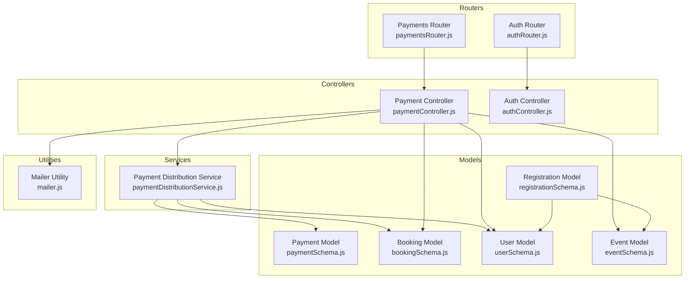
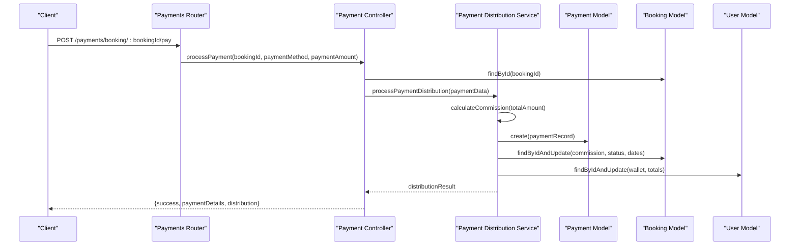
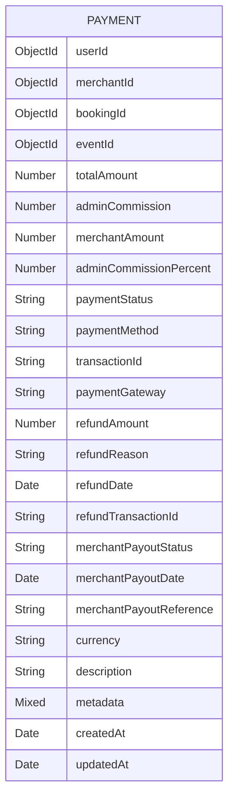
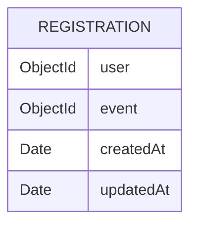
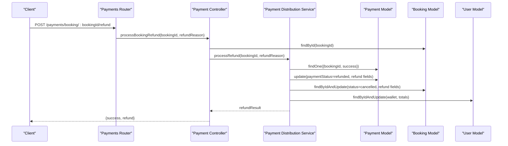
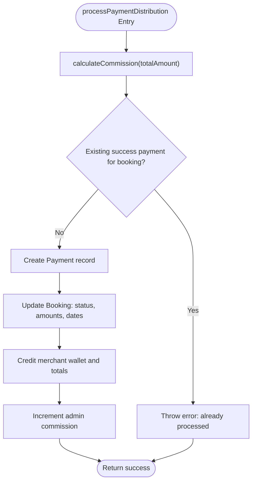
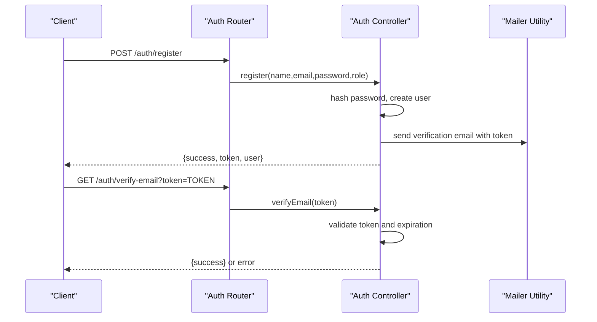
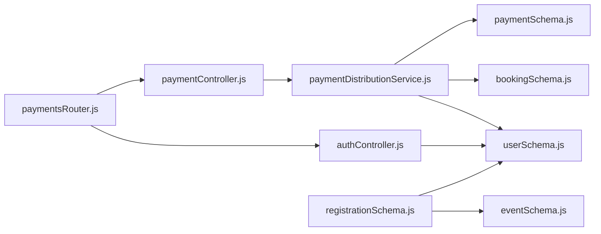

# Payment and Registration Schema

<cite>
**Referenced Files in This Document**
- [paymentSchema.js](file://backend/models/paymentSchema.js)
- [registrationSchema.js](file://backend/models/registrationSchema.js)
- [paymentController.js](file://backend/controller/paymentController.js)
- [authController.js](file://backend/controller/authController.js)
- [paymentsRouter.js](file://backend/router/paymentsRouter.js)
- [authRouter.js](file://backend/router/authRouter.js)
- [paymentDistributionService.js](file://backend/services/paymentDistributionService.js)
- [bookingSchema.js](file://backend/models/bookingSchema.js)
- [userSchema.js](file://backend/models/userSchema.js)
- [eventSchema.js](file://backend/models/eventSchema.js)
- [adminController.js](file://backend/controller/adminController.js)
- [mailer.js](file://backend/util/mailer.js)
</cite>

## Table of Contents
1. [Introduction](#introduction)
2. [Project Structure](#project-structure)
3. [Core Components](#core-components)
4. [Architecture Overview](#architecture-overview)
5. [Detailed Component Analysis](#detailed-component-analysis)
6. [Dependency Analysis](#dependency-analysis)
7. [Performance Considerations](#performance-considerations)
8. [Troubleshooting Guide](#troubleshooting-guide)
9. [Conclusion](#conclusion)
10. [Appendices](#appendices)

## Introduction
This document provides comprehensive documentation for the Payment and Registration schema used in the financial transaction and user registration workflows. It explains payment fields such as transaction identifiers, amounts, payment methods, statuses, and metadata; and registration fields such as user-event relationships. It also covers payment processing integration, refund workflows, merchant earnings computation, and security considerations. Finally, it includes example documents and query patterns for transaction and verification management.

## Project Structure
The payment and registration systems span models, controllers, routers, services, and supporting utilities. Payments are handled via a dedicated controller and service that orchestrate distribution and refunds, while registration is represented by a minimal model linking users to events.

**Diagram sources**
- [paymentSchema.js:1-142](file://backend/models/paymentSchema.js#L1-L142)
- [registrationSchema.js:1-12](file://backend/models/registrationSchema.js#L1-L12)
- [paymentController.js:1-577](file://backend/controller/paymentController.js#L1-L577)
- [authController.js:1-120](file://backend/controller/authController.js#L1-L120)
- [paymentsRouter.js:1-44](file://backend/router/paymentsRouter.js#L1-L44)
- [authRouter.js:1-12](file://backend/router/authRouter.js#L1-L12)
- [paymentDistributionService.js:1-340](file://backend/services/paymentDistributionService.js#L1-L340)
- [bookingSchema.js:1-62](file://backend/models/bookingSchema.js#L1-L62)
- [userSchema.js:1-55](file://backend/models/userSchema.js#L1-L55)
- [eventSchema.js:1-51](file://backend/models/eventSchema.js#L1-L51)
- [mailer.js:1-42](file://backend/util/mailer.js#L1-L42)

**Section sources**
- [paymentSchema.js:1-142](file://backend/models/paymentSchema.js#L1-L142)
- [registrationSchema.js:1-12](file://backend/models/registrationSchema.js#L1-L12)
- [paymentController.js:1-577](file://backend/controller/paymentController.js#L1-L577)
- [authController.js:1-120](file://backend/controller/authController.js#L1-L120)
- [paymentsRouter.js:1-44](file://backend/router/paymentsRouter.js#L1-L44)
- [authRouter.js:1-12](file://backend/router/authRouter.js#L1-L12)
- [paymentDistributionService.js:1-340](file://backend/services/paymentDistributionService.js#L1-L340)
- [bookingSchema.js:1-62](file://backend/models/bookingSchema.js#L1-L62)
- [userSchema.js:1-55](file://backend/models/userSchema.js#L1-L55)
- [eventSchema.js:1-51](file://backend/models/eventSchema.js#L1-L51)
- [mailer.js:1-42](file://backend/util/mailer.js#L1-L42)

## Core Components
- Payment Model: Defines transaction records, amounts, statuses, payment method, gateway, refund fields, payout fields, and metadata.
- Registration Model: Links a user to an event for registration tracking.
- Payment Controller: Orchestrates payment processing, booking retrieval, refund processing, statistics, and merchant earnings.
- Payment Distribution Service: Calculates commission distribution, creates payment records, updates bookings and wallets, and handles refunds.
- Auth Controller: Handles user registration and login; supports JWT issuance.
- Routers: Expose endpoints for payment workflows, booking payment, refunds, admin statistics, and merchant earnings.

Key responsibilities:
- Payment processing integrates with booking and user models to update statuses, wallets, and admin commission.
- Registration model supports administrative listing and deletion alongside events.
- Security is enforced via JWT middleware and role-based access controls for admin-only endpoints.

**Section sources**
- [paymentSchema.js:1-142](file://backend/models/paymentSchema.js#L1-L142)
- [registrationSchema.js:1-12](file://backend/models/registrationSchema.js#L1-L12)
- [paymentController.js:1-577](file://backend/controller/paymentController.js#L1-L577)
- [paymentDistributionService.js:1-340](file://backend/services/paymentDistributionService.js#L1-L340)
- [authController.js:1-120](file://backend/controller/authController.js#L1-L120)
- [paymentsRouter.js:1-44](file://backend/router/paymentsRouter.js#L1-L44)
- [authRouter.js:1-12](file://backend/router/authRouter.js#L1-L12)

## Architecture Overview
The payment workflow follows a service-driven architecture:
- Controllers receive requests and delegate to services.
- Services perform calculations, persist data, and update related models.
- Models define schemas and indexes for efficient querying.
- Routers expose endpoints with authentication and role checks.

**Diagram sources**
- [paymentsRouter.js:27-30](file://backend/router/paymentsRouter.js#L27-L30)
- [paymentController.js:10-141](file://backend/controller/paymentController.js#L10-L141)
- [paymentDistributionService.js:33-159](file://backend/services/paymentDistributionService.js#L33-L159)
- [paymentSchema.js:3-110](file://backend/models/paymentSchema.js#L3-L110)
- [bookingSchema.js:3-59](file://backend/models/bookingSchema.js#L3-L59)
- [userSchema.js:4-54](file://backend/models/userSchema.js#L4-L54)

## Detailed Component Analysis

### Payment Schema
The Payment model captures:
- Identity: userId, merchantId, bookingId, eventId
- Amounts: totalAmount, adminCommission, merchantAmount, adminCommissionPercent
- Status and method: paymentStatus, paymentMethod, transactionId, paymentGateway
- Refund: refundAmount, refundReason, refundDate, refundTransactionId
- Payout: merchantPayoutStatus, merchantPayoutDate, merchantPayoutReference
- Metadata: currency, description, metadata
- Timestamps and indexes for performance

Validation and computed fields:
- Pre-save validation ensures totalAmount equals adminCommission plus merchantAmount within tolerance.
- Virtuals compute calculatedCommissionPercent and merchantPercent.

**Diagram sources**
- [paymentSchema.js:3-110](file://backend/models/paymentSchema.js#L3-L110)

**Section sources**
- [paymentSchema.js:1-142](file://backend/models/paymentSchema.js#L1-L142)

### Registration Schema
The Registration model links a user to an event for registration tracking. It includes timestamps for auditability.

**Diagram sources**
- [registrationSchema.js:3-9](file://backend/models/registrationSchema.js#L3-L9)

**Section sources**
- [registrationSchema.js:1-12](file://backend/models/registrationSchema.js#L1-L12)

### Payment Processing Workflow
Endpoints:
- POST /payments/booking/:bookingId/pay: Processes payment for a booking.
- GET /payments/user/bookings: Lists user bookings with payment eligibility.
- GET /payments/booking/:bookingId: Retrieves booking details for payment.
- POST /payments/booking/:bookingId/refund: Processes refund.
- GET /payments/admin/statistics: Admin payment statistics.
- GET /payments/admin/all: Admin view of all payments.
- GET /payments/merchant/earnings: Merchant earnings summary.
- GET /payments/admin/merchant/:merchantId/earnings: Admin view of merchant earnings.

Processing logic:
- Validates booking ownership and status.
- Determines payment amount from provided value or booking totals.
- Generates transactionId and ticketId.
- Delegates to payment distribution service for commission calculation, payment record creation, booking updates, and wallet adjustments.
- Creates notifications for user and merchant upon successful payment.
- Supports refund with reversal of payment status, booking status, and wallet balances.

**Diagram sources**
- [paymentsRouter.js:32-33](file://backend/router/paymentsRouter.js#L32-L33)
- [paymentController.js:221-315](file://backend/controller/paymentController.js#L221-L315)
- [paymentDistributionService.js:167-251](file://backend/services/paymentDistributionService.js#L167-L251)
- [paymentSchema.js:3-110](file://backend/models/paymentSchema.js#L3-L110)
- [bookingSchema.js:3-59](file://backend/models/bookingSchema.js#L3-L59)
- [userSchema.js:4-54](file://backend/models/userSchema.js#L4-L54)

**Section sources**
- [paymentController.js:10-141](file://backend/controller/paymentController.js#L10-L141)
- [paymentController.js:221-315](file://backend/controller/paymentController.js#L221-L315)
- [paymentsRouter.js:27-41](file://backend/router/paymentsRouter.js#L27-L41)

### Payment Distribution Service
Responsibilities:
- calculateCommission: Computes adminCommission and merchantAmount from totalAmount with rounding to two decimals.
- processPaymentDistribution: Prevents duplicate payments, creates payment record, updates booking, credits merchant wallet, increments admin commission.
- processRefund: Marks payment as refunded, reverses booking status and refund fields, debits merchant wallet and admin commission.
- getPaymentStatistics and getMerchantEarnings: Aggregation-based reporting for admin and merchant views.

**Diagram sources**
- [paymentDistributionService.js:33-159](file://backend/services/paymentDistributionService.js#L33-L159)

**Section sources**
- [paymentDistributionService.js:1-340](file://backend/services/paymentDistributionService.js#L1-L340)

### Registration and Verification Workflows
Current state:
- Registration model exists and is populated in admin endpoints for listing and deletion alongside events.
- Frontend includes a verification page that expects an email verification endpoint; however, no explicit verification route is present in the backend controllers shown.

Recommendations:
- Implement email verification endpoints in the auth controller to issue and validate verification tokens with expiration.
- Store verification tokens and expiration times on the User model.
- On successful verification, mark user as verified and optionally send a welcome notification.

**Diagram sources**
- [authRouter.js:7-9](file://backend/router/authRouter.js#L7-L9)
- [authController.js:11-52](file://backend/controller/authController.js#L11-L52)
- [mailer.js:37-41](file://backend/util/mailer.js#L37-L41)

**Section sources**
- [registrationSchema.js:1-12](file://backend/models/registrationSchema.js#L1-L12)
- [adminController.js:109-116](file://backend/controller/adminController.js#L109-L116)
- [authController.js:11-52](file://backend/controller/authController.js#L11-L52)
- [mailer.js:1-42](file://backend/util/mailer.js#L1-42)

## Dependency Analysis
- Controllers depend on models and services for data access and business logic.
- Payment Controller depends on Payment Distribution Service for commission and wallet updates.
- Payment Distribution Service depends on Payment, Booking, and User models.
- Routers enforce authentication and roles before invoking controllers.
- Registration model is referenced by admin controller for listing and cleanup.

**Diagram sources**
- [paymentsRouter.js:1-44](file://backend/router/paymentsRouter.js#L1-L44)
- [authRouter.js:1-12](file://backend/router/authRouter.js#L1-L12)
- [paymentController.js:1-577](file://backend/controller/paymentController.js#L1-L577)
- [paymentDistributionService.js:1-340](file://backend/services/paymentDistributionService.js#L1-L340)
- [paymentSchema.js:1-142](file://backend/models/paymentSchema.js#L1-L142)
- [bookingSchema.js:1-62](file://backend/models/bookingSchema.js#L1-L62)
- [userSchema.js:1-55](file://backend/models/userSchema.js#L1-L55)
- [registrationSchema.js:1-12](file://backend/models/registrationSchema.js#L1-L12)
- [eventSchema.js:1-51](file://backend/models/eventSchema.js#L1-L51)

**Section sources**
- [paymentsRouter.js:1-44](file://backend/router/paymentsRouter.js#L1-L44)
- [authRouter.js:1-12](file://backend/router/authRouter.js#L1-L12)
- [paymentController.js:1-577](file://backend/controller/paymentController.js#L1-L577)
- [paymentDistributionService.js:1-340](file://backend/services/paymentDistributionService.js#L1-L340)
- [paymentSchema.js:1-142](file://backend/models/paymentSchema.js#L1-L142)
- [bookingSchema.js:1-62](file://backend/models/bookingSchema.js#L1-L62)
- [userSchema.js:1-55](file://backend/models/userSchema.js#L1-L55)
- [registrationSchema.js:1-12](file://backend/models/registrationSchema.js#L1-L12)
- [eventSchema.js:1-51](file://backend/models/eventSchema.js#L1-L51)

## Performance Considerations
- Indexes on Payment model (userId, merchantId, bookingId, transactionId, paymentStatus) support frequent queries by these fields.
- Aggregation pipelines in payment statistics and merchant earnings rely on filtered grouping; ensure appropriate indexes exist for date ranges and status filtering.
- Pre-save validation prevents inconsistent amounts but adds computational overhead; keep tolerance minimal to avoid masking real errors.
- Populate-heavy queries in admin endpoints should be paginated and limited to reduce memory usage.

[No sources needed since this section provides general guidance]

## Troubleshooting Guide
Common issues and resolutions:
- Payment amount mismatch: The pre-save hook validates that adminCommission + merchantAmount equals totalAmount within tolerance. Ensure client-provided values align with commission calculation.
- Duplicate payment attempts: processPaymentDistribution checks for existing successful payments per booking and throws an error if found.
- Unauthorized access: Admin-only endpoints require ensureRole middleware; verify JWT role claims.
- Refund prerequisites: Refunds require a prior paid booking; otherwise, the controller returns an error.
- Email verification: If verification fails, confirm the presence of a verification endpoint and proper token handling.

**Section sources**
- [paymentSchema.js:129-140](file://backend/models/paymentSchema.js#L129-L140)
- [paymentDistributionService.js:58-66](file://backend/services/paymentDistributionService.js#L58-L66)
- [paymentController.js:318-399](file://backend/controller/paymentController.js#L318-L399)
- [paymentController.js:221-315](file://backend/controller/paymentController.js#L221-L315)

## Conclusion
The Payment and Registration schema provides a robust foundation for financial transactions and event registration. Payments are securely processed with commission distribution, refund handling, and comprehensive reporting. Registration is modeled to track user-event relationships, with room for enhancement around email verification. The modular design with controllers, services, and models enables maintainable extensions and improved security through middleware and role checks.

[No sources needed since this section summarizes without analyzing specific files]

## Appendices

### Example Documents
- Payment document fields: transactionId, totalAmount, adminCommission, merchantAmount, paymentStatus, paymentMethod, paymentGateway, refund fields, payout fields, currency, description, metadata.
- Registration document fields: user, event, timestamps.

**Section sources**
- [paymentSchema.js:3-110](file://backend/models/paymentSchema.js#L3-L110)
- [registrationSchema.js:3-9](file://backend/models/registrationSchema.js#L3-L9)

### Query Patterns
- Admin payment statistics: Aggregate successful and refunded payments, group by status, and compute totals and averages.
- Merchant earnings: Match payments by merchantId and paymentStatus, group for totals and averages, and include recent transactions with populated booking and event details.
- Listing registrations: Populate user and event fields for admin listing and cleanup operations.

**Section sources**
- [paymentController.js:318-399](file://backend/controller/paymentController.js#L318-L399)
- [paymentController.js:401-517](file://backend/controller/paymentController.js#L401-L517)
- [adminController.js:109-116](file://backend/controller/adminController.js#L109-L116)