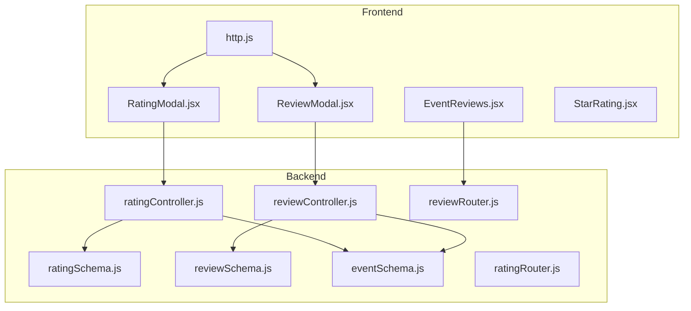
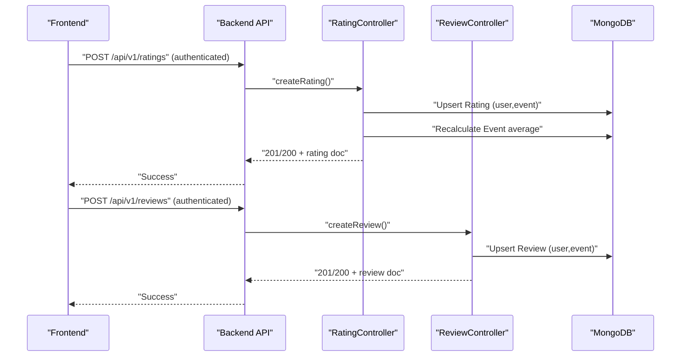
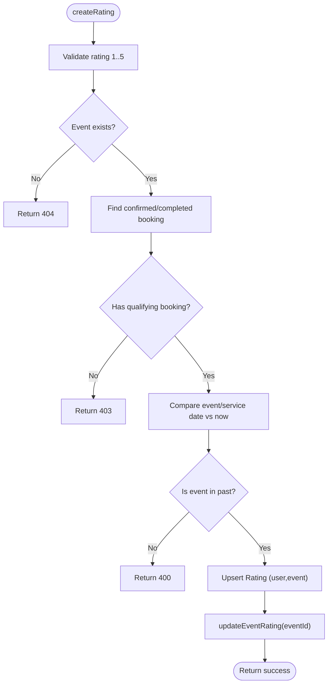
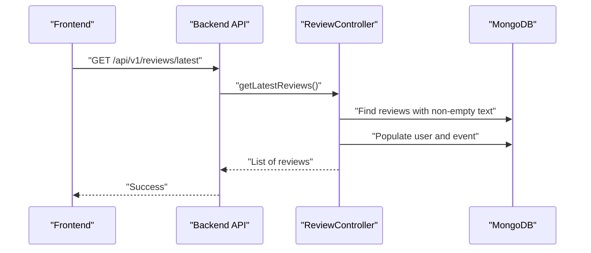
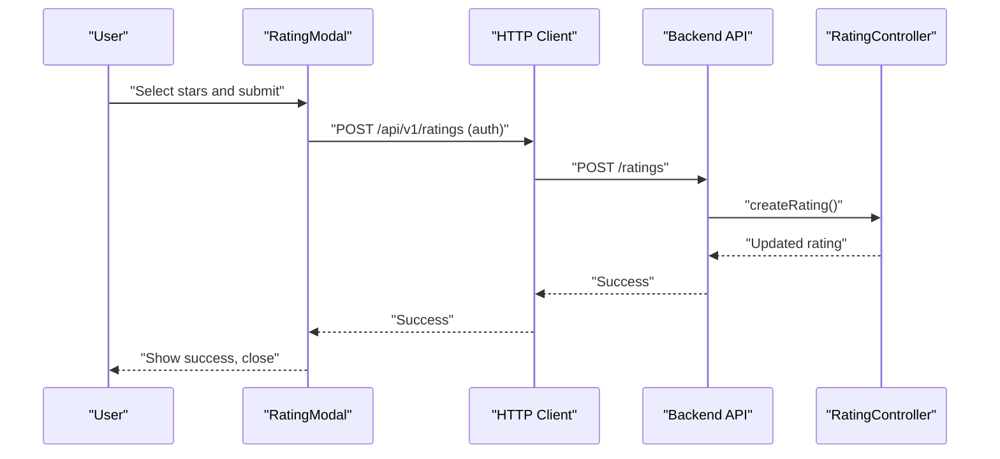
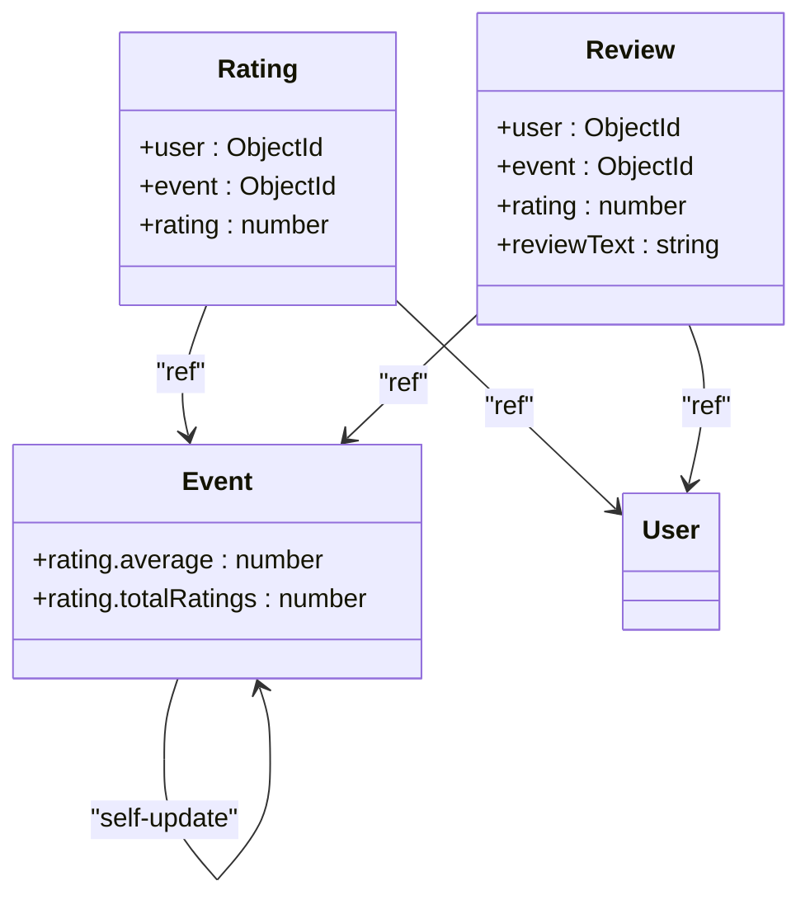

# Review and Rating Schema

<cite>
**Referenced Files in This Document**
- [ratingSchema.js](file://backend/models/ratingSchema.js)
- [reviewSchema.js](file://backend/models/reviewSchema.js)
- [eventSchema.js](file://backend/models/eventSchema.js)
- [ratingController.js](file://backend/controller/ratingController.js)
- [reviewController.js](file://backend/controller/reviewController.js)
- [ratingRouter.js](file://backend/router/ratingRouter.js)
- [reviewRouter.js](file://backend/router/reviewRouter.js)
- [RatingModal.jsx](file://frontend/src/components/RatingModal.jsx)
- [ReviewModal.jsx](file://frontend/src/components/ReviewModal.jsx)
- [EventReviews.jsx](file://frontend/src/components/EventReviews.jsx)
- [StarRating.jsx](file://frontend/src/components/StarRating.jsx)
- [http.js](file://frontend/src/lib/http.js)
- [test-completed-event-rating.js](file://backend/test-completed-event-rating.js)
- [test-rating-review-follow-system.js](file://backend/test-rating-review-follow-system.js)
</cite>

## Table of Contents
1. [Introduction](#introduction)
2. [Project Structure](#project-structure)
3. [Core Components](#core-components)
4. [Architecture Overview](#architecture-overview)
5. [Detailed Component Analysis](#detailed-component-analysis)
6. [Dependency Analysis](#dependency-analysis)
7. [Performance Considerations](#performance-considerations)
8. [Troubleshooting Guide](#troubleshooting-guide)
9. [Conclusion](#conclusion)
10. [Appendices](#appendices)

## Introduction
This document describes the Review and Rating schema and associated systems for collecting and displaying user feedback on events. It covers:
- Data models for reviews and ratings
- Validation rules and uniqueness constraints
- Rating calculation and aggregation
- Moderation and display patterns
- Frontend integration and user flows
- Example documents and query patterns

## Project Structure
The feedback system spans backend models, controllers, routers, and frontend components:
- Backend models define the schema for reviews and ratings and maintain a denormalized event rating.
- Controllers enforce business rules (booking ownership, event completion, uniqueness) and compute averages.
- Routers expose REST endpoints for authenticated and public operations.
- Frontend components provide modal forms and display lists for reviews and ratings.

**Diagram sources**
- [ratingSchema.js:1-28](file://backend/models/ratingSchema.js#L1-L28)
- [reviewSchema.js:1-17](file://backend/models/reviewSchema.js#L1-L17)
- [eventSchema.js:1-51](file://backend/models/eventSchema.js#L1-L51)
- [ratingController.js:1-161](file://backend/controller/ratingController.js#L1-L161)
- [reviewController.js:1-195](file://backend/controller/reviewController.js#L1-L195)
- [ratingRouter.js:1-16](file://backend/router/ratingRouter.js#L1-L16)
- [reviewRouter.js:1-19](file://backend/router/reviewRouter.js#L1-L19)
- [RatingModal.jsx:1-125](file://frontend/src/components/RatingModal.jsx#L1-L125)
- [ReviewModal.jsx:1-170](file://frontend/src/components/ReviewModal.jsx#L1-L170)
- [EventReviews.jsx:1-145](file://frontend/src/components/EventReviews.jsx#L1-L145)
- [StarRating.jsx:1-102](file://frontend/src/components/StarRating.jsx#L1-L102)
- [http.js:1-5](file://frontend/src/lib/http.js#L1-L5)

**Section sources**
- [ratingSchema.js:1-28](file://backend/models/ratingSchema.js#L1-L28)
- [reviewSchema.js:1-17](file://backend/models/reviewSchema.js#L1-L17)
- [eventSchema.js:1-51](file://backend/models/eventSchema.js#L1-L51)
- [ratingController.js:1-161](file://backend/controller/ratingController.js#L1-L161)
- [reviewController.js:1-195](file://backend/controller/reviewController.js#L1-L195)
- [ratingRouter.js:1-16](file://backend/router/ratingRouter.js#L1-L16)
- [reviewRouter.js:1-19](file://backend/router/reviewRouter.js#L1-L19)
- [RatingModal.jsx:1-125](file://frontend/src/components/RatingModal.jsx#L1-L125)
- [ReviewModal.jsx:1-170](file://frontend/src/components/ReviewModal.jsx#L1-L170)
- [EventReviews.jsx:1-145](file://frontend/src/components/EventReviews.jsx#L1-L145)
- [StarRating.jsx:1-102](file://frontend/src/components/StarRating.jsx#L1-L102)
- [http.js:1-5](file://frontend/src/lib/http.js#L1-L5)

## Core Components
- Rating model
  - Fields: user (User ObjectId), event (Event ObjectId), rating (Number, 1–5)
  - Unique constraint: user+event combination enforced via compound index
  - Timestamps enabled
- Review model
  - Fields: user (User ObjectId), event (Event ObjectId), rating (Number, 1–5), reviewText (String, optional)
  - Unique constraint: user+event combination enforced via compound index
  - Timestamps enabled
- Event model
  - Denormalized rating: average (Number), totalRatings (Number)
  - Separate from the separate Rating/Review collections for fast display

Validation and uniqueness:
- Backend controllers validate rating range and uniqueness per user-event pair.
- MongoDB indexes prevent duplicate user-event ratings and reviews.

Display patterns:
- Public latest reviews endpoint filters non-empty reviewText and limits results.
- Event-specific endpoints support pagination and sorting by recency.

**Section sources**
- [ratingSchema.js:1-28](file://backend/models/ratingSchema.js#L1-L28)
- [reviewSchema.js:1-17](file://backend/models/reviewSchema.js#L1-L17)
- [eventSchema.js:1-51](file://backend/models/eventSchema.js#L1-L51)
- [reviewController.js:183-195](file://backend/controller/reviewController.js#L183-L195)

## Architecture Overview
The system integrates frontend modals with backend APIs and models. Ratings and reviews are decoupled collections, while the event aggregates an average for efficient rendering.

**Diagram sources**
- [ratingController.js:6-89](file://backend/controller/ratingController.js#L6-L89)
- [reviewController.js:6-92](file://backend/controller/reviewController.js#L6-L92)
- [ratingRouter.js:12](file://backend/router/ratingRouter.js#L12)
- [reviewRouter.js:14](file://backend/router/reviewRouter.js#L14)
- [http.js:1](file://frontend/src/lib/http.js#L1)

## Detailed Component Analysis

### Rating Model and Controller
- Schema enforces:
  - Required user and event references
  - Rating numeric bounds 1–5
  - Unique user-event pairing
- Controller logic:
  - Validates rating range
  - Confirms event existence
  - Verifies user booking status and completion
  - Upserts rating and recalculates event average
- Aggregation:
  - Computes average across all ratings for an event
  - Rounds to one decimal place
  - Updates denormalized fields on the event

**Diagram sources**
- [ratingController.js:6-89](file://backend/controller/ratingController.js#L6-L89)
- [ratingController.js:137-161](file://backend/controller/ratingController.js#L137-L161)

**Section sources**
- [ratingSchema.js:1-28](file://backend/models/ratingSchema.js#L1-L28)
- [ratingController.js:6-89](file://backend/controller/ratingController.js#L6-L89)
- [ratingController.js:137-161](file://backend/controller/ratingController.js#L137-L161)

### Review Model and Controller
- Schema enforces:
  - Required user and event references
  - Rating numeric bounds 1–5
  - Optional reviewText
  - Unique user-event pairing
- Controller logic:
  - Validates rating range
  - Confirms event existence
  - Verifies user booking status and completion
  - Upserts review (including optional text)
- Public latest reviews:
  - Filters reviews with non-empty text
  - Populates user and event metadata
  - Limits to recent entries

**Diagram sources**
- [reviewController.js:183-195](file://backend/controller/reviewController.js#L183-L195)

**Section sources**
- [reviewSchema.js:1-17](file://backend/models/reviewSchema.js#L1-L17)
- [reviewController.js:6-92](file://backend/controller/reviewController.js#L6-L92)
- [reviewController.js:183-195](file://backend/controller/reviewController.js#L183-L195)

### Frontend Integration
- RatingModal
  - Presents star selection and submits rating via authenticated POST to ratings endpoint
  - On success, triggers callback and closes modal
- ReviewModal
  - Collects rating and reviewText, validates presence, and posts to reviews endpoint
  - On success, triggers callback and clears form
- EventReviews
  - Loads paginated reviews for an event, formats dates, and renders user avatars and star ratings
- StarRating
  - Renders static or interactive star ratings with optional total count display

**Diagram sources**
- [RatingModal.jsx:14-47](file://frontend/src/components/RatingModal.jsx#L14-L47)
- [ratingRouter.js:12](file://backend/router/ratingRouter.js#L12)
- [ratingController.js:6-89](file://backend/controller/ratingController.js#L6-L89)
- [http.js:1](file://frontend/src/lib/http.js#L1)

**Section sources**
- [RatingModal.jsx:1-125](file://frontend/src/components/RatingModal.jsx#L1-L125)
- [ReviewModal.jsx:1-170](file://frontend/src/components/ReviewModal.jsx#L1-L170)
- [EventReviews.jsx:1-145](file://frontend/src/components/EventReviews.jsx#L1-L145)
- [StarRating.jsx:1-102](file://frontend/src/components/StarRating.jsx#L1-L102)
- [http.js:1-5](file://frontend/src/lib/http.js#L1-L5)

## Dependency Analysis
- Models
  - Rating and Review both reference User and Event
  - Event maintains denormalized rating fields
- Controllers
  - Rating controller updates event rating after upsert
  - Review controller does not modify event rating (separate from rating collection)
- Routers
  - Expose authenticated endpoints for creation and retrieval
  - Public endpoint for latest reviews
- Frontend
  - Uses shared API base and auth headers
  - Components depend on StarRating for rendering

**Diagram sources**
- [ratingSchema.js:1-28](file://backend/models/ratingSchema.js#L1-L28)
- [reviewSchema.js:1-17](file://backend/models/reviewSchema.js#L1-L17)
- [eventSchema.js:1-51](file://backend/models/eventSchema.js#L1-L51)

**Section sources**
- [ratingSchema.js:1-28](file://backend/models/ratingSchema.js#L1-L28)
- [reviewSchema.js:1-17](file://backend/models/reviewSchema.js#L1-L17)
- [eventSchema.js:1-51](file://backend/models/eventSchema.js#L1-L51)

## Performance Considerations
- Indexing
  - Compound unique indexes on (user,event) for Rating and Review prevent duplicates and speed lookups
- Aggregation
  - Event average recomputation is O(n) per update; consider caching or batch updates for high volume
- Pagination
  - Reviews endpoint supports pagination to limit payload sizes
- Rendering
  - Public latest reviews endpoint filters non-empty texts and limits results to reduce noise

[No sources needed since this section provides general guidance]

## Troubleshooting Guide
Common issues and resolutions:
- Cannot rate an event
  - Ensure the user has a confirmed or completed booking for the event
  - Ensure the event date has passed
  - Verify rating is within 1–5
- Duplicate rating/review errors
  - The system prevents multiple ratings/reviews per user-event; updates are supported
- Event average not updating
  - Confirm the rating controller’s recalculation runs after upsert
- Frontend submission failures
  - Check authentication headers and API base URL
  - Inspect toast messages and console logs

**Section sources**
- [ratingController.js:12-50](file://backend/controller/ratingController.js#L12-L50)
- [reviewController.js:11-50](file://backend/controller/reviewController.js#L11-L50)
- [http.js:1-5](file://frontend/src/lib/http.js#L1-L5)

## Conclusion
The Review and Rating schema provides a robust foundation for user-generated feedback:
- Clear validation and uniqueness constraints
- Efficient event-level aggregation for display
- Decoupled rating and review collections with flexible moderation via reviewText filtering
- Well-defined frontend flows for rating and reviewing completed events

[No sources needed since this section summarizes without analyzing specific files]

## Appendices

### Data Model Definitions
- Rating
  - user: ObjectId (User)
  - event: ObjectId (Event)
  - rating: Number (1–5)
  - timestamps: Date
- Review
  - user: ObjectId (User)
  - event: ObjectId (Event)
  - rating: Number (1–5)
  - reviewText: String
  - timestamps: Date
- Event
  - rating.average: Number
  - rating.totalRatings: Number

**Section sources**
- [ratingSchema.js:1-28](file://backend/models/ratingSchema.js#L1-L28)
- [reviewSchema.js:1-17](file://backend/models/reviewSchema.js#L1-L17)
- [eventSchema.js:1-51](file://backend/models/eventSchema.js#L1-L51)

### Example Documents
- Rating document
  - Fields: user, event, rating, timestamps
  - Example path: [ratingController.js:66-71](file://backend/controller/ratingController.js#L66-L71)
- Review document
  - Fields: user, event, rating, reviewText, timestamps
  - Example path: [reviewController.js:71-76](file://backend/controller/reviewController.js#L71-L76)
- Event with aggregated rating
  - Fields: rating.average, rating.totalRatings
  - Example path: [ratingController.js:153-156](file://backend/controller/ratingController.js#L153-L156)

**Section sources**
- [ratingController.js:66-71](file://backend/controller/ratingController.js#L66-L71)
- [reviewController.js:71-76](file://backend/controller/reviewController.js#L71-L76)
- [ratingController.js:153-156](file://backend/controller/ratingController.js#L153-L156)

### Query Patterns
- Get ratings for an event
  - Endpoint: GET /ratings/event/:eventId
  - Behavior: Returns populated ratings sorted by recency
  - Example path: [ratingController.js:92-112](file://backend/controller/ratingController.js#L92-L112)
- Get user’s ratings
  - Endpoint: GET /ratings/my-ratings (authenticated)
  - Behavior: Returns ratings with event metadata
  - Example path: [ratingController.js:115-135](file://backend/controller/ratingController.js#L115-L135)
- Get reviews for an event (paginated)
  - Endpoint: GET /reviews/event/:eventId?page=&limit=
  - Behavior: Paginated, sorted by recency, populated user
  - Example path: [reviewController.js:95-123](file://backend/controller/reviewController.js#L95-L123)
- Get user’s reviews
  - Endpoint: GET /reviews/my-reviews (authenticated)
  - Behavior: Returns reviews with event metadata
  - Example path: [reviewController.js:126-146](file://backend/controller/reviewController.js#L126-L146)
- Get latest reviews (public)
  - Endpoint: GET /reviews/latest
  - Behavior: Non-empty reviewText, populated user and event, limited results
  - Example path: [reviewController.js:183-195](file://backend/controller/reviewController.js#L183-L195)

**Section sources**
- [ratingController.js:92-135](file://backend/controller/ratingController.js#L92-L135)
- [reviewController.js:95-146](file://backend/controller/reviewController.js#L95-L146)
- [reviewController.js:183-195](file://backend/controller/reviewController.js#L183-L195)

### Example Workflows
- Submitting a rating after an event completes
  - Frontend: RatingModal → POST /ratings
  - Backend: createRating → upsert Rating → updateEventRating
  - Example path: [RatingModal.jsx:22-37](file://frontend/src/components/RatingModal.jsx#L22-L37), [ratingController.js:6-89](file://backend/controller/ratingController.js#L6-L89)
- Writing a review after an event completes
  - Frontend: ReviewModal → POST /reviews
  - Backend: createReview → upsert Review
  - Example path: [ReviewModal.jsx:45-61](file://frontend/src/components/ReviewModal.jsx#L45-L61), [reviewController.js:6-92](file://backend/controller/reviewController.js#L6-L92)

**Section sources**
- [RatingModal.jsx:22-37](file://frontend/src/components/RatingModal.jsx#L22-L37)
- [ReviewModal.jsx:45-61](file://frontend/src/components/ReviewModal.jsx#L45-L61)
- [ratingController.js:6-89](file://backend/controller/ratingController.js#L6-L89)
- [reviewController.js:6-92](file://backend/controller/reviewController.js#L6-L92)

### Tests and Scripts
- Completed event rating and review test
  - Demonstrates rating and review creation, retrieval, and update flows
  - Example path: [test-completed-event-rating.js:64-150](file://backend/test-completed-event-rating.js#L64-L150)
- Rating, review, and follow system test
  - Exercises rating, review, and follow endpoints
  - Example path: [test-rating-review-follow-system.js:56-177](file://backend/test-rating-review-follow-system.js#L56-L177)

**Section sources**
- [test-completed-event-rating.js:64-150](file://backend/test-completed-event-rating.js#L64-L150)
- [test-rating-review-follow-system.js:56-177](file://backend/test-rating-review-follow-system.js#L56-L177)