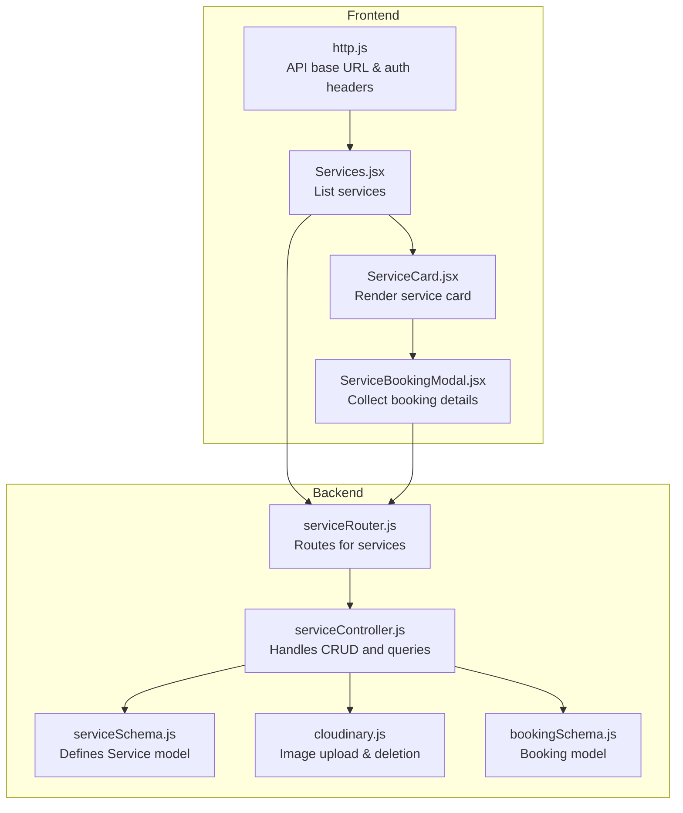
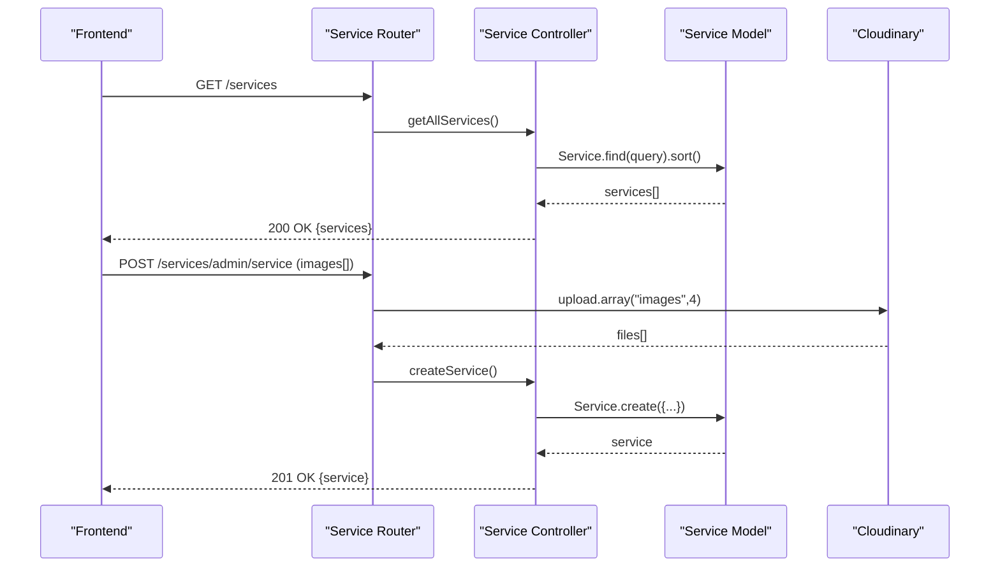
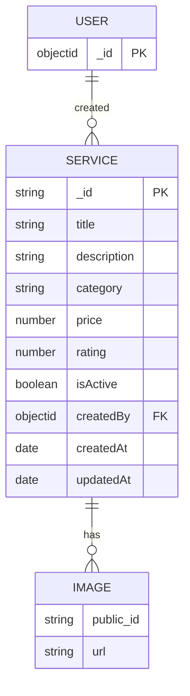
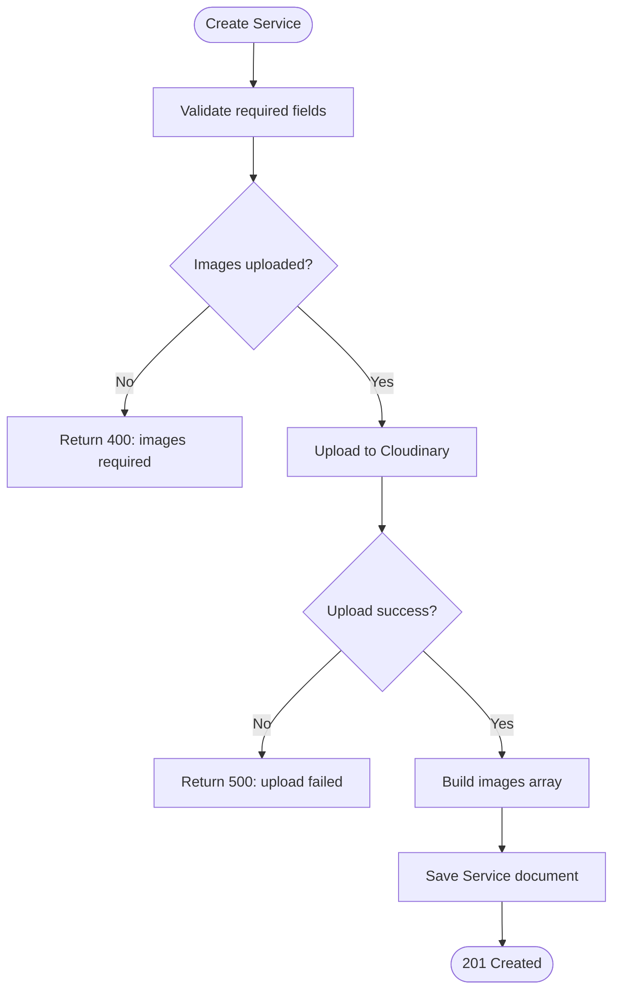
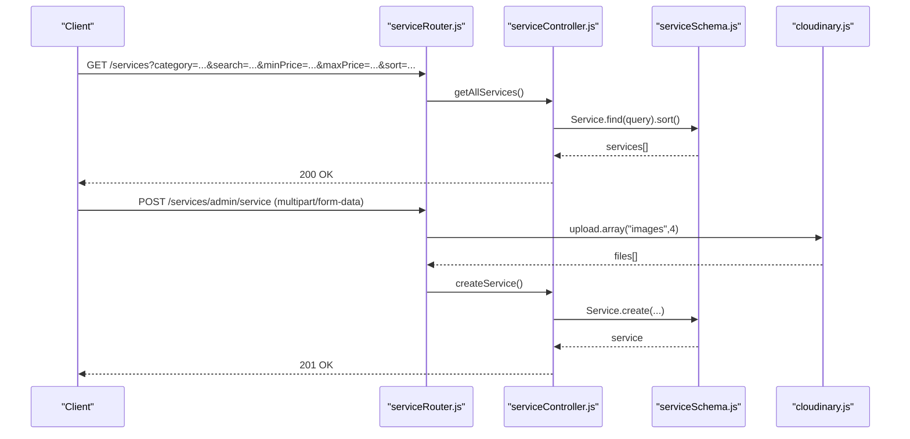
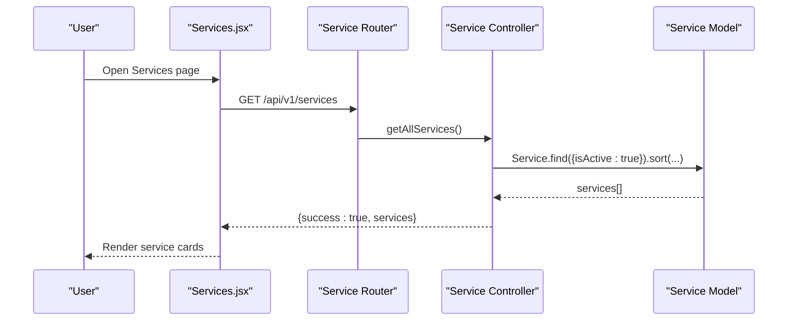
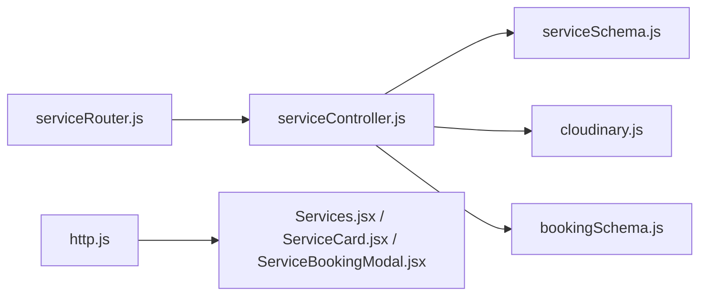

# Service Schema

<cite>
**Referenced Files in This Document**
- [serviceSchema.js](file://backend/models/serviceSchema.js)
- [serviceController.js](file://backend/controller/serviceController.js)
- [serviceRouter.js](file://backend/router/serviceRouter.js)
- [cloudinary.js](file://backend/util/cloudinary.js)
- [bookingSchema.js](file://backend/models/bookingSchema.js)
- [http.js](file://frontend/src/lib/http.js)
- [Services.jsx](file://frontend/src/components/Services.jsx)
- [ServiceCard.jsx](file://frontend/src/components/ServiceCard.jsx)
- [ServiceBookingModal.jsx](file://frontend/src/components/ServiceBookingModal.jsx)
</cite>

## Table of Contents
1. [Introduction](#introduction)
2. [Project Structure](#project-structure)
3. [Core Components](#core-components)
4. [Architecture Overview](#architecture-overview)
5. [Detailed Component Analysis](#detailed-component-analysis)
6. [Dependency Analysis](#dependency-analysis)
7. [Performance Considerations](#performance-considerations)
8. [Troubleshooting Guide](#troubleshooting-guide)
9. [Conclusion](#conclusion)
10. [Appendices](#appendices)

## Introduction
This document describes the Service schema used in a service-based booking system. It covers the schema definition, validation rules, categorization, pricing, ratings, media handling, and merchant association. It also explains service discovery patterns via public and admin APIs, and outlines how services integrate with the booking flow. The goal is to provide a clear, practical guide for developers and stakeholders building or maintaining service listings and bookings.

## Project Structure
The service domain spans backend schema and controllers, routing, and frontend presentation and booking modals. The backend uses MongoDB/Mongoose for persistence and integrates Cloudinary for image storage. Frontend components render services and collect booking requests.

**Diagram sources**
- [serviceSchema.js:14-82](file://backend/models/serviceSchema.js#L14-L82)
- [serviceController.js:1-323](file://backend/controller/serviceController.js#L1-L323)
- [serviceRouter.js:1-49](file://backend/router/serviceRouter.js#L1-L49)
- [cloudinary.js:1-112](file://backend/util/cloudinary.js#L1-L112)
- [bookingSchema.js:3-53](file://backend/models/bookingSchema.js#L3-L53)
- [http.js:1-5](file://frontend/src/lib/http.js#L1-L5)
- [Services.jsx:1-104](file://frontend/src/components/Services.jsx#L1-L104)
- [ServiceCard.jsx:1-90](file://frontend/src/components/ServiceCard.jsx#L1-L90)
- [ServiceBookingModal.jsx:1-440](file://frontend/src/components/ServiceBookingModal.jsx#L1-L440)

**Section sources**
- [serviceSchema.js:14-82](file://backend/models/serviceSchema.js#L14-L82)
- [serviceController.js:74-118](file://backend/controller/serviceController.js#L74-L118)
- [serviceRouter.js:17-46](file://backend/router/serviceRouter.js#L17-L46)
- [cloudinary.js:35-58](file://backend/util/cloudinary.js#L35-L58)
- [http.js:1-5](file://frontend/src/lib/http.js#L1-L5)
- [Services.jsx:16-27](file://frontend/src/components/Services.jsx#L16-L27)
- [ServiceCard.jsx:1-90](file://frontend/src/components/ServiceCard.jsx#L1-L90)
- [ServiceBookingModal.jsx:134-190](file://frontend/src/components/ServiceBookingModal.jsx#L134-L190)

## Core Components
- Service Model: Defines fields, validation rules, enums, and text search indexing.
- Service Controller: Implements public and admin endpoints for listing, filtering, retrieving, updating, and deleting services.
- Service Router: Exposes REST endpoints with authentication and role checks; integrates image upload middleware.
- Cloudinary Utility: Handles image uploads, deletions, and validations.
- Booking Model: Captures booking metadata linked to services.
- Frontend Components: Render services and collect booking inputs.

Key responsibilities:
- Validation: Enforced at schema level and controller level for required fields and image counts.
- Discovery: Public listing with category, search, price range, and sorting; admin listing includes inactive services.
- Media: Images stored via Cloudinary; updates/deletes manage remote assets.
- Merchant association: Created-by relationship to a user who can be an admin.

**Section sources**
- [serviceSchema.js:14-82](file://backend/models/serviceSchema.js#L14-L82)
- [serviceController.js:4-72](file://backend/controller/serviceController.js#L4-L72)
- [serviceController.js:74-118](file://backend/controller/serviceController.js#L74-L118)
- [serviceController.js:147-232](file://backend/controller/serviceController.js#L147-L232)
- [serviceController.js:234-266](file://backend/controller/serviceController.js#L234-L266)
- [serviceController.js:268-298](file://backend/controller/serviceController.js#L268-L298)
- [serviceController.js:300-322](file://backend/controller/serviceController.js#L300-L322)
- [serviceRouter.js:17-46](file://backend/router/serviceRouter.js#L17-L46)
- [cloudinary.js:35-58](file://backend/util/cloudinary.js#L35-L58)
- [bookingSchema.js:3-53](file://backend/models/bookingSchema.js#L3-L53)

## Architecture Overview
The service system follows a layered architecture:
- Presentation Layer (Frontend): Renders services and collects booking requests.
- API Layer (Backend): Routes and controllers expose service endpoints.
- Persistence Layer (MongoDB): Service and Booking collections.
- Media Layer (Cloudinary): Stores and manages images.

**Diagram sources**
- [serviceRouter.js:17-29](file://backend/router/serviceRouter.js#L17-L29)
- [serviceController.js:74-118](file://backend/controller/serviceController.js#L74-L118)
- [serviceController.js:4-72](file://backend/controller/serviceController.js#L4-L72)
- [serviceSchema.js:14-82](file://backend/models/serviceSchema.js#L14-L82)
- [cloudinary.js:35-58](file://backend/util/cloudinary.js#L35-L58)

## Detailed Component Analysis

### Service Schema
The Service schema defines the canonical structure for services:
- Identity and metadata: title, description, category, rating, timestamps.
- Pricing: price with non-negative constraint.
- Availability: isActive flag with default true.
- Media: images array with embedded schema and validation for 1–4 images.
- Merchant association: createdBy references a User.

Validation highlights:
- Title and description length constraints.
- Category enum restricts values to predefined categories.
- Price minimum 0.
- Rating min 0 and max 5.
- Images validator enforces count bounds.

Text search index supports full-text search on title, description, and category.

**Diagram sources**
- [serviceSchema.js:3-12](file://backend/models/serviceSchema.js#L3-L12)
- [serviceSchema.js:14-82](file://backend/models/serviceSchema.js#L14-L82)

**Section sources**
- [serviceSchema.js:14-82](file://backend/models/serviceSchema.js#L14-L82)

### Service Controller: Public and Admin Workflows
Public endpoints:
- List services with optional filters: category, search term, min/max price, sort order.
- Retrieve a single service by ID.
- List services by category.

Admin endpoints:
- Create service with image upload (1–4 images).
- Update service: edit fields, replace images, maintain existing images, enforce image limits.
- Delete service: remove images from Cloudinary, then delete document.
- Admin-only listing of all services (including inactive).

**Diagram sources**
- [serviceController.js:4-72](file://backend/controller/serviceController.js#L4-L72)
- [cloudinary.js:35-58](file://backend/util/cloudinary.js#L35-L58)

**Section sources**
- [serviceController.js:74-118](file://backend/controller/serviceController.js#L74-L118)
- [serviceController.js:147-232](file://backend/controller/serviceController.js#L147-L232)
- [serviceController.js:234-266](file://backend/controller/serviceController.js#L234-L266)
- [serviceController.js:268-298](file://backend/controller/serviceController.js#L268-L298)
- [serviceController.js:300-322](file://backend/controller/serviceController.js#L300-L322)

### Service Router: Endpoints and Middleware
- Public routes:
  - GET /services
  - GET /services/category/:category
  - GET /services/:id
- Admin routes (auth + role):
  - POST /services/admin/service (upload.array("images", 4))
  - GET /services/admin/all
  - PUT /services/admin/service/:id (upload.array("images", 4))
  - DELETE /services/admin/service/:id

**Diagram sources**
- [serviceRouter.js:17-46](file://backend/router/serviceRouter.js#L17-L46)
- [serviceController.js:74-118](file://backend/controller/serviceController.js#L74-L118)
- [serviceController.js:4-72](file://backend/controller/serviceController.js#L4-L72)
- [serviceSchema.js:14-82](file://backend/models/serviceSchema.js#L14-L82)
- [cloudinary.js:35-58](file://backend/util/cloudinary.js#L35-L58)

**Section sources**
- [serviceRouter.js:17-46](file://backend/router/serviceRouter.js#L17-L46)

### Frontend Integration: Service Discovery and Booking
- Service Listing: Fetches services from the backend and renders cards with images, category badge, rating, and price.
- Service Card: Displays service details and links to the service details page.
- Booking Modal: Collects booking preferences (date, guests, notes), applies coupons, and submits a booking request to the backend.

**Diagram sources**
- [Services.jsx:16-27](file://frontend/src/components/Services.jsx#L16-L27)
- [serviceRouter.js:17-18](file://backend/router/serviceRouter.js#L17-L18)
- [serviceController.js:74-118](file://backend/controller/serviceController.js#L74-L118)
- [serviceSchema.js:14-82](file://backend/models/serviceSchema.js#L14-L82)

**Section sources**
- [Services.jsx:16-27](file://frontend/src/components/Services.jsx#L16-L27)
- [ServiceCard.jsx:1-90](file://frontend/src/components/ServiceCard.jsx#L1-90)
- [ServiceBookingModal.jsx:134-190](file://frontend/src/components/ServiceBookingModal.jsx#L134-L190)
- [http.js:1-5](file://frontend/src/lib/http.js#L1-L5)

## Dependency Analysis
- Controllers depend on the Service model and Cloudinary utility.
- Router depends on controllers and middleware for auth and role checks.
- Frontend components depend on the API base URL and auth headers.
- Booking model captures service metadata for booking records.

**Diagram sources**
- [serviceRouter.js:1-49](file://backend/router/serviceRouter.js#L1-L49)
- [serviceController.js:1-323](file://backend/controller/serviceController.js#L1-L323)
- [serviceSchema.js:14-82](file://backend/models/serviceSchema.js#L14-L82)
- [cloudinary.js:1-112](file://backend/util/cloudinary.js#L1-L112)
- [bookingSchema.js:3-53](file://backend/models/bookingSchema.js#L3-L53)
- [http.js:1-5](file://frontend/src/lib/http.js#L1-L5)
- [Services.jsx:1-104](file://frontend/src/components/Services.jsx#L1-L104)
- [ServiceCard.jsx:1-90](file://frontend/src/components/ServiceCard.jsx#L1-L90)
- [ServiceBookingModal.jsx:1-440](file://frontend/src/components/ServiceBookingModal.jsx#L1-L440)

**Section sources**
- [serviceController.js:1-323](file://backend/controller/serviceController.js#L1-L323)
- [serviceRouter.js:1-49](file://backend/router/serviceRouter.js#L1-L49)
- [cloudinary.js:1-112](file://backend/util/cloudinary.js#L1-L112)
- [bookingSchema.js:3-53](file://backend/models/bookingSchema.js#L3-L53)
- [http.js:1-5](file://frontend/src/lib/http.js#L1-L5)
- [Services.jsx:1-104](file://frontend/src/components/Services.jsx#L1-L104)
- [ServiceCard.jsx:1-90](file://frontend/src/components/ServiceCard.jsx#L1-L90)
- [ServiceBookingModal.jsx:1-440](file://frontend/src/components/ServiceBookingModal.jsx#L1-L440)

## Performance Considerations
- Text search index on title, description, and category improves search performance for large datasets.
- Image upload limits and validations prevent oversized payloads and excessive media per service.
- Sorting by price, rating, or creation time avoids expensive client-side sorting.
- Consider pagination for large service catalogs to reduce payload sizes.

[No sources needed since this section provides general guidance]

## Troubleshooting Guide
Common issues and resolutions:
- Image upload failures: Verify Cloudinary credentials and network connectivity; ensure allowed formats and size limits.
- Missing images during update: Ensure at least one image remains after removing old ones; the validator enforces 1–4 images.
- Service not found: Confirm the service exists, is active (public listing filters by isActive=true), and the ID is correct.
- Authentication errors: Admin endpoints require a valid bearer token; ensure headers are included in requests.
- Coupon application conflicts: The booking modal applies coupons for event-based bookings; ensure the coupon is valid and matches the event criteria.

**Section sources**
- [cloudinary.js:21-31](file://backend/util/cloudinary.js#L21-L31)
- [serviceController.js:202-215](file://backend/controller/serviceController.js#L202-L215)
- [serviceController.js:121-144](file://backend/controller/serviceController.js#L121-L144)
- [http.js:1-5](file://frontend/src/lib/http.js#L1-L5)
- [ServiceBookingModal.jsx:57-88](file://frontend/src/components/ServiceBookingModal.jsx#L57-L88)

## Conclusion
The Service schema and associated backend/frontend components provide a robust foundation for service-based booking systems. The schema enforces strong validation, categorization, and media constraints, while the controller and router expose clear public and admin workflows. Frontend components enable intuitive service discovery and booking submission. Together, they support scalable service listings, efficient search, and reliable booking integrations.

[No sources needed since this section summarizes without analyzing specific files]

## Appendices

### Service Fields and Validation Rules
- title: Required, trimmed, max 100 chars.
- description: Required, trimmed, max 2000 chars.
- category: Required, enum of predefined categories.
- price: Required, number ≥ 0.
- rating: Optional, default 0, min 0, max 5.
- images: Array of image objects; validator enforces 1–4 images.
- isActive: Boolean, default true.
- createdBy: Required ObjectId referencing User.

**Section sources**
- [serviceSchema.js:16-74](file://backend/models/serviceSchema.js#L16-L74)

### Service Discovery Patterns
- Public browsing: GET /services with optional query parameters:
  - category: exact match
  - search: full-text search across title, description, category
  - minPrice/maxPrice: numeric range filter
  - sort: price_asc, price_desc, rating, newest
- By category: GET /services/category/:category
- Single service: GET /services/:id

**Section sources**
- [serviceController.js:74-118](file://backend/controller/serviceController.js#L74-L118)
- [serviceController.js:300-322](file://backend/controller/serviceController.js#L300-L322)
- [serviceRouter.js:17-20](file://backend/router/serviceRouter.js#L17-L20)

### Admin Operations
- Create: POST /services/admin/service with multipart form including images (1–4).
- Update: PUT /services/admin/service/:id with optional fields and images.
- Delete: DELETE /services/admin/service/:id.
- Admin listing: GET /services/admin/all (includes inactive).

**Section sources**
- [serviceRouter.js:23-46](file://backend/router/serviceRouter.js#L23-L46)
- [serviceController.js:4-72](file://backend/controller/serviceController.js#L4-L72)
- [serviceController.js:147-232](file://backend/controller/serviceController.js#L147-L232)
- [serviceController.js:234-266](file://backend/controller/serviceController.js#L234-L266)
- [serviceController.js:268-298](file://backend/controller/serviceController.js#L268-L298)

### Example Service Documents
Representative structure:
- title: string
- description: string
- category: one of the predefined categories
- price: number
- rating: number (optional)
- images: array of image objects with public_id and url
- isActive: boolean
- createdBy: ObjectId
- timestamps: createdAt, updatedAt

[No sources needed since this section provides conceptual examples]

### Query Patterns for Service Browsing, Filtering, and Booking
- Browse services: GET /services
- Filter by category: GET /services/category/:category
- Search and filter: GET /services?category=...&search=...&minPrice=...&maxPrice=...&sort=...
- Retrieve service details: GET /services/:id
- Create service (admin): POST /services/admin/service (multipart/form-data)
- Update service (admin): PUT /services/admin/service/:id (multipart/form-data)
- Delete service (admin): DELETE /services/admin/service/:id
- Admin listing: GET /services/admin/all

**Section sources**
- [serviceRouter.js:17-46](file://backend/router/serviceRouter.js#L17-L46)
- [serviceController.js:74-118](file://backend/controller/serviceController.js#L74-L118)
- [serviceController.js:300-322](file://backend/controller/serviceController.js#L300-L322)
- [serviceController.js:4-72](file://backend/controller/serviceController.js#L4-L72)
- [serviceController.js:147-232](file://backend/controller/serviceController.js#L147-L232)
- [serviceController.js:234-266](file://backend/controller/serviceController.js#L234-L266)
- [serviceController.js:268-298](file://backend/controller/serviceController.js#L268-L298)