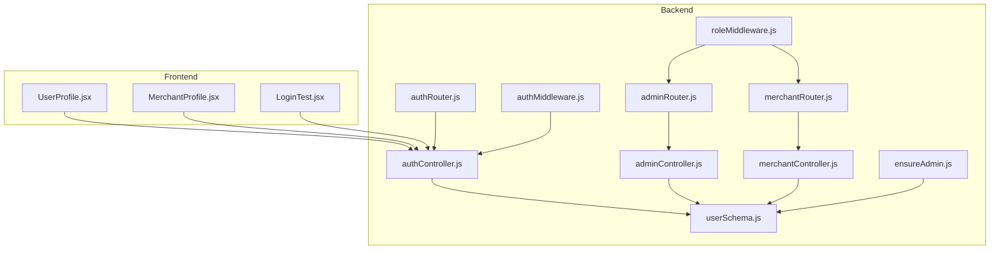
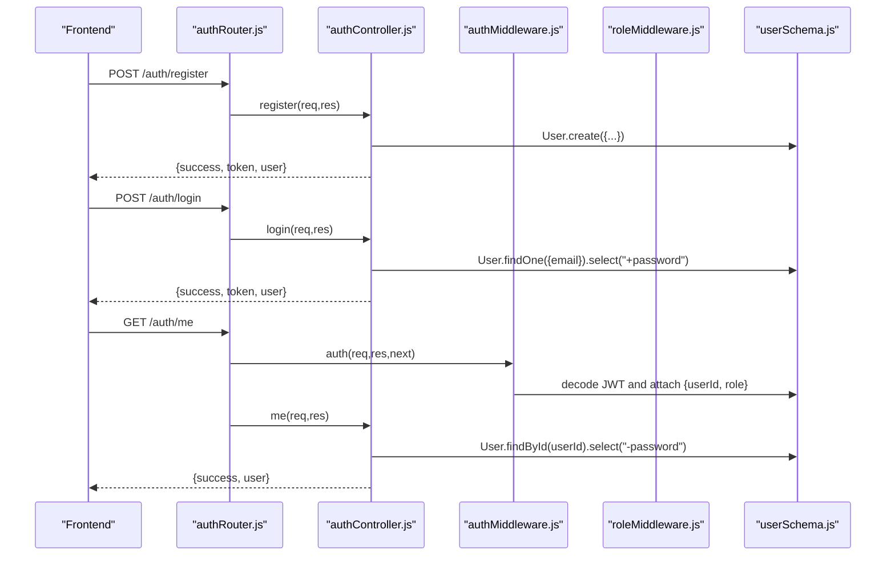
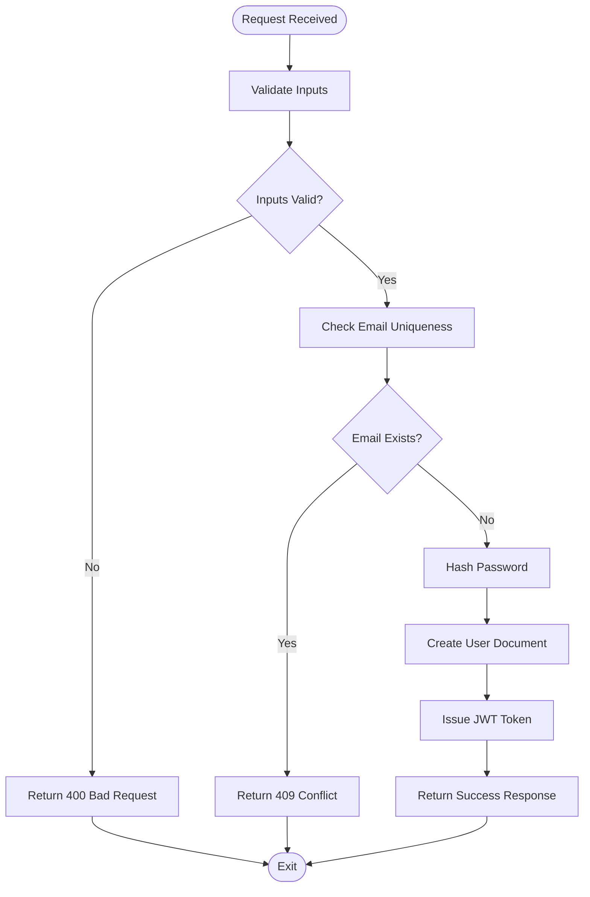
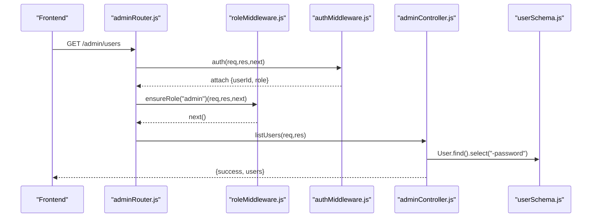
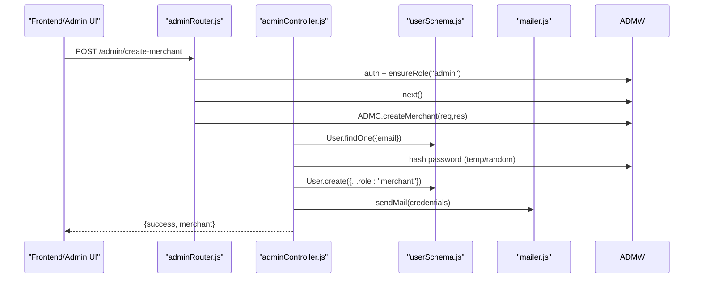
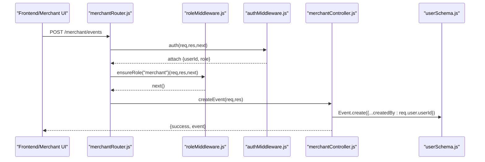
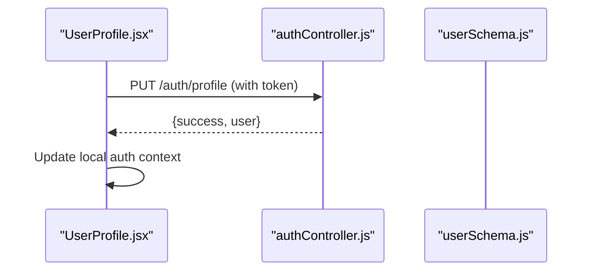
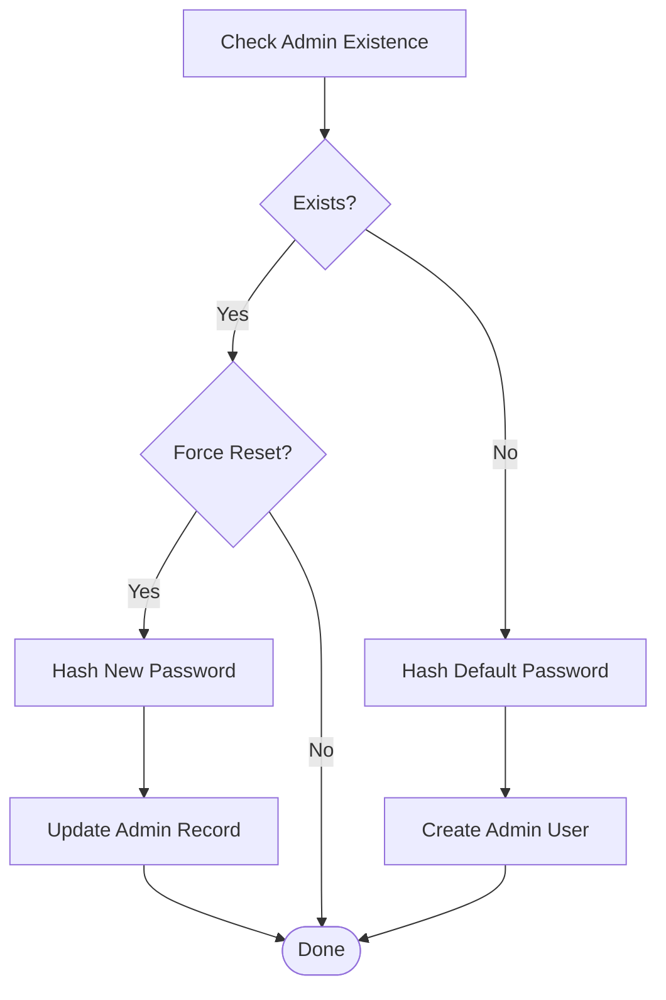
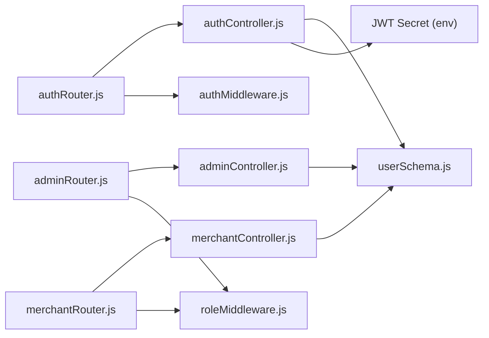

# User Schema

<cite>
**Referenced Files in This Document**
- [userSchema.js](file://backend/models/userSchema.js)
- [authController.js](file://backend/controller/authController.js)
- [authRouter.js](file://backend/router/authRouter.js)
- [authMiddleware.js](file://backend/middleware/authMiddleware.js)
- [roleMiddleware.js](file://backend/middleware/roleMiddleware.js)
- [adminController.js](file://backend/controller/adminController.js)
- [adminRouter.js](file://backend/router/adminRouter.js)
- [merchantController.js](file://backend/controller/merchantController.js)
- [merchantRouter.js](file://backend/router/merchantRouter.js)
- [ensureAdmin.js](file://backend/util/ensureAdmin.js)
- [UserProfile.jsx](file://frontend/src/pages/dashboards/UserProfile.jsx)
- [MerchantProfile.jsx](file://frontend/src/pages/dashboards/MerchantProfile.jsx)
- [LoginTest.jsx](file://frontend/src/pages/LoginTest.jsx)
</cite>

## Table of Contents
1. [Introduction](#introduction)
2. [Project Structure](#project-structure)
3. [Core Components](#core-components)
4. [Architecture Overview](#architecture-overview)
5. [Detailed Component Analysis](#detailed-component-analysis)
6. [Dependency Analysis](#dependency-analysis)
7. [Performance Considerations](#performance-considerations)
8. [Troubleshooting Guide](#troubleshooting-guide)
9. [Conclusion](#conclusion)
10. [Appendices](#appendices)

## Introduction
This document provides comprehensive documentation for the User schema design in the MERN Stack Event Management Platform. It details all user fields, validation rules, data types, required fields, defaults, role-based access control, and security considerations. It also includes examples of user documents and common query patterns for user management operations.

## Project Structure
The User schema and related authentication and authorization logic are implemented across the backend models, controllers, routers, and middleware. Frontend dashboards demonstrate how user profile data is presented and edited.

**Diagram sources**
- [userSchema.js:1-55](file://backend/models/userSchema.js#L1-L55)
- [authController.js:1-120](file://backend/controller/authController.js#L1-L120)
- [authRouter.js:1-12](file://backend/router/authRouter.js#L1-L12)
- [authMiddleware.js:1-17](file://backend/middleware/authMiddleware.js#L1-L17)
- [roleMiddleware.js:1-9](file://backend/middleware/roleMiddleware.js#L1-L9)
- [adminController.js:1-194](file://backend/controller/adminController.js#L1-L194)
- [adminRouter.js:1-29](file://backend/router/adminRouter.js#L1-L29)
- [merchantController.js:1-209](file://backend/controller/merchantController.js#L1-L209)
- [merchantRouter.js:1-17](file://backend/router/merchantRouter.js#L1-L17)
- [ensureAdmin.js:1-34](file://backend/util/ensureAdmin.js#L1-L34)
- [UserProfile.jsx:1-268](file://frontend/src/pages/dashboards/UserProfile.jsx#L1-L268)
- [MerchantProfile.jsx:1-214](file://frontend/src/pages/dashboards/MerchantProfile.jsx#L1-L214)
- [LoginTest.jsx:1-138](file://frontend/src/pages/LoginTest.jsx#L1-L138)

**Section sources**
- [userSchema.js:1-55](file://backend/models/userSchema.js#L1-L55)
- [authController.js:1-120](file://backend/controller/authController.js#L1-L120)
- [authRouter.js:1-12](file://backend/router/authRouter.js#L1-L12)
- [authMiddleware.js:1-17](file://backend/middleware/authMiddleware.js#L1-L17)
- [roleMiddleware.js:1-9](file://backend/middleware/roleMiddleware.js#L1-L9)
- [adminController.js:1-194](file://backend/controller/adminController.js#L1-L194)
- [adminRouter.js:1-29](file://backend/router/adminRouter.js#L1-L29)
- [merchantController.js:1-209](file://backend/controller/merchantController.js#L1-L209)
- [merchantRouter.js:1-17](file://backend/router/merchantRouter.js#L1-L17)
- [ensureAdmin.js:1-34](file://backend/util/ensureAdmin.js#L1-L34)
- [UserProfile.jsx:1-268](file://frontend/src/pages/dashboards/UserProfile.jsx#L1-L268)
- [MerchantProfile.jsx:1-214](file://frontend/src/pages/dashboards/MerchantProfile.jsx#L1-L214)
- [LoginTest.jsx:1-138](file://frontend/src/pages/LoginTest.jsx#L1-L138)

## Core Components
- User schema definition with fields: name, email, password, role, status, businessName, phone, serviceType, plus timestamps.
- Authentication controller handling registration, login, and profile retrieval.
- Middleware for JWT-based authentication and role-based authorization.
- Admin controller and routes for listing users, listing merchants, creating merchants, deleting users, and reporting.
- Merchant controller and routes for merchant-specific operations.
- Frontend dashboards for user and merchant profile management.

Key schema attributes:
- name: String, required, minimum length constraint.
- businessName: String, default empty string, trimmed.
- phone: String, default empty string, trimmed.
- serviceType: String, default empty string, trimmed.
- email: String, required, unique, lowercased, validated as email.
- password: String, required, minimum length constraint, hidden from queries by default.
- role: String, enum ["user", "admin", "merchant"], default "user".
- status: String, enum ["active", "inactive"], default "active".

Security and validation highlights:
- Password hashing via bcrypt in registration and admin creation flows.
- JWT-based authentication with bearer token verification.
- Role enforcement using a reusable role middleware.
- Unique index on email enforced at schema level.
- Password field excluded from default queries.

**Section sources**
- [userSchema.js:4-52](file://backend/models/userSchema.js#L4-L52)
- [authController.js:11-52](file://backend/controller/authController.js#L11-L52)
- [authController.js:54-107](file://backend/controller/authController.js#L54-L107)
- [authController.js:109-119](file://backend/controller/authController.js#L109-L119)
- [authMiddleware.js:3-16](file://backend/middleware/authMiddleware.js#L3-L16)
- [roleMiddleware.js:1-8](file://backend/middleware/roleMiddleware.js#L1-L8)
- [adminController.js:9-16](file://backend/controller/adminController.js#L9-L16)
- [adminController.js:27-77](file://backend/controller/adminController.js#L27-L77)
- [merchantController.js:149-158](file://backend/controller/merchantController.js#L149-L158)

## Architecture Overview
The User schema integrates with authentication, authorization, and role-specific controllers. Requests flow through routers to controllers, which interact with the User model and enforce role-based permissions.

**Diagram sources**
- [authRouter.js:7-9](file://backend/router/authRouter.js#L7-L9)
- [authController.js:11-52](file://backend/controller/authController.js#L11-L52)
- [authController.js:54-107](file://backend/controller/authController.js#L54-L107)
- [authController.js:109-119](file://backend/controller/authController.js#L109-L119)
- [authMiddleware.js:3-16](file://backend/middleware/authMiddleware.js#L3-L16)
- [userSchema.js:54-55](file://backend/models/userSchema.js#L54-L55)

**Section sources**
- [authRouter.js:1-12](file://backend/router/authRouter.js#L1-L12)
- [authController.js:1-120](file://backend/controller/authController.js#L1-L120)
- [authMiddleware.js:1-17](file://backend/middleware/authMiddleware.js#L1-L17)
- [userSchema.js:1-55](file://backend/models/userSchema.js#L1-L55)

## Detailed Component Analysis

### User Schema Fields and Constraints
- name
  - Type: String
  - Required: true
  - Validation: Minimum length 3
- businessName
  - Type: String
  - Default: ""
  - Behavior: Trimmed
- phone
  - Type: String
  - Default: ""
  - Behavior: Trimmed
- serviceType
  - Type: String
  - Default: ""
  - Behavior: Trimmed
- email
  - Type: String
  - Required: true
  - Unique: true
  - Normalization: Lowercased
  - Validation: Email format
- password
  - Type: String
  - Required: true
  - Validation: Minimum length 6
  - Access: Hidden from queries by default (select: false)
- role
  - Type: String
  - Enum: ["user", "admin", "merchant"]
  - Default: "user"
  - Required: true
- status
  - Type: String
  - Enum: ["active", "inactive"]
  - Default: "active"

Uniqueness and indexes:
- Email is unique at the schema level.
- Additional indexes may be inferred by the ODM for common queries.

Security considerations:
- Passwords are stored as hashes; plaintext passwords are never persisted.
- JWT tokens carry userId and role for session management.
- Role middleware enforces route-level access control.

**Section sources**
- [userSchema.js:6-49](file://backend/models/userSchema.js#L6-L49)

### Authentication Flow
- Registration
  - Validates presence of name, email, password.
  - Limits role to ["user", "merchant"] with fallback to "user".
  - Checks email uniqueness.
  - Hashes password and creates user.
  - Issues JWT token.
- Login
  - Validates presence of email and password.
  - Finds user by email with password included.
  - Compares password hash.
  - Issues JWT token.
- Profile retrieval
  - Returns current user without password.

**Diagram sources**
- [authController.js:11-52](file://backend/controller/authController.js#L11-L52)
- [userSchema.js:26-38](file://backend/models/userSchema.js#L26-L38)

**Section sources**
- [authController.js:11-52](file://backend/controller/authController.js#L11-L52)
- [authController.js:54-107](file://backend/controller/authController.js#L54-L107)
- [authController.js:109-119](file://backend/controller/authController.js#L109-L119)

### Role-Based Access Control
- Authentication middleware verifies JWT and attaches decoded {userId, role} to request.
- Role middleware ensures the requesting user has one of the allowed roles.
- Admin routes require "admin".
- Merchant routes require "merchant".

**Diagram sources**
- [adminRouter.js:19](file://backend/router/adminRouter.js#L19)
- [roleMiddleware.js:1-8](file://backend/middleware/roleMiddleware.js#L1-L8)
- [authMiddleware.js:3-16](file://backend/middleware/authMiddleware.js#L3-L16)
- [adminController.js:9-16](file://backend/controller/adminController.js#L9-L16)
- [userSchema.js:54-55](file://backend/models/userSchema.js#L54-L55)

**Section sources**
- [adminRouter.js:1-29](file://backend/router/adminRouter.js#L1-L29)
- [roleMiddleware.js:1-9](file://backend/middleware/roleMiddleware.js#L1-L9)
- [authMiddleware.js:1-17](file://backend/middleware/authMiddleware.js#L1-L17)
- [adminController.js:1-194](file://backend/controller/adminController.js#L1-L194)

### Merchant Account Creation (Admin)
- Admin endpoint to create merchant accounts.
- Validates required fields (name, email).
- Ensures email uniqueness.
- Generates temporary password if not provided (min length 6) or random secure password.
- Hashes password and sets role to "merchant".
- Sends credentials via email utility.
- Returns merchant details excluding password.

**Diagram sources**
- [adminRouter.js:21](file://backend/router/adminRouter.js#L21)
- [adminController.js:27-77](file://backend/controller/adminController.js#L27-L77)
- [userSchema.js:54-55](file://backend/models/userSchema.js#L54-L55)

**Section sources**
- [adminController.js:27-77](file://backend/controller/adminController.js#L27-L77)

### Merchant Route Permissions
- Merchant routes require "merchant" role.
- Example routes include creating, updating, listing, retrieving, and deleting events; listing participants.

**Diagram sources**
- [merchantRouter.js:9](file://backend/router/merchantRouter.js#L9)
- [roleMiddleware.js:1-8](file://backend/middleware/roleMiddleware.js#L1-L8)
- [authMiddleware.js:3-16](file://backend/middleware/authMiddleware.js#L3-L16)
- [merchantController.js:5-98](file://backend/controller/merchantController.js#L5-L98)
- [userSchema.js:54-55](file://backend/models/userSchema.js#L54-L55)

**Section sources**
- [merchantRouter.js:1-17](file://backend/router/merchantRouter.js#L1-L17)
- [merchantController.js:1-209](file://backend/controller/merchantController.js#L1-L209)

### Frontend Profile Management
- User dashboard allows editing name, email, phone, address, and bio.
- Merchant dashboard extends with businessName and similar editable fields.
- Both use authenticated PUT requests to update profile data.

**Diagram sources**
- [UserProfile.jsx:38-62](file://frontend/src/pages/dashboards/UserProfile.jsx#L38-L62)
- [authController.js:109-119](file://backend/controller/authController.js#L109-L119)
- [userSchema.js:54-55](file://backend/models/userSchema.js#L54-L55)

**Section sources**
- [UserProfile.jsx:1-268](file://frontend/src/pages/dashboards/UserProfile.jsx#L1-L268)
- [MerchantProfile.jsx:1-214](file://frontend/src/pages/dashboards/MerchantProfile.jsx#L1-L214)

### Admin Initialization Utility
- Utility to ensure admin user exists with provided or default credentials.
- Hashes password and updates if forced.

**Diagram sources**
- [ensureAdmin.js:4-34](file://backend/util/ensureAdmin.js#L4-L34)

**Section sources**
- [ensureAdmin.js:1-34](file://backend/util/ensureAdmin.js#L1-L34)

## Dependency Analysis
- Controllers depend on the User model for persistence and queries.
- Routers depend on controllers for business logic.
- Middleware depends on JWT secret and environment configuration.
- Admin and merchant controllers depend on role middleware and authentication middleware.
- Frontend dashboards depend on authenticated API endpoints.

**Diagram sources**
- [authRouter.js:1-12](file://backend/router/authRouter.js#L1-L12)
- [authController.js:1-120](file://backend/controller/authController.js#L1-L120)
- [adminRouter.js:1-29](file://backend/router/adminRouter.js#L1-L29)
- [adminController.js:1-194](file://backend/controller/adminController.js#L1-L194)
- [merchantRouter.js:1-17](file://backend/router/merchantRouter.js#L1-L17)
- [merchantController.js:1-209](file://backend/controller/merchantController.js#L1-L209)
- [authMiddleware.js:1-17](file://backend/middleware/authMiddleware.js#L1-L17)
- [roleMiddleware.js:1-9](file://backend/middleware/roleMiddleware.js#L1-L9)
- [userSchema.js:1-55](file://backend/models/userSchema.js#L1-L55)

**Section sources**
- [authRouter.js:1-12](file://backend/router/authRouter.js#L1-L12)
- [adminRouter.js:1-29](file://backend/router/adminRouter.js#L1-L29)
- [merchantRouter.js:1-17](file://backend/router/merchantRouter.js#L1-L17)
- [authController.js:1-120](file://backend/controller/authController.js#L1-L120)
- [adminController.js:1-194](file://backend/controller/adminController.js#L1-L194)
- [merchantController.js:1-209](file://backend/controller/merchantController.js#L1-L209)
- [authMiddleware.js:1-17](file://backend/middleware/authMiddleware.js#L1-L17)
- [roleMiddleware.js:1-9](file://backend/middleware/roleMiddleware.js#L1-L9)
- [userSchema.js:1-55](file://backend/models/userSchema.js#L1-L55)

## Performance Considerations
- Index on email ensures efficient lookups during login and registration.
- Password hashing cost is configured in controllers; consider environment tuning for production.
- Role middleware and JWT decoding are lightweight but should be cached at the application layer if needed.
- Minimizing payload sizes by excluding password fields reduces bandwidth and improves response times.

## Troubleshooting Guide
Common issues and resolutions:
- Registration fails with conflict on email
  - Cause: Duplicate email detected.
  - Resolution: Use a unique email or contact support.
  - Section sources
    - [authController.js:27-31](file://backend/controller/authController.js#L27-L31)
- Login fails with invalid credentials
  - Cause: Incorrect email or password mismatch.
  - Resolution: Verify credentials; ensure email is registered.
  - Section sources
    - [authController.js:66-81](file://backend/controller/authController.js#L66-L81)
- Unauthorized access to protected routes
  - Cause: Missing or invalid Bearer token; insufficient role.
  - Resolution: Authenticate and ensure correct role ("admin" or "merchant").
  - Section sources
    - [authMiddleware.js:3-16](file://backend/middleware/authMiddleware.js#L3-L16)
    - [roleMiddleware.js:1-8](file://backend/middleware/roleMiddleware.js#L1-L8)
- Merchant creation errors
  - Cause: Missing required fields or email conflict.
  - Resolution: Provide name and email; ensure unique email; optionally supply password.
  - Section sources
    - [adminController.js:35-41](file://backend/controller/adminController.js#L35-L41)
    - [adminController.js:42-52](file://backend/controller/adminController.js#L42-L52)
- Profile update failures
  - Cause: Not authenticated or invalid form data.
  - Resolution: Ensure token present and fields meet validation rules.
  - Section sources
    - [UserProfile.jsx:38-62](file://frontend/src/pages/dashboards/UserProfile.jsx#L38-L62)
    - [MerchantProfile.jsx:40-60](file://frontend/src/pages/dashboards/MerchantProfile.jsx#L40-L60)

## Conclusion
The User schema in the Event Management Platform is designed with strong validation, security, and role-based access control. It supports three primary roles—user, admin, and merchant—with clear boundaries enforced by middleware and controllers. The schema’s constraints and default values ensure consistent data quality, while JWT-based authentication and password hashing protect sensitive information.

## Appendices

### Field-Level Validation Summary
- name: required, min length 3
- businessName: optional, default "", trimmed
- phone: optional, default "", trimmed
- serviceType: optional, default "", trimmed
- email: required, unique, lowercase, email format
- password: required, min length 6, select:false
- role: required, enum ["user","admin","merchant"], default "user"
- status: enum ["active","inactive"], default "active"

**Section sources**
- [userSchema.js:6-49](file://backend/models/userSchema.js#L6-L49)

### Example User Documents
Representative documents illustrating typical field values and defaults:
- Regular user
  - name: "John Doe"
  - email: "john.doe@example.com"
  - role: "user"
  - status: "active"
  - businessName: "" (default)
  - phone: "" (default)
  - serviceType: "" (default)
- Merchant user
  - name: "Jane Merchant"
  - email: "jane.merchant@example.com"
  - role: "merchant"
  - status: "active"
  - businessName: "Jane's Services"
  - phone: "+1234567890"
  - serviceType: "Consulting"
- Admin user
  - name: "System Admin"
  - email: "admin@example.com"
  - role: "admin"
  - status: "active"
  - businessName: "" (default)
  - phone: "" (default)
  - serviceType: "" (default)

Note: Password is hashed and not shown.

**Section sources**
- [setupTestUsers.js:41-79](file://backend/scripts/setupTestUsers.js#L41-L79)
- [ensureAdmin.js:4-34](file://backend/util/ensureAdmin.js#L4-L34)

### Common Query Patterns
- Retrieve current user (excluding password)
  - Use authenticated GET /auth/me
  - Controller returns user without password
  - Section sources
    - [authController.js:109-119](file://backend/controller/authController.js#L109-L119)
- List all users (admin)
  - GET /admin/users
  - Controller excludes password from results
  - Section sources
    - [adminController.js:9-16](file://backend/controller/adminController.js#L9-L16)
- List merchants (admin)
  - GET /admin/merchants
  - Controller filters by role "merchant"
  - Section sources
    - [adminController.js:18-25](file://backend/controller/adminController.js#L18-L25)
- Create merchant (admin)
  - POST /admin/create-merchant
  - Controller validates fields, checks uniqueness, hashes password, sets role
  - Section sources
    - [adminController.js:27-77](file://backend/controller/adminController.js#L27-L77)
- Merchant-managed events
  - GET /merchant/events
  - Controller filters by createdBy matching authenticated merchant
  - Section sources
    - [merchantController.js:149-158](file://backend/controller/merchantController.js#L149-L158)

### Security Best Practices Observed
- Password hashing with bcrypt in registration and admin creation.
- JWT-based session management with bearer tokens.
- Role middleware enforcing route-level permissions.
- Password field excluded from default queries.
- Email normalization to lowercase with unique constraint.

**Section sources**
- [authController.js:31-37](file://backend/controller/authController.js#L31-L37)
- [adminController.js:42-52](file://backend/controller/adminController.js#L42-L52)
- [authMiddleware.js:5-8](file://backend/middleware/authMiddleware.js#L5-L8)
- [roleMiddleware.js:3-6](file://backend/middleware/roleMiddleware.js#L3-L6)
- [userSchema.js:37](file://backend/models/userSchema.js#L37)
- [userSchema.js:29](file://backend/models/userSchema.js#L29)