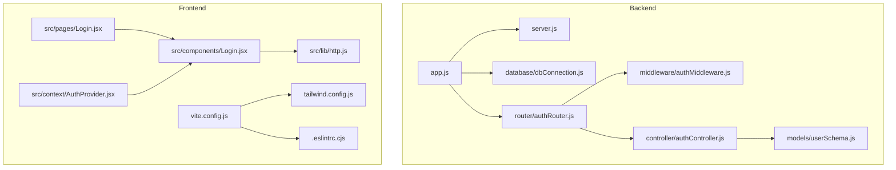
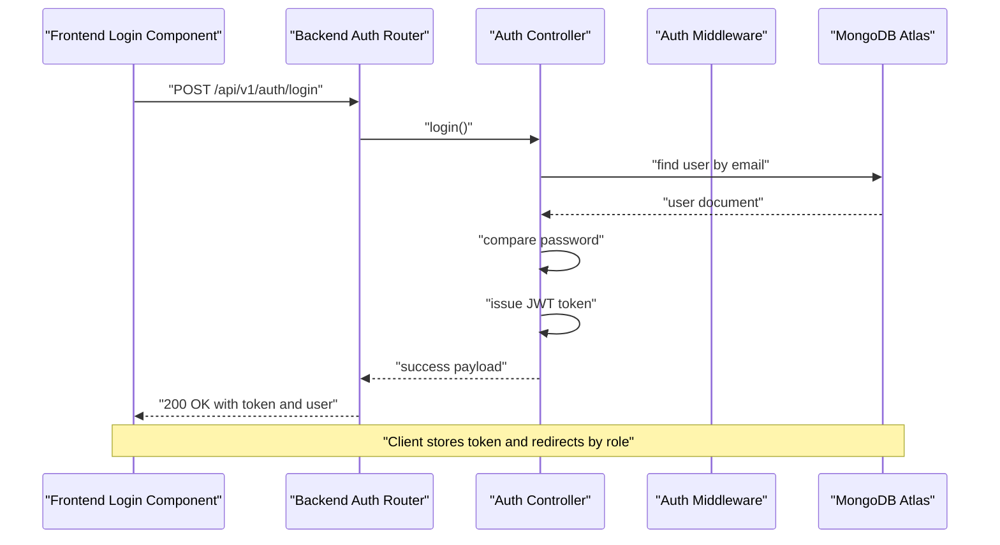
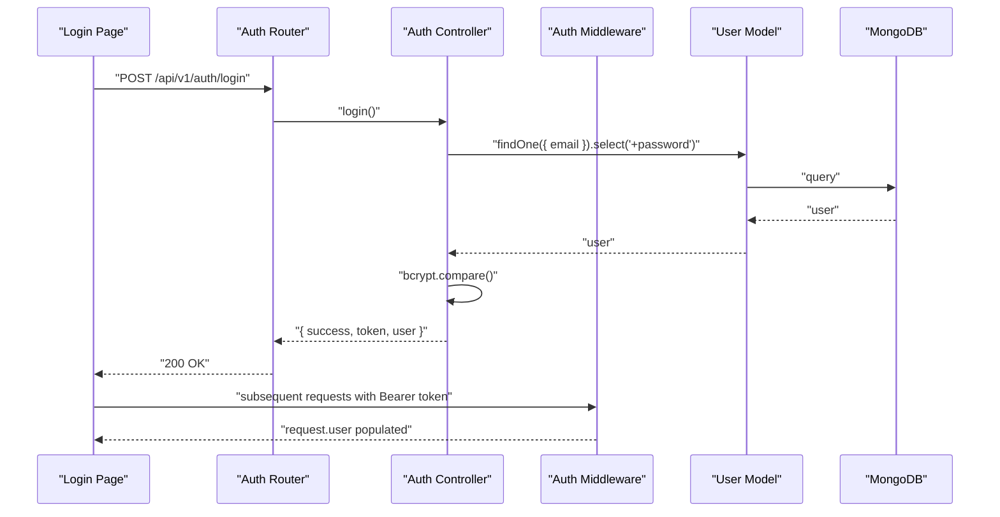
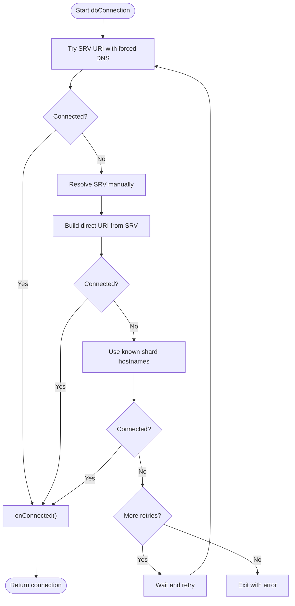
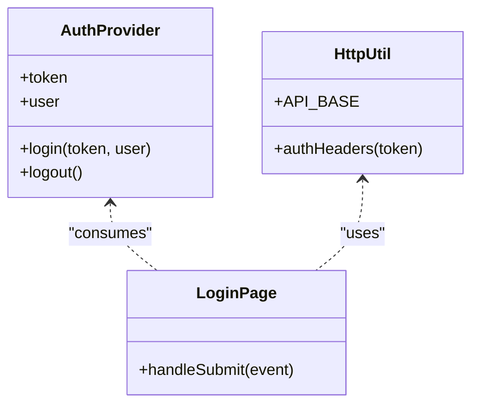
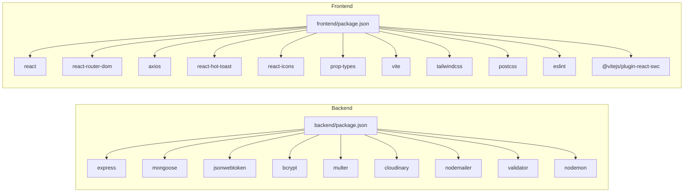

# Development Guidelines

<cite>
**Referenced Files in This Document**
- [backend/package.json](file://backend/package.json)
- [frontend/package.json](file://frontend/package.json)
- [backend/app.js](file://backend/app.js)
- [backend/server.js](file://backend/server.js)
- [backend/database/dbConnection.js](file://backend/database/dbConnection.js)
- [backend/middleware/authMiddleware.js](file://backend/middleware/authMiddleware.js)
- [backend/router/authRouter.js](file://backend/router/authRouter.js)
- [backend/controller/authController.js](file://backend/controller/authController.js)
- [backend/models/userSchema.js](file://backend/models/userSchema.js)
- [frontend/src/lib/http.js](file://frontend/src/lib/http.js)
- [frontend/src/context/AuthProvider.jsx](file://frontend/src/context/AuthProvider.jsx)
- [frontend/src/components/Login.jsx](file://frontend/src/components/Login.jsx)
- [frontend/src/pages/Login.jsx](file://frontend/src/pages/Login.jsx)
- [frontend/.eslintrc.cjs](file://frontend/.eslintrc.cjs)
- [frontend/tailwind.config.js](file://frontend/tailwind.config.js)
- [frontend/vite.config.js](file://frontend/vite.config.js)
- [.gitignore](file://.gitignore)
</cite>

## Table of Contents
1. [Introduction](#introduction)
2. [Project Structure](#project-structure)
3. [Core Components](#core-components)
4. [Architecture Overview](#architecture-overview)
5. [Detailed Component Analysis](#detailed-component-analysis)
6. [Dependency Analysis](#dependency-analysis)
7. [Performance Considerations](#performance-considerations)
8. [Troubleshooting Guide](#troubleshooting-guide)
9. [Code Style and Conventions](#code-style-and-conventions)
10. [Component Development Standards](#component-development-standards)
11. [API Design Principles](#api-design-principles)
12. [Testing Best Practices](#testing-best-practices)
13. [Development Environment Setup](#development-environment-setup)
14. [Git Workflow and Code Review](#git-workflow-and-code-review)
15. [Contribution Guidelines and Team Collaboration](#contribution-guidelines-and-team-collaboration)
16. [Conclusion](#conclusion)

## Introduction
This document defines comprehensive development guidelines for the MERN Stack Event Management Platform. It establishes code style and conventions, component development standards, API design principles, and testing best practices. It also documents ESLint configuration, Git workflow, code review processes, and development environment setup. The goal is to maintain code quality, consistency, and scalability across the frontend and backend while supporting efficient collaboration among contributors.

## Project Structure
The project follows a clear separation of concerns:
- Backend: Express-based REST API with modular routers, controllers, models, middleware, and utilities.
- Frontend: React SPA with Vite, organized into components, pages, context providers, and shared libraries.
- Shared configuration: ESLint, Tailwind CSS, and Vite configurations guide linting, styling, and dev server behavior.

**Diagram sources**
- [backend/app.js:1-91](file://backend/app.js#L1-L91)
- [backend/server.js:1-6](file://backend/server.js#L1-L6)
- [backend/database/dbConnection.js:1-112](file://backend/database/dbConnection.js#L1-L112)
- [backend/middleware/authMiddleware.js:1-17](file://backend/middleware/authMiddleware.js#L1-L17)
- [backend/router/authRouter.js:1-12](file://backend/router/authRouter.js#L1-L12)
- [backend/controller/authController.js:1-120](file://backend/controller/authController.js#L1-L120)
- [backend/models/userSchema.js:1-55](file://backend/models/userSchema.js#L1-L55)
- [frontend/src/lib/http.js:1-5](file://frontend/src/lib/http.js#L1-L5)
- [frontend/src/context/AuthProvider.jsx:1-38](file://frontend/src/context/AuthProvider.jsx#L1-L38)
- [frontend/src/components/Login.jsx:1-108](file://frontend/src/components/Login.jsx#L1-L108)
- [frontend/src/pages/Login.jsx:1-8](file://frontend/src/pages/Login.jsx#L1-L8)
- [frontend/vite.config.js:1-12](file://frontend/vite.config.js#L1-L12)
- [frontend/tailwind.config.js:1-10](file://frontend/tailwind.config.js#L1-L10)
- [frontend/.eslintrc.cjs:1-22](file://frontend/.eslintrc.cjs#L1-L22)

**Section sources**
- [backend/package.json:1-30](file://backend/package.json#L1-L30)
- [frontend/package.json:1-37](file://frontend/package.json#L1-L37)
- [backend/app.js:1-91](file://backend/app.js#L1-L91)
- [frontend/vite.config.js:1-12](file://frontend/vite.config.js#L1-L12)
- [frontend/tailwind.config.js:1-10](file://frontend/tailwind.config.js#L1-L10)
- [frontend/.eslintrc.cjs:1-22](file://frontend/.eslintrc.cjs#L1-L22)

## Core Components
- Backend application bootstrap and routing are centralized in the Express app, enabling modular API composition via routers.
- Authentication middleware enforces bearer token verification for protected routes.
- Controllers encapsulate business logic for endpoints, returning structured JSON responses.
- Models define schema constraints and validation rules for data persistence.
- Frontend authentication context persists tokens and user state, while HTTP utilities centralize base URLs and auth headers.
- Login page and component demonstrate a clean separation of presentation and logic.

Key implementation patterns:
- Modular router-controller separation for maintainability.
- Centralized CORS configuration and health endpoints.
- Structured error handling with consistent HTTP status codes and messages.
- JWT-based authentication with role-aware access.

**Section sources**
- [backend/app.js:1-91](file://backend/app.js#L1-L91)
- [backend/middleware/authMiddleware.js:1-17](file://backend/middleware/authMiddleware.js#L1-L17)
- [backend/router/authRouter.js:1-12](file://backend/router/authRouter.js#L1-L12)
- [backend/controller/authController.js:1-120](file://backend/controller/authController.js#L1-L120)
- [backend/models/userSchema.js:1-55](file://backend/models/userSchema.js#L1-L55)
- [frontend/src/context/AuthProvider.jsx:1-38](file://frontend/src/context/AuthProvider.jsx#L1-L38)
- [frontend/src/lib/http.js:1-5](file://frontend/src/lib/http.js#L1-L5)
- [frontend/src/components/Login.jsx:1-108](file://frontend/src/components/Login.jsx#L1-L108)
- [frontend/src/pages/Login.jsx:1-8](file://frontend/src/pages/Login.jsx#L1-L8)

## Architecture Overview
The platform follows a client-server architecture:
- Frontend (React SPA) communicates with the backend REST API.
- Backend exposes versioned endpoints under a base path, with modular routers per domain.
- Authentication middleware secures routes and enriches requests with user context.
- Database connectivity is robustly configured with retry strategies and DNS overrides for Atlas.

**Diagram sources**
- [frontend/src/components/Login.jsx:15-66](file://frontend/src/components/Login.jsx#L15-L66)
- [backend/router/authRouter.js:7-9](file://backend/router/authRouter.js#L7-L9)
- [backend/controller/authController.js:54-107](file://backend/controller/authController.js#L54-L107)
- [backend/middleware/authMiddleware.js:3-16](file://backend/middleware/authMiddleware.js#L3-L16)
- [backend/database/dbConnection.js:19-94](file://backend/database/dbConnection.js#L19-L94)

## Detailed Component Analysis

### Authentication Flow
- Router maps POST /api/v1/auth/login to the login controller.
- Controller validates input, queries the user collection, compares passwords, and issues a signed JWT.
- Middleware extracts the Bearer token from Authorization header, verifies it, and attaches user info to the request.
- Frontend sends credentials, receives token, stores it, and navigates based on role.

**Diagram sources**
- [backend/router/authRouter.js:7-9](file://backend/router/authRouter.js#L7-L9)
- [backend/controller/authController.js:54-107](file://backend/controller/authController.js#L54-L107)
- [backend/middleware/authMiddleware.js:3-16](file://backend/middleware/authMiddleware.js#L3-L16)
- [backend/models/userSchema.js:26-38](file://backend/models/userSchema.js#L26-L38)
- [frontend/src/components/Login.jsx:20-66](file://frontend/src/components/Login.jsx#L20-L66)

**Section sources**
- [backend/router/authRouter.js:1-12](file://backend/router/authRouter.js#L1-L12)
- [backend/controller/authController.js:1-120](file://backend/controller/authController.js#L1-L120)
- [backend/middleware/authMiddleware.js:1-17](file://backend/middleware/authMiddleware.js#L1-L17)
- [backend/models/userSchema.js:1-55](file://backend/models/userSchema.js#L1-L55)
- [frontend/src/components/Login.jsx:1-108](file://frontend/src/components/Login.jsx#L1-L108)

### Database Connectivity Strategy
The backend implements multiple fallback strategies to connect to MongoDB Atlas, including:
- Standard SRV URI with forced DNS resolution.
- Manual SRV record resolution followed by a direct URI.
- Known shard hostnames with explicit replica set configuration.

**Diagram sources**
- [backend/database/dbConnection.js:19-94](file://backend/database/dbConnection.js#L19-L94)

**Section sources**
- [backend/database/dbConnection.js:1-112](file://backend/database/dbConnection.js#L1-L112)

### Frontend Authentication Context and HTTP Utilities
- AuthProvider manages token and user state, persisting to localStorage and exposing login/logout functions.
- http.js centralizes the API base URL and Authorization header construction.
- Login component orchestrates form submission, handles responses, displays notifications, and performs role-based navigation.

**Diagram sources**
- [frontend/src/context/AuthProvider.jsx:1-38](file://frontend/src/context/AuthProvider.jsx#L1-L38)
- [frontend/src/lib/http.js:1-5](file://frontend/src/lib/http.js#L1-L5)
- [frontend/src/pages/Login.jsx:1-8](file://frontend/src/pages/Login.jsx#L1-L8)

**Section sources**
- [frontend/src/context/AuthProvider.jsx:1-38](file://frontend/src/context/AuthProvider.jsx#L1-L38)
- [frontend/src/lib/http.js:1-5](file://frontend/src/lib/http.js#L1-L5)
- [frontend/src/components/Login.jsx:1-108](file://frontend/src/components/Login.jsx#L1-L108)
- [frontend/src/pages/Login.jsx:1-8](file://frontend/src/pages/Login.jsx#L1-L8)

## Dependency Analysis
- Backend dependencies include Express, Mongoose, bcrypt, JWT, Multer, Cloudinary, Nodemailer, and validator. Development dependencies include Nodemon for hot reload.
- Frontend dependencies include React, React Router, Axios, PropTypes, and UI/notification libraries. Dev dependencies include Vite, Tailwind CSS, PostCSS, ESLint, and React SWC plugin.

**Diagram sources**
- [backend/package.json:13-28](file://backend/package.json#L13-L28)
- [frontend/package.json:12-35](file://frontend/package.json#L12-L35)

**Section sources**
- [backend/package.json:1-30](file://backend/package.json#L1-L30)
- [frontend/package.json:1-37](file://frontend/package.json#L1-L37)

## Performance Considerations
- Prefer lightweight middleware and avoid synchronous blocking operations in request handlers.
- Use pagination and filtering on the backend for large collections.
- Cache infrequent reads and leverage database indexes for frequent query fields.
- Minimize payload sizes by selecting only required fields (e.g., excluding sensitive fields in responses).
- Optimize frontend rendering by memoizing props and avoiding unnecessary re-renders.
- Keep asset sizes small; leverage lazy loading for non-critical routes.

## Troubleshooting Guide
Common issues and resolutions:
- MongoDB Atlas connectivity failures: The backend includes multiple fallback strategies and logs actionable steps. Verify network access, cluster status, credentials, and DNS resolution.
- CORS errors: Ensure the frontend origin matches the backend CORS configuration and credentials are enabled when required.
- Authentication failures: Confirm JWT secret, token presence, and middleware application on protected routes.
- Frontend navigation issues: Validate role-based routing guards and ensure the auth context is initialized before navigation.

**Section sources**
- [backend/database/dbConnection.js:86-94](file://backend/database/dbConnection.js#L86-L94)
- [backend/app.js:24-30](file://backend/app.js#L24-L30)
- [backend/middleware/authMiddleware.js:3-16](file://backend/middleware/authMiddleware.js#L3-L16)
- [frontend/src/context/AuthProvider.jsx:9-14](file://frontend/src/context/AuthProvider.jsx#L9-L14)

## Code Style and Conventions
- JavaScript/JSX
  - Use ESLint with recommended rules and React-specific plugins. Enforce strict warnings and disable unused directive warnings only when justified.
  - Maintain consistent indentation and spacing; avoid magic numbers and strings—prefer constants or configuration.
  - Prefer functional components and hooks in React; keep components small and focused.
- Backend
  - Use ES modules (.js extensions) and consistent naming for controllers, routers, models, middleware, and utilities.
  - Export default from app and named exports for routers and controllers.
  - Centralize environment variables and configuration; avoid hardcoded secrets.
- File naming
  - Use kebab-case for route files (e.g., auth-router.js), PascalCase for React components (e.g., Login.jsx), and lowercase for utility files (e.g., http.js).
- Imports
  - Group imports by external libraries, internal modules, and relative paths; order alphabetically within groups.

**Section sources**
- [frontend/.eslintrc.cjs:1-22](file://frontend/.eslintrc.cjs#L1-L22)
- [backend/app.js:1-91](file://backend/app.js#L1-L91)
- [frontend/vite.config.js:1-12](file://frontend/vite.config.js#L1-L12)

## Component Development Standards
- React Components
  - Keep presentational components dumb; move logic to hooks or context providers.
  - Use PropTypes for component prop validation; export default components.
  - Organize reusable components under a common directory and pages under a dedicated directory.
- Context Providers
  - Encapsulate state logic; expose minimal public APIs (login, logout).
  - Persist critical state to localStorage/sessionStorage with care.
- HTTP Layer
  - Centralize base URLs and auth headers; reuse across components.
  - Handle errors gracefully and surface user-friendly messages.

**Section sources**
- [frontend/src/context/AuthProvider.jsx:1-38](file://frontend/src/context/AuthProvider.jsx#L1-L38)
- [frontend/src/lib/http.js:1-5](file://frontend/src/lib/http.js#L1-L5)
- [frontend/src/components/Login.jsx:1-108](file://frontend/src/components/Login.jsx#L1-L108)

## API Design Principles
- Versioning
  - Prefix all endpoints with a versioned base path (e.g., /api/v1).
- Naming
  - Use plural nouns for resource names and lowercase with hyphens for paths.
- Responses
  - Return consistent JSON envelopes with success booleans and messages; include user-safe data without sensitive fields.
- Status Codes
  - Use appropriate HTTP status codes: 200 for success, 201 for created, 400 for bad request, 401 for unauthorized, 404 for not found, 409 for conflicts, 500 for server errors.
- Authentication
  - Protect routes with middleware; attach user context to requests.
- Validation
  - Validate inputs on both frontend and backend; return clear error messages.

**Section sources**
- [backend/app.js:35-47](file://backend/app.js#L35-L47)
- [backend/router/authRouter.js:7-9](file://backend/router/authRouter.js#L7-L9)
- [backend/controller/authController.js:11-52](file://backend/controller/authController.js#L11-L52)
- [backend/middleware/authMiddleware.js:3-16](file://backend/middleware/authMiddleware.js#L3-L16)

## Testing Best Practices
- Backend
  - Write unit tests for controllers and services; mock database and external integrations.
  - Use integration tests for critical endpoints; assert status codes, response shape, and side effects.
  - Automate tests in CI with linting and test scripts.
- Frontend
  - Use component testing for isolated logic; simulate context providers and HTTP mocks.
  - Validate user flows (login, navigation) with end-to-end tests.
  - Keep tests close to the code; name tests descriptively.
- General
  - Maintain deterministic environments; snapshot test UI changes carefully.
  - Monitor test coverage and prioritize critical paths.

## Development Environment Setup
- Prerequisites
  - Node.js LTS and npm; Git; MongoDB Atlas credentials and network access.
- Backend
  - Install dependencies and run in development mode using the provided script.
  - Configure environment variables for database, JWT, and third-party services.
- Frontend
  - Install dependencies and start the Vite dev server on the configured port.
  - Tailwind CSS is configured for content paths; ESLint runs during development and builds.
- Ports
  - Backend listens on the configured port; frontend runs on the Vite port.

**Section sources**
- [backend/package.json:7-10](file://backend/package.json#L7-L10)
- [frontend/package.json:6-11](file://frontend/package.json#L6-L11)
- [backend/server.js:1-6](file://backend/server.js#L1-L6)
- [frontend/vite.config.js:7-11](file://frontend/vite.config.js#L7-L11)
- [frontend/tailwind.config.js:1-10](file://frontend/tailwind.config.js#L1-L10)

## Git Workflow and Code Review
- Branching
  - Use feature branches prefixed with feature/, fix/, or chore/; keep branches focused and short-lived.
- Commit Messages
  - Use imperative mood; include scope and summary; reference issues if applicable.
- Pull Requests
  - Open PRs early; include description, screenshots for UI changes, and test plans.
  - Request reviews from maintainers; address comments promptly.
- Linting and CI
  - Ensure lint passes locally and in CI; enforce zero warnings policy.
- Secrets
  - Never commit secrets; use environment variables managed outside version control.

**Section sources**
- [.gitignore:1-3](file://.gitignore#L1-L3)

## Contribution Guidelines and Team Collaboration
- Code Quality
  - Follow style guides; run linters and formatters before committing.
  - Keep diffs small; write meaningful commit messages.
- Documentation
  - Update READMEs and inline docs when changing behavior.
- Reviews
  - Conduct constructive reviews; verify correctness, performance, and security.
- Onboarding
  - Provide setup instructions and environment configuration for new contributors.

## Conclusion
These guidelines establish a consistent foundation for building, testing, and maintaining the MERN Stack Event Management Platform. By adhering to the outlined conventions, standards, and processes, contributors can collaborate effectively, reduce technical debt, and deliver reliable features across the stack.