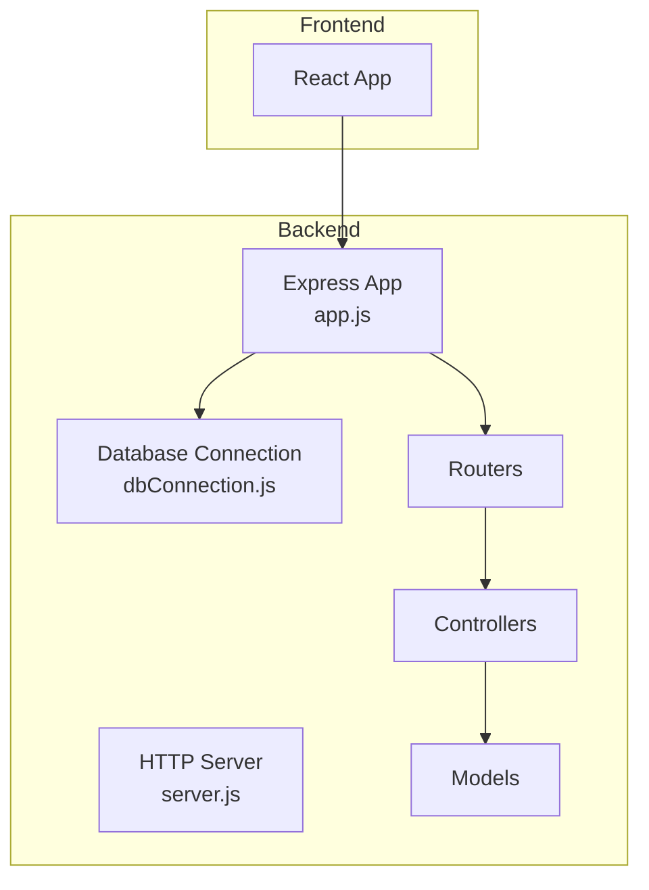
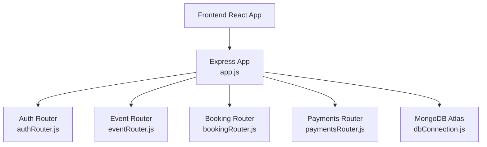
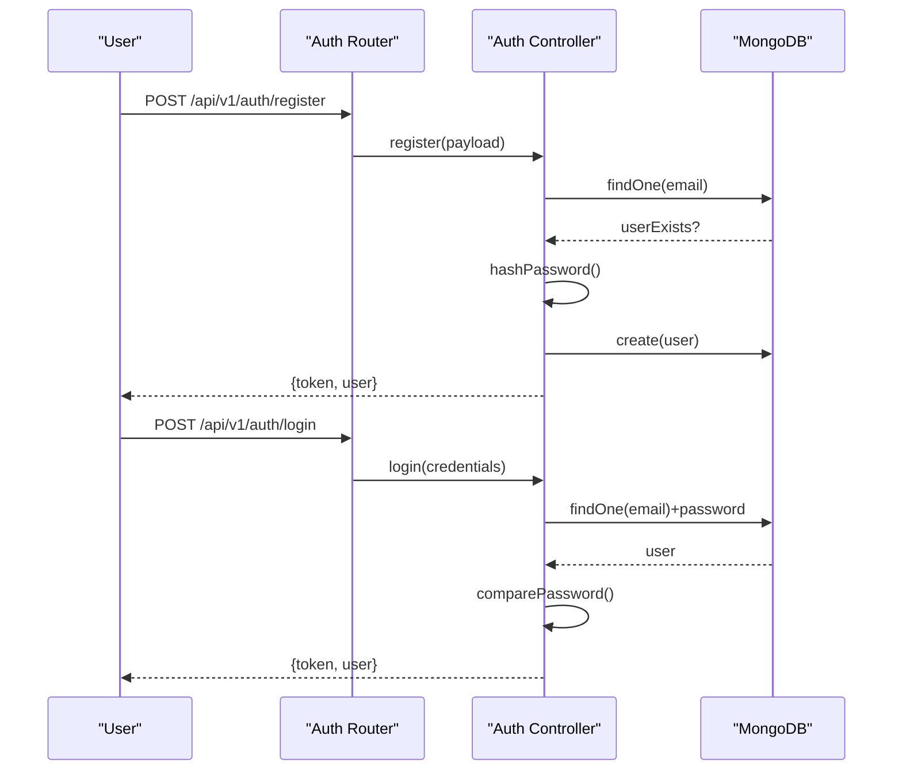
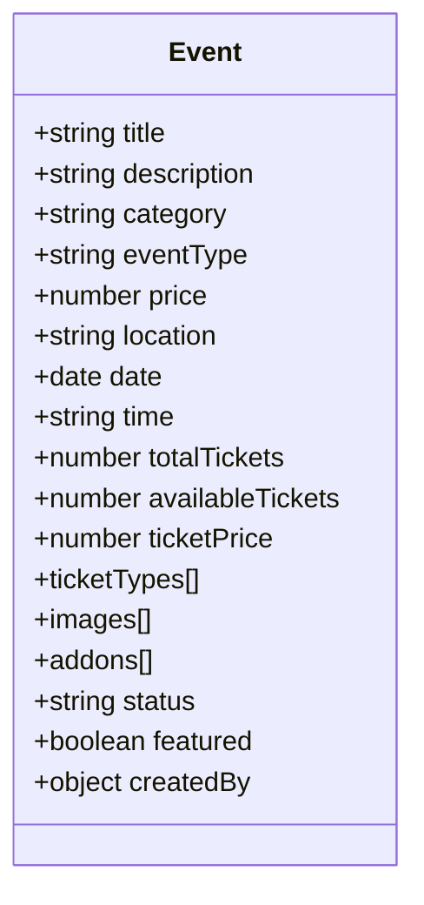
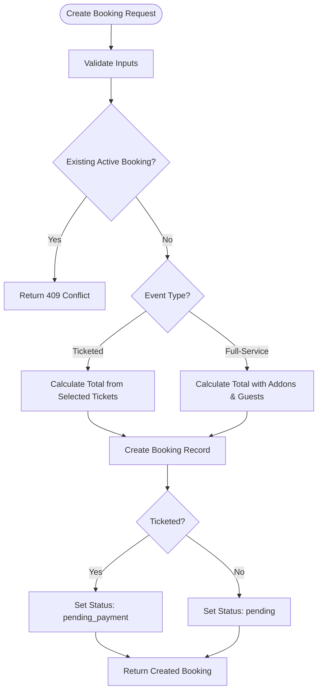
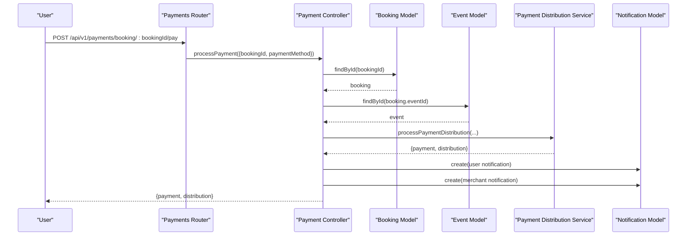
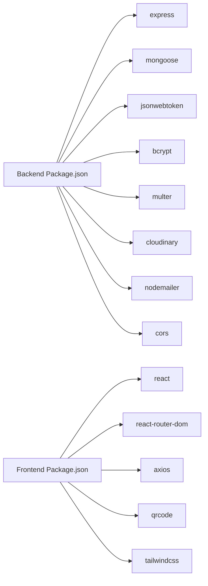

# Event Management System

<cite>
**Referenced Files in This Document**
- [app.js](file://backend/app.js)
- [server.js](file://backend/server.js)
- [dbConnection.js](file://backend/database/dbConnection.js)
- [package.json](file://backend/package.json)
- [eventRouter.js](file://backend/router/eventRouter.js)
- [eventController.js](file://backend/controller/eventController.js)
- [eventSchema.js](file://backend/models/eventSchema.js)
- [authRouter.js](file://backend/router/authRouter.js)
- [authController.js](file://backend/controller/authController.js)
- [bookingRouter.js](file://backend/router/bookingRouter.js)
- [bookingController.js](file://backend/controller/bookingController.js)
- [bookingSchema.js](file://backend/models/bookingSchema.js)
- [paymentsRouter.js](file://backend/router/paymentsRouter.js)
- [paymentController.js](file://backend/controller/paymentController.js)
- [frontend package.json](file://frontend/package.json)
</cite>

## Table of Contents
1. [Introduction](#introduction)
2. [Project Structure](#project-structure)
3. [Core Components](#core-components)
4. [Architecture Overview](#architecture-overview)
5. [Detailed Component Analysis](#detailed-component-analysis)
6. [Dependency Analysis](#dependency-analysis)
7. [Performance Considerations](#performance-considerations)
8. [Troubleshooting Guide](#troubleshooting-guide)
9. [Conclusion](#conclusion)

## Introduction
This document describes the Event Management System built with a MERN stack architecture. The system supports user registration and authentication, event browsing and registration, booking workflows for both full-service and ticketed events, payment processing, notifications, ratings, and administrative controls. It emphasizes robust database connectivity, role-based access control, and a modular backend with clear separation of concerns across routers, controllers, and models.

## Project Structure
The system follows a layered architecture:
- Backend (Node.js + Express): API endpoints, business logic, database models, middleware, and utilities
- Frontend (React): User interface for browsing events, managing bookings, payments, and dashboards
- Shared data models: Mongoose schemas define the domain entities and relationships

**Diagram sources**
- [app.js:1-91](file://backend/app.js#L1-L91)
- [server.js:1-6](file://backend/server.js#L1-L6)
- [dbConnection.js:1-112](file://backend/database/dbConnection.js#L1-L112)

**Section sources**
- [app.js:1-91](file://backend/app.js#L1-L91)
- [server.js:1-6](file://backend/server.js#L1-L6)
- [package.json:1-30](file://backend/package.json#L1-L30)
- [frontend package.json:1-39](file://frontend/package.json#L1-L39)

## Core Components
- Express application bootstrap and middleware configuration
- Database connection with resilient retry and DNS resolution strategies
- Authentication and authorization with JWT tokens and role-based routing
- Event management with support for full-service and ticketed workflows
- Booking lifecycle management with merchant and admin controls
- Payment processing with commission distribution and notifications
- Notifications and rating systems

Key implementation references:
- Application initialization and middleware: [app.js:1-91](file://backend/app.js#L1-L91)
- Server startup: [server.js:1-6](file://backend/server.js#L1-L6)
- Database connectivity: [dbConnection.js:1-112](file://backend/database/dbConnection.js#L1-L112)
- Authentication endpoints: [authRouter.js:1-12](file://backend/router/authRouter.js#L1-L12), [authController.js:1-120](file://backend/controller/authController.js#L1-L120)
- Event endpoints: [eventRouter.js:1-13](file://backend/router/eventRouter.js#L1-L13), [eventController.js:1-64](file://backend/controller/eventController.js#L1-L64)
- Booking endpoints: [bookingRouter.js:1-40](file://backend/router/bookingRouter.js#L1-L40), [bookingController.js:1-764](file://backend/controller/bookingController.js#L1-L764)
- Payment endpoints: [paymentsRouter.js:1-44](file://backend/router/paymentsRouter.js#L1-L44), [paymentController.js:1-577](file://backend/controller/paymentController.js#L1-L577)

**Section sources**
- [app.js:1-91](file://backend/app.js#L1-L91)
- [server.js:1-6](file://backend/server.js#L1-L6)
- [dbConnection.js:1-112](file://backend/database/dbConnection.js#L1-L112)
- [authRouter.js:1-12](file://backend/router/authRouter.js#L1-L12)
- [authController.js:1-120](file://backend/controller/authController.js#L1-L120)
- [eventRouter.js:1-13](file://backend/router/eventRouter.js#L1-L13)
- [eventController.js:1-64](file://backend/controller/eventController.js#L1-L64)
- [bookingRouter.js:1-40](file://backend/router/bookingRouter.js#L1-L40)
- [bookingController.js:1-764](file://backend/controller/bookingController.js#L1-L764)
- [paymentsRouter.js:1-44](file://backend/router/paymentsRouter.js#L1-L44)
- [paymentController.js:1-577](file://backend/controller/paymentController.js#L1-L577)

## Architecture Overview
The system uses a client-server model with:
- Frontend React app communicating with RESTful backend APIs
- Express server exposing modular routes grouped by domain (auth, events, bookings, payments)
- MongoDB via Mongoose with robust connection handling and retries
- JWT-based authentication and role-based authorization middleware
- Payment processing integrated with internal distribution logic

**Diagram sources**
- [app.js:1-91](file://backend/app.js#L1-L91)
- [authRouter.js:1-12](file://backend/router/authRouter.js#L1-L12)
- [eventRouter.js:1-13](file://backend/router/eventRouter.js#L1-L13)
- [bookingRouter.js:1-40](file://backend/router/bookingRouter.js#L1-L40)
- [paymentsRouter.js:1-44](file://backend/router/paymentsRouter.js#L1-L44)
- [dbConnection.js:1-112](file://backend/database/dbConnection.js#L1-L112)

## Detailed Component Analysis

### Authentication and Authorization
- Registration validates input, checks existing users, hashes passwords, and issues JWT tokens
- Login authenticates users by email/password and returns token and user profile
- Protected routes use JWT middleware; role middleware enforces access by role

**Diagram sources**
- [authRouter.js:1-12](file://backend/router/authRouter.js#L1-L12)
- [authController.js:1-120](file://backend/controller/authController.js#L1-L120)

**Section sources**
- [authRouter.js:1-12](file://backend/router/authRouter.js#L1-L12)
- [authController.js:1-120](file://backend/controller/authController.js#L1-L120)

### Event Management
- Lists events with default date/time enhancement and selective field projection
- Supports user registration for events and retrieval of user registrations
- Event schema supports both full-service and ticketed event types with addons and ticket types

**Diagram sources**
- [eventSchema.js:1-51](file://backend/models/eventSchema.js#L1-L51)

**Section sources**
- [eventRouter.js:1-13](file://backend/router/eventRouter.js#L1-L13)
- [eventController.js:1-64](file://backend/controller/eventController.js#L1-L64)
- [eventSchema.js:1-51](file://backend/models/eventSchema.js#L1-L51)

### Booking System
- Creates bookings with flexible pricing calculation for both event types
- Processes payments, generates tickets for ticketed events, and manages merchant confirmations
- Supports cancellation, completion, and rating submission flows

**Diagram sources**
- [bookingController.js:23-188](file://backend/controller/bookingController.js#L23-L188)

**Section sources**
- [bookingRouter.js:1-40](file://backend/router/bookingRouter.js#L1-L40)
- [bookingController.js:1-764](file://backend/controller/bookingController.js#L1-L764)
- [bookingSchema.js:1-118](file://backend/models/bookingSchema.js#L1-L118)

### Payment Processing
- Integrates booking payment with commission distribution and notifications
- Supports manual cash payments and maintains payment statistics and merchant earnings
- Provides refund processing with notifications

**Diagram sources**
- [paymentsRouter.js:1-44](file://backend/router/paymentsRouter.js#L1-L44)
- [paymentController.js:10-141](file://backend/controller/paymentController.js#L10-L141)

**Section sources**
- [paymentsRouter.js:1-44](file://backend/router/paymentsRouter.js#L1-L44)
- [paymentController.js:1-577](file://backend/controller/paymentController.js#L1-L577)

## Dependency Analysis
- Backend dependencies include Express, Mongoose, JWT, Bcrypt, Multer, Cloudinary, Nodemailer, and CORS
- Frontend dependencies include React, React Router, Axios, QR code generation, and Tailwind CSS
- The backend initializes database connection and admin user during startup

**Diagram sources**
- [package.json:1-30](file://backend/package.json#L1-L30)
- [frontend package.json:1-39](file://frontend/package.json#L1-L39)

**Section sources**
- [package.json:1-30](file://backend/package.json#L1-L30)
- [frontend package.json:1-39](file://frontend/package.json#L1-L39)

## Performance Considerations
- Database connection retries and DNS override improve reliability for MongoDB Atlas deployments
- Selective field projections in event listings reduce payload sizes
- Pagination and aggregation queries are used for payment statistics and merchant earnings
- JWT-based authentication avoids frequent database lookups for session validation

## Troubleshooting Guide
Common operational issues and resolutions:
- Database connectivity failures: The system logs multiple connection attempts and exits with guidance if all fail
- CORS errors: Verify frontend URL configuration and credentials flag in CORS setup
- Authentication failures: Ensure JWT secret and user credentials are valid
- Booking conflicts: Prevent duplicate active bookings per user per service
- Payment errors: Validate booking status and amount; ensure payment distribution service availability

**Section sources**
- [dbConnection.js:86-94](file://backend/database/dbConnection.js#L86-L94)
- [app.js:24-30](file://backend/app.js#L24-L30)
- [bookingController.js:65-77](file://backend/controller/bookingController.js#L65-L77)
- [paymentController.js:133-141](file://backend/controller/paymentController.js#L133-L141)

## Conclusion
The Event Management System provides a comprehensive platform for event discovery, booking, and payment with clear separation of concerns and robust backend infrastructure. Its modular design, role-based access control, and resilient database connectivity support scalable growth and reliable operation across full-service and ticketed event workflows.