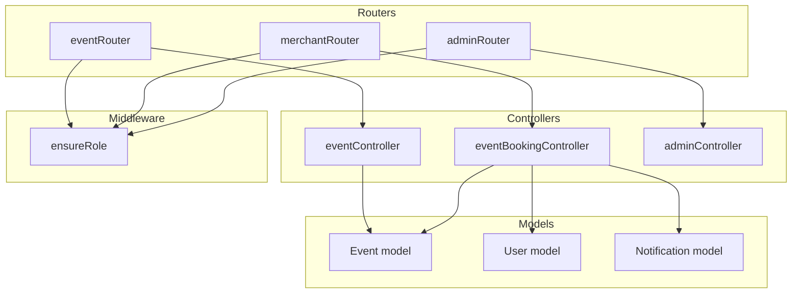
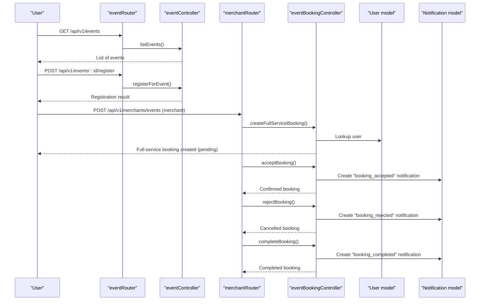
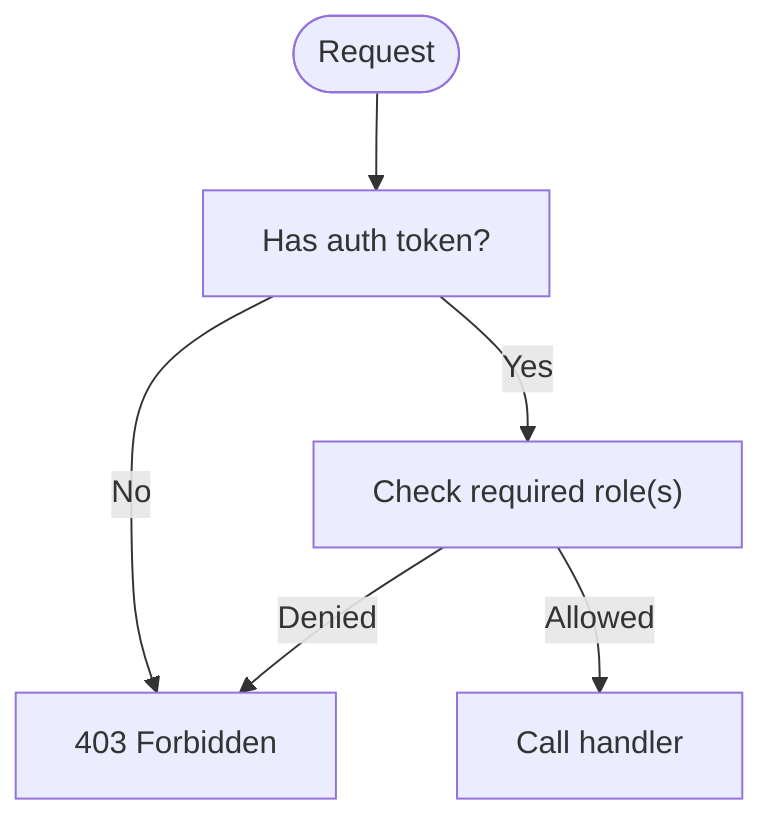
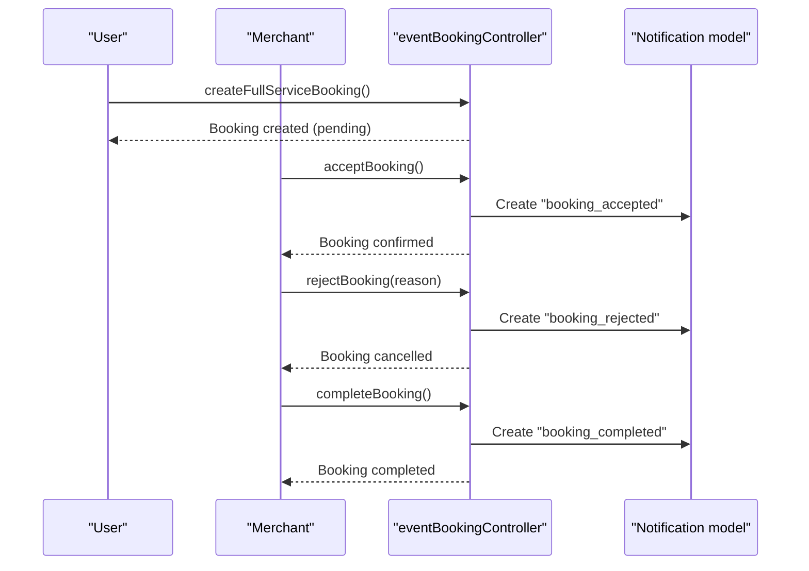
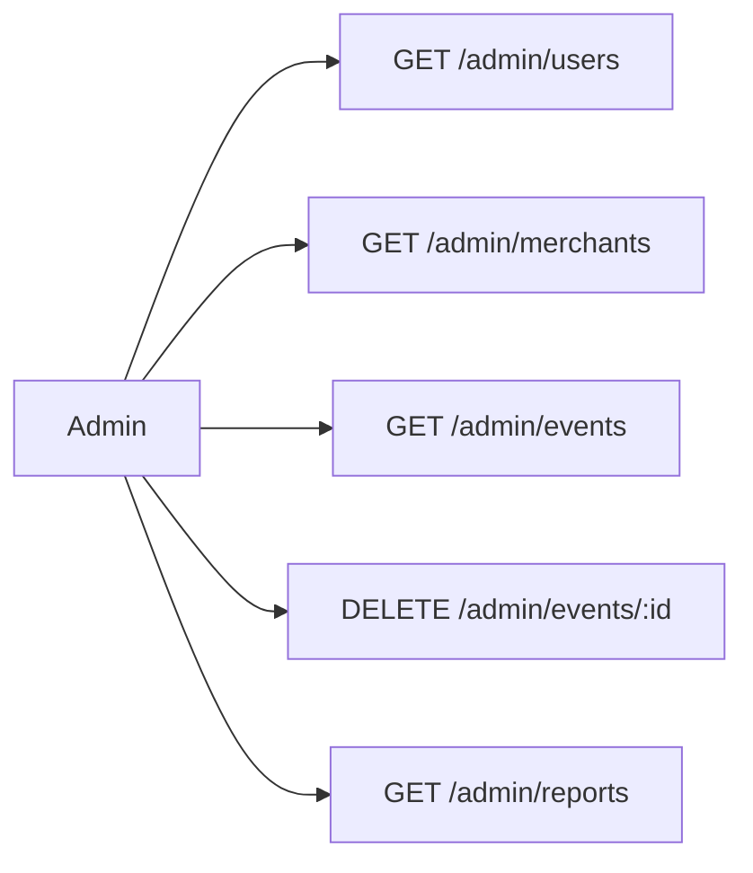
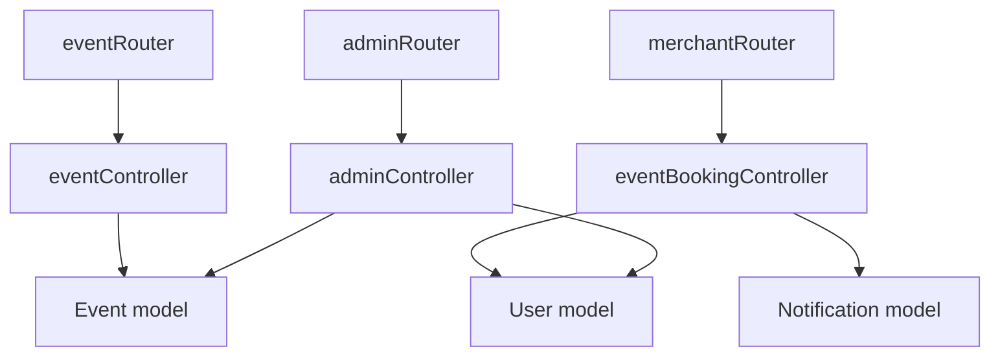

# Event Approval Workflow

<cite>
**Referenced Files in This Document**
- [eventSchema.js](file://backend/models/eventSchema.js)
- [userSchema.js](file://backend/models/userSchema.js)
- [notificationSchema.js](file://backend/models/notificationSchema.js)
- [eventController.js](file://backend/controller/eventController.js)
- [eventBookingController.js](file://backend/controller/eventBookingController.js)
- [merchantRouter.js](file://backend/router/merchantRouter.js)
- [eventRouter.js](file://backend/router/eventRouter.js)
- [adminRouter.js](file://backend/router/adminRouter.js)
- [adminController.js](file://backend/controller/adminController.js)
- [roleMiddleware.js](file://backend/middleware/roleMiddleware.js)
</cite>

## Table of Contents
1. [Introduction](#introduction)
2. [Project Structure](#project-structure)
3. [Core Components](#core-components)
4. [Architecture Overview](#architecture-overview)
5. [Detailed Component Analysis](#detailed-component-analysis)
6. [Dependency Analysis](#dependency-analysis)
7. [Performance Considerations](#performance-considerations)
8. [Troubleshooting Guide](#troubleshooting-guide)
9. [Conclusion](#conclusion)

## Introduction
This document explains the event approval and moderation workflow in the system. It covers how events and bookings are submitted, reviewed, approved, and published; who can act in each role; how notifications are triggered; and how administrative oversight is implemented. It also outlines the current state of approval logic, identifies gaps (such as missing event-level approvals), and proposes practical improvements for automated thresholds and manual review processes.

## Project Structure
The approval workflow spans several backend modules:
- Models define the data structures for events, users, and notifications.
- Controllers implement the business logic for event creation, booking creation, and merchant/admin actions.
- Routers expose endpoints gated by authentication and role middleware.
- Middleware enforces role-based access control.

**Diagram sources**
- [eventSchema.js:1-51](file://backend/models/eventSchema.js#L1-L51)
- [userSchema.js:1-55](file://backend/models/userSchema.js#L1-L55)
- [notificationSchema.js:1-36](file://backend/models/notificationSchema.js#L1-L36)
- [eventController.js:1-35](file://backend/controller/eventController.js#L1-L35)
- [eventBookingController.js:1-200](file://backend/controller/eventBookingController.js#L1-L200)
- [merchantRouter.js:1-17](file://backend/router/merchantRouter.js#L1-L17)
- [eventRouter.js:1-13](file://backend/router/eventRouter.js#L1-L13)
- [adminRouter.js:1-29](file://backend/router/adminRouter.js#L1-L29)
- [roleMiddleware.js:1-9](file://backend/middleware/roleMiddleware.js#L1-L9)

**Section sources**
- [eventSchema.js:1-51](file://backend/models/eventSchema.js#L1-L51)
- [userSchema.js:1-55](file://backend/models/userSchema.js#L1-L55)
- [notificationSchema.js:1-36](file://backend/models/notificationSchema.js#L1-L36)
- [eventController.js:1-35](file://backend/controller/eventController.js#L1-L35)
- [eventBookingController.js:1-200](file://backend/controller/eventBookingController.js#L1-L200)
- [merchantRouter.js:1-17](file://backend/router/merchantRouter.js#L1-L17)
- [eventRouter.js:1-13](file://backend/router/eventRouter.js#L1-L13)
- [adminRouter.js:1-29](file://backend/router/adminRouter.js#L1-L29)
- [roleMiddleware.js:1-9](file://backend/middleware/roleMiddleware.js#L1-L9)

## Core Components
- Event model: Defines event metadata, type (full-service or ticketed), and status lifecycle. It does not currently include an explicit approval status field.
- User model: Supports roles (user, admin, merchant) and account status.
- Notification model: Stores user-facing messages with optional event and booking linkage.
- Event controller: Provides listing and registration endpoints; no event creation/moderation endpoints are present in this controller.
- Event booking controller: Implements full-service and ticketed booking flows, including merchant acceptance, rejection, completion, and payment processing.
- Merchant router: Exposes merchant-only endpoints for event CRUD and participant listing.
- Admin router: Exposes admin-only endpoints for listing users, merchants, events, and reports.
- Role middleware: Enforces role-based access control across routers.

Key observations:
- There is no event-level approval endpoint in the current codebase. Event creation appears to be merchant-only and does not require admin approval.
- Booking approval is handled per-booking via merchant actions (accept/reject) for full-service events.

**Section sources**
- [eventSchema.js:1-51](file://backend/models/eventSchema.js#L1-L51)
- [userSchema.js:1-55](file://backend/models/userSchema.js#L1-L55)
- [notificationSchema.js:1-36](file://backend/models/notificationSchema.js#L1-L36)
- [eventController.js:1-35](file://backend/controller/eventController.js#L1-L35)
- [eventBookingController.js:1-200](file://backend/controller/eventBookingController.js#L1-L200)
- [merchantRouter.js:1-17](file://backend/router/merchantRouter.js#L1-L17)
- [adminRouter.js:1-29](file://backend/router/adminRouter.js#L1-L29)
- [roleMiddleware.js:1-9](file://backend/middleware/roleMiddleware.js#L1-L9)

## Architecture Overview
The approval and moderation architecture centers on:
- Merchant-initiated event creation and management.
- Full-service booking requiring merchant approval; ticketed booking bypasses merchant approval.
- Administrative oversight via admin endpoints for listing and moderation actions.
- Notifications triggered upon booking state transitions.

**Diagram sources**
- [eventRouter.js:1-13](file://backend/router/eventRouter.js#L1-L13)
- [eventController.js:1-35](file://backend/controller/eventController.js#L1-L35)
- [merchantRouter.js:1-17](file://backend/router/merchantRouter.js#L1-L17)
- [eventBookingController.js:75-200](file://backend/controller/eventBookingController.js#L75-L200)
- [notificationSchema.js:1-36](file://backend/models/notificationSchema.js#L1-L36)
- [userSchema.js:1-55](file://backend/models/userSchema.js#L1-L55)

## Detailed Component Analysis

### Event Model and Status Lifecycle
- Fields relevant to moderation:
  - eventType: full-service or ticketed.
  - status: active, inactive, completed.
- Current state: Events do not carry an explicit approval status. They are created by merchants and listed publicly via the events endpoint.

Recommendation:
- Introduce an approvalStatus field (e.g., pending, approved, rejected) on the Event model to formalize moderation.
- Add admin endpoints to approve or reject events and integrate with notifications.

**Section sources**
- [eventSchema.js:1-51](file://backend/models/eventSchema.js#L1-L51)

### Role-Based Access Control
- ensureRole middleware checks the authenticated user’s role against required roles.
- Event endpoints require user role for registration.
- Merchant endpoints require merchant role for event management.
- Admin endpoints require admin role for listing users, merchants, events, and reports.

**Diagram sources**
- [roleMiddleware.js:1-9](file://backend/middleware/roleMiddleware.js#L1-L9)
- [eventRouter.js:1-13](file://backend/router/eventRouter.js#L1-L13)
- [merchantRouter.js:1-17](file://backend/router/merchantRouter.js#L1-L17)
- [adminRouter.js:1-29](file://backend/router/adminRouter.js#L1-L29)

**Section sources**
- [roleMiddleware.js:1-9](file://backend/middleware/roleMiddleware.js#L1-L9)
- [eventRouter.js:1-13](file://backend/router/eventRouter.js#L1-L13)
- [merchantRouter.js:1-17](file://backend/router/merchantRouter.js#L1-L17)
- [adminRouter.js:1-29](file://backend/router/adminRouter.js#L1-L29)

### Booking Approval Workflow (Full-Service Events)
- Creation: Full-service booking is created with pending status and paymentStatus set to pending.
- Acceptance: Merchant can accept a pending booking, transitioning it to confirmed and processing, and notifying the user.
- Rejection: Merchant can reject a pending booking, marking it cancelled and optionally attaching a rejection reason.
- Completion: Merchant completes confirmed and paid bookings, notifying the user to rate and review.

**Diagram sources**
- [eventBookingController.js:75-200](file://backend/controller/eventBookingController.js#L75-L200)
- [eventBookingController.js:900-1099](file://backend/controller/eventBookingController.js#L900-L1099)
- [notificationSchema.js:1-36](file://backend/models/notificationSchema.js#L1-L36)

**Section sources**
- [eventBookingController.js:75-200](file://backend/controller/eventBookingController.js#L75-L200)
- [eventBookingController.js:900-1099](file://backend/controller/eventBookingController.js#L900-L1099)
- [notificationSchema.js:1-36](file://backend/models/notificationSchema.js#L1-L36)

### Ticketed Events and Approval
- Ticketed events route through a separate handler and do not require merchant approval; payment is processed directly.
- The current code does not implement merchant approval for ticketed events.

Recommendation:
- If ticketed events require approval, introduce an approval step similar to full-service events and update the ticketed booking handler accordingly.

**Section sources**
- [eventBookingController.js:1-200](file://backend/controller/eventBookingController.js#L1-L200)

### Administrative Oversight
- Admin endpoints support listing users, merchants, events, and generating reports.
- Admin can delete events and registrations, enabling moderation actions.

**Diagram sources**
- [adminRouter.js:1-29](file://backend/router/adminRouter.js#L1-L29)
- [adminController.js:89-177](file://backend/controller/adminController.js#L89-L177)

**Section sources**
- [adminRouter.js:1-29](file://backend/router/adminRouter.js#L1-L29)
- [adminController.js:89-177](file://backend/controller/adminController.js#L89-L177)

### Notification System for Approval Actions
- Notifications are created during booking state transitions:
  - booking_accepted
  - booking_rejected
  - booking_completed
- Notifications include user, message, optional eventId, and bookingId.

Recommendation:
- Extend notifications to include event-level moderation actions (e.g., event_approved, event_rejected) when implementing event approval.

**Section sources**
- [notificationSchema.js:1-36](file://backend/models/notificationSchema.js#L1-L36)
- [eventBookingController.js:900-1099](file://backend/controller/eventBookingController.js#L900-L1099)

### Audit Trails for Moderation Activities
- Current code does not persist explicit audit logs for moderation decisions.
- Recommendations:
  - Add an AuditLog model to record admin actions (approve/reject events/bookings), reasons, timestamps, and actor details.
  - Store association with affected records (event or booking).

[No sources needed since this section provides general guidance]

## Dependency Analysis
- Controllers depend on models for data access and on the notification model for user communication.
- Routers depend on controllers and enforce role-based access via ensureRole.
- The event booking controller orchestrates the full-service approval flow and interacts with notifications.

**Diagram sources**
- [eventRouter.js:1-13](file://backend/router/eventRouter.js#L1-L13)
- [merchantRouter.js:1-17](file://backend/router/merchantRouter.js#L1-L17)
- [adminRouter.js:1-29](file://backend/router/adminRouter.js#L1-L29)
- [eventController.js:1-35](file://backend/controller/eventController.js#L1-L35)
- [eventBookingController.js:1-200](file://backend/controller/eventBookingController.js#L1-L200)
- [adminController.js:1-194](file://backend/controller/adminController.js#L1-L194)
- [eventSchema.js:1-51](file://backend/models/eventSchema.js#L1-L51)
- [userSchema.js:1-55](file://backend/models/userSchema.js#L1-L55)
- [notificationSchema.js:1-36](file://backend/models/notificationSchema.js#L1-L36)

**Section sources**
- [eventRouter.js:1-13](file://backend/router/eventRouter.js#L1-L13)
- [merchantRouter.js:1-17](file://backend/router/merchantRouter.js#L1-L17)
- [adminRouter.js:1-29](file://backend/router/adminRouter.js#L1-L29)
- [eventController.js:1-35](file://backend/controller/eventController.js#L1-L35)
- [eventBookingController.js:1-200](file://backend/controller/eventBookingController.js#L1-L200)
- [adminController.js:1-194](file://backend/controller/adminController.js#L1-L194)
- [eventSchema.js:1-51](file://backend/models/eventSchema.js#L1-L51)
- [userSchema.js:1-55](file://backend/models/userSchema.js#L1-L55)
- [notificationSchema.js:1-36](file://backend/models/notificationSchema.js#L1-L36)

## Performance Considerations
- Batch operations: Admin report generation aggregates counts and sums; ensure indexes on frequently queried fields (e.g., createdAt, paymentStatus).
- Notification creation: Consider queuing notifications asynchronously to avoid blocking request-response cycles.
- Event listing: Add pagination and filtering to reduce payload sizes for large datasets.

[No sources needed since this section provides general guidance]

## Troubleshooting Guide
Common issues and resolutions:
- Missing eventId or invalid event type during booking creation:
  - Ensure eventId is provided and corresponds to an existing event.
  - Verify event.eventType is either full-service or ticketed.
- Unauthorized access:
  - Confirm the user has the correct role (user for registration, merchant for event management, admin for admin endpoints).
- Pending booking operations:
  - Only pending bookings can be accepted or rejected; confirm booking status before invoking these endpoints.
- Notification failures:
  - Log errors during notification creation and retry mechanisms if needed.

**Section sources**
- [eventBookingController.js:1-200](file://backend/controller/eventBookingController.js#L1-L200)
- [eventBookingController.js:900-1099](file://backend/controller/eventBookingController.js#L900-L1099)
- [roleMiddleware.js:1-9](file://backend/middleware/roleMiddleware.js#L1-L9)

## Conclusion
The current system implements a robust booking approval workflow for full-service events through merchant actions, with clear notifications and administrative oversight capabilities. However, event-level approval is not implemented in code. To align with the documentation objective, the following enhancements are recommended:
- Introduce an approvalStatus field on the Event model and admin endpoints to approve/reject events.
- Define standardized approval criteria and rejection reasons.
- Implement automated thresholds (e.g., flagging suspicious events) and escalation to manual review.
- Enhance notifications and audit logs for event moderation actions.
- Optionally extend merchant approval to ticketed events if required by policy.

[No sources needed since this section summarizes without analyzing specific files]