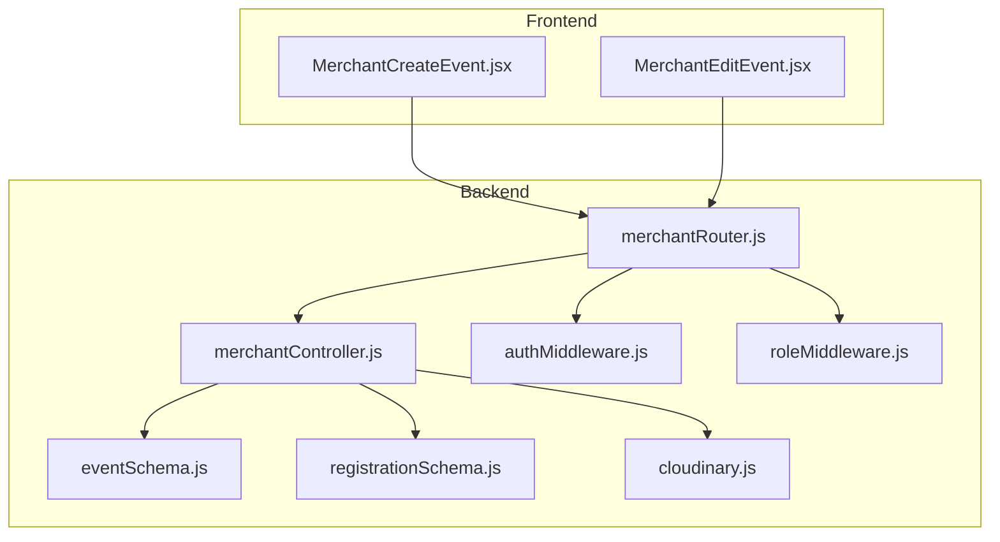
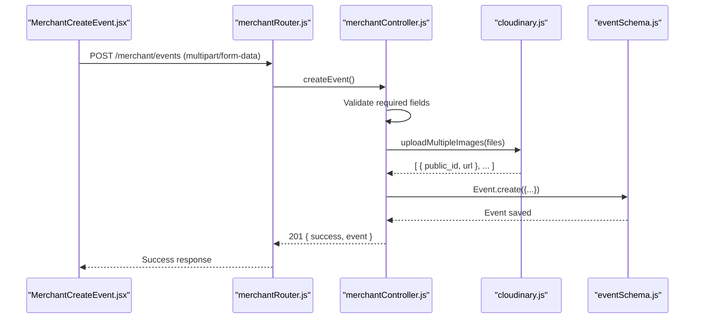
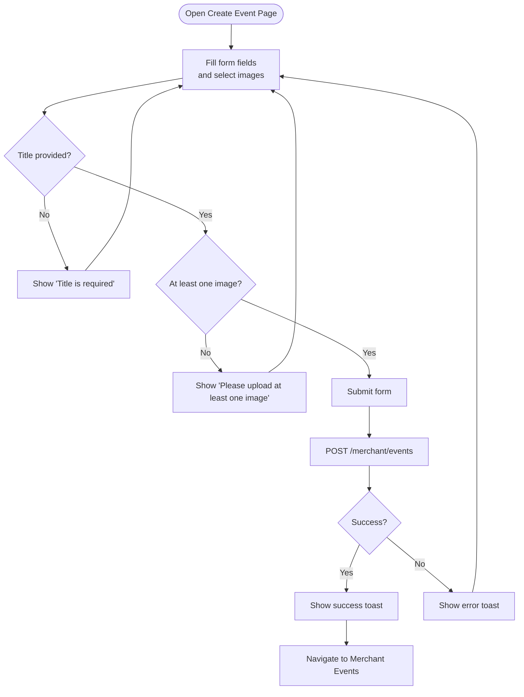
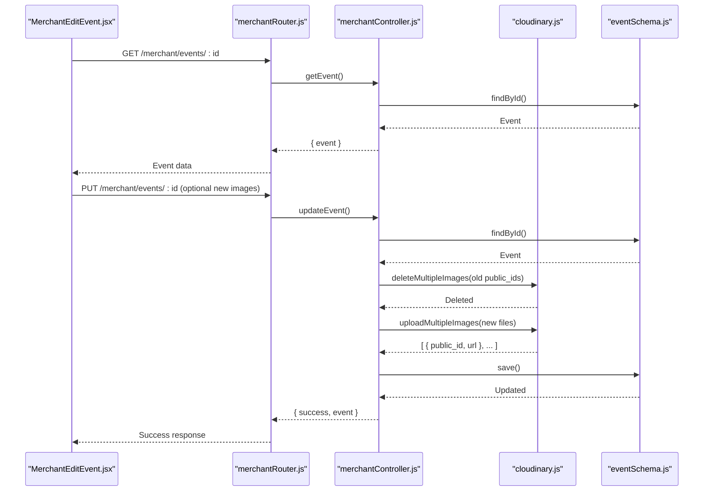
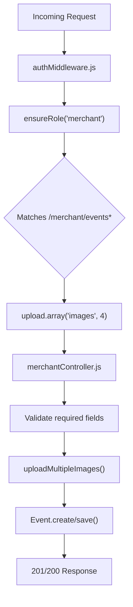
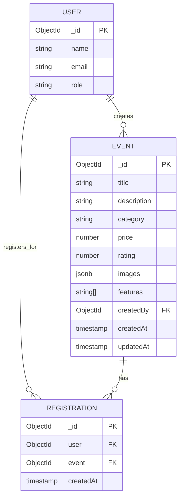
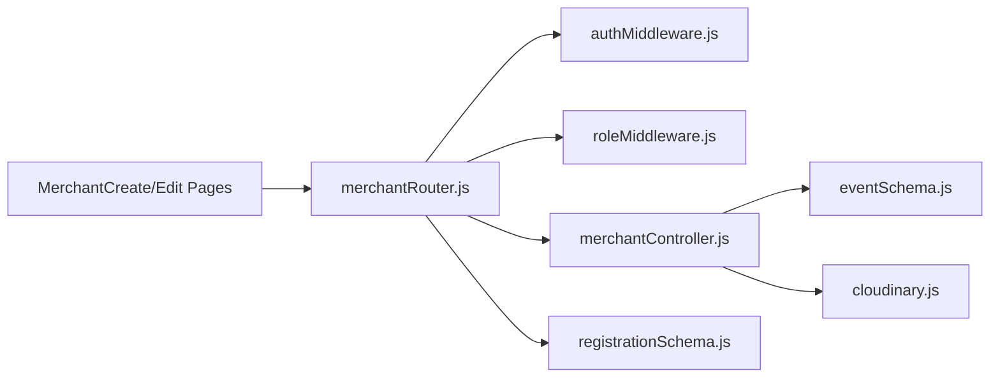

# Event Creation Workflow

<cite>
**Referenced Files in This Document**
- [MerchantCreateEvent.jsx](file://frontend/src/pages/dashboards/MerchantCreateEvent.jsx)
- [MerchantEditEvent.jsx](file://frontend/src/pages/dashboards/MerchantEditEvent.jsx)
- [merchantRouter.js](file://backend/router/merchantRouter.js)
- [merchantController.js](file://backend/controller/merchantController.js)
- [eventSchema.js](file://backend/models/eventSchema.js)
- [cloudinary.js](file://backend/util/cloudinary.js)
- [authMiddleware.js](file://backend/middleware/authMiddleware.js)
- [roleMiddleware.js](file://backend/middleware/roleMiddleware.js)
- [eventController.js](file://backend/controller/eventController.js)
- [eventRouter.js](file://backend/router/eventRouter.js)
- [registrationSchema.js](file://backend/models/registrationSchema.js)
</cite>

## Table of Contents
1. [Introduction](#introduction)
2. [Project Structure](#project-structure)
3. [Core Components](#core-components)
4. [Architecture Overview](#architecture-overview)
5. [Detailed Component Analysis](#detailed-component-analysis)
6. [Dependency Analysis](#dependency-analysis)
7. [Performance Considerations](#performance-considerations)
8. [Troubleshooting Guide](#troubleshooting-guide)
9. [Conclusion](#conclusion)

## Introduction
This document explains the complete event creation and management workflow for merchants, from form submission to event publication. It covers the merchant event creation interface, form validation, image uploads, preview functionality, event editing, and lifecycle management. It also documents the backend validation, authorization, and image handling via Cloudinary, along with user registration and participation tracking.

## Project Structure
The event workflow spans the frontend React dashboard and the backend Node.js/Express API:
- Frontend: MerchantCreateEvent and MerchantEditEvent pages manage form input, validation, image previews, and submission.
- Backend: Merchant routes and controller enforce authorization, validate inputs, handle image uploads to Cloudinary, and persist events.
- Models: Event schema defines the data structure; Registration tracks user event sign-ups.
- Utilities: Cloudinary integration handles secure image storage and deletion.
- Middleware: Authentication and role-based access control protect endpoints.

**Diagram sources**
- [MerchantCreateEvent.jsx](file://frontend/src/pages/dashboards/MerchantCreateEvent.jsx)
- [MerchantEditEvent.jsx](file://frontend/src/pages/dashboards/MerchantEditEvent.jsx)
- [merchantRouter.js](file://backend/router/merchantRouter.js)
- [merchantController.js](file://backend/controller/merchantController.js)
- [eventSchema.js](file://backend/models/eventSchema.js)
- [registrationSchema.js](file://backend/models/registrationSchema.js)
- [cloudinary.js](file://backend/util/cloudinary.js)
- [authMiddleware.js](file://backend/middleware/authMiddleware.js)
- [roleMiddleware.js](file://backend/middleware/roleMiddleware.js)

**Section sources**
- [MerchantCreateEvent.jsx](file://frontend/src/pages/dashboards/MerchantCreateEvent.jsx)
- [MerchantEditEvent.jsx](file://frontend/src/pages/dashboards/MerchantEditEvent.jsx)
- [merchantRouter.js](file://backend/router/merchantRouter.js)
- [merchantController.js](file://backend/controller/merchantController.js)
- [eventSchema.js](file://backend/models/eventSchema.js)
- [cloudinary.js](file://backend/util/cloudinary.js)
- [authMiddleware.js](file://backend/middleware/authMiddleware.js)
- [roleMiddleware.js](file://backend/middleware/roleMiddleware.js)
- [eventController.js](file://backend/controller/eventController.js)
- [eventRouter.js](file://backend/router/eventRouter.js)
- [registrationSchema.js](file://backend/models/registrationSchema.js)

## Core Components
- MerchantCreateEvent page: Collects event metadata, manages feature lists, validates inputs, handles image selection and previews, and submits to backend.
- MerchantEditEvent page: Loads existing event data, supports adding/removing images, updates metadata, and persists changes.
- Merchant routes: Expose POST /merchant/events (create) and PUT /merchant/events/:id (update), enforcing authentication and merchant role.
- Merchant controller: Validates required fields, parses features, uploads images to Cloudinary, and persists events with createdBy linkage.
- Event model: Defines schema with title, description, category, price, rating, images array, features array, and createdBy reference.
- Cloudinary utility: Configures Multer/Cloudinary for secure uploads, transformations, and deletions.
- Auth and role middleware: Enforce JWT-based authentication and merchant role checks.
- Event registration: Separate endpoints for user registration and listing registrations; not part of creation workflow but relevant for lifecycle.

**Section sources**
- [MerchantCreateEvent.jsx](file://frontend/src/pages/dashboards/MerchantCreateEvent.jsx)
- [MerchantEditEvent.jsx](file://frontend/src/pages/dashboards/MerchantEditEvent.jsx)
- [merchantRouter.js](file://backend/router/merchantRouter.js)
- [merchantController.js](file://backend/controller/merchantController.js)
- [eventSchema.js](file://backend/models/eventSchema.js)
- [cloudinary.js](file://backend/util/cloudinary.js)
- [authMiddleware.js](file://backend/middleware/authMiddleware.js)
- [roleMiddleware.js](file://backend/middleware/roleMiddleware.js)
- [eventController.js](file://backend/controller/eventController.js)
- [eventRouter.js](file://backend/router/eventRouter.js)
- [registrationSchema.js](file://backend/models/registrationSchema.js)

## Architecture Overview
The workflow follows a clear client-server pattern:
- Frontend captures merchant inputs and images, validates locally, and sends multipart/form-data to backend.
- Backend authenticates the merchant, enforces role, validates required fields, uploads images to Cloudinary, and stores the event record with createdBy set to the merchant’s user ID.
- Optional user registration endpoints support event participation tracking.

**Diagram sources**
- [MerchantCreateEvent.jsx](file://frontend/src/pages/dashboards/MerchantCreateEvent.jsx)
- [merchantRouter.js](file://backend/router/merchantRouter.js)
- [merchantController.js](file://backend/controller/merchantController.js)
- [cloudinary.js](file://backend/util/cloudinary.js)
- [eventSchema.js](file://backend/models/eventSchema.js)

## Detailed Component Analysis

### Merchant Event Creation Interface
Key behaviors:
- Form fields: title (required), description, category, price, rating, features list.
- Image handling: accepts up to four images under 5 MB each; previews generated client-side; enforces total image cap.
- Validation: title must be present and non-empty; at least one image required.
- Submission: constructs FormData and posts to backend with Authorization header.

**Diagram sources**
- [MerchantCreateEvent.jsx](file://frontend/src/pages/dashboards/MerchantCreateEvent.jsx)

**Section sources**
- [MerchantCreateEvent.jsx](file://frontend/src/pages/dashboards/MerchantCreateEvent.jsx)

### Merchant Event Editing Interface
Key behaviors:
- Loads existing event data on mount; separates existing images from new uploads.
- Supports removing existing images and adding new ones while maintaining the 4-image cap.
- Submits updates via PUT with optional new images; existing images are replaced if new files are provided.

**Diagram sources**
- [MerchantEditEvent.jsx](file://frontend/src/pages/dashboards/MerchantEditEvent.jsx)
- [merchantRouter.js](file://backend/router/merchantRouter.js)
- [merchantController.js](file://backend/controller/merchantController.js)
- [cloudinary.js](file://backend/util/cloudinary.js)
- [eventSchema.js](file://backend/models/eventSchema.js)

**Section sources**
- [MerchantEditEvent.jsx](file://frontend/src/pages/dashboards/MerchantEditEvent.jsx)

### Backend Authorization and Validation
- Authentication: JWT token extracted from Authorization header; verified against secret.
- Role enforcement: Only users with merchant role can access merchant endpoints.
- Request parsing: Multer uploads images to Cloudinary storage; controller reads form fields and files.
- Validation: Title required; images handled via Cloudinary; features parsed from string or array.

**Diagram sources**
- [authMiddleware.js](file://backend/middleware/authMiddleware.js)
- [roleMiddleware.js](file://backend/middleware/roleMiddleware.js)
- [merchantRouter.js](file://backend/router/merchantRouter.js)
- [merchantController.js](file://backend/controller/merchantController.js)
- [cloudinary.js](file://backend/util/cloudinary.js)
- [eventSchema.js](file://backend/models/eventSchema.js)

**Section sources**
- [authMiddleware.js](file://backend/middleware/authMiddleware.js)
- [roleMiddleware.js](file://backend/middleware/roleMiddleware.js)
- [merchantRouter.js](file://backend/router/merchantRouter.js)
- [merchantController.js](file://backend/controller/merchantController.js)
- [cloudinary.js](file://backend/util/cloudinary.js)
- [eventSchema.js](file://backend/models/eventSchema.js)

### Data Model and Lifecycle
- Event schema includes title, description, category, price, rating, images array, features array, and createdBy reference.
- Registration model links users to events for participation tracking.
- User registration endpoints exist separately; merchant endpoints focus on creation/update and participant listing.

**Diagram sources**
- [eventSchema.js](file://backend/models/eventSchema.js)
- [registrationSchema.js](file://backend/models/registrationSchema.js)

**Section sources**
- [eventSchema.js](file://backend/models/eventSchema.js)
- [registrationSchema.js](file://backend/models/registrationSchema.js)
- [eventController.js](file://backend/controller/eventController.js)
- [eventRouter.js](file://backend/router/eventRouter.js)

## Dependency Analysis
- Frontend depends on:
  - HTTP client for API calls
  - Auth context for tokens
  - Icons and toast notifications
- Backend depends on:
  - JWT for auth
  - Cloudinary for image storage
  - Multer for file uploads
  - Mongoose for data persistence
- Routes depend on middleware for auth and role enforcement.

**Diagram sources**
- [MerchantCreateEvent.jsx](file://frontend/src/pages/dashboards/MerchantCreateEvent.jsx)
- [MerchantEditEvent.jsx](file://frontend/src/pages/dashboards/MerchantEditEvent.jsx)
- [merchantRouter.js](file://backend/router/merchantRouter.js)
- [authMiddleware.js](file://backend/middleware/authMiddleware.js)
- [roleMiddleware.js](file://backend/middleware/roleMiddleware.js)
- [merchantController.js](file://backend/controller/merchantController.js)
- [eventSchema.js](file://backend/models/eventSchema.js)
- [cloudinary.js](file://backend/util/cloudinary.js)
- [registrationSchema.js](file://backend/models/registrationSchema.js)

**Section sources**
- [merchantRouter.js](file://backend/router/merchantRouter.js)
- [merchantController.js](file://backend/controller/merchantController.js)
- [cloudinary.js](file://backend/util/cloudinary.js)
- [authMiddleware.js](file://backend/middleware/authMiddleware.js)
- [roleMiddleware.js](file://backend/middleware/roleMiddleware.js)
- [eventSchema.js](file://backend/models/eventSchema.js)
- [registrationSchema.js](file://backend/models/registrationSchema.js)

## Performance Considerations
- Image optimization: Cloudinary applies transformations and limits file sizes to reduce bandwidth and storage costs.
- Batch uploads: Multiple images are uploaded concurrently via Promise.all for improved throughput.
- Client-side previews: Generating previews avoids unnecessary network requests until submission.
- Validation early exit: Frontend and backend validations prevent unnecessary processing on invalid inputs.

## Troubleshooting Guide
Common issues and resolutions:
- Unauthorized or forbidden:
  - Ensure a valid Bearer token is included and the user role is merchant.
  - Verify JWT_SECRET and Cloudinary credentials are configured.
- Missing required fields:
  - Title must be present; at least one image is required for creation.
  - Features can be provided as JSON string or comma-separated values; controller attempts both parsing strategies.
- Image upload failures:
  - Confirm Cloudinary configuration (cloud name, API key, secret) and that files are images under 5 MB.
  - On edits, replacing images triggers deletion of old Cloudinary resources; ensure public IDs are valid.
- Network errors:
  - Inspect request payload and headers; check backend logs for detailed error messages.

**Section sources**
- [merchantController.js](file://backend/controller/merchantController.js)
- [cloudinary.js](file://backend/util/cloudinary.js)
- [authMiddleware.js](file://backend/middleware/authMiddleware.js)
- [roleMiddleware.js](file://backend/middleware/roleMiddleware.js)
- [MerchantCreateEvent.jsx](file://frontend/src/pages/dashboards/MerchantCreateEvent.jsx)
- [MerchantEditEvent.jsx](file://frontend/src/pages/dashboards/MerchantEditEvent.jsx)

## Conclusion
The event creation and management workflow integrates a robust frontend form experience with secure backend validation and Cloudinary-powered image handling. Merchant endpoints enforce authentication and role checks, ensuring only authorized users can create or update events. The system supports flexible feature lists, image previews, and lifecycle management through editing and participant tracking.