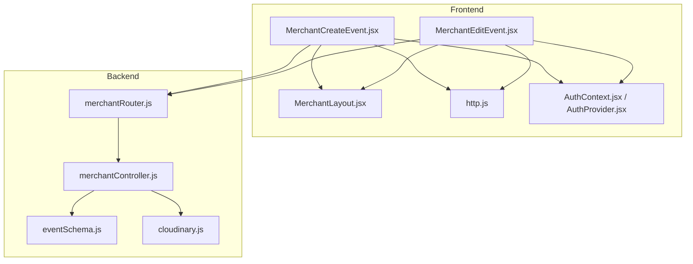
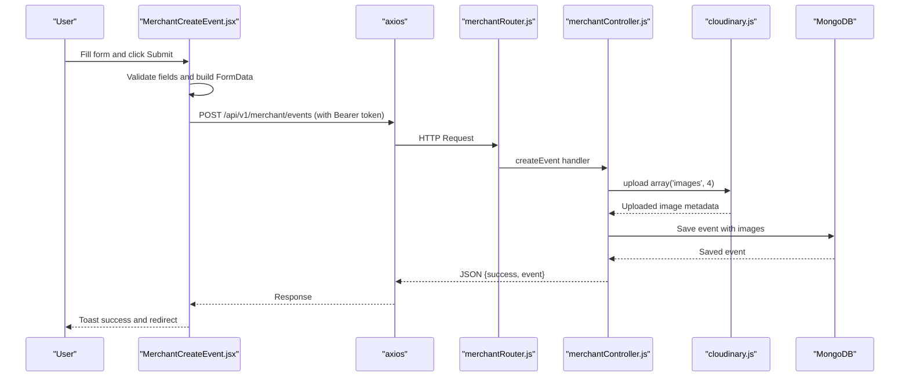
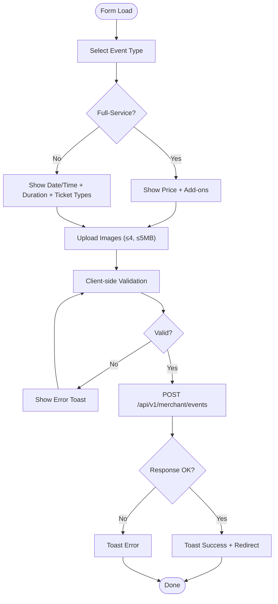
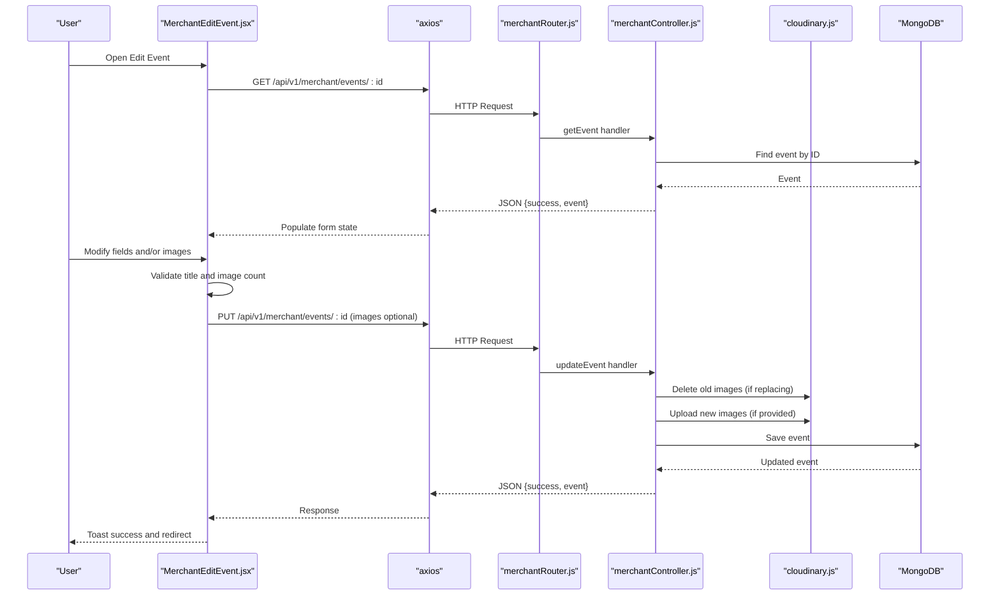
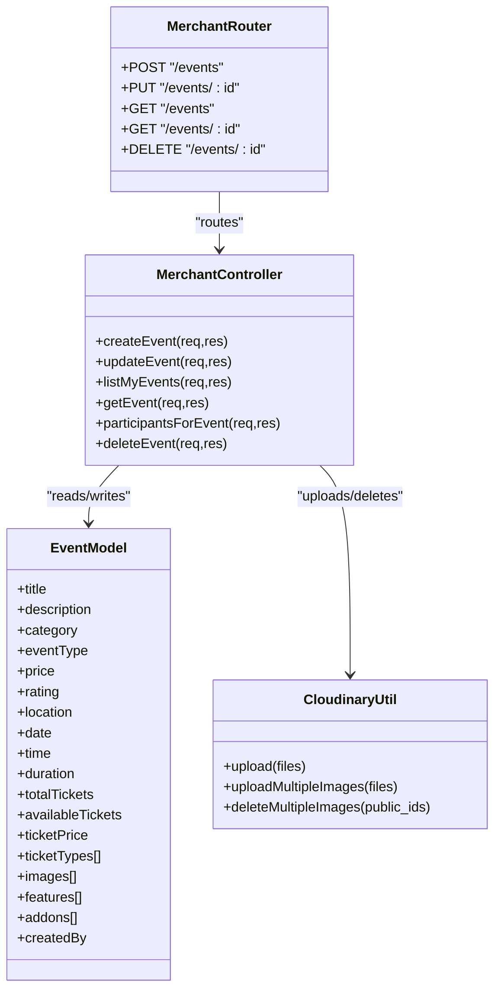
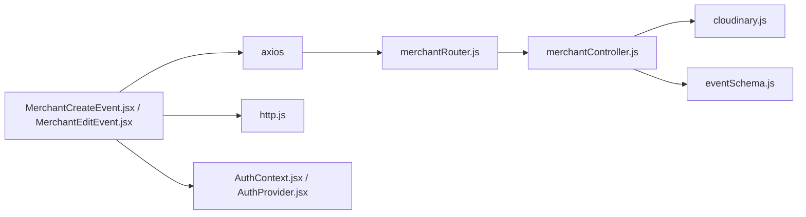

# Event Form Interface

<cite>
**Referenced Files in This Document**
- [MerchantCreateEvent.jsx](file://frontend/src/pages/dashboards/MerchantCreateEvent.jsx)
- [MerchantEditEvent.jsx](file://frontend/src/pages/dashboards/MerchantEditEvent.jsx)
- [merchantRouter.js](file://backend/router/merchantRouter.js)
- [merchantController.js](file://backend/controller/merchantController.js)
- [eventSchema.js](file://backend/models/eventSchema.js)
- [cloudinary.js](file://backend/util/cloudinary.js)
- [http.js](file://frontend/src/lib/http.js)
- [MerchantLayout.jsx](file://frontend/src/components/merchant/MerchantLayout.jsx)
- [AuthContext.jsx](file://frontend/src/context/AuthContext.jsx)
- [AuthProvider.jsx](file://frontend/src/context/AuthProvider.jsx)
</cite>

## Table of Contents
1. [Introduction](#introduction)
2. [Project Structure](#project-structure)
3. [Core Components](#core-components)
4. [Architecture Overview](#architecture-overview)
5. [Detailed Component Analysis](#detailed-component-analysis)
6. [Dependency Analysis](#dependency-analysis)
7. [Performance Considerations](#performance-considerations)
8. [Troubleshooting Guide](#troubleshooting-guide)
9. [Conclusion](#conclusion)

## Introduction
This document provides comprehensive documentation for the merchant event creation and editing form interface. It covers form fields, validation rules, input types, user experience patterns, submission flow, real-time validation feedback, error handling, backend API integration for form data and image uploads, responsive design considerations, form state management, and user guidance. The goal is to enable developers and stakeholders to understand, maintain, and extend the event form capabilities effectively.

## Project Structure
The event form interface spans the frontend React application and the backend Node.js/Express API. Key areas include:
- Frontend pages for creating and editing events
- Authentication context for protected routes
- Merchant layout wrapper for consistent navigation
- Backend routes and controllers for event CRUD operations
- Database model defining event schema
- Cloudinary integration for secure image uploads

**Diagram sources**
- [MerchantCreateEvent.jsx:1-640](file://frontend/src/pages/dashboards/MerchantCreateEvent.jsx#L1-L640)
- [MerchantEditEvent.jsx:1-413](file://frontend/src/pages/dashboards/MerchantEditEvent.jsx#L1-L413)
- [MerchantLayout.jsx:1-29](file://frontend/src/components/merchant/MerchantLayout.jsx#L1-L29)
- [http.js:1-5](file://frontend/src/lib/http.js#L1-L5)
- [AuthContext.jsx:1-3](file://frontend/src/context/AuthContext.jsx#L1-L3)
- [AuthProvider.jsx:1-38](file://frontend/src/context/AuthProvider.jsx#L1-L38)
- [merchantRouter.js:1-17](file://backend/router/merchantRouter.js#L1-L17)
- [merchantController.js:1-209](file://backend/controller/merchantController.js#L1-L209)
- [eventSchema.js:1-51](file://backend/models/eventSchema.js#L1-L51)
- [cloudinary.js:1-112](file://backend/util/cloudinary.js#L1-L112)

**Section sources**
- [MerchantCreateEvent.jsx:1-640](file://frontend/src/pages/dashboards/MerchantCreateEvent.jsx#L1-L640)
- [MerchantEditEvent.jsx:1-413](file://frontend/src/pages/dashboards/MerchantEditEvent.jsx#L1-L413)
- [merchantRouter.js:1-17](file://backend/router/merchantRouter.js#L1-L17)
- [merchantController.js:1-209](file://backend/controller/merchantController.js#L1-L209)
- [eventSchema.js:1-51](file://backend/models/eventSchema.js#L1-L51)
- [cloudinary.js:1-112](file://backend/util/cloudinary.js#L1-L112)
- [http.js:1-5](file://frontend/src/lib/http.js#L1-L5)
- [MerchantLayout.jsx:1-29](file://frontend/src/components/merchant/MerchantLayout.jsx#L1-L29)
- [AuthContext.jsx:1-3](file://frontend/src/context/AuthContext.jsx#L1-L3)
- [AuthProvider.jsx:1-38](file://frontend/src/context/AuthProvider.jsx#L1-L38)

## Core Components
- MerchantCreateEvent: Full-service and ticketed event creation with dynamic fields, validation, and image upload.
- MerchantEditEvent: Edit existing events with image replacement and feature management.
- MerchantLayout: Merchant dashboard layout wrapper.
- Backend Routes and Controllers: REST endpoints for creating/updating/deleting/listing events and participant management.
- Database Model: Event schema supporting both event types and related fields.
- Cloudinary Utility: Multer-based upload pipeline with Cloudinary integration and image transformations.
- HTTP Utilities and Auth Context: API base URL and bearer token injection; authentication state management.

**Section sources**
- [MerchantCreateEvent.jsx:1-640](file://frontend/src/pages/dashboards/MerchantCreateEvent.jsx#L1-L640)
- [MerchantEditEvent.jsx:1-413](file://frontend/src/pages/dashboards/MerchantEditEvent.jsx#L1-L413)
- [merchantRouter.js:1-17](file://backend/router/merchantRouter.js#L1-L17)
- [merchantController.js:1-209](file://backend/controller/merchantController.js#L1-L209)
- [eventSchema.js:1-51](file://backend/models/eventSchema.js#L1-L51)
- [cloudinary.js:1-112](file://backend/util/cloudinary.js#L1-L112)
- [http.js:1-5](file://frontend/src/lib/http.js#L1-L5)
- [MerchantLayout.jsx:1-29](file://frontend/src/components/merchant/MerchantLayout.jsx#L1-L29)
- [AuthContext.jsx:1-3](file://frontend/src/context/AuthContext.jsx#L1-L3)
- [AuthProvider.jsx:1-38](file://frontend/src/context/AuthProvider.jsx#L1-L38)

## Architecture Overview
The form integrates frontend state management with backend APIs secured via JWT tokens. Image uploads leverage Cloudinary through a Multer storage adapter configured in the backend.

**Diagram sources**
- [MerchantCreateEvent.jsx:159-220](file://frontend/src/pages/dashboards/MerchantCreateEvent.jsx#L159-L220)
- [http.js:1-5](file://frontend/src/lib/http.js#L1-L5)
- [merchantRouter.js:9-9](file://backend/router/merchantRouter.js#L9-L9)
- [merchantController.js:5-98](file://backend/controller/merchantController.js#L5-L98)
- [cloudinary.js:46-58](file://backend/util/cloudinary.js#L46-L58)
- [eventSchema.js:3-48](file://backend/models/eventSchema.js#L3-L48)

## Detailed Component Analysis

### MerchantCreateEvent: Event Creation Form
- Purpose: Allow merchants to create either full-service or ticketed events with dynamic fields and validation.
- Event Type Selection: Modal prompts merchant to choose event type; form remains inactive until selection.
- Dynamic Fields:
  - Full-service: price, add-on features (preset dropdown + custom entries).
  - Ticketed: date/time, duration, ticket types with name, price, quantity.
- Validation:
  - Title required.
  - At least one image required.
  - Ticketed events require date/time and valid ticket types (name, price ≥ 0, quantity ≥ 1).
- Image Upload:
  - Drag-and-drop area with preview thumbnails.
  - Max 4 images, each ≤ 5MB.
  - Preview removal supported.
- Submission:
  - Builds FormData and posts to backend endpoint with Bearer token.
  - Redirects to merchant events list on success.

**Diagram sources**
- [MerchantCreateEvent.jsx:11-51](file://frontend/src/pages/dashboards/MerchantCreateEvent.jsx#L11-L51)
- [MerchantCreateEvent.jsx:54-640](file://frontend/src/pages/dashboards/MerchantCreateEvent.jsx#L54-L640)
- [MerchantCreateEvent.jsx:159-220](file://frontend/src/pages/dashboards/MerchantCreateEvent.jsx#L159-L220)

**Section sources**
- [MerchantCreateEvent.jsx:11-51](file://frontend/src/pages/dashboards/MerchantCreateEvent.jsx#L11-L51)
- [MerchantCreateEvent.jsx:54-640](file://frontend/src/pages/dashboards/MerchantCreateEvent.jsx#L54-L640)
- [MerchantCreateEvent.jsx:159-220](file://frontend/src/pages/dashboards/MerchantCreateEvent.jsx#L159-L220)

### MerchantEditEvent: Event Editing Form
- Purpose: Edit existing event details, manage features, and replace images while preserving existing ones.
- Data Fetching: Loads event details on mount and populates form state.
- Image Management:
  - Display existing images with remove controls.
  - Upload new images with total cap of 4.
  - Only new images are appended to FormData on submit.
- Validation:
  - Title required.
  - At least one image (existing or new) required.
- Submission:
  - PUT /api/v1/merchant/events/:id with Bearer token.
  - Replaces images by deleting old Cloudinary assets and uploading new ones.

**Diagram sources**
- [MerchantEditEvent.jsx:29-51](file://frontend/src/pages/dashboards/MerchantEditEvent.jsx#L29-L51)
- [MerchantEditEvent.jsx:127-180](file://frontend/src/pages/dashboards/MerchantEditEvent.jsx#L127-L180)
- [merchantRouter.js:10-10](file://backend/router/merchantRouter.js#L10-L10)
- [merchantController.js:100-147](file://backend/controller/merchantController.js#L100-L147)
- [cloudinary.js:103-109](file://backend/util/cloudinary.js#L103-L109)
- [eventSchema.js:3-48](file://backend/models/eventSchema.js#L3-L48)

**Section sources**
- [MerchantEditEvent.jsx:1-413](file://frontend/src/pages/dashboards/MerchantEditEvent.jsx#L1-L413)
- [merchantController.js:100-147](file://backend/controller/merchantController.js#L100-L147)
- [cloudinary.js:103-109](file://backend/util/cloudinary.js#L103-L109)

### Backend API Integration
- Routes:
  - POST /api/v1/merchant/events: Create event with image upload limit of 4.
  - PUT /api/v1/merchant/events/:id: Update event with optional image replacement.
  - GET /api/v1/merchant/events: List merchant’s events.
  - GET /api/v1/merchant/events/:id: Retrieve a specific event.
  - DELETE /api/v1/merchant/events/:id: Delete event and associated images.
- Controllers:
  - createEvent: Validates inputs, parses JSON fields, computes totals from ticket types, uploads images to Cloudinary, and saves event.
  - updateEvent: Updates allowed fields, replaces images by deleting old Cloudinary resources and uploading new ones.
  - listMyEvents/getEvent/participantsForEvent/deleteEvent: Additional merchant operations.
- Image Upload Pipeline:
  - Multer configured with Cloudinary storage, 5MB file size limit, allowed formats, and transformation.
  - uploadMultipleImages returns structured image metadata with public_id and secure URL.

**Diagram sources**
- [merchantRouter.js:1-17](file://backend/router/merchantRouter.js#L1-L17)
- [merchantController.js:1-209](file://backend/controller/merchantController.js#L1-L209)
- [cloudinary.js:46-109](file://backend/util/cloudinary.js#L46-L109)
- [eventSchema.js:3-48](file://backend/models/eventSchema.js#L3-L48)

**Section sources**
- [merchantRouter.js:1-17](file://backend/router/merchantRouter.js#L1-L17)
- [merchantController.js:1-209](file://backend/controller/merchantController.js#L1-L209)
- [cloudinary.js:46-109](file://backend/util/cloudinary.js#L46-L109)
- [eventSchema.js:1-51](file://backend/models/eventSchema.js#L1-L51)

### Form Fields, Validation, and UX Patterns
- Required Fields:
  - Title (always).
  - Images (at least one for creation; at least one existing or new for editing).
  - Ticketed events additionally require date/time and valid ticket types.
- Input Types and Constraints:
  - Text inputs for title, description, location.
  - Select dropdowns for category and event type.
  - Number inputs for price, rating (0–5), duration (1–72 hours), ticket quantities (≥1).
  - Date/time pickers for ticketed events.
  - File input with accept="image/*" and multiple selection.
- Real-time Validation Feedback:
  - Immediate client-side checks with toast notifications.
  - Field-specific constraints (e.g., minimums, formats).
- User Guidance:
  - Clear labels, placeholders, and icons.
  - Conditional sections reveal type-specific fields.
  - Summary blocks for ticket capacities/prices and add-on totals.
  - Visual previews for uploaded images with remove actions.

**Section sources**
- [MerchantCreateEvent.jsx:159-220](file://frontend/src/pages/dashboards/MerchantCreateEvent.jsx#L159-L220)
- [MerchantCreateEvent.jsx:340-476](file://frontend/src/pages/dashboards/MerchantCreateEvent.jsx#L340-L476)
- [MerchantCreateEvent.jsx:496-572](file://frontend/src/pages/dashboards/MerchantCreateEvent.jsx#L496-L572)
- [MerchantCreateEvent.jsx:574-631](file://frontend/src/pages/dashboards/MerchantCreateEvent.jsx#L574-L631)
- [MerchantEditEvent.jsx:127-180](file://frontend/src/pages/dashboards/MerchantEditEvent.jsx#L127-L180)
- [MerchantEditEvent.jsx:319-386](file://frontend/src/pages/dashboards/MerchantEditEvent.jsx#L319-L386)

### Form State Management and Persistence
- State Composition:
  - Form state for basic fields (title, description, category, price, rating, features).
  - Ticket types and add-ons arrays for dynamic entries.
  - Image buffers and preview URLs for upload previews.
  - Event type selection gating initial rendering.
- Persistence During Editing:
  - On mount, fetch event and hydrate form state.
  - Separate arrays for existing images and new uploads to avoid overwriting.
  - On submit, only append new images to FormData.
- Authentication and Navigation:
  - Auth context stores JWT token and user info.
  - Protected routes enforced by middleware; navigation handled via MerchantLayout.

**Section sources**
- [MerchantCreateEvent.jsx:60-96](file://frontend/src/pages/dashboards/MerchantCreateEvent.jsx#L60-L96)
- [MerchantCreateEvent.jsx:103-132](file://frontend/src/pages/dashboards/MerchantCreateEvent.jsx#L103-L132)
- [MerchantEditEvent.jsx:16-51](file://frontend/src/pages/dashboards/MerchantEditEvent.jsx#L16-L51)
- [MerchantEditEvent.jsx:62-101](file://frontend/src/pages/dashboards/MerchantEditEvent.jsx#L62-L101)
- [MerchantLayout.jsx:1-29](file://frontend/src/components/merchant/MerchantLayout.jsx#L1-L29)
- [AuthContext.jsx:1-3](file://frontend/src/context/AuthContext.jsx#L1-L3)
- [AuthProvider.jsx:1-38](file://frontend/src/context/AuthProvider.jsx#L1-L38)

### Responsive Design Considerations
- Grid-based layouts adapt to smaller screens (e.g., category/price, date/time, image previews).
- Touch-friendly controls with larger hit areas for buttons and inputs.
- Conditional sections collapse/expand based on event type to reduce vertical scroll.
- Preview thumbnails scale proportionally with aspect ratio preservation.

**Section sources**
- [MerchantCreateEvent.jsx:289-320](file://frontend/src/pages/dashboards/MerchantCreateEvent.jsx#L289-L320)
- [MerchantCreateEvent.jsx:347-375](file://frontend/src/pages/dashboards/MerchantCreateEvent.jsx#L347-L375)
- [MerchantCreateEvent.jsx:597-612](file://frontend/src/pages/dashboards/MerchantCreateEvent.jsx#L597-L612)
- [MerchantEditEvent.jsx:232-261](file://frontend/src/pages/dashboards/MerchantEditEvent.jsx#L232-L261)
- [MerchantEditEvent.jsx:344-386](file://frontend/src/pages/dashboards/MerchantEditEvent.jsx#L344-L386)

## Dependency Analysis
- Frontend Dependencies:
  - Axios for HTTP requests; Bearer token injected via authHeaders.
  - react-icons for visual cues.
  - react-hot-toast for user feedback.
  - react-router-dom for navigation.
- Backend Dependencies:
  - Express for routing.
  - Multer and Cloudinary for image uploads.
  - Mongoose for MongoDB modeling.
- Coupling and Cohesion:
  - MerchantCreateEvent and MerchantEditEvent depend on shared HTTP utilities and auth context.
  - Controllers encapsulate business logic and delegate image operations to Cloudinary utility.
  - Router enforces middleware for authentication and role checks.

**Diagram sources**
- [MerchantCreateEvent.jsx:1-10](file://frontend/src/pages/dashboards/MerchantCreateEvent.jsx#L1-L10)
- [MerchantEditEvent.jsx:1-10](file://frontend/src/pages/dashboards/MerchantEditEvent.jsx#L1-L10)
- [http.js:1-5](file://frontend/src/lib/http.js#L1-L5)
- [AuthContext.jsx:1-3](file://frontend/src/context/AuthContext.jsx#L1-L3)
- [AuthProvider.jsx:1-38](file://frontend/src/context/AuthProvider.jsx#L1-L38)
- [merchantRouter.js:1-17](file://backend/router/merchantRouter.js#L1-L17)
- [merchantController.js:1-209](file://backend/controller/merchantController.js#L1-L209)
- [cloudinary.js:1-112](file://backend/util/cloudinary.js#L1-L112)
- [eventSchema.js:1-51](file://backend/models/eventSchema.js#L1-L51)

**Section sources**
- [MerchantCreateEvent.jsx:1-10](file://frontend/src/pages/dashboards/MerchantCreateEvent.jsx#L1-L10)
- [MerchantEditEvent.jsx:1-10](file://frontend/src/pages/dashboards/MerchantEditEvent.jsx#L1-L10)
- [http.js:1-5](file://frontend/src/lib/http.js#L1-L5)
- [merchantRouter.js:1-17](file://backend/router/merchantRouter.js#L1-L17)
- [merchantController.js:1-209](file://backend/controller/merchantController.js#L1-L209)
- [cloudinary.js:1-112](file://backend/util/cloudinary.js#L1-L112)
- [eventSchema.js:1-51](file://backend/models/eventSchema.js#L1-L51)

## Performance Considerations
- Image Upload Optimization:
  - Client-side preview generation avoids unnecessary server round trips.
  - Cloudinary transformation ensures standardized image sizing and compression.
- Network Efficiency:
  - FormData batching reduces request overhead.
  - Conditional rendering minimizes DOM and re-render work.
- Scalability:
  - Backend upload limits (4 images) prevent excessive payload sizes.
  - Database indexing on createdBy improves listing performance.

[No sources needed since this section provides general guidance]

## Troubleshooting Guide
- Common Validation Errors:
  - Missing title or images trigger immediate toast feedback.
  - Ticketed events require date/time and valid ticket types.
- Image Upload Issues:
  - Exceeding 4 images or 5MB limit triggers error toasts.
  - Ensure file type is image/*.
- Authentication Failures:
  - Missing or invalid Bearer token leads to 401/403 responses.
  - Verify token presence in AuthContext and headers injection.
- Backend Errors:
  - Controller returns structured messages; frontend displays user-friendly toasts.
  - Cloudinary failures are caught and surfaced with error context.

**Section sources**
- [MerchantCreateEvent.jsx:103-132](file://frontend/src/pages/dashboards/MerchantCreateEvent.jsx#L103-L132)
- [MerchantCreateEvent.jsx:159-220](file://frontend/src/pages/dashboards/MerchantCreateEvent.jsx#L159-L220)
- [MerchantEditEvent.jsx:62-101](file://frontend/src/pages/dashboards/MerchantEditEvent.jsx#L62-L101)
- [MerchantEditEvent.jsx:127-180](file://frontend/src/pages/dashboards/MerchantEditEvent.jsx#L127-L180)
- [merchantController.js:92-98](file://backend/controller/merchantController.js#L92-L98)
- [cloudinary.js:76-91](file://backend/util/cloudinary.js#L76-L91)

## Conclusion
The merchant event form interface combines robust client-side validation, dynamic conditional fields, and seamless backend integration for both full-service and ticketed events. With Cloudinary-powered image handling, clear UX patterns, and structured state management, the forms support efficient event creation and editing workflows. The documented architecture and troubleshooting guidance facilitate maintenance and future enhancements.