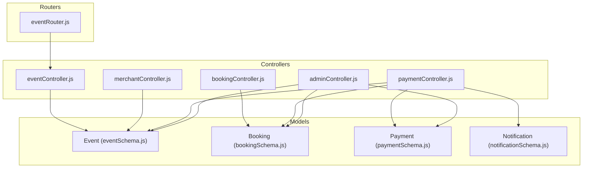
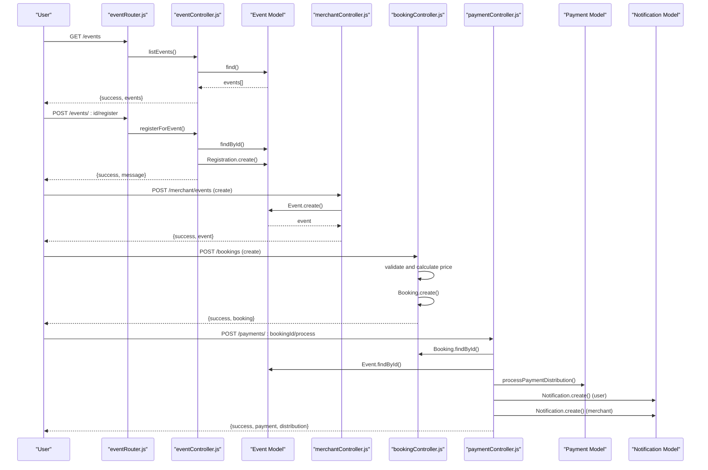
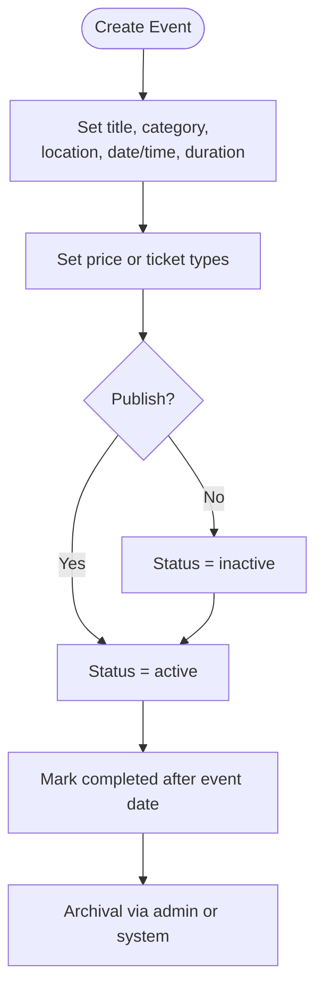
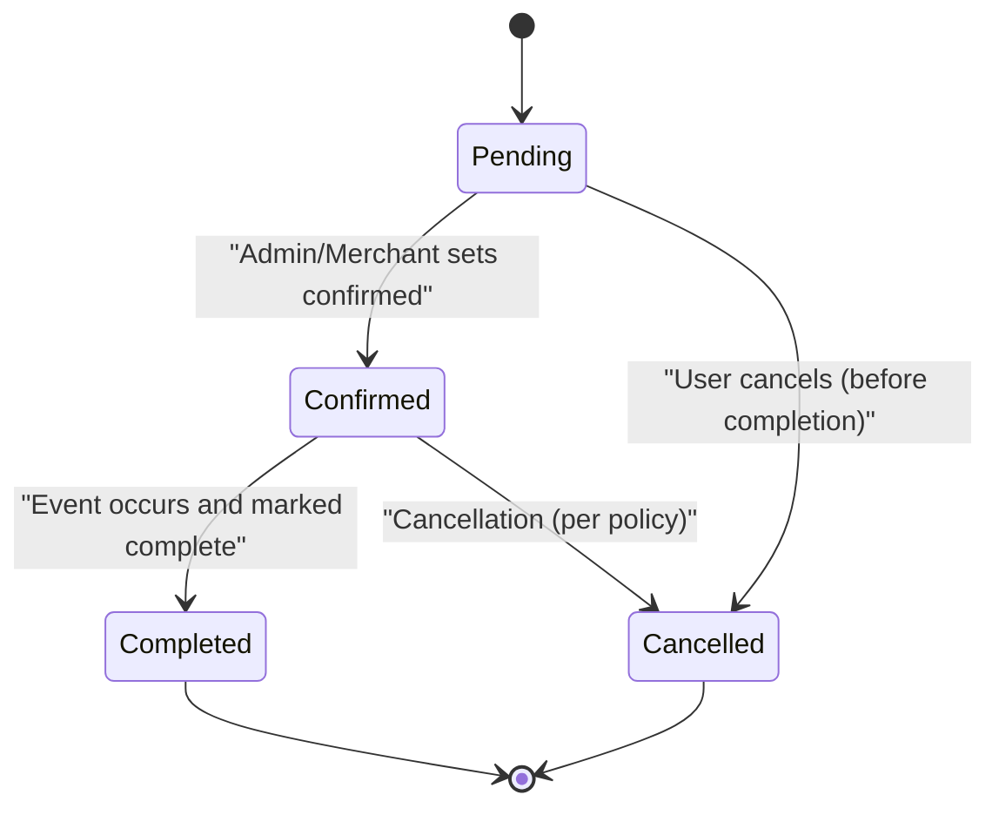
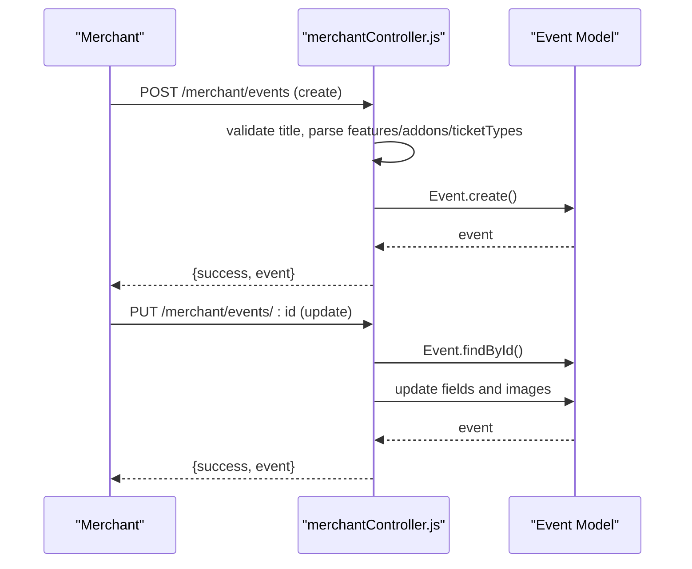
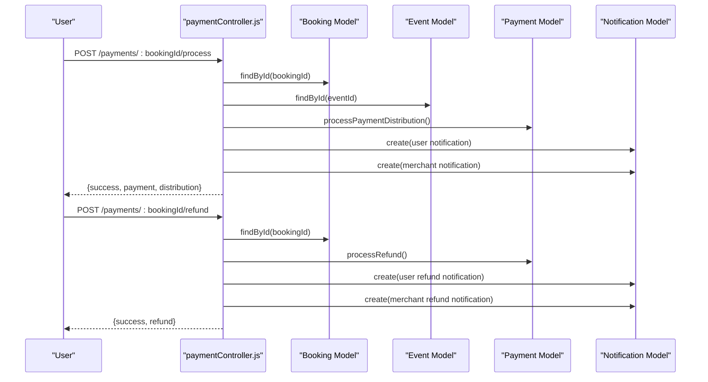
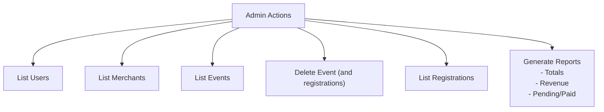
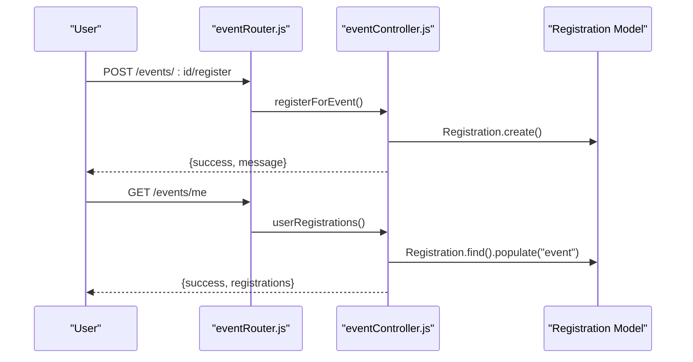
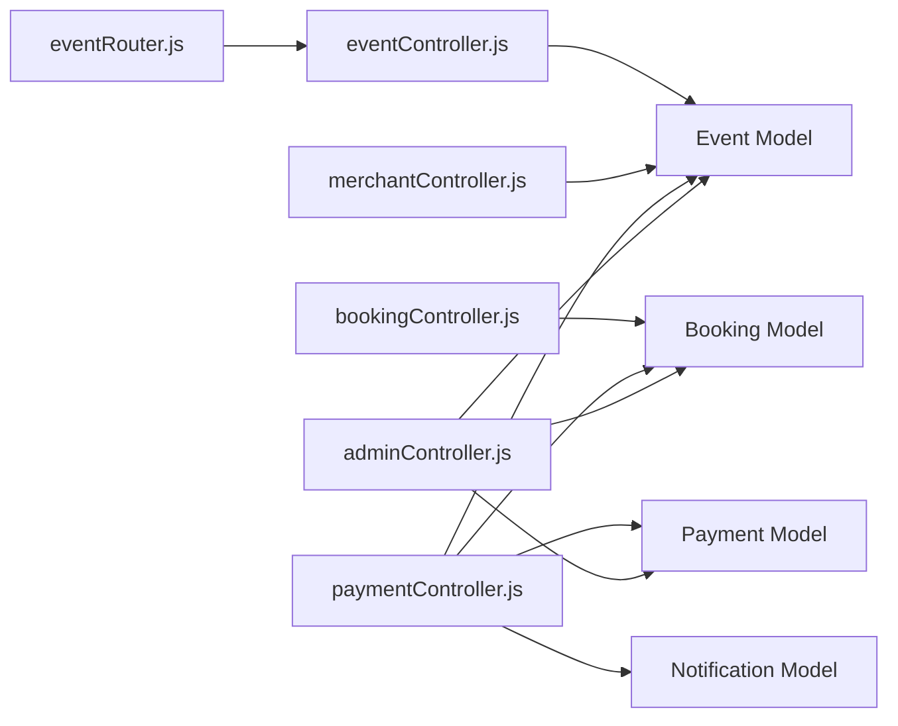

# Event Lifecycle Management

<cite>
**Referenced Files in This Document**
- [eventSchema.js](file://backend/models/eventSchema.js)
- [eventController.js](file://backend/controller/eventController.js)
- [eventRouter.js](file://backend/router/eventRouter.js)
- [bookingSchema.js](file://backend/models/bookingSchema.js)
- [bookingController.js](file://backend/controller/bookingController.js)
- [merchantController.js](file://backend/controller/merchantController.js)
- [paymentController.js](file://backend/controller/paymentController.js)
- [paymentSchema.js](file://backend/models/paymentSchema.js)
- [notificationSchema.js](file://backend/models/notificationSchema.js)
- [adminController.js](file://backend/controller/adminController.js)
</cite>

## Table of Contents
1. [Introduction](#introduction)
2. [Project Structure](#project-structure)
3. [Core Components](#core-components)
4. [Architecture Overview](#architecture-overview)
5. [Detailed Component Analysis](#detailed-component-analysis)
6. [Dependency Analysis](#dependency-analysis)
7. [Performance Considerations](#performance-considerations)
8. [Troubleshooting Guide](#troubleshooting-guide)
9. [Conclusion](#conclusion)
10. [Appendices](#appendices)

## Introduction
This document explains the end-to-end event lifecycle management from creation to completion. It covers event status transitions, scheduling workflows, merchant and user interactions, automated lifecycle events, editing and archival processes, and the integration between merchant actions and system automation. It also documents cancellation, rescheduling, and completion workflows and their impacts on bookings and revenue.

## Project Structure
The event lifecycle spans several backend modules:
- Event model and endpoints for listing, registering, and viewing registrations
- Booking model and controller for creating, viewing, updating, and cancelling bookings
- Merchant controller for creating, updating, listing, retrieving, and deleting events
- Payment controller orchestrating payment processing, refunds, and notifications
- Payment model capturing transaction and payout metadata
- Notification model supporting booking, payment, and general alerts
- Admin controller for reporting, user and event administration

**Diagram sources**
- [eventSchema.js:1-51](file://backend/models/eventSchema.js#L1-L51)
- [bookingSchema.js:1-53](file://backend/models/bookingSchema.js#L1-L53)
- [paymentSchema.js:1-142](file://backend/models/paymentSchema.js#L1-L142)
- [notificationSchema.js:1-36](file://backend/models/notificationSchema.js#L1-L36)
- [eventController.js:1-35](file://backend/controller/eventController.js#L1-L35)
- [merchantController.js:1-209](file://backend/controller/merchantController.js#L1-L209)
- [bookingController.js:1-233](file://backend/controller/bookingController.js#L1-L233)
- [paymentController.js:1-577](file://backend/controller/paymentController.js#L1-L577)
- [adminController.js:1-194](file://backend/controller/adminController.js#L1-L194)
- [eventRouter.js:1-13](file://backend/router/eventRouter.js#L1-L13)

**Section sources**
- [eventSchema.js:1-51](file://backend/models/eventSchema.js#L1-L51)
- [bookingSchema.js:1-53](file://backend/models/bookingSchema.js#L1-L53)
- [paymentSchema.js:1-142](file://backend/models/paymentSchema.js#L1-L142)
- [notificationSchema.js:1-36](file://backend/models/notificationSchema.js#L1-L36)
- [eventController.js:1-35](file://backend/controller/eventController.js#L1-L35)
- [merchantController.js:1-209](file://backend/controller/merchantController.js#L1-L209)
- [bookingController.js:1-233](file://backend/controller/bookingController.js#L1-L233)
- [paymentController.js:1-577](file://backend/controller/paymentController.js#L1-L577)
- [adminController.js:1-194](file://backend/controller/adminController.js#L1-L194)
- [eventRouter.js:1-13](file://backend/router/eventRouter.js#L1-L13)

## Core Components
- Event model defines event attributes including scheduling, pricing, ticketing, and status. It supports full-service and ticketed event types.
- Booking model tracks user bookings, statuses, pricing, and relationships to users and events.
- Merchant controller manages event creation, updates, retrieval, listing, and deletion with ownership checks.
- Event registration endpoints enable users to register for events and list their registrations.
- Payment controller handles payment processing, refund processing, notifications, and merchant earnings reporting.
- Admin controller provides administrative oversight including user/merchant listing, event deletion, registration listing, and reporting.

**Section sources**
- [eventSchema.js:1-51](file://backend/models/eventSchema.js#L1-L51)
- [bookingSchema.js:1-53](file://backend/models/bookingSchema.js#L1-L53)
- [merchantController.js:1-209](file://backend/controller/merchantController.js#L1-L209)
- [eventController.js:1-35](file://backend/controller/eventController.js#L1-L35)
- [paymentController.js:1-577](file://backend/controller/paymentController.js#L1-L577)
- [adminController.js:1-194](file://backend/controller/adminController.js#L1-L194)

## Architecture Overview
The lifecycle integrates user actions, merchant operations, and system automation around events and bookings. Payments trigger notifications and revenue accounting.

**Diagram sources**
- [eventRouter.js:1-13](file://backend/router/eventRouter.js#L1-L13)
- [eventController.js:1-35](file://backend/controller/eventController.js#L1-L35)
- [merchantController.js:1-209](file://backend/controller/merchantController.js#L1-L209)
- [bookingController.js:1-233](file://backend/controller/bookingController.js#L1-L233)
- [paymentController.js:1-577](file://backend/controller/paymentController.js#L1-L577)
- [eventSchema.js:1-51](file://backend/models/eventSchema.js#L1-L51)
- [bookingSchema.js:1-53](file://backend/models/bookingSchema.js#L1-L53)
- [paymentSchema.js:1-142](file://backend/models/paymentSchema.js#L1-L142)
- [notificationSchema.js:1-36](file://backend/models/notificationSchema.js#L1-L36)

## Detailed Component Analysis

### Event Lifecycle and Status Management
- Event status is maintained at the event level with values indicating active, inactive, and completed states. Scheduling fields include date, time, and duration. Ticketed events support total and available tickets, per-type ticket quantities, and pricing.
- Registration endpoints allow users to register for events and list their registrations.

**Diagram sources**
- [eventSchema.js:1-51](file://backend/models/eventSchema.js#L1-L51)
- [eventController.js:1-35](file://backend/controller/eventController.js#L1-L35)

**Section sources**
- [eventSchema.js:1-51](file://backend/models/eventSchema.js#L1-L51)
- [eventController.js:1-35](file://backend/controller/eventController.js#L1-L35)

### Booking Lifecycle and Status Transitions
- Booking statuses include pending, confirmed, cancelled, and completed. Creation validates existing active bookings for the same service and calculates total price based on guest count and service price.
- Users can view their bookings, retrieve individual bookings, cancel eligible bookings, and administrators can update booking statuses.

**Diagram sources**
- [bookingSchema.js:1-53](file://backend/models/bookingSchema.js#L1-L53)
- [bookingController.js:1-233](file://backend/controller/bookingController.js#L1-L233)

**Section sources**
- [bookingSchema.js:1-53](file://backend/models/bookingSchema.js#L1-L53)
- [bookingController.js:1-233](file://backend/controller/bookingController.js#L1-L233)

### Merchant Event Management and Editing
- Merchant operations include creating events with validation, parsing features and addons, handling ticket types for ticketed events, and uploading/deleting images. Updates allow editing title, description, category, price, rating, and features, with optional image replacement.

**Diagram sources**
- [merchantController.js:1-209](file://backend/controller/merchantController.js#L1-L209)
- [eventSchema.js:1-51](file://backend/models/eventSchema.js#L1-L51)

**Section sources**
- [merchantController.js:1-209](file://backend/controller/merchantController.js#L1-L209)
- [eventSchema.js:1-51](file://backend/models/eventSchema.js#L1-L51)

### Payment Processing, Notifications, and Revenue Distribution
- Payment processing requires a booking in an acceptable state, verifies ownership, determines the payment amount, distributes funds, generates transaction and ticket identifiers, and creates notifications for user and merchant.
- Refunds are processed with authorization checks, refund status validation, distribution adjustments, and notifications.

**Diagram sources**
- [paymentController.js:1-577](file://backend/controller/paymentController.js#L1-L577)
- [bookingSchema.js:1-53](file://backend/models/bookingSchema.js#L1-L53)
- [eventSchema.js:1-51](file://backend/models/eventSchema.js#L1-L51)
- [paymentSchema.js:1-142](file://backend/models/paymentSchema.js#L1-L142)
- [notificationSchema.js:1-36](file://backend/models/notificationSchema.js#L1-L36)

**Section sources**
- [paymentController.js:1-577](file://backend/controller/paymentController.js#L1-L577)
- [paymentSchema.js:1-142](file://backend/models/paymentSchema.js#L1-L142)
- [notificationSchema.js:1-36](file://backend/models/notificationSchema.js#L1-L36)

### Administrative Oversight and Reporting
- Admin endpoints provide user and merchant listings, event deletion, registration listing, and comprehensive reporting including counts and revenue aggregation.

**Diagram sources**
- [adminController.js:1-194](file://backend/controller/adminController.js#L1-L194)

**Section sources**
- [adminController.js:1-194](file://backend/controller/adminController.js#L1-L194)

### Event Registration Workflow
- Users can register for events and list their registrations. Registration prevents duplicates and ties users to events.

**Diagram sources**
- [eventRouter.js:1-13](file://backend/router/eventRouter.js#L1-L13)
- [eventController.js:1-35](file://backend/controller/eventController.js#L1-L35)

**Section sources**
- [eventRouter.js:1-13](file://backend/router/eventRouter.js#L1-L13)
- [eventController.js:1-35](file://backend/controller/eventController.js#L1-L35)

## Dependency Analysis
- Controllers depend on models for persistence and on each other for cross-cutting operations (e.g., payment controller referencing booking and event models).
- Routers bind routes to controllers.
- Payment controller depends on payment distribution service and notification model.
- Admin controller aggregates data from multiple models for reporting.

**Diagram sources**
- [eventRouter.js:1-13](file://backend/router/eventRouter.js#L1-L13)
- [eventController.js:1-35](file://backend/controller/eventController.js#L1-L35)
- [merchantController.js:1-209](file://backend/controller/merchantController.js#L1-L209)
- [bookingController.js:1-233](file://backend/controller/bookingController.js#L1-L233)
- [paymentController.js:1-577](file://backend/controller/paymentController.js#L1-L577)
- [adminController.js:1-194](file://backend/controller/adminController.js#L1-L194)

**Section sources**
- [eventRouter.js:1-13](file://backend/router/eventRouter.js#L1-L13)
- [eventController.js:1-35](file://backend/controller/eventController.js#L1-L35)
- [merchantController.js:1-209](file://backend/controller/merchantController.js#L1-L209)
- [bookingController.js:1-233](file://backend/controller/bookingController.js#L1-L233)
- [paymentController.js:1-577](file://backend/controller/paymentController.js#L1-L577)
- [adminController.js:1-194](file://backend/controller/adminController.js#L1-L194)

## Performance Considerations
- Indexes on Payment model (user, merchant, booking, transactionId, status) improve query performance for reporting and reconciliation.
- Aggregation queries in admin and payment controllers should leverage indexes and pagination to avoid heavy loads.
- Image uploads and deletions should be optimized; batch operations and CDN caching reduce latency.
- Notification creation is performed asynchronously; ensure queue-backed delivery for high throughput.

[No sources needed since this section provides general guidance]

## Troubleshooting Guide
Common issues and resolutions:
- Booking creation conflicts: Prevent duplicate active bookings for the same service by checking pending and confirmed states before creation.
- Unauthorized access: Ensure proper role middleware and ownership checks for event updates and deletions.
- Payment errors: Validate payment amount, booking status, and ownership before processing payments; handle refund authorization and status checks.
- Notification failures: Wrap notification creation in try/catch blocks and log errors for retries.

**Section sources**
- [bookingController.js:1-233](file://backend/controller/bookingController.js#L1-L233)
- [merchantController.js:1-209](file://backend/controller/merchantController.js#L1-L209)
- [paymentController.js:1-577](file://backend/controller/paymentController.js#L1-L577)

## Conclusion
The system provides a robust event lifecycle framework with clear status transitions, strong merchant controls, and automated payment and notification workflows. Administrative reporting and oversight ensure transparency and operational control. Proper adherence to status validations and authorization checks maintains data integrity and revenue accuracy.

[No sources needed since this section summarizes without analyzing specific files]

## Appendices

### Lifecycle Scenarios and Patterns
- New event creation: Merchant sets title, scheduling, pricing, and publishes; event status defaults to active or inactive depending on publish action.
- Registration: Users register for events; duplicates are prevented; registrations are stored and retrievable.
- Booking creation: Users submit booking requests; system validates existing active bookings and calculates pricing.
- Payment processing: Upon payment, notifications are generated for user and merchant; payment records capture distribution and metadata.
- Completion and archival: After the event date, events can be marked completed and archived via admin actions.
- Cancellation and refund: Eligible cancellations trigger refund processing and notifications; refund status prevents duplicate processing.

[No sources needed since this section provides general guidance]