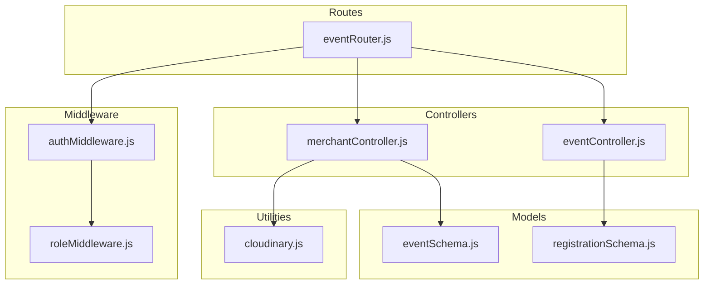
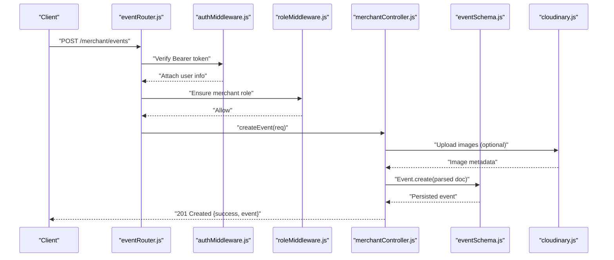
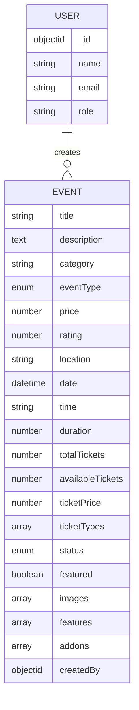
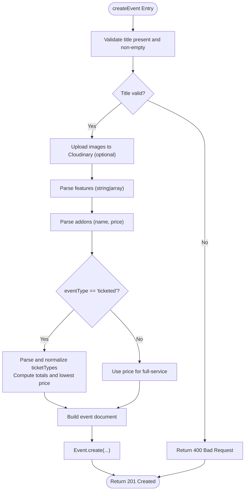
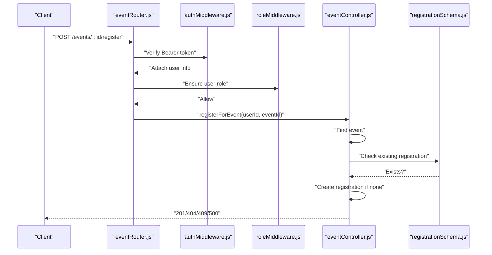
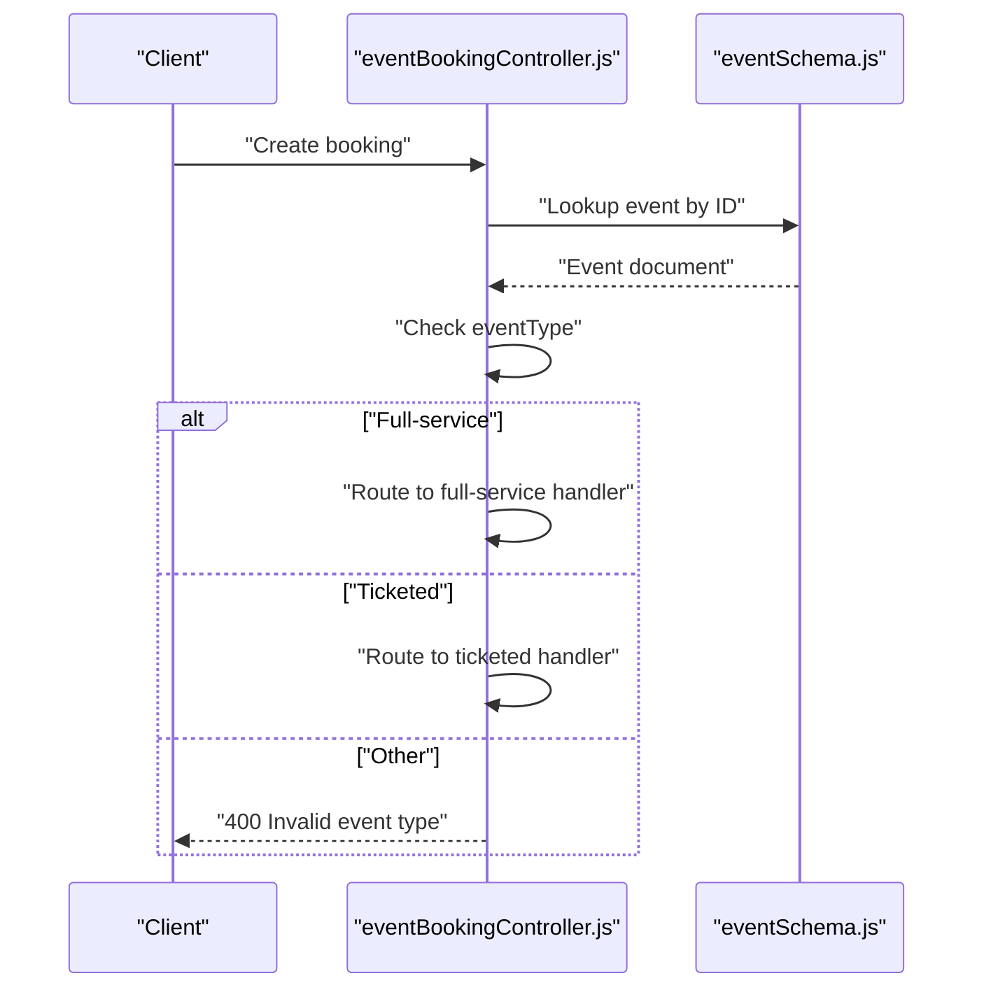
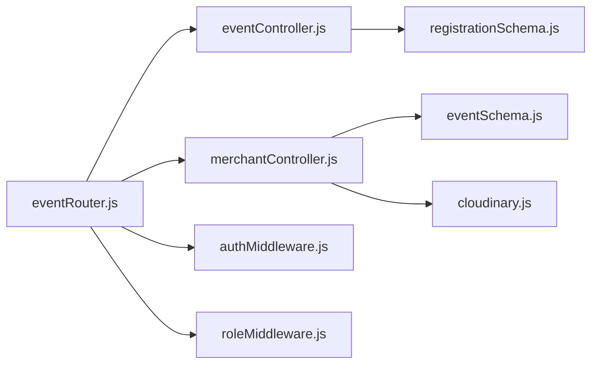

# Event Validation and Processing

<cite>
**Referenced Files in This Document**
- [eventSchema.js](file://backend/models/eventSchema.js)
- [merchantController.js](file://backend/controller/merchantController.js)
- [eventController.js](file://backend/controller/eventController.js)
- [eventRouter.js](file://backend/router/eventRouter.js)
- [authMiddleware.js](file://backend/middleware/authMiddleware.js)
- [roleMiddleware.js](file://backend/middleware/roleMiddleware.js)
- [registrationSchema.js](file://backend/models/registrationSchema.js)
- [eventBookingController.js](file://backend/controller/eventBookingController.js)
- [cloudinary.js](file://backend/util/cloudinary.js)
</cite>

## Table of Contents
1. [Introduction](#introduction)
2. [Project Structure](#project-structure)
3. [Core Components](#core-components)
4. [Architecture Overview](#architecture-overview)
5. [Detailed Component Analysis](#detailed-component-analysis)
6. [Dependency Analysis](#dependency-analysis)
7. [Performance Considerations](#performance-considerations)
8. [Troubleshooting Guide](#troubleshooting-guide)
9. [Conclusion](#conclusion)

## Introduction
This document explains the event validation and processing workflows in the backend. It covers schema-level validation, controller-level sanitization and business logic enforcement, routing and middleware-based access control, and the end-to-end pipeline from form submission to persistence. It also documents error handling, validation feedback loops, common failure modes, and optimization strategies.

## Project Structure
The event domain spans models, controllers, routers, middleware, and utilities:
- Models define the event schema and related entities (registrations).
- Controllers implement validation, sanitization, and business logic.
- Routers bind routes to controllers and enforce authentication/authorization.
- Middleware enforces JWT-based authentication and role-based access.
- Utilities handle external integrations (e.g., Cloudinary image uploads).

**Diagram sources**
- [eventRouter.js:1-13](file://backend/router/eventRouter.js#L1-L13)
- [eventController.js:1-35](file://backend/controller/eventController.js#L1-L35)
- [merchantController.js:1-209](file://backend/controller/merchantController.js#L1-L209)
- [eventSchema.js:1-51](file://backend/models/eventSchema.js#L1-L51)
- [registrationSchema.js:1-12](file://backend/models/registrationSchema.js#L1-L12)
- [authMiddleware.js:1-17](file://backend/middleware/authMiddleware.js#L1-L17)
- [roleMiddleware.js:1-9](file://backend/middleware/roleMiddleware.js#L1-L9)
- [cloudinary.js](file://backend/util/cloudinary.js)

**Section sources**
- [eventRouter.js:1-13](file://backend/router/eventRouter.js#L1-L13)
- [eventController.js:1-35](file://backend/controller/eventController.js#L1-L35)
- [merchantController.js:1-209](file://backend/controller/merchantController.js#L1-L209)
- [eventSchema.js:1-51](file://backend/models/eventSchema.js#L1-L51)
- [registrationSchema.js:1-12](file://backend/models/registrationSchema.js#L1-L12)
- [authMiddleware.js:1-17](file://backend/middleware/authMiddleware.js#L1-L17)
- [roleMiddleware.js:1-9](file://backend/middleware/roleMiddleware.js#L1-L9)
- [cloudinary.js](file://backend/util/cloudinary.js)

## Core Components
- Event model defines required fields, enums, numeric bounds, arrays, and references. It includes both full-service and ticketed event attributes.
- Merchant controller validates and sanitizes incoming event creation/update requests, parses structured fields, and enforces ownership and access rules.
- Event controller handles listing, registration, and user registration queries with basic existence checks and duplicate prevention.
- Router binds endpoints to controllers and applies authentication and role middleware.
- Middleware enforces JWT-based authentication and role-based access control.
- Registration model tracks user-event relationships for event registration.

**Section sources**
- [eventSchema.js:1-51](file://backend/models/eventSchema.js#L1-L51)
- [merchantController.js:5-98](file://backend/controller/merchantController.js#L5-L98)
- [eventController.js:4-34](file://backend/controller/eventController.js#L4-L34)
- [eventRouter.js:1-13](file://backend/router/eventRouter.js#L1-L13)
- [authMiddleware.js:1-17](file://backend/middleware/authMiddleware.js#L1-L17)
- [roleMiddleware.js:1-9](file://backend/middleware/roleMiddleware.js#L1-L9)
- [registrationSchema.js:1-12](file://backend/models/registrationSchema.js#L1-L12)

## Architecture Overview
The validation and processing pipeline follows a layered approach:
- Request enters via router.
- Authentication and role middleware validate identity and permissions.
- Controller validates and sanitizes payload, parses structured fields, and enforces business rules.
- Model-level validation ensures schema compliance.
- Persistence and external services (e.g., Cloudinary) are invoked conditionally.
- Responses are returned with appropriate status codes and messages.

**Diagram sources**
- [eventRouter.js:1-13](file://backend/router/eventRouter.js#L1-L13)
- [authMiddleware.js:1-17](file://backend/middleware/authMiddleware.js#L1-L17)
- [roleMiddleware.js:1-9](file://backend/middleware/roleMiddleware.js#L1-L9)
- [merchantController.js:5-98](file://backend/controller/merchantController.js#L5-L98)
- [eventSchema.js:1-51](file://backend/models/eventSchema.js#L1-L51)
- [cloudinary.js](file://backend/util/cloudinary.js)

## Detailed Component Analysis

### Event Schema Validation
The event schema enforces:
- Required fields: title, images entries (each requiring public_id and url), createdBy.
- Enums: eventType (full-service, ticketed), status (active, inactive, completed).
- Numeric bounds: rating min/max, ticket prices and quantities min 0.
- Arrays: ticketTypes, images, addons, features.
- References: createdBy links to User.

**Diagram sources**
- [eventSchema.js:1-51](file://backend/models/eventSchema.js#L1-L51)

**Section sources**
- [eventSchema.js:1-51](file://backend/models/eventSchema.js#L1-L51)

### Merchant Controller: Validation and Sanitization
Key responsibilities:
- Title required and trimmed.
- Images handled via Cloudinary upload; metadata stored.
- Features parsed from string or array; deduplicated and trimmed.
- Addons parsed with name trimming and numeric price coercion.
- Ticketed vs. full-service branching:
  - For ticketed events, ticketTypes parsed and normalized; totalTickets and availableTickets initialized from quantities; lowestTicketPrice computed.
  - For full-service events, price taken from optional price field.
- Ownership checks: only the creator can update/delete/get an event.
- Error handling:
  - Returns 400 for Mongoose ValidationErrors with details.
  - Returns 500 for unexpected errors.

**Diagram sources**
- [merchantController.js:5-98](file://backend/controller/merchantController.js#L5-L98)
- [cloudinary.js](file://backend/util/cloudinary.js)

**Section sources**
- [merchantController.js:5-98](file://backend/controller/merchantController.js#L5-L98)
- [cloudinary.js](file://backend/util/cloudinary.js)

### Event Registration Controller: Validation and Business Logic
- Listing events: fetch and sort by date.
- Registration:
  - Confirm event exists.
  - Prevent duplicate registrations per user.
  - Create registration record linking user and event.
- User registrations: list registrations and populate event details.

**Diagram sources**
- [eventRouter.js:1-13](file://backend/router/eventRouter.js#L1-L13)
- [authMiddleware.js:1-17](file://backend/middleware/authMiddleware.js#L1-L17)
- [roleMiddleware.js:1-9](file://backend/middleware/roleMiddleware.js#L1-L9)
- [eventController.js:13-25](file://backend/controller/eventController.js#L13-L25)
- [registrationSchema.js:1-12](file://backend/models/registrationSchema.js#L1-L12)

**Section sources**
- [eventController.js:4-34](file://backend/controller/eventController.js#L4-L34)
- [registrationSchema.js:1-12](file://backend/models/registrationSchema.js#L1-L12)
- [eventRouter.js:1-13](file://backend/router/eventRouter.js#L1-L13)
- [authMiddleware.js:1-17](file://backend/middleware/authMiddleware.js#L1-L17)
- [roleMiddleware.js:1-9](file://backend/middleware/roleMiddleware.js#L1-L9)

### Booking Workflow Integration
The booking controller orchestrates event-type-specific flows:
- Full-service events require merchant approval; handlers validate event type and route accordingly.
- Ticketed events compute availability and confirm immediately upon payment.

**Diagram sources**
- [eventBookingController.js:36-58](file://backend/controller/eventBookingController.js#L36-L58)
- [eventSchema.js:1-51](file://backend/models/eventSchema.js#L1-L51)

**Section sources**
- [eventBookingController.js:36-58](file://backend/controller/eventBookingController.js#L36-L58)
- [eventSchema.js:1-51](file://backend/models/eventSchema.js#L1-L51)

## Dependency Analysis
- Router depends on controllers and middleware.
- Controllers depend on models and utilities.
- Models depend on Mongoose and enforce schema-level constraints.
- Middleware depends on environment configuration for JWT secrets.

**Diagram sources**
- [eventRouter.js:1-13](file://backend/router/eventRouter.js#L1-L13)
- [eventController.js:1-35](file://backend/controller/eventController.js#L1-L35)
- [merchantController.js:1-209](file://backend/controller/merchantController.js#L1-L209)
- [registrationSchema.js:1-12](file://backend/models/registrationSchema.js#L1-L12)
- [eventSchema.js:1-51](file://backend/models/eventSchema.js#L1-L51)
- [cloudinary.js](file://backend/util/cloudinary.js)
- [authMiddleware.js:1-17](file://backend/middleware/authMiddleware.js#L1-L17)
- [roleMiddleware.js:1-9](file://backend/middleware/roleMiddleware.js#L1-L9)

**Section sources**
- [eventRouter.js:1-13](file://backend/router/eventRouter.js#L1-L13)
- [eventController.js:1-35](file://backend/controller/eventController.js#L1-L35)
- [merchantController.js:1-209](file://backend/controller/merchantController.js#L1-L209)
- [registrationSchema.js:1-12](file://backend/models/registrationSchema.js#L1-L12)
- [eventSchema.js:1-51](file://backend/models/eventSchema.js#L1-L51)
- [cloudinary.js](file://backend/util/cloudinary.js)
- [authMiddleware.js:1-17](file://backend/middleware/authMiddleware.js#L1-L17)
- [roleMiddleware.js:1-9](file://backend/middleware/roleMiddleware.js#L1-L9)

## Performance Considerations
- Minimize redundant validations:
  - Prefer schema-level constraints to avoid repeated checks.
  - Defer expensive operations (e.g., image uploads) until after basic validations.
- Batch and cache:
  - For listing events, consider pagination and indexing on date and status.
- Early exits:
  - Return 404/409 early when resources or duplicates are missing to reduce downstream work.
- Avoid unnecessary parsing:
  - Only parse structured fields when provided; default to safe empty arrays/objects.
- Database writes:
  - Group updates and minimize round-trips; use atomic operations where possible.
- Middleware overhead:
  - Keep JWT verification lightweight; ensure secret rotation does not trigger frequent re-decoding.

[No sources needed since this section provides general guidance]

## Troubleshooting Guide
Common validation failures and resolutions:
- Missing or empty title:
  - Symptom: 400 Bad Request during event creation.
  - Resolution: Ensure title is present and non-empty; trim whitespace.
- Invalid event type:
  - Symptom: 400 Invalid event type in booking flow.
  - Resolution: Only use supported event types; ensure correct handler is invoked.
- Unauthorized or forbidden:
  - Symptom: 401 Unauthorized or 403 Forbidden.
  - Resolution: Attach a valid Bearer token; ensure roles align with endpoint requirements.
- Duplicate registration:
  - Symptom: 409 Already registered.
  - Resolution: Check existing registration before attempting to register again.
- Schema validation errors:
  - Symptom: 400 with validation details.
  - Resolution: Fix numeric bounds (e.g., rating, ticket prices), ensure required fields, and conform to enums.
- Image upload failures:
  - Symptom: Errors during Cloudinary upload.
  - Resolution: Verify file paths, Cloudinary credentials, and network connectivity.

**Section sources**
- [merchantController.js:92-97](file://backend/controller/merchantController.js#L92-L97)
- [eventController.js:13-25](file://backend/controller/eventController.js#L13-L25)
- [authMiddleware.js:1-17](file://backend/middleware/authMiddleware.js#L1-L17)
- [roleMiddleware.js:1-9](file://backend/middleware/roleMiddleware.js#L1-L9)
- [eventBookingController.js:36-58](file://backend/controller/eventBookingController.js#L36-L58)

## Conclusion
The event validation and processing pipeline combines schema-level constraints, controller-level sanitization, and middleware-based access control. By enforcing required fields, validating data types and enums, normalizing structured inputs, and handling ownership and duplication, the system ensures robust and secure event lifecycle management. Applying the recommended performance and troubleshooting practices further improves reliability and user experience.

[No sources needed since this section summarizes without analyzing specific files]