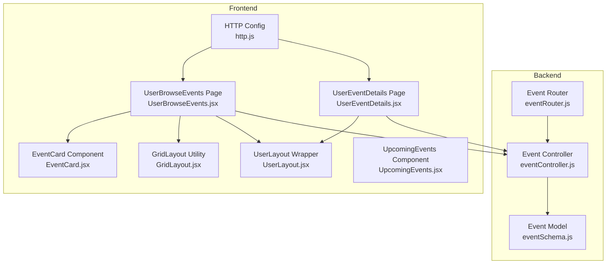
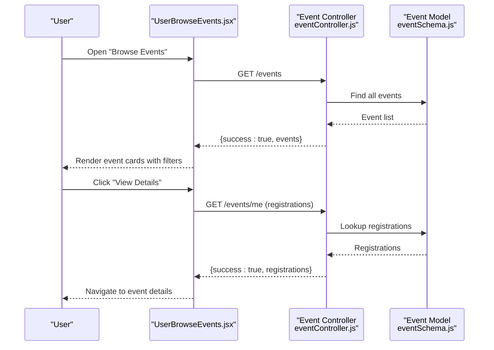
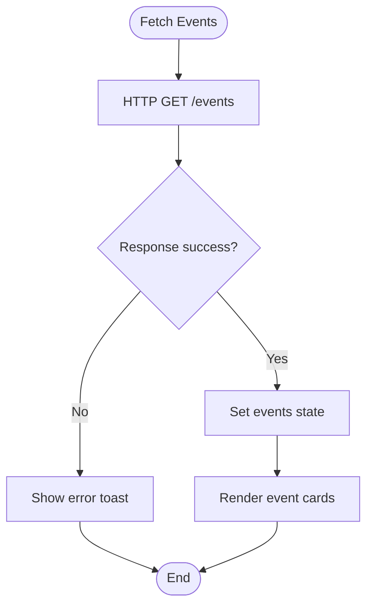
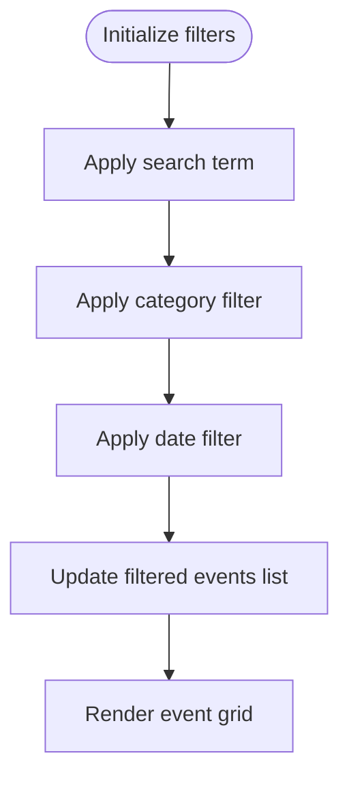
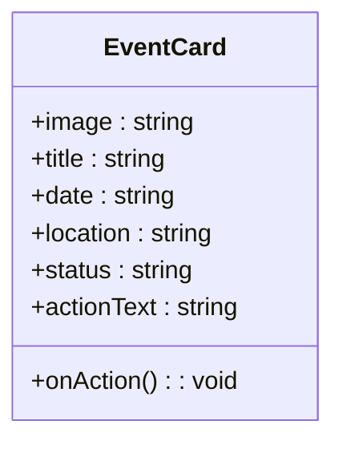
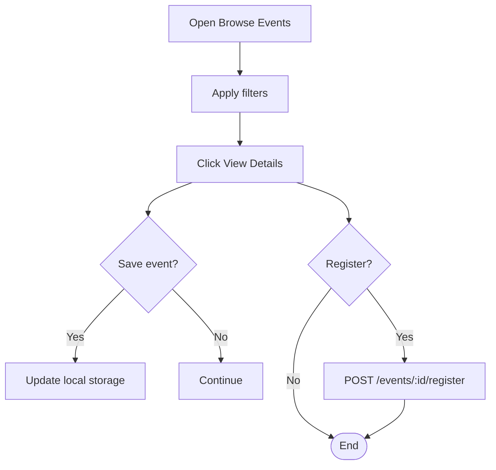
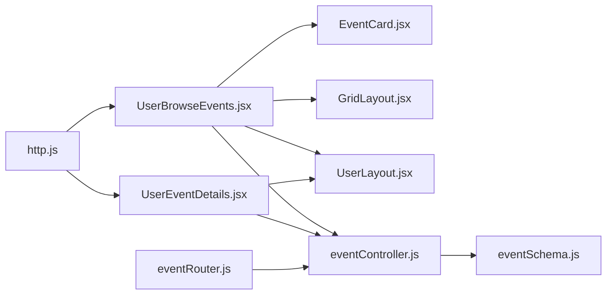

# Event Discovery and Browsing

<cite>
**Referenced Files in This Document**
- [eventSchema.js](file://backend/models/eventSchema.js)
- [eventController.js](file://backend/controller/eventController.js)
- [eventRouter.js](file://backend/router/eventRouter.js)
- [UserBrowseEvents.jsx](file://frontend/src/pages/dashboards/UserBrowseEvents.jsx)
- [UserEventDetails.jsx](file://frontend/src/pages/dashboards/UserEventDetails.jsx)
- [EventCard.jsx](file://frontend/src/components/user/EventCard.jsx)
- [UpcomingEvents.jsx](file://frontend/src/components/home/UpcomingEvents.jsx)
- [http.js](file://frontend/src/lib/http.js)
- [GridLayout.jsx](file://frontend/src/components/common/GridLayout.jsx)
- [UserLayout.jsx](file://frontend/src/components/user/UserLayout.jsx)
</cite>

## Table of Contents
1. [Introduction](#introduction)
2. [Project Structure](#project-structure)
3. [Core Components](#core-components)
4. [Architecture Overview](#architecture-overview)
5. [Detailed Component Analysis](#detailed-component-analysis)
6. [Dependency Analysis](#dependency-analysis)
7. [Performance Considerations](#performance-considerations)
8. [Troubleshooting Guide](#troubleshooting-guide)
9. [Conclusion](#conclusion)

## Introduction
This document explains the event discovery and browsing functionality in the application. It covers how users discover events via multiple interfaces, how events are listed and filtered, and how the UI presents event cards and details. It also documents the backend APIs that support event retrieval and user registration, and outlines current capabilities and areas for enhancement such as pagination and advanced sorting.

## Project Structure
The event discovery and browsing feature spans both frontend and backend:

- Backend
  - Event model defines the schema for event storage.
  - Event controller exposes endpoints for listing events and managing user registrations.
  - Event router mounts the endpoints under a dedicated route.
- Frontend
  - Browse events page implements search, category, and date filters, and renders a responsive grid of event cards.
  - Event details page displays comprehensive event information and handles registration.
  - Supporting components include a reusable event card, a layout wrapper, and a grid layout utility.



**Diagram sources**
- [eventSchema.js:1-35](file://backend/models/eventSchema.js#L1-L35)
- [eventController.js:1-35](file://backend/controller/eventController.js#L1-L35)
- [eventRouter.js:1-13](file://backend/router/eventRouter.js#L1-L13)
- [UserBrowseEvents.jsx:1-379](file://frontend/src/pages/dashboards/UserBrowseEvents.jsx#L1-L379)
- [UserEventDetails.jsx:1-355](file://frontend/src/pages/dashboards/UserEventDetails.jsx#L1-L355)
- [EventCard.jsx:1-45](file://frontend/src/components/user/EventCard.jsx#L1-L45)
- [GridLayout.jsx:1-18](file://frontend/src/components/common/GridLayout.jsx#L1-L18)
- [UserLayout.jsx:1-30](file://frontend/src/components/user/UserLayout.jsx#L1-L30)
- [UpcomingEvents.jsx:1-53](file://frontend/src/components/home/UpcomingEvents.jsx#L1-L53)
- [http.js:1-5](file://frontend/src/lib/http.js#L1-L5)

**Section sources**
- [eventSchema.js:1-35](file://backend/models/eventSchema.js#L1-L35)
- [eventController.js:1-35](file://backend/controller/eventController.js#L1-L35)
- [eventRouter.js:1-13](file://backend/router/eventRouter.js#L1-L13)
- [UserBrowseEvents.jsx:1-379](file://frontend/src/pages/dashboards/UserBrowseEvents.jsx#L1-L379)
- [UserEventDetails.jsx:1-355](file://frontend/src/pages/dashboards/UserEventDetails.jsx#L1-L355)
- [EventCard.jsx:1-45](file://frontend/src/components/user/EventCard.jsx#L1-L45)
- [GridLayout.jsx:1-18](file://frontend/src/components/common/GridLayout.jsx#L1-L18)
- [UserLayout.jsx:1-30](file://frontend/src/components/user/UserLayout.jsx#L1-L30)
- [UpcomingEvents.jsx:1-53](file://frontend/src/components/home/UpcomingEvents.jsx#L1-L53)
- [http.js:1-5](file://frontend/src/lib/http.js#L1-L5)

## Core Components
- Event model
  - Defines fields such as title, description, category, date/time, location, pricing, ratings, images, features, and status.
  - Supports event types and ticketed attributes for future expansion.
- Event listing endpoint
  - Returns all events sorted by date ascending.
- User registration endpoint
  - Allows authenticated users to register for events and prevents duplicate registrations.
- Browse events page
  - Fetches events, applies client-side search and filters, and renders a responsive grid of event cards.
- Event details page
  - Displays detailed event information, handles registration, and supports saving events locally.
- Event card component
  - Reusable card displaying image, title, formatted date, location, status badge, and action button.
- Upcoming events component
  - Home page component that shows upcoming events derived from the event list.

**Section sources**
- [eventSchema.js:1-35](file://backend/models/eventSchema.js#L1-L35)
- [eventController.js:4-11](file://backend/controller/eventController.js#L4-L11)
- [eventController.js:13-25](file://backend/controller/eventController.js#L13-L25)
- [UserBrowseEvents.jsx:60-74](file://frontend/src/pages/dashboards/UserBrowseEvents.jsx#L60-L74)
- [UserBrowseEvents.jsx:76-119](file://frontend/src/pages/dashboards/UserBrowseEvents.jsx#L76-L119)
- [UserEventDetails.jsx:27-46](file://frontend/src/pages/dashboards/UserEventDetails.jsx#L27-L46)
- [EventCard.jsx:10-32](file://frontend/src/components/user/EventCard.jsx#L10-L32)
- [UpcomingEvents.jsx:6-21](file://frontend/src/components/home/UpcomingEvents.jsx#L6-L21)

## Architecture Overview
The event discovery flow connects frontend pages to backend endpoints and models:



**Diagram sources**
- [UserBrowseEvents.jsx:60-74](file://frontend/src/pages/dashboards/UserBrowseEvents.jsx#L60-L74)
- [eventController.js:4-11](file://backend/controller/eventController.js#L4-L11)
- [eventController.js:27-34](file://backend/controller/eventController.js#L27-L34)
- [eventSchema.js:1-35](file://backend/models/eventSchema.js#L1-L35)

## Detailed Component Analysis

### Event Listing Mechanisms
- Backend
  - Endpoint returns all events sorted by date ascending.
  - No pagination or explicit sorting controls are implemented in the backend.
- Frontend
  - Fetches events on mount and stores them in state.
  - Provides client-side filtering and search applied before rendering.



**Diagram sources**
- [UserBrowseEvents.jsx:60-74](file://frontend/src/pages/dashboards/UserBrowseEvents.jsx#L60-L74)
- [eventController.js:4-11](file://backend/controller/eventController.js#L4-L11)

**Section sources**
- [eventController.js:4-11](file://backend/controller/eventController.js#L4-L11)
- [UserBrowseEvents.jsx:60-74](file://frontend/src/pages/dashboards/UserBrowseEvents.jsx#L60-L74)

### Search and Filtering Capabilities
- Search
  - Searches across title, description, and location.
- Category filter
  - Filters by category with an "All Categories" option.
- Date filter
  - Supports "Any Date", "Today", "This Week", and "This Month".
- Saved events
  - Uses local storage to save/remove events and reflects UI state.



**Diagram sources**
- [UserBrowseEvents.jsx:76-119](file://frontend/src/pages/dashboards/UserBrowseEvents.jsx#L76-L119)

**Section sources**
- [UserBrowseEvents.jsx:17-22](file://frontend/src/pages/dashboards/UserBrowseEvents.jsx#L17-L22)
- [UserBrowseEvents.jsx:76-119](file://frontend/src/pages/dashboards/UserBrowseEvents.jsx#L76-L119)
- [UserBrowseEvents.jsx:36-50](file://frontend/src/pages/dashboards/UserBrowseEvents.jsx#L36-L50)

### Pagination and Sorting Options
- Current state
  - Backend returns all events without pagination.
  - Sorting is fixed to ascending date order.
- Recommended enhancements
  - Add pagination parameters (page, limit) to the backend endpoint.
  - Allow dynamic sorting by date, rating, price, or title.
  - Implement server-side filtering for improved performance with large datasets.

**Section sources**
- [eventController.js:4-11](file://backend/controller/eventController.js#L4-L11)

### Event Card Component Design
- Purpose
  - Presents a compact preview of an event with image, title, formatted date, location, status badge, and action button.
- Props and behavior
  - Accepts image URL, title, formatted date string, location, optional status, customizable action text, and an action handler.
  - Status badge color is mapped based on status value.
- Styling
  - Uses Tailwind classes for responsive layout, hover effects, and consistent spacing.



**Diagram sources**
- [EventCard.jsx:10-42](file://frontend/src/components/user/EventCard.jsx#L10-L42)

**Section sources**
- [EventCard.jsx:10-42](file://frontend/src/components/user/EventCard.jsx#L10-L42)

### Event Details Modal Functionality
- Current implementation
  - The event details page aggregates event data from the listing endpoint and checks registration status via a separate endpoint.
  - Handles user registration submission and toggles saved state locally.
- Modal note
  - There is no dedicated event details modal component in the current codebase; the details are rendered inline within the event details page.

```mermaid
sequenceDiagram
participant User as "User"
participant Details as "UserEventDetails.jsx"
participant API as "Event Controller"
participant Model as "Event Model"
User->>Details : Open event details
Details->>API : GET /events
API->>Model : Find all events
Model-->>API : Event list
API-->>Details : {events}
Details->>API : GET /events/me
API->>Model : Find registrations
Model-->>API : Registrations
API-->>Details : {registrations}
User->>Details : Click "Book Now"
Details->>API : POST /events/ : id/register
API->>Model : Create registration
Model-->>API : Success
API-->>Details : {success}
Details-->>User : Show success toast
```

**Diagram sources**
- [UserEventDetails.jsx:27-46](file://frontend/src/pages/dashboards/UserEventDetails.jsx#L27-L46)
- [UserEventDetails.jsx:48-62](file://frontend/src/pages/dashboards/UserEventDetails.jsx#L48-L62)
- [UserEventDetails.jsx:64-87](file://frontend/src/pages/dashboards/UserEventDetails.jsx#L64-L87)
- [eventController.js:27-34](file://backend/controller/eventController.js#L27-L34)
- [eventController.js:13-25](file://backend/controller/eventController.js#L13-L25)

**Section sources**
- [UserEventDetails.jsx:27-46](file://frontend/src/pages/dashboards/UserEventDetails.jsx#L27-L46)
- [UserEventDetails.jsx:48-62](file://frontend/src/pages/dashboards/UserEventDetails.jsx#L48-L62)
- [UserEventDetails.jsx:64-87](file://frontend/src/pages/dashboards/UserEventDetails.jsx#L64-L87)
- [eventController.js:27-34](file://backend/controller/eventController.js#L27-L34)
- [eventController.js:13-25](file://backend/controller/eventController.js#L13-L25)

### User Interaction Patterns
- Discovering events
  - Users browse events on the "Browse Events" page, apply filters, and click "View Details".
  - Upcoming events are showcased on the home page component.
- Saving events
  - Users can save/remove events using a bookmark icon; state persists in local storage.
- Registration
  - Users can register for events from the details page; duplicate registrations are prevented.



**Diagram sources**
- [UserBrowseEvents.jsx:121-123](file://frontend/src/pages/dashboards/UserBrowseEvents.jsx#L121-L123)
- [UserBrowseEvents.jsx:36-50](file://frontend/src/pages/dashboards/UserBrowseEvents.jsx#L36-L50)
- [UserEventDetails.jsx:64-87](file://frontend/src/pages/dashboards/UserEventDetails.jsx#L64-L87)

**Section sources**
- [UserBrowseEvents.jsx:121-123](file://frontend/src/pages/dashboards/UserBrowseEvents.jsx#L121-L123)
- [UserBrowseEvents.jsx:36-50](file://frontend/src/pages/dashboards/UserBrowseEvents.jsx#L36-L50)
- [UserEventDetails.jsx:64-87](file://frontend/src/pages/dashboards/UserEventDetails.jsx#L64-L87)

### Examples of Event Display Patterns
- Browse events grid
  - Responsive grid layout with four columns on large screens.
  - Each card includes category tag, save button, and "View Details" action.
- Upcoming events banner
  - Displays upcoming events with image, title, date, and location.
- Event details page
  - Full-width header with image slider fallback, event info, features, and registration card.

**Section sources**
- [UserBrowseEvents.jsx:217-372](file://frontend/src/pages/dashboards/UserBrowseEvents.jsx#L217-L372)
- [UpcomingEvents.jsx:25-48](file://frontend/src/components/home/UpcomingEvents.jsx#L25-L48)
- [UserEventDetails.jsx:151-349](file://frontend/src/pages/dashboards/UserEventDetails.jsx#L151-L349)

### Filtering Criteria and User Engagement Features
- Filtering criteria
  - Text search across title, description, and location.
  - Category dropdown with predefined categories.
  - Date range selector with presets.
- Engagement features
  - Local storage for saved events.
  - Real-time feedback via toast messages.
  - Visual indicators for saved events and registration status.

**Section sources**
- [UserBrowseEvents.jsx:17-22](file://frontend/src/pages/dashboards/UserBrowseEvents.jsx#L17-L22)
- [UserBrowseEvents.jsx:76-119](file://frontend/src/pages/dashboards/UserBrowseEvents.jsx#L76-L119)
- [UserBrowseEvents.jsx:36-50](file://frontend/src/pages/dashboards/UserBrowseEvents.jsx#L36-L50)
- [UserEventDetails.jsx:89-92](file://frontend/src/pages/dashboards/UserEventDetails.jsx#L89-L92)

## Dependency Analysis
- Backend dependencies
  - Event controller depends on the event model and registration model.
  - Event router depends on the event controller and authentication middleware.
- Frontend dependencies
  - Browse and details pages depend on HTTP configuration and authentication context.
  - Event card component is used by the browse page and can be reused elsewhere.
  - Layout wrapper ensures consistent navigation and sidebar across user pages.



**Diagram sources**
- [http.js:1-5](file://frontend/src/lib/http.js#L1-L5)
- [UserBrowseEvents.jsx:1-10](file://frontend/src/pages/dashboards/UserBrowseEvents.jsx#L1-L10)
- [UserEventDetails.jsx:1-10](file://frontend/src/pages/dashboards/UserEventDetails.jsx#L1-L10)
- [EventCard.jsx:1-2](file://frontend/src/components/user/EventCard.jsx#L1-L2)
- [GridLayout.jsx:1-2](file://frontend/src/components/common/GridLayout.jsx#L1-L2)
- [UserLayout.jsx:1-4](file://frontend/src/components/user/UserLayout.jsx#L1-L4)
- [eventController.js:1-2](file://backend/controller/eventController.js#L1-L2)
- [eventSchema.js:1-2](file://backend/models/eventSchema.js#L1-L2)
- [eventRouter.js:1-4](file://backend/router/eventRouter.js#L1-L4)

**Section sources**
- [http.js:1-5](file://frontend/src/lib/http.js#L1-L5)
- [UserBrowseEvents.jsx:1-10](file://frontend/src/pages/dashboards/UserBrowseEvents.jsx#L1-L10)
- [UserEventDetails.jsx:1-10](file://frontend/src/pages/dashboards/UserEventDetails.jsx#L1-L10)
- [EventCard.jsx:1-2](file://frontend/src/components/user/EventCard.jsx#L1-L2)
- [GridLayout.jsx:1-2](file://frontend/src/components/common/GridLayout.jsx#L1-L2)
- [UserLayout.jsx:1-4](file://frontend/src/components/user/UserLayout.jsx#L1-L4)
- [eventController.js:1-2](file://backend/controller/eventController.js#L1-L2)
- [eventSchema.js:1-2](file://backend/models/eventSchema.js#L1-L2)
- [eventRouter.js:1-4](file://backend/router/eventRouter.js#L1-L4)

## Performance Considerations
- Current limitations
  - All events are fetched in a single request; large datasets can impact initial load time.
  - Filtering is performed client-side, which can be inefficient for very large lists.
- Recommendations
  - Implement pagination and server-side filtering/sorting.
  - Add caching for frequently accessed data and optimize image loading.
  - Debounce search input to reduce unnecessary re-renders.

[No sources needed since this section provides general guidance]

## Troubleshooting Guide
- Events not loading
  - Verify the base API URL and authentication token.
  - Check network requests and error messages in the browser console.
- Registration errors
  - Ensure the user is authenticated and not already registered.
  - Confirm the event ID is valid and the endpoint responds as expected.
- Saved events not persisting
  - Confirm local storage is enabled and not blocked by the browser.
  - Verify the toggle logic updates local storage correctly.

**Section sources**
- [http.js:1-5](file://frontend/src/lib/http.js#L1-L5)
- [UserBrowseEvents.jsx:69-73](file://frontend/src/pages/dashboards/UserBrowseEvents.jsx#L69-L73)
- [UserEventDetails.jsx:81-86](file://frontend/src/pages/dashboards/UserEventDetails.jsx#L81-L86)
- [UserBrowseEvents.jsx:36-50](file://frontend/src/pages/dashboards/UserBrowseEvents.jsx#L36-L50)

## Conclusion
The event discovery and browsing system currently provides a functional foundation with search, category, and date filtering, along with a responsive event grid and detailed event page. Enhancements such as pagination, server-side sorting, and a dedicated event details modal would improve scalability and user experience. The existing components offer clear extension points for these improvements.