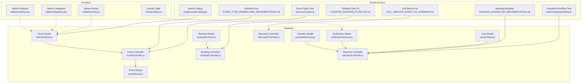
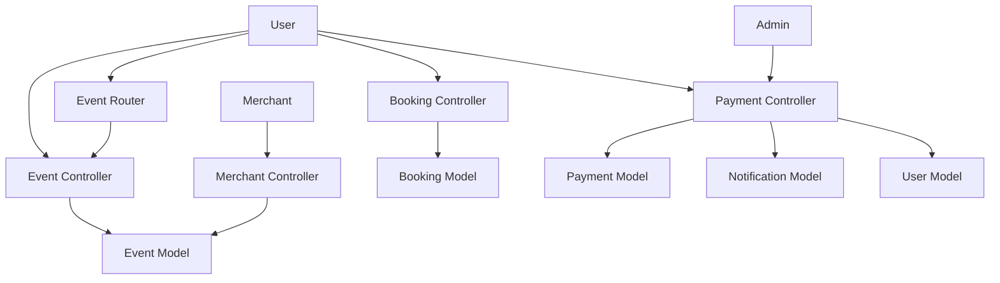
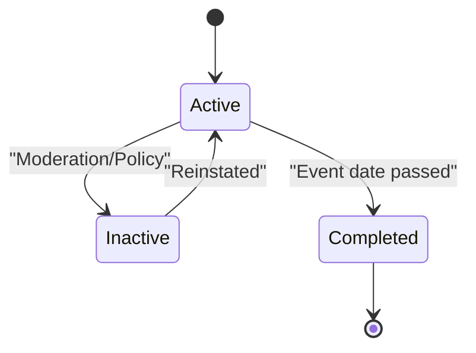
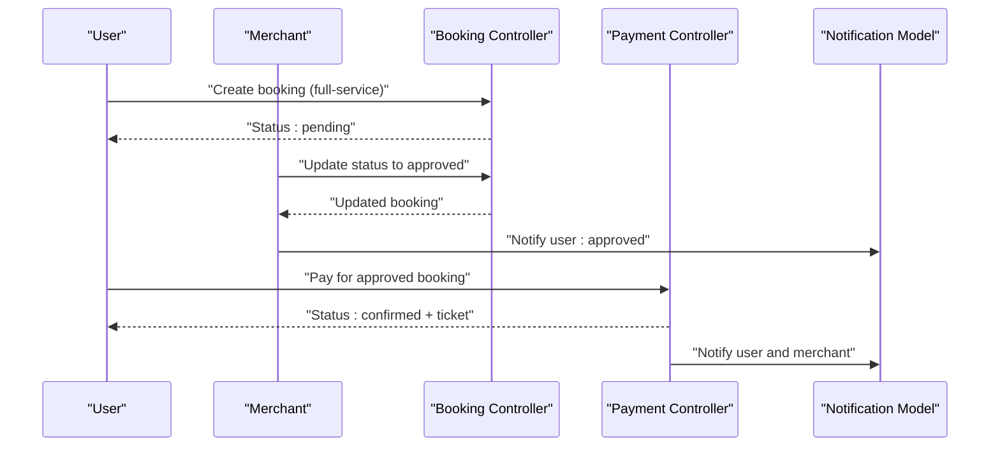
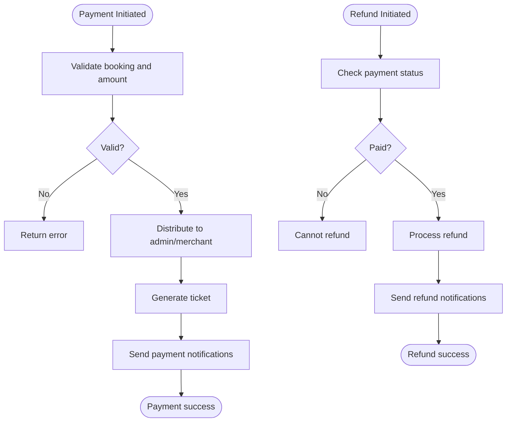
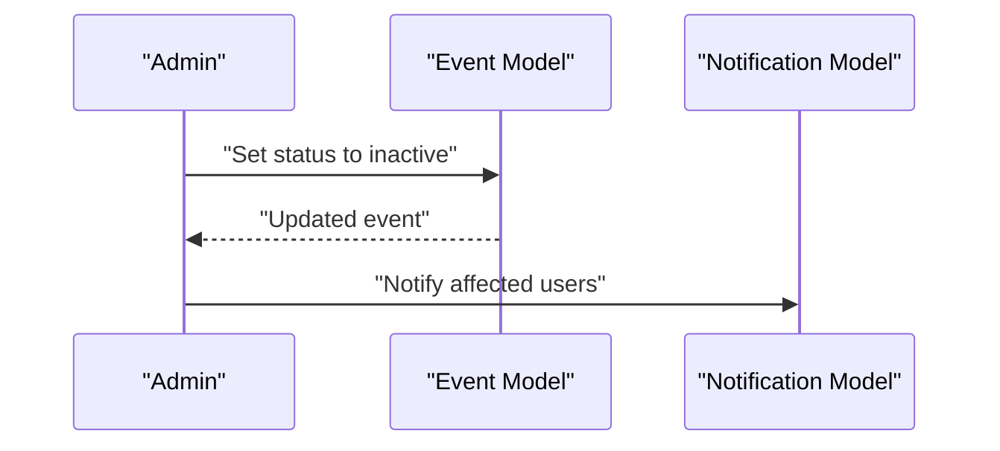
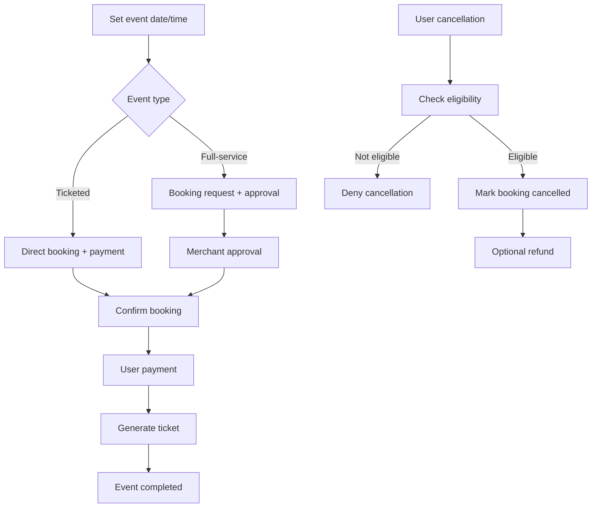
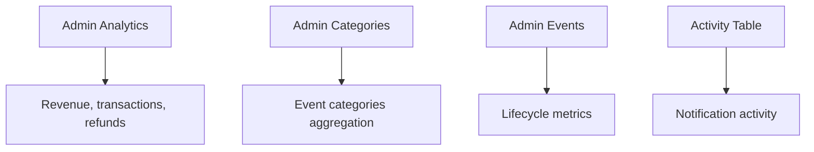
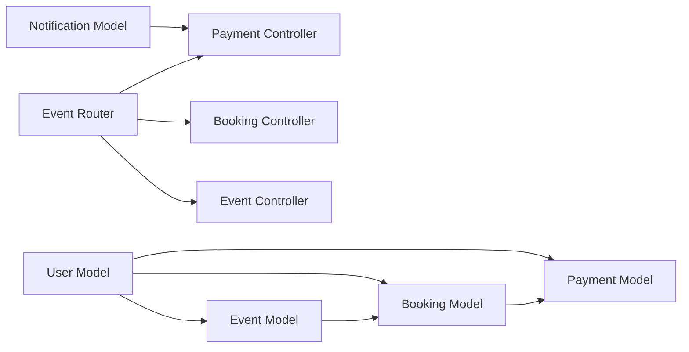

# Event Lifecycle Management

<cite>
**Referenced Files in This Document**
- [eventSchema.js](file://backend/models/eventSchema.js)
- [eventController.js](file://backend/controller/eventController.js)
- [eventRouter.js](file://backend/router/eventRouter.js)
- [bookingSchema.js](file://backend/models/bookingSchema.js)
- [bookingController.js](file://backend/controller/bookingController.js)
- [notificationSchema.js](file://backend/models/notificationSchema.js)
- [paymentSchema.js](file://backend/models/paymentSchema.js)
- [paymentController.js](file://backend/controller/paymentController.js)
- [userSchema.js](file://backend/models/userSchema.js)
- [merchantController.js](file://backend/controller/merchantController.js)
- [EVENT_TYPE_WORKFLOWS_IMPLEMENTATION.md](file://EVENT_TYPE_WORKFLOWS_IMPLEMENTATION.md)
- [TICKETED_BOOKING_FLOW_FIX.md](file://TICKETED_BOOKING_FLOW_FIX.md)
- [FULL_SERVICE_EVENT_FIX_SUMMARY.md](file://FULL_SERVICE_EVENT_FIX_SUMMARY.md)
- [BOOKING_WORKFLOW_IMPLEMENTATION.md](file://BOOKING_WORKFLOW_IMPLEMENTATION.md)
- [test-event-types.js](file://test-event-types.js)
- [simple-events-debug.js](file://backend/simple-events-debug.js)
- [AdminAnalytics.jsx](file://frontend/src/pages/dashboards/AdminAnalytics.jsx)
- [AdminCategories.jsx](file://frontend/src/pages/dashboards/AdminCategories.jsx)
- [AdminEvents.jsx](file://frontend/src/pages/dashboards/AdminEvents.jsx)
- [ActivityTable.jsx](file://frontend/src/components/admin/ActivityTable.jsx)
- [testCompleteWorkflow.js](file://backend/scripts/testCompleteWorkflow.js)
</cite>

## Table of Contents
1. [Introduction](#introduction)
2. [Project Structure](#project-structure)
3. [Core Components](#core-components)
4. [Architecture Overview](#architecture-overview)
5. [Detailed Component Analysis](#detailed-component-analysis)
6. [Dependency Analysis](#dependency-analysis)
7. [Performance Considerations](#performance-considerations)
8. [Troubleshooting Guide](#troubleshooting-guide)
9. [Conclusion](#conclusion)
10. [Appendices](#appendices)

## Introduction
This document provides comprehensive documentation for event lifecycle management across the entire event journey. It explains event status transitions, approval workflows, moderation processes, and event completion tracking. It also covers event categorization, type management, scheduling/rescheduling/cancellation, and post-event activities. Analytics, performance tracking, and lifecycle optimization strategies are included, along with practical examples of status management, approval workflows, and lifecycle automation processes.

## Project Structure
The event lifecycle spans backend models/controllers/routers, frontend dashboards, and supporting scripts and documentation. The backend defines event and booking schemas, payment and notification models, and controllers for event registration, booking management, and payment processing. Frontend dashboards expose analytics, categories, and administrative views. Scripts and markdown documents validate workflows and provide implementation summaries.

**Diagram sources**
- [eventSchema.js:1-51](file://backend/models/eventSchema.js#L1-L51)
- [bookingSchema.js:1-53](file://backend/models/bookingSchema.js#L1-L53)
- [paymentSchema.js:1-142](file://backend/models/paymentSchema.js#L1-L142)
- [notificationSchema.js:1-36](file://backend/models/notificationSchema.js#L1-L36)
- [userSchema.js:1-55](file://backend/models/userSchema.js#L1-L55)
- [eventController.js:1-35](file://backend/controller/eventController.js#L1-L35)
- [bookingController.js:1-233](file://backend/controller/bookingController.js#L1-L233)
- [paymentController.js:1-577](file://backend/controller/paymentController.js#L1-L577)
- [merchantController.js:74-98](file://backend/controller/merchantController.js#L74-L98)
- [eventRouter.js:1-13](file://backend/router/eventRouter.js#L1-L13)
- [AdminAnalytics.jsx:72-92](file://frontend/src/pages/dashboards/AdminAnalytics.jsx#L72-L92)
- [AdminCategories.jsx:1-72](file://frontend/src/pages/dashboards/AdminCategories.jsx#L1-L72)
- [AdminEvents.jsx:83-107](file://frontend/src/pages/dashboards/AdminEvents.jsx#L83-L107)
- [ActivityTable.jsx:32-54](file://frontend/src/components/admin/ActivityTable.jsx#L32-L54)
- [EVENT_TYPE_WORKFLOWS_IMPLEMENTATION.md:40-149](file://EVENT_TYPE_WORKFLOWS_IMPLEMENTATION.md#L40-L149)
- [TICKETED_BOOKING_FLOW_FIX.md:85-126](file://TICKETED_BOOKING_FLOW_FIX.md#L85-L126)
- [FULL_SERVICE_EVENT_FIX_SUMMARY.md:1-134](file://FULL_SERVICE_EVENT_FIX_SUMMARY.md#L1-L134)
- [BOOKING_WORKFLOW_IMPLEMENTATION.md:170-224](file://BOOKING_WORKFLOW_IMPLEMENTATION.md#L170-L224)
- [test-event-types.js:1-33](file://test-event-types.js#L1-L33)
- [simple-events-debug.js:29-51](file://backend/simple-events-debug.js#L29-L51)
- [testCompleteWorkflow.js:141-170](file://backend/scripts/testCompleteWorkflow.js#L141-L170)

**Section sources**
- [eventSchema.js:1-51](file://backend/models/eventSchema.js#L1-L51)
- [bookingSchema.js:1-53](file://backend/models/bookingSchema.js#L1-L53)
- [paymentSchema.js:1-142](file://backend/models/paymentSchema.js#L1-L142)
- [notificationSchema.js:1-36](file://backend/models/notificationSchema.js#L1-L36)
- [userSchema.js:1-55](file://backend/models/userSchema.js#L1-L55)
- [eventController.js:1-35](file://backend/controller/eventController.js#L1-L35)
- [bookingController.js:1-233](file://backend/controller/bookingController.js#L1-L233)
- [paymentController.js:1-577](file://backend/controller/paymentController.js#L1-L577)
- [merchantController.js:74-98](file://backend/controller/merchantController.js#L74-L98)
- [eventRouter.js:1-13](file://backend/router/eventRouter.js#L1-L13)
- [AdminAnalytics.jsx:72-92](file://frontend/src/pages/dashboards/AdminAnalytics.jsx#L72-L92)
- [AdminCategories.jsx:1-72](file://frontend/src/pages/dashboards/AdminCategories.jsx#L1-L72)
- [AdminEvents.jsx:83-107](file://frontend/src/pages/dashboards/AdminEvents.jsx#L83-L107)
- [ActivityTable.jsx:32-54](file://frontend/src/components/admin/ActivityTable.jsx#L32-L54)
- [EVENT_TYPE_WORKFLOWS_IMPLEMENTATION.md:40-149](file://EVENT_TYPE_WORKFLOWS_IMPLEMENTATION.md#L40-L149)
- [TICKETED_BOOKING_FLOW_FIX.md:85-126](file://TICKETED_BOOKING_FLOW_FIX.md#L85-L126)
- [FULL_SERVICE_EVENT_FIX_SUMMARY.md:1-134](file://FULL_SERVICE_EVENT_FIX_SUMMARY.md#L1-L134)
- [BOOKING_WORKFLOW_IMPLEMENTATION.md:170-224](file://BOOKING_WORKFLOW_IMPLEMENTATION.md#L170-L224)
- [test-event-types.js:1-33](file://test-event-types.js#L1-L33)
- [simple-events-debug.js:29-51](file://backend/simple-events-debug.js#L29-L51)
- [testCompleteWorkflow.js:141-170](file://backend/scripts/testCompleteWorkflow.js#L141-L170)

## Core Components
- Event model: Defines event attributes, scheduling, ticketing, addons, and status. Supports event categorization and type differentiation.
- Booking model: Manages booking lifecycle with statuses and links to users and events.
- Payment model: Tracks payment distribution, refunds, and payout statuses.
- Notification model: Centralizes notifications for bookings, payments, and refunds.
- Controllers: Implement event listing and registration, booking creation/cancellation/status updates, and payment/refund processing.
- Merchant controller: Handles event creation/update with type-aware validations.
- Frontend dashboards: Provide analytics, categories, and administrative views for lifecycle insights.

**Section sources**
- [eventSchema.js:3-48](file://backend/models/eventSchema.js#L3-L48)
- [bookingSchema.js:3-49](file://backend/models/bookingSchema.js#L3-L49)
- [paymentSchema.js:3-127](file://backend/models/paymentSchema.js#L3-L127)
- [notificationSchema.js:3-32](file://backend/models/notificationSchema.js#L3-L32)
- [eventController.js:4-34](file://backend/controller/eventController.js#L4-L34)
- [bookingController.js:4-232](file://backend/controller/bookingController.js#L4-L232)
- [paymentController.js:11-577](file://backend/controller/paymentController.js#L11-L577)
- [merchantController.js:100-98](file://backend/controller/merchantController.js#L100-L98)

## Architecture Overview
The system separates concerns across models, controllers, routers, and frontend dashboards. Event lifecycle orchestration integrates:
- Event creation and categorization/type management
- Booking initiation and approval/moderation
- Payment processing and refund handling
- Notifications and analytics
- Administrative oversight and reporting

**Diagram sources**
- [eventRouter.js:1-13](file://backend/router/eventRouter.js#L1-L13)
- [eventController.js:1-35](file://backend/controller/eventController.js#L1-L35)
- [bookingController.js:1-233](file://backend/controller/bookingController.js#L1-L233)
- [paymentController.js:1-577](file://backend/controller/paymentController.js#L1-L577)
- [merchantController.js:74-98](file://backend/controller/merchantController.js#L74-L98)
- [eventSchema.js:1-51](file://backend/models/eventSchema.js#L1-L51)
- [bookingSchema.js:1-53](file://backend/models/bookingSchema.js#L1-L53)
- [paymentSchema.js:1-142](file://backend/models/paymentSchema.js#L1-L142)
- [notificationSchema.js:1-36](file://backend/models/notificationSchema.js#L1-L36)
- [userSchema.js:1-55](file://backend/models/userSchema.js#L1-L55)

## Detailed Component Analysis

### Event Lifecycle and Status Management
- Event status: Active, inactive, completed. Used for visibility and completion tracking.
- Event type: Full-service vs ticketed. Drives distinct booking and approval flows.
- Scheduling: Date/time for ticketed events; service date/time stored separately for full-service bookings.
- Categorization: Category field supports analytics and discovery.

**Diagram sources**
- [eventSchema.js:29-29](file://backend/models/eventSchema.js#L29-L29)

**Section sources**
- [eventSchema.js:5-18](file://backend/models/eventSchema.js#L5-L18)
- [eventSchema.js:29-29](file://backend/models/eventSchema.js#L29-L29)
- [FULL_SERVICE_EVENT_FIX_SUMMARY.md:10-33](file://FULL_SERVICE_EVENT_FIX_SUMMARY.md#L10-L33)
- [EVENT_TYPE_WORKFLOWS_IMPLEMENTATION.md:80-129](file://EVENT_TYPE_WORKFLOWS_IMPLEMENTATION.md#L80-L129)

### Booking Lifecycle and Approval Workflows
- Booking statuses: Pending, confirmed, cancelled, completed.
- Full-service workflow:
  - User initiates booking with service date, guests, notes.
  - Merchant reviews and approves/rejects.
  - Upon approval, user pays; booking becomes confirmed.
- Ticketed workflow:
  - Immediate payment upon ticket selection.
  - Booking confirmed instantly; ticket generated.

**Diagram sources**
- [bookingController.js:194-232](file://backend/controller/bookingController.js#L194-L232)
- [paymentController.js:11-141](file://backend/controller/paymentController.js#L11-L141)
- [notificationSchema.js:19-30](file://backend/models/notificationSchema.js#L19-L30)
- [EVENT_TYPE_WORKFLOWS_IMPLEMENTATION.md:80-106](file://EVENT_TYPE_WORKFLOWS_IMPLEMENTATION.md#L80-L106)

**Section sources**
- [bookingController.js:4-232](file://backend/controller/bookingController.js#L4-L232)
- [paymentController.js:11-141](file://backend/controller/paymentController.js#L11-L141)
- [EVENT_TYPE_WORKFLOWS_IMPLEMENTATION.md:80-129](file://EVENT_TYPE_WORKFLOWS_IMPLEMENTATION.md#L80-L129)
- [TICKETED_BOOKING_FLOW_FIX.md:85-126](file://TICKETED_BOOKING_FLOW_FIX.md#L85-L126)

### Payment Processing and Refunds
- Payment distribution: Admin commission and merchant earnings computed and recorded.
- Payment statuses: Pending, success, failed, refunded.
- Refund processing: Authorized by booking owner or admin; notifications sent.

**Diagram sources**
- [paymentController.js:11-141](file://backend/controller/paymentController.js#L11-L141)
- [paymentController.js:222-315](file://backend/controller/paymentController.js#L222-L315)
- [paymentSchema.js:48-86](file://backend/models/paymentSchema.js#L48-L86)

**Section sources**
- [paymentController.js:11-141](file://backend/controller/paymentController.js#L11-L141)
- [paymentController.js:222-315](file://backend/controller/paymentController.js#L222-L315)
- [paymentSchema.js:3-127](file://backend/models/paymentSchema.js#L3-L127)

### Event Moderation and Completion Tracking
- Moderation: Events can be marked inactive via admin controls.
- Completion: Events transition to completed after their scheduled date.
- Notifications: Automated alerts for approvals, payments, and refunds keep stakeholders informed.

**Diagram sources**
- [eventSchema.js:29-29](file://backend/models/eventSchema.js#L29-L29)
- [notificationSchema.js:19-30](file://backend/models/notificationSchema.js#L19-L30)

**Section sources**
- [eventSchema.js:29-29](file://backend/models/eventSchema.js#L29-L29)
- [notificationSchema.js:19-30](file://backend/models/notificationSchema.js#L19-L30)

### Event Scheduling, Rescheduling, Cancellation, and Post-Event Activities
- Scheduling: Ticketed events require date/time; full-service events defer scheduling to booking.
- Rescheduling: Implemented via separate service date/time fields for full-service bookings.
- Cancellation: Users can cancel bookings except completed ones; refunds handled when applicable.
- Post-event activities: Payments finalized, tickets distributed, and analytics updated.

**Diagram sources**
- [bookingController.js:125-171](file://backend/controller/bookingController.js#L125-L171)
- [paymentController.js:222-315](file://backend/controller/paymentController.js#L222-L315)
- [FULL_SERVICE_EVENT_FIX_SUMMARY.md:17-32](file://FULL_SERVICE_EVENT_FIX_SUMMARY.md#L17-L32)
- [EVENT_TYPE_WORKFLOWS_IMPLEMENTATION.md:108-129](file://EVENT_TYPE_WORKFLOWS_IMPLEMENTATION.md#L108-L129)

**Section sources**
- [bookingController.js:125-171](file://backend/controller/bookingController.js#L125-L171)
- [paymentController.js:222-315](file://backend/controller/paymentController.js#L222-L315)
- [FULL_SERVICE_EVENT_FIX_SUMMARY.md:17-32](file://FULL_SERVICE_EVENT_FIX_SUMMARY.md#L17-L32)
- [EVENT_TYPE_WORKFLOWS_IMPLEMENTATION.md:108-129](file://EVENT_TYPE_WORKFLOWS_IMPLEMENTATION.md#L108-L129)

### Event Analytics, Performance Tracking, and Lifecycle Optimization
- Analytics: Admin dashboards compute ratios, revenue, and monthly trends.
- Categories: Derived from live events to guide marketing and discovery.
- Lifecycle optimization: Clear status transitions, automated notifications, and refund workflows reduce friction.

**Diagram sources**
- [AdminAnalytics.jsx:72-92](file://frontend/src/pages/dashboards/AdminAnalytics.jsx#L72-L92)
- [AdminCategories.jsx:13-30](file://frontend/src/pages/dashboards/AdminCategories.jsx#L13-L30)
- [AdminEvents.jsx:83-107](file://frontend/src/pages/dashboards/AdminEvents.jsx#L83-L107)
- [ActivityTable.jsx:32-54](file://frontend/src/components/admin/ActivityTable.jsx#L32-L54)

**Section sources**
- [AdminAnalytics.jsx:72-92](file://frontend/src/pages/dashboards/AdminAnalytics.jsx#L72-L92)
- [AdminCategories.jsx:13-30](file://frontend/src/pages/dashboards/AdminCategories.jsx#L13-L30)
- [AdminEvents.jsx:83-107](file://frontend/src/pages/dashboards/AdminEvents.jsx#L83-L107)
- [ActivityTable.jsx:32-54](file://frontend/src/components/admin/ActivityTable.jsx#L32-L54)

## Dependency Analysis
- Event model depends on user for creator reference.
- Booking model references user and event; payment model references booking and event.
- Controllers depend on models and enforce authorization and validation.
- Frontend dashboards consume backend endpoints for analytics and administrative tasks.

**Diagram sources**
- [userSchema.js:1-55](file://backend/models/userSchema.js#L1-L55)
- [eventSchema.js:45-45](file://backend/models/eventSchema.js#L45-L45)
- [bookingSchema.js:5-9](file://backend/models/bookingSchema.js#L5-L9)
- [paymentSchema.js:5-23](file://backend/models/paymentSchema.js#L5-L23)
- [notificationSchema.js:5-25](file://backend/models/notificationSchema.js#L5-L25)
- [eventRouter.js:1-13](file://backend/router/eventRouter.js#L1-L13)
- [eventController.js:1-35](file://backend/controller/eventController.js#L1-L35)
- [bookingController.js:1-233](file://backend/controller/bookingController.js#L1-L233)
- [paymentController.js:1-577](file://backend/controller/paymentController.js#L1-L577)

**Section sources**
- [userSchema.js:1-55](file://backend/models/userSchema.js#L1-L55)
- [eventSchema.js:45-45](file://backend/models/eventSchema.js#L45-L45)
- [bookingSchema.js:5-9](file://backend/models/bookingSchema.js#L5-L9)
- [paymentSchema.js:5-23](file://backend/models/paymentSchema.js#L5-L23)
- [notificationSchema.js:5-25](file://backend/models/notificationSchema.js#L5-L25)
- [eventRouter.js:1-13](file://backend/router/eventRouter.js#L1-L13)

## Performance Considerations
- Indexes on payment and notification collections improve query performance for analytics and notifications.
- Aggregation pipelines in payment controller enable efficient revenue and refund computations.
- Conditional field requirements reduce unnecessary validations for different event types.
- Notifications are created asynchronously to avoid blocking primary flows.

[No sources needed since this section provides general guidance]

## Troubleshooting Guide
- Event type validation: Ensure events have eventType set; backend scripts and tests verify this.
- Booking conflicts: Prevent duplicate bookings for the same service with pending/confirmed status.
- Payment prerequisites: Payments require approved or confirmed bookings; otherwise, return appropriate errors.
- Refund eligibility: Refunds apply only to paid bookings; unauthorized users are denied.
- Notification failures: Payment/refund controllers log notification creation errors for diagnostics.

**Section sources**
- [simple-events-debug.js:29-51](file://backend/simple-events-debug.js#L29-L51)
- [bookingController.js:26-38](file://backend/controller/bookingController.js#L26-L38)
- [paymentController.js:34-48](file://backend/controller/paymentController.js#L34-L48)
- [paymentController.js:247-253](file://backend/controller/paymentController.js#L247-L253)
- [paymentController.js:98-113](file://backend/controller/paymentController.js#L98-L113)
- [paymentController.js:279-293](file://backend/controller/paymentController.js#L279-L293)

## Conclusion
The event lifecycle management system integrates event modeling, booking workflows, payment processing, and notifications to support both full-service and ticketed events. Clear status transitions, type-aware flows, and robust moderation and analytics capabilities enable efficient operations and optimization across the entire lifecycle.

[No sources needed since this section summarizes without analyzing specific files]

## Appendices

### Event Status Management Examples
- Full-service approval flow: pending → approved → confirmed.
- Ticketed instant flow: confirmed immediately after payment.
- Payment flow: pending → paid.
- Ticket flow: not generated → generated.

**Section sources**
- [EVENT_TYPE_WORKFLOWS_IMPLEMENTATION.md:80-129](file://EVENT_TYPE_WORKFLOWS_IMPLEMENTATION.md#L80-L129)
- [testCompleteWorkflow.js:146-159](file://backend/scripts/testCompleteWorkflow.js#L146-L159)

### Approval Workflows and Automation
- Merchant-only approvals for full-service events.
- Automated notifications on approval, payment, and refund.
- Status progression enforced by controllers.

**Section sources**
- [bookingController.js:194-232](file://backend/controller/bookingController.js#L194-L232)
- [paymentController.js:90-113](file://backend/controller/paymentController.js#L90-L113)
- [paymentController.js:269-293](file://backend/controller/paymentController.js#L269-L293)
- [BOOKING_WORKFLOW_IMPLEMENTATION.md:200-209](file://BOOKING_WORKFLOW_IMPLEMENTATION.md#L200-L209)

### Lifecycle Automation Processes
- Event completion tracking via status transitions.
- Automated ticket generation on payment success.
- Refund processing with notifications.

**Section sources**
- [eventSchema.js:29-29](file://backend/models/eventSchema.js#L29-L29)
- [paymentController.js:83-87](file://backend/controller/paymentController.js#L83-L87)
- [paymentController.js:264-264](file://backend/controller/paymentController.js#L264-L264)