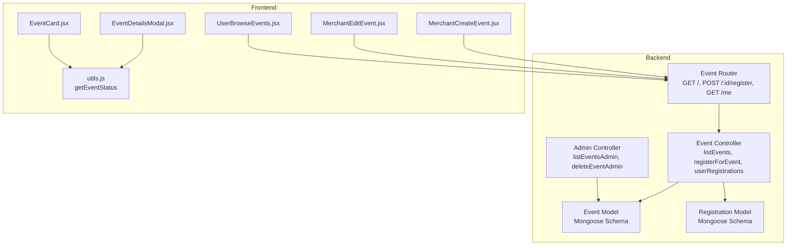
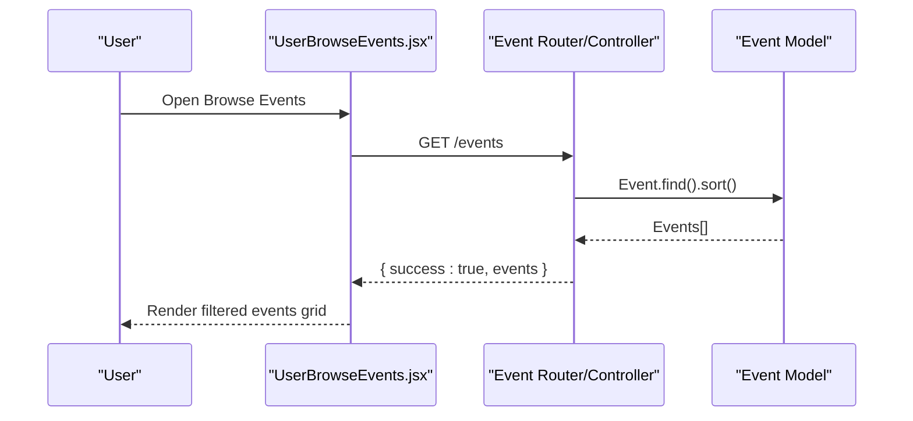
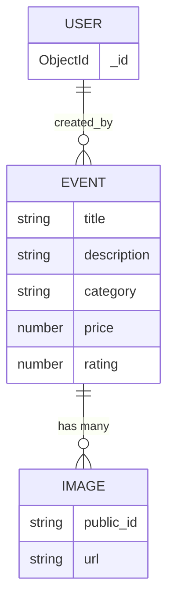
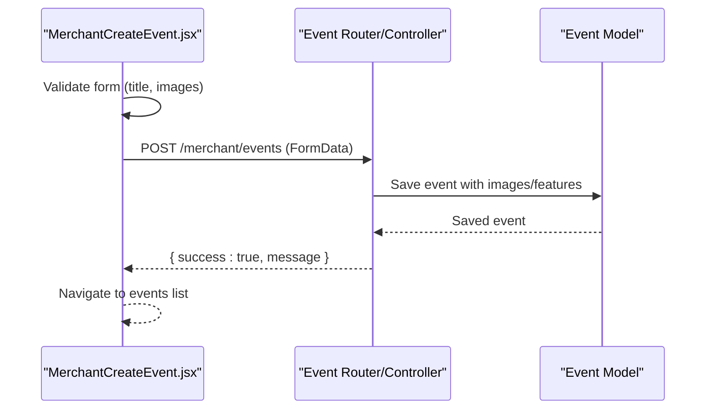
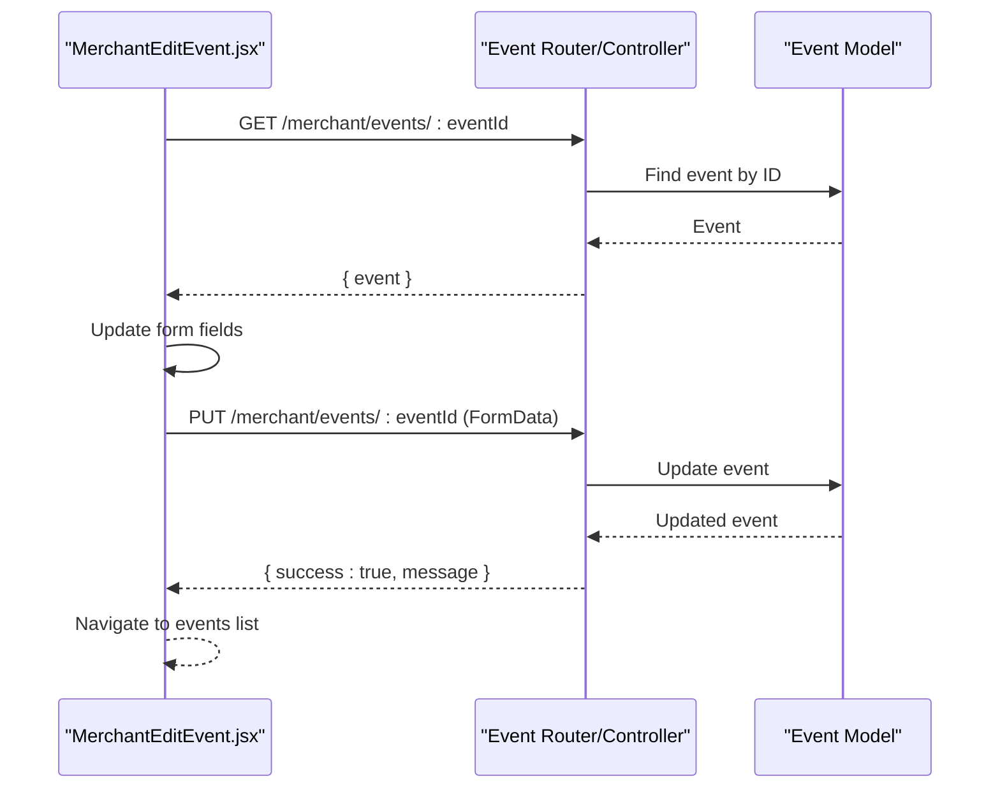
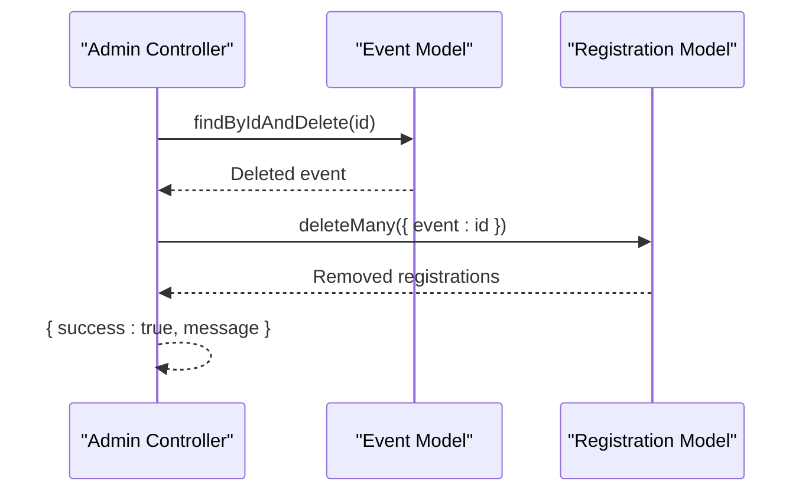
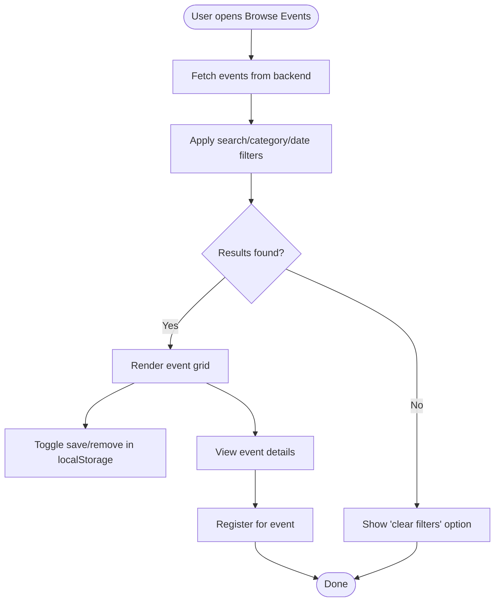
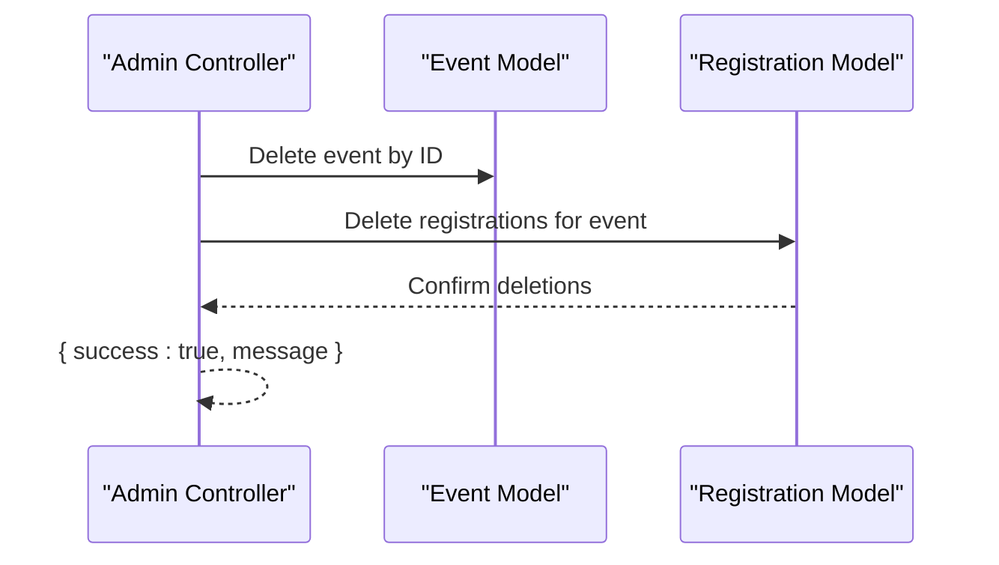
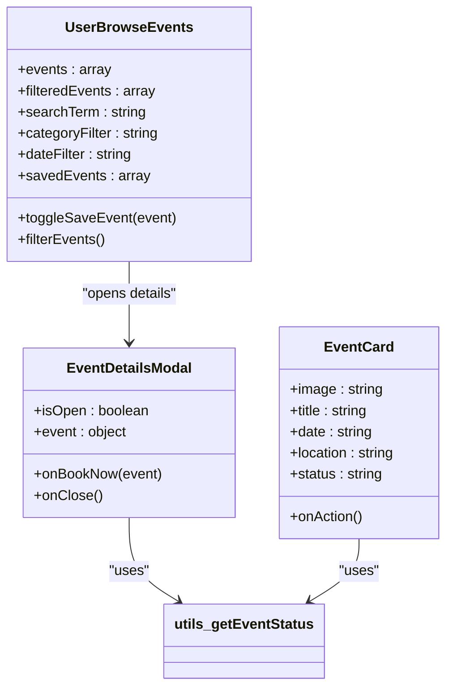
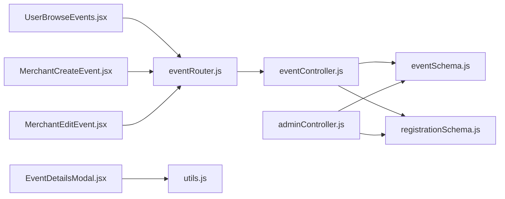

# Event Management System

<cite>
**Referenced Files in This Document**
- [eventSchema.js](file://backend/models/eventSchema.js)
- [eventController.js](file://backend/controller/eventController.js)
- [eventRouter.js](file://backend/router/eventRouter.js)
- [adminController.js](file://backend/controller/adminController.js)
- [registrationSchema.js](file://backend/models/registrationSchema.js)
- [MerchantCreateEvent.jsx](file://frontend/src/pages/dashboards/MerchantCreateEvent.jsx)
- [MerchantEditEvent.jsx](file://frontend/src/pages/dashboards/MerchantEditEvent.jsx)
- [UserBrowseEvents.jsx](file://frontend/src/pages/dashboards/UserBrowseEvents.jsx)
- [EventDetailsModal.jsx](file://frontend/src/components/EventDetailsModal.jsx)
- [EventCard.jsx](file://frontend/src/components/user/EventCard.jsx)
- [utils.js](file://frontend/src/lib/utils.js)
</cite>

## Table of Contents
1. [Introduction](#introduction)
2. [Project Structure](#project-structure)
3. [Core Components](#core-components)
4. [Architecture Overview](#architecture-overview)
5. [Detailed Component Analysis](#detailed-component-analysis)
6. [Dependency Analysis](#dependency-analysis)
7. [Performance Considerations](#performance-considerations)
8. [Troubleshooting Guide](#troubleshooting-guide)
9. [Conclusion](#conclusion)

## Introduction
This document describes the Event Management Platform's event lifecycle, covering creation, categorization, availability and pricing, modification, deletion, discovery, and moderation. It explains the current schema design, status management, and user interaction patterns across merchant and user roles. It also outlines approval workflows and event lifecycle management, with practical examples for creating, managing, and browsing events.

## Project Structure
The platform consists of:
- Backend: Express routes/controllers/models for event CRUD, registration, and admin moderation
- Frontend: Merchant dashboards for creating/editing events, user dashboards for browsing and viewing event details, and shared UI components for modals and cards



**Diagram sources**
- [eventRouter.js:1-13](file://backend/router/eventRouter.js#L1-L13)
- [eventController.js:1-35](file://backend/controller/eventController.js#L1-L35)
- [eventSchema.js:1-23](file://backend/models/eventSchema.js#L1-L23)
- [registrationSchema.js:1-12](file://backend/models/registrationSchema.js#L1-L12)
- [adminController.js:89-107](file://backend/controller/adminController.js#L89-L107)
- [MerchantCreateEvent.jsx:1-362](file://frontend/src/pages/dashboards/MerchantCreateEvent.jsx#L1-L362)
- [MerchantEditEvent.jsx:1-413](file://frontend/src/pages/dashboards/MerchantEditEvent.jsx#L1-L413)
- [UserBrowseEvents.jsx:1-379](file://frontend/src/pages/dashboards/UserBrowseEvents.jsx#L1-L379)
- [EventDetailsModal.jsx:1-158](file://frontend/src/components/EventDetailsModal.jsx#L1-L158)
- [EventCard.jsx:1-45](file://frontend/src/components/user/EventCard.jsx#L1-L45)
- [utils.js:1-26](file://frontend/src/lib/utils.js#L1-L26)

**Section sources**
- [eventRouter.js:1-13](file://backend/router/eventRouter.js#L1-L13)
- [eventController.js:1-35](file://backend/controller/eventController.js#L1-L35)
- [eventSchema.js:1-23](file://backend/models/eventSchema.js#L1-L23)
- [registrationSchema.js:1-12](file://backend/models/registrationSchema.js#L1-L12)
- [adminController.js:89-107](file://backend/controller/adminController.js#L89-L107)
- [MerchantCreateEvent.jsx:1-362](file://frontend/src/pages/dashboards/MerchantCreateEvent.jsx#L1-L362)
- [MerchantEditEvent.jsx:1-413](file://frontend/src/pages/dashboards/MerchantEditEvent.jsx#L1-L413)
- [UserBrowseEvents.jsx:1-379](file://frontend/src/pages/dashboards/UserBrowseEvents.jsx#L1-L379)
- [EventDetailsModal.jsx:1-158](file://frontend/src/components/EventDetailsModal.jsx#L1-L158)
- [EventCard.jsx:1-45](file://frontend/src/components/user/EventCard.jsx#L1-L45)
- [utils.js:1-26](file://frontend/src/lib/utils.js#L1-L26)

## Core Components
- Event model defines title, description, category, price, rating, images array, features array, and creator reference
- Event controller exposes listing, user registration, and user registration retrieval
- Event router binds endpoints to controller methods with authentication and role middleware
- Admin controller provides admin-only event listing and deletion, including cascading registration removal
- Merchant forms handle event creation and editing with image uploads, features, and validation
- User browsing page filters and displays events with save/remove functionality
- Event details modal renders gallery, features, organizer, and pricing with status-aware booking controls
- Event card component displays status badges and action buttons

**Section sources**
- [eventSchema.js:1-23](file://backend/models/eventSchema.js#L1-L23)
- [eventController.js:1-35](file://backend/controller/eventController.js#L1-L35)
- [eventRouter.js:1-13](file://backend/router/eventRouter.js#L1-L13)
- [adminController.js:89-107](file://backend/controller/adminController.js#L89-L107)
- [MerchantCreateEvent.jsx:1-362](file://frontend/src/pages/dashboards/MerchantCreateEvent.jsx#L1-L362)
- [MerchantEditEvent.jsx:1-413](file://frontend/src/pages/dashboards/MerchantEditEvent.jsx#L1-L413)
- [UserBrowseEvents.jsx:1-379](file://frontend/src/pages/dashboards/UserBrowseEvents.jsx#L1-L379)
- [EventDetailsModal.jsx:1-158](file://frontend/src/components/EventDetailsModal.jsx#L1-L158)
- [EventCard.jsx:1-45](file://frontend/src/components/user/EventCard.jsx#L1-L45)

## Architecture Overview
The system separates concerns across backend APIs and frontend dashboards:
- Merchant flow: Create/Edit events via dedicated dashboards; backend validates and persists data
- User flow: Browse events, apply filters, save events locally, view details, and register for events
- Admin flow: Moderate events and registrations; delete events and associated registrations



**Diagram sources**
- [UserBrowseEvents.jsx:60-74](file://frontend/src/pages/dashboards/UserBrowseEvents.jsx#L60-L74)
- [eventRouter.js](file://backend/router/eventRouter.js#L8)
- [eventController.js:4-11](file://backend/controller/eventController.js#L4-L11)
- [eventSchema.js:1-23](file://backend/models/eventSchema.js#L1-L23)

## Detailed Component Analysis

### Event Schema Design
The event schema captures essential attributes:
- Identity: title, description, category
- Pricing: price (number)
- Quality: rating (0–5)
- Media: images array with public_id and url
- Extras: features array of strings
- Ownership: createdBy referencing User



**Diagram sources**
- [eventSchema.js:3-20](file://backend/models/eventSchema.js#L3-L20)

**Section sources**
- [eventSchema.js:1-23](file://backend/models/eventSchema.js#L1-L23)

### Event Creation Workflow (Merchant)
Merchants create events via a form that:
- Collects title, description, category, price, rating, and features
- Validates presence of title and at least one image
- Builds FormData and posts to backend endpoint
- Handles errors and success notifications



**Diagram sources**
- [MerchantCreateEvent.jsx:91-162](file://frontend/src/pages/dashboards/MerchantCreateEvent.jsx#L91-L162)
- [eventRouter.js](file://backend/router/eventRouter.js#L8)
- [eventController.js:1-35](file://backend/controller/eventController.js#L1-L35)
- [eventSchema.js:1-23](file://backend/models/eventSchema.js#L1-L23)

**Section sources**
- [MerchantCreateEvent.jsx:1-362](file://frontend/src/pages/dashboards/MerchantCreateEvent.jsx#L1-L362)

### Event Modification Workflow (Merchant)
Merchants edit existing events:
- Load event data and prefill form
- Allow adding/removing new images while preserving existing ones
- Submit updates via PUT to backend endpoint
- Handle validation and error messaging



**Diagram sources**
- [MerchantEditEvent.jsx:29-180](file://frontend/src/pages/dashboards/MerchantEditEvent.jsx#L29-L180)
- [eventRouter.js](file://backend/router/eventRouter.js#L8)
- [eventController.js:1-35](file://backend/controller/eventController.js#L1-L35)
- [eventSchema.js:1-23](file://backend/models/eventSchema.js#L1-L23)

**Section sources**
- [MerchantEditEvent.jsx:1-413](file://frontend/src/pages/dashboards/MerchantEditEvent.jsx#L1-L413)

### Event Deletion Process (Admin)
Admins can delete events and associated registrations:
- Delete event document
- Cascade-delete related registrations



**Diagram sources**
- [adminController.js:98-107](file://backend/controller/adminController.js#L98-L107)
- [eventSchema.js:1-23](file://backend/models/eventSchema.js#L1-L23)
- [registrationSchema.js:1-12](file://backend/models/registrationSchema.js#L1-L12)

**Section sources**
- [adminController.js:89-107](file://backend/controller/adminController.js#L89-L107)

### Event Registration and Discovery
Users browse events, apply filters, and save events locally:
- Fetch all events from backend
- Apply search, category, and date filters
- Toggle saved events in local storage
- View event details and register for events



**Diagram sources**
- [UserBrowseEvents.jsx:24-124](file://frontend/src/pages/dashboards/UserBrowseEvents.jsx#L24-L124)
- [eventRouter.js:8-10](file://backend/router/eventRouter.js#L8-L10)
- [eventController.js:4-35](file://backend/controller/eventController.js#L4-L35)

**Section sources**
- [UserBrowseEvents.jsx:1-379](file://frontend/src/pages/dashboards/UserBrowseEvents.jsx#L1-L379)
- [eventController.js:13-35](file://backend/controller/eventController.js#L13-L35)

### Event Status Management
Event status is computed client-side based on date, time, and duration:
- Live: current moment falls within start–end window
- Completed: current moment is after end
- Upcoming: otherwise

```mermaid
flowchart TD
Start(["Compute status"]) --> CheckDate["Has event date?"]
CheckDate --> |No| Upcoming["Status: Upcoming"]
CheckDate --> |Yes| ParseTime["Parse time (HH:mm)"]
ParseTime --> CalcEnd["Calculate end = start + duration"]
CalcEnd --> Compare{"Compare now vs start/end"}
Compare --> |now in [start,end]| Live["Status: Live"]
Compare --> |now > end| Completed["Status: Completed"]
Compare --> |otherwise| Upcoming2["Status: Upcoming"]
```

**Diagram sources**
- [utils.js:6-25](file://frontend/src/lib/utils.js#L6-L25)

**Section sources**
- [utils.js:1-26](file://frontend/src/lib/utils.js#L1-L26)

### Event Moderation and Approval Workflows
- Admin moderation: Admins can list and delete events; deletions cascade to registrations
- Registration flow: Users can register for events; duplicates are prevented
- Approval workflow: The broader booking system includes merchant approval and payment steps for full-service events; ticketed events bypass approval and confirm immediately after payment



**Diagram sources**
- [adminController.js:98-107](file://backend/controller/adminController.js#L98-L107)
- [registrationSchema.js:1-12](file://backend/models/registrationSchema.js#L1-L12)

**Section sources**
- [adminController.js:89-107](file://backend/controller/adminController.js#L89-L107)
- [eventController.js:13-35](file://backend/controller/eventController.js#L13-L35)

### User Interaction Patterns
- EventDetailsModal: Displays gallery, features, organizer, and pricing; enables booking based on status
- EventCard: Renders status badges and action buttons for upcoming/full/cancelled states
- UserBrowseEvents: Provides search, category, and date filtering; toggles saved events locally



**Diagram sources**
- [EventDetailsModal.jsx:1-158](file://frontend/src/components/EventDetailsModal.jsx#L1-L158)
- [EventCard.jsx:1-45](file://frontend/src/components/user/EventCard.jsx#L1-L45)
- [UserBrowseEvents.jsx:1-379](file://frontend/src/pages/dashboards/UserBrowseEvents.jsx#L1-L379)
- [utils.js:1-26](file://frontend/src/lib/utils.js#L1-L26)

**Section sources**
- [EventDetailsModal.jsx:1-158](file://frontend/src/components/EventDetailsModal.jsx#L1-L158)
- [EventCard.jsx:1-45](file://frontend/src/components/user/EventCard.jsx#L1-L45)
- [UserBrowseEvents.jsx:1-379](file://frontend/src/pages/dashboards/UserBrowseEvents.jsx#L1-L379)
- [utils.js:1-26](file://frontend/src/lib/utils.js#L1-L26)

## Dependency Analysis
- Frontend depends on backend routes for listing, registering, and retrieving user registrations
- Backend controllers depend on models for persistence
- Admin controller depends on event and registration models for moderation tasks



**Diagram sources**
- [UserBrowseEvents.jsx:1-379](file://frontend/src/pages/dashboards/UserBrowseEvents.jsx#L1-L379)
- [MerchantCreateEvent.jsx:1-362](file://frontend/src/pages/dashboards/MerchantCreateEvent.jsx#L1-L362)
- [MerchantEditEvent.jsx:1-413](file://frontend/src/pages/dashboards/MerchantEditEvent.jsx#L1-L413)
- [EventDetailsModal.jsx:1-158](file://frontend/src/components/EventDetailsModal.jsx#L1-L158)
- [utils.js:1-26](file://frontend/src/lib/utils.js#L1-L26)
- [eventRouter.js:1-13](file://backend/router/eventRouter.js#L1-L13)
- [eventController.js:1-35](file://backend/controller/eventController.js#L1-L35)
- [eventSchema.js:1-23](file://backend/models/eventSchema.js#L1-L23)
- [registrationSchema.js:1-12](file://backend/models/registrationSchema.js#L1-L12)
- [adminController.js:89-107](file://backend/controller/adminController.js#L89-L107)

**Section sources**
- [eventRouter.js:1-13](file://backend/router/eventRouter.js#L1-L13)
- [eventController.js:1-35](file://backend/controller/eventController.js#L1-L35)
- [eventSchema.js:1-23](file://backend/models/eventSchema.js#L1-L23)
- [registrationSchema.js:1-12](file://backend/models/registrationSchema.js#L1-L12)
- [adminController.js:89-107](file://backend/controller/adminController.js#L89-L107)
- [UserBrowseEvents.jsx:1-379](file://frontend/src/pages/dashboards/UserBrowseEvents.jsx#L1-L379)
- [MerchantCreateEvent.jsx:1-362](file://frontend/src/pages/dashboards/MerchantCreateEvent.jsx#L1-L362)
- [MerchantEditEvent.jsx:1-413](file://frontend/src/pages/dashboards/MerchantEditEvent.jsx#L1-L413)
- [EventDetailsModal.jsx:1-158](file://frontend/src/components/EventDetailsModal.jsx#L1-L158)
- [utils.js:1-26](file://frontend/src/lib/utils.js#L1-L26)

## Performance Considerations
- Client-side filtering: Efficient for small to medium datasets; consider pagination or server-side filtering for large event catalogs
- Image handling: Limit uploads to 4 images with 5MB cap per file to reduce payload sizes
- Status computation: Lightweight client-side calculation avoids extra network requests
- Cascading deletes: Ensure database indexes exist on foreign keys to optimize admin deletion performance

## Troubleshooting Guide
- Event creation fails: Verify title and minimum image requirements; check backend error messages returned to frontend
- Registration conflicts: Duplicate registration prevention returns conflict status; ensure users are logged in and not re-registering
- Admin deletion issues: Confirm event ID exists and that cascading deletion removes registrations
- Status display anomalies: Validate date/time fields; ensure proper parsing and timezone handling

**Section sources**
- [MerchantCreateEvent.jsx:100-162](file://frontend/src/pages/dashboards/MerchantCreateEvent.jsx#L100-L162)
- [eventController.js:13-25](file://backend/controller/eventController.js#L13-L25)
- [adminController.js:98-107](file://backend/controller/adminController.js#L98-L107)
- [utils.js:6-25](file://frontend/src/lib/utils.js#L6-L25)

## Conclusion
The Event Management Platform provides a clear separation between merchant event creation/editing, user discovery and registration, and admin moderation. The current schema supports essential event metadata, while the frontend offers robust filtering and status-aware UI components. The approval workflow and ticketed event handling are integrated in the broader booking system, enabling streamlined user experiences for both full-service and ticketed events.