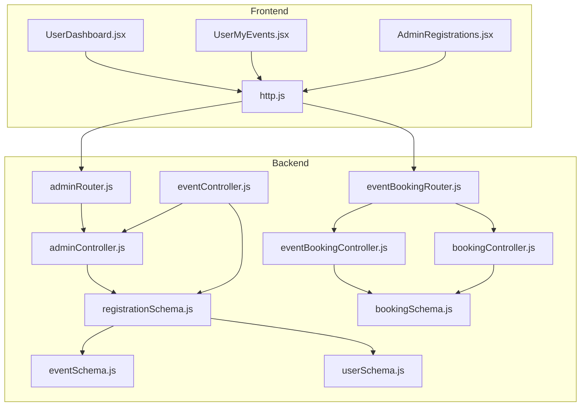
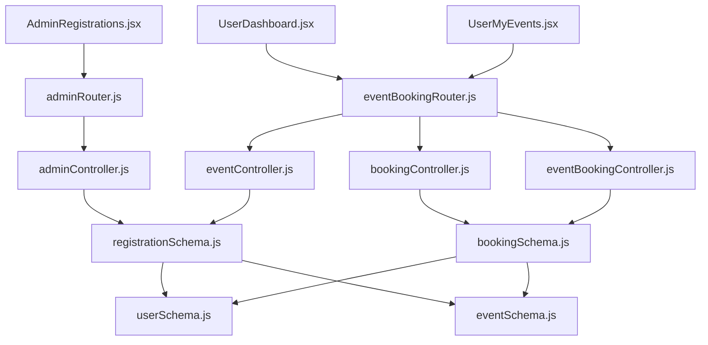
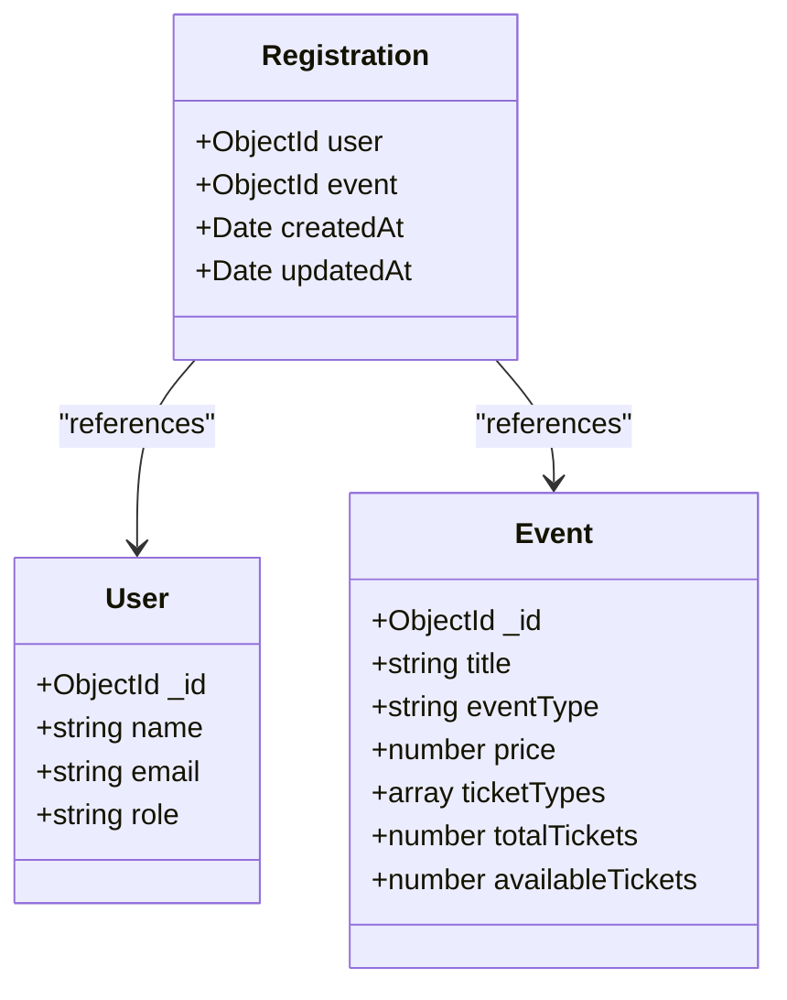
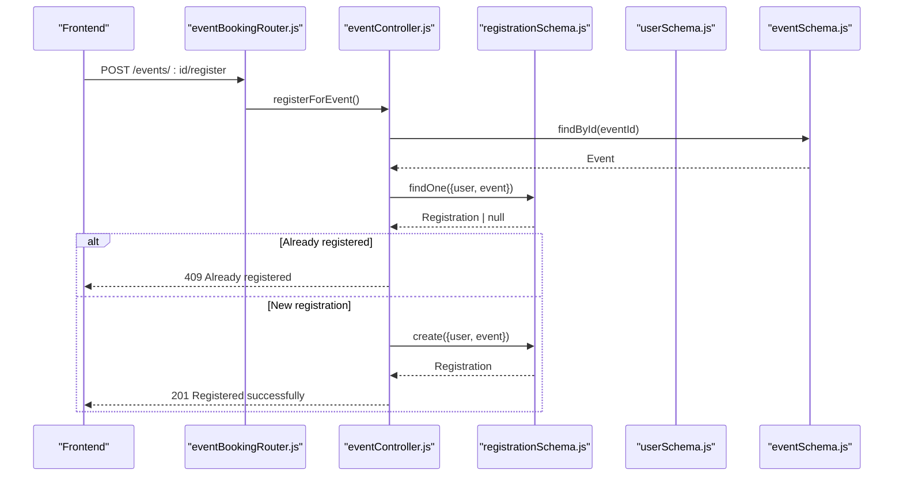
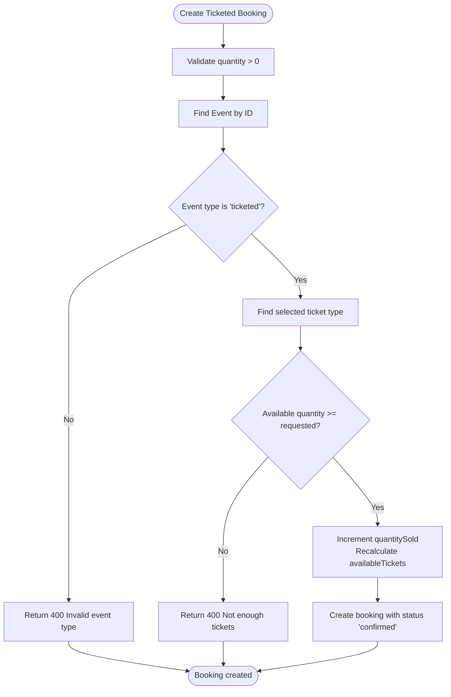
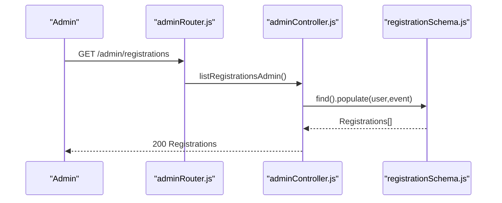
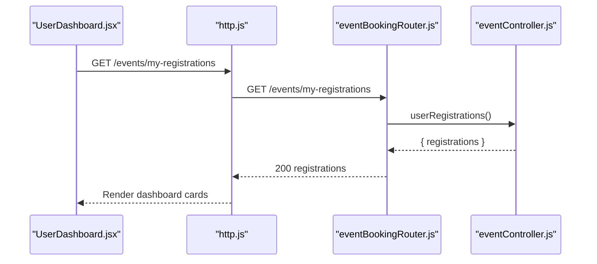
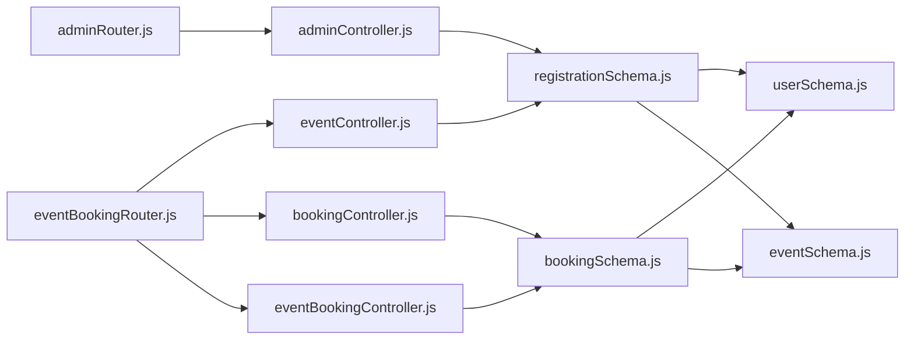

# Event Registration System

<cite>
**Referenced Files in This Document**
- [registrationSchema.js](file://backend/models/registrationSchema.js)
- [eventSchema.js](file://backend/models/eventSchema.js)
- [userSchema.js](file://backend/models/userSchema.js)
- [eventController.js](file://backend/controller/eventController.js)
- [eventBookingController.js](file://backend/controller/eventBookingController.js)
- [bookingSchema.js](file://backend/models/bookingSchema.js)
- [bookingController.js](file://backend/controller/bookingController.js)
- [eventBookingRouter.js](file://backend/router/eventBookingRouter.js)
- [adminController.js](file://backend/controller/adminController.js)
- [adminRouter.js](file://backend/router/adminRouter.js)
- [AdminRegistrations.jsx](file://frontend/src/pages/dashboards/AdminRegistrations.jsx)
- [UserDashboard.jsx](file://frontend/src/pages/dashboards/UserDashboard.jsx)
- [UserMyEvents.jsx](file://frontend/src/pages/dashboards/UserMyEvents.jsx)
- [http.js](file://frontend/src/lib/http.js)
</cite>

## Table of Contents
1. [Introduction](#introduction)
2. [Project Structure](#project-structure)
3. [Core Components](#core-components)
4. [Architecture Overview](#architecture-overview)
5. [Detailed Component Analysis](#detailed-component-analysis)
6. [Dependency Analysis](#dependency-analysis)
7. [Performance Considerations](#performance-considerations)
8. [Troubleshooting Guide](#troubleshooting-guide)
9. [Conclusion](#conclusion)

## Introduction
This document describes the event registration and attendance tracking system. It covers the registration process, user enrollment mechanisms, and attendance management. It documents the Registration model, registration validation, duplicate prevention, and user registration history. It also explains event capacity management, waitlist functionality, and registration cancellation processes. Examples of registration workflows, capacity monitoring, and user registration management interfaces are included.

## Project Structure
The system spans a MERN stack with separate backend and frontend modules:
- Backend: Express.js server, Mongoose models, controllers, routers, middleware, and utilities
- Frontend: React-based dashboards for users, merchants, and admins, including registration and booking views

**Diagram sources**
- [eventBookingRouter.js:1-47](file://backend/router/eventBookingRouter.js#L1-L47)
- [adminRouter.js:1-28](file://backend/router/adminRouter.js#L1-L28)
- [eventController.js:1-35](file://backend/controller/eventController.js#L1-L35)
- [bookingController.js:1-233](file://backend/controller/bookingController.js#L1-L233)
- [eventBookingController.js:1-800](file://backend/controller/eventBookingController.js#L1-L800)
- [registrationSchema.js:1-12](file://backend/models/registrationSchema.js#L1-L12)
- [eventSchema.js:1-51](file://backend/models/eventSchema.js#L1-L51)
- [userSchema.js:1-55](file://backend/models/userSchema.js#L1-L55)
- [bookingSchema.js:1-53](file://backend/models/bookingSchema.js#L1-L53)
- [adminController.js:1-194](file://backend/controller/adminController.js#L1-L194)
- [AdminRegistrations.jsx:1-54](file://frontend/src/pages/dashboards/AdminRegistrations.jsx#L1-L54)
- [UserDashboard.jsx:1-249](file://frontend/src/pages/dashboards/UserDashboard.jsx#L1-L249)
- [UserMyEvents.jsx:147-258](file://frontend/src/pages/dashboards/UserMyEvents.jsx#L147-L258)
- [http.js:1-5](file://frontend/src/lib/http.js#L1-L5)

**Section sources**
- [eventBookingRouter.js:1-47](file://backend/router/eventBookingRouter.js#L1-L47)
- [adminRouter.js:1-28](file://backend/router/adminRouter.js#L1-L28)
- [registrationSchema.js:1-12](file://backend/models/registrationSchema.js#L1-L12)
- [eventSchema.js:1-51](file://backend/models/eventSchema.js#L1-L51)
- [userSchema.js:1-55](file://backend/models/userSchema.js#L1-L55)
- [bookingSchema.js:1-53](file://backend/models/bookingSchema.js#L1-L53)
- [eventController.js:1-35](file://backend/controller/eventController.js#L1-L35)
- [bookingController.js:1-233](file://backend/controller/bookingController.js#L1-L233)
- [eventBookingController.js:1-800](file://backend/controller/eventBookingController.js#L1-L800)
- [adminController.js:1-194](file://backend/controller/adminController.js#L1-L194)
- [AdminRegistrations.jsx:1-54](file://frontend/src/pages/dashboards/AdminRegistrations.jsx#L1-L54)
- [UserDashboard.jsx:1-249](file://frontend/src/pages/dashboards/UserDashboard.jsx#L1-L249)
- [UserMyEvents.jsx:147-258](file://frontend/src/pages/dashboards/UserMyEvents.jsx#L147-L258)
- [http.js:1-5](file://frontend/src/lib/http.js#L1-L5)

## Core Components
- Registration model: Tracks user-event enrollments with timestamps
- Event model: Supports both full-service and ticketed event types, with capacity and ticket types
- User model: Defines roles and profile attributes
- Registration controller: Handles event registration, duplicate checks, and user registration history
- Booking controllers: Manage full-service and ticketed bookings, payment routing, and status updates
- Admin controller: Provides admin-level registration listing and event deletion with cascade removal of registrations
- Frontend dashboards: User dashboard, user’s event list, and admin registration listing

Key capabilities:
- Registration validation and duplicate prevention
- User registration history retrieval
- Event capacity management for ticketed events
- Waitlist functionality via event status and capacity fields
- Registration cancellation and admin controls

**Section sources**
- [registrationSchema.js:1-12](file://backend/models/registrationSchema.js#L1-L12)
- [eventSchema.js:1-51](file://backend/models/eventSchema.js#L1-L51)
- [userSchema.js:1-55](file://backend/models/userSchema.js#L1-L55)
- [eventController.js:13-35](file://backend/controller/eventController.js#L13-L35)
- [eventBookingController.js:7-73](file://backend/controller/eventBookingController.js#L7-L73)
- [bookingController.js:26-38](file://backend/controller/bookingController.js#L26-L38)
- [adminController.js:109-116](file://backend/controller/adminController.js#L109-L116)
- [AdminRegistrations.jsx:11-18](file://frontend/src/pages/dashboards/AdminRegistrations.jsx#L11-L18)
- [UserDashboard.jsx:30-35](file://frontend/src/pages/dashboards/UserDashboard.jsx#L30-L35)
- [UserMyEvents.jsx:170-251](file://frontend/src/pages/dashboards/UserMyEvents.jsx#L170-L251)

## Architecture Overview
The system separates concerns across models, controllers, routers, and UI components. Users register for events via the registration controller, while bookings are handled by dedicated booking controllers. Admins manage registrations and events. Frontend dashboards consume REST endpoints to render user and admin views.

**Diagram sources**
- [eventBookingRouter.js:1-47](file://backend/router/eventBookingRouter.js#L1-L47)
- [adminRouter.js:1-28](file://backend/router/adminRouter.js#L1-L28)
- [eventController.js:1-35](file://backend/controller/eventController.js#L1-L35)
- [bookingController.js:1-233](file://backend/controller/bookingController.js#L1-L233)
- [eventBookingController.js:1-800](file://backend/controller/eventBookingController.js#L1-L800)
- [adminController.js:1-194](file://backend/controller/adminController.js#L1-L194)
- [registrationSchema.js:1-12](file://backend/models/registrationSchema.js#L1-L12)
- [eventSchema.js:1-51](file://backend/models/eventSchema.js#L1-L51)
- [userSchema.js:1-55](file://backend/models/userSchema.js#L1-L55)
- [bookingSchema.js:1-53](file://backend/models/bookingSchema.js#L1-L53)
- [AdminRegistrations.jsx:1-54](file://frontend/src/pages/dashboards/AdminRegistrations.jsx#L1-L54)
- [UserDashboard.jsx:1-249](file://frontend/src/pages/dashboards/UserDashboard.jsx#L1-L249)
- [UserMyEvents.jsx:147-258](file://frontend/src/pages/dashboards/UserMyEvents.jsx#L147-L258)

## Detailed Component Analysis

### Registration Model and Workflow
The Registration model links users to events with timestamps. The registration controller enforces:
- Event existence validation
- Duplicate registration prevention
- User registration history retrieval

**Diagram sources**
- [registrationSchema.js:3-11](file://backend/models/registrationSchema.js#L3-L11)
- [userSchema.js:4-54](file://backend/models/userSchema.js#L4-L54)
- [eventSchema.js:3-48](file://backend/models/eventSchema.js#L3-L48)

**Diagram sources**
- [eventController.js:13-25](file://backend/controller/eventController.js#L13-L25)
- [registrationSchema.js:3-11](file://backend/models/registrationSchema.js#L3-L11)
- [eventSchema.js:3-48](file://backend/models/eventSchema.js#L3-L48)
- [userSchema.js:4-54](file://backend/models/userSchema.js#L4-L54)

**Section sources**
- [registrationSchema.js:1-12](file://backend/models/registrationSchema.js#L1-L12)
- [eventController.js:13-35](file://backend/controller/eventController.js#L13-L35)

### Event Capacity Management and Waitlist
Ticketed events maintain capacity via:
- totalTickets and availableTickets
- ticketTypes array with name, price, quantity, and availability
- Automatic capacity updates during booking creation

Waitlist functionality can be inferred from:
- Event status transitions (e.g., inactive when fully booked)
- Monitoring availableTickets and ticketTypes.quantityAvailable

**Diagram sources**
- [eventBookingController.js:322-589](file://backend/controller/eventBookingController.js#L322-L589)
- [eventSchema.js:16-28](file://backend/models/eventSchema.js#L16-L28)

**Section sources**
- [eventSchema.js:16-28](file://backend/models/eventSchema.js#L16-L28)
- [eventBookingController.js:377-391](file://backend/controller/eventBookingController.js#L377-L391)
- [eventBookingController.js:480-489](file://backend/controller/eventBookingController.js#L480-L489)

### Registration Cancellation and Admin Controls
- User registration history is retrievable per user
- Admin can list all registrations and delete events (with cascade removal of registrations)
- Booking cancellation is supported for service bookings

**Diagram sources**
- [adminRouter.js:25](file://backend/router/adminRouter.js#L25)
- [adminController.js:109-116](file://backend/controller/adminController.js#L109-L116)
- [registrationSchema.js:3-11](file://backend/models/registrationSchema.js#L3-L11)

**Section sources**
- [adminController.js:109-116](file://backend/controller/adminController.js#L109-L116)
- [adminRouter.js:25](file://backend/router/adminRouter.js#L25)
- [bookingController.js:124-171](file://backend/controller/bookingController.js#L124-L171)

### User Registration History Interfaces
Frontend dashboards consume backend endpoints to present:
- User dashboard summary and upcoming reminders
- User’s event list with registration dates
- Admin registration listing

**Diagram sources**
- [UserDashboard.jsx:30-35](file://frontend/src/pages/dashboards/UserDashboard.jsx#L30-L35)
- [http.js:1-5](file://frontend/src/lib/http.js#L1-L5)
- [eventController.js:27-34](file://backend/controller/eventController.js#L27-L34)

**Section sources**
- [UserDashboard.jsx:30-35](file://frontend/src/pages/dashboards/UserDashboard.jsx#L30-L35)
- [UserMyEvents.jsx:170-251](file://frontend/src/pages/dashboards/UserMyEvents.jsx#L170-L251)
- [AdminRegistrations.jsx:11-18](file://frontend/src/pages/dashboards/AdminRegistrations.jsx#L11-L18)

## Dependency Analysis
- Controllers depend on models for persistence and population
- Routers define endpoints and apply auth/role middleware
- Frontend dashboards rely on backend endpoints for data rendering
- Admin actions cascade to related collections (e.g., deleting events removes registrations)

**Diagram sources**
- [eventBookingRouter.js:1-47](file://backend/router/eventBookingRouter.js#L1-L47)
- [adminRouter.js:1-28](file://backend/router/adminRouter.js#L1-L28)
- [eventController.js:1-35](file://backend/controller/eventController.js#L1-L35)
- [bookingController.js:1-233](file://backend/controller/bookingController.js#L1-L233)
- [eventBookingController.js:1-800](file://backend/controller/eventBookingController.js#L1-L800)
- [adminController.js:1-194](file://backend/controller/adminController.js#L1-L194)
- [registrationSchema.js:1-12](file://backend/models/registrationSchema.js#L1-L12)
- [bookingSchema.js:1-53](file://backend/models/bookingSchema.js#L1-L53)
- [userSchema.js:1-55](file://backend/models/userSchema.js#L1-L55)
- [eventSchema.js:1-51](file://backend/models/eventSchema.js#L1-L51)

**Section sources**
- [eventBookingRouter.js:1-47](file://backend/router/eventBookingRouter.js#L1-L47)
- [adminRouter.js:1-28](file://backend/router/adminRouter.js#L1-L28)
- [eventController.js:1-35](file://backend/controller/eventController.js#L1-L35)
- [bookingController.js:1-233](file://backend/controller/bookingController.js#L1-L233)
- [eventBookingController.js:1-800](file://backend/controller/eventBookingController.js#L1-L800)
- [adminController.js:1-194](file://backend/controller/adminController.js#L1-L194)
- [registrationSchema.js:1-12](file://backend/models/registrationSchema.js#L1-L12)
- [bookingSchema.js:1-53](file://backend/models/bookingSchema.js#L1-L53)
- [userSchema.js:1-55](file://backend/models/userSchema.js#L1-L55)
- [eventSchema.js:1-51](file://backend/models/eventSchema.js#L1-L51)

## Performance Considerations
- Indexing recommendations:
  - Compound index on Registration: { user: 1, event: 1 } to prevent duplicates efficiently
  - Index on Event: { eventType: 1 } for filtering ticketed vs full-service events
  - Index on Booking: { user: 1, status: 1 } for user booking queries
- Population strategies:
  - Populate only necessary fields in admin listings to reduce payload sizes
- Pagination:
  - Implement pagination for admin registration and booking lists to avoid large result sets
- Concurrency:
  - Use atomic updates for ticket availability to prevent race conditions during booking creation

## Troubleshooting Guide
Common issues and resolutions:
- Registration fails with “Already registered”:
  - Verify the user-event pair uniqueness and that the event exists
  - Check the registration controller logic for duplicate detection
- Ticket booking fails with “sold out”:
  - Confirm ticket type availability and that total/available counts are accurate
  - Ensure the booking controller updates quantitySold and availableTickets atomically
- Admin cannot list registrations:
  - Confirm admin route protection and that the registration collection is populated correctly
- Frontend dashboard shows empty registration list:
  - Verify authentication token and endpoint correctness in http.js and frontend routes

**Section sources**
- [eventController.js:18-19](file://backend/controller/eventController.js#L18-L19)
- [eventBookingController.js:379-384](file://backend/controller/eventBookingController.js#L379-L384)
- [adminRouter.js:25](file://backend/router/adminRouter.js#L25)
- [adminController.js:109-116](file://backend/controller/adminController.js#L109-L116)
- [http.js:1-5](file://frontend/src/lib/http.js#L1-L5)

## Conclusion
The event registration and attendance tracking system provides robust mechanisms for user enrollment, capacity management, and administrative oversight. The Registration model, combined with controllers and routers, ensures validation, prevents duplicates, and supports user and admin dashboards. Ticketed events enforce capacity limits, while full-service events support merchant approvals and payment workflows. Admins can monitor and manage registrations and events effectively.