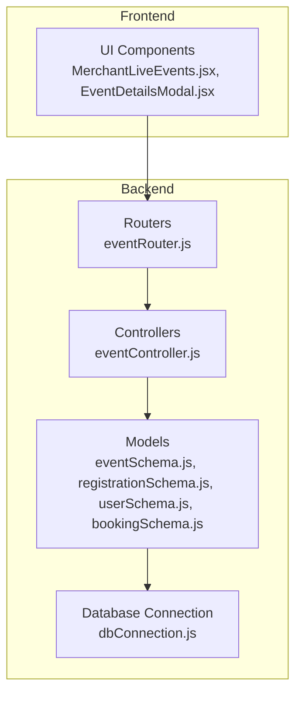
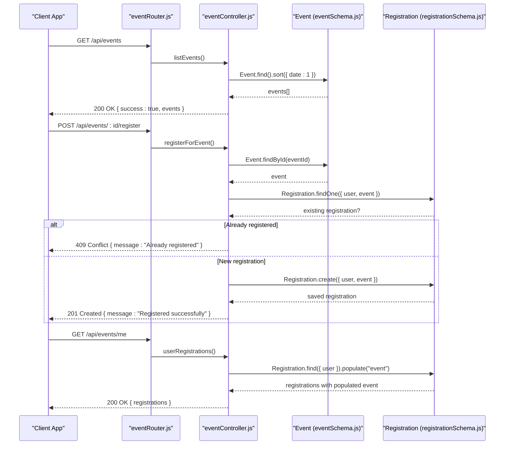
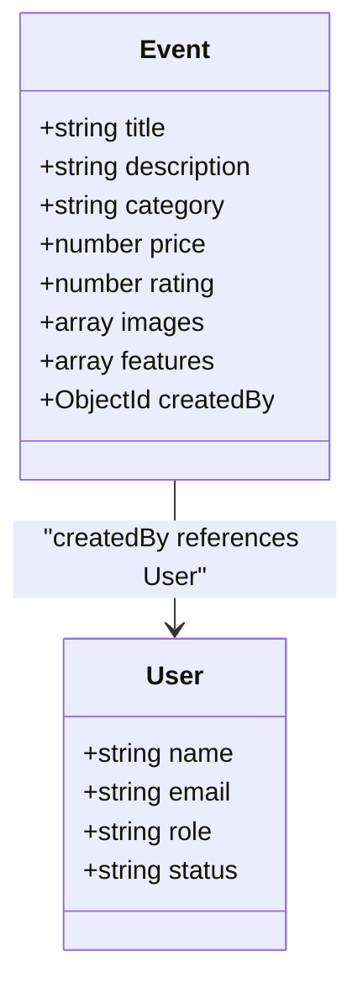
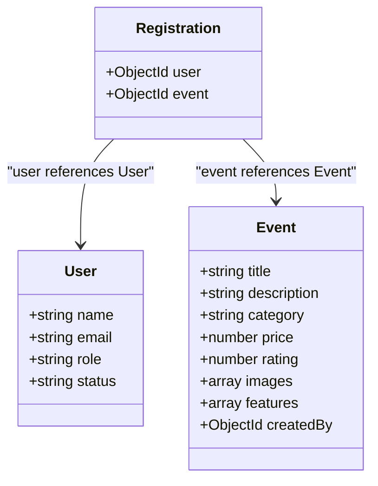
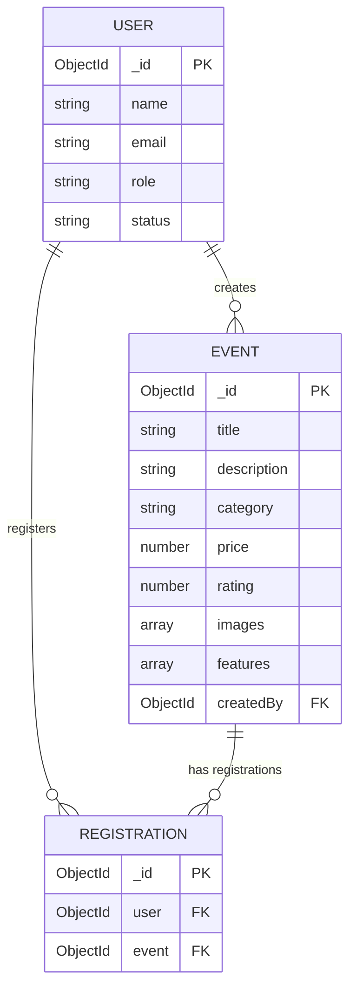
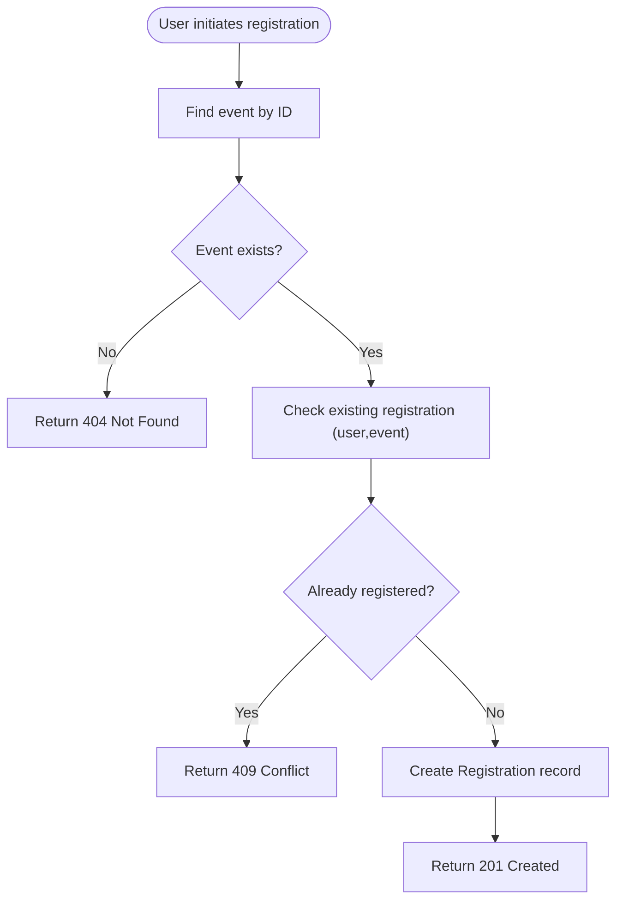
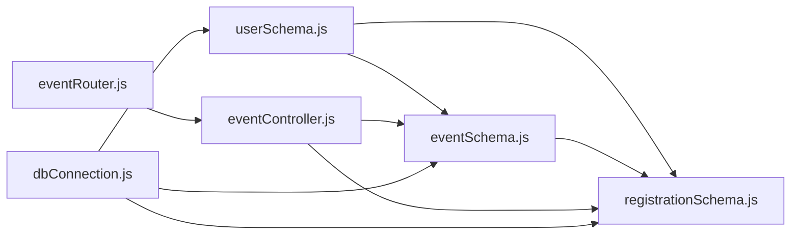

# Event Schema Design

<cite>
**Referenced Files in This Document**
- [eventSchema.js](file://backend/models/eventSchema.js)
- [registrationSchema.js](file://backend/models/registrationSchema.js)
- [userSchema.js](file://backend/models/userSchema.js)
- [bookingSchema.js](file://backend/models/bookingSchema.js)
- [eventController.js](file://backend/controller/eventController.js)
- [eventRouter.js](file://backend/router/eventRouter.js)
- [dbConnection.js](file://backend/database/dbConnection.js)
- [EVENT_TYPES_IMPLEMENTATION.md](file://EVENT_TYPES_IMPLEMENTATION.md)
- [DATABASE_SETUP.md](file://DATABASE_SETUP.md)
- [debug-events-structure.js](file://backend/debug-events-structure.js)
- [MerchantLiveEvents.jsx](file://frontend/src/pages/dashboards/MerchantLiveEvents.jsx)
- [EventDetailsModal.jsx](file://frontend/src/components/EventDetailsModal.jsx)
</cite>

## Table of Contents
1. [Introduction](#introduction)
2. [Project Structure](#project-structure)
3. [Core Components](#core-components)
4. [Architecture Overview](#architecture-overview)
5. [Detailed Component Analysis](#detailed-component-analysis)
6. [Dependency Analysis](#dependency-analysis)
7. [Performance Considerations](#performance-considerations)
8. [Troubleshooting Guide](#troubleshooting-guide)
9. [Conclusion](#conclusion)
10. [Appendices](#appendices)

## Introduction
This document provides comprehensive data model documentation for the Event Management System. It focuses on the Event schema and Registration schema, detailing field definitions, data types, validation rules, and business constraints. It also explains entity relationships among events, users, and registrations, and outlines indexing strategies, query patterns, and performance considerations. Finally, it includes examples of event data structures and registration workflows.

## Project Structure
The Event Management System organizes data models under backend/models, controllers under backend/controller, and routing under backend/router. The database connection is centralized in backend/database/dbConnection.js. Supporting documentation describes event types and database setup.

**Diagram sources**
- [eventSchema.js](file://backend/models/eventSchema.js)
- [registrationSchema.js](file://backend/models/registrationSchema.js)
- [userSchema.js](file://backend/models/userSchema.js)
- [bookingSchema.js](file://backend/models/bookingSchema.js)
- [eventController.js](file://backend/controller/eventController.js)
- [eventRouter.js](file://backend/router/eventRouter.js)
- [dbConnection.js](file://backend/database/dbConnection.js)
- [MerchantLiveEvents.jsx](file://frontend/src/pages/dashboards/MerchantLiveEvents.jsx)
- [EventDetailsModal.jsx](file://frontend/src/components/EventDetailsModal.jsx)

**Section sources**
- [DATABASE_SETUP.md](file://DATABASE_SETUP.md)
- [dbConnection.js](file://backend/database/dbConnection.js)

## Core Components
This section documents the Event and Registration schemas, their fields, types, validations, and constraints.

- Event schema
  - Fields and types
    - title: String, required
    - description: String, default empty
    - category: String, default empty
    - price: Number, default 0
    - rating: Number, default 0, min 0, max 5
    - images: Array of objects with fields:
      - public_id: String, required
      - url: String, required
    - features: Array of String
    - createdBy: ObjectId referencing User, required
  - Timestamps: createdAt, updatedAt
  - Notes
    - The current schema does not include date, location, or status fields.
    - Event type metadata (eventType, bannerImage, galleryImages, ticketTypes, totalTickets, availableTickets, date, time, location) is documented in supporting implementation notes and is not present in the base eventSchema.js.

- Registration schema
  - Fields and types
    - user: ObjectId referencing User, required
    - event: ObjectId referencing Event, required
  - Timestamps: createdAt, updatedAt

- User schema (context)
  - Fields and types
    - name: String, required with minimum length
    - businessName: String, default empty
    - phone: String, default empty
    - serviceType: String, default empty
    - email: String, required, unique, lowercase, validated as email
    - password: String, required with minimum length, select false for security
    - role: Enum ["user", "admin", "merchant"], default "user"
    - status: Enum ["active", "inactive"], default "active"
  - Timestamps: createdAt, updatedAt

- Booking schema (context)
  - Fields and types
    - user: ObjectId referencing User, required
    - serviceId: String, required
    - serviceTitle: String, required
    - serviceCategory: String, required
    - servicePrice: Number, required
    - bookingDate: Date, required
    - eventDate: Date
    - notes: String
    - status: Enum ["pending", "confirmed", "cancelled", "completed"], default "pending"
    - guestCount: Number, default 1
    - totalPrice: Number
  - Timestamps: createdAt, updatedAt

**Section sources**
- [eventSchema.js](file://backend/models/eventSchema.js)
- [registrationSchema.js](file://backend/models/registrationSchema.js)
- [userSchema.js](file://backend/models/userSchema.js)
- [bookingSchema.js](file://backend/models/bookingSchema.js)
- [EVENT_TYPES_IMPLEMENTATION.md](file://EVENT_TYPES_IMPLEMENTATION.md)

## Architecture Overview
The Event Management System follows a layered architecture:
- Frontend components render event details and interactions.
- Express routes define endpoints for listing events, registering for events, and retrieving user registrations.
- Controllers implement business logic for event registration and retrieval.
- Models define schemas and relationships.
- Database connection manages connectivity and logging.

**Diagram sources**
- [eventRouter.js](file://backend/router/eventRouter.js)
- [eventController.js](file://backend/controller/eventController.js)
- [eventSchema.js](file://backend/models/eventSchema.js)
- [registrationSchema.js](file://backend/models/registrationSchema.js)

## Detailed Component Analysis

### Event Schema Analysis
- Purpose: Represents events created by users (merchants), capturing metadata such as title, pricing, images, and creator.
- Key fields
  - title: Unique identifier for the event; required.
  - price: Monetary value for full-service events; defaults to 0.
  - rating: Numeric rating constrained to 0–5; defaults to 0.
  - images: Array of image objects with required identifiers and URLs.
  - features: Optional list of descriptive features.
  - createdBy: Foreign key linking to User; required.
- Business constraints
  - Required fields: title, images[].public_id, images[].url, createdBy.
  - Rating bounds enforced via min/max.
- Data model class diagram

**Diagram sources**
- [eventSchema.js](file://backend/models/eventSchema.js)
- [userSchema.js](file://backend/models/userSchema.js)

**Section sources**
- [eventSchema.js](file://backend/models/eventSchema.js)
- [EVENT_TYPES_IMPLEMENTATION.md](file://EVENT_TYPES_IMPLEMENTATION.md)

### Registration Schema Analysis
- Purpose: Tracks user participation in events.
- Key fields
  - user: ObjectId referencing User; required.
  - event: ObjectId referencing Event; required.
- Business constraints
  - Composite uniqueness implied by application logic (per user, per event).
  - Required references enforce referential integrity.
- Data model class diagram

**Diagram sources**
- [registrationSchema.js](file://backend/models/registrationSchema.js)
- [userSchema.js](file://backend/models/userSchema.js)
- [eventSchema.js](file://backend/models/eventSchema.js)

**Section sources**
- [registrationSchema.js](file://backend/models/registrationSchema.js)
- [eventController.js](file://backend/controller/eventController.js)

### Entity Relationship Diagram
This diagram shows the relationships among Users, Events, and Registrations.

**Diagram sources**
- [userSchema.js](file://backend/models/userSchema.js)
- [eventSchema.js](file://backend/models/eventSchema.js)
- [registrationSchema.js](file://backend/models/registrationSchema.js)

**Section sources**
- [userSchema.js](file://backend/models/userSchema.js)
- [eventSchema.js](file://backend/models/eventSchema.js)
- [registrationSchema.js](file://backend/models/registrationSchema.js)

### Event Data Structures and Workflows
- Event data structure examples
  - Full-service event example: Includes eventType, price, features, bannerImage, galleryImages, and ticketTypes array.
  - Ticketed event example: Includes eventType, ticketTypes array, totalTickets, availableTickets, date, and time.
- Registration workflow
  - Endpoint: POST /api/events/:id/register (authenticated user).
  - Steps:
    - Validate event existence.
    - Check if the user is already registered for the event.
    - Create a new registration if not already registered.
    - Return appropriate HTTP status codes.

**Diagram sources**
- [eventController.js](file://backend/controller/eventController.js)
- [eventRouter.js](file://backend/router/eventRouter.js)

**Section sources**
- [EVENT_TYPES_IMPLEMENTATION.md](file://EVENT_TYPES_IMPLEMENTATION.md)
- [eventController.js](file://backend/controller/eventController.js)
- [eventRouter.js](file://backend/router/eventRouter.js)

## Dependency Analysis
- Model dependencies
  - Event depends on User via createdBy.
  - Registration depends on User and Event.
- Controller dependencies
  - eventController depends on Event and Registration models.
  - Routes depend on eventController.
- Database connection
  - Centralized in dbConnection.js with robust retry and DNS resolution strategies.

**Diagram sources**
- [userSchema.js](file://backend/models/userSchema.js)
- [eventSchema.js](file://backend/models/eventSchema.js)
- [registrationSchema.js](file://backend/models/registrationSchema.js)
- [eventController.js](file://backend/controller/eventController.js)
- [eventRouter.js](file://backend/router/eventRouter.js)
- [dbConnection.js](file://backend/database/dbConnection.js)

**Section sources**
- [eventController.js](file://backend/controller/eventController.js)
- [eventRouter.js](file://backend/router/eventRouter.js)
- [dbConnection.js](file://backend/database/dbConnection.js)

## Performance Considerations
- Indexing strategies
  - createdAt and updatedAt timestamps are available for time-based queries.
  - Consider adding compound indexes for frequent queries:
    - (createdBy, createdAt) for listing user-created events.
    - (title, category) for filtering and faceted searches.
    - (rating, createdAt) for popularity-based sorting.
  - Registration queries commonly filter by user and event; consider:
    - Unique compound index on (user, event) to prevent duplicates and speed lookups.
- Query patterns
  - Listing events sorted by date: Event.find().sort({ date: 1 }).
  - Populating event details on user registrations: Registration.find({ user }).populate("event").
- Caching
  - Cache frequently accessed event lists and popular events.
- Pagination
  - Implement pagination for large event catalogs to reduce payload sizes.

[No sources needed since this section provides general guidance]

## Troubleshooting Guide
- Database connectivity
  - The connection script and logging help diagnose connectivity issues and confirm successful connection and collection listing.
- Event structure verification
  - Use the debug script to inspect event fields, including ticket types and availability, and to count events by type.
- Frontend integration
  - UI components consume event metadata such as date, time, location, and organizer information, which are not part of the base Event schema but are present in the extended implementation notes.

**Section sources**
- [dbConnection.js](file://backend/database/dbConnection.js)
- [debug-events-structure.js](file://backend/debug-events-structure.js)
- [EVENT_TYPES_IMPLEMENTATION.md](file://EVENT_TYPES_IMPLEMENTATION.md)
- [MerchantLiveEvents.jsx](file://frontend/src/pages/dashboards/MerchantLiveEvents.jsx)
- [EventDetailsModal.jsx](file://frontend/src/components/EventDetailsModal.jsx)

## Conclusion
The Event Management System’s data model centers on the Event and Registration schemas with clear relationships to the User schema. While the base Event schema captures essential metadata, extended fields for ticketed events and UI-driven details are documented in supporting materials. The controller and router layers implement robust registration workflows, and the database connection provides reliable connectivity. Applying recommended indexing and query patterns will improve performance and scalability.

[No sources needed since this section summarizes without analyzing specific files]

## Appendices
- Additional context
  - Booking schema supports service-based bookings and is separate from event registration.
  - Frontend components demonstrate consumption of event date, time, location, and organizer details.

**Section sources**
- [bookingSchema.js](file://backend/models/bookingSchema.js)
- [MerchantLiveEvents.jsx](file://frontend/src/pages/dashboards/MerchantLiveEvents.jsx)
- [EventDetailsModal.jsx](file://frontend/src/components/EventDetailsModal.jsx)