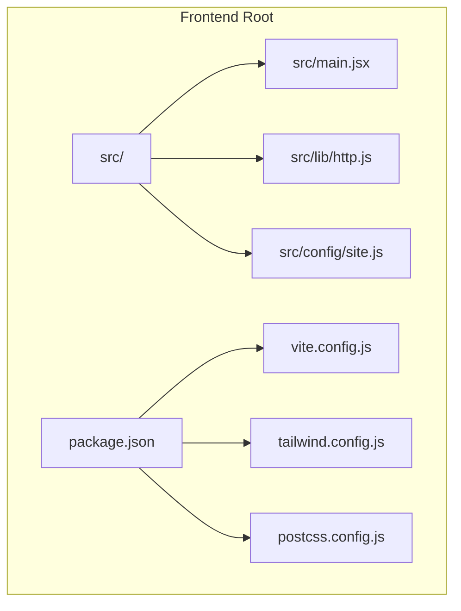
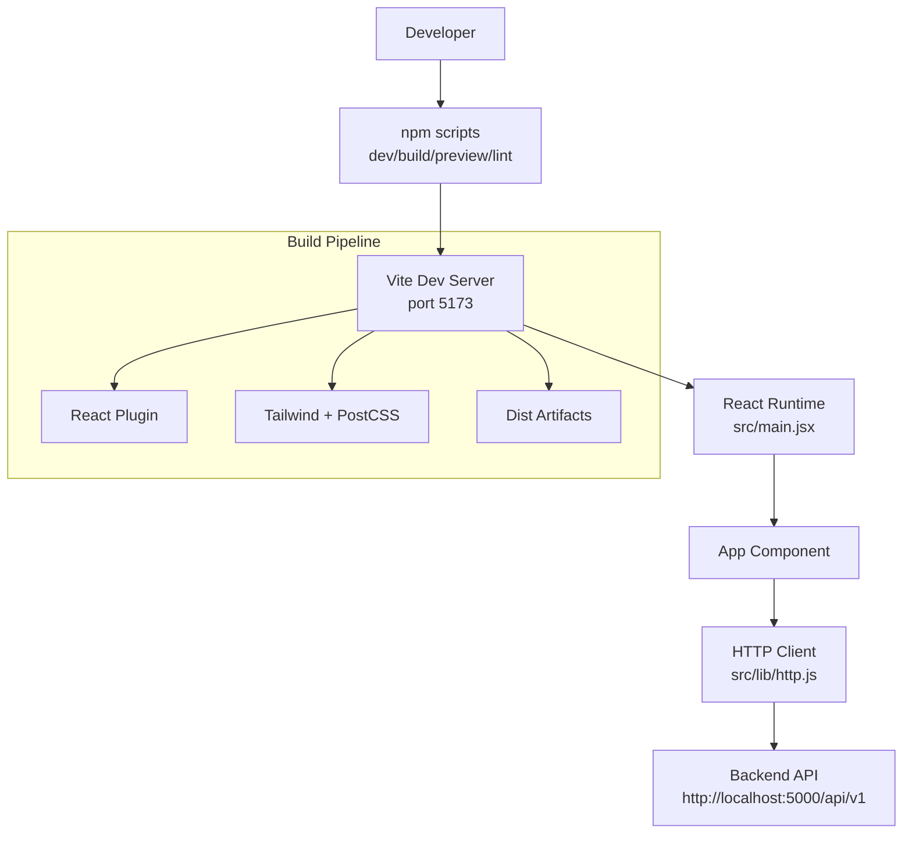
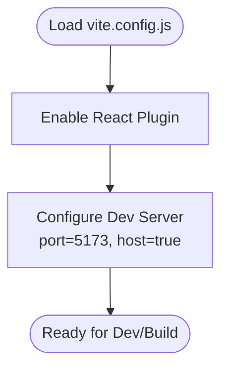
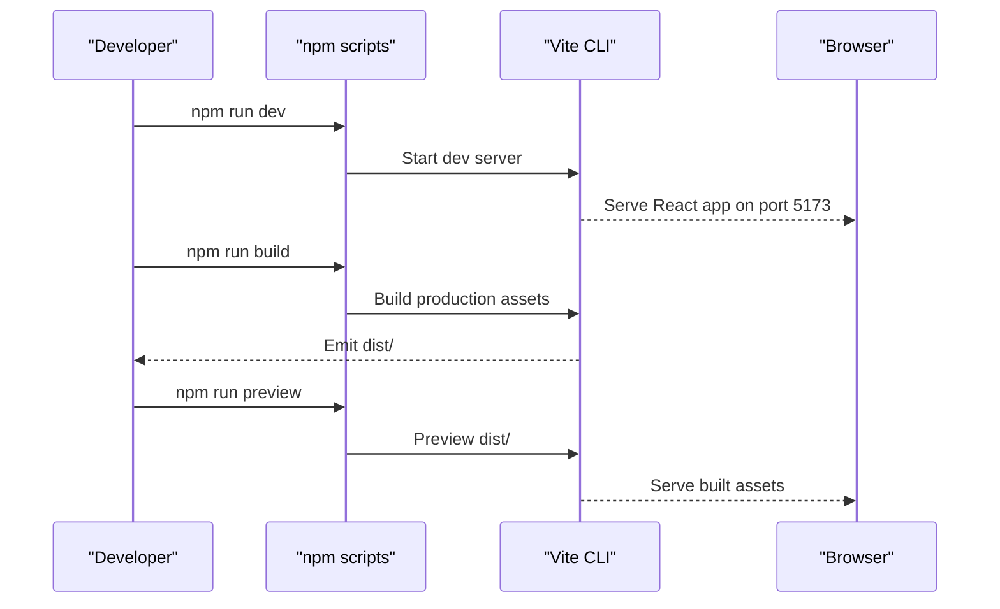
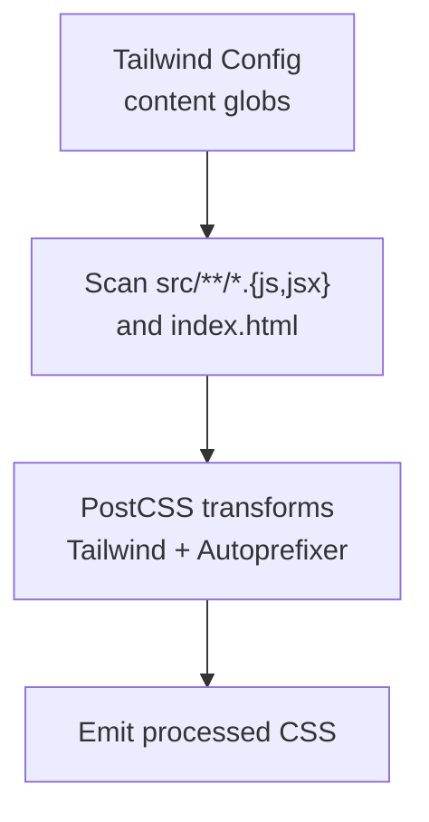
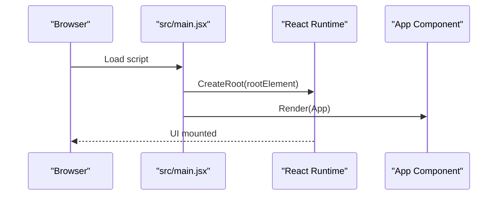
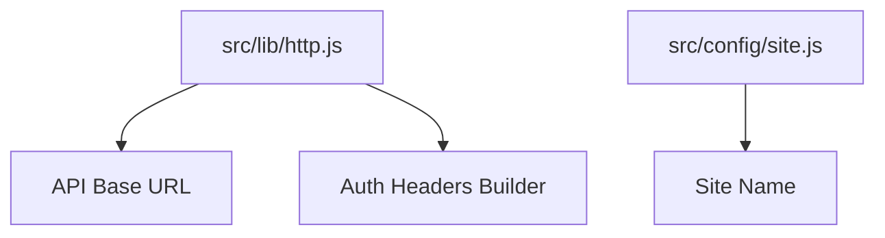
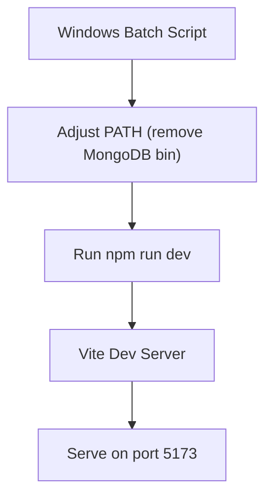
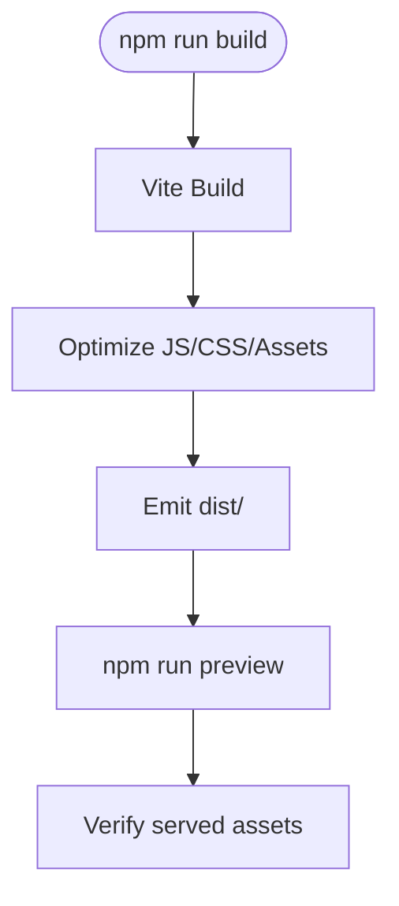
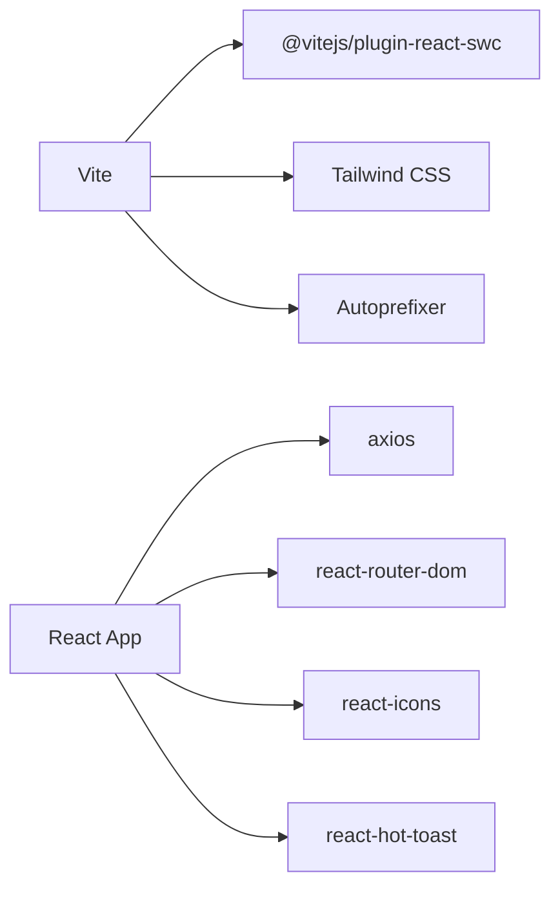

# Build and Deployment

<cite>
**Referenced Files in This Document**
- [vite.config.js](file://frontend/vite.config.js)
- [package.json](file://frontend/package.json)
- [tailwind.config.js](file://frontend/tailwind.config.js)
- [postcss.config.js](file://frontend/postcss.config.js)
- [main.jsx](file://frontend/src/main.jsx)
- [http.js](file://frontend/src/lib/http.js)
- [site.js](file://frontend/src/config/site.js)
- [start-frontend.bat](file://frontend/start-frontend.bat)
- [start-5173.bat](file://frontend/start-5173.bat)
- [simple-start.bat](file://frontend/simple-start.bat)
- [vite.config.simple.js](file://frontend/vite.config.simple.js)
</cite>

## Table of Contents
1. [Introduction](#introduction)
2. [Project Structure](#project-structure)
3. [Core Components](#core-components)
4. [Architecture Overview](#architecture-overview)
5. [Detailed Component Analysis](#detailed-component-analysis)
6. [Dependency Analysis](#dependency-analysis)
7. [Performance Considerations](#performance-considerations)
8. [Troubleshooting Guide](#troubleshooting-guide)
9. [Conclusion](#conclusion)
10. [Appendices](#appendices)

## Introduction
This document provides comprehensive build and deployment guidance for the Vite-based React frontend of the MERN stack event project. It covers Vite configuration, development server setup, build process, asset pipeline, environment handling, and production preparation. It also outlines deployment strategies, CI/CD integration patterns, performance monitoring, troubleshooting, and optimization best practices.

## Project Structure
The frontend is organized around Vite’s conventions with React and Tailwind CSS. Key build and configuration files reside under the frontend directory. The React application bootstraps from the main entry point and renders the root App component.

**Diagram sources**
- [vite.config.js](file://frontend/vite.config.js)
- [package.json](file://frontend/package.json)
- [tailwind.config.js](file://frontend/tailwind.config.js)
- [postcss.config.js](file://frontend/postcss.config.js)
- [main.jsx](file://frontend/src/main.jsx)
- [http.js](file://frontend/src/lib/http.js)
- [site.js](file://frontend/src/config/site.js)

**Section sources**
- [vite.config.js](file://frontend/vite.config.js)
- [package.json](file://frontend/package.json)
- [tailwind.config.js](file://frontend/tailwind.config.js)
- [postcss.config.js](file://frontend/postcss.config.js)
- [main.jsx](file://frontend/src/main.jsx)

## Core Components
- Vite configuration defines the React plugin, development server port, and host binding.
- Package scripts orchestrate development, building, linting, and previewing.
- Tailwind and PostCSS configure CSS processing and content paths.
- Application entry point initializes React rendering.
- HTTP client encapsulates base API URL and auth headers.
- Site configuration centralizes branding metadata.

**Section sources**
- [vite.config.js](file://frontend/vite.config.js)
- [package.json](file://frontend/package.json)
- [tailwind.config.js](file://frontend/tailwind.config.js)
- [postcss.config.js](file://frontend/postcss.config.js)
- [main.jsx](file://frontend/src/main.jsx)
- [http.js](file://frontend/src/lib/http.js)
- [site.js](file://frontend/src/config/site.js)

## Architecture Overview
The build and runtime architecture integrates Vite’s dev server, React runtime, Tailwind CSS pipeline, and environment-driven API configuration.

**Diagram sources**
- [package.json](file://frontend/package.json)
- [vite.config.js](file://frontend/vite.config.js)
- [main.jsx](file://frontend/src/main.jsx)
- [http.js](file://frontend/src/lib/http.js)

## Detailed Component Analysis

### Vite Configuration
- Plugin: React plugin integrated via SWC for fast JSX transform.
- Server: Development server binds to port 5173 and exposes host for network access.
- Extensibility: Additional build and library modes can be introduced via Vite’s configuration model.

**Diagram sources**
- [vite.config.js](file://frontend/vite.config.js)

**Section sources**
- [vite.config.js](file://frontend/vite.config.js)

### Build Scripts and Commands
- Development: Starts the Vite dev server.
- Production Build: Generates optimized static assets.
- Preview: Serves built assets locally for testing.
- Lint: Runs ESLint across JS/JSX sources.

**Diagram sources**
- [package.json](file://frontend/package.json)
- [vite.config.js](file://frontend/vite.config.js)

**Section sources**
- [package.json](file://frontend/package.json)

### Asset Pipeline (Tailwind + PostCSS)
- Content paths: Tailwind scans HTML and JS/JSX under src for utility classes.
- PostCSS plugins: Tailwind and Autoprefixer are configured.
- Build impact: Ensures CSS is processed and purged appropriately during production builds.

**Diagram sources**
- [tailwind.config.js](file://frontend/tailwind.config.js)
- [postcss.config.js](file://frontend/postcss.config.js)

**Section sources**
- [tailwind.config.js](file://frontend/tailwind.config.js)
- [postcss.config.js](file://frontend/postcss.config.js)

### Application Entry Point
- Initializes React DOM and mounts the root App component.
- Strict Mode enabled for development-time checks.

**Diagram sources**
- [main.jsx](file://frontend/src/main.jsx)

**Section sources**
- [main.jsx](file://frontend/src/main.jsx)

### Environment Variables and API Base URL
- API base URL is defined in the HTTP client module.
- Authentication headers include a bearer token pattern.
- Site configuration centralizes branding metadata.

**Diagram sources**
- [http.js](file://frontend/src/lib/http.js)
- [site.js](file://frontend/src/config/site.js)

**Section sources**
- [http.js](file://frontend/src/lib/http.js)
- [site.js](file://frontend/src/config/site.js)

### Development Server Setup and Startup Scripts
- Windows batch scripts adjust PATH and launch the dev server.
- Alternative scripts demonstrate starting on port 5173 directly.
- A minimal startup script creates a lightweight Vite wrapper for environments without local Node/npm.

**Diagram sources**
- [start-frontend.bat](file://frontend/start-frontend.bat)
- [start-5173.bat](file://frontend/start-5173.bat)
- [simple-start.bat](file://frontend/simple-start.bat)

**Section sources**
- [start-frontend.bat](file://frontend/start-frontend.bat)
- [start-5173.bat](file://frontend/start-5173.bat)
- [simple-start.bat](file://frontend/simple-start.bat)

### Build Process and Output
- Production build emits optimized static assets to the default output directory.
- Preview serves the built artifacts locally for verification.

**Diagram sources**
- [package.json](file://frontend/package.json)

**Section sources**
- [package.json](file://frontend/package.json)

## Dependency Analysis
- Vite orchestrates the build and dev server.
- React plugin powers JSX transform and HMR.
- Tailwind and PostCSS handle CSS processing.
- Application code depends on React, routing, and HTTP client.

**Diagram sources**
- [package.json](file://frontend/package.json)
- [vite.config.js](file://frontend/vite.config.js)
- [tailwind.config.js](file://frontend/tailwind.config.js)
- [postcss.config.js](file://frontend/postcss.config.js)

**Section sources**
- [package.json](file://frontend/package.json)

## Performance Considerations
- Prefer the React plugin optimized for speed.
- Keep Tailwind content globs precise to minimize CSS size.
- Use production builds for performance verification.
- Monitor bundle size and split large chunks if needed.
- Enable gzip/brotli compression on the hosting server.
- Cache static assets with appropriate headers.

## Troubleshooting Guide
- Port conflicts: Ensure port 5173 is free or change the Vite server port.
- PATH conflicts: Use provided batch scripts to remove conflicting binaries from PATH before starting the dev server.
- Minimal environment startup: Use the minimal startup script to bootstrap Vite when local Node/npm is unavailable.
- Network access: Confirm the dev server host binding allows external access if needed.
- CSS not updating: Verify Tailwind content paths and rebuild after adding new class usage.

**Section sources**
- [vite.config.js](file://frontend/vite.config.js)
- [start-frontend.bat](file://frontend/start-frontend.bat)
- [simple-start.bat](file://frontend/simple-start.bat)
- [tailwind.config.js](file://frontend/tailwind.config.js)

## Conclusion
The frontend build and deployment setup leverages Vite for a fast development experience and efficient production builds. With Tailwind and PostCSS for styling, a clear HTTP client configuration, and robust startup scripts, the project is ready for local development and production deployment. Adopt the recommended optimization and monitoring practices to ensure reliable performance across environments.

## Appendices

### Appendix A: Vite Configuration Options Reference
- React plugin: Enables JSX transform and HMR.
- Dev server: Configure port and host for development ergonomics.
- Build output: Defaults to dist/; customize via Vite’s build options.

**Section sources**
- [vite.config.js](file://frontend/vite.config.js)
- [package.json](file://frontend/package.json)

### Appendix B: Environment Variable Handling
- API base URL is centralized in the HTTP client module.
- Consider introducing environment-specific overrides for base URLs and feature flags.
- For production, inject environment variables at build time or via runtime configuration.

**Section sources**
- [http.js](file://frontend/src/lib/http.js)

### Appendix C: Deployment Strategies
- Static hosting: Serve the dist/ folder from a CDN or web server with gzip/brotli enabled.
- Reverse proxy: Route API traffic to the backend while serving frontend statically.
- Containerization: Package dist/ into a lightweight image and deploy via container platforms.

[No sources needed since this section provides general guidance]

### Appendix D: CI/CD Integration Patterns
- Build job: Install dependencies, run tests, and build the project.
- Artifact retention: Store the dist/ folder for deployment.
- Deploy job: Upload artifacts to the target environment or container registry.

[No sources needed since this section provides general guidance]

### Appendix E: Performance Monitoring
- Measure Time to First Byte (TTFB), Largest Contentful Paint (LCP), and Cumulative Layout Shift (CLS).
- Monitor bundle sizes and optimize chunk splitting.
- Track error rates and user journey completion.

[No sources needed since this section provides general guidance]