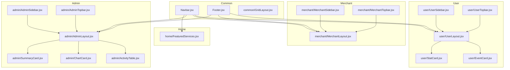
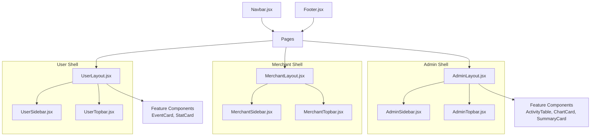
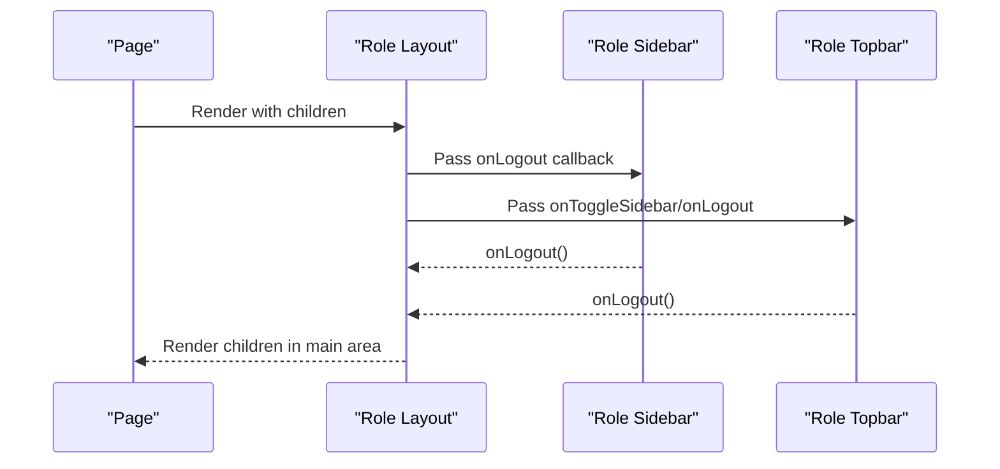
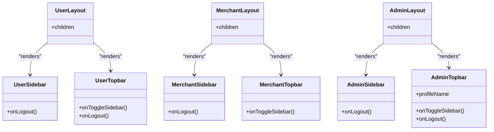
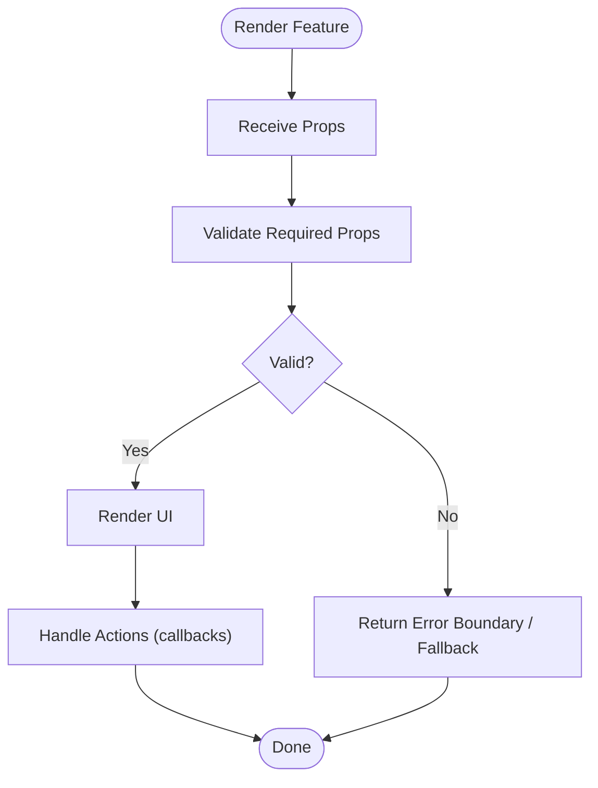
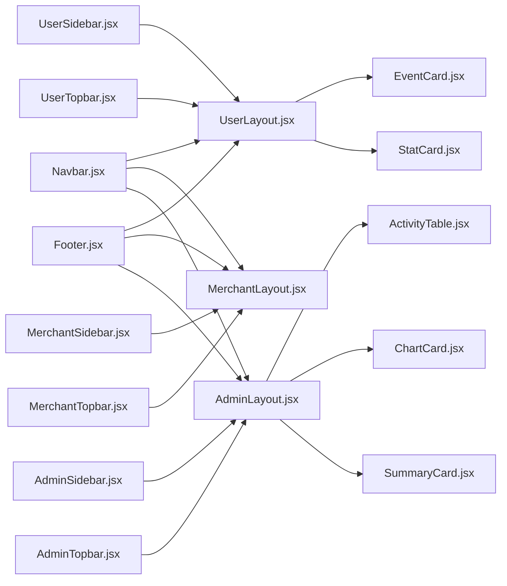

# Component Organization

<cite>
**Referenced Files in This Document**
- [Navbar.jsx](file://frontend/src/components/Navbar.jsx)
- [Footer.jsx](file://frontend/src/components/Footer.jsx)
- [GridLayout.jsx](file://frontend/src/components/common/GridLayout.jsx)
- [UserLayout.jsx](file://frontend/src/components/user/UserLayout.jsx)
- [UserSidebar.jsx](file://frontend/src/components/user/UserSidebar.jsx)
- [UserTopbar.jsx](file://frontend/src/components/user/UserTopbar.jsx)
- [MerchantLayout.jsx](file://frontend/src/components/merchant/MerchantLayout.jsx)
- [MerchantSidebar.jsx](file://frontend/src/components/merchant/MerchantSidebar.jsx)
- [MerchantTopbar.jsx](file://frontend/src/components/merchant/MerchantTopbar.jsx)
- [AdminLayout.jsx](file://frontend/src/components/admin/AdminLayout.jsx)
- [AdminSidebar.jsx](file://frontend/src/components/admin/AdminSidebar.jsx)
- [AdminTopbar.jsx](file://frontend/src/components/admin/AdminTopbar.jsx)
- [EventCard.jsx](file://frontend/src/components/user/EventCard.jsx)
- [StatCard.jsx](file://frontend/src/components/user/StatCard.jsx)
- [ActivityTable.jsx](file://frontend/src/components/admin/ActivityTable.jsx)
- [ChartCard.jsx](file://frontend/src/components/admin/ChartCard.jsx)
- [SummaryCard.jsx](file://frontend/src/components/admin/SummaryCard.jsx)
- [FeaturedServices.jsx](file://frontend/src/components/home/FeaturedServices.jsx)
</cite>

## Table of Contents
1. [Introduction](#introduction)
2. [Project Structure](#project-structure)
3. [Core Components](#core-components)
4. [Architecture Overview](#architecture-overview)
5. [Detailed Component Analysis](#detailed-component-analysis)
6. [Dependency Analysis](#dependency-analysis)
7. [Performance Considerations](#performance-considerations)
8. [Troubleshooting Guide](#troubleshooting-guide)
9. [Conclusion](#conclusion)
10. [Appendices](#appendices)

## Introduction
This document describes the React component organization for the frontend. It covers the common components (Navbar, Footer), layout components for roles (UserLayout, MerchantLayout, AdminLayout), and feature-specific components. It explains composition patterns, prop passing strategies, reusability principles, naming conventions, file organization, and component dependencies. It also provides guidelines for creating new components, maintaining consistency, and optimizing performance.

## Project Structure
The component library is organized by domain and role:
- Common components shared across pages live under a dedicated folder.
- Feature-specific components are grouped by domain (e.g., home).
- Role-specific layouts and navigation components are grouped under role folders (user, merchant, admin).

**Diagram sources**
- [Navbar.jsx:1-60](file://frontend/src/components/Navbar.jsx#L1-L60)
- [Footer.jsx:1-58](file://frontend/src/components/Footer.jsx#L1-L58)
- [GridLayout.jsx:1-18](file://frontend/src/components/common/GridLayout.jsx#L1-L18)
- [UserLayout.jsx:1-30](file://frontend/src/components/user/UserLayout.jsx#L1-L30)
- [UserSidebar.jsx:1-62](file://frontend/src/components/user/UserSidebar.jsx#L1-L62)
- [UserTopbar.jsx:1-85](file://frontend/src/components/user/UserTopbar.jsx#L1-L85)
- [MerchantLayout.jsx:1-29](file://frontend/src/components/merchant/MerchantLayout.jsx#L1-L29)
- [MerchantSidebar.jsx:1-58](file://frontend/src/components/merchant/MerchantSidebar.jsx#L1-L58)
- [MerchantTopbar.jsx:1-68](file://frontend/src/components/merchant/MerchantTopbar.jsx#L1-L68)
- [AdminLayout.jsx:1-29](file://frontend/src/components/admin/AdminLayout.jsx#L1-L29)
- [AdminSidebar.jsx:1-59](file://frontend/src/components/admin/AdminSidebar.jsx#L1-L59)
- [AdminTopbar.jsx:1-82](file://frontend/src/components/admin/AdminTopbar.jsx#L1-L82)
- [EventCard.jsx:1-45](file://frontend/src/components/user/EventCard.jsx#L1-L45)
- [StatCard.jsx:1-28](file://frontend/src/components/user/StatCard.jsx#L1-L28)
- [ActivityTable.jsx:1-55](file://frontend/src/components/admin/ActivityTable.jsx#L1-L55)
- [ChartCard.jsx:1-34](file://frontend/src/components/admin/ChartCard.jsx#L1-L34)
- [SummaryCard.jsx:1-25](file://frontend/src/components/admin/SummaryCard.jsx#L1-L25)
- [FeaturedServices.jsx:1-36](file://frontend/src/components/home/FeaturedServices.jsx#L1-L36)

**Section sources**
- [Navbar.jsx:1-60](file://frontend/src/components/Navbar.jsx#L1-L60)
- [Footer.jsx:1-58](file://frontend/src/components/Footer.jsx#L1-L58)
- [GridLayout.jsx:1-18](file://frontend/src/components/common/GridLayout.jsx#L1-L18)
- [UserLayout.jsx:1-30](file://frontend/src/components/user/UserLayout.jsx#L1-L30)
- [UserSidebar.jsx:1-62](file://frontend/src/components/user/UserSidebar.jsx#L1-L62)
- [UserTopbar.jsx:1-85](file://frontend/src/components/user/UserTopbar.jsx#L1-L85)
- [MerchantLayout.jsx:1-29](file://frontend/src/components/merchant/MerchantLayout.jsx#L1-L29)
- [MerchantSidebar.jsx:1-58](file://frontend/src/components/merchant/MerchantSidebar.jsx#L1-L58)
- [MerchantTopbar.jsx:1-68](file://frontend/src/components/merchant/MerchantTopbar.jsx#L1-L68)
- [AdminLayout.jsx:1-29](file://frontend/src/components/admin/AdminLayout.jsx#L1-L29)
- [AdminSidebar.jsx:1-59](file://frontend/src/components/admin/AdminSidebar.jsx#L1-L59)
- [AdminTopbar.jsx:1-82](file://frontend/src/components/admin/AdminTopbar.jsx#L1-L82)
- [EventCard.jsx:1-45](file://frontend/src/components/user/EventCard.jsx#L1-L45)
- [StatCard.jsx:1-28](file://frontend/src/components/user/StatCard.jsx#L1-L28)
- [ActivityTable.jsx:1-55](file://frontend/src/components/admin/ActivityTable.jsx#L1-L55)
- [ChartCard.jsx:1-34](file://frontend/src/components/admin/ChartCard.jsx#L1-L34)
- [SummaryCard.jsx:1-25](file://frontend/src/components/admin/SummaryCard.jsx#L1-L25)
- [FeaturedServices.jsx:1-36](file://frontend/src/components/home/FeaturedServices.jsx#L1-L36)

## Core Components
- Common components
  - Navbar: Provides branding, navigation links, and authentication CTAs.
  - Footer: Provides quick links, service categories, contact info, and social links.
  - GridLayout: A reusable grid container for feature sections.
- Layout components
  - UserLayout, MerchantLayout, AdminLayout: Role-based page shells that embed role-specific sidebars and topbars and render page content via children.
- Feature-specific components
  - User domain: EventCard, StatCard.
  - Admin domain: ActivityTable, ChartCard, SummaryCard.
  - Home domain: FeaturedServices.

Composition pattern
- Layouts wrap feature components. Layouts receive children and pass props to nested navigation components (e.g., onLogout callbacks).
- Feature components are self-contained, accept props for data and actions, and rely on shared styling and icons.

Prop passing strategy
- Callbacks: onLogout, onToggleSidebar, onAction are passed down to child components to trigger behavior.
- Data: Feature components receive structured data (e.g., rows for tables, icon/title/value for stats).
- Optional presentation: Components expose optional props for styling variants (e.g., colors, icons).

Reusability principles
- Presentational components (e.g., StatCard, ActivityTable) are generic and stateless.
- Navigation items (e.g., Sidebar Item) are small, composable units that encapsulate routing and styling.
- Shared containers (e.g., GridLayout) standardize spacing and responsive grids.

Naming conventions
- PascalCase for component filenames and exports.
- Descriptive names indicating purpose (e.g., EventCard, StatCard, ActivityTable).
- Role-scoped folders (user/, merchant/, admin/) for layout and navigation components.

File organization
- Role-specific components grouped under role folders.
- Common components under a shared folder.
- Feature components grouped by domain.

**Section sources**
- [Navbar.jsx:1-60](file://frontend/src/components/Navbar.jsx#L1-L60)
- [Footer.jsx:1-58](file://frontend/src/components/Footer.jsx#L1-L58)
- [GridLayout.jsx:1-18](file://frontend/src/components/common/GridLayout.jsx#L1-L18)
- [UserLayout.jsx:1-30](file://frontend/src/components/user/UserLayout.jsx#L1-L30)
- [MerchantLayout.jsx:1-29](file://frontend/src/components/merchant/MerchantLayout.jsx#L1-L29)
- [AdminLayout.jsx:1-29](file://frontend/src/components/admin/AdminLayout.jsx#L1-L29)
- [EventCard.jsx:1-45](file://frontend/src/components/user/EventCard.jsx#L1-L45)
- [StatCard.jsx:1-28](file://frontend/src/components/user/StatCard.jsx#L1-L28)
- [ActivityTable.jsx:1-55](file://frontend/src/components/admin/ActivityTable.jsx#L1-L55)
- [ChartCard.jsx:1-34](file://frontend/src/components/admin/ChartCard.jsx#L1-L34)
- [SummaryCard.jsx:1-25](file://frontend/src/components/admin/SummaryCard.jsx#L1-L25)
- [FeaturedServices.jsx:1-36](file://frontend/src/components/home/FeaturedServices.jsx#L1-L36)

## Architecture Overview
The component architecture follows a layered composition:
- Top-level role layouts (UserLayout, MerchantLayout, AdminLayout) orchestrate sidebar and topbar.
- Feature components render content inside the layout’s main area.
- Common components (Navbar, Footer) are reused across pages.

**Diagram sources**
- [Navbar.jsx:1-60](file://frontend/src/components/Navbar.jsx#L1-L60)
- [Footer.jsx:1-58](file://frontend/src/components/Footer.jsx#L1-L58)
- [UserLayout.jsx:1-30](file://frontend/src/components/user/UserLayout.jsx#L1-L30)
- [UserSidebar.jsx:1-62](file://frontend/src/components/user/UserSidebar.jsx#L1-L62)
- [UserTopbar.jsx:1-85](file://frontend/src/components/user/UserTopbar.jsx#L1-L85)
- [MerchantLayout.jsx:1-29](file://frontend/src/components/merchant/MerchantLayout.jsx#L1-L29)
- [MerchantSidebar.jsx:1-58](file://frontend/src/components/merchant/MerchantSidebar.jsx#L1-L58)
- [MerchantTopbar.jsx:1-68](file://frontend/src/components/merchant/MerchantTopbar.jsx#L1-L68)
- [AdminLayout.jsx:1-29](file://frontend/src/components/admin/AdminLayout.jsx#L1-L29)
- [AdminSidebar.jsx:1-59](file://frontend/src/components/admin/AdminSidebar.jsx#L1-L59)
- [AdminTopbar.jsx:1-82](file://frontend/src/components/admin/AdminTopbar.jsx#L1-L82)
- [EventCard.jsx:1-45](file://frontend/src/components/user/EventCard.jsx#L1-L45)
- [StatCard.jsx:1-28](file://frontend/src/components/user/StatCard.jsx#L1-L28)
- [ActivityTable.jsx:1-55](file://frontend/src/components/admin/ActivityTable.jsx#L1-L55)
- [ChartCard.jsx:1-34](file://frontend/src/components/admin/ChartCard.jsx#L1-L34)
- [SummaryCard.jsx:1-25](file://frontend/src/components/admin/SummaryCard.jsx#L1-L25)

## Detailed Component Analysis

### Common Components
- Navbar
  - Purpose: Branding, primary navigation, and auth CTAs.
  - Composition: Stateless functional component returning a header with logo and menu.
  - Props: None.
  - Reuse: Included by all role layouts and standalone pages.
- Footer
  - Purpose: Site info, quick links, service categories, contact, and social links.
  - Composition: Stateless functional component with grid layout and links.
  - Props: None.
  - Reuse: Included by all role layouts and standalone pages.

**Section sources**
- [Navbar.jsx:1-60](file://frontend/src/components/Navbar.jsx#L1-L60)
- [Footer.jsx:1-58](file://frontend/src/components/Footer.jsx#L1-L58)

### Layout Components
- UserLayout
  - Purpose: Page shell for user dashboards.
  - Composition: Renders sidebar and topbar, passes onLogout callback, renders children in main content area.
  - Props: children (node).
  - Dependencies: UserSidebar, UserTopbar, useAuth, react-router navigation.
- MerchantLayout
  - Purpose: Page shell for merchant dashboards.
  - Composition: Similar to UserLayout but with MerchantSidebar and MerchantTopbar.
  - Props: children (node).
  - Dependencies: MerchantSidebar, MerchantTopbar, useAuth, react-router navigation.
- AdminLayout
  - Purpose: Page shell for admin dashboards.
  - Composition: Similar to UserLayout but with AdminSidebar and AdminTopbar.
  - Props: children (node).
  - Dependencies: AdminSidebar, AdminTopbar, useAuth, react-router navigation.

**Diagram sources**
- [UserLayout.jsx:1-30](file://frontend/src/components/user/UserLayout.jsx#L1-L30)
- [UserSidebar.jsx:1-62](file://frontend/src/components/user/UserSidebar.jsx#L1-L62)
- [UserTopbar.jsx:1-85](file://frontend/src/components/user/UserTopbar.jsx#L1-L85)
- [MerchantLayout.jsx:1-29](file://frontend/src/components/merchant/MerchantLayout.jsx#L1-L29)
- [MerchantSidebar.jsx:1-58](file://frontend/src/components/merchant/MerchantSidebar.jsx#L1-L58)
- [MerchantTopbar.jsx:1-68](file://frontend/src/components/merchant/MerchantTopbar.jsx#L1-L68)
- [AdminLayout.jsx:1-29](file://frontend/src/components/admin/AdminLayout.jsx#L1-L29)
- [AdminSidebar.jsx:1-59](file://frontend/src/components/admin/AdminSidebar.jsx#L1-L59)
- [AdminTopbar.jsx:1-82](file://frontend/src/components/admin/AdminTopbar.jsx#L1-L82)

**Section sources**
- [UserLayout.jsx:1-30](file://frontend/src/components/user/UserLayout.jsx#L1-L30)
- [MerchantLayout.jsx:1-29](file://frontend/src/components/merchant/MerchantLayout.jsx#L1-L29)
- [AdminLayout.jsx:1-29](file://frontend/src/components/admin/AdminLayout.jsx#L1-L29)

### Role Navigation Components
- UserSidebar
  - Purpose: User dashboard navigation and logout.
  - Composition: Fixed sidebar with NavLink items and logout button.
  - Props: onLogout (function).
- UserTopbar
  - Purpose: User top bar with profile dropdown and search.
  - Composition: Search input, notifications, profile dropdown, logout.
  - Props: onToggleSidebar, onLogout.
- MerchantSidebar
  - Purpose: Merchant dashboard navigation and logout.
  - Composition: Fixed sidebar with NavLink items and logout button.
  - Props: onLogout (function).
- MerchantTopbar
  - Purpose: Merchant top bar with profile dropdown and search.
  - Composition: Search input, notifications, profile dropdown, logout.
  - Props: onToggleSidebar.
- AdminSidebar
  - Purpose: Admin dashboard navigation and logout.
  - Composition: Fixed sidebar with NavLink items and logout button.
  - Props: onLogout (function).
- AdminTopbar
  - Purpose: Admin top bar with profile dropdown and search.
  - Composition: Search input, notifications, profile dropdown, logout.
  - Props: onToggleSidebar, profileName, onLogout.

**Diagram sources**
- [UserSidebar.jsx:1-62](file://frontend/src/components/user/UserSidebar.jsx#L1-L62)
- [UserTopbar.jsx:1-85](file://frontend/src/components/user/UserTopbar.jsx#L1-L85)
- [MerchantSidebar.jsx:1-58](file://frontend/src/components/merchant/MerchantSidebar.jsx#L1-L58)
- [MerchantTopbar.jsx:1-68](file://frontend/src/components/merchant/MerchantTopbar.jsx#L1-L68)
- [AdminSidebar.jsx:1-59](file://frontend/src/components/admin/AdminSidebar.jsx#L1-L59)
- [AdminTopbar.jsx:1-82](file://frontend/src/components/admin/AdminTopbar.jsx#L1-L82)
- [UserLayout.jsx:1-30](file://frontend/src/components/user/UserLayout.jsx#L1-L30)
- [MerchantLayout.jsx:1-29](file://frontend/src/components/merchant/MerchantLayout.jsx#L1-L29)
- [AdminLayout.jsx:1-29](file://frontend/src/components/admin/AdminLayout.jsx#L1-L29)

**Section sources**
- [UserSidebar.jsx:1-62](file://frontend/src/components/user/UserSidebar.jsx#L1-L62)
- [UserTopbar.jsx:1-85](file://frontend/src/components/user/UserTopbar.jsx#L1-L85)
- [MerchantSidebar.jsx:1-58](file://frontend/src/components/merchant/MerchantSidebar.jsx#L1-L58)
- [MerchantTopbar.jsx:1-68](file://frontend/src/components/merchant/MerchantTopbar.jsx#L1-L68)
- [AdminSidebar.jsx:1-59](file://frontend/src/components/admin/AdminSidebar.jsx#L1-L59)
- [AdminTopbar.jsx:1-82](file://frontend/src/components/admin/AdminTopbar.jsx#L1-L82)

### Feature-Specific Components
- EventCard (User domain)
  - Purpose: Display event metadata and action button.
  - Props: image, title, date, location, status, actionText, onAction.
  - Composition: Stateless card with status badge and action handler.
- StatCard (User domain)
  - Purpose: Display KPI-like metrics with icon and color scheme.
  - Props: icon, title, value, color, iconColor.
  - Composition: Stateless card with icon and value rendering.
- ActivityTable (Admin domain)
  - Purpose: Tabular display of recent activity with status badges.
  - Props: rows (array of objects with user, event, date, status).
  - Composition: Stateless table with status mapping.
- ChartCard (Admin domain)
  - Purpose: Bar chart visualization with labels and data.
  - Props: title, data (numbers), labels (strings).
  - Composition: Stateless chart with dynamic bar heights.
- SummaryCard (Admin domain)
  - Purpose: Summary metric with icon and color.
  - Props: title, value, icon, color.
  - Composition: Stateless summary card.

**Diagram sources**
- [EventCard.jsx:1-45](file://frontend/src/components/user/EventCard.jsx#L1-L45)
- [StatCard.jsx:1-28](file://frontend/src/components/user/StatCard.jsx#L1-L28)
- [ActivityTable.jsx:1-55](file://frontend/src/components/admin/ActivityTable.jsx#L1-L55)
- [ChartCard.jsx:1-34](file://frontend/src/components/admin/ChartCard.jsx#L1-L34)
- [SummaryCard.jsx:1-25](file://frontend/src/components/admin/SummaryCard.jsx#L1-L25)

**Section sources**
- [EventCard.jsx:1-45](file://frontend/src/components/user/EventCard.jsx#L1-L45)
- [StatCard.jsx:1-28](file://frontend/src/components/user/StatCard.jsx#L1-L28)
- [ActivityTable.jsx:1-55](file://frontend/src/components/admin/ActivityTable.jsx#L1-L55)
- [ChartCard.jsx:1-34](file://frontend/src/components/admin/ChartCard.jsx#L1-L34)
- [SummaryCard.jsx:1-25](file://frontend/src/components/admin/SummaryCard.jsx#L1-L25)

### Home Domain Components
- FeaturedServices
  - Purpose: Grid of service items with icons and descriptions.
  - Props: None (hardcoded items).
  - Composition: Stateless grid using a mapping of items.

**Section sources**
- [FeaturedServices.jsx:1-36](file://frontend/src/components/home/FeaturedServices.jsx#L1-L36)

## Dependency Analysis
Component dependencies and relationships:
- Layouts depend on role-specific sidebars and topbars.
- Sidebars and topbars depend on routing (NavLink, useNavigate) and authentication context (useAuth).
- Feature components depend on PropTypes for type safety and are otherwise stateless.
- Common components (Navbar, Footer) are leaf-level and consumed by layouts.

**Diagram sources**
- [Navbar.jsx:1-60](file://frontend/src/components/Navbar.jsx#L1-L60)
- [Footer.jsx:1-58](file://frontend/src/components/Footer.jsx#L1-L58)
- [UserLayout.jsx:1-30](file://frontend/src/components/user/UserLayout.jsx#L1-L30)
- [UserSidebar.jsx:1-62](file://frontend/src/components/user/UserSidebar.jsx#L1-L62)
- [UserTopbar.jsx:1-85](file://frontend/src/components/user/UserTopbar.jsx#L1-L85)
- [MerchantLayout.jsx:1-29](file://frontend/src/components/merchant/MerchantLayout.jsx#L1-L29)
- [MerchantSidebar.jsx:1-58](file://frontend/src/components/merchant/MerchantSidebar.jsx#L1-L58)
- [MerchantTopbar.jsx:1-68](file://frontend/src/components/merchant/MerchantTopbar.jsx#L1-L68)
- [AdminLayout.jsx:1-29](file://frontend/src/components/admin/AdminLayout.jsx#L1-L29)
- [AdminSidebar.jsx:1-59](file://frontend/src/components/admin/AdminSidebar.jsx#L1-L59)
- [AdminTopbar.jsx:1-82](file://frontend/src/components/admin/AdminTopbar.jsx#L1-L82)
- [EventCard.jsx:1-45](file://frontend/src/components/user/EventCard.jsx#L1-L45)
- [StatCard.jsx:1-28](file://frontend/src/components/user/StatCard.jsx#L1-L28)
- [ActivityTable.jsx:1-55](file://frontend/src/components/admin/ActivityTable.jsx#L1-L55)
- [ChartCard.jsx:1-34](file://frontend/src/components/admin/ChartCard.jsx#L1-L34)
- [SummaryCard.jsx:1-25](file://frontend/src/components/admin/SummaryCard.jsx#L1-L25)

**Section sources**
- [UserLayout.jsx:1-30](file://frontend/src/components/user/UserLayout.jsx#L1-L30)
- [MerchantLayout.jsx:1-29](file://frontend/src/components/merchant/MerchantLayout.jsx#L1-L29)
- [AdminLayout.jsx:1-29](file://frontend/src/components/admin/AdminLayout.jsx#L1-L29)
- [EventCard.jsx:1-45](file://frontend/src/components/user/EventCard.jsx#L1-L45)
- [StatCard.jsx:1-28](file://frontend/src/components/user/StatCard.jsx#L1-L28)
- [ActivityTable.jsx:1-55](file://frontend/src/components/admin/ActivityTable.jsx#L1-L55)
- [ChartCard.jsx:1-34](file://frontend/src/components/admin/ChartCard.jsx#L1-L34)
- [SummaryCard.jsx:1-25](file://frontend/src/components/admin/SummaryCard.jsx#L1-L25)

## Performance Considerations
- Keep feature components stateless and props-driven to enable reuse and predictable rendering.
- Memoize expensive computations inside components (e.g., derived data for charts) to avoid unnecessary recalculations.
- Prefer small, focused components to reduce re-renders when only part of the UI changes.
- Use lazy loading for heavy feature components if appropriate.
- Avoid deep prop drilling by grouping related props into smaller composite props where feasible.
- Ensure layout components only re-render when children or navigation props change.

## Troubleshooting Guide
- Prop type mismatches
  - Symptom: Runtime warnings or errors when props are missing or wrong type.
  - Resolution: Verify PropTypes on components and ensure callers pass required props.
- Navigation issues
  - Symptom: Clicking nav items does nothing or route mismatch.
  - Resolution: Confirm NavLink routes match expected paths and that layouts provide correct onToggleSidebar handlers.
- Authentication-related logout
  - Symptom: Logout does not redirect or state persists.
  - Resolution: Ensure onLogout callbacks are wired correctly and navigate to the login route.
- Styling inconsistencies
  - Symptom: Misaligned grids or inconsistent spacing.
  - Resolution: Use shared containers (e.g., GridLayout) and Tailwind utilities consistently.

**Section sources**
- [EventCard.jsx:1-45](file://frontend/src/components/user/EventCard.jsx#L1-L45)
- [StatCard.jsx:1-28](file://frontend/src/components/user/StatCard.jsx#L1-L28)
- [ActivityTable.jsx:1-55](file://frontend/src/components/admin/ActivityTable.jsx#L1-L55)
- [ChartCard.jsx:1-34](file://frontend/src/components/admin/ChartCard.jsx#L1-L34)
- [SummaryCard.jsx:1-25](file://frontend/src/components/admin/SummaryCard.jsx#L1-L25)
- [UserLayout.jsx:1-30](file://frontend/src/components/user/UserLayout.jsx#L1-L30)
- [MerchantLayout.jsx:1-29](file://frontend/src/components/merchant/MerchantLayout.jsx#L1-L29)
- [AdminLayout.jsx:1-29](file://frontend/src/components/admin/AdminLayout.jsx#L1-L29)

## Conclusion
The component library is organized around role-based layouts and shared common components. Feature components are designed to be reusable and props-driven, enabling consistent UI and behavior across the application. Following the naming conventions, file organization, and composition patterns described here ensures maintainability and scalability.

## Appendices

### Guidelines for Creating New Components
- Naming and organization
  - Use PascalCase for filenames and exports.
  - Place shared components under a common folder; otherwise, group by role or domain.
- Composition
  - Prefer small, single-responsibility components.
  - Wrap feature components inside role layouts to ensure consistent navigation and styling.
- Props
  - Define PropTypes for all props to enforce contracts.
  - Provide sensible defaults for optional props.
- Reusability
  - Keep components stateless when possible.
  - Accept data and callbacks via props rather than hardcoding behavior.
- Styling
  - Use Tailwind utilities consistently.
  - Centralize shared styles in common components or shared containers.
- Testing and validation
  - Validate prop shapes and required props.
  - Test interactive callbacks (e.g., onAction, onLogout) in isolation or via integration tests.