# Frontend Architecture

<cite>
**Referenced Files in This Document**
- [main.jsx](file://frontend/src/main.jsx)
- [App.jsx](file://frontend/src/App.jsx)
- [Navbar.jsx](file://frontend/src/components/Navbar.jsx)
- [Footer.jsx](file://frontend/src/components/Footer.jsx)
- [AuthProvider.jsx](file://frontend/src/context/AuthProvider.jsx)
- [useAuth.js](file://frontend/src/context/useAuth.js)
- [AuthContext.js](file://frontend/src/context/AuthContext.js)
- [PrivateRoute.jsx](file://frontend/src/components/PrivateRoute.jsx)
- [RoleRoute.jsx](file://frontend/src/components/RoleRoute.jsx)
- [AdminDashboardUI.jsx](file://frontend/src/pages/dashboards/AdminDashboardUI.jsx)
- [UserDashboard.jsx](file://frontend/src/pages/dashboards/UserDashboard.jsx)
- [MerchantDashboard.jsx](file://frontend/src/pages/dashboards/MerchantDashboard.jsx)
- [AdminDashboard.jsx](file://frontend/src/pages/dashboards/AdminDashboard.jsx)
- [UserBrowseEvents.jsx](file://frontend/src/pages/dashboards/UserBrowseEvents.jsx)
- [http.js](file://frontend/src/lib/http.js)
- [utils.js](file://frontend/src/lib/utils.js)
- [vite.config.js](file://frontend/vite.config.js)
- [package.json](file://frontend/package.json)
- [tailwind.config.js](file://frontend/tailwind.config.js)
- [BookingModal.jsx](file://frontend/src/components/BookingModal.jsx)
- [PaymentModal.jsx](file://frontend/src/components/PaymentModal.jsx)
- [EventBookingModal.jsx](file://frontend/src/components/EventBookingModal.jsx)
- [ServiceBookingModal.jsx](file://frontend/src/components/ServiceBookingModal.jsx)
- [ServicePaymentModal.jsx](file://frontend/src/components/ServicePaymentModal.jsx)
- [CouponInput.jsx](file://frontend/src/components/CouponInput.jsx)
- [MerchantLayout.jsx](file://frontend/src/components/merchant/MerchantLayout.jsx)
- [UserLayout.jsx](file://frontend/src/components/user/UserLayout.jsx)
- [AdminLayout.jsx](file://frontend/src/components/admin/AdminLayout.jsx)
</cite>

## Update Summary
**Changes Made**
- Enhanced booking modal architecture with dual event type support (full-service and ticketed)
- Added comprehensive payment modal system with multiple payment methods
- Integrated coupon integration components with validation and discount handling
- Expanded dashboard pages with new administrative and merchant-specific interfaces
- Implemented advanced layout systems for role-based UI rendering
- Added service booking and payment flow components for full-service events

## Table of Contents
1. [Introduction](#introduction)
2. [Project Structure](#project-structure)
3. [Core Components](#core-components)
4. [Architecture Overview](#architecture-overview)
5. [Enhanced Booking System](#enhanced-booking-system)
6. [Payment Processing Architecture](#payment-processing-architecture)
7. [Coupon Integration System](#coupon-integration-system)
8. [Role-Based Dashboard Architecture](#role-based-dashboard-architecture)
9. [Layout and Navigation Systems](#layout-and-navigation-systems)
10. [Component Composition Patterns](#component-composition-patterns)
11. [State Management and Synchronization](#state-management-and-synchronization)
12. [Performance Optimization Strategies](#performance-optimization-strategies)
13. [Development Workflow and Build Configuration](#development-workflow-and-build-configuration)
14. [Deployment Considerations](#deployment-considerations)
15. [Troubleshooting Guide](#troubleshooting-guide)
16. [Conclusion](#conclusion)

## Introduction
This document describes the enhanced frontend architecture of the React-based user interface for the MERN stack event project. The architecture has been significantly expanded to support dual event types (full-service and ticketed), comprehensive booking workflows, integrated payment processing, coupon management, and role-based dashboard systems. The system maintains clean separation of concerns while providing robust state management, efficient component composition, and scalable layout architectures.

## Project Structure
The frontend maintains a modular architecture with enhanced components for booking, payments, and role-based dashboards:

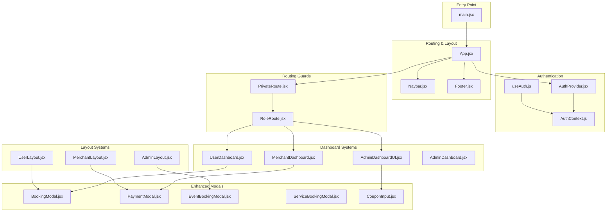

**Diagram sources**
- [main.jsx:1-11](file://frontend/src/main.jsx#L1-L11)
- [App.jsx:1-373](file://frontend/src/App.jsx#L1-L373)
- [BookingModal.jsx:1-1247](file://frontend/src/components/BookingModal.jsx#L1-L1247)
- [PaymentModal.jsx:1-364](file://frontend/src/components/PaymentModal.jsx#L1-L364)
- [EventBookingModal.jsx:1-276](file://frontend/src/components/EventBookingModal.jsx#L1-L276)
- [ServiceBookingModal.jsx:1-440](file://frontend/src/components/ServiceBookingModal.jsx#L1-L440)
- [CouponInput.jsx:1-166](file://frontend/src/components/CouponInput.jsx#L1-L166)
- [UserDashboard.jsx:1-270](file://frontend/src/pages/dashboards/UserDashboard.jsx#L1-L270)
- [MerchantDashboard.jsx:1-133](file://frontend/src/pages/dashboards/MerchantDashboard.jsx#L1-L133)
- [AdminDashboardUI.jsx:1-124](file://frontend/src/pages/dashboards/AdminDashboardUI.jsx#L1-L124)
- [AdminDashboard.jsx:1-91](file://frontend/src/pages/dashboards/AdminDashboard.jsx#L1-L91)
- [UserLayout.jsx:1-30](file://frontend/src/components/user/UserLayout.jsx#L1-L30)
- [MerchantLayout.jsx:1-29](file://frontend/src/components/merchant/MerchantLayout.jsx#L1-L29)
- [AdminLayout.jsx:1-29](file://frontend/src/components/admin/AdminLayout.jsx#L1-L29)

**Section sources**
- [main.jsx:1-11](file://frontend/src/main.jsx#L1-L11)
- [App.jsx:1-373](file://frontend/src/App.jsx#L1-L373)

## Core Components
The enhanced architecture introduces several key component categories:

### Authentication and Routing
- **Enhanced Auth Provider**: Manages token persistence and user state with improved error handling
- **Routing Guards**: PrivateRoute and RoleRoute with comprehensive role-based access control
- **Layout Systems**: Role-specific layouts (UserLayout, MerchantLayout, AdminLayout) with sidebar navigation

### Booking System Architecture
- **Dual Event Type Support**: BookingModal handles both full-service and ticketed events seamlessly
- **Advanced Form Handling**: Dynamic form generation based on event type with real-time validation
- **Ticket Management**: Multi-ticket type selection with availability validation
- **Addon Integration**: Optional addon selection with dynamic pricing calculations

### Payment Processing System
- **Multi-Method Payments**: Support for card, UPI, and net banking payment methods
- **Real-time Processing**: Simulated payment processing with success/error handling
- **Secure Transactions**: Encrypted payment data handling with toast notifications

### Coupon Integration
- **Dynamic Coupon Application**: Real-time coupon validation and discount calculation
- **Availability Management**: Coupon offer discovery and automatic validation
- **Transaction Tracking**: Coupon data persistence through booking and payment flows

**Section sources**
- [AuthProvider.jsx:1-38](file://frontend/src/context/AuthProvider.jsx#L1-L38)
- [PrivateRoute.jsx:1-15](file://frontend/src/components/PrivateRoute.jsx#L1-L15)
- [RoleRoute.jsx:1-16](file://frontend/src/components/RoleRoute.jsx#L1-L16)
- [BookingModal.jsx:1-1247](file://frontend/src/components/BookingModal.jsx#L1-L1247)
- [PaymentModal.jsx:1-364](file://frontend/src/components/PaymentModal.jsx#L1-L364)
- [CouponInput.jsx:1-166](file://frontend/src/components/CouponInput.jsx#L1-L166)

## Architecture Overview
The enhanced architecture follows a layered pattern with specialized components for different event types and payment scenarios:

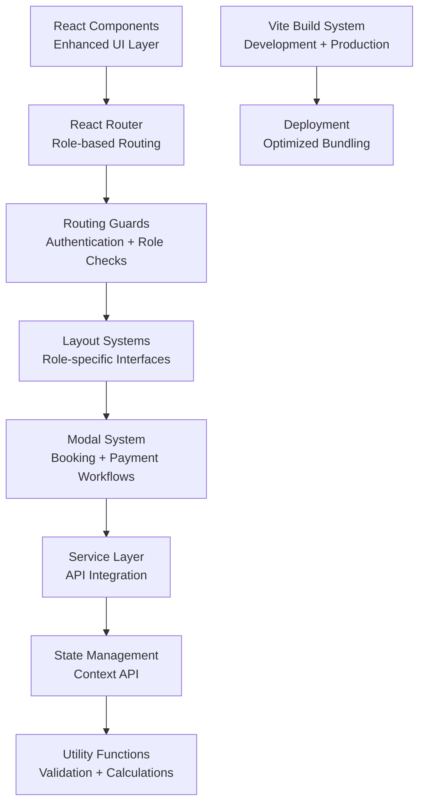

**Diagram sources**
- [App.jsx:51-373](file://frontend/src/App.jsx#L51-L373)
- [BookingModal.jsx:9-50](file://frontend/src/components/BookingModal.jsx#L9-L50)
- [PaymentModal.jsx:8-20](file://frontend/src/components/PaymentModal.jsx#L8-L20)
- [CouponInput.jsx:7-14](file://frontend/src/components/CouponInput.jsx#L7-L14)

## Enhanced Booking System
The booking system has been completely redesigned to handle dual event types with sophisticated state management:

### Dual Event Type Architecture
The BookingModal component intelligently adapts its interface based on event type:

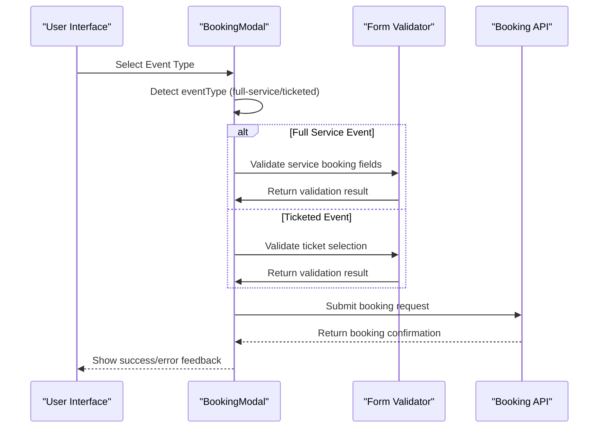

**Diagram sources**
- [BookingModal.jsx:15-19](file://frontend/src/components/BookingModal.jsx#L15-L19)
- [BookingModal.jsx:196-313](file://frontend/src/components/BookingModal.jsx#L196-L313)

### Advanced Ticket Management
The system supports complex ticket configurations with real-time availability checking:

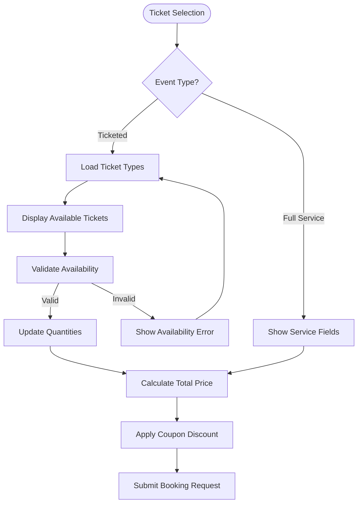

**Diagram sources**
- [BookingModal.jsx:56-113](file://frontend/src/components/BookingModal.jsx#L56-L113)
- [BookingModal.jsx:128-156](file://frontend/src/components/BookingModal.jsx#L128-L156)

**Section sources**
- [BookingModal.jsx:1-1247](file://frontend/src/components/BookingModal.jsx#L1-L1247)
- [EventBookingModal.jsx:1-276](file://frontend/src/components/EventBookingModal.jsx#L1-L276)
- [ServiceBookingModal.jsx:1-440](file://frontend/src/components/ServiceBookingModal.jsx#L1-L440)

## Payment Processing Architecture
The payment system provides a comprehensive solution for both ticketed and service bookings:

### Multi-Method Payment Flow
The PaymentModal component supports various payment methods with unified processing:

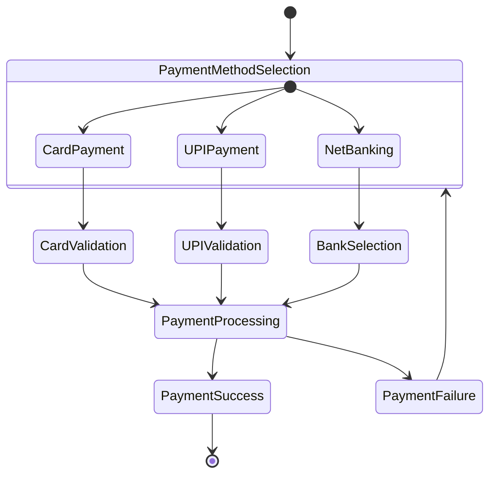

**Diagram sources**
- [PaymentModal.jsx:21-60](file://frontend/src/components/PaymentModal.jsx#L21-L60)
- [ServicePaymentModal.jsx:21-68](file://frontend/src/components/ServicePaymentModal.jsx#L21-L68)

### Payment State Management
The system maintains payment state through multiple modal interactions:

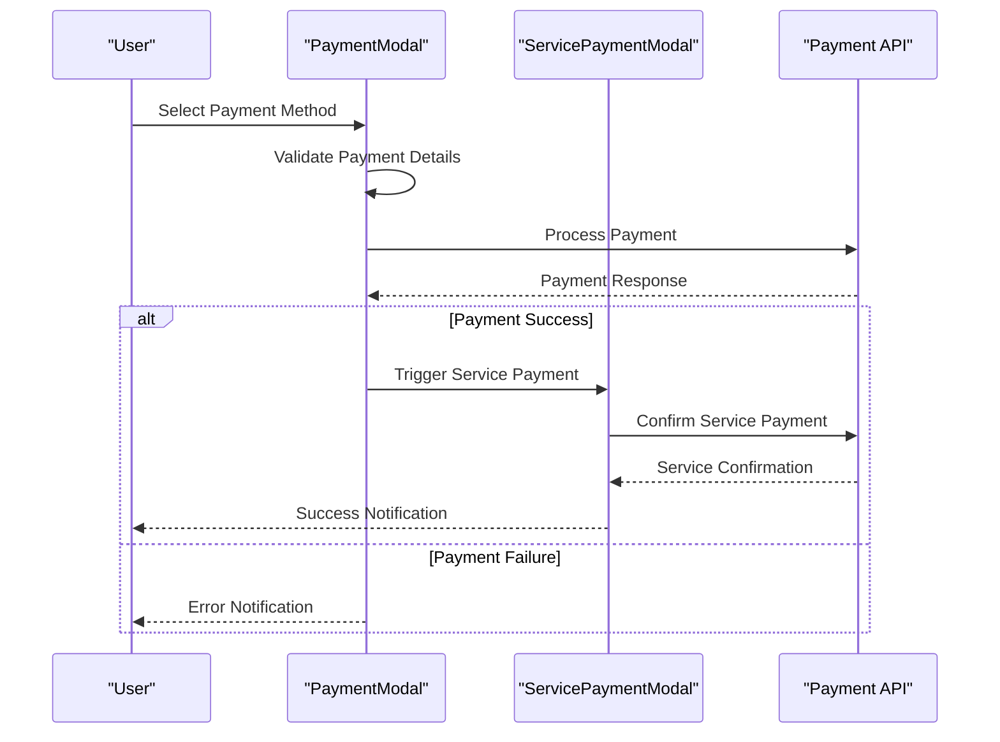

**Diagram sources**
- [PaymentModal.jsx:37-53](file://frontend/src/components/PaymentModal.jsx#L37-L53)
- [ServicePaymentModal.jsx:30-53](file://frontend/src/components/ServicePaymentModal.jsx#L30-L53)

**Section sources**
- [PaymentModal.jsx:1-364](file://frontend/src/components/PaymentModal.jsx#L1-L364)
- [ServicePaymentModal.jsx:1-246](file://frontend/src/components/ServicePaymentModal.jsx#L1-L246)

## Coupon Integration System
The coupon system provides dynamic discount application with real-time validation:

### Coupon Validation Flow
The CouponInput component handles coupon lifecycle from application to removal:

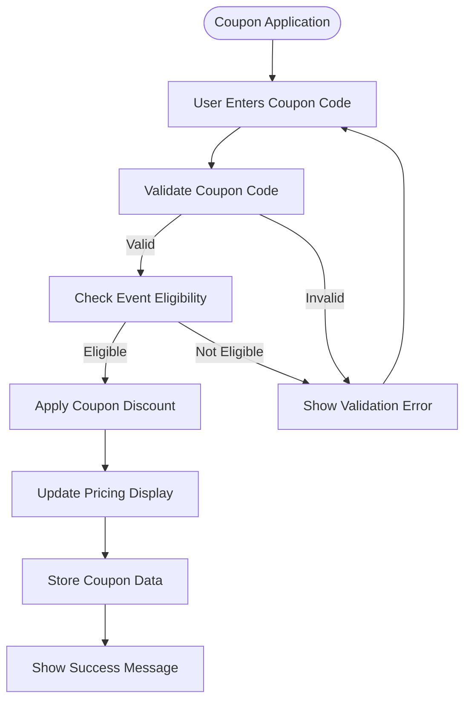

**Diagram sources**
- [CouponInput.jsx:19-82](file://frontend/src/components/CouponInput.jsx#L19-L82)
- [EventBookingModal.jsx:32-38](file://frontend/src/components/EventBookingModal.jsx#L32-L38)

### Coupon Data Management
The system maintains coupon state across different booking contexts:

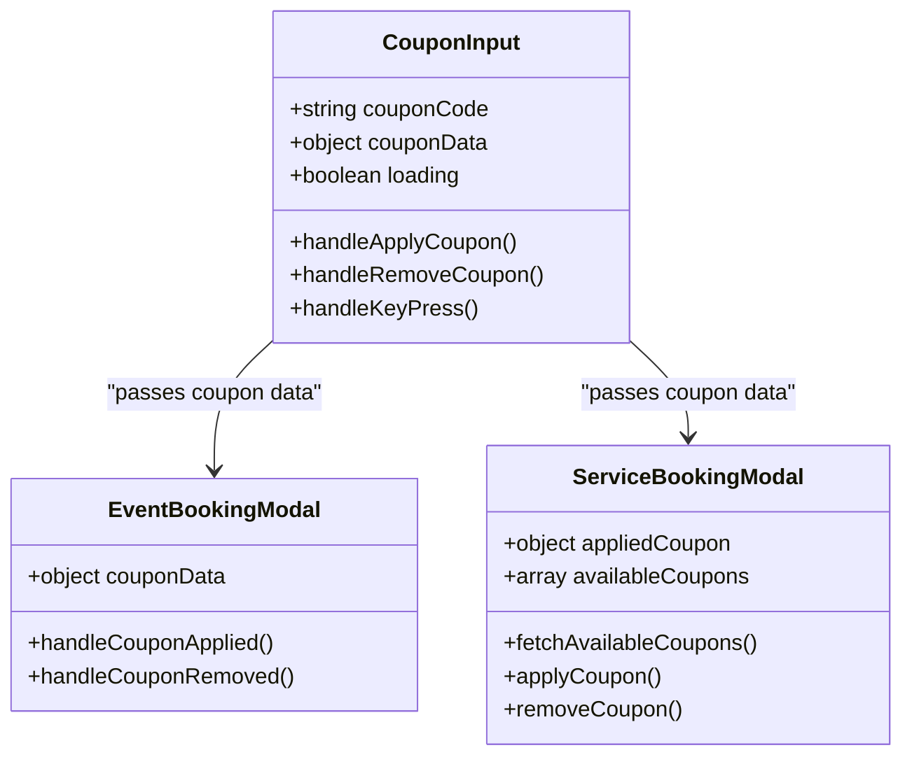

**Diagram sources**
- [CouponInput.jsx:7-14](file://frontend/src/components/CouponInput.jsx#L7-L14)
- [EventBookingModal.jsx:6-11](file://frontend/src/components/EventBookingModal.jsx#L6-L11)
- [ServiceBookingModal.jsx:25-29](file://frontend/src/components/ServiceBookingModal.jsx#L25-L29)

**Section sources**
- [CouponInput.jsx:1-166](file://frontend/src/components/CouponInput.jsx#L1-L166)
- [EventBookingModal.jsx:1-276](file://frontend/src/components/EventBookingModal.jsx#L1-L276)
- [ServiceBookingModal.jsx:1-440](file://frontend/src/components/ServiceBookingModal.jsx#L1-L440)

## Role-Based Dashboard Architecture
The dashboard system provides role-specific interfaces with enhanced functionality:

### Dashboard Layout System
Each role has a dedicated layout with custom navigation and content:

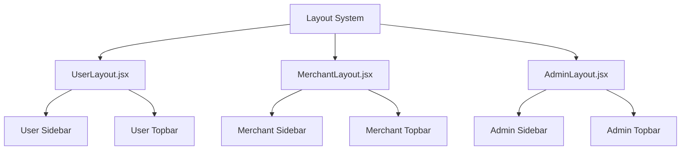

**Diagram sources**
- [UserLayout.jsx:7-23](file://frontend/src/components/user/UserLayout.jsx#L7-L23)
- [MerchantLayout.jsx:7-23](file://frontend/src/components/merchant/MerchantLayout.jsx#L7-L23)
- [AdminLayout.jsx:7-23](file://frontend/src/components/admin/AdminLayout.jsx#L7-L23)

### Enhanced Dashboard Components
Each dashboard leverages specialized components for their domain:

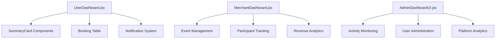

**Diagram sources**
- [UserDashboard.jsx:11-73](file://frontend/src/pages/dashboards/UserDashboard.jsx#L11-L73)
- [MerchantDashboard.jsx:12-51](file://frontend/src/pages/dashboards/MerchantDashboard.jsx#L12-L51)
- [AdminDashboardUI.jsx:11-39](file://frontend/src/pages/dashboards/AdminDashboardUI.jsx#L11-L39)

**Section sources**
- [UserDashboard.jsx:1-270](file://frontend/src/pages/dashboards/UserDashboard.jsx#L1-L270)
- [MerchantDashboard.jsx:1-133](file://frontend/src/pages/dashboards/MerchantDashboard.jsx#L1-L133)
- [AdminDashboardUI.jsx:1-124](file://frontend/src/pages/dashboards/AdminDashboardUI.jsx#L1-L124)
- [AdminDashboard.jsx:1-91](file://frontend/src/pages/dashboards/AdminDashboard.jsx#L1-L91)

## Layout and Navigation Systems
The layout system provides consistent navigation across all roles with responsive design:

### Responsive Layout Architecture
Each layout component manages sidebar navigation and content area:

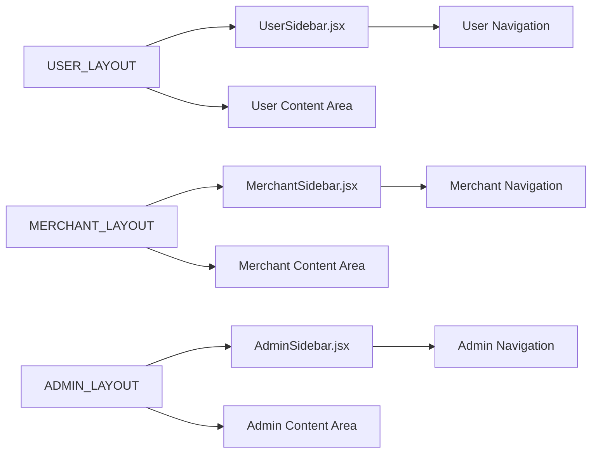

**Diagram sources**
- [UserLayout.jsx:14-21](file://frontend/src/components/user/UserLayout.jsx#L14-L21)
- [MerchantLayout.jsx:14-21](file://frontend/src/components/merchant/MerchantLayout.jsx#L14-L21)
- [AdminLayout.jsx:14-21](file://frontend/src/components/admin/AdminLayout.jsx#L14-L21)

### Navigation State Management
The layout system maintains navigation state and handles user interactions:

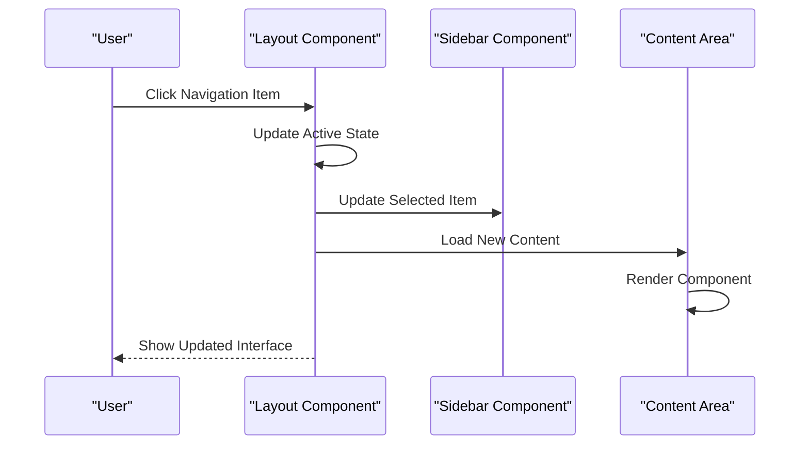

**Diagram sources**
- [UserLayout.jsx:10-13](file://frontend/src/components/user/UserLayout.jsx#L10-L13)
- [MerchantLayout.jsx:10-13](file://frontend/src/components/merchant/MerchantLayout.jsx#L10-L13)
- [AdminLayout.jsx:10-13](file://frontend/src/components/admin/AdminLayout.jsx#L10-L13)

**Section sources**
- [UserLayout.jsx:1-30](file://frontend/src/components/user/UserLayout.jsx#L1-L30)
- [MerchantLayout.jsx:1-29](file://frontend/src/components/merchant/MerchantLayout.jsx#L1-L29)
- [AdminLayout.jsx:1-29](file://frontend/src/components/admin/AdminLayout.jsx#L1-L29)

## Component Composition Patterns
The enhanced architecture employs sophisticated composition patterns for modularity and reusability:

### Modal Composition System
Multiple modals work together to provide comprehensive booking workflows:

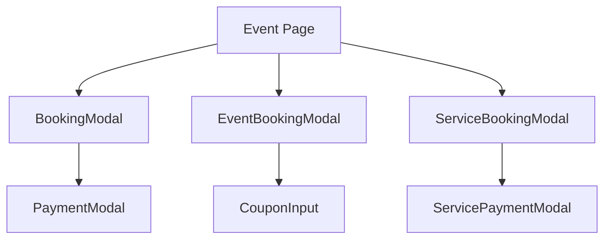

**Diagram sources**
- [UserBrowseEvents.jsx:440-477](file://frontend/src/pages/dashboards/UserBrowseEvents.jsx#L440-L477)
- [BookingModal.jsx:324-337](file://frontend/src/components/BookingModal.jsx#L324-L337)
- [EventBookingModal.jsx:224-233](file://frontend/src/components/EventBookingModal.jsx#L224-L233)

### State Propagation Patterns
Components communicate through well-defined props and callback patterns:

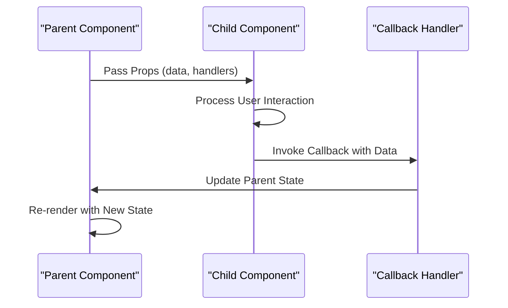

**Diagram sources**
- [BookingModal.jsx:252-253](file://frontend/src/components/BookingModal.jsx#L252-L253)
- [EventBookingModal.jsx:66-67](file://frontend/src/components/EventBookingModal.jsx#L66-L67)
- [ServiceBookingModal.jsx:175-178](file://frontend/src/components/ServiceBookingModal.jsx#L175-L178)

**Section sources**
- [UserBrowseEvents.jsx:1-483](file://frontend/src/pages/dashboards/UserBrowseEvents.jsx#L1-L483)
- [BookingModal.jsx:1-1247](file://frontend/src/components/BookingModal.jsx#L1-L1247)
- [EventBookingModal.jsx:1-276](file://frontend/src/components/EventBookingModal.jsx#L1-L276)
- [ServiceBookingModal.jsx:1-440](file://frontend/src/components/ServiceBookingModal.jsx#L1-L440)

## State Management and Synchronization
The architecture implements robust state management patterns across all components:

### Context API Implementation
Enhanced authentication context with improved state synchronization:

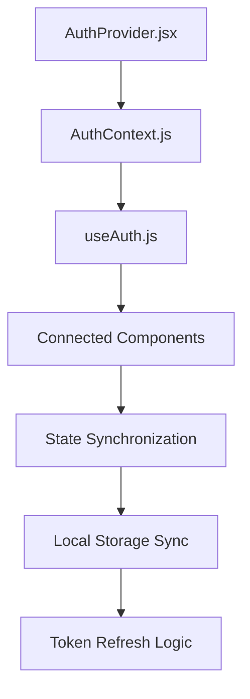

**Diagram sources**
- [AuthProvider.jsx:1-38](file://frontend/src/context/AuthProvider.jsx#L1-L38)
- [AuthContext.js](file://frontend/src/context/AuthContext.js)
- [useAuth.js](file://frontend/src/context/useAuth.js)

### Modal State Management
Complex state management for multi-modal workflows:

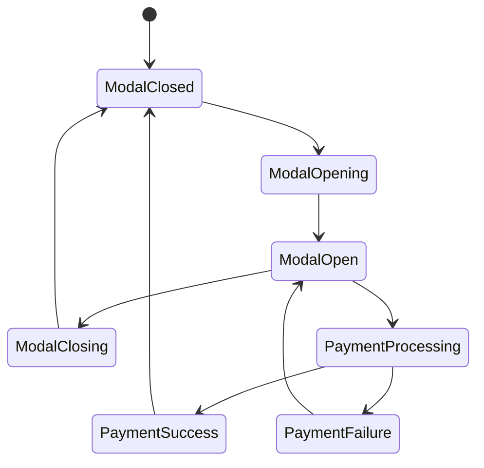

**Diagram sources**
- [BookingModal.jsx:12-13](file://frontend/src/components/BookingModal.jsx#L12-L13)
- [PaymentModal.jsx:10-11](file://frontend/src/components/PaymentModal.jsx#L10-L11)

**Section sources**
- [AuthProvider.jsx:1-38](file://frontend/src/context/AuthProvider.jsx#L1-L38)
- [useAuth.js](file://frontend/src/context/useAuth.js)
- [AuthContext.js](file://frontend/src/context/AuthContext.js)

## Performance Optimization Strategies
The enhanced architecture incorporates multiple performance optimization techniques:

### Lazy Loading and Code Splitting
- Dynamic imports for route components to reduce initial bundle size
- Modal components loaded on-demand to minimize memory usage
- Image optimization with responsive loading strategies

### State Optimization
- Memoized selectors for expensive computations
- Local state caching for frequently accessed data
- Debounced input handling for search and filters

### Rendering Optimization
- Virtualized lists for large datasets
- Conditional rendering for complex modals
- Optimized re-rendering with proper key usage

## Development Workflow and Build Configuration
The build system supports modern development practices:

### Vite Configuration
- Fast development server with hot module replacement
- Optimized production builds with tree shaking
- Plugin ecosystem for React and TypeScript support

### Development Tools
- ESLint integration for code quality
- Prettier for consistent formatting
- Git hooks for pre-commit validation

**Section sources**
- [vite.config.js:1-12](file://frontend/vite.config.js#L1-L12)
- [package.json:6-11](file://frontend/package.json#L6-L11)

## Deployment Considerations
The architecture supports scalable deployment strategies:

### Build Optimization
- Environment-specific configurations
- Asset optimization and compression
- CDN integration for static assets

### Performance Monitoring
- Bundle analysis for optimization
- Runtime performance monitoring
- Error tracking and reporting

## Troubleshooting Guide
Common issues and resolution strategies:

### Booking System Issues
- **Ticket Availability Errors**: Verify ticket type configuration and availability calculations
- **Coupon Validation Failures**: Check coupon eligibility rules and expiration dates
- **Payment Processing Errors**: Validate payment method configuration and API endpoints

### Dashboard Performance Issues
- **Slow Data Loading**: Implement pagination and lazy loading for large datasets
- **Layout Rendering Problems**: Check for proper component unmounting and state cleanup
- **Authentication State Issues**: Verify token refresh mechanisms and context provider setup

### Modal Interaction Problems
- **Modal State Synchronization**: Ensure proper state propagation between nested modals
- **Form Validation Errors**: Implement comprehensive validation with user-friendly error messages
- **Payment Flow Breakdowns**: Verify callback function implementations and error handling

**Section sources**
- [BookingModal.jsx:254-260](file://frontend/src/components/BookingModal.jsx#L254-L260)
- [PaymentModal.jsx:54-60](file://frontend/src/components/PaymentModal.jsx#L54-L60)
- [CouponInput.jsx:48-54](file://frontend/src/components/CouponInput.jsx#L48-L54)

## Conclusion
The enhanced frontend architecture demonstrates a mature, scalable approach to building complex event management applications. The dual event type support, comprehensive booking workflows, integrated payment processing, and role-based dashboard systems showcase best practices in React development. The modular component design, robust state management, and performance optimizations provide a solid foundation for continued feature development and scaling.

The architecture successfully balances flexibility with maintainability, providing clear separation of concerns while enabling seamless user experiences across different event types and payment scenarios. The enhanced layout systems and comprehensive modal architecture demonstrate sophisticated UI/UX patterns that can serve as a model for similar enterprise applications.