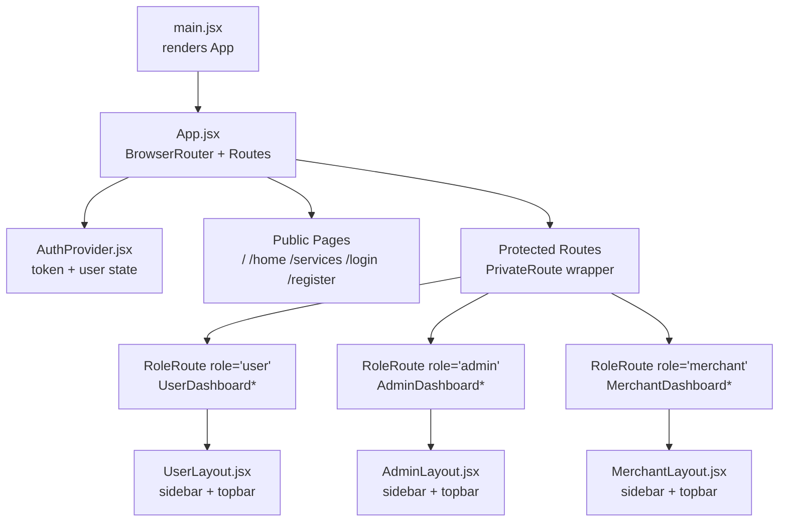
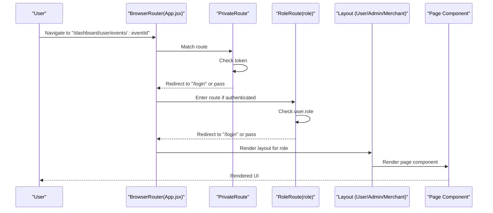
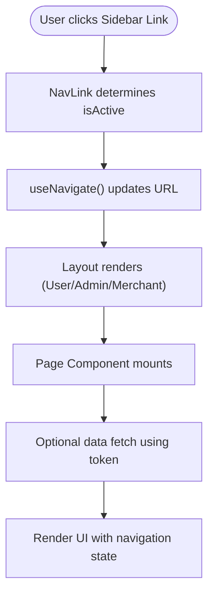
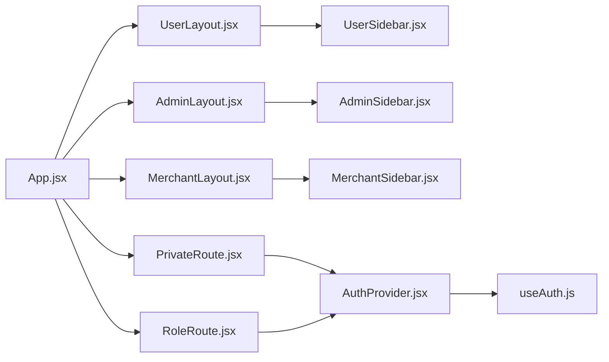

# Routing and Navigation

<cite>
**Referenced Files in This Document**
- [App.jsx](file://frontend/src/App.jsx)
- [main.jsx](file://frontend/src/main.jsx)
- [PrivateRoute.jsx](file://frontend/src/components/PrivateRoute.jsx)
- [RoleRoute.jsx](file://frontend/src/components/RoleRoute.jsx)
- [AuthProvider.jsx](file://frontend/src/context/AuthProvider.jsx)
- [useAuth.js](file://frontend/src/context/useAuth.js)
- [UserLayout.jsx](file://frontend/src/components/user/UserLayout.jsx)
- [AdminLayout.jsx](file://frontend/src/components/admin/AdminLayout.jsx)
- [MerchantLayout.jsx](file://frontend/src/components/merchant/MerchantLayout.jsx)
- [UserSidebar.jsx](file://frontend/src/components/user/UserSidebar.jsx)
- [AdminSidebar.jsx](file://frontend/src/components/admin/AdminSidebar.jsx)
- [MerchantSidebar.jsx](file://frontend/src/components/merchant/MerchantSidebar.jsx)
- [UserDashboard.jsx](file://frontend/src/pages/dashboards/UserDashboard.jsx)
- [http.js](file://frontend/src/lib/http.js)
</cite>

## Table of Contents
1. [Introduction](#introduction)
2. [Project Structure](#project-structure)
3. [Core Components](#core-components)
4. [Architecture Overview](#architecture-overview)
5. [Detailed Component Analysis](#detailed-component-analysis)
6. [Dependency Analysis](#dependency-analysis)
7. [Performance Considerations](#performance-considerations)
8. [Troubleshooting Guide](#troubleshooting-guide)
9. [Conclusion](#conclusion)
10. [Appendices](#appendices)

## Introduction
This document explains the React Router-based routing and navigation implementation with role-based access control. It covers route configuration, private route protection, role-based rendering, nested dashboard layouts, navigation patterns across user roles, route parameters and query handling, programmatic navigation, custom route guards, authentication redirects, navigation state management, performance optimization, and SEO considerations.

## Project Structure
The routing system is centered around a single-page application built with React Router v6. The application initializes the routing provider and context provider at the root, then defines public and protected routes grouped by role-specific dashboards. Layout components wrap role-specific pages to provide consistent navigation and header/footer behavior.

**Diagram sources**
- [main.jsx:1-11](file://frontend/src/main.jsx#L1-L11)
- [App.jsx:362-373](file://frontend/src/App.jsx#L362-L373)
- [AuthProvider.jsx:1-38](file://frontend/src/context/AuthProvider.jsx#L1-L38)
- [UserLayout.jsx:1-30](file://frontend/src/components/user/UserLayout.jsx#L1-L30)
- [AdminLayout.jsx:1-29](file://frontend/src/components/admin/AdminLayout.jsx#L1-L29)
- [MerchantLayout.jsx:1-29](file://frontend/src/components/merchant/MerchantLayout.jsx#L1-L29)

**Section sources**
- [main.jsx:1-11](file://frontend/src/main.jsx#L1-L11)
- [App.jsx:51-373](file://frontend/src/App.jsx#L51-L373)

## Core Components
- App.jsx: Defines all routes, including public pages and protected role-based dashboards. Uses a helper to hide chrome for dashboard routes.
- PrivateRoute.jsx: Guards routes requiring authentication by checking presence of token.
- RoleRoute.jsx: Guards routes requiring a specific role by checking user role.
- AuthProvider.jsx + useAuth.js: Provides authentication state (token, user) via context and persists to localStorage.
- Layouts: UserLayout.jsx, AdminLayout.jsx, MerchantLayout.jsx wrap role-specific pages and provide shared navigation and logout flows.
- Sidebars: UserSidebar.jsx, AdminSidebar.jsx, MerchantSidebar.jsx define role-specific navigation menus.

Key routing patterns:
- Public pages: Home, Services, Login, Register, static pages.
- Protected nested dashboards: /dashboard/user, /dashboard/admin, /dashboard/merchant.
- Parameterized routes: /service/:id, /dashboard/user/events/:eventId, /dashboard/merchant/events/edit/:eventId.

**Section sources**
- [App.jsx:61-350](file://frontend/src/App.jsx#L61-L350)
- [PrivateRoute.jsx:1-15](file://frontend/src/components/PrivateRoute.jsx#L1-L15)
- [RoleRoute.jsx:1-16](file://frontend/src/components/RoleRoute.jsx#L1-L16)
- [AuthProvider.jsx:1-38](file://frontend/src/context/AuthProvider.jsx#L1-L38)
- [UserLayout.jsx:1-30](file://frontend/src/components/user/UserLayout.jsx#L1-L30)
- [AdminLayout.jsx:1-29](file://frontend/src/components/admin/AdminLayout.jsx#L1-L29)
- [MerchantLayout.jsx:1-29](file://frontend/src/components/merchant/MerchantLayout.jsx#L1-L29)
- [UserSidebar.jsx:1-62](file://frontend/src/components/user/UserSidebar.jsx#L1-L62)
- [AdminSidebar.jsx:1-59](file://frontend/src/components/admin/AdminSidebar.jsx#L1-L59)
- [MerchantSidebar.jsx:1-58](file://frontend/src/components/merchant/MerchantSidebar.jsx#L1-L58)

## Architecture Overview
The routing architecture enforces two-tier protection:
- Authentication guard: PrivateRoute checks token existence.
- Role guard: RoleRoute checks user role equality.
These guards are composed around role-specific pages so that only authenticated users with matching roles can access dashboards.

**Diagram sources**
- [App.jsx:76-106](file://frontend/src/App.jsx#L76-L106)
- [PrivateRoute.jsx:5-9](file://frontend/src/components/PrivateRoute.jsx#L5-L9)
- [RoleRoute.jsx:5-9](file://frontend/src/components/RoleRoute.jsx#L5-L9)
- [UserLayout.jsx:7-23](file://frontend/src/components/user/UserLayout.jsx#L7-L23)

## Detailed Component Analysis

### App.jsx Routing Setup
- Public routes: Home, Services, ServiceDetails with parameterized route, About, Blogs, FAQ, Contact, Login, Register.
- Protected routes:
  - User dashboard: multiple nested routes under /dashboard/user.
  - Admin dashboard: multiple nested routes under /dashboard/admin.
  - Merchant dashboard: multiple nested routes under /dashboard/merchant.
- Route parameters:
  - /service/:id for service details.
  - /dashboard/user/events/:eventId for event details.
  - /dashboard/merchant/events/edit/:eventId for editing events.
- Navigation behavior:
  - Chrome (Navbar/Footer) is hidden for paths starting with "/dashboard".
  - Programmatic navigation occurs inside pages and layouts (e.g., UserDashboard.jsx, UserLayout.jsx).

**Section sources**
- [App.jsx:61-350](file://frontend/src/App.jsx#L61-L350)

### PrivateRoute Protection Mechanism
- Purpose: Block unauthenticated access to protected routes.
- Behavior: Reads token from AuthContext; if missing, redirects to "/login" with replace semantics.

**Section sources**
- [PrivateRoute.jsx:5-9](file://frontend/src/components/PrivateRoute.jsx#L5-L9)
- [AuthProvider.jsx:6-28](file://frontend/src/context/AuthProvider.jsx#L6-L28)

### RoleRoute Guard
- Purpose: Enforce role-based access within protected routes.
- Behavior: Reads user from AuthContext; if user is missing or role does not match, redirects to "/login".

**Section sources**
- [RoleRoute.jsx:5-9](file://frontend/src/components/RoleRoute.jsx#L5-L9)
- [AuthProvider.jsx:6-28](file://frontend/src/context/AuthProvider.jsx#L6-L28)

### Authentication Context and State Management
- AuthProvider stores token and user in state and persists to localStorage on login/logout.
- useAuth exposes token, user, login, and logout to components.
- Token and user are restored from localStorage on initial render.

**Section sources**
- [AuthProvider.jsx:1-38](file://frontend/src/context/AuthProvider.jsx#L1-L38)
- [useAuth.js:1-6](file://frontend/src/context/useAuth.js#L1-L6)

### Nested Dashboard Layouts and Navigation Flow
- Layouts:
  - UserLayout.jsx wraps user dashboards and handles logout by invoking AuthProvider.logout and navigating to "/login".
  - AdminLayout.jsx and MerchantLayout.jsx follow the same pattern.
- Sidebars:
  - UserSidebar.jsx, AdminSidebar.jsx, MerchantSidebar.jsx define role-specific navigation links using NavLink and isActive styling.
- Navigation flow:
  - Clicking sidebar items navigates internally.
  - Logout triggers context logout and navigates to "/login".
  - Programmatic navigation occurs inside pages (e.g., UserDashboard.jsx navigates to browse/bookings/event details).

**Diagram sources**
- [UserSidebar.jsx:9-21](file://frontend/src/components/user/UserSidebar.jsx#L9-L21)
- [UserLayout.jsx:7-23](file://frontend/src/components/user/UserLayout.jsx#L7-L23)
- [UserDashboard.jsx:109-171](file://frontend/src/pages/dashboards/UserDashboard.jsx#L109-L171)

**Section sources**
- [UserLayout.jsx:1-30](file://frontend/src/components/user/UserLayout.jsx#L1-L30)
- [AdminLayout.jsx:1-29](file://frontend/src/components/admin/AdminLayout.jsx#L1-L29)
- [MerchantLayout.jsx:1-29](file://frontend/src/components/merchant/MerchantLayout.jsx#L1-L29)
- [UserSidebar.jsx:1-62](file://frontend/src/components/user/UserSidebar.jsx#L1-L62)
- [AdminSidebar.jsx:1-59](file://frontend/src/components/admin/AdminSidebar.jsx#L1-L59)
- [MerchantSidebar.jsx:1-58](file://frontend/src/components/merchant/MerchantSidebar.jsx#L1-L58)
- [UserDashboard.jsx:1-249](file://frontend/src/pages/dashboards/UserDashboard.jsx#L1-L249)

### Route Parameters and Query String Handling
- Route parameters:
  - Service ID: /service/:id handled by ServiceDetails route.
  - Event ID: /dashboard/user/events/:eventId and /dashboard/merchant/events/edit/:eventId.
- Query strings:
  - Not explicitly used in the provided routing configuration. Any query handling would be performed inside the respective page components using react-router’s hooks (not shown in routing files).

**Section sources**
- [App.jsx:67-106](file://frontend/src/App.jsx#L67-L106)
- [App.jsx:296-304](file://frontend/src/App.jsx#L296-L304)

### Programmatic Navigation
- Inside pages and layouts:
  - useNavigate is used to navigate programmatically (e.g., UserDashboard.jsx for browsing and viewing event details; UserLayout.jsx for logout).
- Sidebar items:
  - NavLink drives internal navigation without programmatic calls.

**Section sources**
- [UserDashboard.jsx:109-171](file://frontend/src/pages/dashboards/UserDashboard.jsx#L109-L171)
- [UserLayout.jsx:8-13](file://frontend/src/components/user/UserLayout.jsx#L8-L13)
- [UserSidebar.jsx:9-21](file://frontend/src/components/user/UserSidebar.jsx#L9-L21)

### Implementing Custom Route Guards
- Combine PrivateRoute and RoleRoute as done in App.jsx to achieve dual-layer protection.
- Extend guards:
  - Add capability checks by reading additional user fields from AuthContext.
  - Create a higher-order guard that composes authentication, role, and capability checks.

**Section sources**
- [App.jsx:76-106](file://frontend/src/App.jsx#L76-L106)
- [PrivateRoute.jsx:5-9](file://frontend/src/components/PrivateRoute.jsx#L5-L9)
- [RoleRoute.jsx:5-9](file://frontend/src/components/RoleRoute.jsx#L5-L9)

### Handling Authentication Redirects
- When guards fail, components redirect to "/login". Ensure login pages are publicly accessible and do not rely on PrivateRoute/RoleRoute.
- After successful login, restore previous intended destination if needed (not implemented in the provided files).

**Section sources**
- [PrivateRoute.jsx:7](file://frontend/src/components/PrivateRoute.jsx#L7)
- [RoleRoute.jsx:7](file://frontend/src/components/RoleRoute.jsx#L7)
- [App.jsx:73-74](file://frontend/src/App.jsx#L73-L74)

### Managing Navigation State
- Active link highlighting:
  - Sidebar items use NavLink with isActive to apply active styles.
- Location awareness:
  - App.jsx hides chrome for paths starting with "/dashboard" based on useLocation.

**Section sources**
- [UserSidebar.jsx:9-21](file://frontend/src/components/user/UserSidebar.jsx#L9-L21)
- [App.jsx:51-58](file://frontend/src/App.jsx#L51-L58)

## Dependency Analysis
The routing stack depends on React Router and the authentication context. The following diagram shows key dependencies among routing and layout components.

**Diagram sources**
- [App.jsx:51-373](file://frontend/src/App.jsx#L51-L373)
- [PrivateRoute.jsx:1-15](file://frontend/src/components/PrivateRoute.jsx#L1-L15)
- [RoleRoute.jsx:1-16](file://frontend/src/components/RoleRoute.jsx#L1-L16)
- [AuthProvider.jsx:1-38](file://frontend/src/context/AuthProvider.jsx#L1-L38)
- [useAuth.js:1-6](file://frontend/src/context/useAuth.js#L1-L6)
- [UserLayout.jsx:1-30](file://frontend/src/components/user/UserLayout.jsx#L1-L30)
- [AdminLayout.jsx:1-29](file://frontend/src/components/admin/AdminLayout.jsx#L1-L29)
- [MerchantLayout.jsx:1-29](file://frontend/src/components/merchant/MerchantLayout.jsx#L1-L29)
- [UserSidebar.jsx:1-62](file://frontend/src/components/user/UserSidebar.jsx#L1-L62)
- [AdminSidebar.jsx:1-59](file://frontend/src/components/admin/AdminSidebar.jsx#L1-L59)
- [MerchantSidebar.jsx:1-58](file://frontend/src/components/merchant/MerchantSidebar.jsx#L1-L58)

**Section sources**
- [App.jsx:51-373](file://frontend/src/App.jsx#L51-L373)
- [AuthProvider.jsx:1-38](file://frontend/src/context/AuthProvider.jsx#L1-L38)

## Performance Considerations
- Route composition: Keep guard components lightweight; avoid heavy computations in guards.
- Lazy loading: Consider lazy-loading page components to reduce initial bundle size.
- Conditional rendering: App.jsx conditionally renders Navbar/Footer based on path; keep this logic minimal.
- Navigation: Prefer NavLink for internal links to leverage client-side navigation; use programmatic navigation sparingly.
- State persistence: AuthProvider persists token/user to localStorage; avoid frequent writes and ensure cleanup on logout.

[No sources needed since this section provides general guidance]

## Troubleshooting Guide
Common issues and resolutions:
- Redirect loops to "/login":
  - Ensure token and user are persisted and restored correctly by AuthProvider.
  - Verify RoleRoute receives a user object with a valid role.
- Active link styles not applying:
  - Confirm NavLink usage and isActive logic in sidebars.
- Programmatic navigation not working:
  - Ensure useNavigate is called within a routed component or via a layout/page that is rendered by a route.

**Section sources**
- [AuthProvider.jsx:9-28](file://frontend/src/context/AuthProvider.jsx#L9-L28)
- [RoleRoute.jsx:5-9](file://frontend/src/components/RoleRoute.jsx#L5-L9)
- [UserSidebar.jsx:9-21](file://frontend/src/components/user/UserSidebar.jsx#L9-L21)
- [UserLayout.jsx:8-13](file://frontend/src/components/user/UserLayout.jsx#L8-L13)

## Conclusion
The routing and navigation system employs a clean separation of concerns: public pages, protected routes guarded by authentication, and role-based rendering. The combination of PrivateRoute and RoleRoute ensures robust access control. Layouts and sidebars provide consistent navigation experiences across roles, while programmatic navigation supports dynamic user flows. Extending guards and optimizing bundle sizes can further improve maintainability and performance.

## Appendices

### API Base and Auth Headers
- API base URL and Bearer token header construction are centralized for consistent backend communication.

**Section sources**
- [http.js:1-5](file://frontend/src/lib/http.js#L1-L5)