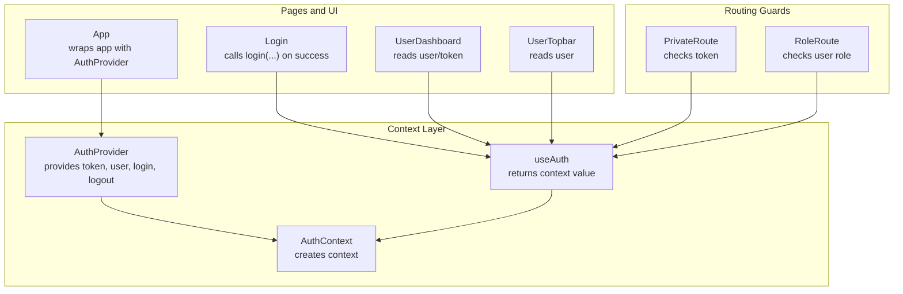
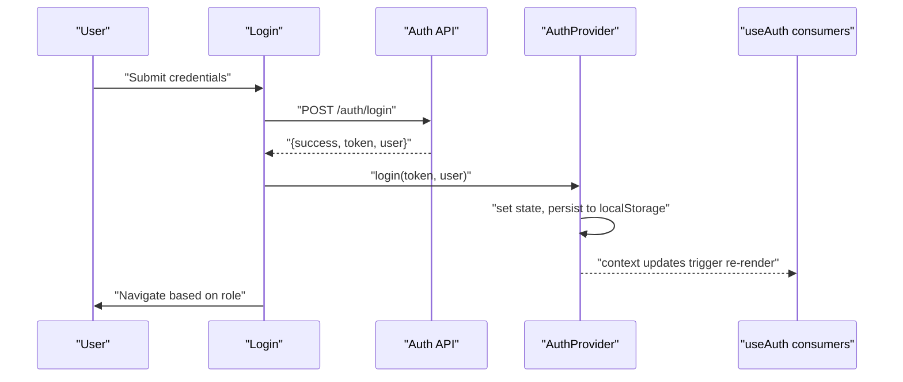
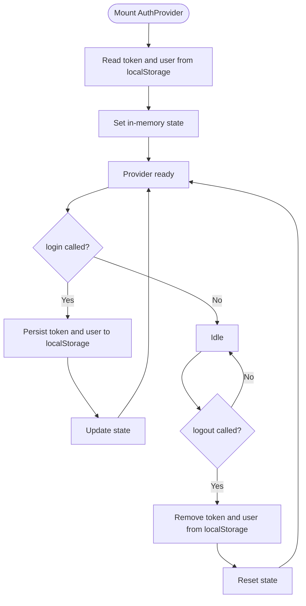
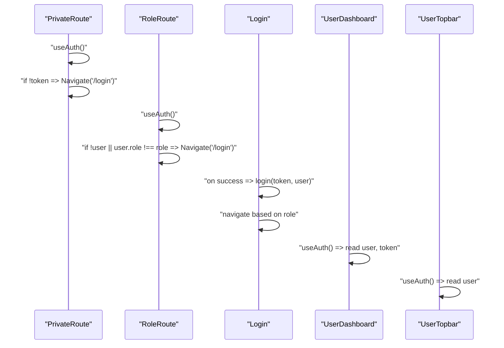
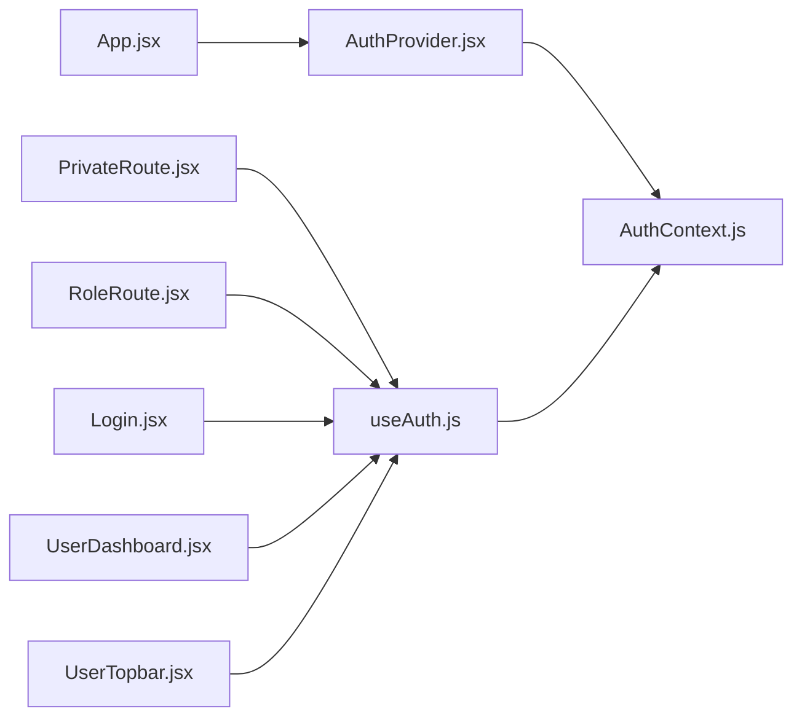

# State Management

<cite>
**Referenced Files in This Document**
- [AuthContext.js](file://frontend/src/context/AuthContext.js)
- [AuthProvider.jsx](file://frontend/src/context/AuthProvider.jsx)
- [useAuth.js](file://frontend/src/context/useAuth.js)
- [App.jsx](file://frontend/src/App.jsx)
- [Login.jsx](file://frontend/src/components/Login.jsx)
- [PrivateRoute.jsx](file://frontend/src/components/PrivateRoute.jsx)
- [RoleRoute.jsx](file://frontend/src/components/RoleRoute.jsx)
- [UserDashboard.jsx](file://frontend/src/pages/dashboards/UserDashboard.jsx)
- [UserTopbar.jsx](file://frontend/src/components/User/UserTopbar.jsx)
- [http.js](file://frontend/src/lib/http.js)
</cite>

## Table of Contents
1. [Introduction](#introduction)
2. [Project Structure](#project-structure)
3. [Core Components](#core-components)
4. [Architecture Overview](#architecture-overview)
5. [Detailed Component Analysis](#detailed-component-analysis)
6. [Dependency Analysis](#dependency-analysis)
7. [Performance Considerations](#performance-considerations)
8. [Troubleshooting Guide](#troubleshooting-guide)
9. [Conclusion](#conclusion)

## Introduction
This document explains the Context API-based authentication state management used in the frontend. It covers the AuthProvider component structure, AuthContext usage patterns, and how authentication state synchronizes across components. It also documents state initialization, provider wrapping strategies, consumer integration, session persistence, best practices to avoid unnecessary re-renders, and debugging tips.

## Project Structure
Authentication state is centralized under the context module and consumed by routing guards and page components. The provider wraps the entire application so that any route or component can access authentication state via a custom hook.

**Diagram sources**
- [App.jsx:362-370](file://frontend/src/App.jsx#L362-L370)
- [AuthProvider.jsx:5-32](file://frontend/src/context/AuthProvider.jsx#L5-L32)
- [AuthContext.js:1-5](file://frontend/src/context/AuthContext.js#L1-L5)
- [useAuth.js:1-6](file://frontend/src/context/useAuth.js#L1-L6)
- [PrivateRoute.jsx:5-9](file://frontend/src/components/PrivateRoute.jsx#L5-L9)
- [RoleRoute.jsx:5-9](file://frontend/src/components/RoleRoute.jsx#L5-L9)
- [Login.jsx:11-31](file://frontend/src/components/Login.jsx#L11-L31)
- [UserDashboard.jsx:12-50](file://frontend/src/pages/dashboards/UserDashboard.jsx#L12-L50)
- [UserTopbar.jsx:11](file://frontend/src/components/User/UserTopbar.jsx#L11)

**Section sources**
- [App.jsx:14](file://frontend/src/App.jsx#L14)
- [AuthProvider.jsx:5-32](file://frontend/src/context/AuthProvider.jsx#L5-L32)
- [AuthContext.js:1-5](file://frontend/src/context/AuthContext.js#L1-L5)
- [useAuth.js:1-6](file://frontend/src/context/useAuth.js#L1-L6)

## Core Components
- AuthContext: Creates the React context with an initial null value.
- AuthProvider: Manages token and user state, persists to localStorage, exposes login and logout functions, and provides the value to descendants.
- useAuth: A custom hook that reads the context value for consumers.

Key behaviors:
- Initialization: On mount, provider reads token and user from localStorage and sets state accordingly.
- Persistence: login and logout update both in-memory state and localStorage.
- Provider value: Exposes token, user, login, and logout to consumers.

**Section sources**
- [AuthContext.js:1-5](file://frontend/src/context/AuthContext.js#L1-L5)
- [AuthProvider.jsx:5-32](file://frontend/src/context/AuthProvider.jsx#L5-L32)
- [useAuth.js:1-6](file://frontend/src/context/useAuth.js#L1-L6)

## Architecture Overview
The provider is mounted at the root of the application. Routing guards use the authentication state to enforce access control. Page components and UI components consume the state to render UI and drive navigation.

**Diagram sources**
- [Login.jsx:15-66](file://frontend/src/components/Login.jsx#L15-L66)
- [AuthProvider.jsx:16-28](file://frontend/src/context/AuthProvider.jsx#L16-L28)
- [App.jsx:362-370](file://frontend/src/App.jsx#L362-L370)

## Detailed Component Analysis

### AuthProvider: State Initialization and Persistence
- Initializes token and user from localStorage on mount.
- Provides login to set token/user and persist them.
- Provides logout to clear token/user and remove persisted values.
- Wraps children with a Provider exposing { token, user, login, logout }.

**Diagram sources**
- [AuthProvider.jsx:9-28](file://frontend/src/context/AuthProvider.jsx#L9-L28)

**Section sources**
- [AuthProvider.jsx:5-32](file://frontend/src/context/AuthProvider.jsx#L5-L32)

### AuthContext and useAuth: Consumer Access Patterns
- AuthContext is created with a null default value.
- useAuth returns the context value for consumers.
- Consumers can read token and user, and call login/logout.

Common usage patterns:
- Guard routes by checking token presence.
- Enforce roles by checking user.role.
- Render UI conditionally based on authentication state.

**Section sources**
- [AuthContext.js:1-5](file://frontend/src/context/AuthContext.js#L1-L5)
- [useAuth.js:1-6](file://frontend/src/context/useAuth.js#L1-L6)
- [PrivateRoute.jsx:5-9](file://frontend/src/components/PrivateRoute.jsx#L5-L9)
- [RoleRoute.jsx:5-9](file://frontend/src/components/RoleRoute.jsx#L5-L9)

### Provider Wrapping Strategy
- The provider is mounted at the root level in App, ensuring all routes and components have access to authentication state.
- This single source of truth avoids prop drilling and ensures consistent state across the app.

**Section sources**
- [App.jsx:362-370](file://frontend/src/App.jsx#L362-L370)

### Consumer Integration Examples
- Login component:
  - Calls login with received token and user on successful authentication.
  - Navigates based on user role or previous location.
- PrivateRoute:
  - Redirects unauthenticated users to login.
- RoleRoute:
  - Redirects unauthorized users to login.
- Page components:
  - Read user and token to render personalized content and drive API calls.
- Topbar:
  - Reads user to display profile name and actions.

**Diagram sources**
- [PrivateRoute.jsx:5-9](file://frontend/src/components/PrivateRoute.jsx#L5-L9)
- [RoleRoute.jsx:5-9](file://frontend/src/components/RoleRoute.jsx#L5-L9)
- [Login.jsx:11-31](file://frontend/src/components/Login.jsx#L11-L31)
- [UserDashboard.jsx:12](file://frontend/src/pages/dashboards/UserDashboard.jsx#L12)
- [UserTopbar.jsx:11](file://frontend/src/components/User/UserTopbar.jsx#L11)

**Section sources**
- [Login.jsx:11-31](file://frontend/src/components/Login.jsx#L11-L31)
- [PrivateRoute.jsx:5-9](file://frontend/src/components/PrivateRoute.jsx#L5-L9)
- [RoleRoute.jsx:5-9](file://frontend/src/components/RoleRoute.jsx#L5-L9)
- [UserDashboard.jsx:12-50](file://frontend/src/pages/dashboards/UserDashboard.jsx#L12-L50)
- [UserTopbar.jsx:11](file://frontend/src/components/User/UserTopbar.jsx#L11)

### State Synchronization Across Components
- All consumers subscribe to the same context value.
- Updates to token/user propagate immediately to all subscribers.
- Routing guards react instantly to token changes, protecting protected routes.

**Section sources**
- [AuthProvider.jsx:30](file://frontend/src/context/AuthProvider.jsx#L30)
- [PrivateRoute.jsx:6](file://frontend/src/components/PrivateRoute.jsx#L6)
- [RoleRoute.jsx:6](file://frontend/src/components/RoleRoute.jsx#L6)

### Managing User Session Persistence
- login persists token and user to localStorage.
- logout removes persisted values.
- On app load, provider restores state from localStorage.

Best practice:
- Keep token and user lightweight and serializable.
- Avoid storing sensitive data in localStorage; rely on backend sessions and secure tokens.

**Section sources**
- [AuthProvider.jsx:16-28](file://frontend/src/context/AuthProvider.jsx#L16-L28)
- [AuthProvider.jsx:9-14](file://frontend/src/context/AuthProvider.jsx#L9-L14)

### Handling State Updates
- Prefer calling login on successful authentication and logout on sign-out.
- Avoid manually mutating context state; always use the provided functions.
- Use token for authenticated requests via helper utilities.

**Section sources**
- [Login.jsx:31](file://frontend/src/components/Login.jsx#L31)
- [http.js:2-4](file://frontend/src/lib/http.js#L2-L4)

## Dependency Analysis
- App depends on AuthProvider to wrap the application.
- AuthProvider depends on AuthContext and local storage.
- useAuth depends on AuthContext.
- PrivateRoute and RoleRoute depend on useAuth.
- Page components and UI components depend on useAuth.

**Diagram sources**
- [App.jsx:14](file://frontend/src/App.jsx#L14)
- [AuthProvider.jsx:3](file://frontend/src/context/AuthProvider.jsx#L3)
- [AuthContext.js:1-5](file://frontend/src/context/AuthContext.js#L1-L5)
- [useAuth.js:1-6](file://frontend/src/context/useAuth.js#L1-L6)
- [PrivateRoute.jsx:1](file://frontend/src/components/PrivateRoute.jsx#L1)
- [RoleRoute.jsx:1](file://frontend/src/components/RoleRoute.jsx#L1)
- [Login.jsx:4](file://frontend/src/components/Login.jsx#L4)
- [UserDashboard.jsx:4](file://frontend/src/pages/dashboards/UserDashboard.jsx#L4)
- [UserTopbar.jsx:7](file://frontend/src/components/User/UserTopbar.jsx#L7)

**Section sources**
- [App.jsx:14](file://frontend/src/App.jsx#L14)
- [AuthProvider.jsx:3](file://frontend/src/context/AuthProvider.jsx#L3)
- [useAuth.js:1-6](file://frontend/src/context/useAuth.js#L1-L6)

## Performance Considerations
- Keep the provider value minimal to reduce re-renders.
- Memoize callbacks and selectors used by consumers to prevent unnecessary renders.
- Avoid heavy computations inside the provider; derive data in consumers.
- Use shallow comparisons for props in components that consume authentication state.

## Troubleshooting Guide
Common issues and resolutions:
- Stale state after refresh:
  - Ensure provider reads from localStorage on mount and that login/logout update localStorage.
- Unexpected redirects:
  - Verify token presence in context and that guards check token before rendering protected content.
- Role-based access not working:
  - Confirm user exists and role matches expected value.
- API calls failing:
  - Ensure token is present and passed via auth headers.

Debugging tips:
- Add logging around login and logout to confirm state and storage updates.
- Temporarily log context value in consumers to observe updates.
- Inspect localStorage keys for token and user after login/logout.

**Section sources**
- [AuthProvider.jsx:9-28](file://frontend/src/context/AuthProvider.jsx#L9-L28)
- [PrivateRoute.jsx:6](file://frontend/src/components/PrivateRoute.jsx#L6)
- [RoleRoute.jsx:6](file://frontend/src/components/RoleRoute.jsx#L6)
- [http.js:2-4](file://frontend/src/lib/http.js#L2-L4)

## Conclusion
The authentication state management leverages a small, focused Context API implementation. The provider centralizes token and user state, persists it to localStorage, and exposes simple functions to update state. Routing guards and page components consume the state via a custom hook, enabling consistent, predictable behavior across the application. Following the best practices outlined here will help maintain a reliable and efficient authentication flow.