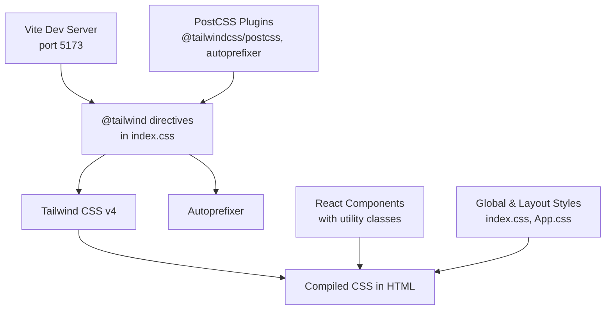
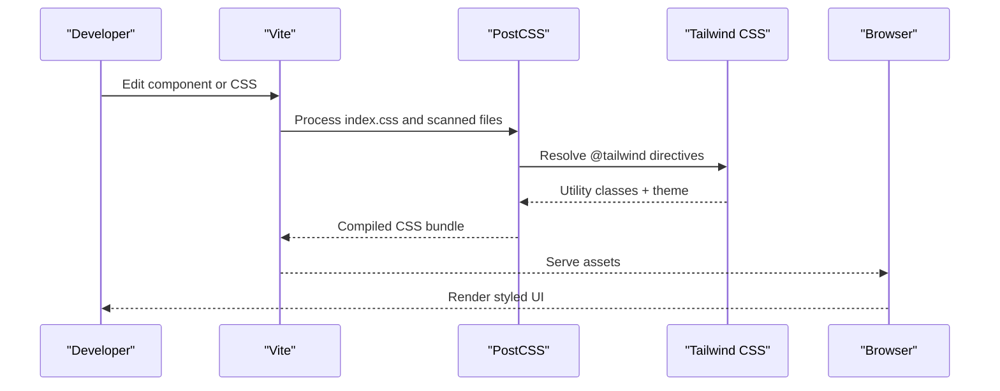
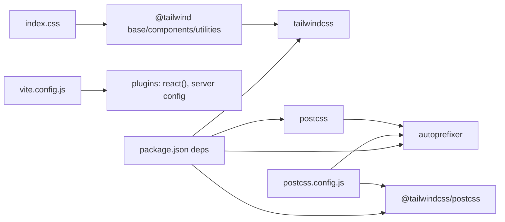

# Styling and Theming

<cite>
**Referenced Files in This Document**
- [tailwind.config.js](file://frontend/tailwind.config.js)
- [postcss.config.js](file://frontend/postcss.config.js)
- [index.css](file://frontend/src/index.css)
- [App.css](file://frontend/src/App.css)
- [package.json](file://frontend/package.json)
- [vite.config.js](file://frontend/vite.config.js)
- [Navbar.jsx](file://frontend/src/components/Navbar.jsx)
- [UserLayout.jsx](file://frontend/src/components/user/UserLayout.jsx)
- [AdminLayout.jsx](file://frontend/src/components/admin/AdminLayout.jsx)
- [GridLayout.jsx](file://frontend/src/components/common/GridLayout.jsx)
- [ServiceCard.jsx](file://frontend/src/components/ServiceCard.jsx)
- [UserDashboard.jsx](file://frontend/src/pages/dashboards/UserDashboard.jsx)
- [MerchantDashboard.css](file://frontend/src/pages/dashboards/MerchantDashboard.css)
</cite>

## Table of Contents
1. [Introduction](#introduction)
2. [Project Structure](#project-structure)
3. [Core Components](#core-components)
4. [Architecture Overview](#architecture-overview)
5. [Detailed Component Analysis](#detailed-component-analysis)
6. [Dependency Analysis](#dependency-analysis)
7. [Performance Considerations](#performance-considerations)
8. [Troubleshooting Guide](#troubleshooting-guide)
9. [Conclusion](#conclusion)

## Introduction
This document explains the styling and theming approach used in the frontend. It covers Tailwind CSS configuration, PostCSS pipeline, custom CSS organization, utility-first styling patterns, responsive design, dark mode support, and integration with the component library. It also provides guidelines for maintaining design consistency, reusing style patterns, optimizing performance, and ensuring visual coherence across devices.

## Project Structure
The styling stack is organized around Tailwind CSS v4 with a PostCSS pipeline, Vite for dev/build, and React components that apply utility classes. Global and layout-specific styles live in dedicated CSS files, while individual components encapsulate their own styles.

**Diagram sources**
- [vite.config.js:1-12](file://frontend/vite.config.js#L1-L12)
- [postcss.config.js:1-7](file://frontend/postcss.config.js#L1-L7)
- [index.css:1-3](file://frontend/src/index.css#L1-L3)
- [package.json:22-34](file://frontend/package.json#L22-L34)

**Section sources**
- [vite.config.js:1-12](file://frontend/vite.config.js#L1-L12)
- [postcss.config.js:1-7](file://frontend/postcss.config.js#L1-L7)
- [index.css:1-3](file://frontend/src/index.css#L1-L3)
- [package.json:22-34](file://frontend/package.json#L22-L34)

## Core Components
- Tailwind configuration defines content scanning, dark mode strategy, and theme extensions. It currently extends the theme minimally and leaves most styling to utilities.
- PostCSS configuration wires Tailwind directives and autoprefixer for vendor prefixes.
- Global styles define base resets, typography, container constraints, dark/light mode transitions, and custom controls (range slider, radio buttons).
- Component-level styling uses utility-first classes for layout, spacing, colors, shadows, and responsiveness.

Key implementation references:
- Tailwind config: [tailwind.config.js:1-10](file://frontend/tailwind.config.js#L1-L10)
- PostCSS config: [postcss.config.js:1-7](file://frontend/postcss.config.js#L1-L7)
- Global base and dark mode: [index.css:5-20](file://frontend/src/index.css#L5-L20)
- Custom controls: [index.css:22-80](file://frontend/src/index.css#L22-L80)
- Legacy global CSS (typography, containers, navigation): [App.css:1-624](file://frontend/src/App.css#L1-L624)

**Section sources**
- [tailwind.config.js:1-10](file://frontend/tailwind.config.js#L1-L10)
- [postcss.config.js:1-7](file://frontend/postcss.config.js#L1-L7)
- [index.css:5-20](file://frontend/src/index.css#L5-L20)
- [index.css:22-80](file://frontend/src/index.css#L22-L80)
- [App.css:1-624](file://frontend/src/App.css#L1-L624)

## Architecture Overview
The styling pipeline compiles Tailwind utilities and custom CSS into production-ready styles. Components apply utility classes directly, while global styles and layout wrappers ensure consistent spacing and theme behavior.

**Diagram sources**
- [vite.config.js:1-12](file://frontend/vite.config.js#L1-L12)
- [postcss.config.js:1-7](file://frontend/postcss.config.js#L1-L7)
- [index.css:1-3](file://frontend/src/index.css#L1-L3)
- [tailwind.config.js:1-10](file://frontend/tailwind.config.js#L1-L10)

## Detailed Component Analysis

### Tailwind Configuration and Theme Extension
- Content scanning targets index.html and all JS/JSX under src, ensuring purge-safe builds.
- Dark mode is enabled via class strategy, allowing global dark styles to toggle based on a class on the root element.
- Theme extension is empty; colors, spacing, and breakpoints are configured via defaults.

Recommendations:
- Centralize design tokens (colors, spacing, typography) in theme.extend for consistency.
- Define semantic color roles (primary, secondary, surface, etc.) to decouple from literal hues.

**Section sources**
- [tailwind.config.js:1-10](file://frontend/tailwind.config.js#L1-L10)

### PostCSS Pipeline and Autoprefixer
- The PostCSS configuration enables Tailwind directives and autoprefixer for cross-browser compatibility.
- Ensure autoprefixer runs after Tailwind to normalize vendor prefixes.

**Section sources**
- [postcss.config.js:1-7](file://frontend/postcss.config.js#L1-L7)

### Global Base and Dark Mode Styles
- Base resets and typography are defined globally, with a fixed container width and media queries for responsiveness.
- Dark mode toggles body and color-scheme classes for seamless theme switching.
- Custom range slider and radio button styles override browser defaults with smooth transitions.

Guidelines:
- Keep global resets minimal and explicit.
- Prefer Tailwind utilities for most styles; reserve global CSS for base resets and control overrides.

**Section sources**
- [index.css:5-20](file://frontend/src/index.css#L5-L20)
- [index.css:22-80](file://frontend/src/index.css#L22-L80)
- [App.css:15-26](file://frontend/src/App.css#L15-L26)

### Component Styling Patterns
- Navbar applies sticky positioning, max-width constraints, and hover/focus states using Tailwind utilities.
- Layout wrappers (UserLayout, AdminLayout) establish page scaffolding with consistent spacing and sidebar offsets.
- GridLayout composes responsive grid classes with optional extra classes.
- ServiceCard demonstrates category-based badges, rating overlays, and hover effects using Tailwind utilities.

Best practices:
- Use semantic class grouping for readability (layout, color, spacing, states).
- Encapsulate component-specific styles within components to avoid global leakage.
- Favor utility-first composition over custom CSS for maintainability.

**Section sources**
- [Navbar.jsx:4-59](file://frontend/src/components/Navbar.jsx#L4-L59)
- [UserLayout.jsx:7-23](file://frontend/src/components/user/UserLayout.jsx#L7-L23)
- [AdminLayout.jsx:7-23](file://frontend/src/components/admin/AdminLayout.jsx#L7-L23)
- [GridLayout.jsx:3-11](file://frontend/src/components/common/GridLayout.jsx#L3-L11)
- [ServiceCard.jsx:31-87](file://frontend/src/components/ServiceCard.jsx#L31-L87)

### Responsive Design Implementation
- Components use responsive prefixes (sm:, lg:) to adapt layouts across breakpoints.
- Grid layouts adjust column counts and gaps for different viewport widths.
- Media queries in legacy CSS enforce container and navigation responsiveness.

Recommendations:
- Prefer Tailwind’s responsive modifiers for layout changes.
- Consolidate repeated media queries into utility classes where possible.

**Section sources**
- [GridLayout.jsx:6](file://frontend/src/components/common/GridLayout.jsx#L6)
- [ServiceCard.jsx:32](file://frontend/src/components/ServiceCard.jsx#L32)
- [App.css:21-26](file://frontend/src/App.css#L21-L26)
- [App.css:84-151](file://frontend/src/App.css#L84-L151)

### Dark Mode Integration
- Dark mode is controlled via a class applied to the root element. Global dark styles adjust background and text colors.
- Components should rely on Tailwind’s dark: variants or the class strategy to remain coherent.

**Section sources**
- [tailwind.config.js:4](file://frontend/tailwind.config.js#L4)
- [index.css:5-20](file://frontend/src/index.css#L5-L20)

### Layout and Dashboard Styling
- UserDashboard uses grid-based card layouts and Tailwind utilities for spacing, shadows, and hover states.
- MerchantDashboard applies targeted overrides for stat cards and buttons, demonstrating when component-level CSS is appropriate.

Guidelines:
- Use Tailwind utilities for most dashboard grids and cards.
- Apply scoped CSS only when Tailwind cannot precisely match a control’s appearance.

**Section sources**
- [UserDashboard.jsx:98-103](file://frontend/src/pages/dashboards/UserDashboard.jsx#L98-L103)
- [UserDashboard.jsx:129-215](file://frontend/src/pages/dashboards/UserDashboard.jsx#L129-L215)
- [MerchantDashboard.css:1-49](file://frontend/src/pages/dashboards/MerchantDashboard.css#L1-L49)

### Custom CSS Organization
- index.css: Tailwind directives, dark/light globals, and custom control overrides.
- App.css: Legacy global styles for typography, containers, navigation, hero, contact, footer, and card grids.
- MerchantDashboard.css: Scoped overrides for merchant-specific visuals.

Recommendations:
- Move legacy styles into utility-first equivalents where feasible.
- Keep overrides minimal and namespaced to reduce specificity conflicts.

**Section sources**
- [index.css:1-3](file://frontend/src/index.css#L1-L3)
- [index.css:5-20](file://frontend/src/index.css#L5-L20)
- [index.css:22-80](file://frontend/src/index.css#L22-L80)
- [App.css:1-624](file://frontend/src/App.css#L1-L624)
- [MerchantDashboard.css:1-49](file://frontend/src/pages/dashboards/MerchantDashboard.css#L1-L49)

### Theming and Design Tokens
Current state:
- No theme extension is defined; colors and spacing derive from Tailwind defaults.
- Dark mode relies on class-based toggling.

Recommendations:
- Add semantic tokens in theme.extend (colors, spacing, typography, breakpoints).
- Define a color palette with named roles (primary, secondary, background, surface).
- Use Tailwind’s dark: variants alongside the class strategy for automatic dark styles.

**Section sources**
- [tailwind.config.js:5-7](file://frontend/tailwind.config.js#L5-L7)

### Utility-First Workflow
- Components compose small, single-purpose utilities for layout, color, spacing, and states.
- This reduces CSS bloat and improves maintainability.

Example patterns:
- Container and navigation: [App.css:15-26](file://frontend/src/App.css#L15-L26), [App.css:28-139](file://frontend/src/App.css#L28-L139)
- Card hover and shadows: [ServiceCard.jsx:32](file://frontend/src/components/ServiceCard.jsx#L32), [ServiceCard.jsx:79](file://frontend/src/components/ServiceCard.jsx#L79)

**Section sources**
- [ServiceCard.jsx:32](file://frontend/src/components/ServiceCard.jsx#L32)
- [ServiceCard.jsx:79](file://frontend/src/components/ServiceCard.jsx#L79)
- [App.css:28-139](file://frontend/src/App.css#L28-L139)

## Dependency Analysis
Tailwind and PostCSS are integrated via Vite. The build pipeline resolves Tailwind directives, applies autoprefixer, and produces optimized CSS consumed by components.

**Diagram sources**
- [package.json:22-34](file://frontend/package.json#L22-L34)
- [vite.config.js:1-12](file://frontend/vite.config.js#L1-L12)
- [postcss.config.js:1-7](file://frontend/postcss.config.js#L1-L7)
- [index.css:1-3](file://frontend/src/index.css#L1-L3)

**Section sources**
- [package.json:22-34](file://frontend/package.json#L22-L34)
- [vite.config.js:1-12](file://frontend/vite.config.js#L1-L12)
- [postcss.config.js:1-7](file://frontend/postcss.config.js#L1-L7)
- [index.css:1-3](file://frontend/src/index.css#L1-L3)

## Performance Considerations
- Tailwind purges unused classes based on content globs; keep selectors scoped to prevent accidental retention.
- Prefer utilities over custom CSS to leverage purging and minimize payload.
- Use responsive variants judiciously to avoid generating excessive media queries.
- Keep global CSS minimal to reduce render-blocking styles.

[No sources needed since this section provides general guidance]

## Troubleshooting Guide
Common issues and resolutions:
- Dark mode not applying: Ensure the dark class is toggled on the root element and verify dark mode configuration.
  - Reference: [tailwind.config.js:4](file://frontend/tailwind.config.js#L4), [index.css:5-20](file://frontend/src/index.css#L5-L20)
- Custom controls not rendering: Confirm custom range/radio styles are included and not overridden by utilities.
  - Reference: [index.css:22-80](file://frontend/src/index.css#L22-L80)
- Layout shifts on mobile: Replace fixed container widths with responsive utilities and ensure media queries are not conflicting with Tailwind’s responsive prefixes.
  - Reference: [App.css:15-26](file://frontend/src/App.css#L15-L26), [App.css:21-26](file://frontend/src/App.css#L21-L26)
- Dashboard grid misalignment: Use Tailwind’s grid utilities consistently and avoid mixing inline styles with Tailwind classes.
  - Reference: [UserDashboard.jsx:98-103](file://frontend/src/pages/dashboards/UserDashboard.jsx#L98-L103), [UserDashboard.jsx:129-215](file://frontend/src/pages/dashboards/UserDashboard.jsx#L129-L215)

**Section sources**
- [tailwind.config.js:4](file://frontend/tailwind.config.js#L4)
- [index.css:5-20](file://frontend/src/index.css#L5-L20)
- [index.css:22-80](file://frontend/src/index.css#L22-L80)
- [App.css:15-26](file://frontend/src/App.css#L15-L26)
- [App.css:21-26](file://frontend/src/App.css#L21-L26)
- [UserDashboard.jsx:98-103](file://frontend/src/pages/dashboards/UserDashboard.jsx#L98-L103)
- [UserDashboard.jsx:129-215](file://frontend/src/pages/dashboards/UserDashboard.jsx#L129-L215)

## Conclusion
The project follows a clean utility-first approach with Tailwind CSS v4 and a PostCSS pipeline. Global resets and dark mode are centralized, while components focus on compositional utilities. To improve maintainability and scalability:
- Extend Tailwind’s theme with semantic tokens.
- Consolidate legacy CSS into utility-first equivalents.
- Enforce consistent responsive patterns using Tailwind’s responsive prefixes.
- Keep custom CSS scoped and minimal to reduce specificity conflicts.

[No sources needed since this section summarizes without analyzing specific files]