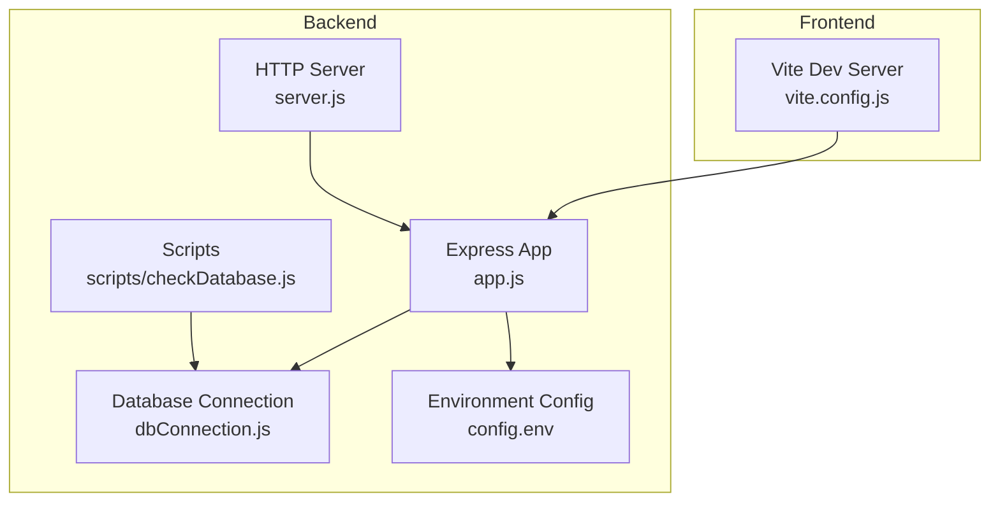

# Getting Started

<cite>
**Referenced Files in This Document**
- [backend/package.json](file://backend/package.json)
- [frontend/package.json](file://frontend/package.json)
- [backend/app.js](file://backend/app.js)
- [backend/server.js](file://backend/server.js)
- [backend/config/config.env](file://backend/config/config.env)
- [backend/database/dbConnection.js](file://backend/database/dbConnection.js)
- [backend/DATABASE_SETUP.md](file://backend/DATABASE_SETUP.md)
- [backend/MONGODB_ATLAS_SETUP_GUIDE.md](file://backend/MONGODB_ATLAS_SETUP_GUIDE.md)
- [backend/scripts/checkDatabase.js](file://backend/scripts/checkDatabase.js)
- [frontend/vite.config.js](file://frontend/vite.config.js)
</cite>

## Table of Contents
1. [Introduction](#introduction)
2. [Project Structure](#project-structure)
3. [Prerequisites](#prerequisites)
4. [Installation](#installation)
5. [Environment Configuration](#environment-configuration)
6. [Database Setup](#database-setup)
7. [First-Time Server Startup](#first-time-server-startup)
8. [Verification and Testing](#verification-and-testing)
9. [Troubleshooting Guide](#troubleshooting-guide)
10. [Conclusion](#conclusion)

## Introduction
This guide helps you quickly set up and run the MERN Stack Event Management Platform. It covers prerequisites, installation, environment configuration, database setup (local MongoDB and MongoDB Atlas), and first-time server startup. You will also find verification steps and troubleshooting guidance to ensure everything works as expected.

## Project Structure
The project follows a classic MERN stack layout:
- Backend built with Express and Node.js, exposing REST APIs and managing database connections.
- Frontend built with React and Vite, serving the user interface and integrating with backend endpoints.
- Shared configuration via environment variables and scripts for database checks and migrations.

**Diagram sources**
- [backend/app.js:1-79](file://backend/app.js#L1-L79)
- [backend/server.js:1-6](file://backend/server.js#L1-L6)
- [backend/database/dbConnection.js:1-112](file://backend/database/dbConnection.js#L1-L112)
- [backend/config/config.env:1-42](file://backend/config/config.env#L1-L42)
- [backend/scripts/checkDatabase.js:1-87](file://backend/scripts/checkDatabase.js#L1-L87)
- [frontend/vite.config.js:1-12](file://frontend/vite.config.js#L1-L12)

**Section sources**
- [backend/app.js:1-79](file://backend/app.js#L1-L79)
- [backend/server.js:1-6](file://backend/server.js#L1-L6)
- [frontend/vite.config.js:1-12](file://frontend/vite.config.js#L1-L12)

## Prerequisites
Before installing the platform, ensure you have:
- Node.js and npm installed on your machine.
- Basic understanding of MongoDB and how to run a local instance.
- A terminal/shell to execute commands.
- Git (optional, for cloning the repository).

These tools are required to run both the backend server and the frontend development server.

**Section sources**
- [backend/package.json:1-30](file://backend/package.json#L1-L30)
- [frontend/package.json:1-37](file://frontend/package.json#L1-L37)

## Installation
Follow these steps to install and prepare the application:

1. Install backend dependencies
   - Navigate to the backend directory and install dependencies using npm.
   - Use the production start script or development script depending on your needs.

2. Install frontend dependencies
   - Navigate to the frontend directory and install dependencies using npm.

3. Prepare environment configuration
   - Copy the provided environment template to `.env` and adjust values as needed.
   - Ensure the frontend URL matches the Vite dev server host/port.

4. Optional: Prepare Cloudinary and SMTP credentials
   - If you plan to enable image uploads or email notifications, configure Cloudinary and SMTP variables.

Notes:
- The backend uses ES modules; ensure your Node.js version supports this.
- The frontend uses Vite; ensure your Node.js version meets Vite’s requirements.

**Section sources**
- [backend/package.json:7-10](file://backend/package.json#L7-L10)
- [frontend/package.json:6-11](file://frontend/package.json#L6-L11)
- [backend/config/config.env:1-42](file://backend/config/config.env#L1-L42)

## Environment Configuration
The backend reads environment variables from a configuration file. Key variables include:
- Server and runtime settings (port, environment)
- Database connection URI (local or Atlas)
- Frontend URL for CORS
- JWT secret and expiration
- Admin account defaults
- Optional integrations (Cloudinary, SMTP)

Important:
- The backend expects a configuration file path to load variables.
- The frontend dev server listens on port 5173 by default.

Recommended steps:
- Confirm the frontend URL matches the Vite dev server host/port.
- Keep the JWT secret secure and unique for development.
- Optionally set Cloudinary and SMTP variables for full feature support.

**Section sources**
- [backend/app.js:16-24](file://backend/app.js#L16-L24)
- [backend/config/config.env:1-42](file://backend/config/config.env#L1-L42)
- [frontend/vite.config.js:7-11](file://frontend/vite.config.js#L7-L11)

## Database Setup
The platform supports two primary database setups: local MongoDB and MongoDB Atlas.

### Local MongoDB (Recommended for Development)
- Ensure MongoDB is installed and running locally.
- Use the provided configuration for a local connection string.
- Verify the database and collections are created automatically upon first write.

Verification:
- Use the provided database checker script to confirm connectivity and collection listing.
- Alternatively, start the backend server and watch for successful connection logs.

### MongoDB Atlas (Cloud)
- Atlas is configured with multiple fallback connection methods and DNS resolution helpers.
- The backend includes robust retry logic and connection monitoring.
- If you encounter DNS or network issues, the configuration forces resolution via known DNS servers.

Migration:
- You can switch between local and Atlas by updating the database URI in the environment configuration.
- For data migration, use MongoDB tools to export/import between environments.

**Section sources**
- [backend/DATABASE_SETUP.md:86-101](file://backend/DATABASE_SETUP.md#L86-L101)
- [backend/DATABASE_SETUP.md:150-175](file://backend/DATABASE_SETUP.md#L150-L175)
- [backend/MONGODB_ATLAS_SETUP_GUIDE.md:30-64](file://backend/MONGODB_ATLAS_SETUP_GUIDE.md#L30-L64)
- [backend/database/dbConnection.js:19-94](file://backend/database/dbConnection.js#L19-L94)
- [backend/scripts/checkDatabase.js:12-84](file://backend/scripts/checkDatabase.js#L12-L84)

## First-Time Server Startup
Start the backend and frontend servers as follows:

Backend:
- Use the development script to start the Express server with auto-reload during development.
- The server listens on the configured port and initializes database connection and admin user.

Frontend:
- Use the Vite development server to start the React app.
- The frontend dev server binds to port 5173 and is accessible via the configured frontend URL.

Initial verification:
- Watch for successful database connection logs on backend startup.
- Confirm the health endpoint responds and CORS is configured for the frontend URL.

**Section sources**
- [backend/package.json:7-10](file://backend/package.json#L7-L10)
- [backend/server.js:1-6](file://backend/server.js#L1-L6)
- [backend/app.js:52-78](file://backend/app.js#L52-L78)
- [frontend/vite.config.js:7-11](file://frontend/vite.config.js#L7-L11)

## Verification and Testing
After starting both servers, perform the following checks:

- Health check
  - Call the backend health endpoint to confirm the server is responsive.

- Database connectivity
  - Run the database checker script to verify the connection and list collections.
  - Alternatively, start the backend and observe successful connection logs.

- Frontend integration
  - Visit the frontend URL to ensure the development server is reachable.
  - Navigate to key pages to confirm data loading from the backend.

- Admin dashboard
  - Log in as admin (using default credentials) and verify administrative features.

- Optional: Atlas connectivity
  - If using Atlas, confirm connection logs and retry behavior.

**Section sources**
- [backend/app.js:37-50](file://backend/app.js#L37-L50)
- [backend/scripts/checkDatabase.js:12-84](file://backend/scripts/checkDatabase.js#L12-L84)
- [backend/DATABASE_SETUP.md:178-210](file://backend/DATABASE_SETUP.md#L178-L210)

## Troubleshooting Guide
Common issues and resolutions:

- MongoDB connection refused
  - Ensure MongoDB is running locally.
  - On Windows, start the MongoDB service or restart the Compass GUI.
  - Verify the local port is accessible and not blocked by firewall.

- Environment variables not loaded
  - Confirm the configuration file exists and is readable.
  - Ensure the path used by the backend to load variables is correct.
  - Restart the backend server after making changes.

- Authentication failures
  - For local MongoDB, no username/password is required in the URI.
  - For Atlas, verify credentials and cluster access settings.

- DNS or Atlas connectivity issues
  - The backend forces DNS resolution via known servers and retries multiple connection methods.
  - Whitelist your IP address in Atlas Network Access.
  - Confirm the cluster is active and reachable.

- Port conflicts
  - Backend defaults to a configured port; adjust if in use.
  - Frontend defaults to port 5173; adjust if needed.

- CORS errors
  - Ensure the frontend URL in environment variables matches the Vite dev server host/port.

**Section sources**
- [backend/DATABASE_SETUP.md:213-244](file://backend/DATABASE_SETUP.md#L213-L244)
- [backend/MONGODB_ATLAS_SETUP_GUIDE.md:67-101](file://backend/MONGODB_ATLAS_SETUP_GUIDE.md#L67-L101)
- [backend/database/dbConnection.js:4-5](file://backend/database/dbConnection.js#L4-L5)
- [backend/config/config.env:20-21](file://backend/config/config.env#L20-L21)

## Conclusion
You now have the fundamentals to install, configure, and run the MERN Stack Event Management Platform. Start with local MongoDB for development, verify connectivity using the provided scripts, and then launch both backend and frontend servers. Use the troubleshooting guide to resolve common issues, and switch to MongoDB Atlas when ready for cloud deployment.