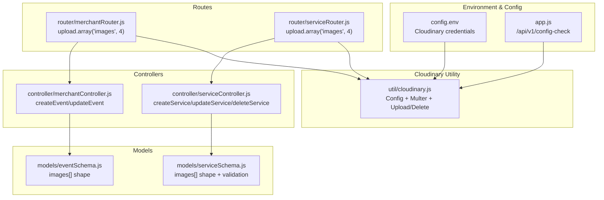
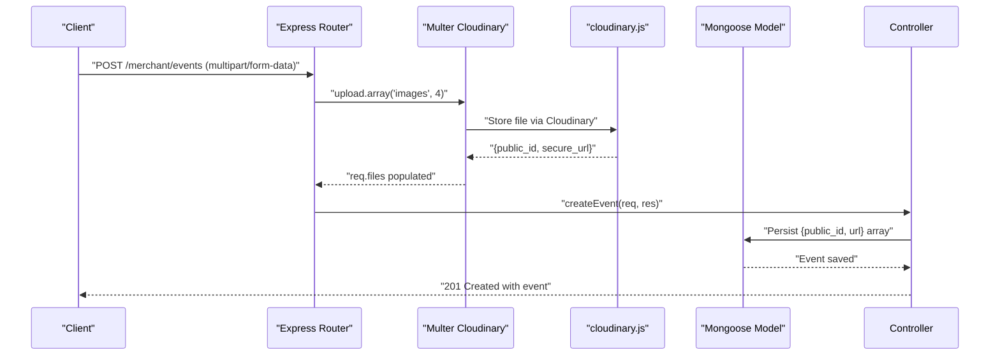
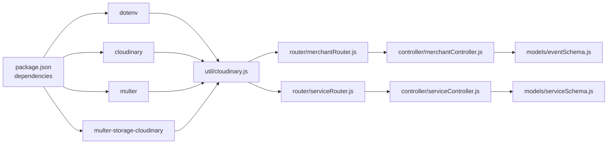

# Cloudinary Integration

<cite>
**Referenced Files in This Document**
- [cloudinary.js](file://backend/util/cloudinary.js)
- [config.env](file://backend/config/config.env)
- [app.js](file://backend/app.js)
- [merchantRouter.js](file://backend/router/merchantRouter.js)
- [serviceRouter.js](file://backend/router/serviceRouter.js)
- [merchantController.js](file://backend/controller/merchantController.js)
- [serviceController.js](file://backend/controller/serviceController.js)
- [eventSchema.js](file://backend/models/eventSchema.js)
- [serviceSchema.js](file://backend/models/serviceSchema.js)
- [package.json](file://backend/package.json)
- [server.js](file://backend/server.js)
</cite>

## Table of Contents
1. [Introduction](#introduction)
2. [Project Structure](#project-structure)
3. [Core Components](#core-components)
4. [Architecture Overview](#architecture-overview)
5. [Detailed Component Analysis](#detailed-component-analysis)
6. [Dependency Analysis](#dependency-analysis)
7. [Performance Considerations](#performance-considerations)
8. [Troubleshooting Guide](#troubleshooting-guide)
9. [Conclusion](#conclusion)

## Introduction
This document explains the Cloudinary integration in the Event Management Platform. It covers configuration setup, environment variable management, connection verification, Multer storage configuration, file upload limits and validation, image transformation parameters, folder organization, CDN delivery, error handling, connection testing, and troubleshooting. It also provides examples of single and multiple image uploads, image deletion, and best practices for cloud storage management.

## Project Structure
Cloudinary integration spans several backend modules:
- Environment configuration and Cloudinary setup
- Express route configuration with Multer Cloudinary storage
- Controllers orchestrating image upload, update, and deletion
- Mongoose models defining image schemas and validation rules
- Application initialization and health checks

**Diagram sources**
- [config.env:32-35](file://backend/config/config.env#L32-L35)
- [app.js:53-62](file://backend/app.js#L53-L62)
- [cloudinary.js:8-58](file://backend/util/cloudinary.js#L8-L58)
- [merchantRouter.js:9-10](file://backend/router/merchantRouter.js#L9-L10)
- [serviceRouter.js:27-39](file://backend/router/serviceRouter.js#L27-L39)
- [merchantController.js:5-109](file://backend/controller/merchantController.js#L5-L109)
- [serviceController.js:148-232](file://backend/controller/serviceController.js#L148-L232)
- [eventSchema.js:10-15](file://backend/models/eventSchema.js#L10-L15)
- [serviceSchema.js:57-65](file://backend/models/serviceSchema.js#L57-L65)

**Section sources**
- [config.env:32-35](file://backend/config/config.env#L32-L35)
- [app.js:53-62](file://backend/app.js#L53-L62)
- [cloudinary.js:8-58](file://backend/util/cloudinary.js#L8-L58)
- [merchantRouter.js:9-10](file://backend/router/merchantRouter.js#L9-L10)
- [serviceRouter.js:27-39](file://backend/router/serviceRouter.js#L27-L39)
- [merchantController.js:5-109](file://backend/controller/merchantController.js#L5-L109)
- [serviceController.js:148-232](file://backend/controller/serviceController.js#L148-L232)
- [eventSchema.js:10-15](file://backend/models/eventSchema.js#L10-L15)
- [serviceSchema.js:57-65](file://backend/models/serviceSchema.js#L57-L65)

## Core Components
- Cloudinary configuration and connection verification
- Multer storage with Cloudinary and validation rules
- Single and multiple image upload helpers
- Image deletion helpers for single and multiple resources
- Route-level upload middleware with field and count limits
- Controllers coordinating upload, update, and deletion flows
- Models enforcing image structure and counts

Key capabilities:
- Folder organization under a dedicated path for service-related assets
- Allowed formats and transformation pipeline applied during upload
- File size limits and MIME-type filtering
- Robust error handling and logging for uploads and deletions
- Health check endpoint exposing Cloudinary credential presence

**Section sources**
- [cloudinary.js:8-112](file://backend/util/cloudinary.js#L8-L112)
- [merchantRouter.js:9-10](file://backend/router/merchantRouter.js#L9-L10)
- [serviceRouter.js:27-39](file://backend/router/serviceRouter.js#L27-L39)
- [merchantController.js:40-51](file://backend/controller/merchantController.js#L40-L51)
- [serviceController.js:148-232](file://backend/controller/serviceController.js#L148-L232)
- [eventSchema.js:10-15](file://backend/models/eventSchema.js#L10-L15)
- [serviceSchema.js:57-65](file://backend/models/serviceSchema.js#L57-L65)

## Architecture Overview
The Cloudinary integration follows a layered pattern:
- Environment variables loaded via dotenv
- Cloudinary SDK configured with credentials
- Multer Cloudinary storage configured with folder, formats, and transformations
- Routes apply upload middleware limiting fields and counts
- Controllers orchestrate uploads and deletions, persisting structured image metadata
- Models enforce image schemas and validation rules

**Diagram sources**
- [merchantRouter.js:9](file://backend/router/merchantRouter.js#L9)
- [cloudinary.js:35-58](file://backend/util/cloudinary.js#L35-L58)
- [merchantController.js:74-87](file://backend/controller/merchantController.js#L74-L87)
- [eventSchema.js:10-15](file://backend/models/eventSchema.js#L10-L15)

## Detailed Component Analysis

### Cloudinary Configuration and Connection Verification
- Credentials are loaded from environment variables and applied to the Cloudinary SDK.
- Console logs indicate whether each credential is present.
- A ping test verifies connectivity and logs success or failure.
- A health check endpoint exposes credential presence to clients.

Best practices:
- Ensure environment variables are set before startup.
- Monitor console logs for connection status.
- Use the health check endpoint for operational monitoring.

**Section sources**
- [cloudinary.js:8-33](file://backend/util/cloudinary.js#L8-L33)
- [app.js:53-62](file://backend/app.js#L53-L62)
- [config.env:32-35](file://backend/config/config.env#L32-L35)

### Multer Storage Configuration for Cloudinary
- Storage configured via CloudinaryStorage with:
  - Target folder for organization
  - Allowed formats for validation
  - Transformation pipeline applied at upload time
- Multer limits:
  - Maximum file size enforced
- File filter ensures only image MIME types are accepted.

Validation rules:
- Only image/* MIME types
- Max file size 5 MB
- Allowed formats: jpg, jpeg, png, webp

**Section sources**
- [cloudinary.js:35-58](file://backend/util/cloudinary.js#L35-L58)

### Image Transformation Parameters and Folder Organization
- Transformation applied: fixed-size constraint with cropping to limit dimensions.
- Folder organization: assets stored under a dedicated folder path.
- CDN delivery: secure URLs returned by Cloudinary.

Optimization tips:
- Choose appropriate transformations for device and screen sizes.
- Use WebP for modern browsers where supported.
- Keep folder names consistent for easier management.

**Section sources**
- [cloudinary.js:36-43](file://backend/util/cloudinary.js#L36-L43)

### Upload Helpers: Single and Multiple Images
- Single image upload helper returns structured metadata.
- Multiple images upload helper processes an array of files concurrently.
- Both helpers encapsulate Cloudinary uploader calls and handle errors.

Usage examples:
- Single image upload: invoke the single upload helper with a local file path.
- Multiple images upload: pass an array of file paths to the multiple upload helper.

**Section sources**
- [cloudinary.js:60-91](file://backend/util/cloudinary.js#L60-L91)

### Deletion Helpers: Single and Multiple Images
- Single resource deletion by public_id.
- Batch deletion by array of public_ids.
- Errors logged but not thrown to prevent blocking updates.

**Section sources**
- [cloudinary.js:93-109](file://backend/util/cloudinary.js#L93-L109)

### Route-Level Upload Middleware
- Merchant routes:
  - Array field named "images" with a maximum of 4 files.
- Service routes:
  - Array field named "images" with a maximum of 4 files.
- Middleware applies file filtering, size limits, and Cloudinary storage.

**Section sources**
- [merchantRouter.js:9-10](file://backend/router/merchantRouter.js#L9-L10)
- [serviceRouter.js:27-39](file://backend/router/serviceRouter.js#L27-L39)

### Controllers: Upload, Update, and Delete Workflows
- Merchant controller:
  - Extracts form fields and validates required fields.
  - Processes uploaded files via Cloudinary and persists image metadata.
  - Supports updating events with optional replacement of images.
- Service controller:
  - Validates presence of images for creation.
  - Supports updating services with selective image retention and addition.
  - Enforces minimum and maximum image counts during updates.
  - Deletes associated Cloudinary resources when removing services.

**Section sources**
- [merchantController.js:5-109](file://backend/controller/merchantController.js#L5-L109)
- [serviceController.js:148-232](file://backend/controller/serviceController.js#L148-L232)

### Models: Image Schema and Validation
- Event model:
  - Images array containing public_id and url.
- Service model:
  - Images array with embedded schema and validation ensuring 1–4 images.

**Section sources**
- [eventSchema.js:10-15](file://backend/models/eventSchema.js#L10-L15)
- [serviceSchema.js:57-65](file://backend/models/serviceSchema.js#L57-L65)

### Example Workflows

#### Single Image Upload
- Use the single upload helper with a local file path.
- Store returned metadata (public_id, secure_url) in the model.

Reference path:
- [cloudinary.js:60-73](file://backend/util/cloudinary.js#L60-L73)

#### Multiple Image Upload
- Use the multiple upload helper with an array of local file paths.
- Persist the resulting array of image metadata.

Reference path:
- [cloudinary.js:75-91](file://backend/util/cloudinary.js#L75-L91)

#### Image Deletion
- Delete a single image by public_id.
- Delete multiple images by passing an array of public_ids.

Reference path:
- [cloudinary.js:93-109](file://backend/util/cloudinary.js#L93-L109)

## Dependency Analysis
Cloudinary integration depends on:
- dotenv for environment loading
- cloudinary SDK for configuration and uploads/deletes
- multer-storage-cloudinary for bridging Multer and Cloudinary
- Express routes applying upload middleware
- Controllers invoking upload and delete helpers
- Models validating image arrays

**Diagram sources**
- [package.json:13-24](file://backend/package.json#L13-L24)
- [cloudinary.js:1-4](file://backend/util/cloudinary.js#L1-L4)
- [merchantRouter.js:5](file://backend/router/merchantRouter.js#L5)
- [serviceRouter.js:13](file://backend/router/serviceRouter.js#L13)
- [merchantController.js:1](file://backend/controller/merchantController.js#L1)
- [serviceController.js:1](file://backend/controller/serviceController.js#L1)
- [eventSchema.js:1](file://backend/models/eventSchema.js#L1)
- [serviceSchema.js:1](file://backend/models/serviceSchema.js#L1)

**Section sources**
- [package.json:13-24](file://backend/package.json#L13-L24)
- [cloudinary.js:1-4](file://backend/util/cloudinary.js#L1-L4)
- [merchantRouter.js:5](file://backend/router/merchantRouter.js#L5)
- [serviceRouter.js:13](file://backend/router/serviceRouter.js#L13)
- [merchantController.js:1](file://backend/controller/merchantController.js#L1)
- [serviceController.js:1](file://backend/controller/serviceController.js#L1)
- [eventSchema.js:1](file://backend/models/eventSchema.js#L1)
- [serviceSchema.js:1](file://backend/models/serviceSchema.js#L1)

## Performance Considerations
- Transformation pipeline reduces asset sizes; choose appropriate dimensions for typical viewing contexts.
- Limit concurrent uploads to avoid overwhelming Cloudinary and the server.
- Use CDN delivery for global performance; ensure HTTPS is enabled.
- Monitor file size limits to balance quality and bandwidth.
- Consider lazy loading and responsive image attributes on the client side.

## Troubleshooting Guide
Common issues and resolutions:
- Missing environment variables:
  - Confirm Cloudinary credentials are present in the environment file and loaded by dotenv.
  - Use the health check endpoint to verify credential presence.
- Connection failures:
  - Review console logs for ping test results.
  - Validate network connectivity and firewall rules.
- Upload failures:
  - Check file size and MIME-type filters.
  - Inspect Cloudinary response and error messages.
- Image count violations:
  - Ensure updates maintain the required number of images per model validation.
- Deletion failures:
  - Verify public_ids and permissions.
  - Check Cloudinary API responses for errors.

Operational checks:
- Environment loading and Cloudinary configuration
- Multer middleware behavior and file filtering
- Controller-level validation and error handling
- Model-level validation for image arrays

**Section sources**
- [app.js:53-62](file://backend/app.js#L53-L62)
- [cloudinary.js:21-33](file://backend/util/cloudinary.js#L21-L33)
- [cloudinary.js:51-57](file://backend/util/cloudinary.js#L51-L57)
- [serviceController.js:202-215](file://backend/controller/serviceController.js#L202-L215)
- [serviceSchema.js:59-64](file://backend/models/serviceSchema.js#L59-L64)

## Conclusion
The Cloudinary integration in the Event Management Platform is centralized in a dedicated utility module, with clear separation of concerns across routes, controllers, and models. It enforces strong validation, supports both single and multiple uploads, and provides robust deletion and error handling. By following the configuration, validation, and best practices outlined here, teams can reliably manage media assets at scale while leveraging Cloudinary’s CDN and transformation capabilities.