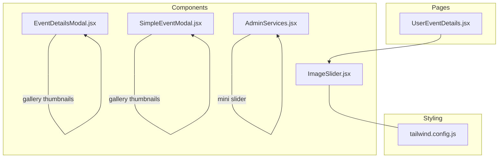
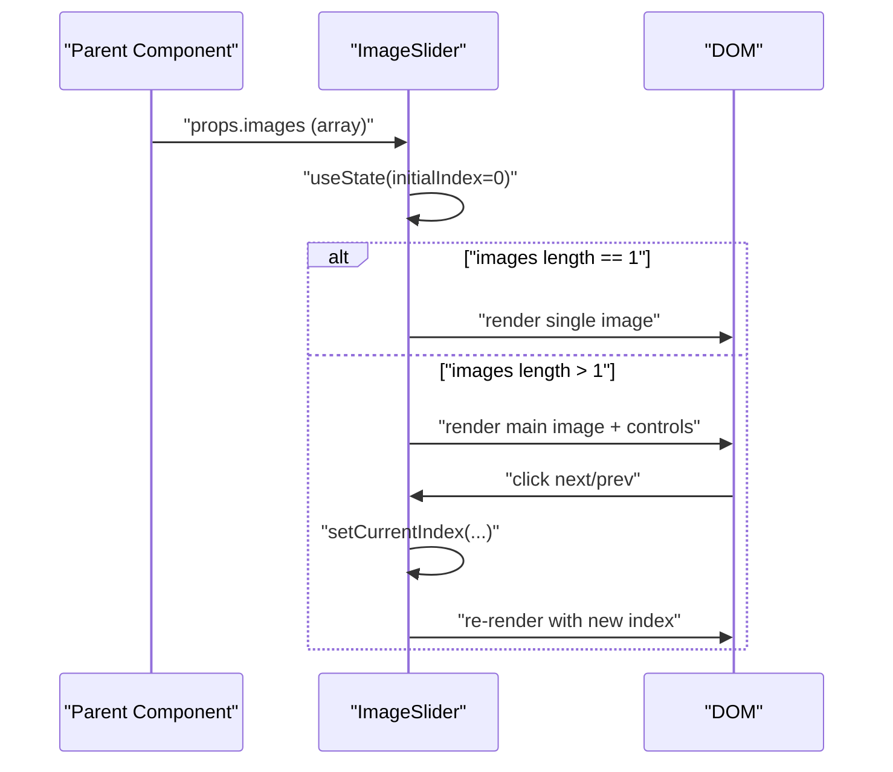
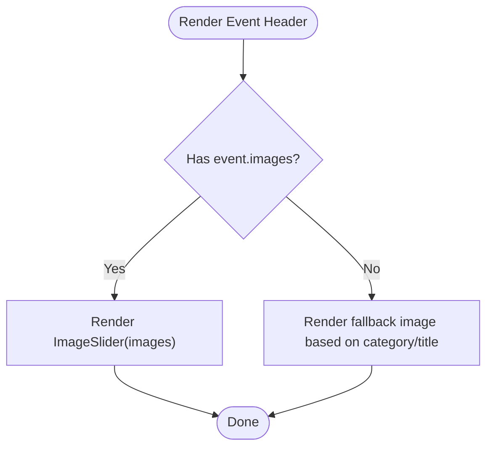
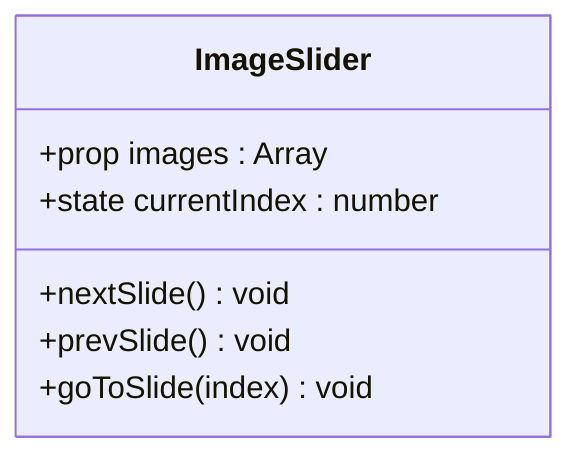
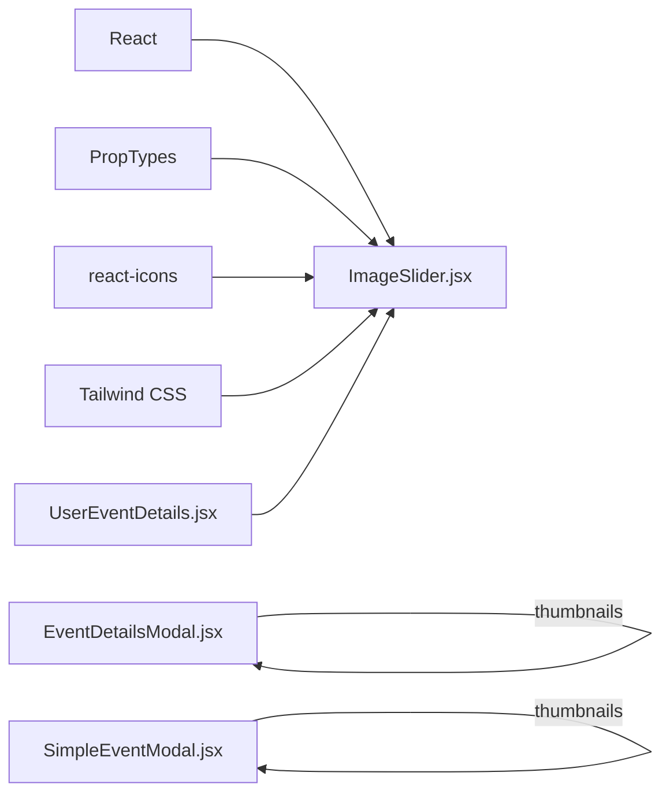

# Image Slider Components

<cite>
**Referenced Files in This Document**
- [ImageSlider.jsx](file://frontend/src/components/ImageSlider.jsx)
- [UserEventDetails.jsx](file://frontend/src/pages/dashboards/UserEventDetails.jsx)
- [EventDetailsModal.jsx](file://frontend/src/components/EventDetailsModal.jsx)
- [SimpleEventModal.jsx](file://frontend/src/components/SimpleEventModal.jsx)
- [AdminServices.jsx](file://frontend/src/pages/dashboards/AdminServices.jsx)
- [tailwind.config.js](file://frontend/tailwind.config.js)
</cite>

## Table of Contents
1. [Introduction](#introduction)
2. [Project Structure](#project-structure)
3. [Core Components](#core-components)
4. [Architecture Overview](#architecture-overview)
5. [Detailed Component Analysis](#detailed-component-analysis)
6. [Dependency Analysis](#dependency-analysis)
7. [Performance Considerations](#performance-considerations)
8. [Troubleshooting Guide](#troubleshooting-guide)
9. [Conclusion](#conclusion)
10. [Appendices](#appendices)

## Introduction
This document describes the Image Slider component used in the Event Management Platform. It explains the component’s props, configuration options, and customization capabilities. It also details the image display logic, navigation controls, auto-play behavior, responsive behavior, integration with media URLs, loading states, error handling for missing images, accessibility features, and performance optimizations for image rendering. Examples of component usage and styling customization with Tailwind CSS are included, along with guidance for mobile responsiveness and touch gestures.

## Project Structure
The Image Slider component is a reusable UI element located under the frontend components directory. It is integrated into page and modal components to render event galleries. The Tailwind CSS configuration defines the design system used for responsive behavior and styling.

**Diagram sources**
- [ImageSlider.jsx](file://frontend/src/components/ImageSlider.jsx)
- [UserEventDetails.jsx](file://frontend/src/pages/dashboards/UserEventDetails.jsx)
- [EventDetailsModal.jsx](file://frontend/src/components/EventDetailsModal.jsx)
- [SimpleEventModal.jsx](file://frontend/src/components/SimpleEventModal.jsx)
- [AdminServices.jsx](file://frontend/src/pages/dashboards/AdminServices.jsx)
- [tailwind.config.js](file://frontend/tailwind.config.js)

**Section sources**
- [ImageSlider.jsx](file://frontend/src/components/ImageSlider.jsx)
- [UserEventDetails.jsx](file://frontend/src/pages/dashboards/UserEventDetails.jsx)
- [EventDetailsModal.jsx](file://frontend/src/components/EventDetailsModal.jsx)
- [SimpleEventModal.jsx](file://frontend/src/components/SimpleEventModal.jsx)
- [AdminServices.jsx](file://frontend/src/pages/dashboards/AdminServices.jsx)
- [tailwind.config.js](file://frontend/tailwind.config.js)

## Core Components
The Image Slider component renders a gallery of images with navigation controls and indicators. It accepts an array of image objects and displays them with smooth transitions. It supports single-image rendering and multi-image carousel behavior.

Key characteristics:
- Props: images (array of objects with url and public_id)
- Navigation: Previous/Next buttons and dot indicators
- Indicators: Dot markers and numeric counter
- Accessibility: aria-label attributes on interactive elements
- Responsive: Uses Tailwind utilities for height and layout

Usage examples:
- Event header gallery in the event details page
- Modal galleries for event previews

**Section sources**
- [ImageSlider.jsx](file://frontend/src/components/ImageSlider.jsx)
- [UserEventDetails.jsx](file://frontend/src/pages/dashboards/UserEventDetails.jsx)

## Architecture Overview
The Image Slider is a pure functional component that manages internal state for the current slide index. It receives image metadata from parent components and renders the appropriate UI. Parent components pass image arrays with url and public_id fields.

**Diagram sources**
- [ImageSlider.jsx](file://frontend/src/components/ImageSlider.jsx)

**Section sources**
- [ImageSlider.jsx](file://frontend/src/components/ImageSlider.jsx)

## Detailed Component Analysis

### ImageSlider Component
The Image Slider component encapsulates:
- State management for the current index
- Navigation handlers for next, previous, and direct slide selection
- Conditional rendering for single vs. multiple images
- Accessibility attributes for screen readers
- Tailwind-based responsive layout

Props:
- images: array of objects with url and public_id fields

Behavior:
- Empty or missing images prop returns null
- Single image: renders a full-size image with object-cover
- Multiple images: renders a carousel with navigation arrows, dot indicators, and a counter

Accessibility:
- Buttons include aria-label attributes
- Alt text for images reflects the current slide index

Responsive behavior:
- Uses Tailwind utilities for height and layout
- Group hover effects reveal navigation controls

Customization:
- Styling via Tailwind classes on container, buttons, and indicators
- No built-in auto-play; navigation is manual

Integration points:
- Used in UserEventDetails for the hero gallery
- Used in modals for thumbnail previews

**Section sources**
- [ImageSlider.jsx](file://frontend/src/components/ImageSlider.jsx)
- [UserEventDetails.jsx](file://frontend/src/pages/dashboards/UserEventDetails.jsx)

### Integration Examples

#### Event Details Page Integration
The event details page conditionally renders the Image Slider when event images are present, otherwise falls back to a category-based placeholder image.

**Diagram sources**
- [UserEventDetails.jsx](file://frontend/src/pages/dashboards/UserEventDetails.jsx)

**Section sources**
- [UserEventDetails.jsx](file://frontend/src/pages/dashboards/UserEventDetails.jsx)

#### Modal Integrations
- EventDetailsModal: Displays a horizontal scroll of image thumbnails derived from event.images.
- SimpleEventModal: Renders a horizontal scroll of image thumbnails from selectedEvent.images.

These modals do not use the main Image Slider component but demonstrate how images are presented in preview contexts.

**Section sources**
- [EventDetailsModal.jsx](file://frontend/src/components/EventDetailsModal.jsx)
- [SimpleEventModal.jsx](file://frontend/src/components/SimpleEventModal.jsx)

#### Admin Services Mini Slider
The Admin Services page defines a compact mini-slider tailored for admin workflows. While distinct from the main Image Slider, it demonstrates an alternative implementation pattern for image carousels within the application.

**Section sources**
- [AdminServices.jsx](file://frontend/src/pages/dashboards/AdminServices.jsx)

### Component Class Model

**Diagram sources**
- [ImageSlider.jsx](file://frontend/src/components/ImageSlider.jsx)

## Dependency Analysis
The Image Slider depends on:
- React state hooks for managing the current index
- PropTypes for runtime prop validation
- React Icons for navigation glyphs
- Tailwind CSS for styling and responsive behavior

Parent components depend on the Image Slider for rendering event galleries. The Tailwind configuration extends the design system used across the application.

**Diagram sources**
- [ImageSlider.jsx](file://frontend/src/components/ImageSlider.jsx)
- [UserEventDetails.jsx](file://frontend/src/pages/dashboards/UserEventDetails.jsx)
- [EventDetailsModal.jsx](file://frontend/src/components/EventDetailsModal.jsx)
- [SimpleEventModal.jsx](file://frontend/src/components/SimpleEventModal.jsx)
- [tailwind.config.js](file://frontend/tailwind.config.js)

**Section sources**
- [ImageSlider.jsx](file://frontend/src/components/ImageSlider.jsx)
- [UserEventDetails.jsx](file://frontend/src/pages/dashboards/UserEventDetails.jsx)
- [EventDetailsModal.jsx](file://frontend/src/components/EventDetailsModal.jsx)
- [SimpleEventModal.jsx](file://frontend/src/components/SimpleEventModal.jsx)
- [tailwind.config.js](file://frontend/tailwind.config.js)

## Performance Considerations
- Rendering strategy: The component renders a single visible image at a time, minimizing DOM overhead.
- Transition: A short transition duration is applied to image changes for smoothness without heavy animations.
- Lazy loading: Not implemented in the component; consider adding loading="lazy" and placeholder strategies for large galleries.
- Image sizing: object-cover ensures consistent aspect ratios; ensure backend provides appropriately sized images to reduce bandwidth.
- Accessibility: aria-labels improve usability; ensure alt text remains descriptive for SEO and screen readers.
- Mobile: Navigation controls are revealed on hover; consider adding keyboard navigation and touch-friendly hit targets.

[No sources needed since this section provides general guidance]

## Troubleshooting Guide
Common issues and resolutions:
- Missing images prop: The component returns null when images are absent or empty. Ensure parent components guard against this case.
- Broken image URLs: If url is invalid, the browser will show a broken image icon. Validate URLs from the backend or provide fallbacks.
- Accessibility: Confirm aria-labels are present on interactive elements. The component includes aria-labels for navigation buttons.
- Responsive layout: If layout breaks on small screens, verify Tailwind utilities and container heights. The component relies on parent containers for height.

**Section sources**
- [ImageSlider.jsx](file://frontend/src/components/ImageSlider.jsx)

## Conclusion
The Image Slider component provides a clean, accessible, and responsive solution for displaying event galleries. It integrates seamlessly with the event details page and supports both single-image and carousel modes. With minimal configuration, it leverages Tailwind CSS for styling and React for state management. For production deployments, consider adding lazy loading, improved error handling for missing images, and optional auto-play functionality.

[No sources needed since this section summarizes without analyzing specific files]

## Appendices

### Props Reference
- images: Array of image objects
  - url: string, required
  - public_id: string, required

Validation: PropTypes enforces the shape of each image object.

**Section sources**
- [ImageSlider.jsx](file://frontend/src/components/ImageSlider.jsx)

### Styling Customization with Tailwind CSS
- Container: Adjust height and layout via parent containers; the component uses relative height classes.
- Navigation arrows: Customize button styles, colors, and hover states using Tailwind utilities.
- Dots indicator: Modify dot sizes, spacing, and active state styling.
- Counter: Style the numeric counter with background and typography utilities.
- Responsive breakpoints: Use Tailwind’s responsive modifiers to adjust behavior on different screen sizes.

**Section sources**
- [ImageSlider.jsx](file://frontend/src/components/ImageSlider.jsx)
- [tailwind.config.js](file://frontend/tailwind.config.js)

### Accessibility Features
- Buttons include aria-label attributes for screen readers.
- Descriptive alt text for images indicates the current slide index.
- Ensure parent containers provide sufficient context for image content.

**Section sources**
- [ImageSlider.jsx](file://frontend/src/components/ImageSlider.jsx)

### Mobile Responsiveness and Touch Gestures
- Current behavior: Navigation controls appear on hover; no swipe gestures are implemented.
- Recommendations:
  - Add touch-friendly hit areas for navigation buttons.
  - Implement swipe gestures using pointer events or a lightweight gesture library.
  - Consider keyboard navigation (arrow keys) for desktop accessibility.
  - Test tap targets on small screens to meet accessibility guidelines.

[No sources needed since this section provides general guidance]