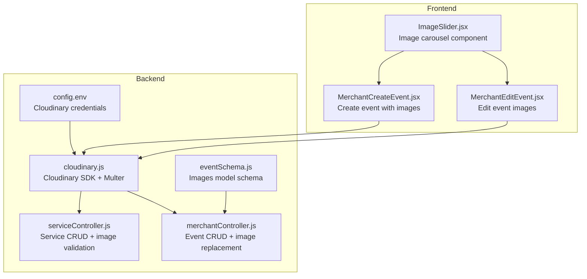
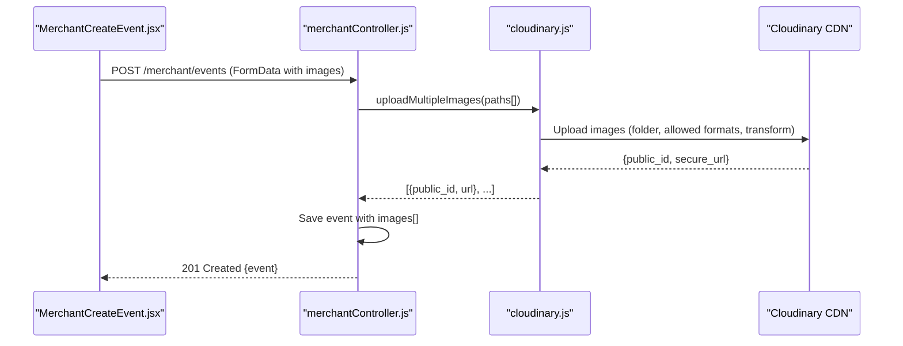
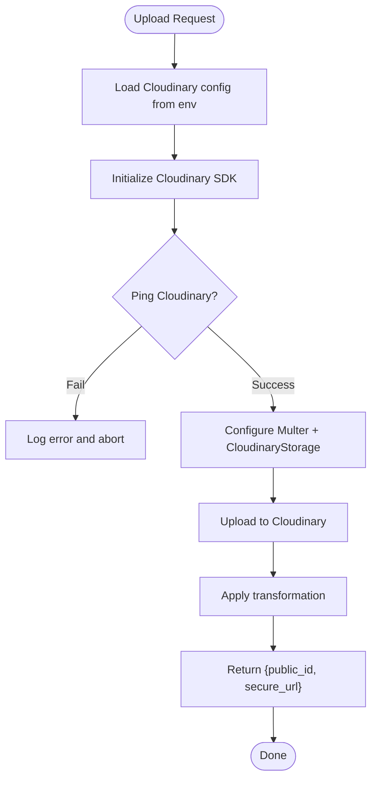
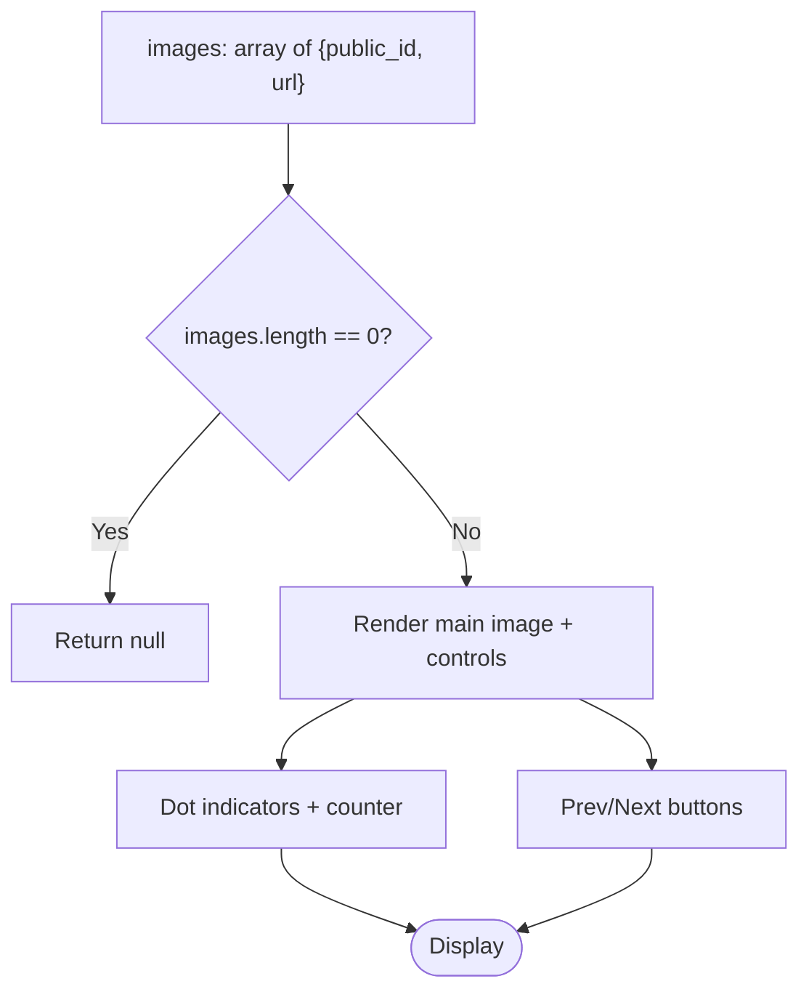
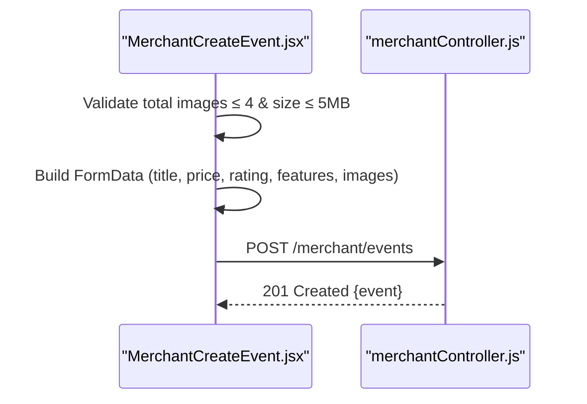
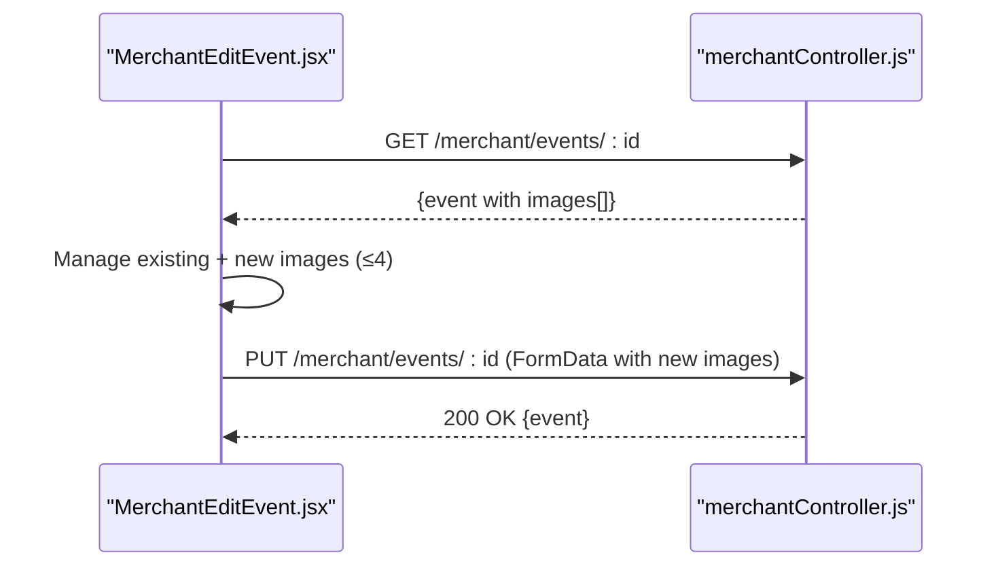
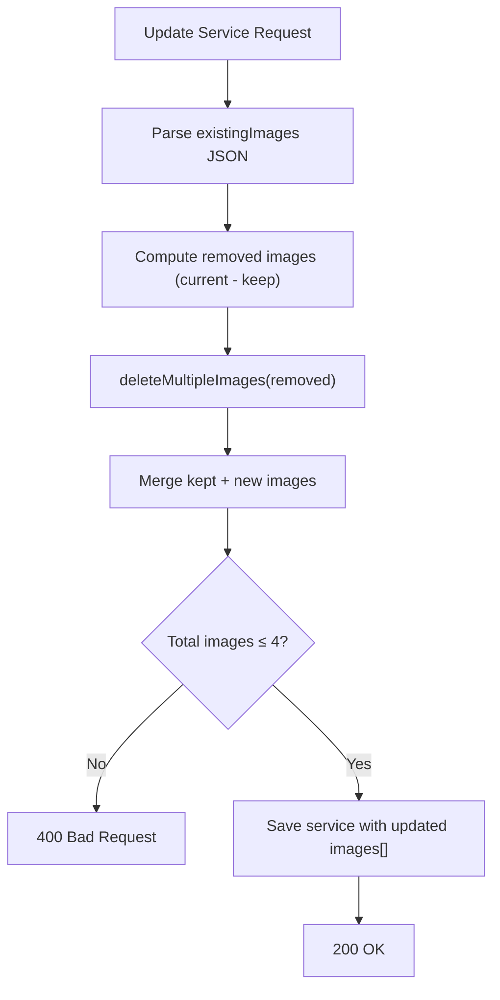
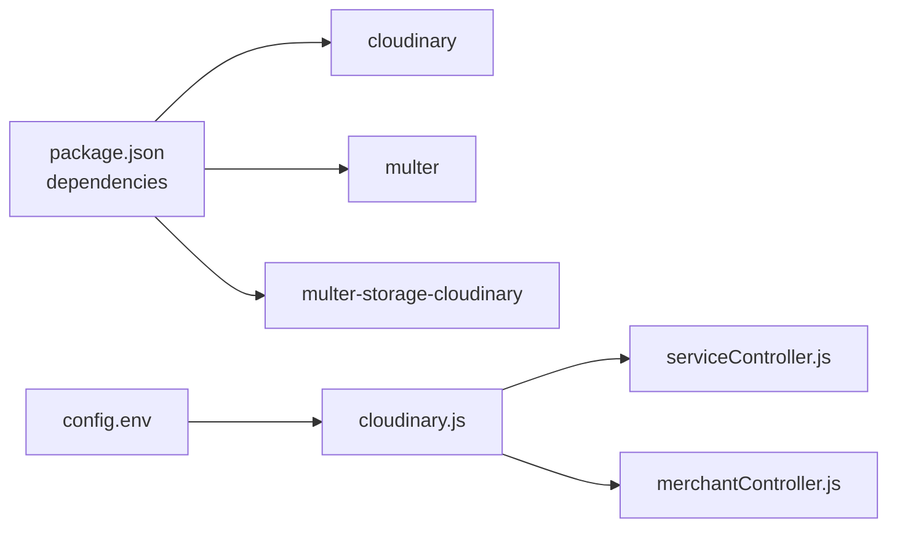

# Image and Media Management

<cite>
**Referenced Files in This Document**
- [cloudinary.js](file://backend/util/cloudinary.js)
- [config.env](file://backend/config/config.env)
- [package.json](file://backend/package.json)
- [serviceController.js](file://backend/controller/serviceController.js)
- [merchantController.js](file://backend/controller/merchantController.js)
- [eventSchema.js](file://backend/models/eventSchema.js)
- [ImageSlider.jsx](file://frontend/src/components/ImageSlider.jsx)
- [MerchantCreateEvent.jsx](file://frontend/src/pages/dashboards/MerchantCreateEvent.jsx)
- [MerchantEditEvent.jsx](file://frontend/src/pages/dashboards/MerchantEditEvent.jsx)
</cite>

## Table of Contents
1. [Introduction](#introduction)
2. [Project Structure](#project-structure)
3. [Core Components](#core-components)
4. [Architecture Overview](#architecture-overview)
5. [Detailed Component Analysis](#detailed-component-analysis)
6. [Dependency Analysis](#dependency-analysis)
7. [Performance Considerations](#performance-considerations)
8. [Troubleshooting Guide](#troubleshooting-guide)
9. [Conclusion](#conclusion)

## Introduction
This document explains the image and media management system for the Event Management Platform. It covers Cloudinary integration for secure, scalable image storage and optimization, media upload workflows, image transformation and resizing, CDN delivery, and the frontend image slider component. It also documents validation rules, storage management, security considerations, and best practices for handling media assets efficiently and securely.

## Project Structure
The media management system spans both backend and frontend:
- Backend: Cloudinary configuration, upload pipeline via Multer, image deletion, and controllers for services and events.
- Frontend: Image slider component and merchant dashboard forms for creating/editing events with image uploads.

**Diagram sources**
- [config.env:32-35](file://backend/config/config.env#L32-L35)
- [cloudinary.js:1-112](file://backend/util/cloudinary.js#L1-L112)
- [serviceController.js:1-323](file://backend/controller/serviceController.js#L1-L323)
- [merchantController.js:1-199](file://backend/controller/merchantController.js#L1-L199)
- [eventSchema.js:1-23](file://backend/models/eventSchema.js#L1-L23)
- [ImageSlider.jsx:1-102](file://frontend/src/components/ImageSlider.jsx#L1-L102)
- [MerchantCreateEvent.jsx:1-362](file://frontend/src/pages/dashboards/MerchantCreateEvent.jsx#L1-L362)
- [MerchantEditEvent.jsx:1-413](file://frontend/src/pages/dashboards/MerchantEditEvent.jsx#L1-L413)

**Section sources**
- [config.env:32-35](file://backend/config/config.env#L32-L35)
- [cloudinary.js:1-112](file://backend/util/cloudinary.js#L1-L112)
- [serviceController.js:1-323](file://backend/controller/serviceController.js#L1-L323)
- [merchantController.js:1-199](file://backend/controller/merchantController.js#L1-L199)
- [eventSchema.js:1-23](file://backend/models/eventSchema.js#L1-L23)
- [ImageSlider.jsx:1-102](file://frontend/src/components/ImageSlider.jsx#L1-L102)
- [MerchantCreateEvent.jsx:1-362](file://frontend/src/pages/dashboards/MerchantCreateEvent.jsx#L1-L362)
- [MerchantEditEvent.jsx:1-413](file://frontend/src/pages/dashboards/MerchantEditEvent.jsx#L1-L413)

## Core Components
- Cloudinary configuration and upload utilities:
  - Loads credentials from environment variables and initializes the Cloudinary SDK.
  - Provides Multer integration with CloudinaryStorage for direct uploads with transformations.
  - Exposes helpers to upload single/multiple images and delete images by public_id or batch.
- Controllers:
  - Service controller manages creation, updates, and deletions with strict image validation (minimum/maximum counts).
  - Merchant controller handles event creation and updates with optional image replacement and cleanup.
- Models:
  - Event schema stores an array of image objects with public_id and url.
- Frontend components:
  - ImageSlider displays multiple images with navigation and indicators.
  - Merchant forms manage image selection, preview, and validation before submission.

**Section sources**
- [cloudinary.js:1-112](file://backend/util/cloudinary.js#L1-L112)
- [serviceController.js:148-232](file://backend/controller/serviceController.js#L148-L232)
- [merchantController.js:5-109](file://backend/controller/merchantController.js#L5-L109)
- [eventSchema.js:10-15](file://backend/models/eventSchema.js#L10-L15)
- [ImageSlider.jsx:5-102](file://frontend/src/components/ImageSlider.jsx#L5-L102)
- [MerchantCreateEvent.jsx:31-60](file://frontend/src/pages/dashboards/MerchantCreateEvent.jsx#L31-L60)
- [MerchantEditEvent.jsx:62-92](file://frontend/src/pages/dashboards/MerchantEditEvent.jsx#L62-L92)

## Architecture Overview
The platform integrates Cloudinary for image storage and optimization. The backend validates uploads, applies transformations, and persists metadata. The frontend renders images and provides interactive sliders.

**Diagram sources**
- [MerchantCreateEvent.jsx:117-139](file://frontend/src/pages/dashboards/MerchantCreateEvent.jsx#L117-L139)
- [merchantController.js:40-87](file://backend/controller/merchantController.js#L40-L87)
- [cloudinary.js:36-58](file://backend/util/cloudinary.js#L36-L58)
- [cloudinary.js:76-91](file://backend/util/cloudinary.js#L76-L91)

## Detailed Component Analysis

### Cloudinary Integration and Upload Pipeline
- Configuration:
  - Loads Cloudinary credentials from environment variables and logs configuration status.
  - Tests connectivity via ping and reports success or failure.
- Transformation and storage:
  - Uses CloudinaryStorage with folder targeting and allowed formats.
  - Applies a default transformation (width/height/crop) during upload.
- Upload helpers:
  - Single and multiple image upload helpers return structured image metadata.
- Deletion:
  - Supports deleting single and multiple resources by public_id.

**Diagram sources**
- [cloudinary.js:1-33](file://backend/util/cloudinary.js#L1-L33)
- [cloudinary.js:36-58](file://backend/util/cloudinary.js#L36-L58)
- [cloudinary.js:76-91](file://backend/util/cloudinary.js#L76-L91)

**Section sources**
- [cloudinary.js:1-112](file://backend/util/cloudinary.js#L1-L112)
- [config.env:32-35](file://backend/config/config.env#L32-L35)

### Image Slider Component (Frontend)
- Displays a single image or a carousel with navigation arrows, dot indicators, and a counter.
- Accepts an array of image objects with public_id and url.
- Handles single-image fallback and hover-based controls.

**Diagram sources**
- [ImageSlider.jsx:5-102](file://frontend/src/components/ImageSlider.jsx#L5-L102)

**Section sources**
- [ImageSlider.jsx:5-102](file://frontend/src/components/ImageSlider.jsx#L5-L102)

### Merchant Event Creation and Image Upload (Frontend)
- Validates total images (max 4) and per-file size (max 5MB).
- Builds FormData and sends images to backend endpoint.
- Shows previews and allows removal before submission.

**Diagram sources**
- [MerchantCreateEvent.jsx:31-60](file://frontend/src/pages/dashboards/MerchantCreateEvent.jsx#L31-L60)
- [MerchantCreateEvent.jsx:117-139](file://frontend/src/pages/dashboards/MerchantCreateEvent.jsx#L117-L139)
- [merchantController.js:5-109](file://backend/controller/merchantController.js#L5-L109)

**Section sources**
- [MerchantCreateEvent.jsx:31-60](file://frontend/src/pages/dashboards/MerchantCreateEvent.jsx#L31-L60)
- [MerchantCreateEvent.jsx:117-139](file://frontend/src/pages/dashboards/MerchantCreateEvent.jsx#L117-L139)
- [merchantController.js:5-109](file://backend/controller/merchantController.js#L5-L109)

### Merchant Event Update and Image Replacement (Frontend)
- Loads existing images and allows adding/removing new images while maintaining the 4-image cap.
- Submits only new images; existing images are preserved server-side.

**Diagram sources**
- [MerchantEditEvent.jsx:29-55](file://frontend/src/pages/dashboards/MerchantEditEvent.jsx#L29-L55)
- [MerchantEditEvent.jsx:127-180](file://frontend/src/pages/dashboards/MerchantEditEvent.jsx#L127-L180)
- [merchantController.js:111-158](file://backend/controller/merchantController.js#L111-L158)

**Section sources**
- [MerchantEditEvent.jsx:29-55](file://frontend/src/pages/dashboards/MerchantEditEvent.jsx#L29-L55)
- [MerchantEditEvent.jsx:127-180](file://frontend/src/pages/dashboards/MerchantEditEvent.jsx#L127-L180)
- [merchantController.js:111-158](file://backend/controller/merchantController.js#L111-L158)

### Service Management and Image Validation (Backend)
- Enforces minimum (at least one image) and maximum (no more than four images) constraints.
- Validates that uploads succeeded and rejects malformed requests.
- Supports selective deletion of removed images when updating services.

**Diagram sources**
- [serviceController.js:148-232](file://backend/controller/serviceController.js#L148-L232)
- [cloudinary.js:103-109](file://backend/util/cloudinary.js#L103-L109)

**Section sources**
- [serviceController.js:22-38](file://backend/controller/serviceController.js#L22-L38)
- [serviceController.js:202-215](file://backend/controller/serviceController.js#L202-L215)
- [serviceController.js:180-188](file://backend/controller/serviceController.js#L180-L188)

### Data Model for Images
- Images stored as an array of objects containing public_id and url.
- Required fields ensure integrity and consistent rendering.

**Diagram sources**
- [eventSchema.js:10-15](file://backend/models/eventSchema.js#L10-L15)

**Section sources**
- [eventSchema.js:10-15](file://backend/models/eventSchema.js#L10-L15)

## Dependency Analysis
- Backend dependencies:
  - Cloudinary SDK and Multer integration for uploads.
  - Environment-driven configuration for Cloudinary credentials.
- Frontend dependencies:
  - React components for image handling and slider UI.
  - Axios for HTTP requests to backend endpoints.

**Diagram sources**
- [package.json:13-24](file://backend/package.json#L13-L24)
- [config.env:32-35](file://backend/config/config.env#L32-L35)
- [cloudinary.js:1-112](file://backend/util/cloudinary.js#L1-L112)
- [serviceController.js:1-323](file://backend/controller/serviceController.js#L1-L323)
- [merchantController.js:1-199](file://backend/controller/merchantController.js#L1-L199)

**Section sources**
- [package.json:13-24](file://backend/package.json#L13-L24)
- [config.env:32-35](file://backend/config/config.env#L32-L35)
- [cloudinary.js:1-112](file://backend/util/cloudinary.js#L1-L112)

## Performance Considerations
- Image transformation at upload reduces payload sizes and ensures consistent presentation.
- CDN delivery offloads bandwidth and improves global latency.
- Limiting file size and total images per event reduces processing overhead and storage costs.
- Batch deletion of removed images keeps storage tidy and avoids orphaned assets.

## Troubleshooting Guide
- Cloudinary connectivity:
  - Verify environment variables are present and ping succeeds at startup.
  - Check API key and secret correctness.
- Upload failures:
  - Ensure allowed formats and size limits are respected.
  - Confirm that Multer uploads produced file metadata before saving to database.
- Image validation errors:
  - Minimum/maximum image constraints enforced on update.
  - Total images exceeding the cap will be rejected.
- Deletion issues:
  - Use batch deletion for multiple images to avoid partial cleanup.

**Section sources**
- [cloudinary.js:16-33](file://backend/util/cloudinary.js#L16-L33)
- [cloudinary.js:51-57](file://backend/util/cloudinary.js#L51-L57)
- [serviceController.js:202-215](file://backend/controller/serviceController.js#L202-L215)
- [merchantController.js:140-151](file://backend/controller/merchantController.js#L140-L151)

## Conclusion
The Event Management Platform implements a robust, scalable image and media management system centered on Cloudinary. It enforces strong validation, leverages CDN delivery, and provides intuitive frontend components for merchants to manage event imagery. By combining backend safeguards with frontend UX, the system balances performance, reliability, and usability.