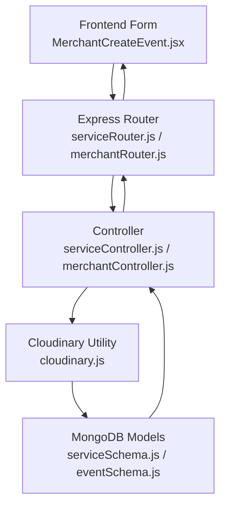
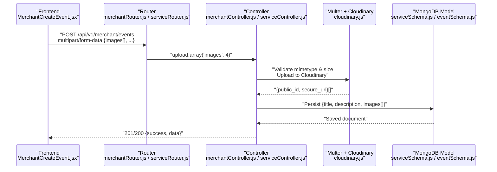
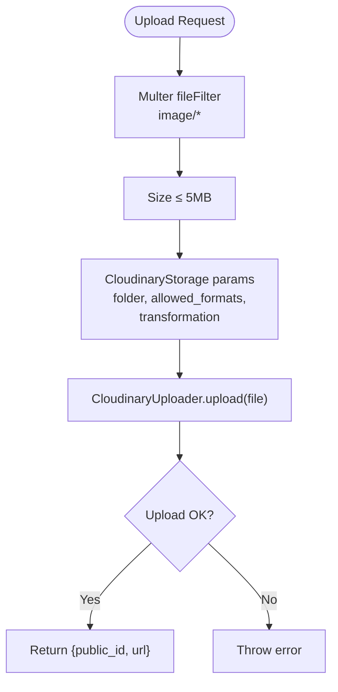
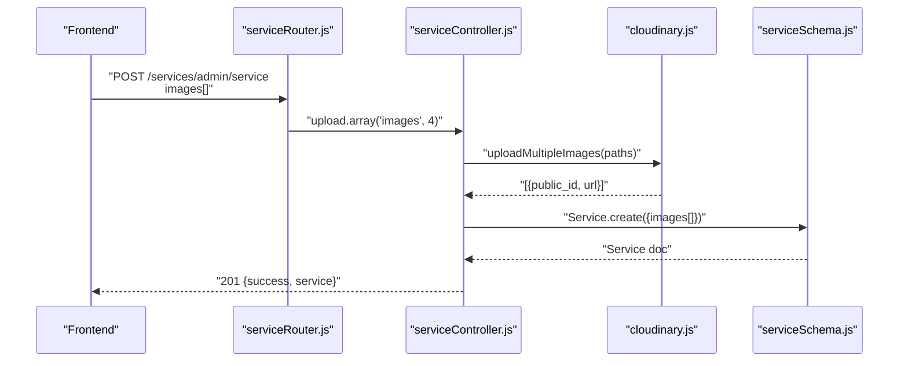
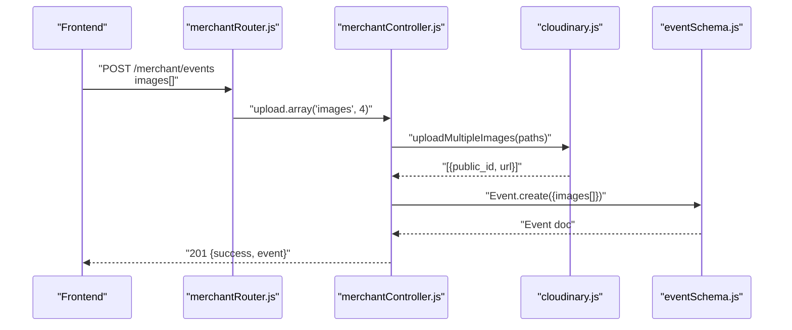
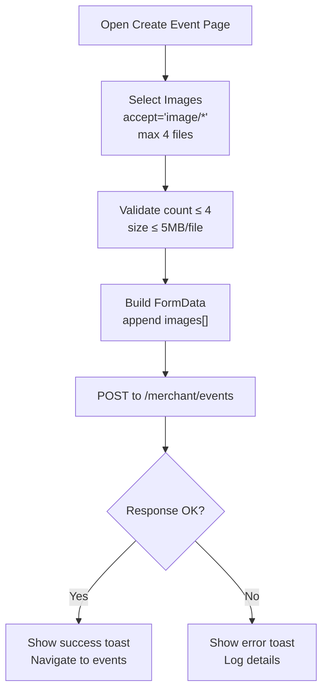
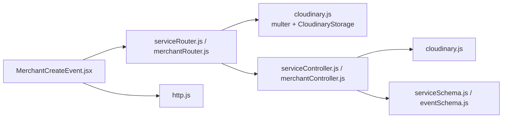

# Media Upload Processes

<cite>
**Referenced Files in This Document**
- [cloudinary.js](file://backend/util/cloudinary.js)
- [serviceRouter.js](file://backend/router/serviceRouter.js)
- [serviceController.js](file://backend/controller/serviceController.js)
- [serviceSchema.js](file://backend/models/serviceSchema.js)
- [merchantRouter.js](file://backend/router/merchantRouter.js)
- [merchantController.js](file://backend/controller/merchantController.js)
- [eventSchema.js](file://backend/models/eventSchema.js)
- [app.js](file://backend/app.js)
- [MerchantCreateEvent.jsx](file://frontend/src/pages/dashboards/MerchantCreateEvent.jsx)
- [http.js](file://frontend/src/lib/http.js)
</cite>

## Table of Contents
1. [Introduction](#introduction)
2. [Project Structure](#project-structure)
3. [Core Components](#core-components)
4. [Architecture Overview](#architecture-overview)
5. [Detailed Component Analysis](#detailed-component-analysis)
6. [Dependency Analysis](#dependency-analysis)
7. [Performance Considerations](#performance-considerations)
8. [Troubleshooting Guide](#troubleshooting-guide)
9. [Conclusion](#conclusion)

## Introduction
This document explains the media upload processes in the Event Management Platform, covering the end-to-end workflow from frontend to backend, validation rules, size/format restrictions, temporary storage handling via Multer, permanent storage via Cloudinary, and error handling patterns. It documents both single and multiple file scenarios for services and events, and outlines security considerations and best practices for large media files.

## Project Structure
The media upload pipeline spans three layers:
- Frontend: Collects files, validates locally, and sends multipart/form-data to the backend.
- Backend: Routes incoming uploads, applies Multer-based validation and Cloudinary integration, and persists structured metadata to MongoDB.
- Cloudinary: Stores images securely and returns public identifiers and URLs.

**Diagram sources**
- [MerchantCreateEvent.jsx:1-362](file://frontend/src/pages/dashboards/MerchantCreateEvent.jsx#L1-L362)
- [serviceRouter.js:1-49](file://backend/router/serviceRouter.js#L1-L49)
- [merchantRouter.js:1-16](file://backend/router/merchantRouter.js#L1-L16)
- [serviceController.js:1-323](file://backend/controller/serviceController.js#L1-L323)
- [merchantController.js:1-199](file://backend/controller/merchantController.js#L1-L199)
- [cloudinary.js:1-112](file://backend/util/cloudinary.js#L1-L112)
- [serviceSchema.js:1-83](file://backend/models/serviceSchema.js#L1-L83)
- [eventSchema.js:1-23](file://backend/models/eventSchema.js#L1-L23)

**Section sources**
- [app.js:1-91](file://backend/app.js#L1-L91)
- [serviceRouter.js:1-49](file://backend/router/serviceRouter.js#L1-L49)
- [merchantRouter.js:1-16](file://backend/router/merchantRouter.js#L1-L16)

## Core Components
- Cloudinary utility encapsulates configuration, validation, and upload/delete operations for single/multiple images.
- Service router defines admin endpoints for creating/updating services with array-based image uploads.
- Service controller enforces field validation, checks for minimum images, formats Cloudinary results, and manages updates/deletes.
- Event router and controller define merchant endpoints for creating/updating events with image arrays and Cloudinary integration.
- Frontend component collects images, validates counts/sizes, and posts multipart/form-data to the backend.

Key validation and limits:
- Allowed formats: jpg, jpeg, png, webp
- Size limit: 5 MB per file
- Maximum images per entity: 4
- Required images: At least 1 for services; optional for events in controller logic

**Section sources**
- [cloudinary.js:35-58](file://backend/util/cloudinary.js#L35-L58)
- [serviceController.js:14-38](file://backend/controller/serviceController.js#L14-L38)
- [serviceController.js:202-215](file://backend/controller/serviceController.js#L202-L215)
- [merchantController.js:40-51](file://backend/controller/merchantController.js#L40-L51)
- [MerchantCreateEvent.jsx:31-60](file://frontend/src/pages/dashboards/MerchantCreateEvent.jsx#L31-L60)

## Architecture Overview
The upload pipeline integrates Multer with Cloudinary and persists structured image metadata to MongoDB. The flow supports both single and multiple file uploads and ensures robust error handling and validation.

**Diagram sources**
- [merchantRouter.js:9-10](file://backend/router/merchantRouter.js#L9-L10)
- [serviceRouter.js:23-39](file://backend/router/serviceRouter.js#L23-L39)
- [cloudinary.js:46-58](file://backend/util/cloudinary.js#L46-L58)
- [merchantController.js:40-87](file://backend/controller/merchantController.js#L40-L87)
- [serviceController.js:22-72](file://backend/controller/serviceController.js#L22-L72)
- [serviceSchema.js:57-65](file://backend/models/serviceSchema.js#L57-L65)
- [eventSchema.js:10-15](file://backend/models/eventSchema.js#L10-L15)

## Detailed Component Analysis

### Cloudinary Utility
Responsibilities:
- Configure Cloudinary credentials and ping health check
- Define allowed formats, transformations, and size limits
- Provide uploadSingleImage, uploadMultipleImages, and delete helpers
- Integrate with Multer via CloudinaryStorage

Validation and limits:
- File filter accepts only image/* MIME types
- File size limit: 5 MB
- Allowed formats: jpg, jpeg, png, webp
- Transformation applied: width 1200, height 800, crop limit

**Diagram sources**
- [cloudinary.js:35-58](file://backend/util/cloudinary.js#L35-L58)
- [cloudinary.js:61-91](file://backend/util/cloudinary.js#L61-L91)

**Section sources**
- [cloudinary.js:1-112](file://backend/util/cloudinary.js#L1-L112)

### Service Upload Pipeline
Endpoints:
- POST /api/v1/services/admin/service (admin): create service with up to 4 images
- PUT /api/v1/services/admin/service/:id (admin): update service with up to 4 images

Controller logic:
- Validate required fields (title, description, category, price)
- Require at least one image for creation
- Reject uploads where Multer/Cloudinary metadata is missing
- Format images as [{public_id, url}] and save to Service model
- Enforce maximum 4 images during updates and require at least 1

**Diagram sources**
- [serviceRouter.js:23-29](file://backend/router/serviceRouter.js#L23-L29)
- [serviceController.js:4-72](file://backend/controller/serviceController.js#L4-L72)
- [cloudinary.js:75-91](file://backend/util/cloudinary.js#L75-L91)
- [serviceSchema.js:57-65](file://backend/models/serviceSchema.js#L57-L65)

**Section sources**
- [serviceRouter.js:23-39](file://backend/router/serviceRouter.js#L23-L39)
- [serviceController.js:4-72](file://backend/controller/serviceController.js#L4-L72)
- [serviceSchema.js:57-65](file://backend/models/serviceSchema.js#L57-L65)

### Event Upload Pipeline
Endpoints:
- POST /api/v1/merchant/events (merchant): create event with images
- PUT /api/v1/merchant/events/:id (merchant): update event images

Controller logic:
- Validate title presence
- Optionally upload images; delete old images on update
- Parse features array from string or JSON
- Persist structured images to Event model

**Diagram sources**
- [merchantRouter.js:9-10](file://backend/router/merchantRouter.js#L9-L10)
- [merchantController.js:5-87](file://backend/controller/merchantController.js#L5-L87)
- [cloudinary.js:75-91](file://backend/util/cloudinary.js#L75-L91)
- [eventSchema.js:10-15](file://backend/models/eventSchema.js#L10-L15)

**Section sources**
- [merchantRouter.js:9-10](file://backend/router/merchantRouter.js#L9-L10)
- [merchantController.js:5-87](file://backend/controller/merchantController.js#L5-L87)
- [eventSchema.js:10-15](file://backend/models/eventSchema.js#L10-L15)

### Frontend Upload Handling
Frontend component:
- Validates maximum 4 images and 5 MB per file
- Builds FormData and appends images under the "images" key
- Sends authenticated POST to backend endpoints
- Handles success/error messaging and navigation

**Diagram sources**
- [MerchantCreateEvent.jsx:31-60](file://frontend/src/pages/dashboards/MerchantCreateEvent.jsx#L31-L60)
- [MerchantCreateEvent.jsx:117-139](file://frontend/src/pages/dashboards/MerchantCreateEvent.jsx#L117-L139)
- [http.js:1-5](file://frontend/src/lib/http.js#L1-L5)

**Section sources**
- [MerchantCreateEvent.jsx:1-362](file://frontend/src/pages/dashboards/MerchantCreateEvent.jsx#L1-L362)
- [http.js:1-5](file://frontend/src/lib/http.js#L1-L5)

## Dependency Analysis
- Router depends on Multer middleware (via cloudinary.js) to enforce validation and transform uploads.
- Controllers depend on Cloudinary utility for upload/delete operations.
- Models define the image schema and enforce count constraints.
- Frontend depends on HTTP utilities and route paths to send uploads.

**Diagram sources**
- [serviceRouter.js:13](file://backend/router/serviceRouter.js#L13)
- [merchantRouter.js:5](file://backend/router/merchantRouter.js#L5)
- [cloudinary.js:46-58](file://backend/util/cloudinary.js#L46-L58)
- [serviceController.js:1-3](file://backend/controller/serviceController.js#L1-L3)
- [merchantController.js:1-3](file://backend/controller/merchantController.js#L1-L3)
- [serviceSchema.js:1-83](file://backend/models/serviceSchema.js#L1-L83)
- [eventSchema.js:1-23](file://backend/models/eventSchema.js#L1-L23)
- [MerchantCreateEvent.jsx:1-362](file://frontend/src/pages/dashboards/MerchantCreateEvent.jsx#L1-L362)
- [http.js:1-5](file://frontend/src/lib/http.js#L1-L5)

**Section sources**
- [serviceRouter.js:1-49](file://backend/router/serviceRouter.js#L1-L49)
- [merchantRouter.js:1-16](file://backend/router/merchantRouter.js#L1-L16)
- [cloudinary.js:1-112](file://backend/util/cloudinary.js#L1-L112)
- [serviceController.js:1-323](file://backend/controller/serviceController.js#L1-L323)
- [merchantController.js:1-199](file://backend/controller/merchantController.js#L1-L199)
- [serviceSchema.js:1-83](file://backend/models/serviceSchema.js#L1-L83)
- [eventSchema.js:1-23](file://backend/models/eventSchema.js#L1-L23)
- [MerchantCreateEvent.jsx:1-362](file://frontend/src/pages/dashboards/MerchantCreateEvent.jsx#L1-L362)
- [http.js:1-5](file://frontend/src/lib/http.js#L1-L5)

## Performance Considerations
- Concurrency: Cloudinary uploadMultipleImages uses Promise.all to upload multiple files concurrently, reducing total latency.
- Transformations: Applied width/height limits reduce payload sizes and improve CDN delivery performance.
- Memory: Multer stores temporary files on disk until uploaded; ensure sufficient disk space and monitor temp directory cleanup.
- Network: For large files, consider chunked uploads or signed direct uploads to Cloudinary to bypass server bandwidth.
- Caching: Serve transformed images from Cloudinary CDN to minimize origin load.

## Troubleshooting Guide
Common issues and resolutions:
- Cloudinary configuration errors: Use the config-check endpoint to verify credentials and connectivity.
- File type/format errors: Ensure images match allowed formats (jpg, jpeg, png, webp) and MIME type starts with image/.
- Size limit exceeded: Validate client-side (≤5MB) and server-side (multer limit) to prevent oversized uploads.
- Missing images on update: Controllers enforce at least one image; ensure clients re-upload or retain existing images.
- Duplicate uploads: Multer+CloudinaryStorage generates unique filenames; avoid manual duplicates by validating client-side selections.
- CORS issues: Confirm frontend origin matches backend CORS configuration.

Operational checks:
- Health endpoint: GET /api/v1/health
- Config check: GET /api/v1/config-check

**Section sources**
- [app.js:49-62](file://backend/app.js#L49-L62)
- [cloudinary.js:21-33](file://backend/util/cloudinary.js#L21-L33)
- [MerchantCreateEvent.jsx:43-46](file://frontend/src/pages/dashboards/MerchantCreateEvent.jsx#L43-L46)
- [cloudinary.js:48-57](file://backend/util/cloudinary.js#L48-L57)

## Conclusion
The platform implements a robust media upload pipeline leveraging Multer and Cloudinary for validation, transformation, and secure storage. Controllers enforce strict validation rules, while models maintain consistent image metadata. The frontend provides user-friendly validation and clear feedback. Following the outlined best practices ensures reliable handling of single and multiple file uploads, optimal performance, and strong security.