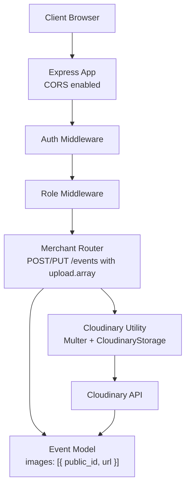
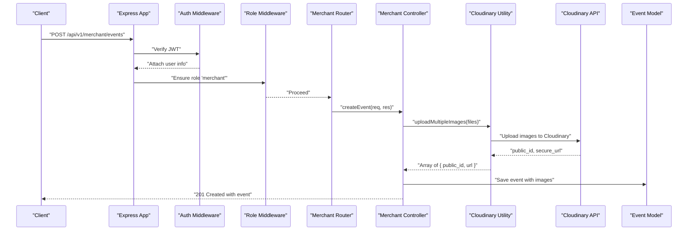
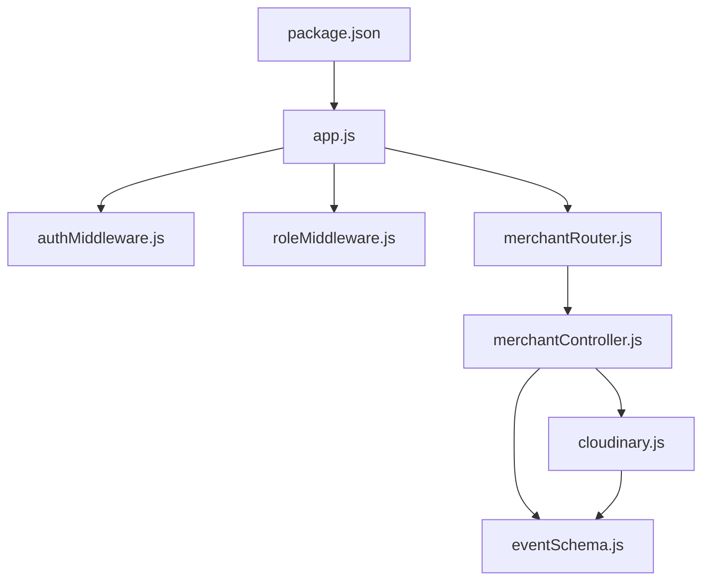

# Media Validation and Security

<cite>
**Referenced Files in This Document**
- [cloudinary.js](file://backend/util/cloudinary.js)
- [merchantController.js](file://backend/controller/merchantController.js)
- [merchantRouter.js](file://backend/router/merchantRouter.js)
- [authMiddleware.js](file://backend/middleware/authMiddleware.js)
- [roleMiddleware.js](file://backend/middleware/roleMiddleware.js)
- [app.js](file://backend/app.js)
- [eventSchema.js](file://backend/models/eventSchema.js)
- [package.json](file://backend/package.json)
- [server.js](file://backend/server.js)
</cite>

## Table of Contents
1. [Introduction](#introduction)
2. [Project Structure](#project-structure)
3. [Core Components](#core-components)
4. [Architecture Overview](#architecture-overview)
5. [Detailed Component Analysis](#detailed-component-analysis)
6. [Dependency Analysis](#dependency-analysis)
7. [Performance Considerations](#performance-considerations)
8. [Troubleshooting Guide](#troubleshooting-guide)
9. [Conclusion](#conclusion)

## Introduction
This document provides comprehensive guidance for media validation and security practices in the Event Management Platform. It focuses on file type validation, size restrictions, malicious file detection, security headers, access control for uploaded media, protection against XSS, the fileFilter implementation, upload limits enforcement, secure storage practices, prevention of unauthorized access, CORS policies, Cloudinary asset security, and best practices for content moderation and automated threat detection.

## Project Structure
The media upload pipeline centers around:
- Express application with CORS enabled
- Authentication and role-based access control middleware
- Merchant routes for event media uploads
- Cloudinary utility for secure storage and transformations
- Event model storing Cloudinary metadata

**Diagram sources**
- [app.js:24-30](file://backend/app.js#L24-L30)
- [authMiddleware.js:3-16](file://backend/middleware/authMiddleware.js#L3-L16)
- [roleMiddleware.js:1-8](file://backend/middleware/roleMiddleware.js#L1-L8)
- [merchantRouter.js:9-10](file://backend/router/merchantRouter.js#L9-L10)
- [cloudinary.js:35-58](file://backend/util/cloudinary.js#L35-L58)
- [eventSchema.js:31-36](file://backend/models/eventSchema.js#L31-L36)

**Section sources**
- [app.js:24-30](file://backend/app.js#L24-L30)
- [authMiddleware.js:3-16](file://backend/middleware/authMiddleware.js#L3-L16)
- [roleMiddleware.js:1-8](file://backend/middleware/roleMiddleware.js#L1-L8)
- [merchantRouter.js:9-10](file://backend/router/merchantRouter.js#L9-L10)
- [cloudinary.js:35-58](file://backend/util/cloudinary.js#L35-L58)
- [eventSchema.js:31-36](file://backend/models/eventSchema.js#L31-L36)

## Core Components
- Cloudinary utility configures secure storage, file filtering, and upload limits:
  - Allowed formats and transformations
  - File size limit enforcement
  - File filter restricting uploads to images
- Merchant routes enforce authentication and role checks and delegate uploads to Cloudinary
- Authentication and role middleware protect endpoints
- Event model stores Cloudinary metadata for each uploaded image

Key validations and protections:
- File type validation via fileFilter
- Size limit enforced by multer limits
- Secure Cloudinary storage and transformations
- Access control via auth and role middleware
- CORS configured at the application level

**Section sources**
- [cloudinary.js:35-58](file://backend/util/cloudinary.js#L35-L58)
- [merchantRouter.js:9-10](file://backend/router/merchantRouter.js#L9-L10)
- [authMiddleware.js:3-16](file://backend/middleware/authMiddleware.js#L3-L16)
- [roleMiddleware.js:1-8](file://backend/middleware/roleMiddleware.js#L1-L8)
- [eventSchema.js:31-36](file://backend/models/eventSchema.js#L31-L36)

## Architecture Overview
The upload flow integrates client requests, middleware, route handlers, and Cloudinary storage.

**Diagram sources**
- [merchantRouter.js:9-10](file://backend/router/merchantRouter.js#L9-L10)
- [merchantController.js:5-98](file://backend/controller/merchantController.js#L5-L98)
- [cloudinary.js:75-91](file://backend/util/cloudinary.js#L75-L91)
- [eventSchema.js:31-36](file://backend/models/eventSchema.js#L31-L36)

## Detailed Component Analysis

### Cloudinary Utility and Upload Pipeline
- Storage configuration:
  - Uses CloudinaryStorage with allowed formats and transformations
  - Applies a default transformation for size limits
- Upload limits:
  - Multer limits enforce a 5 MB file size cap
- File filter:
  - fileFilter restricts uploads to image/* MIME types
- Upload helpers:
  - uploadSingleImage and uploadMultipleImages for programmatic uploads
  - deleteImage and deleteMultipleImages for cleanup

Security and validation outcomes:
- Only images are accepted
- Maximum file size is enforced
- Images are transformed and stored securely by Cloudinary

**Section sources**
- [cloudinary.js:35-58](file://backend/util/cloudinary.js#L35-L58)
- [cloudinary.js:75-91](file://backend/util/cloudinary.js#L75-L91)
- [cloudinary.js:93-109](file://backend/util/cloudinary.js#L93-L109)

### Merchant Routes and Access Control
- Routes:
  - POST /api/v1/merchant/events: upload images for new events
  - PUT /api/v1/merchant/events/:id: replace existing images
- Middleware:
  - auth ensures a valid JWT bearer token
  - ensureRole("merchant") restricts to merchant users
- Upload binding:
  - upload.array('images', 4) binds up to four images

Access control outcomes:
- Non-authenticated users are rejected
- Non-merchant users are blocked
- Only authorized merchants can upload media

**Section sources**
- [merchantRouter.js:9-10](file://backend/router/merchantRouter.js#L9-L10)
- [authMiddleware.js:3-16](file://backend/middleware/authMiddleware.js#L3-L16)
- [roleMiddleware.js:1-8](file://backend/middleware/roleMiddleware.js#L1-L8)

### Merchant Controller: Media Handling and Validation
- Creation:
  - Validates required fields
  - Uploads new images via uploadMultipleImages
  - Stores returned Cloudinary metadata in the Event document
- Updates:
  - Deletes old images from Cloudinary before replacing with new ones
  - Uploads new images and updates the Event record

Validation and safety outcomes:
- Ensures only merchant-owned events are modified
- Prevents unauthorized replacement of images
- Maintains referential integrity by cleaning up old resources

**Section sources**
- [merchantController.js:5-98](file://backend/controller/merchantController.js#L5-L98)
- [merchantController.js:100-147](file://backend/controller/merchantController.js#L100-L147)

### Event Model: Stored Media Metadata
- images array stores:
  - public_id: Cloudinary resource identifier
  - url: Secure Cloudinary URL

Implications:
- Frontend displays Cloudinary URLs
- Backend can manage lifecycle via public_id

**Section sources**
- [eventSchema.js:31-36](file://backend/models/eventSchema.js#L31-L36)

### CORS and Security Headers
- CORS:
  - Origin restricted to FRONTEND_URL
  - Methods allowed: GET, POST, PUT, DELETE
  - Credentials enabled
- Security headers:
  - No explicit CSP, HSTS, or X-Content-Type-Options headers are configured in the current code
- Recommendations:
  - Add Content-Security-Policy, Strict-Transport-Security, X-Content-Type-Options, and X-Frame-Options headers
  - Align CORS with production domain policies and avoid wildcard origins

**Section sources**
- [app.js:24-30](file://backend/app.js#L24-L30)

### Authentication and Authorization
- Auth middleware:
  - Extracts Bearer token from Authorization header
  - Verifies JWT and attaches user info
- Role middleware:
  - Ensures user has required roles

Outcomes:
- Protects upload endpoints from unauthorized access
- Enforces least privilege for merchant actions

**Section sources**
- [authMiddleware.js:3-16](file://backend/middleware/authMiddleware.js#L3-L16)
- [roleMiddleware.js:1-8](file://backend/middleware/roleMiddleware.js#L1-L8)

### File Type Validation, Size Limits, and Malicious File Detection
- File type validation:
  - fileFilter accepts only image/* MIME types
- Size limits:
  - Multer fileSize limit of 5 MB per file
- Malicious file detection:
  - No explicit virus scanning or deep inspection in the current code
  - Cloudinary’s allowed formats and transformations act as a first line of defense

Recommendations:
- Integrate virus scanning (e.g., ClamAV) and deep inspection
- Normalize filenames and sanitize metadata
- Consider SHA-256 hashing for integrity checks

**Section sources**
- [cloudinary.js:51-57](file://backend/util/cloudinary.js#L51-L57)
- [cloudinary.js:48-50](file://backend/util/cloudinary.js#L48-L50)

### Secure Storage Practices and Unauthorized Access Prevention
- Cloudinary storage:
  - Uses signed, secure URLs
  - Applies transformations to normalize images
- Resource cleanup:
  - Old images are deleted during updates
- Access control:
  - Authenticated merchant-only endpoints
  - Ownership checks in controller logic

Recommendations:
- Enforce signed URLs for private assets
- Store minimal metadata on the server
- Rotate secrets and monitor Cloudinary logs

**Section sources**
- [cloudinary.js:75-91](file://backend/util/cloudinary.js#L75-L91)
- [cloudinary.js:93-109](file://backend/util/cloudinary.js#L93-L109)
- [merchantController.js:128-140](file://backend/controller/merchantController.js#L128-L140)

### CORS Policies and Cross-Origin Considerations
- Current configuration:
  - Single origin from environment variable
  - Credentials enabled
- Recommendations:
  - Match production frontend origin precisely
  - Avoid allowing arbitrary origins
  - Audit allowed methods and headers

**Section sources**
- [app.js:24-30](file://backend/app.js#L24-L30)

### Cloudinary Asset Security
- Allowed formats and transformations reduce risk
- Secure URLs prevent tampering
- Consider enabling Cloudinary’s access control features (signed URLs, derived resources)

[No sources needed since this section provides general guidance]

### Media Content Moderation and Automated Threat Detection
- Current state:
  - No built-in moderation or automated threat detection
- Recommended practices:
  - Integrate AI-based content moderation (explicitness, hate symbols)
  - Apply reverse image lookup for duplicates
  - Monitor uploads for suspicious patterns

[No sources needed since this section provides general guidance]

## Dependency Analysis

**Diagram sources**
- [package.json:13-24](file://backend/package.json#L13-L24)
- [app.js:1-91](file://backend/app.js#L1-L91)
- [authMiddleware.js:1-17](file://backend/middleware/authMiddleware.js#L1-L17)
- [roleMiddleware.js:1-9](file://backend/middleware/roleMiddleware.js#L1-L9)
- [merchantRouter.js:1-16](file://backend/router/merchantRouter.js#L1-L16)
- [merchantController.js:1-188](file://backend/controller/merchantController.js#L1-L188)
- [cloudinary.js:1-112](file://backend/util/cloudinary.js#L1-L112)
- [eventSchema.js:1-51](file://backend/models/eventSchema.js#L1-L51)

**Section sources**
- [package.json:13-24](file://backend/package.json#L13-L24)
- [app.js:1-91](file://backend/app.js#L1-L91)
- [merchantController.js:1-188](file://backend/controller/merchantController.js#L1-L188)
- [cloudinary.js:1-112](file://backend/util/cloudinary.js#L1-L112)
- [eventSchema.js:1-51](file://backend/models/eventSchema.js#L1-L51)

## Performance Considerations
- Multer limits and Cloudinary transformations help control resource usage
- Batch uploads are supported; consider optimizing concurrent Cloudinary uploads
- Use CDN-backed Cloudinary URLs for efficient delivery

[No sources needed since this section provides general guidance]

## Troubleshooting Guide
Common issues and resolutions:
- CORS failures:
  - Ensure FRONTEND_URL matches the browser origin
  - Confirm credentials are enabled only when necessary
- Authentication errors:
  - Verify Authorization header format and token validity
- Role-based access denied:
  - Confirm user role is merchant
- Upload errors:
  - Check fileFilter acceptance (must be image/*)
  - Ensure file size under 5 MB
  - Validate Cloudinary configuration and connectivity

**Section sources**
- [app.js:24-30](file://backend/app.js#L24-L30)
- [authMiddleware.js:3-16](file://backend/middleware/authMiddleware.js#L3-L16)
- [roleMiddleware.js:1-8](file://backend/middleware/roleMiddleware.js#L1-L8)
- [cloudinary.js:51-57](file://backend/util/cloudinary.js#L51-L57)
- [cloudinary.js:48-50](file://backend/util/cloudinary.js#L48-L50)

## Conclusion
The platform implements strong foundational controls for media uploads: strict image-only validation, size limits, and secure Cloudinary storage. Access control via JWT and role-based middleware protects endpoints. To further strengthen security, integrate explicit CSP/HSTS headers, implement virus scanning and content moderation, adopt signed Cloudinary URLs for private assets, and refine CORS to match production domains precisely.