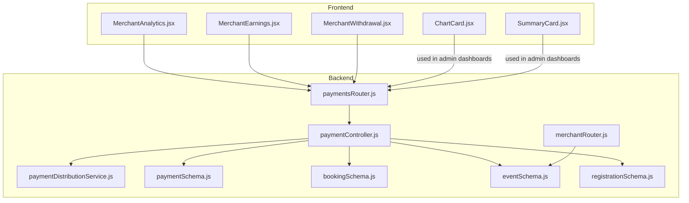
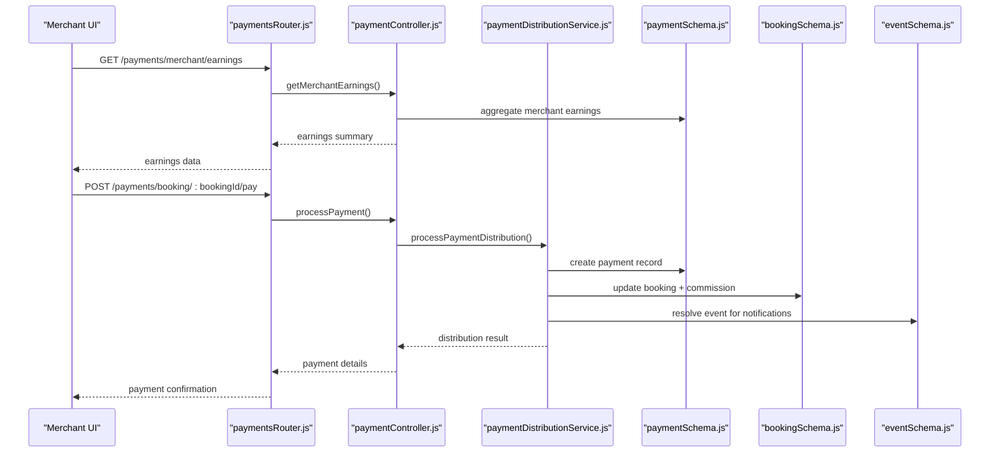
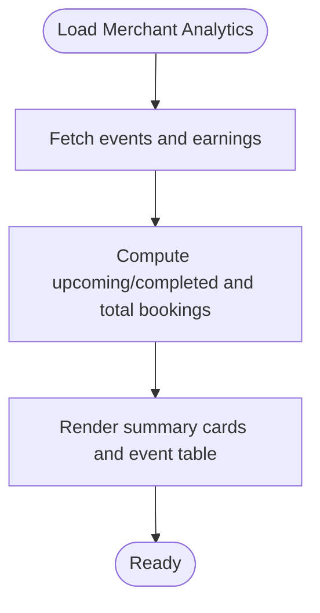
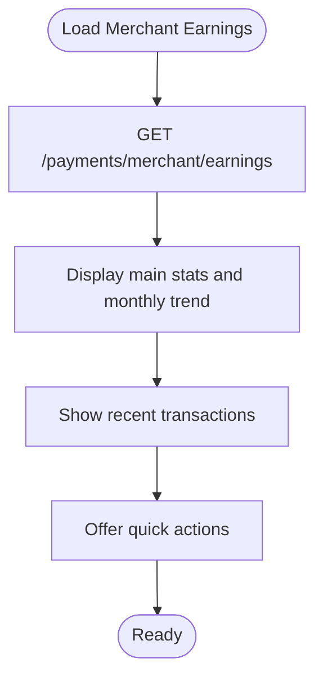
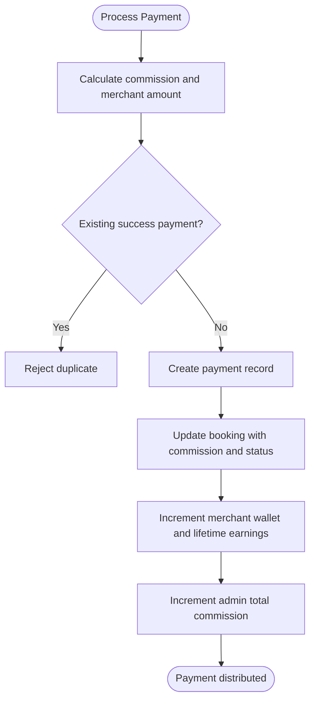
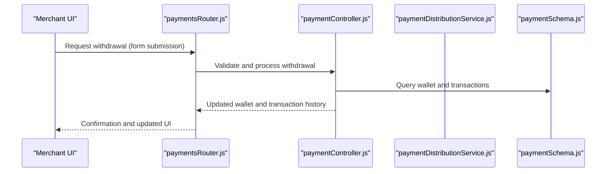
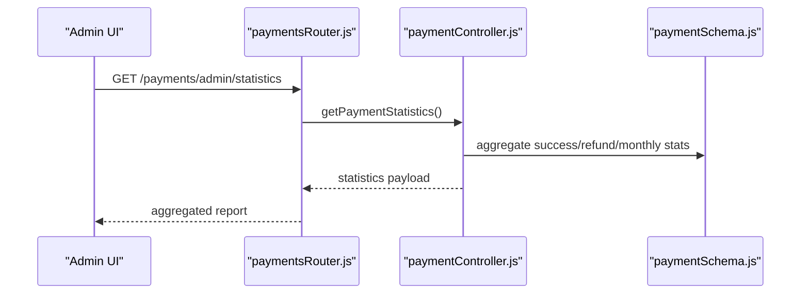
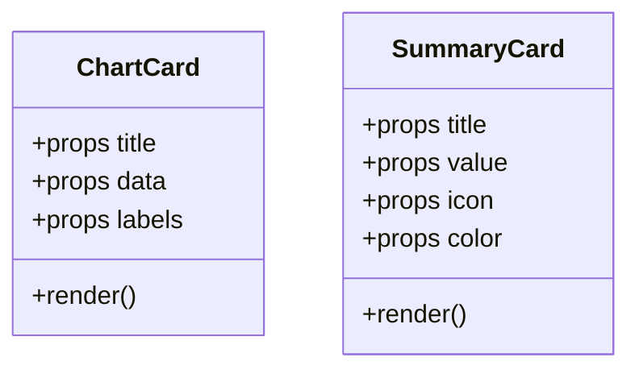
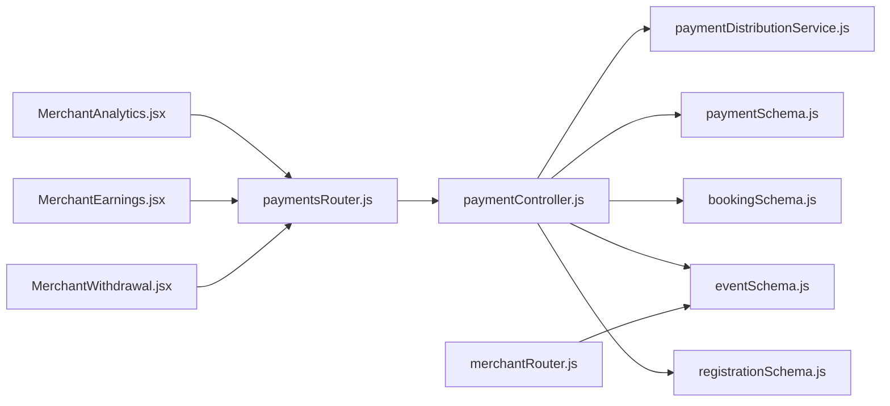

# Analytics and Earnings Tracking

<cite>
**Referenced Files in This Document**
- [MerchantAnalytics.jsx](file://frontend/src/pages/dashboards/MerchantAnalytics.jsx)
- [MerchantEarnings.jsx](file://frontend/src/pages/dashboards/MerchantEarnings.jsx)
- [MerchantWithdrawal.jsx](file://frontend/src/pages/dashboards/MerchantWithdrawal.jsx)
- [paymentController.js](file://backend/controller/paymentController.js)
- [paymentDistributionService.js](file://backend/services/paymentDistributionService.js)
- [paymentSchema.js](file://backend/models/paymentSchema.js)
- [bookingSchema.js](file://backend/models/bookingSchema.js)
- [eventSchema.js](file://backend/models/eventSchema.js)
- [registrationSchema.js](file://backend/models/registrationSchema.js)
- [paymentsRouter.js](file://backend/router/paymentsRouter.js)
- [merchantRouter.js](file://backend/router/merchantRouter.js)
- [ChartCard.jsx](file://frontend/src/components/admin/ChartCard.jsx)
- [SummaryCard.jsx](file://frontend/src/components/admin/SummaryCard.jsx)
- [adminController.js](file://backend/controller/adminController.js)
</cite>

## Table of Contents
1. [Introduction](#introduction)
2. [Project Structure](#project-structure)
3. [Core Components](#core-components)
4. [Architecture Overview](#architecture-overview)
5. [Detailed Component Analysis](#detailed-component-analysis)
6. [Dependency Analysis](#dependency-analysis)
7. [Performance Considerations](#performance-considerations)
8. [Troubleshooting Guide](#troubleshooting-guide)
9. [Conclusion](#conclusion)
10. [Appendices](#appendices)

## Introduction
This document describes the merchant analytics and earnings tracking system implemented in the Event Management System. It covers revenue calculation methods, booking analytics, performance metrics visualization, earnings withdrawal processes, payment tracking, tax documentation features, activity logs, performance reports, export capabilities, data privacy considerations, and dashboard customization options.

## Project Structure
The analytics and earnings tracking spans frontend React dashboards and backend APIs with supporting models and services:
- Frontend dashboards for merchants: analytics overview, earnings/wallet, withdrawals.
- Backend controllers and services for payment processing, commission distribution, refunds, and merchant earnings aggregation.
- MongoDB models for payments, bookings, events, and registrations.
- Routing exposing endpoints for payments, merchant earnings, and admin reports.

**Diagram sources**
- [MerchantAnalytics.jsx](file://frontend/src/pages/dashboards/MerchantAnalytics.jsx)
- [MerchantEarnings.jsx](file://frontend/src/pages/dashboards/MerchantEarnings.jsx)
- [MerchantWithdrawal.jsx](file://frontend/src/pages/dashboards/MerchantWithdrawal.jsx)
- [paymentsRouter.js](file://backend/router/paymentsRouter.js)
- [merchantRouter.js](file://backend/router/merchantRouter.js)
- [paymentController.js](file://backend/controller/paymentController.js)
- [paymentDistributionService.js](file://backend/services/paymentDistributionService.js)
- [paymentSchema.js](file://backend/models/paymentSchema.js)
- [bookingSchema.js](file://backend/models/bookingSchema.js)
- [eventSchema.js](file://backend/models/eventSchema.js)
- [registrationSchema.js](file://backend/models/registrationSchema.js)
- [ChartCard.jsx](file://frontend/src/components/admin/ChartCard.jsx)
- [SummaryCard.jsx](file://frontend/src/components/admin/SummaryCard.jsx)

**Section sources**
- [MerchantAnalytics.jsx](file://frontend/src/pages/dashboards/MerchantAnalytics.jsx)
- [MerchantEarnings.jsx](file://frontend/src/pages/dashboards/MerchantEarnings.jsx)
- [MerchantWithdrawal.jsx](file://frontend/src/pages/dashboards/MerchantWithdrawal.jsx)
- [paymentsRouter.js](file://backend/router/paymentsRouter.js)
- [merchantRouter.js](file://backend/router/merchantRouter.js)
- [paymentController.js](file://backend/controller/paymentController.js)
- [paymentDistributionService.js](file://backend/services/paymentDistributionService.js)
- [paymentSchema.js](file://backend/models/paymentSchema.js)
- [bookingSchema.js](file://backend/models/bookingSchema.js)
- [eventSchema.js](file://backend/models/eventSchema.js)
- [registrationSchema.js](file://backend/models/registrationSchema.js)
- [ChartCard.jsx](file://frontend/src/components/admin/ChartCard.jsx)
- [SummaryCard.jsx](file://frontend/src/components/admin/SummaryCard.jsx)

## Core Components
- Merchant Analytics Dashboard: displays event counts, upcoming vs completed events, total bookings, total earnings, and per-event revenue.
- Merchant Earnings Dashboard: shows wallet balance, total earnings, transactions count, average earnings per transaction, monthly earnings trend, and recent transactions with commission details.
- Merchant Withdrawal: allows requesting payouts and viewing transaction history.
- Payment Processing and Distribution: calculates commission, records payments, updates booking and merchant wallet balances, and supports refunds.
- Reporting and Admin Views: aggregates revenue, transactions, and monthly stats; exposes admin endpoints for payment statistics and merchant earnings.

**Section sources**
- [MerchantAnalytics.jsx](file://frontend/src/pages/dashboards/MerchantAnalytics.jsx)
- [MerchantEarnings.jsx](file://frontend/src/pages/dashboards/MerchantEarnings.jsx)
- [MerchantWithdrawal.jsx](file://frontend/src/pages/dashboards/MerchantWithdrawal.jsx)
- [paymentController.js](file://backend/controller/paymentController.js)
- [paymentDistributionService.js](file://backend/services/paymentDistributionService.js)
- [paymentSchema.js](file://backend/models/paymentSchema.js)
- [adminController.js](file://backend/controller/adminController.js)

## Architecture Overview
The system follows a client-server pattern:
- Frontend dashboards call backend endpoints via authenticated requests.
- Controllers orchestrate business logic, delegate to services for payment distribution/refunds, and query models for analytics.
- Services encapsulate commission calculations, payment persistence, and refund reversals.
- Models define schemas for payments, bookings, events, and registrations.

**Diagram sources**
- [paymentsRouter.js](file://backend/router/paymentsRouter.js)
- [paymentController.js](file://backend/controller/paymentController.js)
- [paymentDistributionService.js](file://backend/services/paymentDistributionService.js)
- [paymentSchema.js](file://backend/models/paymentSchema.js)
- [bookingSchema.js](file://backend/models/bookingSchema.js)
- [eventSchema.js](file://backend/models/eventSchema.js)

## Detailed Component Analysis

### Merchant Analytics Dashboard
- Fetches merchant events and earnings concurrently.
- Computes upcoming vs completed events and total bookings across events.
- Displays summary cards for total events, upcoming, total bookings, and total earnings.
- Renders an event performance table with event title, date, status, bookings, and revenue.
- Shows earnings summary with wallet balance, lifetime earnings, and total transactions.

**Diagram sources**
- [MerchantAnalytics.jsx](file://frontend/src/pages/dashboards/MerchantAnalytics.jsx)

**Section sources**
- [MerchantAnalytics.jsx](file://frontend/src/pages/dashboards/MerchantAnalytics.jsx)

### Merchant Earnings Dashboard
- Loads earnings with period filter (all time, month, week).
- Displays wallet balance, total earnings, transactions count, and average earnings per transaction.
- Shows monthly earnings trend with earnings and transaction counts per month.
- Lists recent transactions with transaction ID, event title, total amount, merchant earnings, commission, and date.
- Provides quick actions for withdrawal, detailed report, and statement download.

**Diagram sources**
- [MerchantEarnings.jsx](file://frontend/src/pages/dashboards/MerchantEarnings.jsx)

**Section sources**
- [MerchantEarnings.jsx](file://frontend/src/pages/dashboards/MerchantEarnings.jsx)

### Payment Processing and Commission Distribution
- Calculates commission (default 5%) and merchant earnings from total amount.
- Prevents duplicate payments for the same booking.
- Creates payment records, updates booking status and commission fields, increments merchant wallet and lifetime earnings, and updates admin commission tracking.
- Supports refunds by reversing payment status, updating booking, and adjusting merchant and admin balances.

**Diagram sources**
- [paymentDistributionService.js](file://backend/services/paymentDistributionService.js)
- [paymentSchema.js](file://backend/models/paymentSchema.js)
- [bookingSchema.js](file://backend/models/bookingSchema.js)

**Section sources**
- [paymentController.js](file://backend/controller/paymentController.js)
- [paymentDistributionService.js](file://backend/services/paymentDistributionService.js)
- [paymentSchema.js](file://backend/models/paymentSchema.js)
- [bookingSchema.js](file://backend/models/bookingSchema.js)

### Earnings Withdrawal
- Provides a form to request withdrawals and view transaction history.
- Integrates with wallet balance and transaction records exposed by backend endpoints.

**Diagram sources**
- [MerchantWithdrawal.jsx](file://frontend/src/pages/dashboards/MerchantWithdrawal.jsx)
- [paymentsRouter.js](file://backend/router/paymentsRouter.js)
- [paymentController.js](file://backend/controller/paymentController.js)
- [paymentDistributionService.js](file://backend/services/paymentDistributionService.js)
- [paymentSchema.js](file://backend/models/paymentSchema.js)

**Section sources**
- [MerchantWithdrawal.jsx](file://frontend/src/pages/dashboards/MerchantWithdrawal.jsx)
- [paymentsRouter.js](file://backend/router/paymentsRouter.js)
- [paymentController.js](file://backend/controller/paymentController.js)
- [paymentDistributionService.js](file://backend/services/paymentDistributionService.js)
- [paymentSchema.js](file://backend/models/paymentSchema.js)

### Reporting and Admin Views
- Aggregates total revenue, total commission, total merchant payouts, total transactions, and average transaction value.
- Computes monthly stats and refund summaries.
- Exposes endpoints for admin payment statistics and merchant-specific earnings.

**Diagram sources**
- [paymentsRouter.js](file://backend/router/paymentsRouter.js)
- [paymentController.js](file://backend/controller/paymentController.js)
- [paymentSchema.js](file://backend/models/paymentSchema.js)

**Section sources**
- [adminController.js](file://backend/controller/adminController.js)
- [paymentController.js](file://backend/controller/paymentController.js)
- [paymentSchema.js](file://backend/models/paymentSchema.js)

### Chart Components for Visualization
- ChartCard: renders a bar-like chart with dynamic heights and labels for last six periods.
- SummaryCard: generic card component for displaying metrics with icons and colors.

**Diagram sources**
- [ChartCard.jsx](file://frontend/src/components/admin/ChartCard.jsx)
- [SummaryCard.jsx](file://frontend/src/components/admin/SummaryCard.jsx)

**Section sources**
- [ChartCard.jsx](file://frontend/src/components/admin/ChartCard.jsx)
- [SummaryCard.jsx](file://frontend/src/components/admin/SummaryCard.jsx)

## Dependency Analysis
- Controllers depend on services for payment distribution and refund logic.
- Services depend on models for payments, bookings, and users.
- Routes connect frontend requests to controllers.
- Dashboards depend on authenticated HTTP calls to backend endpoints.

**Diagram sources**
- [MerchantAnalytics.jsx](file://frontend/src/pages/dashboards/MerchantAnalytics.jsx)
- [MerchantEarnings.jsx](file://frontend/src/pages/dashboards/MerchantEarnings.jsx)
- [MerchantWithdrawal.jsx](file://frontend/src/pages/dashboards/MerchantWithdrawal.jsx)
- [paymentsRouter.js](file://backend/router/paymentsRouter.js)
- [merchantRouter.js](file://backend/router/merchantRouter.js)
- [paymentController.js](file://backend/controller/paymentController.js)
- [paymentDistributionService.js](file://backend/services/paymentDistributionService.js)
- [paymentSchema.js](file://backend/models/paymentSchema.js)
- [bookingSchema.js](file://backend/models/bookingSchema.js)
- [eventSchema.js](file://backend/models/eventSchema.js)
- [registrationSchema.js](file://backend/models/registrationSchema.js)

**Section sources**
- [MerchantAnalytics.jsx](file://frontend/src/pages/dashboards/MerchantAnalytics.jsx)
- [MerchantEarnings.jsx](file://frontend/src/pages/dashboards/MerchantEarnings.jsx)
- [MerchantWithdrawal.jsx](file://frontend/src/pages/dashboards/MerchantWithdrawal.jsx)
- [paymentsRouter.js](file://backend/router/paymentsRouter.js)
- [merchantRouter.js](file://backend/router/merchantRouter.js)
- [paymentController.js](file://backend/controller/paymentController.js)
- [paymentDistributionService.js](file://backend/services/paymentDistributionService.js)
- [paymentSchema.js](file://backend/models/paymentSchema.js)
- [bookingSchema.js](file://backend/models/bookingSchema.js)
- [eventSchema.js](file://backend/models/eventSchema.js)
- [registrationSchema.js](file://backend/models/registrationSchema.js)

## Performance Considerations
- Use database indexes on frequently queried fields (e.g., merchantId, bookingId, transactionId, paymentStatus) to speed up earnings aggregation and payment queries.
- Apply pagination for admin payment listings to avoid large result sets.
- Cache static dashboard summaries when appropriate and refresh on demand.
- Optimize frontend rendering by limiting table rows and avoiding unnecessary re-renders.

[No sources needed since this section provides general guidance]

## Troubleshooting Guide
- Payment amount mismatch: The payment schema validates that adminCommission plus merchantAmount equals totalAmount within a small tolerance; ensure correct distribution calculation.
- Duplicate payment attempts: The distribution service prevents duplicate successful payments for the same booking.
- Unauthorized access: Controllers enforce roles (merchant/admin) and ownership checks for events and earnings.
- Refund handling: Refunds reverse payment status, booking state, and adjust merchant/admin balances atomically.

**Section sources**
- [paymentSchema.js](file://backend/models/paymentSchema.js)
- [paymentDistributionService.js](file://backend/services/paymentDistributionService.js)
- [paymentController.js](file://backend/controller/paymentController.js)

## Conclusion
The merchant analytics and earnings tracking system integrates frontend dashboards with robust backend payment processing, commission distribution, and reporting. It provides clear visibility into earnings, transactions, and performance while supporting withdrawals and refunds. Admin dashboards offer comprehensive revenue and transaction insights. The system’s modular design enables future enhancements such as export capabilities, advanced filtering, and enhanced privacy controls.

[No sources needed since this section summarizes without analyzing specific files]

## Appendices

### Data Privacy Considerations
- Restrict access to merchant earnings and admin reports using role-based middleware.
- Avoid exposing sensitive user data in public views; use projections and sanitization.
- Log administrative actions and payment operations for auditability.
- Comply with regional regulations for financial data retention and anonymization.

[No sources needed since this section provides general guidance]

### Analytics Dashboard Customization Options
- Add filters for date range, event categories, and payment methods.
- Introduce export buttons for CSV/PDF statements and tax documents.
- Enable customizable metric cards and charts for merchant preferences.
- Provide drill-down from monthly trends to daily or per-event breakdowns.

[No sources needed since this section provides general guidance]