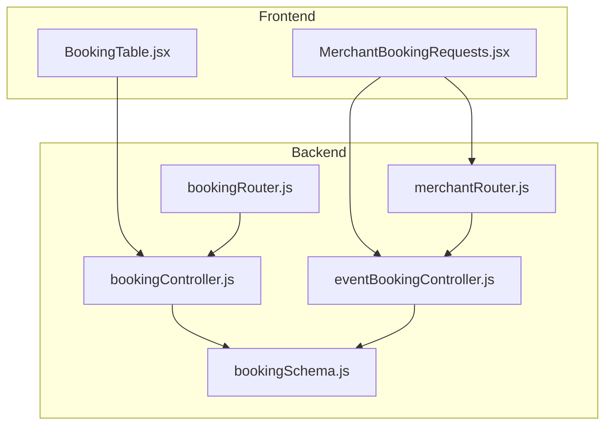
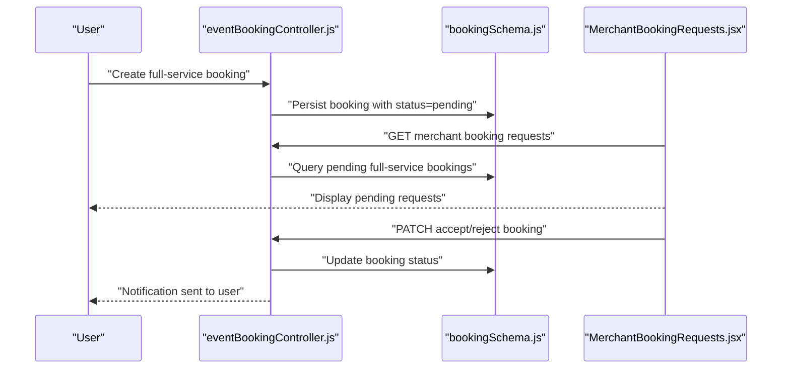
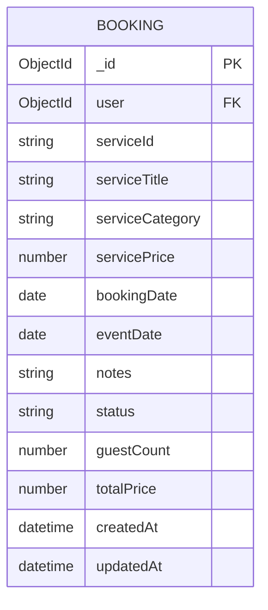
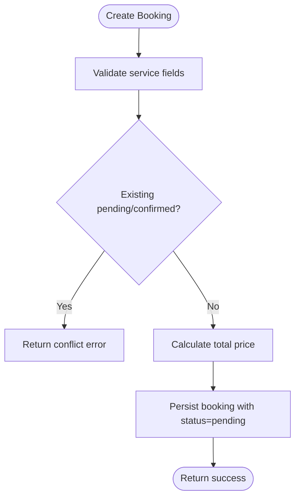
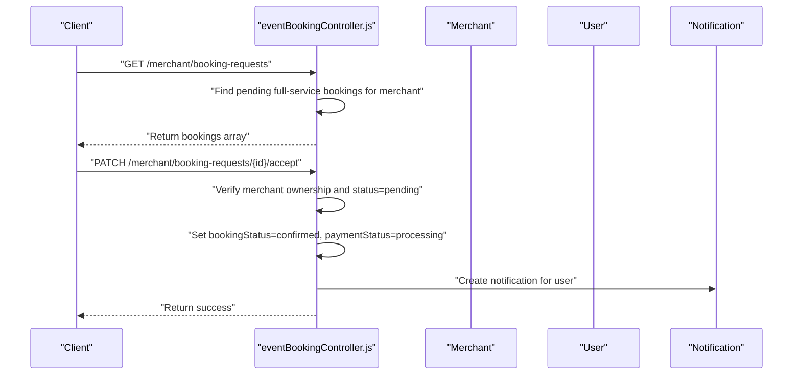
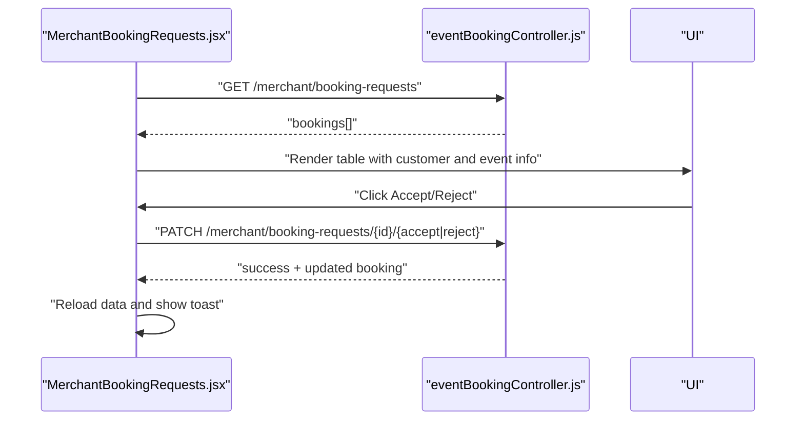
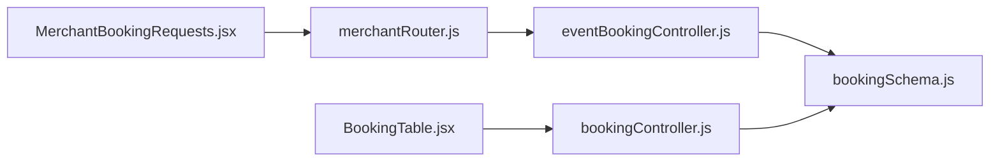

# Booking Request Processing

<cite>
**Referenced Files in This Document**
- [bookingController.js](file://backend/controller/bookingController.js)
- [bookingSchema.js](file://backend/models/bookingSchema.js)
- [bookingRouter.js](file://backend/router/bookingRouter.js)
- [eventBookingController.js](file://backend/controller/eventBookingController.js)
- [merchantRouter.js](file://backend/router/merchantRouter.js)
- [MerchantBookingRequests.jsx](file://frontend/src/pages/dashboards/MerchantBookingRequests.jsx)
- [BookingTable.jsx](file://frontend/src/components/user/BookingTable.jsx)
</cite>

## Table of Contents
1. [Introduction](#introduction)
2. [Project Structure](#project-structure)
3. [Core Components](#core-components)
4. [Architecture Overview](#architecture-overview)
5. [Detailed Component Analysis](#detailed-component-analysis)
6. [Dependency Analysis](#dependency-analysis)
7. [Performance Considerations](#performance-considerations)
8. [Troubleshooting Guide](#troubleshooting-guide)
9. [Conclusion](#conclusion)

## Introduction
This document describes the merchant booking request processing system for full-service events. It covers the end-to-end workflow from customer booking submission to merchant approval, payment processing, and booking completion. It also documents booking status management, filtering and bulk-like actions via the merchant dashboard, customer information display, and analytics/revenue tracking capabilities.

## Project Structure
The booking system spans backend controllers and models, frontend merchant dashboard, and supporting routers. Key areas:
- Backend booking model and controller for generic bookings
- Event booking controller orchestrating full-service and ticketed bookings
- Merchant-specific endpoints for retrieving and acting on booking requests
- Frontend merchant dashboard for reviewing and approving/rejecting requests
- Frontend user booking table for displaying booking history

**Diagram sources**
- [MerchantBookingRequests.jsx:1-294](file://frontend/src/pages/dashboards/MerchantBookingRequests.jsx#L1-L294)
- [BookingTable.jsx:1-59](file://frontend/src/components/user/BookingTable.jsx#L1-L59)
- [eventBookingController.js:1-200](file://backend/controller/eventBookingController.js#L1-L200)
- [bookingController.js:1-233](file://backend/controller/bookingController.js#L1-L233)
- [bookingRouter.js:1-26](file://backend/router/bookingRouter.js#L1-L26)
- [merchantRouter.js:1-16](file://backend/router/merchantRouter.js#L1-L16)
- [bookingSchema.js:1-53](file://backend/models/bookingSchema.js#L1-L53)

**Section sources**
- [bookingController.js:1-233](file://backend/controller/bookingController.js#L1-L233)
- [bookingSchema.js:1-53](file://backend/models/bookingSchema.js#L1-L53)
- [bookingRouter.js:1-26](file://backend/router/bookingRouter.js#L1-L26)
- [eventBookingController.js:1-200](file://backend/controller/eventBookingController.js#L1-L200)
- [merchantRouter.js:1-16](file://backend/router/merchantRouter.js#L1-L16)
- [MerchantBookingRequests.jsx:1-294](file://frontend/src/pages/dashboards/MerchantBookingRequests.jsx#L1-L294)
- [BookingTable.jsx:1-59](file://frontend/src/components/user/BookingTable.jsx#L1-L59)

## Core Components
- Booking model: Defines booking fields, enums, and timestamps.
- Booking controller: Handles user-side booking operations (create, fetch, cancel).
- Event booking controller: Routes to full-service or ticketed booking handlers, manages merchant booking requests, acceptance, rejection, and user booking retrieval.
- Merchant router: Exposes merchant-only endpoints for event and booking request management.
- Merchant booking requests page: Allows merchants to view pending requests and approve/reject.
- User booking table: Displays recent bookings with status badges.

**Section sources**
- [bookingSchema.js:1-53](file://backend/models/bookingSchema.js#L1-L53)
- [bookingController.js:1-233](file://backend/controller/bookingController.js#L1-L233)
- [eventBookingController.js:1-200](file://backend/controller/eventBookingController.js#L1-L200)
- [merchantRouter.js:1-16](file://backend/router/merchantRouter.js#L1-L16)
- [MerchantBookingRequests.jsx:1-294](file://frontend/src/pages/dashboards/MerchantBookingRequests.jsx#L1-L294)
- [BookingTable.jsx:1-59](file://frontend/src/components/user/BookingTable.jsx#L1-L59)

## Architecture Overview
The system supports two booking types:
- Full-service: Requires merchant approval before payment.
- Ticketed: Direct booking flow (outside scope of this document’s merchant booking requests).

Full-service booking flow:
1. Customer submits a booking request for a full-service event.
2. Merchant receives a pending booking request in the dashboard.
3. Merchant accepts or rejects the request.
4. Accepted requests become payable; upon payment, the booking completes.

**Diagram sources**
- [eventBookingController.js:75-144](file://backend/controller/eventBookingController.js#L75-L144)
- [bookingSchema.js:36-47](file://backend/models/bookingSchema.js#L36-L47)
- [MerchantBookingRequests.jsx:15-96](file://frontend/src/pages/dashboards/MerchantBookingRequests.jsx#L15-L96)

## Detailed Component Analysis

### Booking Model
The booking model defines the core fields for both generic and event-based bookings:
- Identity: user reference, service/event identifiers
- Pricing: base price, guest count, total price
- Scheduling: booking date, event date
- Status: enum with pending, confirmed, cancelled, completed
- Metadata: timestamps

**Diagram sources**
- [bookingSchema.js:3-50](file://backend/models/bookingSchema.js#L3-L50)

**Section sources**
- [bookingSchema.js:1-53](file://backend/models/bookingSchema.js#L1-L53)

### Generic Booking Controller
Handles user-side operations:
- Create booking: Validates inputs, prevents duplicate active bookings, calculates total price, sets initial status to pending.
- Fetch user bookings: Returns sorted list for the current user.
- Fetch single booking by ID: Enforces ownership.
- Cancel booking: Prevents cancellation of already-cancelled or completed bookings.
- Admin operations: Fetch all bookings and update status.

**Diagram sources**
- [bookingController.js:4-70](file://backend/controller/bookingController.js#L4-L70)

**Section sources**
- [bookingController.js:1-233](file://backend/controller/bookingController.js#L1-L233)

### Event Booking Controller
Routes to appropriate handlers based on event type and manages merchant booking requests:
- Routing: Determines full-service vs ticketed booking and delegates accordingly.
- Full-service booking: Validates user and event, checks for existing active bookings, applies coupons if provided, persists booking with pending status.
- Merchant booking requests: Retrieves pending full-service event bookings for the logged-in merchant.
- Accept booking: Updates booking status to confirmed and payment status to processing, sends notification to user.
- Reject booking: Updates status to rejected (implementation continues in the controller).
- User bookings: Formats bookings with computed flags for payment eligibility and completion status.

**Diagram sources**
- [eventBookingController.js:770-793](file://backend/controller/eventBookingController.js#L770-L793)
- [eventBookingController.js:894-958](file://backend/controller/eventBookingController.js#L894-L958)

**Section sources**
- [eventBookingController.js:1-200](file://backend/controller/eventBookingController.js#L1-L200)
- [eventBookingController.js:770-793](file://backend/controller/eventBookingController.js#L770-L793)
- [eventBookingController.js:894-958](file://backend/controller/eventBookingController.js#L894-L958)
- [eventBookingController.js:1385-1413](file://backend/controller/eventBookingController.js#L1385-L1413)
- [eventBookingController.js:1415-1426](file://backend/controller/eventBookingController.js#L1415-L1426)

### Merchant Router
Exposes merchant-only endpoints for event management and booking request handling.

**Section sources**
- [merchantRouter.js:1-16](file://backend/router/merchantRouter.js#L1-L16)

### Merchant Booking Requests Page
Provides a table of pending booking requests for the merchant:
- Loads requests via GET endpoint
- Accept/Reject actions via PATCH endpoints
- Loading states and toast notifications
- Displays customer info, event details, guests, and request date

**Diagram sources**
- [MerchantBookingRequests.jsx:15-96](file://frontend/src/pages/dashboards/MerchantBookingRequests.jsx#L15-L96)
- [eventBookingController.js:770-793](file://backend/controller/eventBookingController.js#L770-L793)
- [eventBookingController.js:894-958](file://backend/controller/eventBookingController.js#L894-L958)

**Section sources**
- [MerchantBookingRequests.jsx:1-294](file://frontend/src/pages/dashboards/MerchantBookingRequests.jsx#L1-L294)

### User Booking Table
Displays recent bookings with status badges and a View action.

**Section sources**
- [BookingTable.jsx:1-59](file://frontend/src/components/user/BookingTable.jsx#L1-L59)

## Dependency Analysis
- Frontend merchant dashboard depends on merchant endpoints for retrieving and updating booking requests.
- Event booking controller depends on booking model and event model to route and manage bookings.
- Generic booking controller depends on booking model for CRUD operations.
- Merchant router exposes endpoints used by the event booking controller for merchant-specific operations.

**Diagram sources**
- [MerchantBookingRequests.jsx:1-294](file://frontend/src/pages/dashboards/MerchantBookingRequests.jsx#L1-L294)
- [merchantRouter.js:1-16](file://backend/router/merchantRouter.js#L1-L16)
- [eventBookingController.js:1-200](file://backend/controller/eventBookingController.js#L1-L200)
- [bookingController.js:1-233](file://backend/controller/bookingController.js#L1-L233)
- [bookingSchema.js:1-53](file://backend/models/bookingSchema.js#L1-L53)

**Section sources**
- [merchantRouter.js:1-16](file://backend/router/merchantRouter.js#L1-L16)
- [eventBookingController.js:1-200](file://backend/controller/eventBookingController.js#L1-L200)
- [bookingController.js:1-233](file://backend/controller/bookingController.js#L1-L233)
- [bookingSchema.js:1-53](file://backend/models/bookingSchema.js#L1-L53)

## Performance Considerations
- Indexing: Consider adding indexes on booking fields frequently queried by merchants (e.g., merchant, eventType, type, status) to improve request retrieval performance.
- Pagination: For large datasets, implement pagination in the merchant booking requests endpoint to avoid large payload transfers.
- Filtering: Extend the merchant endpoint to support filtering by date range, customer name/email, and event title to improve usability.
- Caching: Cache static event details and user profile summaries to reduce repeated lookups during rendering.

## Troubleshooting Guide
Common issues and resolutions:
- Duplicate booking attempts: The system prevents multiple pending or confirmed bookings for the same service/event. Users receive a conflict error if attempting to book again.
- Invalid status transitions: Attempting to cancel a completed or already cancelled booking returns an error. Similarly, accepting non-pending bookings fails.
- Merchant ownership verification: Merchant actions require ownership validation; unauthorized attempts are blocked.
- Coupon validation: Full-service booking handlers validate coupon presence, expiry, usage limits, and minimum order amounts before creating the booking.

**Section sources**
- [bookingController.js:124-171](file://backend/controller/bookingController.js#L124-L171)
- [eventBookingController.js:131-144](file://backend/controller/eventBookingController.js#L131-L144)
- [eventBookingController.js:154-200](file://backend/controller/eventBookingController.js#L154-L200)

## Conclusion
The merchant booking request processing system provides a clear, role-based workflow for managing full-service event bookings. Merchants can review pending requests, approve or reject them, and trigger payment flows. The system enforces business rules around duplicate bookings, status transitions, and merchant ownership. The frontend dashboards offer intuitive views for both merchants and users, with actionable statuses and notifications. Extending filtering, pagination, and analytics would further enhance operational efficiency.