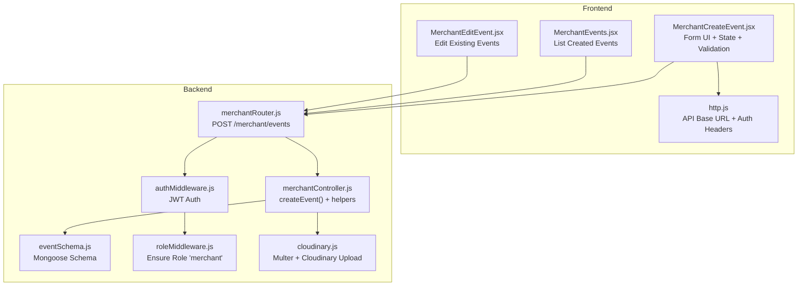
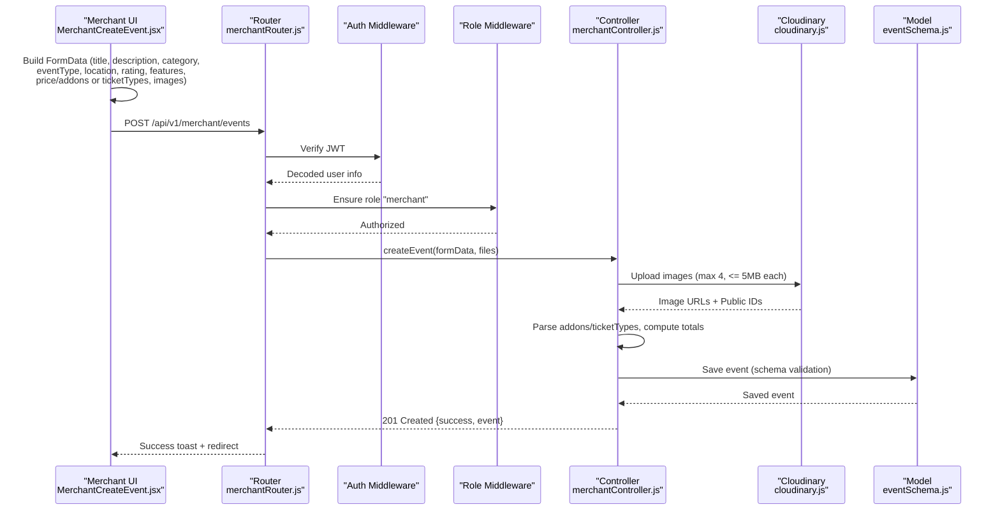
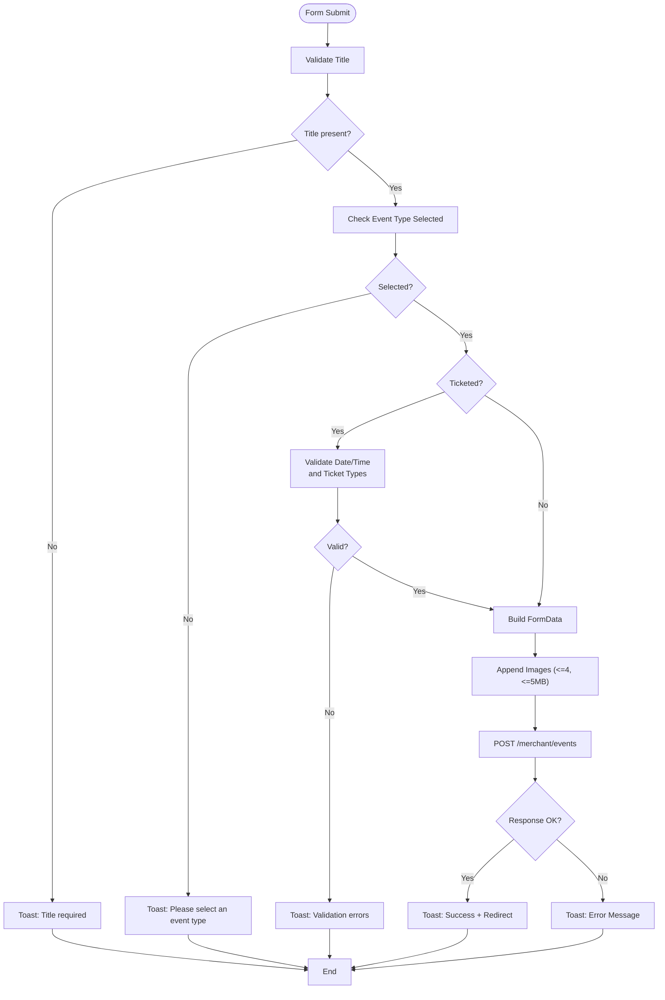
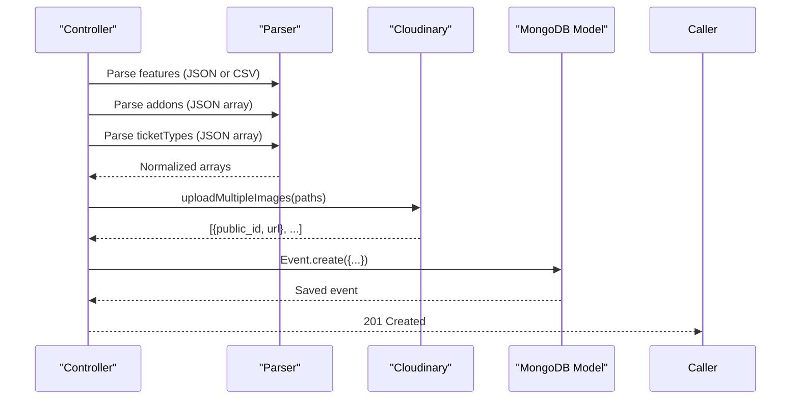
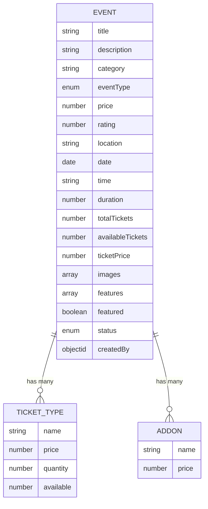
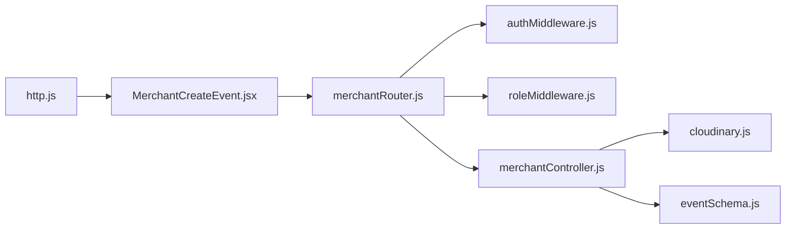

# Event Creation Workflow

<cite>
**Referenced Files in This Document**
- [MerchantCreateEvent.jsx](file://frontend/src/pages/dashboards/MerchantCreateEvent.jsx)
- [merchantController.js](file://backend/controller/merchantController.js)
- [eventSchema.js](file://backend/models/eventSchema.js)
- [merchantRouter.js](file://backend/router/merchantRouter.js)
- [cloudinary.js](file://backend/util/cloudinary.js)
- [authMiddleware.js](file://backend/middleware/authMiddleware.js)
- [roleMiddleware.js](file://backend/middleware/roleMiddleware.js)
- [http.js](file://frontend/src/lib/http.js)
- [MerchantEvents.jsx](file://frontend/src/pages/dashboards/MerchantEvents.jsx)
- [MerchantEditEvent.jsx](file://frontend/src/pages/dashboards/MerchantEditEvent.jsx)
- [EVENT_TYPES_IMPLEMENTATION.md](file://EVENT_TYPES_IMPLEMENTATION.md)
- [DROPDOWN_EVENT_TYPE_UPDATE.md](file://DROPDOWN_EVENT_TYPE_UPDATE.md)
</cite>

## Table of Contents
1. [Introduction](#introduction)
2. [Project Structure](#project-structure)
3. [Core Components](#core-components)
4. [Architecture Overview](#architecture-overview)
5. [Detailed Component Analysis](#detailed-component-analysis)
6. [Dependency Analysis](#dependency-analysis)
7. [Performance Considerations](#performance-considerations)
8. [Troubleshooting Guide](#troubleshooting-guide)
9. [Conclusion](#conclusion)

## Introduction
This document explains the merchant event creation workflow end-to-end. It covers how merchants select an event type, fill out form fields, configure pricing and availability, manage images, and submit the event. It also documents validation rules, success/error handling, and the backend processing pipeline that persists the event and uploads images via Cloudinary.

## Project Structure
The event creation feature spans the frontend React dashboard and the backend Express API:
- Frontend: Merchant dashboard page renders the form, manages state, validates inputs, and submits data.
- Backend: Router receives the request, applies authentication and role checks, parses form data, validates fields, uploads images to Cloudinary, and stores the event in MongoDB.

**Diagram sources**
- [MerchantCreateEvent.jsx:1-640](file://frontend/src/pages/dashboards/MerchantCreateEvent.jsx#L1-L640)
- [merchantRouter.js:1-17](file://backend/router/merchantRouter.js#L1-L17)
- [merchantController.js:1-209](file://backend/controller/merchantController.js#L1-L209)
- [eventSchema.js:1-51](file://backend/models/eventSchema.js#L1-L51)
- [cloudinary.js:1-112](file://backend/util/cloudinary.js#L1-L112)
- [authMiddleware.js:1-17](file://backend/middleware/authMiddleware.js#L1-L17)
- [roleMiddleware.js:1-9](file://backend/middleware/roleMiddleware.js#L1-L9)
- [http.js:1-5](file://frontend/src/lib/http.js#L1-L5)
- [MerchantEvents.jsx:1-150](file://frontend/src/pages/dashboards/MerchantEvents.jsx#L1-L150)
- [MerchantEditEvent.jsx:1-412](file://frontend/src/pages/dashboards/MerchantEditEvent.jsx#L1-L412)

**Section sources**
- [MerchantCreateEvent.jsx:1-640](file://frontend/src/pages/dashboards/MerchantCreateEvent.jsx#L1-L640)
- [merchantRouter.js:1-17](file://backend/router/merchantRouter.js#L1-L17)
- [merchantController.js:1-209](file://backend/controller/merchantController.js#L1-L209)
- [eventSchema.js:1-51](file://backend/models/eventSchema.js#L1-L51)
- [cloudinary.js:1-112](file://backend/util/cloudinary.js#L1-L112)
- [authMiddleware.js:1-17](file://backend/middleware/authMiddleware.js#L1-L17)
- [roleMiddleware.js:1-9](file://backend/middleware/roleMiddleware.js#L1-L9)
- [http.js:1-5](file://frontend/src/lib/http.js#L1-L5)
- [MerchantEvents.jsx:1-150](file://frontend/src/pages/dashboards/MerchantEvents.jsx#L1-L150)
- [MerchantEditEvent.jsx:1-412](file://frontend/src/pages/dashboards/MerchantEditEvent.jsx#L1-L412)

## Core Components
- MerchantCreateEvent.jsx: Renders the event creation form, manages form state, validates inputs, builds FormData, and posts to the backend.
- merchantController.js: Validates and parses incoming data, computes derived fields (e.g., lowest ticket price), uploads images, and creates the event record.
- eventSchema.js: Defines the MongoDB schema for events, including fields for both full-service and ticketed types.
- merchantRouter.js: Exposes POST /merchant/events with upload middleware and role guards.
- cloudinary.js: Configures Cloudinary, validates uploads, and provides upload/delete utilities.
- authMiddleware.js and roleMiddleware.js: Enforce JWT authentication and merchant role.
- http.js: Provides base API URL and auth header builder.
- MerchantEvents.jsx and MerchantEditEvent.jsx: List and edit events respectively; complement the creation flow.

**Section sources**
- [MerchantCreateEvent.jsx:54-640](file://frontend/src/pages/dashboards/MerchantCreateEvent.jsx#L54-L640)
- [merchantController.js:5-98](file://backend/controller/merchantController.js#L5-L98)
- [eventSchema.js:3-48](file://backend/models/eventSchema.js#L3-L48)
- [merchantRouter.js:9-14](file://backend/router/merchantRouter.js#L9-L14)
- [cloudinary.js:8-58](file://backend/util/cloudinary.js#L8-L58)
- [authMiddleware.js:3-16](file://backend/middleware/authMiddleware.js#L3-L16)
- [roleMiddleware.js:1-8](file://backend/middleware/roleMiddleware.js#L1-L8)
- [http.js:1-5](file://frontend/src/lib/http.js#L1-L5)
- [MerchantEvents.jsx:11-146](file://frontend/src/pages/dashboards/MerchantEvents.jsx#L11-L146)
- [MerchantEditEvent.jsx:10-412](file://frontend/src/pages/dashboards/MerchantEditEvent.jsx#L10-L412)

## Architecture Overview
The workflow follows a standard request-response pattern:
- Frontend collects merchant inputs, validates locally, and constructs FormData.
- Backend routes the request through auth and role middleware, parses body and files, validates fields, uploads images, and persists the event.
- On success, the backend responds with the created event; on failure, it returns an error message.

**Diagram sources**
- [MerchantCreateEvent.jsx:159-220](file://frontend/src/pages/dashboards/MerchantCreateEvent.jsx#L159-L220)
- [merchantRouter.js:9](file://backend/router/merchantRouter.js#L9)
- [authMiddleware.js:3-16](file://backend/middleware/authMiddleware.js#L3-L16)
- [roleMiddleware.js:1-8](file://backend/middleware/roleMiddleware.js#L1-L8)
- [merchantController.js:5-98](file://backend/controller/merchantController.js#L5-L98)
- [cloudinary.js:75-91](file://backend/util/cloudinary.js#L75-L91)
- [eventSchema.js:3-48](file://backend/models/eventSchema.js#L3-L48)

## Detailed Component Analysis

### MerchantCreateEvent.jsx: Form, Validation, Submission
Key responsibilities:
- Event type selection and conditional rendering of type-specific fields.
- Local validation for required fields and numeric constraints.
- Building FormData and uploading images.
- Success and error handling with toast notifications.

Highlights:
- Event type modal/select drives conditional UI for ticketed vs full-service.
- Ticketed-only validations: date/time required; ticket types require name, non-negative price, and quantity ≥ 1.
- Full-service validations: at least one image required; price ≥ 0; optional features.
- Image handling: max 4 images, ≤ 5MB each, preview rendering, removal capability.
- Submission: FormData appended with title, description, category, eventType, location, rating, features, plus either price/addons (full-service) or ticketTypes (ticketed), and images.

**Diagram sources**
- [MerchantCreateEvent.jsx:159-220](file://frontend/src/pages/dashboards/MerchantCreateEvent.jsx#L159-L220)
- [MerchantCreateEvent.jsx:103-132](file://frontend/src/pages/dashboards/MerchantCreateEvent.jsx#L103-L132)
- [MerchantCreateEvent.jsx:134-146](file://frontend/src/pages/dashboards/MerchantCreateEvent.jsx#L134-L146)
- [MerchantCreateEvent.jsx:177-208](file://frontend/src/pages/dashboards/MerchantCreateEvent.jsx#L177-L208)

**Section sources**
- [MerchantCreateEvent.jsx:54-640](file://frontend/src/pages/dashboards/MerchantCreateEvent.jsx#L54-L640)

### merchantController.js: Backend Processing
Responsibilities:
- Validate required fields (title).
- Parse and sanitize complex fields (features, addons, ticketTypes).
- Compute derived values (lowest ticket price, total tickets).
- Upload images via Cloudinary and attach secure URLs/public IDs.
- Persist event to MongoDB using the schema model.

Important behaviors:
- For ticketed events: parse ticketTypes, set available equal to quantity, compute total tickets and lowest price.
- For full-service events: parse addons, set price from form input.
- Robust error handling for malformed JSON and validation errors.

**Diagram sources**
- [merchantController.js:25-98](file://backend/controller/merchantController.js#L25-L98)
- [cloudinary.js:75-91](file://backend/util/cloudinary.js#L75-L91)
- [eventSchema.js:3-48](file://backend/models/eventSchema.js#L3-L48)

**Section sources**
- [merchantController.js:5-98](file://backend/controller/merchantController.js#L5-L98)

### eventSchema.js: Data Model
Defines fields for both event types:
- Common: title, description, category, rating, location, date/time, duration, status, featured, images, features, createdBy.
- Ticketed: totalTickets, availableTickets, ticketPrice, ticketTypes (with name, price, quantity, available).
- Full-service: price, addons (with name, price).

Constraints:
- eventType enum allows only "full-service" or "ticketed".
- Numeric fields enforce min/max where applicable.
- Arrays define nested structures for ticketTypes and addons.

**Diagram sources**
- [eventSchema.js:3-48](file://backend/models/eventSchema.js#L3-L48)

**Section sources**
- [eventSchema.js:3-48](file://backend/models/eventSchema.js#L3-L48)

### merchantRouter.js and Middleware
- Routes: POST /merchant/events (upload.array('images', 4)), PUT /merchant/events/:id, GET /merchant/events, GET /merchant/events/:id, DELETE /merchant/events/:id.
- Authentication: auth middleware verifies JWT from Authorization header.
- Role enforcement: ensureRole("merchant") ensures only merchants can create/update/delete events.
- Upload: multer-cloudinary storage configured for allowed formats and size limits.

**Section sources**
- [merchantRouter.js:9-14](file://backend/router/merchantRouter.js#L9-L14)
- [authMiddleware.js:3-16](file://backend/middleware/authMiddleware.js#L3-L16)
- [roleMiddleware.js:1-8](file://backend/middleware/roleMiddleware.js#L1-L8)
- [cloudinary.js:35-58](file://backend/util/cloudinary.js#L35-L58)

### Frontend Navigation and Listing
- MerchantEvents.jsx lists created events, shows pricing/rating/features, and links to edit/delete.
- MerchantEditEvent.jsx loads an existing event, supports adding/removing images (up to 4), and updates the event.

**Section sources**
- [MerchantEvents.jsx:11-146](file://frontend/src/pages/dashboards/MerchantEvents.jsx#L11-L146)
- [MerchantEditEvent.jsx:29-180](file://frontend/src/pages/dashboards/MerchantEditEvent.jsx#L29-L180)

## Dependency Analysis
- Frontend depends on:
  - http.js for API base URL and auth headers.
  - MerchantCreateEvent.jsx for form state, validation, and submission.
  - MerchantEvents.jsx and MerchantEditEvent.jsx for listing and editing.
- Backend depends on:
  - Router for routing and upload middleware.
  - Controller for business logic.
  - Model for schema validation and persistence.
  - Cloudinary for image storage.
  - Auth and role middleware for security.

**Diagram sources**
- [http.js:1-5](file://frontend/src/lib/http.js#L1-L5)
- [MerchantCreateEvent.jsx:1-10](file://frontend/src/pages/dashboards/MerchantCreateEvent.jsx#L1-L10)
- [merchantRouter.js:1-17](file://backend/router/merchantRouter.js#L1-L17)
- [authMiddleware.js:1-17](file://backend/middleware/authMiddleware.js#L1-L17)
- [roleMiddleware.js:1-9](file://backend/middleware/roleMiddleware.js#L1-L9)
- [merchantController.js:1-209](file://backend/controller/merchantController.js#L1-L209)
- [cloudinary.js:1-112](file://backend/util/cloudinary.js#L1-L112)
- [eventSchema.js:1-51](file://backend/models/eventSchema.js#L1-L51)

**Section sources**
- [http.js:1-5](file://frontend/src/lib/http.js#L1-L5)
- [MerchantCreateEvent.jsx:1-10](file://frontend/src/pages/dashboards/MerchantCreateEvent.jsx#L1-L10)
- [merchantRouter.js:1-17](file://backend/router/merchantRouter.js#L1-L17)
- [authMiddleware.js:1-17](file://backend/middleware/authMiddleware.js#L1-L17)
- [roleMiddleware.js:1-9](file://backend/middleware/roleMiddleware.js#L1-L9)
- [merchantController.js:1-209](file://backend/controller/merchantController.js#L1-L209)
- [cloudinary.js:1-112](file://backend/util/cloudinary.js#L1-L112)
- [eventSchema.js:1-51](file://backend/models/eventSchema.js#L1-L51)

## Performance Considerations
- Image upload limits: max 4 images, 5MB each, enforced by frontend and Cloudinary multer configuration.
- Minimal client-side computation: most logic resides in the backend (parsing, validation, image upload).
- Efficient schema: nested arrays (ticketTypes, addons) keep related data cohesive.
- Network efficiency: FormData avoids redundant serialization; Cloudinary transformations limit payload size.

[No sources needed since this section provides general guidance]

## Troubleshooting Guide
Common issues and resolutions:
- Unauthorized or forbidden:
  - Ensure a valid Bearer token is attached to requests.
  - Confirm the user role is "merchant".
- Missing or invalid event type:
  - The form requires an explicit selection before submission.
- Validation failures:
  - Ticketed events require date/time and valid ticket types (name, price ≥ 0, quantity ≥ 1).
  - Full-service events require at least one image; price must be ≥ 0.
- Image upload errors:
  - Respect max 4 images and 5MB limit.
  - Only image/* MIME types are accepted.
- Backend errors:
  - Malformed JSON for addons or ticketTypes will be caught and handled gracefully.
  - Schema validation errors return structured messages.

**Section sources**
- [MerchantCreateEvent.jsx:159-220](file://frontend/src/pages/dashboards/MerchantCreateEvent.jsx#L159-L220)
- [merchantController.js:93-97](file://backend/controller/merchantController.js#L93-L97)
- [cloudinary.js:46-58](file://backend/util/cloudinary.js#L46-L58)
- [authMiddleware.js:7-14](file://backend/middleware/authMiddleware.js#L7-L14)
- [roleMiddleware.js:3-6](file://backend/middleware/roleMiddleware.js#L3-L6)

## Conclusion
The merchant event creation workflow integrates a clean, progressive UI with robust backend validation and secure image handling. The system supports two event types—ticketed and full-service—each with tailored fields and validation rules. The frontend provides immediate feedback, while the backend ensures data integrity, enforces roles, and leverages Cloudinary for reliable media storage.