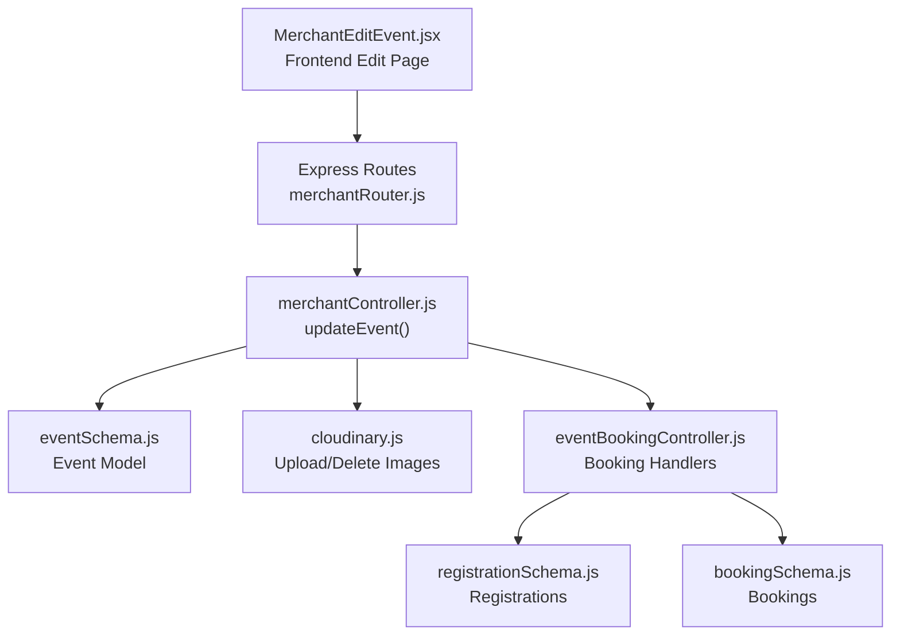
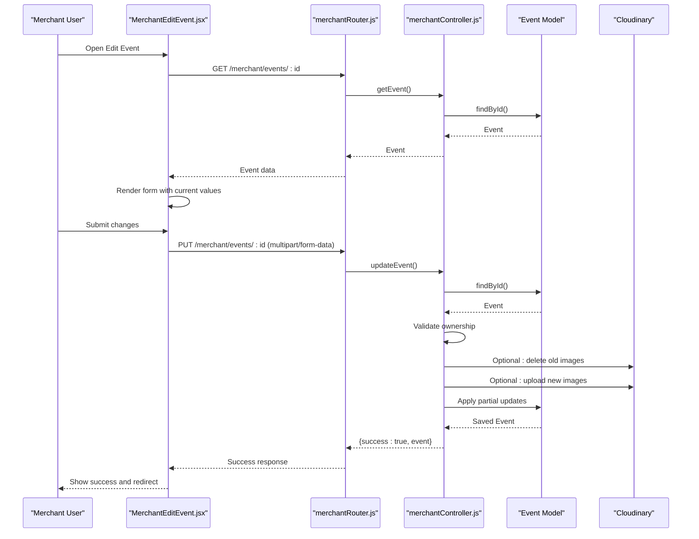
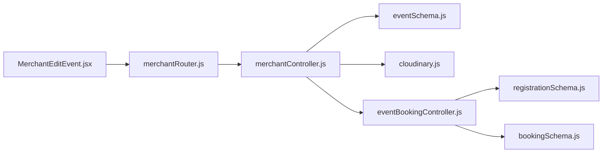

# Event Editing and Management

<cite>
**Referenced Files in This Document**
- [MerchantEditEvent.jsx](file://frontend/src/pages/dashboards/MerchantEditEvent.jsx)
- [merchantController.js](file://backend/controller/merchantController.js)
- [merchantRouter.js](file://backend/router/merchantRouter.js)
- [eventSchema.js](file://backend/models/eventSchema.js)
- [cloudinary.js](file://backend/util/cloudinary.js)
- [eventBookingController.js](file://backend/controller/eventBookingController.js)
- [bookingSchema.js](file://backend/models/bookingSchema.js)
- [registrationSchema.js](file://backend/models/registrationSchema.js)
</cite>

## Table of Contents
1. [Introduction](#introduction)
2. [Project Structure](#project-structure)
3. [Core Components](#core-components)
4. [Architecture Overview](#architecture-overview)
5. [Detailed Component Analysis](#detailed-component-analysis)
6. [Dependency Analysis](#dependency-analysis)
7. [Performance Considerations](#performance-considerations)
8. [Troubleshooting Guide](#troubleshooting-guide)
9. [Conclusion](#conclusion)

## Introduction
This document explains the complete event editing and management workflow for merchants. It covers how merchants update event details, pricing, availability, and descriptions; how the edit form interface works; how change tracking and validation are handled; and how merchants can modify categories, update images, adjust booking configurations, and manage event status. It also addresses partial updates, bulk operations, duplication features, and conflict resolution for events with existing bookings.

## Project Structure
The event editing and management system spans the frontend React dashboard and the backend Express API with MongoDB persistence. Key areas:
- Frontend edit page renders the form, validates inputs, and uploads images via Cloudinary.
- Backend routes accept multipart/form-data, enforce merchant ownership, and apply partial updates.
- Event model defines schema fields including pricing, availability, images, and booking-related fields.
- Cloudinary utility handles secure image upload and deletion.
- Booking and registration models support conflict detection and status management.

**Diagram sources**
- [MerchantEditEvent.jsx:1-413](file://frontend/src/pages/dashboards/MerchantEditEvent.jsx#L1-L413)
- [merchantRouter.js:1-17](file://backend/router/merchantRouter.js#L1-L17)
- [merchantController.js:100-147](file://backend/controller/merchantController.js#L100-L147)
- [eventSchema.js:1-51](file://backend/models/eventSchema.js#L1-L51)
- [cloudinary.js:1-112](file://backend/util/cloudinary.js#L1-L112)
- [eventBookingController.js:1-800](file://backend/controller/eventBookingController.js#L1-L800)
- [registrationSchema.js:1-12](file://backend/models/registrationSchema.js#L1-L12)
- [bookingSchema.js:1-53](file://backend/models/bookingSchema.js#L1-L53)

**Section sources**
- [MerchantEditEvent.jsx:1-413](file://frontend/src/pages/dashboards/MerchantEditEvent.jsx#L1-L413)
- [merchantRouter.js:1-17](file://backend/router/merchantRouter.js#L1-L17)
- [merchantController.js:100-147](file://backend/controller/merchantController.js#L100-L147)
- [eventSchema.js:1-51](file://backend/models/eventSchema.js#L1-L51)
- [cloudinary.js:1-112](file://backend/util/cloudinary.js#L1-L112)
- [eventBookingController.js:1-800](file://backend/controller/eventBookingController.js#L1-L800)
- [registrationSchema.js:1-12](file://backend/models/registrationSchema.js#L1-L12)
- [bookingSchema.js:1-53](file://backend/models/bookingSchema.js#L1-L53)

## Core Components
- Merchant Edit Page (Frontend):
  - Loads current event data, supports adding/removing features, managing images, and validating inputs before submission.
  - Submits a multipart/form-data payload to the backend with optional new images.
- Merchant Controller (Backend):
  - Validates ownership, applies partial updates to event fields, and replaces images via Cloudinary when provided.
- Event Model:
  - Defines fields for title, description, category, price, rating, location, date/time, duration, ticketed fields, images, features, addons, and status.
- Cloudinary Utility:
  - Handles secure upload, transformation, and deletion of images with size and format constraints.
- Booking and Registration Models:
  - Support conflict detection and status management for existing bookings.

**Section sources**
- [MerchantEditEvent.jsx:29-51](file://frontend/src/pages/dashboards/MerchantEditEvent.jsx#L29-L51)
- [merchantController.js:100-147](file://backend/controller/merchantController.js#L100-L147)
- [eventSchema.js:3-48](file://backend/models/eventSchema.js#L3-L48)
- [cloudinary.js:35-58](file://backend/util/cloudinary.js#L35-L58)
- [registrationSchema.js:3-9](file://backend/models/registrationSchema.js#L3-L9)
- [bookingSchema.js:3-48](file://backend/models/bookingSchema.js#L3-L48)

## Architecture Overview
The edit workflow follows a clear client-server pattern:
- Frontend loads event data and renders a form.
- On submit, the frontend sends a multipart/form-data request containing updated fields and optional new images.
- Backend validates merchant ownership, parses features and addons, and conditionally replaces images.
- Partial updates are applied to the event record, preserving unchanged fields.

**Diagram sources**
- [MerchantEditEvent.jsx:29-51](file://frontend/src/pages/dashboards/MerchantEditEvent.jsx#L29-L51)
- [merchantRouter.js:9-14](file://backend/router/merchantRouter.js#L9-L14)
- [merchantController.js:100-147](file://backend/controller/merchantController.js#L100-L147)
- [eventSchema.js:3-48](file://backend/models/eventSchema.js#L3-L48)
- [cloudinary.js:75-91](file://backend/util/cloudinary.js#L75-L91)

## Detailed Component Analysis

### Frontend Edit Form: MerchantEditEvent.jsx
Responsibilities:
- Load event details and prefill form fields.
- Manage image uploads with size/format constraints and preview generation.
- Validate required fields (title, images) and submit to backend.
- Handle partial updates by sending only changed fields.

Key behaviors:
- Image handling enforces a maximum of four images and 5MB per file.
- Features are managed as an array with add/remove actions.
- Form submission builds a FormData object and sends it to the backend.

Validation and UX:
- Title required.
- At least one image required.
- Rating constrained to 0–5.
- Category selection from predefined list.

Partial updates:
- Only provided fields are sent to the backend; undefined fields are ignored.

Conflict handling:
- The frontend does not enforce conflicts; conflicts are resolved in the backend during booking operations.

**Section sources**
- [MerchantEditEvent.jsx:10-51](file://frontend/src/pages/dashboards/MerchantEditEvent.jsx#L10-L51)
- [MerchantEditEvent.jsx:62-92](file://frontend/src/pages/dashboards/MerchantEditEvent.jsx#L62-L92)
- [MerchantEditEvent.jsx:127-180](file://frontend/src/pages/dashboards/MerchantEditEvent.jsx#L127-L180)
- [MerchantEditEvent.jsx:182-413](file://frontend/src/pages/dashboards/MerchantEditEvent.jsx#L182-L413)

### Backend Route: merchantRouter.js
Responsibilities:
- Exposes PUT /merchant/events/:id for editing events.
- Applies authentication and role middleware.
- Uses multer-cloudinary upload middleware to accept up to four images.

Behavior:
- Enforces merchant role and authentication.
- Delegates to controller for update logic.

**Section sources**
- [merchantRouter.js:9-14](file://backend/router/merchantRouter.js#L9-L14)

### Backend Controller: merchantController.js
Responsibilities:
- Ownership verification: only the creator can update an event.
- Partial updates: sets fields only when present in the request body.
- Image replacement: deletes old Cloudinary images and uploads new ones when provided.
- Feature parsing: accepts either JSON or comma-separated strings.

Validation and error handling:
- Returns 404 if event not found.
- Returns 403 if not authorized.
- Returns 500 on internal errors.

Partial update logic:
- Fields updated: title, description, category, price, rating, features.
- Images replaced only when new files are provided.

**Section sources**
- [merchantController.js:100-147](file://backend/controller/merchantController.js#L100-L147)

### Event Model: eventSchema.js
Fields relevant to editing and management:
- Basic info: title, description, category, price, rating, features.
- Schedule/location: location, date, time, duration.
- Ticketed events: totalTickets, availableTickets, ticketPrice, ticketTypes (with nested fields).
- Images: array of { public_id, url }.
- Status: active, inactive, completed.
- Created by: reference to User.

Implications for editing:
- Partial updates preserve existing values for unspecified fields.
- Ticket types enable granular availability adjustments.
- Images are stored as an array; replacing images updates the entire array.

**Section sources**
- [eventSchema.js:3-48](file://backend/models/eventSchema.js#L3-L48)

### Cloudinary Utility: cloudinary.js
Capabilities:
- Upload single/multiple images with transformations and size/format limits.
- Delete single/multiple resources by public_id.
- Configured for allowed formats and max file size.

Integration:
- Used by the controller to replace images when new files are uploaded.

**Section sources**
- [cloudinary.js:35-58](file://backend/util/cloudinary.js#L35-L58)
- [cloudinary.js:75-91](file://backend/util/cloudinary.js#L75-L91)
- [cloudinary.js:103-109](file://backend/util/cloudinary.js#L103-L109)

### Booking and Registration Models
- Registration tracks user-event registrations; used to detect conflicts for full-service events.
- Booking model supports status transitions and event-type routing.

Conflict resolution context:
- Full-service events: pending approvals; conflicts arise if a user tries to book again while a pending/approved booking exists.
- Ticketed events: immediate confirmation; conflicts arise from ticket availability checks.

**Section sources**
- [registrationSchema.js:3-9](file://backend/models/registrationSchema.js#L3-L9)
- [bookingSchema.js:3-48](file://backend/models/bookingSchema.js#L3-L48)

### Event Booking Controller: eventBookingController.js
While primarily focused on booking creation, it informs conflict resolution:
- Full-service: prevents duplicate pending/confirmed bookings per user per event.
- Ticketed: enforces ticket availability and updates sold counts.

These constraints impact editing decisions:
- Reducing available tickets or removing ticket types affects future bookings.
- Updating pricing for full-service events requires merchant approval; existing bookings remain unaffected until status changes.

**Section sources**
- [eventBookingController.js:131-144](file://backend/controller/eventBookingController.js#L131-L144)
- [eventBookingController.js:377-391](file://backend/controller/eventBookingController.js#L377-L391)

## Dependency Analysis
The edit workflow depends on:
- Frontend form state and image handling.
- Backend route enforcement and controller logic.
- Event model schema and Cloudinary image storage.
- Booking and registration models for conflict detection.

**Diagram sources**
- [MerchantEditEvent.jsx:1-413](file://frontend/src/pages/dashboards/MerchantEditEvent.jsx#L1-L413)
- [merchantRouter.js:1-17](file://backend/router/merchantRouter.js#L1-L17)
- [merchantController.js:100-147](file://backend/controller/merchantController.js#L100-L147)
- [eventSchema.js:1-51](file://backend/models/eventSchema.js#L1-L51)
- [cloudinary.js:1-112](file://backend/util/cloudinary.js#L1-L112)
- [eventBookingController.js:1-800](file://backend/controller/eventBookingController.js#L1-L800)
- [registrationSchema.js:1-12](file://backend/models/registrationSchema.js#L1-L12)
- [bookingSchema.js:1-53](file://backend/models/bookingSchema.js#L1-L53)

**Section sources**
- [merchantController.js:100-147](file://backend/controller/merchantController.js#L100-L147)
- [merchantRouter.js:9-14](file://backend/router/merchantRouter.js#L9-L14)
- [eventSchema.js:3-48](file://backend/models/eventSchema.js#L3-L48)
- [cloudinary.js:75-91](file://backend/util/cloudinary.js#L75-L91)
- [eventBookingController.js:131-144](file://backend/controller/eventBookingController.js#L131-L144)
- [registrationSchema.js:3-9](file://backend/models/registrationSchema.js#L3-L9)
- [bookingSchema.js:3-48](file://backend/models/bookingSchema.js#L3-L48)

## Performance Considerations
- Image constraints: Limit uploads to four images at 5MB each to reduce payload size and storage overhead.
- Batch operations: Prefer partial updates to minimize write contention.
- Indexing: Ensure event queries leverage indexes on createdBy and status for efficient retrieval.
- Transformations: Cloudinary transformations optimize image delivery; avoid excessive resizing on the client.

## Troubleshooting Guide
Common issues and resolutions:
- Missing title or images on submit:
  - Ensure title is non-empty and at least one image is attached.
- Unauthorized access:
  - Verify merchant role and authentication; backend rejects non-owners.
- Image upload failures:
  - Confirm Cloudinary credentials and allowed formats; check file size and type filters.
- Partial update not reflected:
  - Ensure only edited fields are sent; undefined fields are ignored by the controller.
- Conflicts with existing bookings:
  - For full-service events, avoid duplicate pending/confirmed bookings per user.
  - For ticketed events, ensure sufficient ticket availability before reducing quantities.

**Section sources**
- [MerchantEditEvent.jsx:127-180](file://frontend/src/pages/dashboards/MerchantEditEvent.jsx#L127-L180)
- [merchantController.js:100-147](file://backend/controller/merchantController.js#L100-L147)
- [cloudinary.js:21-31](file://backend/util/cloudinary.js#L21-L31)
- [eventBookingController.js:131-144](file://backend/controller/eventBookingController.js#L131-L144)
- [eventBookingController.js:377-391](file://backend/controller/eventBookingController.js#L377-L391)

## Conclusion
The event editing and management system provides a robust, partial-update mechanism for merchants. The frontend ensures validation and controlled image handling, while the backend enforces ownership and safely replaces images when needed. Conflict detection for bookings is handled at the booking level, guiding merchants to adjust availability and pricing thoughtfully. The design supports scalability and maintainability through clear separation of concerns and standardized image handling.