# Event Management Workflows

<cite>
**Referenced Files in This Document**
- [eventSchema.js](file://backend/models/eventSchema.js)
- [registrationSchema.js](file://backend/models/registrationSchema.js)
- [eventController.js](file://backend/controller/eventController.js)
- [merchantController.js](file://backend/controller/merchantController.js)
- [eventRouter.js](file://backend/router/eventRouter.js)
- [merchantRouter.js](file://backend/router/merchantRouter.js)
- [cloudinary.js](file://backend/util/cloudinary.js)
- [MerchantCreateEvent.jsx](file://frontend/src/pages/dashboards/MerchantCreateEvent.jsx)
- [MerchantEditEvent.jsx](file://frontend/src/pages/dashboards/MerchantEditEvent.jsx)
- [MerchantEvents.jsx](file://frontend/src/pages/dashboards/MerchantEvents.jsx)
- [UserBrowseEvents.jsx](file://frontend/src/pages/dashboards/UserBrowseEvents.jsx)
- [AdminEvents.jsx](file://frontend/src/pages/dashboards/AdminEvents.jsx)
- [http.js](file://frontend/src/lib/http.js)
</cite>

## Table of Contents
1. [Introduction](#introduction)
2. [Project Structure](#project-structure)
3. [Core Components](#core-components)
4. [Architecture Overview](#architecture-overview)
5. [Detailed Component Analysis](#detailed-component-analysis)
6. [Dependency Analysis](#dependency-analysis)
7. [Performance Considerations](#performance-considerations)
8. [Troubleshooting Guide](#troubleshooting-guide)
9. [Conclusion](#conclusion)
10. [Appendices](#appendices)

## Introduction
This document explains the merchant event management workflows end-to-end. It covers the complete lifecycle from event creation to deletion, including form validation, category selection, pricing configuration, image uploads via Cloudinary, and participant management. It also documents event editing, visibility controls, approval workflows, and merchant moderation features. Step-by-step guides help create different event types, manage event details, and handle modifications. Event search and filtering capabilities for merchants and users are explained, along with moderation and approval flows.

## Project Structure
The event management system spans frontend React pages and backend Express routes/controllers/models. Key areas:
- Backend models define the event and registration data structures.
- Backend routers expose merchant and user endpoints.
- Controllers implement business logic for CRUD, image handling, and participant queries.
- Frontend dashboards provide merchant UI for creating, editing, listing, and deleting events, plus user browsing and admin oversight.

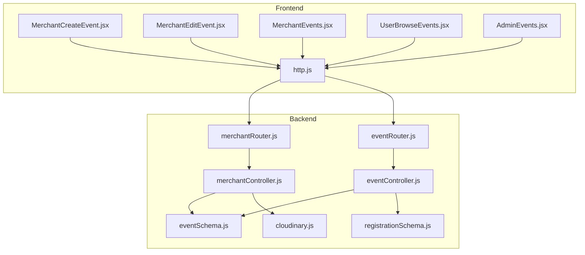

**Diagram sources**
- [merchantRouter.js:1-16](file://backend/router/merchantRouter.js#L1-L16)
- [eventRouter.js:1-13](file://backend/router/eventRouter.js#L1-L13)
- [merchantController.js:1-199](file://backend/controller/merchantController.js#L1-L199)
- [eventController.js:1-35](file://backend/controller/eventController.js#L1-L35)
- [eventSchema.js:1-23](file://backend/models/eventSchema.js#L1-L23)
- [registrationSchema.js:1-12](file://backend/models/registrationSchema.js#L1-L12)
- [cloudinary.js:1-112](file://backend/util/cloudinary.js#L1-L112)
- [MerchantCreateEvent.jsx:1-362](file://frontend/src/pages/dashboards/MerchantCreateEvent.jsx#L1-L362)
- [MerchantEditEvent.jsx:1-413](file://frontend/src/pages/dashboards/MerchantEditEvent.jsx#L1-L413)
- [MerchantEvents.jsx:1-150](file://frontend/src/pages/dashboards/MerchantEvents.jsx#L1-L150)
- [UserBrowseEvents.jsx:1-152](file://frontend/src/pages/dashboards/UserBrowseEvents.jsx#L1-L152)
- [AdminEvents.jsx:1-108](file://frontend/src/pages/dashboards/AdminEvents.jsx#L1-L108)
- [http.js:1-5](file://frontend/src/lib/http.js#L1-L5)

**Section sources**
- [merchantRouter.js:1-16](file://backend/router/merchantRouter.js#L1-L16)
- [eventRouter.js:1-13](file://backend/router/eventRouter.js#L1-L13)
- [merchantController.js:1-199](file://backend/controller/merchantController.js#L1-L199)
- [eventController.js:1-35](file://backend/controller/eventController.js#L1-L35)
- [eventSchema.js:1-23](file://backend/models/eventSchema.js#L1-L23)
- [registrationSchema.js:1-12](file://backend/models/registrationSchema.js#L1-L12)
- [cloudinary.js:1-112](file://backend/util/cloudinary.js#L1-L112)
- [MerchantCreateEvent.jsx:1-362](file://frontend/src/pages/dashboards/MerchantCreateEvent.jsx#L1-L362)
- [MerchantEditEvent.jsx:1-413](file://frontend/src/pages/dashboards/MerchantEditEvent.jsx#L1-L413)
- [MerchantEvents.jsx:1-150](file://frontend/src/pages/dashboards/MerchantEvents.jsx#L1-L150)
- [UserBrowseEvents.jsx:1-152](file://frontend/src/pages/dashboards/UserBrowseEvents.jsx#L1-L152)
- [AdminEvents.jsx:1-108](file://frontend/src/pages/dashboards/AdminEvents.jsx#L1-L108)
- [http.js:1-5](file://frontend/src/lib/http.js#L1-L5)

## Core Components
- Event model: Defines title, description, category, price, rating, images, features, and creator reference.
- Registration model: Tracks user-event registrations.
- Merchant endpoints: Create, update, list, get, and participant lookup for events.
- User endpoints: List events, register for events, and list personal registrations.
- Cloudinary integration: Uploads and deletes images with size and format constraints.
- Frontend dashboards: Merchant create/edit/list/delete forms; user browsing with search and filters; admin overview.

**Section sources**
- [eventSchema.js:1-23](file://backend/models/eventSchema.js#L1-L23)
- [registrationSchema.js:1-12](file://backend/models/registrationSchema.js#L1-L12)
- [merchantController.js:1-199](file://backend/controller/merchantController.js#L1-L199)
- [eventController.js:1-35](file://backend/controller/eventController.js#L1-L35)
- [cloudinary.js:1-112](file://backend/util/cloudinary.js#L1-L112)
- [MerchantCreateEvent.jsx:1-362](file://frontend/src/pages/dashboards/MerchantCreateEvent.jsx#L1-L362)
- [MerchantEditEvent.jsx:1-413](file://frontend/src/pages/dashboards/MerchantEditEvent.jsx#L1-L413)
- [MerchantEvents.jsx:1-150](file://frontend/src/pages/dashboards/MerchantEvents.jsx#L1-L150)
- [UserBrowseEvents.jsx:1-152](file://frontend/src/pages/dashboards/UserBrowseEvents.jsx#L1-L152)
- [AdminEvents.jsx:1-108](file://frontend/src/pages/dashboards/AdminEvents.jsx#L1-L108)

## Architecture Overview
The system separates concerns across layers:
- Frontend dashboards render forms and lists, invoking HTTP endpoints.
- HTTP client provides base URL and bearer token headers.
- Backend routers bind routes to controllers.
- Controllers orchestrate model operations and external integrations (Cloudinary).
- Models define data shape and relationships.
- Registrations support participant management.

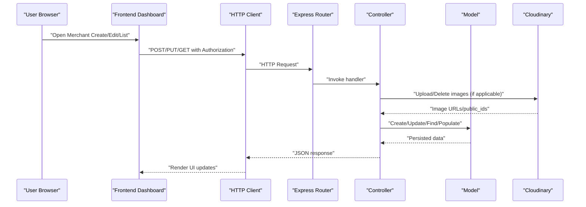

**Diagram sources**
- [merchantRouter.js:1-16](file://backend/router/merchantRouter.js#L1-L16)
- [merchantController.js:1-199](file://backend/controller/merchantController.js#L1-L199)
- [eventRouter.js:1-13](file://backend/router/eventRouter.js#L1-L13)
- [eventController.js:1-35](file://backend/controller/eventController.js#L1-L35)
- [eventSchema.js:1-23](file://backend/models/eventSchema.js#L1-L23)
- [registrationSchema.js:1-12](file://backend/models/registrationSchema.js#L1-L12)
- [cloudinary.js:1-112](file://backend/util/cloudinary.js#L1-L112)
- [http.js:1-5](file://frontend/src/lib/http.js#L1-L5)

## Detailed Component Analysis

### Event Model and Registration
- Event model enforces required title and optional fields for description, category, price, rating, images, features, and creator.
- Registration model links users to events for participant tracking.

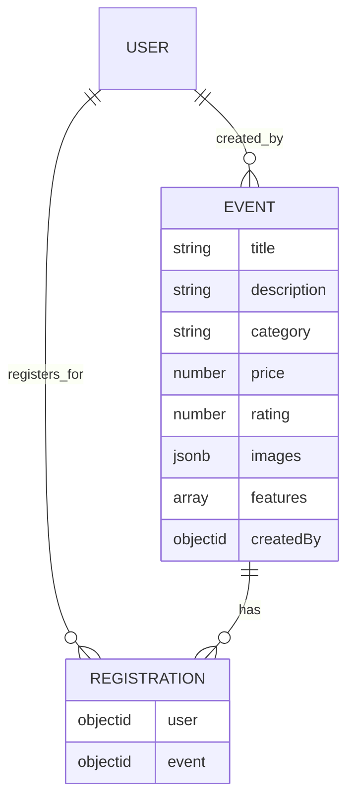

**Diagram sources**
- [eventSchema.js:1-23](file://backend/models/eventSchema.js#L1-L23)
- [registrationSchema.js:1-12](file://backend/models/registrationSchema.js#L1-L12)

**Section sources**
- [eventSchema.js:1-23](file://backend/models/eventSchema.js#L1-L23)
- [registrationSchema.js:1-12](file://backend/models/registrationSchema.js#L1-L12)

### Merchant Event Creation Workflow
- Frontend form collects title, description, category, price, rating, features, and images.
- Validation ensures title is present and at least one image is selected.
- Submission builds FormData and posts to merchant events endpoint.
- Backend validates presence of required fields, parses features, handles image uploads, and persists the event with the authenticated merchant as creator.

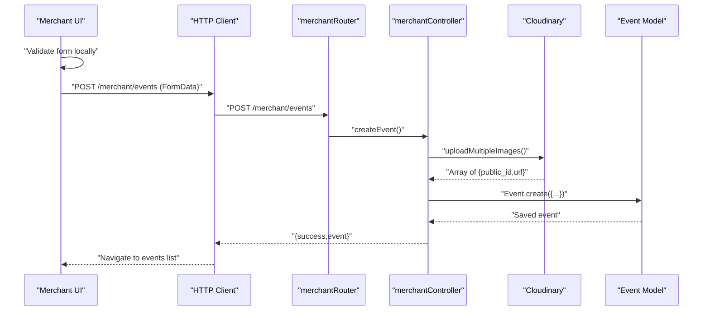

**Diagram sources**
- [MerchantCreateEvent.jsx:91-162](file://frontend/src/pages/dashboards/MerchantCreateEvent.jsx#L91-L162)
- [merchantRouter.js:9](file://backend/router/merchantRouter.js#L9)
- [merchantController.js:5-109](file://backend/controller/merchantController.js#L5-L109)
- [cloudinary.js:75-91](file://backend/util/cloudinary.js#L75-L91)
- [eventSchema.js:1-23](file://backend/models/eventSchema.js#L1-L23)

**Section sources**
- [MerchantCreateEvent.jsx:91-162](file://frontend/src/pages/dashboards/MerchantCreateEvent.jsx#L91-L162)
- [merchantRouter.js:9](file://backend/router/merchantRouter.js#L9)
- [merchantController.js:5-109](file://backend/controller/merchantController.js#L5-L109)
- [cloudinary.js:75-91](file://backend/util/cloudinary.js#L75-L91)
- [eventSchema.js:1-23](file://backend/models/eventSchema.js#L1-L23)

### Merchant Event Editing Workflow
- Frontend loads existing event data, supports adding/removing features, and uploading new images while preserving existing ones.
- Submission posts updated fields and new images; backend replaces images and updates event fields.
- Feature parsing supports JSON or comma-separated strings.

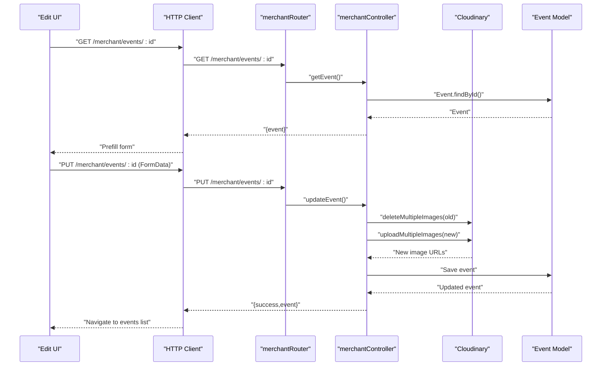

**Diagram sources**
- [MerchantEditEvent.jsx:29-180](file://frontend/src/pages/dashboards/MerchantEditEvent.jsx#L29-L180)
- [merchantRouter.js:10](file://backend/router/merchantRouter.js#L10)
- [merchantController.js:111-158](file://backend/controller/merchantController.js#L111-L158)
- [cloudinary.js:102-109](file://backend/util/cloudinary.js#L102-L109)
- [eventSchema.js:1-23](file://backend/models/eventSchema.js#L1-L23)

**Section sources**
- [MerchantEditEvent.jsx:29-180](file://frontend/src/pages/dashboards/MerchantEditEvent.jsx#L29-L180)
- [merchantRouter.js:10](file://backend/router/merchantRouter.js#L10)
- [merchantController.js:111-158](file://backend/controller/merchantController.js#L111-L158)
- [cloudinary.js:102-109](file://backend/util/cloudinary.js#L102-L109)
- [eventSchema.js:1-23](file://backend/models/eventSchema.js#L1-L23)

### Merchant Event Listing and Deletion
- Merchant dashboard lists owned events and allows deletion with confirmation.
- Backend enforces ownership checks before listing or deleting.

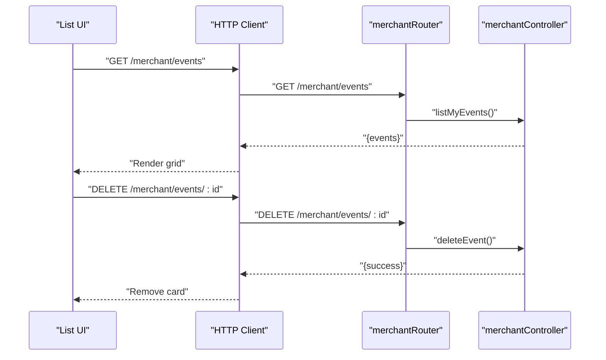

**Diagram sources**
- [MerchantEvents.jsx:17-42](file://frontend/src/pages/dashboards/MerchantEvents.jsx#L17-L42)
- [merchantRouter.js:11-13](file://backend/router/merchantRouter.js#L11-L13)
- [merchantController.js:160-169](file://backend/controller/merchantController.js#L160-L169)

**Section sources**
- [MerchantEvents.jsx:17-42](file://frontend/src/pages/dashboards/MerchantEvents.jsx#L17-L42)
- [merchantRouter.js:11-13](file://backend/router/merchantRouter.js#L11-L13)
- [merchantController.js:160-169](file://backend/controller/merchantController.js#L160-L169)

### Participant Management
- Merchant can view participants for a specific event, filtered by event ownership.
- Users can register for events; duplicate registrations are prevented.

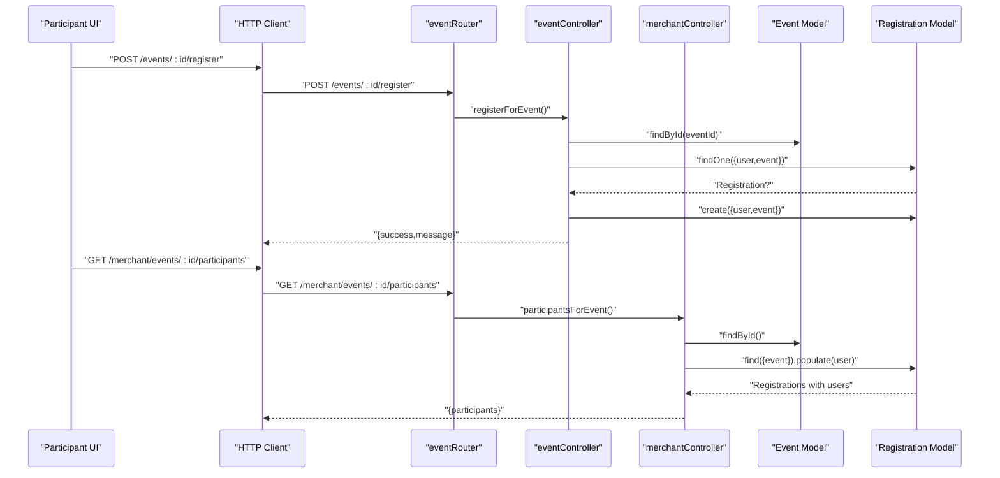

**Diagram sources**
- [eventRouter.js:9-10](file://backend/router/eventRouter.js#L9-L10)
- [eventController.js:13-25](file://backend/controller/eventController.js#L13-L25)
- [merchantRouter.js:13](file://backend/router/merchantRouter.js#L13)
- [merchantController.js:185-198](file://backend/controller/merchantController.js#L185-L198)
- [eventSchema.js:1-23](file://backend/models/eventSchema.js#L1-L23)
- [registrationSchema.js:1-12](file://backend/models/registrationSchema.js#L1-L12)

**Section sources**
- [eventRouter.js:9-10](file://backend/router/eventRouter.js#L9-L10)
- [eventController.js:13-25](file://backend/controller/eventController.js#L13-L25)
- [merchantRouter.js:13](file://backend/router/merchantRouter.js#L13)
- [merchantController.js:185-198](file://backend/controller/merchantController.js#L185-L198)
- [eventSchema.js:1-23](file://backend/models/eventSchema.js#L1-L23)
- [registrationSchema.js:1-12](file://backend/models/registrationSchema.js#L1-L12)

### Visibility Controls and Moderation
- Ownership enforcement: Only the event creator can edit/get/delete events and view participants.
- Approval workflows: Separate from basic event CRUD; merchant approval triggers payment and confirmation for certain event types (as implemented in the booking system).
- Admin oversight: Admins can list all events and delete events.

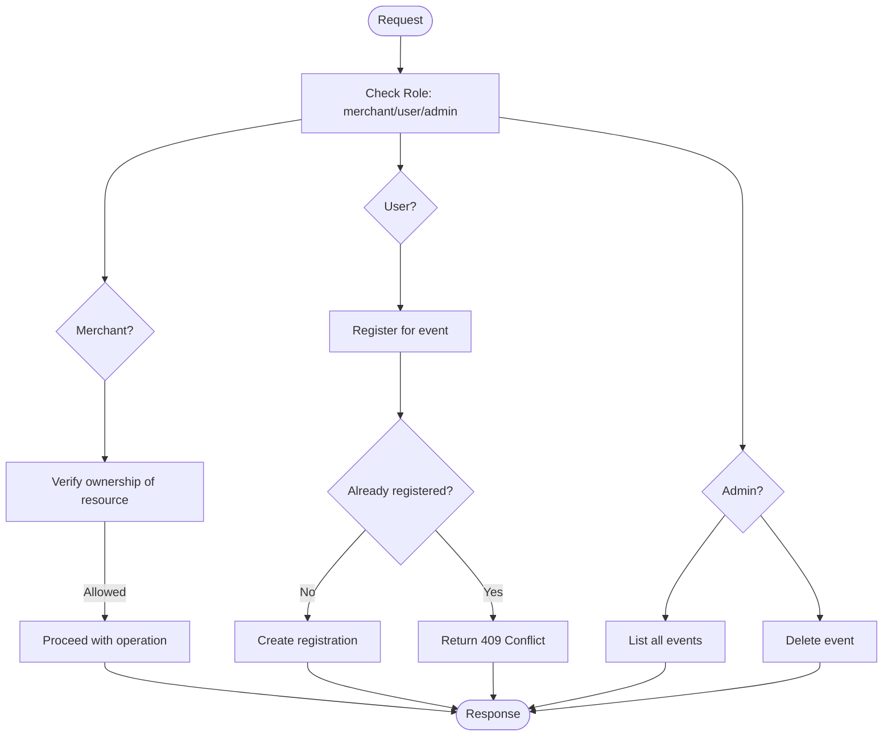

**Diagram sources**
- [merchantController.js:111-198](file://backend/controller/merchantController.js#L111-L198)
- [eventController.js:13-25](file://backend/controller/eventController.js#L13-L25)
- [adminRouter.js:23-24](file://backend/router/adminRouter.js#L23-L24)

**Section sources**
- [merchantController.js:111-198](file://backend/controller/merchantController.js#L111-L198)
- [eventController.js:13-25](file://backend/controller/eventController.js#L13-L25)
- [adminRouter.js:23-24](file://backend/router/adminRouter.js#L23-L24)

### Event Search and Filtering (User Perspective)
- Users can browse events with search by title/description/location and filter by category and date range.
- Local storage supports saving favorite events.

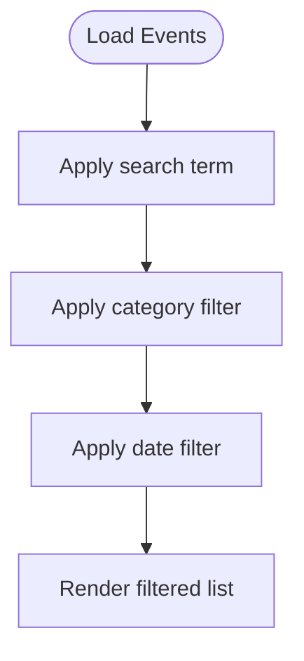

**Diagram sources**
- [UserBrowseEvents.jsx:24-119](file://frontend/src/pages/dashboards/UserBrowseEvents.jsx#L24-L119)

**Section sources**
- [UserBrowseEvents.jsx:24-119](file://frontend/src/pages/dashboards/UserBrowseEvents.jsx#L24-L119)

### Admin Event Oversight
- Admins can view all events in a table with key attributes and merchant info.

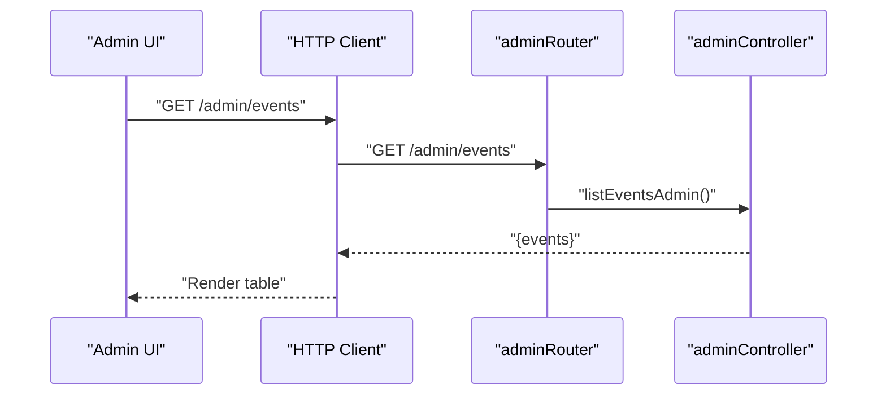

**Diagram sources**
- [AdminEvents.jsx:11-18](file://frontend/src/pages/dashboards/AdminEvents.jsx#L11-L18)
- [adminRouter.js:23](file://backend/router/adminRouter.js#L23)

**Section sources**
- [AdminEvents.jsx:11-18](file://frontend/src/pages/dashboards/AdminEvents.jsx#L11-L18)
- [adminRouter.js:23](file://backend/router/adminRouter.js#L23)

## Dependency Analysis
- Frontend depends on HTTP client for base URL and auth headers.
- Merchant routes depend on Cloudinary upload middleware for image handling.
- Controllers depend on models and Cloudinary utilities.
- User registration depends on event existence and uniqueness constraints.

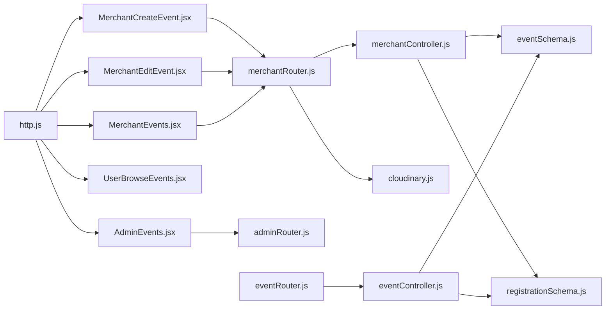

**Diagram sources**
- [http.js:1-5](file://frontend/src/lib/http.js#L1-L5)
- [merchantRouter.js:1-16](file://backend/router/merchantRouter.js#L1-L16)
- [merchantController.js:1-199](file://backend/controller/merchantController.js#L1-L199)
- [cloudinary.js:1-112](file://backend/util/cloudinary.js#L1-L112)
- [eventSchema.js:1-23](file://backend/models/eventSchema.js#L1-L23)
- [registrationSchema.js:1-12](file://backend/models/registrationSchema.js#L1-L12)
- [eventRouter.js:1-13](file://backend/router/eventRouter.js#L1-L13)
- [eventController.js:1-35](file://backend/controller/eventController.js#L1-L35)
- [adminRouter.js:1-29](file://backend/router/adminRouter.js#L1-L29)

**Section sources**
- [http.js:1-5](file://frontend/src/lib/http.js#L1-L5)
- [merchantRouter.js:1-16](file://backend/router/merchantRouter.js#L1-L16)
- [merchantController.js:1-199](file://backend/controller/merchantController.js#L1-L199)
- [cloudinary.js:1-112](file://backend/util/cloudinary.js#L1-L112)
- [eventSchema.js:1-23](file://backend/models/eventSchema.js#L1-L23)
- [registrationSchema.js:1-12](file://backend/models/registrationSchema.js#L1-L12)
- [eventRouter.js:1-13](file://backend/router/eventRouter.js#L1-L13)
- [eventController.js:1-35](file://backend/controller/eventController.js#L1-L35)
- [adminRouter.js:1-29](file://backend/router/adminRouter.js#L1-L29)

## Performance Considerations
- Image handling: Cloudinary upload and transformation reduce payload sizes and improve delivery; enforce 5MB per file and limit to 4 images per event.
- Pagination: Current listing endpoints return all records; consider implementing pagination for large datasets.
- Filtering: Client-side filtering is efficient for small lists; server-side filtering would improve performance at scale.
- Caching: Consider caching static assets and infrequently changing event lists.

[No sources needed since this section provides general guidance]

## Troubleshooting Guide
- Image upload failures: Verify Cloudinary credentials and network connectivity; check file types and sizes.
- Validation errors on creation/update: Ensure title is non-empty and at least one image is provided; features must be parseable as array.
- Ownership errors: Confirm the authenticated merchant matches the event creator; otherwise, requests return forbidden.
- Registration conflicts: Duplicate registrations return conflict; ensure users unregister or avoid re-registering.

**Section sources**
- [cloudinary.js:22-31](file://backend/util/cloudinary.js#L22-L31)
- [merchantController.js:32-36](file://backend/controller/merchantController.js#L32-L36)
- [merchantController.js:116-118](file://backend/controller/merchantController.js#L116-L118)
- [eventController.js:18-19](file://backend/controller/eventController.js#L18-L19)

## Conclusion
The merchant event management system provides a robust foundation for creating, editing, listing, and deleting events with strong validation, image handling, and participant management. Visibility and moderation are enforced via ownership checks and admin endpoints. User-facing search and filtering enable discovery, while separate approval workflows integrate with the broader booking system. Extending the system with server-side pagination, richer filters, and automated moderation could further enhance scalability and usability.

[No sources needed since this section summarizes without analyzing specific files]

## Appendices

### Step-by-Step: Create an Event
1. Navigate to the merchant create event page.
2. Fill in title, description, category, price, rating, and features.
3. Upload at least one image (up to 4 images, max 5MB each).
4. Submit the form; the system validates inputs and uploads images.
5. On success, the event appears in the merchant events list.

**Section sources**
- [MerchantCreateEvent.jsx:91-162](file://frontend/src/pages/dashboards/MerchantCreateEvent.jsx#L91-L162)
- [merchantController.js:5-109](file://backend/controller/merchantController.js#L5-L109)
- [cloudinary.js:75-91](file://backend/util/cloudinary.js#L75-L91)

### Step-by-Step: Edit an Event
1. Open the merchant events list and select Edit for the target event.
2. Modify fields and optionally replace/add images.
3. Submit the form; the system replaces old images and saves changes.
4. On success, the updated event displays in the list.

**Section sources**
- [MerchantEditEvent.jsx:29-180](file://frontend/src/pages/dashboards/MerchantEditEvent.jsx#L29-L180)
- [merchantController.js:111-158](file://backend/controller/merchantController.js#L111-L158)
- [cloudinary.js:102-109](file://backend/util/cloudinary.js#L102-L109)

### Step-by-Step: Manage Participants
1. From the merchant events list, open the event details page.
2. View the participant list; each registration includes user details.
3. Use this to communicate with attendees or manage capacity.

**Section sources**
- [merchantController.js:185-198](file://backend/controller/merchantController.js#L185-L198)
- [registrationSchema.js:1-12](file://backend/models/registrationSchema.js#L1-L12)

### Step-by-Step: Search and Filter Events (User)
1. Open the user browse events page.
2. Enter a search term to filter by title/description/location.
3. Choose a category and date range to refine results.
4. Save favorites to local storage for quick access.

**Section sources**
- [UserBrowseEvents.jsx:24-119](file://frontend/src/pages/dashboards/UserBrowseEvents.jsx#L24-L119)

### Step-by-Step: Admin Oversight
1. Access the admin events page.
2. Review all events with key details and merchant information.
3. Use this view to monitor content and take action if needed.

**Section sources**
- [AdminEvents.jsx:11-18](file://frontend/src/pages/dashboards/AdminEvents.jsx#L11-L18)
- [adminRouter.js:23](file://backend/router/adminRouter.js#L23)