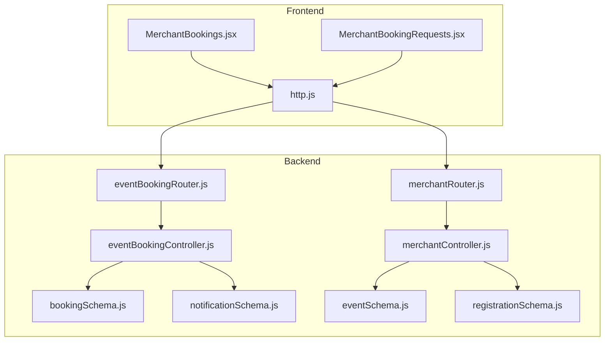
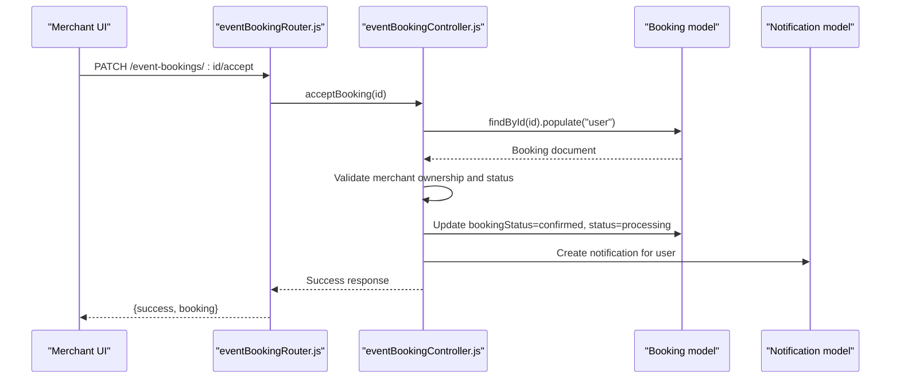
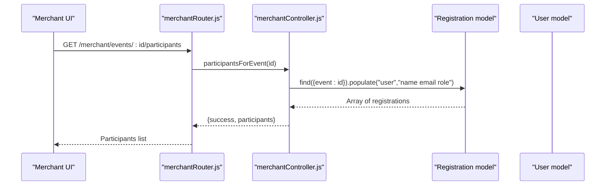
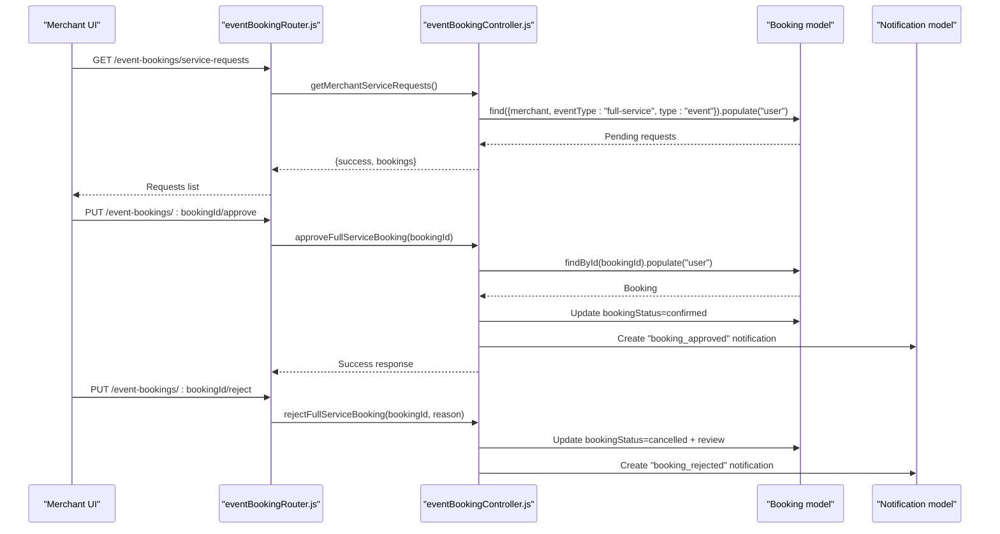
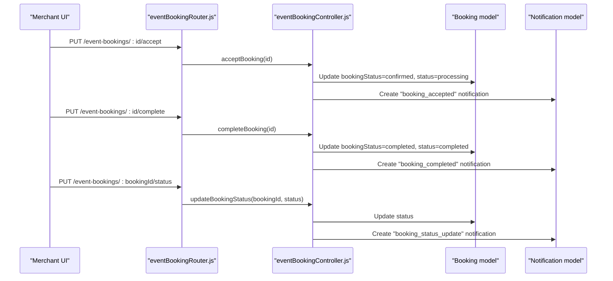
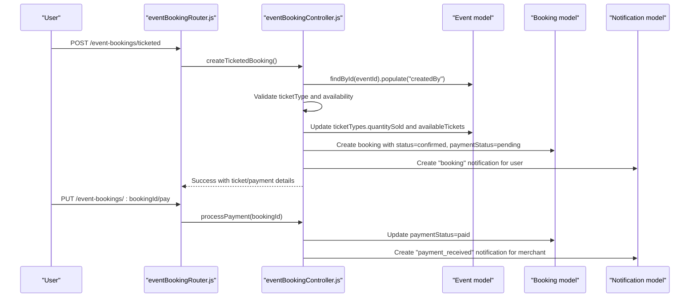
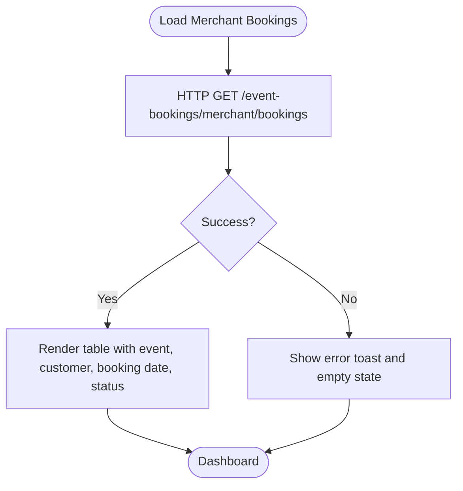
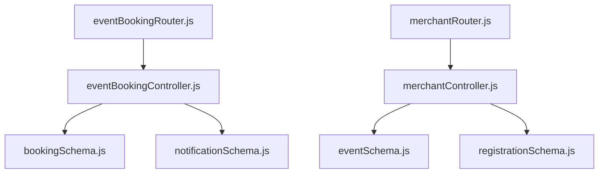

# Event Participant Management

<cite>
**Referenced Files in This Document**
- [merchantController.js](file://backend/controller/merchantController.js)
- [eventBookingController.js](file://backend/controller/eventBookingController.js)
- [bookingController.js](file://backend/controller/bookingController.js)
- [merchantRouter.js](file://backend/router/merchantRouter.js)
- [eventBookingRouter.js](file://backend/router/eventBookingRouter.js)
- [bookingSchema.js](file://backend/models/bookingSchema.js)
- [eventSchema.js](file://backend/models/eventSchema.js)
- [registrationSchema.js](file://backend/models/registrationSchema.js)
- [notificationSchema.js](file://backend/models/notificationSchema.js)
- [MerchantBookings.jsx](file://frontend/src/pages/dashboards/MerchantBookings.jsx)
- [MerchantBookingRequests.jsx](file://frontend/src/pages/dashboards/MerchantBookingRequests.jsx)
- [http.js](file://frontend/src/lib/http.js)
</cite>

## Table of Contents
1. [Introduction](#introduction)
2. [Project Structure](#project-structure)
3. [Core Components](#core-components)
4. [Architecture Overview](#architecture-overview)
5. [Detailed Component Analysis](#detailed-component-analysis)
6. [Dependency Analysis](#dependency-analysis)
7. [Performance Considerations](#performance-considerations)
8. [Troubleshooting Guide](#troubleshooting-guide)
9. [Conclusion](#conclusion)

## Introduction
This document explains the merchant participant management workflows for event bookings. It covers how merchants view, manage, and interact with event participants, including booking listing, participant details, status management, approval/rejection flows, and communication via notifications. It also documents filtering/sorting, bulk actions, cancellation/rescheduling handling, participant analytics, attendance tracking, and export capabilities.

## Project Structure
The system is a MERN stack application with clear separation between backend controllers, routers, models, and frontend dashboards:
- Backend controllers implement merchant-specific booking workflows and participant queries
- Routers expose REST endpoints for merchant actions
- Models define booking, event, and registration schemas
- Frontend dashboards render booking lists and enable merchant actions

**Diagram sources**
- [MerchantBookings.jsx:1-86](file://frontend/src/pages/dashboards/MerchantBookings.jsx#L1-L86)
- [MerchantBookingRequests.jsx:1-294](file://frontend/src/pages/dashboards/MerchantBookingRequests.jsx#L1-L294)
- [http.js:1-5](file://frontend/src/lib/http.js#L1-L5)
- [eventBookingRouter.js:1-47](file://backend/router/eventBookingRouter.js#L1-L47)
- [merchantRouter.js:1-17](file://backend/router/merchantRouter.js#L1-L17)
- [eventBookingController.js:1-1607](file://backend/controller/eventBookingController.js#L1-L1607)
- [merchantController.js:1-209](file://backend/controller/merchantController.js#L1-L209)
- [bookingSchema.js:1-53](file://backend/models/bookingSchema.js#L1-L53)
- [eventSchema.js:1-51](file://backend/models/eventSchema.js#L1-L51)
- [registrationSchema.js:1-12](file://backend/models/registrationSchema.js#L1-L12)
- [notificationSchema.js:1-36](file://backend/models/notificationSchema.js#L1-L36)

**Section sources**
- [merchantController.js:1-209](file://backend/controller/merchantController.js#L1-L209)
- [eventBookingController.js:1-1607](file://backend/controller/eventBookingController.js#L1-L1607)
- [merchantRouter.js:1-17](file://backend/router/merchantRouter.js#L1-L17)
- [eventBookingRouter.js:1-47](file://backend/router/eventBookingRouter.js#L1-L47)
- [bookingSchema.js:1-53](file://backend/models/bookingSchema.js#L1-L53)
- [eventSchema.js:1-51](file://backend/models/eventSchema.js#L1-L51)
- [registrationSchema.js:1-12](file://backend/models/registrationSchema.js#L1-L12)
- [notificationSchema.js:1-36](file://backend/models/notificationSchema.js#L1-L36)
- [MerchantBookings.jsx:1-86](file://frontend/src/pages/dashboards/MerchantBookings.jsx#L1-L86)
- [MerchantBookingRequests.jsx:1-294](file://frontend/src/pages/dashboards/MerchantBookingRequests.jsx#L1-L294)
- [http.js:1-5](file://frontend/src/lib/http.js#L1-L5)

## Core Components
- Merchant participant listing: Merchant can list participants for their events via a dedicated endpoint
- Booking management: Merchants can accept/reject bookings, mark as completed, update status, and process payments
- Approval workflow: Full-service events require merchant approval; ticketed events auto-confirm upon payment
- Communication: Notifications are created for users on status changes and approvals
- Analytics and exports: Merchant analytics dashboard aggregates earnings and booking metrics

Key backend endpoints:
- Merchant participant listing: GET `/merchant/events/:id/participants`
- Merchant booking listing: GET `/event-bookings/merchant/bookings`
- Booking actions: PUT `/event-bookings/:id/accept`, PUT `/event-bookings/:id/reject`, PUT `/event-bookings/:id/complete`, PUT `/event-bookings/:bookingId/status`
- Service requests: GET `/event-bookings/service-requests`, PUT `/event-bookings/:bookingId/approve`, PUT `/event-bookings/:bookingId/reject`
- Payment processing: PUT `/event-bookings/:bookingId/pay`

Frontend dashboards:
- MerchantBookings: Lists confirmed bookings with event/customer details
- MerchantBookingRequests: Shows pending full-service requests with accept/reject actions

**Section sources**
- [merchantController.js:174-187](file://backend/controller/merchantController.js#L174-L187)
- [eventBookingRouter.js:36-46](file://backend/router/eventBookingRouter.js#L36-L46)
- [eventBookingController.js:894-1093](file://backend/controller/eventBookingController.js#L894-L1093)
- [MerchantBookings.jsx:14-27](file://frontend/src/pages/dashboards/MerchantBookings.jsx#L14-L27)
- [MerchantBookingRequests.jsx:15-29](file://frontend/src/pages/dashboards/MerchantBookingRequests.jsx#L15-L29)

## Architecture Overview
The merchant participant management architecture follows a layered pattern:
- Frontend dashboards call backend endpoints secured by authentication and role middleware
- Controllers orchestrate business logic, validate inputs, and interact with models
- Models define schemas for bookings, events, registrations, and notifications
- Routers define REST endpoints and route to appropriate controllers

**Diagram sources**
- [eventBookingRouter.js:39-39](file://backend/router/eventBookingRouter.js#L39-L39)
- [eventBookingController.js:894-958](file://backend/controller/eventBookingController.js#L894-L958)
- [notificationSchema.js:1-36](file://backend/models/notificationSchema.js#L1-L36)

**Section sources**
- [eventBookingRouter.js:1-47](file://backend/router/eventBookingRouter.js#L1-L47)
- [eventBookingController.js:894-1093](file://backend/controller/eventBookingController.js#L894-L1093)
- [notificationSchema.js:1-36](file://backend/models/notificationSchema.js#L1-L36)

## Detailed Component Analysis

### Merchant Participant Listing
Merchants can view participants registered for their events. The controller validates ownership and returns user details alongside event registrations.

**Diagram sources**
- [merchantRouter.js:13-13](file://backend/router/merchantRouter.js#L13-L13)
- [merchantController.js:174-187](file://backend/controller/merchantController.js#L174-L187)
- [registrationSchema.js:1-12](file://backend/models/registrationSchema.js#L1-L12)

**Section sources**
- [merchantController.js:174-187](file://backend/controller/merchantController.js#L174-L187)
- [merchantRouter.js:13-13](file://backend/router/merchantRouter.js#L13-L13)
- [registrationSchema.js:1-12](file://backend/models/registrationSchema.js#L1-L12)

### Booking Approval Workflow (Full-Service Events)
Full-service events require merchant approval. Pending requests are listed for the merchant, who can approve or reject with optional reasons.

**Diagram sources**
- [eventBookingRouter.js:37-43](file://backend/router/eventBookingRouter.js#L37-L43)
- [eventBookingController.js:764-793](file://backend/controller/eventBookingController.js#L764-L793)
- [eventBookingController.js:636-699](file://backend/controller/eventBookingController.js#L636-L699)
- [eventBookingController.js:702-761](file://backend/controller/eventBookingController.js#L702-L761)
- [notificationSchema.js:1-36](file://backend/models/notificationSchema.js#L1-L36)

**Section sources**
- [eventBookingController.js:764-793](file://backend/controller/eventBookingController.js#L764-L793)
- [eventBookingController.js:636-699](file://backend/controller/eventBookingController.js#L636-L699)
- [eventBookingController.js:702-761](file://backend/controller/eventBookingController.js#L702-L761)
- [eventBookingRouter.js:37-43](file://backend/router/eventBookingRouter.js#L37-L43)

### Booking Status Management and Completion
Merchants can update booking status and mark bookings as completed. Payment processing is handled separately.

**Diagram sources**
- [eventBookingRouter.js:39-45](file://backend/router/eventBookingRouter.js#L39-L45)
- [eventBookingController.js:894-958](file://backend/controller/eventBookingController.js#L894-L958)
- [eventBookingController.js:1029-1093](file://backend/controller/eventBookingController.js#L1029-L1093)
- [eventBookingController.js:1416-1499](file://backend/controller/eventBookingController.js#L1416-L1499)
- [notificationSchema.js:1-36](file://backend/models/notificationSchema.js#L1-L36)

**Section sources**
- [eventBookingController.js:894-958](file://backend/controller/eventBookingController.js#L894-L958)
- [eventBookingController.js:1029-1093](file://backend/controller/eventBookingController.js#L1029-L1093)
- [eventBookingController.js:1416-1499](file://backend/controller/eventBookingController.js#L1416-L1499)
- [eventBookingRouter.js:39-45](file://backend/router/eventBookingRouter.js#L39-L45)

### Ticketed Event Booking and Payment
Ticketed events auto-confirm upon payment. The system validates ticket availability, applies coupons, and manages ticket counts.

**Diagram sources**
- [eventBookingRouter.js:29-33](file://backend/router/eventBookingRouter.js#L29-L33)
- [eventBookingController.js:322-589](file://backend/controller/eventBookingController.js#L322-L589)
- [eventBookingController.js:1096-1159](file://backend/controller/eventBookingController.js#L1096-L1159)
- [eventSchema.js:1-51](file://backend/models/eventSchema.js#L1-L51)
- [notificationSchema.js:1-36](file://backend/models/notificationSchema.js#L1-L36)

**Section sources**
- [eventBookingController.js:322-589](file://backend/controller/eventBookingController.js#L322-L589)
- [eventBookingController.js:1096-1159](file://backend/controller/eventBookingController.js#L1096-L1159)
- [eventSchema.js:1-51](file://backend/models/eventSchema.js#L1-L51)

### Merchant Booking Dashboard
The merchant booking dashboard lists confirmed bookings with event/customer details and status indicators.

**Diagram sources**
- [MerchantBookings.jsx:14-27](file://frontend/src/pages/dashboards/MerchantBookings.jsx#L14-L27)
- [http.js:1-5](file://frontend/src/lib/http.js#L1-L5)

**Section sources**
- [MerchantBookings.jsx:1-86](file://frontend/src/pages/dashboards/MerchantBookings.jsx#L1-L86)
- [http.js:1-5](file://frontend/src/lib/http.js#L1-L5)

### Participant Filtering and Sorting
- Filtering: Merchant endpoints filter by merchant ID, event type, and status (e.g., pending, confirmed, completed)
- Sorting: Results are sorted by creation date descending for recent-first views
- Pagination: Not implemented in current controllers; consider adding limit/skip for large datasets

**Section sources**
- [eventBookingController.js:1271-1291](file://backend/controller/eventBookingController.js#L1271-L1291)
- [eventBookingController.js:764-793](file://backend/controller/eventBookingController.js#L764-L793)

### Bulk Actions
- Current implementation supports per-item actions: accept, reject, complete, update status
- Bulk actions (e.g., batch accept/reject) are not implemented; consider adding endpoints for array-based operations

**Section sources**
- [eventBookingRouter.js:39-45](file://backend/router/eventBookingRouter.js#L39-L45)
- [eventBookingController.js:894-1093](file://backend/controller/eventBookingController.js#L894-L1093)

### Cancellations and Rescheduling
- Cancellations: Implemented for generic service bookings via user-side cancellation; merchant-side cancellation logic is not exposed in the reviewed controllers
- Rescheduling: Not implemented in the reviewed controllers; consider adding endpoints to update service dates and notify users

**Section sources**
- [bookingController.js:125-171](file://backend/controller/bookingController.js#L125-L171)

### Participant Communication Features
- Notifications: Created for booking approvals, rejections, status updates, payments, and completions
- Channels: Email/SMS integrations are not implemented in the reviewed code; notifications are stored in MongoDB

**Section sources**
- [eventBookingController.js:288-299](file://backend/controller/eventBookingController.js#L288-L299)
- [eventBookingController.js:673-682](file://backend/controller/eventBookingController.js#L673-L682)
- [eventBookingController.js:1454-1482](file://backend/controller/eventBookingController.js#L1454-L1482)
- [eventBookingController.js:1132-1142](file://backend/controller/eventBookingController.js#L1132-L1142)
- [notificationSchema.js:1-36](file://backend/models/notificationSchema.js#L1-L36)

### Participant Analytics and Attendance Tracking
- Analytics: Merchant analytics dashboard aggregates earnings and booking counts
- Attendance: Not tracked in the reviewed code; consider adding attendance fields to booking schema and UI

**Section sources**
- [MerchantBookings.jsx:1-86](file://frontend/src/pages/dashboards/MerchantBookings.jsx#L1-L86)

### Export Capabilities
- Export: Not implemented in the reviewed controllers; consider adding CSV/PDF export endpoints for bookings and participant lists

**Section sources**
- [eventBookingController.js:1271-1364](file://backend/controller/eventBookingController.js#L1271-L1364)

## Dependency Analysis

**Diagram sources**
- [eventBookingController.js:1-1607](file://backend/controller/eventBookingController.js#L1-L1607)
- [merchantController.js:1-209](file://backend/controller/merchantController.js#L1-L209)
- [eventBookingRouter.js:1-47](file://backend/router/eventBookingRouter.js#L1-L47)
- [merchantRouter.js:1-17](file://backend/router/merchantRouter.js#L1-L17)
- [bookingSchema.js:1-53](file://backend/models/bookingSchema.js#L1-L53)
- [eventSchema.js:1-51](file://backend/models/eventSchema.js#L1-L51)
- [registrationSchema.js:1-12](file://backend/models/registrationSchema.js#L1-L12)
- [notificationSchema.js:1-36](file://backend/models/notificationSchema.js#L1-L36)

**Section sources**
- [eventBookingController.js:1-1607](file://backend/controller/eventBookingController.js#L1-L1607)
- [merchantController.js:1-209](file://backend/controller/merchantController.js#L1-L209)
- [eventBookingRouter.js:1-47](file://backend/router/eventBookingRouter.js#L1-L47)
- [merchantRouter.js:1-17](file://backend/router/merchantRouter.js#L1-L17)

## Performance Considerations
- Indexing: Add indexes on frequently queried fields (merchant, user, eventId, bookingStatus, paymentStatus, createdAt)
- Pagination: Implement limit/skip for large booking lists to avoid memory pressure
- Population: Limit populated fields to reduce payload sizes
- Caching: Cache participant counts and event summaries for dashboard rendering

## Troubleshooting Guide
Common issues and resolutions:
- Authentication failures: Ensure Bearer token is included in Authorization header
- Forbidden access: Merchant endpoints require merchant role; verify user role
- Booking not found: Confirm booking ID and ownership checks
- Invalid status transitions: Only valid status transitions are permitted
- Payment already processed: Cannot process payment for already-paid bookings

**Section sources**
- [eventBookingController.js:900-958](file://backend/controller/eventBookingController.js#L900-L958)
- [eventBookingController.js:1416-1499](file://backend/controller/eventBookingController.js#L1416-L1499)
- [eventBookingController.js:1096-1159](file://backend/controller/eventBookingController.js#L1096-L1159)

## Conclusion
The merchant participant management system provides robust booking workflows for both full-service and ticketed events. Merchants can approve/reject requests, manage statuses, process payments, and communicate via notifications. Enhancements such as bulk actions, export capabilities, attendance tracking, and rescheduling would further strengthen the platform.