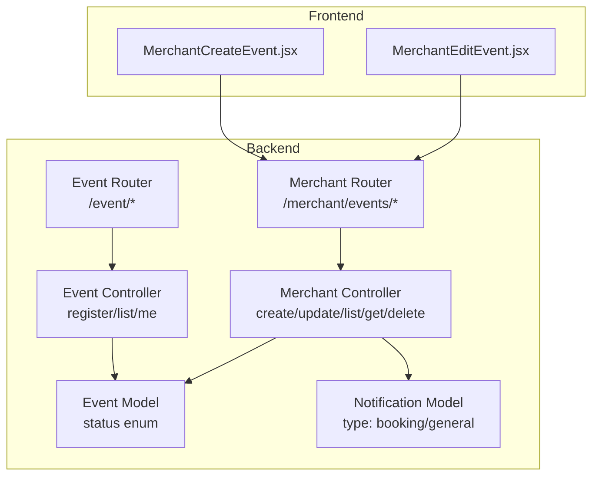
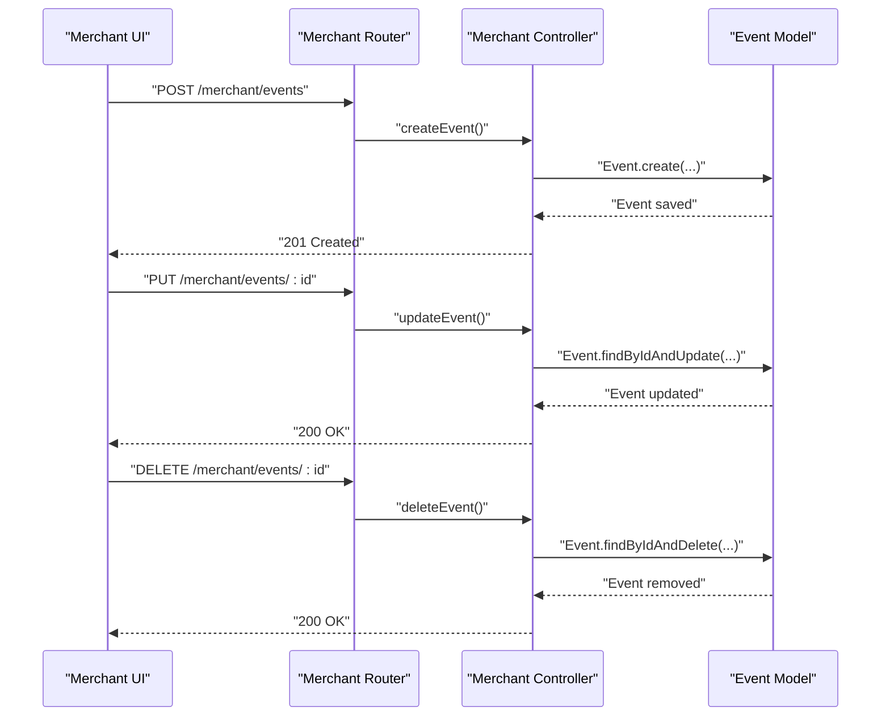
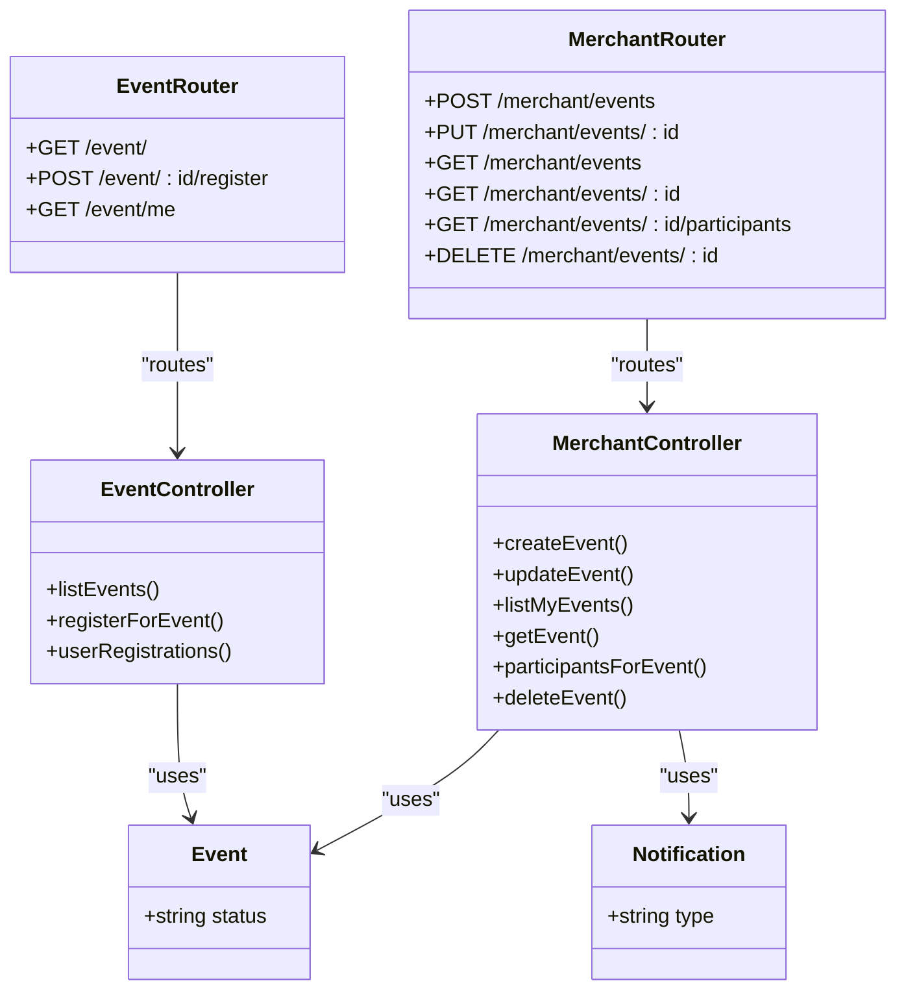

# Event Status Control

<cite>
**Referenced Files in This Document**
- [eventSchema.js](file://backend/models/eventSchema.js)
- [merchantController.js](file://backend/controller/merchantController.js)
- [merchantRouter.js](file://backend/router/merchantRouter.js)
- [eventController.js](file://backend/controller/eventController.js)
- [eventRouter.js](file://backend/router/eventRouter.js)
- [notificationSchema.js](file://backend/models/notificationSchema.js)
- [MerchantCreateEvent.jsx](file://frontend/src/pages/dashboards/MerchantCreateEvent.jsx)
- [MerchantEditEvent.jsx](file://frontend/src/pages/dashboards/MerchantEditEvent.jsx)
</cite>

## Table of Contents
1. [Introduction](#introduction)
2. [Project Structure](#project-structure)
3. [Core Components](#core-components)
4. [Architecture Overview](#architecture-overview)
5. [Detailed Component Analysis](#detailed-component-analysis)
6. [Dependency Analysis](#dependency-analysis)
7. [Performance Considerations](#performance-considerations)
8. [Troubleshooting Guide](#troubleshooting-guide)
9. [Conclusion](#conclusion)

## Introduction
This document explains the event status control and lifecycle management in the system. It covers how events move through statuses, who can change them, and how visibility and participant communications are handled. It also documents merchant capabilities to pause/resume/cancel/delete events, the impact on bookings, and automated behaviors such as completion triggers. Guidance is included for archiving/restoration and status change notifications.

## Project Structure
The event lifecycle spans backend models/controllers/routers and frontend dashboards:
- Backend models define event schema and status fields.
- Backend controllers expose merchant endpoints to manage events and user registration.
- Backend routers bind endpoints to controllers.
- Frontend dashboards provide merchant UI for creating/editing events.

**Diagram sources**
- [eventSchema.js:29](file://backend/models/eventSchema.js#L29)
- [merchantController.js:5-209](file://backend/controller/merchantController.js#L5-L209)
- [merchantRouter.js:9-14](file://backend/router/merchantRouter.js#L9-L14)
- [eventController.js:4-35](file://backend/controller/eventController.js#L4-L35)
- [eventRouter.js:8-10](file://backend/router/eventRouter.js#L8-L10)
- [notificationSchema.js:26-30](file://backend/models/notificationSchema.js#L26-L30)
- [MerchantCreateEvent.jsx:145-204](file://frontend/src/pages/dashboards/MerchantCreateEvent.jsx#L145-L204)
- [MerchantEditEvent.jsx:127-180](file://frontend/src/pages/dashboards/MerchantEditEvent.jsx#L127-L180)

**Section sources**
- [eventSchema.js:29](file://backend/models/eventSchema.js#L29)
- [merchantController.js:5-209](file://backend/controller/merchantController.js#L5-L209)
- [merchantRouter.js:9-14](file://backend/router/merchantRouter.js#L9-L14)
- [eventController.js:4-35](file://backend/controller/eventController.js#L4-L35)
- [eventRouter.js:8-10](file://backend/router/eventRouter.js#L8-L10)
- [notificationSchema.js:26-30](file://backend/models/notificationSchema.js#L26-L30)
- [MerchantCreateEvent.jsx:145-204](file://frontend/src/pages/dashboards/MerchantCreateEvent.jsx#L145-L204)
- [MerchantEditEvent.jsx:127-180](file://frontend/src/pages/dashboards/MerchantEditEvent.jsx#L127-L180)

## Core Components
- Event model defines the status field with allowed values and default.
- Merchant endpoints support creation, updates, listing, retrieval, participant listing, and deletion.
- Event registration endpoint allows users to register for events.
- Notification model supports booking/general notifications.

Key implementation references:
- Event status enum and defaults: [eventSchema.js:29](file://backend/models/eventSchema.js#L29)
- Merchant create/update/delete/list/get/participants endpoints: [merchantController.js:5-209](file://backend/controller/merchantController.js#L5-L209)
- Merchant routes binding: [merchantRouter.js:9-14](file://backend/router/merchantRouter.js#L9-L14)
- Event registration and listing endpoints: [eventController.js:4-35](file://backend/controller/eventController.js#L4-L35)
- Event routes binding: [eventRouter.js:8-10](file://backend/router/eventRouter.js#L8-L10)
- Notification types: [notificationSchema.js:26-30](file://backend/models/notificationSchema.js#L26-L30)

**Section sources**
- [eventSchema.js:29](file://backend/models/eventSchema.js#L29)
- [merchantController.js:5-209](file://backend/controller/merchantController.js#L5-L209)
- [merchantRouter.js:9-14](file://backend/router/merchantRouter.js#L9-L14)
- [eventController.js:4-35](file://backend/controller/eventController.js#L4-L35)
- [eventRouter.js:8-10](file://backend/router/eventRouter.js#L8-L10)
- [notificationSchema.js:26-30](file://backend/models/notificationSchema.js#L26-L30)

## Architecture Overview
The event lifecycle is controlled by:
- Merchant actions (create, update, delete) affecting event visibility and availability.
- User registration for events.
- Notifications for booking and general events.
- No explicit status transition endpoints are present in the current backend; therefore, status changes are not exposed via API in this codebase.

**Diagram sources**
- [merchantRouter.js:9-14](file://backend/router/merchantRouter.js#L9-L14)
- [merchantController.js:5-209](file://backend/controller/merchantController.js#L5-L209)
- [eventSchema.js:29](file://backend/models/eventSchema.js#L29)

**Section sources**
- [merchantRouter.js:9-14](file://backend/router/merchantRouter.js#L9-L14)
- [merchantController.js:5-209](file://backend/controller/merchantController.js#L5-L209)
- [eventSchema.js:29](file://backend/models/eventSchema.js#L29)

## Detailed Component Analysis

### Event Status Field and Lifecycle
- The event model defines a status field with allowed values and a default.
- Current allowed values include active, inactive, completed.
- Default status is active.

Implications:
- Events start as active by default.
- There are no merchant endpoints to explicitly set inactive or completed.
- There are no user-facing status transitions in the current code.

References:
- [eventSchema.js:29](file://backend/models/eventSchema.js#L29)

**Section sources**
- [eventSchema.js:29](file://backend/models/eventSchema.js#L29)

### Merchant Event Management
- Create event: Validates inputs, parses features/addons/ticket types, calculates totals, uploads images, and persists the event.
- Update event: Allows editing title, description, category, price, rating, features, and images.
- List my events: Returns events owned by the merchant.
- Get event: Returns a single event owned by the merchant.
- Participants for event: Lists registrations for the merchant’s own event.
- Delete event: Removes the event and associated images.

References:
- [merchantController.js:5-209](file://backend/controller/merchantController.js#L5-L209)

**Section sources**
- [merchantController.js:5-209](file://backend/controller/merchantController.js#L5-L209)

### User Registration Workflow
- Users can register for events via a dedicated endpoint.
- Duplicate registrations are prevented.
- Registration records are stored separately from events.

References:
- [eventController.js:13-25](file://backend/controller/eventController.js#L13-L25)
- [eventRouter.js:9-10](file://backend/router/eventRouter.js#L9-L10)

**Section sources**
- [eventController.js:13-25](file://backend/controller/eventController.js#L13-L25)
- [eventRouter.js:9-10](file://backend/router/eventRouter.js#L9-L10)

### Notifications for Events
- Notification model supports types including booking and general.
- This enables targeted notifications for booking-related events.

References:
- [notificationSchema.js:26-30](file://backend/models/notificationSchema.js#L26-L30)

**Section sources**
- [notificationSchema.js:26-30](file://backend/models/notificationSchema.js#L26-L30)

### Frontend Merchant Dashboards
- Create event page collects title, description, category, pricing, location, schedule, ticket types, addons, and images; submits to backend.
- Edit event page loads existing event data, allows edits to title, description, category, price, rating, features, and images; submits updates.

References:
- [MerchantCreateEvent.jsx:145-204](file://frontend/src/pages/dashboards/MerchantCreateEvent.jsx#L145-L204)
- [MerchantEditEvent.jsx:127-180](file://frontend/src/pages/dashboards/MerchantEditEvent.jsx#L127-L180)

**Section sources**
- [MerchantCreateEvent.jsx:145-204](file://frontend/src/pages/dashboards/MerchantCreateEvent.jsx#L145-L204)
- [MerchantEditEvent.jsx:127-180](file://frontend/src/pages/dashboards/MerchantEditEvent.jsx#L127-L180)

## Dependency Analysis
- Event model depends on Mongoose and defines the status enum.
- Merchant controller depends on the Event model and cloudinary utilities for image management.
- Merchant router binds merchant endpoints to the merchant controller.
- Event controller depends on the Event and Registration models.
- Event router binds event endpoints to the event controller.
- Notification model supports notification types.

**Diagram sources**
- [eventSchema.js:29](file://backend/models/eventSchema.js#L29)
- [merchantController.js:5-209](file://backend/controller/merchantController.js#L5-L209)
- [merchantRouter.js:9-14](file://backend/router/merchantRouter.js#L9-L14)
- [eventController.js:4-35](file://backend/controller/eventController.js#L4-L35)
- [eventRouter.js:8-10](file://backend/router/eventRouter.js#L8-L10)
- [notificationSchema.js:26-30](file://backend/models/notificationSchema.js#L26-L30)

**Section sources**
- [eventSchema.js:29](file://backend/models/eventSchema.js#L29)
- [merchantController.js:5-209](file://backend/controller/merchantController.js#L5-L209)
- [merchantRouter.js:9-14](file://backend/router/merchantRouter.js#L9-L14)
- [eventController.js:4-35](file://backend/controller/eventController.js#L4-L35)
- [eventRouter.js:8-10](file://backend/router/eventRouter.js#L8-L10)
- [notificationSchema.js:26-30](file://backend/models/notificationSchema.js#L26-L30)

## Performance Considerations
- Image uploads and deletions are handled via external storage; ensure efficient upload sizes and counts.
- Event listing queries should be indexed appropriately for date/time sorting.
- Registration lookups should leverage proper indexing on event/user fields.

[No sources needed since this section provides general guidance]

## Troubleshooting Guide
Common issues and resolutions:
- Event not found: Ensure the merchant ID matches the event owner for get/update/delete operations.
- Forbidden access: These endpoints require the merchant role and ownership verification.
- Unknown errors: Wrap controller logic with try/catch and return structured error responses.
- Validation errors: Creation/update endpoints validate inputs and return detailed messages.

References:
- [merchantController.js:100-172](file://backend/controller/merchantController.js#L100-L172)
- [merchantController.js:189-208](file://backend/controller/merchantController.js#L189-L208)
- [eventController.js:4-35](file://backend/controller/eventController.js#L4-L35)

**Section sources**
- [merchantController.js:100-172](file://backend/controller/merchantController.js#L100-L172)
- [merchantController.js:189-208](file://backend/controller/merchantController.js#L189-L208)
- [eventController.js:4-35](file://backend/controller/eventController.js#L4-L35)

## Conclusion
- The event status field exists with allowed values and a default, but explicit status transition endpoints are not exposed in the current backend.
- Merchant capabilities include creating, updating, listing, retrieving, listing participants, and deleting events.
- Users can register for events, and notifications support booking/general types.
- No automated status changes (e.g., completion based on dates/capacity) are implemented in the provided code.
- Guidance for archiving/restoration and status change notifications is not present in the current codebase.